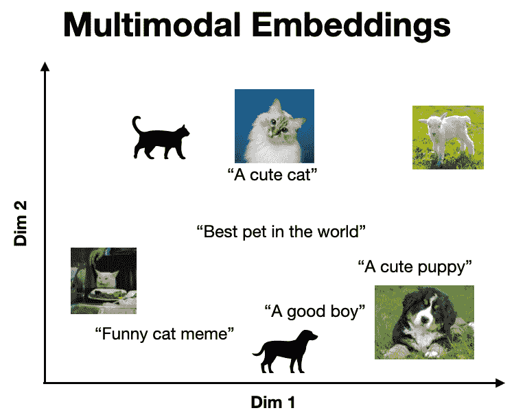
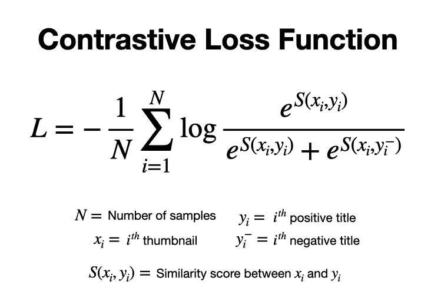

# 微调多模态嵌入模型

> 原文：[`towardsdatascience.com/fine-tuning-multimodal-embedding-models-bf007b1c5da5/`](https://towardsdatascience.com/fine-tuning-multimodal-embedding-models-bf007b1c5da5/)

这是关于[多模态 AI](https://shawhin.medium.com/list/multimodal-ai-fe9521d0e77a)的系列文章中的第 4 篇。在前一篇帖子中，我们讨论了[multimodal RAG](https://towardsdatascience.com/multimodal-rag-process-any-file-type-with-ai-e6921342c903)系统，该系统能够从不同的数据模态（例如文本、图像、音频）中检索和综合信息。在那里，我们看到了如何使用 CLIP 实现这样一个系统。然而，这种方法的一个问题是，通用嵌入模型（如 CLIP）的向量搜索结果**可能在特定领域的使用案例中表现不佳**。在这篇文章中，我将讨论我们如何通过微调多模态嵌入模型来减轻这些问题。


图片由[Markus Winkler](https://unsplash.com/@markuswinkler?utm_source=medium&utm_medium=referral)在[Unsplash](https://unsplash.com?utm_source=medium&utm_medium=referral)提供

* * *

**多模态嵌入**将多个数据模态表示在同一个向量空间中，使得相似的概念位于同一位置。下面是一个视觉示例，其中语义上**相似的项目**（例如，一张狗的图片及其相应的标题）**靠近**，而**不相似的项目**（例如，一张猫的图片和描述狗的标题）**相距较远**。



Canva 提供的库存照片。图片由作者提供。

一个流行的多模态嵌入模型是 CLIP，它使用[对比学习](https://towardsdatascience.com/multimodal-embeddings-an-introduction-5dc36975966f#09fe)在大量的图像-标题对语料库上进行了训练。**CLIP**的关键洞察力是，这样的模型**解锁了零样本能力，如图像分类、搜索和标题生成** [1]。

这里的一个局限性是，CLIP 的零样本能力**可能无法很好地转移到涉及专门信息的领域**，例如建筑图纸、医学影像和技术术语。在这种情况下，我们可以通过微调来提高 CLIP 的性能。

## **微调 CLIP**

微调涉及**通过额外的训练将模型适应特定的使用案例**。这很强大，因为它使我们能够基于现有的最先进模型，用相对较小的数据开发出强大的专用模型。

我们可以通过以下关键步骤使用 CLIP 来完成这项工作。

1.  收集文本-图像训练对

1.  预处理训练数据

1.  定义评估

1.  微调模型

1.  评估模型

我将根据具体示例讨论这些步骤。如果您对文本嵌入（即文本-文本对）的这种做法感兴趣，我之前在[博客文章](https://medium.com/@shawhin/fine-tuning-text-embeddings-f913b882b11c)中已经讨论过。

> [**针对特定领域搜索微调文本嵌入**](https://shawhin.medium.com/fine-tuning-text-embeddings-f913b882b11c)

## **示例：在 YouTube 标题和缩略图上微调 CLIP**

在这里，我将对我的[YouTube 频道](https://www.youtube.com/@ShawhinTalebi)中的标题和缩略图进行 CLIP 微调。完成之后，我们将有一个可以接受标题-缩略图对并返回相似度分数的模型。这可以用于实际应用，例如**将标题想法与现有的缩略图匹配**或**在缩略图库中进行搜索**。

[示例代码](https://github.com/ShawhinT/YouTube-Blog/tree/main/multimodal-ai/4-ft-mm-embeddings)，[数据集](https://huggingface.co/datasets/shawhin/yt-title-thumbnail-pairs)，和[微调模型](https://huggingface.co/shawhin/clip-title-thumbnail-embeddings)分别在 GitHub 和 Hugging Face Hub 上免费提供。您可以使用此代码和数据来训练自己的模型。如果您最终使用此数据集发表了任何工作，请引用原始来源 :)。

[GitHub 仓库](https://github.com/ShawhinT/YouTube-Blog/tree/main/multimodal-ai/4-ft-mm-embeddings) | [数据集](https://huggingface.co/datasets/shawhin/yt-title-thumbnail-pairs) | [微调模型](https://huggingface.co/shawhin/clip-title-thumbnail-embeddings)

* * *

## **步骤 1：收集文本-图像训练对**

任何微调过程的第一个（也是最重要的）步骤是数据收集。在这里，我通过两步过程从我的频道中提取了标题-缩略图对。

首先，我使用了 YouTube 的搜索 API 来**提取我频道上所有视频的视频 ID**。其次，我使用了 YouTube 的视频 API 来**提取我每个长视频（即超过 3 分钟的视频）的标题和缩略图 URL**。

```py
# imports
from top_secret import my_key
import requests
from isodate import parse_duration

import pandas as pd
import numpy as np
from sentence_transformers import SentenceTransformer
from datasets import DatasetDict, Dataset
```

```py
channel_id = 'UCa9gErQ9AE5jT2DZLjXBIdA' # my YouTube channel ID
page_token = None # initialize page token
url = 'https://www.googleapis.com/youtube/v3/search' # YouTube search API 

# extract video data across multiple search result pages
video_id_list = []

while page_token != 0:
    params = {
        "key": my_key, 
        'channelId': channel_id, 
        'part': ["snippet","id"], 
        'order': "date", 
        'maxResults':50, 
        'pageToken': page_token
    }
    response = requests.get(url, params=params)

    for raw_item in dict(response.json())['items']:

        # only execute for youtube videos
        if raw_item['id']['kind'] != "youtube#video":
            continue

        # grab video ids
        video_id_list.append(raw_item['id']['videoId'])

    try:
        # grab next page token
        page_token = dict(response.json())['nextPageToken']
    except:
        # if no next page token kill while loop
        page_token = 0
```

注意，您需要 YouTube API 密钥才能运行上述 Python 代码，您可以使用[Google Cloud Console](https://console.cloud.google.com/)创建它。为了适应您的频道，您只需更改 _channel*id*变量。

```py
# extract video titles and thumbnails
url = "https://www.googleapis.com/youtube/v3/videos"
video_data_list = []

for video_id in video_id_list:

    params = {
        "part": ["snippet","contentDetails"],
        "id": video_id,  
        "key": my_key,  
    }
    response = requests.get(url, params=params)

    raw_dict = dict(response.json())['items'][0]

    # only process videos longer than 3 minutes
    iso_duration = raw_dict['contentDetails']["duration"]
    if parse_duration(iso_duration).total_seconds() < 180:
        continue

    # extract video data
    video_data = {}
    video_data['video_id'] = video_id
    video_data['title'] = raw_dict['snippet']['title']
    video_data['thumbnail_url'] = raw_dict['snippet']['thumbnails']['high']['url']

    # append data to list
    video_data_list.append(video_data)
```

作为额外步骤，我**创建了负样本缩略图-标题对**。我们可以在训练过程中使用这些对，不仅用正例（即相似嵌入）引导模型，而且用负例（即不相似嵌入）来指导模型。

为了做到这一点，我使用 sentence transformer 库计算了所有可能的标题对之间的相似度。然后对于每个正对，我将最不相似的标题作为负例进行匹配（确保没有重复）。

```py
# store data in dataframe
df = pd.DataFrame(video_data_list)

# Load the model
model = SentenceTransformer("all-mpnet-base-v2")

# Encode all titles
embeddings = model.encode(df['title'].to_list())

# compute similarities
similarities = model.similarity(embeddings, embeddings)

# match least JDs least similar to positive match as the negative match
similarities_argsorted = np.argsort(similarities.numpy(), axis=1)
negative_pair_index_list = []

for i in range(len(similarities)):

    # Start with the smallest similarity index for the current row
    j = 0
    index = int(similarities_argsorted[i][j])

    # Ensure the index is unique
    while index in negative_pair_index_list:
        j += 1  # Move to the next smallest index
        index = int(similarities_argsorted[i][j])  # Fetch next smallest index

    negative_pair_index_list.append(index)

# add negative pairs to df
df['title_neg'] = df['title'].iloc[negative_pair_index_list].values
```

最后，我创建了**训练-验证-测试分割**并将数据集推送到 Hugging Face Hub。

```py
# Shuffle the dataset
df = df.sample(frac=1, random_state=42).reset_index(drop=True)

# Split into train, validation, and test sets
train_frac = 0.7
valid_frac = 0.15
test_frac = 0.15

# define train and validation size
train_size = int(train_frac * len(df))
valid_size = int(valid_frac * len(df))

# create train, validation, and test datasets
df_train = df[:train_size]
df_valid = df[train_size:train_size + valid_size]
df_test = df[train_size + valid_size:]

# Convert the pandas DataFrames back to Hugging Face Datasets
train_ds = Dataset.from_pandas(df_train)
valid_ds = Dataset.from_pandas(df_valid)
test_ds = Dataset.from_pandas(df_test)

# Combine into a DatasetDict
dataset_dict = DatasetDict({
    'train': train_ds,
    'valid': valid_ds,
    'test': test_ds
})
```

```py
# push data to hub
dataset_dict.push_to_hub("shawhin/yt-title-thumbnail-pairs")
```

## **步骤 2：预处理训练对**

尽管我们已经有所有用于微调所需的数据，但这仍然不是训练的合适格式。更具体地说，我们需要**将我们的图像 URL 转换为 PIL 图像对象**，并将我们的数据组织成（锚点，正样本，负样本）三元组，即分别是一个缩略图、其对应的标题和负标题。

我们可以使用 Hugging Face Datasets 库以以下方式处理所有三个数据集（即训练集、验证集和测试集）。

```py
from PIL import Image

# load dataset
dataset = load_dataset("shawhin/yt-title-thumbnail-pairs")

# define preprocessing function
def preprocess(batch):
    """
        Preprocessing data without augmentations for test set
    """
    # get images from urls
    image_list = [Image.open(requests.get(url, stream=True).raw) 
                      for url in batch["thumbnail_url"]]

    # return columns with standard names
    return {
        "anchor": image_list,       
        "positive": batch["title"],  
        "negative": batch["title_neg"]
    }

# remove columns not relevant to training
columns_to_remove = [col for col in dataset['train'].column_names 
                        if col not in ['anchor', 'positive', 'negative']]
# apply transformations
dataset = dataset.map(preprocess, batched=True, 
                         remove_columns=columns_to_remove)
```

我们必须以（锚点，正样本，负样本）三元组的形式排列我们的列，因为**这是我们将在训练期间使用的损失函数所期望的格式**（这是我通过艰难的方式学到的）。

## **第 3 步：定义评估**

训练涉及优化模型参数以最小化损失函数。然而，这个值（即对比损失）在**评估模型在下游任务上的性能**（例如匹配标题和缩略图）方面很少有帮助。

在这个情况下，一个更有洞察力的量是模型正确地将给定的缩略图与多个候选标题中的正确标题匹配的能力。这表示为**Recall@1**。

我们可以实现一个与 Sentence Transformers 库兼容的评估器来计算这个指标。由于代码相当长，我不会在这里粘贴，但好奇的读者可以在[这个笔记本](https://github.com/ShawhinT/YouTube-Blog/blob/main/multimodal-ai/4-ft-mm-embeddings/2-finetune_clip_sbert.ipynb)的第 12 个单元中找到它。

```py
# function to create new evaluator given data split
def create_recall_evaluator(set_name, k=1):
    """
        Create triplet evaluator for "train", "valid", or "test" split
    """

    return ImageTextRetrievalEvaluator(
        images=dataset[f"{set_name}"]["anchor"],
        texts=dataset[f"{set_name}"]["positive"],
        name=f"yt-title-thumbnail-{set_name}",
        k=k
    )

# Create new evaluator with Recall@k
evaluator_recall_train = create_recall_evaluator("train", k=1)
evaluator_recall_valid = create_recall_evaluator("valid", k=1)

print("Train:", evaluator_recall_train(model))
print("Valid:", evaluator_recall_valid(model))

# >> Train: {'yt-title-thumbnail-train_Recall@1': 0.660377358490566}
# >> Valid: {'yt-title-thumbnail-valid_Recall@1': 0.6363636363636364}
```

我们可以看到，模型已经具有相当不错的性能，正确匹配标题的准确率达到了 66%。

## **第 4 步：微调模型**

在训练模型之前，我们必须做**3 件关键的事情**。具体来说，选择要训练的参数，选择一个损失函数，并设置超参数。

### **可训练参数**

这个项目的关键限制是，我（在撰写本文时）只发布了 76 个 YouTube 视频。考虑到验证集和测试集的划分，这仅剩下**53 个示例用于训练**。

由于我们训练示例很少，**限制我们训练的参数数量是一个好主意**。在这种情况下，我只训练模型的最终投影层，该层将文本和图像嵌入映射到一个共享的向量空间。总共有大约 1 百万个参数。

```py
# import model
from sentence_transformers import SentenceTransformer
model = SentenceTransformer("sentence-transformers/clip-ViT-L-14")

# pick specific layers to train (note: you can add more layers to this list)
trainable_layers_list = ['projection']

# Apply freezing configuration
for name, param in model.named_parameters():

    # freeze all params
    param.requires_grad = False

    # unfreeze layers in trainable_layers_list
    if any(layer in name for layer in trainable_layers_list):
        param.requires_grad = True
```

```py
# Count total and trainable parameters
total_params = sum(p.numel() for p in model.parameters())
trainable_params = sum(p.numel() for p in model.parameters() if p.requires_grad)

print(f"Total parameters: {total_params:,}")
print(f"Trainable parameters: {trainable_params:,}")
print(f"% of trainable parameters: {100*trainable_params/total_params:.2f}%")

# >> Total parameters: 427,616,513
# >> Trainable parameters: 1,376,256
# >> % of trainable parameters: 0.32%
```

### **损失函数**

在这里，我使用了来自 Sentence Transformers 库的[多负样本排序损失](https://sbert.net/docs/package_reference/sentence_transformer/losses.html#multiplenegativesrankingloss)（在这种情况下与单个负样本一起使用）。它通过**最大化正样本对之间的相似性**，同时**最小化负样本对之间的相似性**来工作。以下是单负样本情况下的损失函数[2]。



多负样本损失函数（仅有一个负样本）。图片由作者提供。

```py
from sentence_transformers.losses import MultipleNegativesRankingLoss

# define loss
loss = MultipleNegativesRankingLoss(model)
```

### **超参数**

对于超参数，我手动尝试了几个选择，并选择了具有最佳验证损失和 Recall@1 性能的选择。以下是最终的选择。

```py
from sentence_transformers import SentenceTransformerTrainingArguments

# hyperparameters
num_epochs = 2
batch_size = 16
lr = 1e-4
finetuned_model_name = "clip-title-thumbnail-embeddings"

train_args = SentenceTransformerTrainingArguments(
    output_dir=f"models/{finetuned_model_name}",
    num_train_epochs=num_epochs,
    per_device_train_batch_size=batch_size,
    per_device_eval_batch_size=batch_size,
    learning_rate=lr,
    # Evaluation settings
    eval_strategy="epoch",
    eval_steps=1,
    logging_steps=1,
)
```

定义了损失和超参数后，我们可以使用 SentenceTransformersTrainer()来训练模型。

```py
from sentence_transformers import SentenceTransformerTrainer

trainer = SentenceTransformerTrainer(
    model=model,
    args=train_args,
    train_dataset=dataset["train"],
    eval_dataset=dataset["valid"],
    loss=loss,
    evaluator=[evaluator_recall_train, evaluator_recall_valid],
)
trainer.train()
```

**模型训练是一个** **迭代过程**，在这个过程中，你可能需要探索数十个模型，以不同的可训练参数、损失函数和超参数的选择。

然而，我强烈建议**尽可能简化这些实验**。如果你发现自己花费太多时间调整训练参数以使模型收敛，那么你的数据可能存在根本性的问题（从经验之谈😅）。

## **步骤 5：评估模型**

作为最后一步，我们可以在测试集上评估模型的 Recall@1 分数。这些数据并未用于训练或超参数调整，因此它为我们提供了一个无偏的模型评估。

```py
evaluator_recall_test = create_recall_evaluator("test")

print("Train:", evaluator_recall_train(model))
print("Valid:", evaluator_recall_valid(model))
print("Test:", evaluator_recall_test(model))

# >> Train: {'yt-title-thumbnail-train_Recall@1': 0.8490566037735849}
# >> Valid: {'yt-title-thumbnail-valid_Recall@1': 0.9090909090909091}
# >> Test: {'yt-title-thumbnail-test_Recall@1': 0.75}
```

我们看到模型在所有三个数据集上都表现良好，测试集上的 Recall@1 达到了 75%。换句话说，75%的时间里，模型能够正确地将给定的缩略图与其原始标题匹配。此外，验证数据集的召回率提高了 27%！

## **接下来是什么？**

多模态嵌入模型，如 CLIP，解锁了无数零样本用例，例如图像分类和检索。在这里，我们看到了如何微调这样的模型以适应特定领域（即我的 YouTube 标题和缩略图）。

尽管按照今天的标准，CLIP 是一个小型模型（约 5000 万个参数），我们的训练数据集也很小，但**最终的模型在这个任务上仍然表现出强大的性能**。这突出了微调的力量。

如果你对未来内容有任何问题或建议，请在评论区告诉我🙂

**更多关于多模态 AI 👇**

> [**多模态 AI**](https://shawhin.medium.com/list/fe9521d0e77a)

* * *

**🗞️ 获取独家访问 AI 资源和项目想法**：[`the-data-entrepreneurs.kit.com/shaw`](https://the-data-entrepreneurs.kit.com/shaw)

**🧑‍🎓 通过构建它学习 AI 6 周**：[`maven.com/shaw-talebi/ai-builders-bootcamp?promoCode=AI25`](https://maven.com/shaw-talebi/ai-builders-bootcamp?promoCode=AI25)

## 参考文献

[1] [arXiv:2103.00020](https://arxiv.org/abs/2103.00020) **[cs.CV]**

[2] [arXiv:1705.00652](https://arxiv.org/abs/1705.00652) **[cs.CL]**
