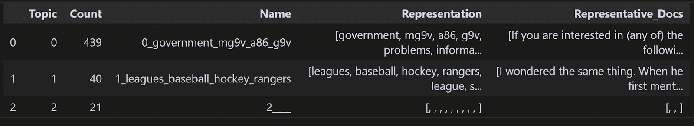
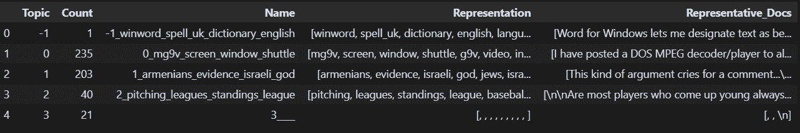
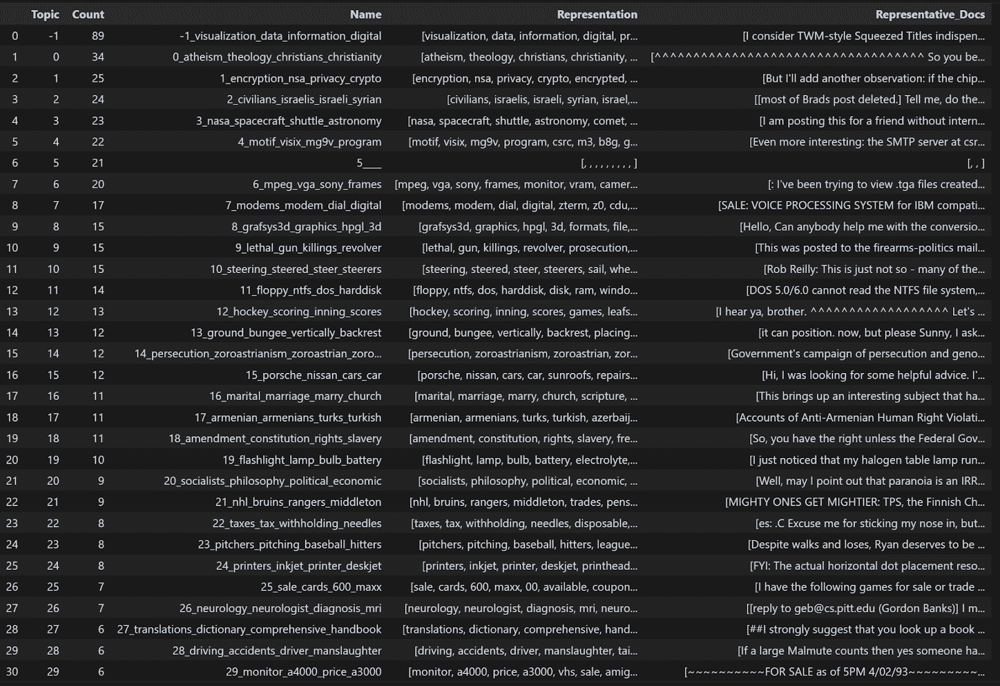
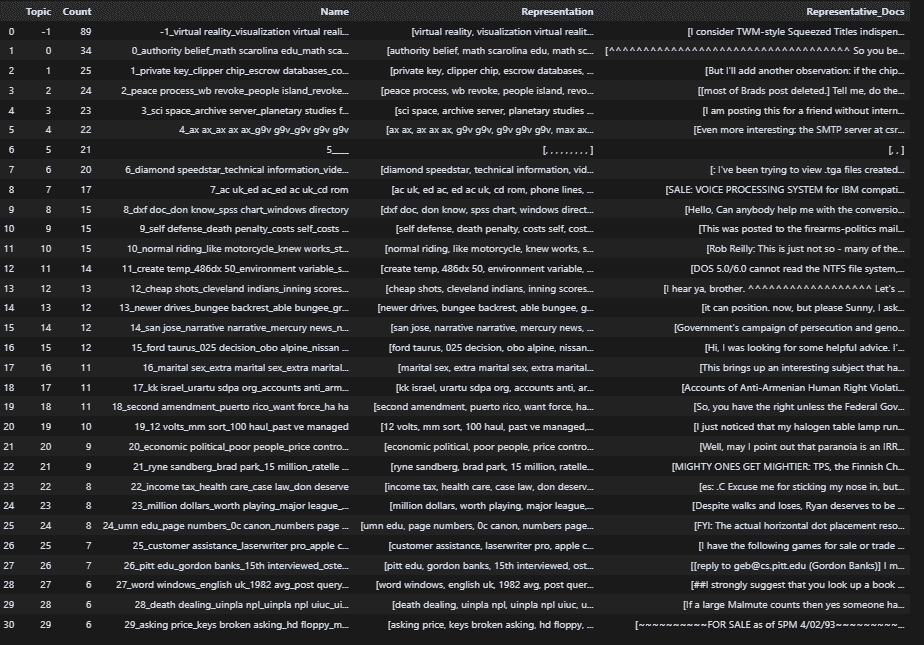
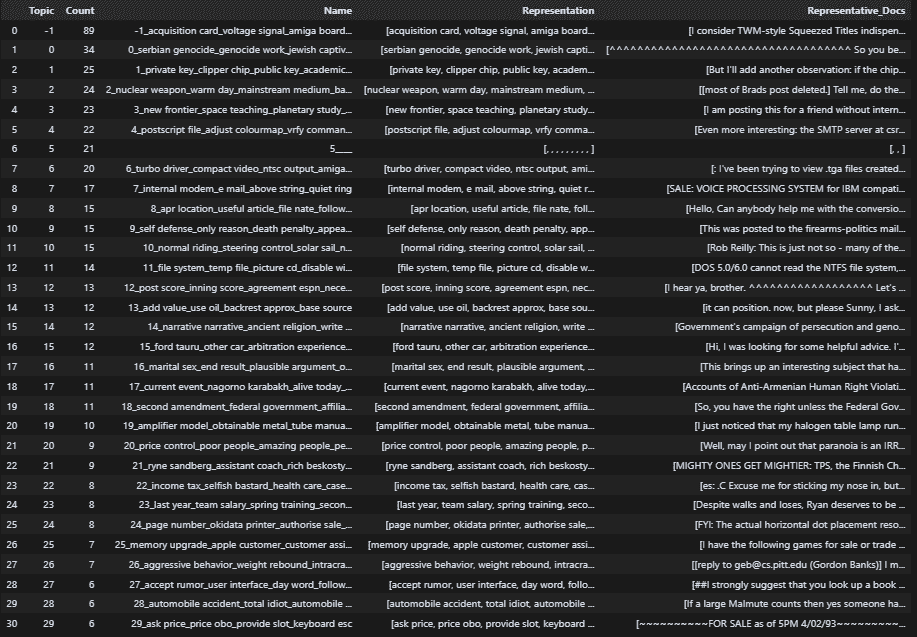
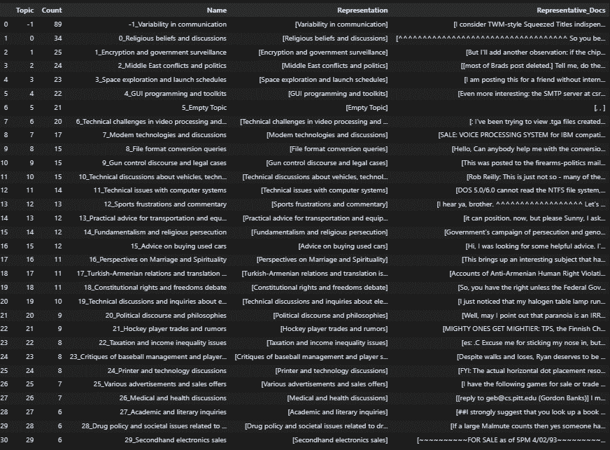

# 使用 BERTopic 微调你的主题建模流程

> 原文：[`towardsdatascience.com/finetune-your-topic-modeling-workflow-with-bertopic/`](https://towardsdatascience.com/finetune-your-topic-modeling-workflow-with-bertopic/)

主题建模仍然是 AI 和 NLP 工具箱中的关键工具。虽然大型语言模型（LLMs）在处理文本方面表现出色，但从大量数据集中提取高级主题仍然需要专门的主题建模技术。一个典型的流程包括四个核心步骤：嵌入、降维、聚类和主题表示。

<mdspan datatext="el1754507033442" class="mdspan-comment">目前最受欢迎的</mdspan>框架之一是[**BERTopic**](https://maartengr.github.io/BERTopic/index.html)，它通过模块化组件和直观的 API 简化了每个阶段。在这篇文章中，我将介绍你可以进行的一些实际调整，以改善聚类结果并基于使用[开源 20 Newsgroups 数据集](https://archive.ics.uci.edu/dataset/113/twenty+newsgroups)的动手实验来提高可解释性，该数据集在 Creative Commons Attribution 4.0 International 许可下分发。

## 项目概述

我们将从 BERTopic 文档中推荐的默认设置开始，并逐步更新特定配置以突出其效果。在这个过程中，我将解释每个模块的目的以及如何在自定义时做出明智的决定。

### 数据集准备

我们加载了 500 篇新闻文档的样本。

```py
import random
from datasets import load_dataset
dataset = load_dataset("SetFit/20_newsgroups")
random.seed(42)
text_label = list(zip(dataset["train"]["text"], dataset["train"]["label_text"]))
text_label_500 = random.sample(text_label, 500)
```

由于数据源自随意的 Usenet 讨论，我们应用清理步骤以去除标题、移除杂项并仅保留信息性句子。

这种预处理确保了更高的嵌入质量和更平滑的下游聚类过程。

```py
import re

def clean_for_embedding(text, max_sentences=5):
    lines = text.split("\n")
    lines = [line for line in lines if not line.strip().startswith(">")]
    lines = [line for line in lines if not re.match\
            (r"^\s*(from|subject|organization|lines|writes|article)\s*:", line, re.IGNORECASE)]
    text = " ".join(lines)
    text = re.sub(r"\s+", " ", text).strip()
    text = re.sub(r"[!?]{3,}", "", text)
    sentence_split = re.split(r'(?<=[.!?]) +', text)
    sentence_split = [
        s for s in sentence_split
        if len(s.strip()) > 15 and not s.strip().isupper()
    ]
    return " ".join(sentence_split[:max_sentences])
texts_clean = [clean_for_embedding(text) for text,_ in text_label_500]
labels = [label for _, label in text_label_500]
```

### 初始 BERTopic 流程

使用 BERTopic 的模块化设计，我们配置每个组件：SentenceTransformer 用于嵌入，UMAP 用于降维，HDBSCAN 用于聚类，以及 CountVectorizer + KeyBERT 用于主题表示。这种设置只能产生几个具有噪声表示的宽泛主题，突出了进行微调以实现更一致结果的需求。

```py
from bertopic import BERTopic
from umap import UMAP
from hdbscan import HDBSCAN
from sentence_transformers import SentenceTransformer

from sklearn.feature_extraction.text import CountVectorizer
from bertopic.vectorizers import ClassTfidfTransformer
from bertopic.representation import KeyBERTInspired

# Step 1 - Extract embeddings
embedding_model = SentenceTransformer("all-MiniLM-L6-v2")

# Step 2 - Reduce dimensionality
umap_model = UMAP(n_neighbors=10, n_components=5, min_dist=0.0, metric='cosine', random_state=42)

# Step 3 - Cluster reduced embeddings
hdbscan_model = HDBSCAN(min_cluster_size=15, metric='euclidean', cluster_selection_method='eom', prediction_data=True)

# Step 4 - Tokenize topics
vectorizer_model = CountVectorizer(stop_words="english")

# Step 5 - Create topic representation
ctfidf_model = ClassTfidfTransformer()

# Step 6 - (Optional) Fine-tune topic representations with
# a `bertopic.representation` model
representation_model = KeyBERTInspired()

# All steps together
topic_model = BERTopic(
  embedding_model=embedding_model,          # Step 1 - Extract embeddings
  umap_model=umap_model,                    # Step 2 - Reduce dimensionality
  hdbscan_model=hdbscan_model,              # Step 3 - Cluster reduced embeddings
  vectorizer_model=vectorizer_model,        # Step 4 - Tokenize topics
  ctfidf_model=ctfidf_model,                # Step 5 - Extract topic words
  representation_model=representation_model # Step 6 - (Optional) Fine-tune topic representations
)
topics, probs = topic_model.fit_transform(texts_clean)
```

这种设置只能产生几个具有噪声表示的宽泛主题。这一结果突出了进行微调以实现更一致结果的需求。



原始发现的主题（由作者生成图像）

## 精细调整主题的参数

### UMAP 模块的 n_neighbors

[UMAP](https://umap-learn.readthedocs.io/en/latest/how_umap_works.html)是降维模块，将原始嵌入降低到低维密集向量。通过调整 UMAP 的 n_neighbors，我们控制数据在降维过程中的局部或全局解释方式。降低此值可以揭示更细粒度的聚类并提高主题的区分度。

```py
umap_model_new = UMAP(n_neighbors=5, n_components=5, min_dist=0.0, metric='cosine', random_state=42)
topic_model.umap_model = umap_model_new
topics, probs = topic_model.fit_transform(texts_clean)
topic_model.get_topic_info()
```



设置 UMAP 的 n_neighbors 参数后发现的主题（由作者生成）

### min_cluster_size 和 cluster_selection_method 来自 HDBSCAN 模块

[HDBSCAN](https://hdbscan.readthedocs.io/en/latest/how_hdbscan_works.html)是 BerTopic 默认设置的聚类模块。通过修改 HDBSCAN 的 min_cluster_size 并将 cluster_selection_method 从“eom”切换到“leaf”，可以进一步细化主题分辨率。这些设置有助于揭示更小、更专注的主题，并在簇之间平衡分布。

```py
hdbscan_model_leaf = HDBSCAN(min_cluster_size=5, metric='euclidean', cluster_selection_method='leaf', prediction_data=True)
topic_model.hdbscan_model = hdbscan_model_leaf
topics, _ = topic_model.fit_transform(texts_clean)
topic_model.get_topic_info()
```

通过将 cluster_selection_method 设置为 leaf 并将 min_cluster_size 设置为 5，簇的数量增加到 30。



设置 HDBSCAN 的相关参数后发现的主题（由作者生成）

## 控制随机性以实现可重复性

UMAP 本质上是非确定性的，这意味着除非你明确设置一个固定的 random_state，否则它可以在每次运行时产生不同的结果。这个细节在示例代码中经常被省略，所以请确保包括它以确保可重复性。

类似地，如果你正在使用第三方嵌入 API（如 OpenAI），请谨慎使用。一些 API 在重复调用时可能会引入轻微的变化。为了得到可重复的结果，请缓存嵌入并将它们直接输入到 BERTopic 中。

```py
from bertopic.backend import BaseEmbedder
import numpy as np
class CustomEmbedder(BaseEmbedder):
    """Light-weight wrapper to call NVIDIA's embedding endpoint via OpenAI SDK."""

    def __init__(self, embedding_model, client):
        super().__init__()
        self.embedding_model = embedding_model
        self.client = client

    def encode(self, documents):  # type: ignore[override]
        response = self.client.embeddings.create(
            input=documents,
            model=self.embedding_model,
            encoding_format="float",
            extra_body={"input_type": "passage", "truncate": "NONE"},
        )
        embeddings = np.array([embed.embedding for embed in response.data])
        return embeddings
topic_model.embedding_model = CustomEmbedder()
topics, probs = topic_model.fit_transform(texts_clean, embeddings=embeddings)
```

每个数据集领域可能需要不同的聚类设置才能获得最佳结果。为了简化实验，考虑定义评估标准并自动化调整过程。在本教程中，我们将使用将 n_neighbors 设置为 5、min_cluster_size 设置为 5、cluster_selection_method 设置为“eom”的簇配置。这是一个在粒度和连贯性之间取得平衡的组合。

## 提升主题表示

表示在使簇可解释方面起着至关重要的作用。默认情况下，BERTopic 生成基于 unigram 的表示，这通常缺乏足够的上下文。在下一节中，我们将探讨几种技术来丰富这些表示并提高主题的可解释性。

### Ngram

#### n-gram 范围

在 BERTopic 中，CountVectorizer 是默认的工具，用于将文本数据转换为词袋表示。不要依赖于通用的 unigram，而是使用 CountVectorizer 中的 ngram_range 切换到**bigram 或 trigram**。这个简单的变化增加了所需的内容。

由于我们只更新表示，BerTopic 提供了 update_topics 函数以避免重新进行整个建模过程。

```py
topic_model.update_topics(texts_clean, vectorizer_model=CountVectorizer(stop_words="english", ngram_range=(2,3)))
topic_model.get_topic_info()
```



使用 bigram 的主题表示（由作者生成）

#### 自定义分词器

一些 bigram 仍然难以解释，例如 486dx 50, ac uk, dxf doc 等。为了获得更大的控制权，实现一个**自定义分词器**，根据词性模式过滤 n-gram。这消除了无意义的组合并提高了主题关键词的质量。

```py
import spacy
from typing import List

class ImprovedTokenizer:
    def __init__(self):
        self.nlp = spacy.load("en_core_web_sm", disable=["parser", "ner"])
        self.MEANINGFUL_BIGRAMS = {
            ("ADJ", "NOUN"),
            ("NOUN", "NOUN"),
            ("VERB", "NOUN"),
        }
    # Keep only the most meaningful syntactic bigram patterns
    def __call__(self, text: str, max_tokens=200) -> List[str]:
        doc = self.nlp(text[:3000])  # truncate long docs for speed
        tokens = [(t.text, t.lemma_.lower(), t.pos_) for t in doc if t.is_alpha]

        bigrams = []
        for i in range(len(tokens) - 1):
            word1, lemma1, pos1 = tokens[i]
            word2, lemma2, pos2 = tokens[i + 1]
            if (pos1, pos2) in self.MEANINGFUL_BIGRAMS:
                # Optionally lowercase both words to normalize
                bigrams.append(f"{lemma1} {lemma2}")

        return bigrams
topic_model.update_topics(docs=texts_clean,vectorizer_model=CountVectorizer(tokenizer=ImprovedTokenizer()))
topic_model.get_topic_info()
```



主题表示，移除了杂乱的二元组（作者生成图像）

### LLM

最后，您可以将**LLM**集成以生成每个主题的连贯标题或摘要。BERTopic 直接支持 OpenAI 集成或通过自定义提示。基于 LLM 的摘要显著提高了可解释性。

```py
import openai
from bertopic.representation import OpenAI

client = openai.OpenAI(api_key=os.environ["OPENAI_API_KEY"])
topic_model.update_topics(texts_clean, representation_model=OpenAI(client, model="gpt-4o-mini", delay_in_seconds=5))
topic_model.get_topic_info()
```

现在的所有表示都是具有意义的句子。



主题表示，由 LLM 生成的句子（作者生成图像）

您也可以编写自己的函数来获取 LLM 生成的标题，并通过使用 update_topic_labels 函数将其更新回主题模型对象。请参考下面的示例代码片段。

```py
import openai
from typing import List
def generate_topic_titles_with_llm(
    topic_model,
    docs: List[str],
    api_key: str,
    model: str = "gpt-4o"
) -> Dict[int, Tuple[str, str]]:
    client = openai.OpenAI(api_key=api_key)
    topic_info = topic_model.get_topic_info()
    topic_repr = {}
    topics = topic_info[topic_info.Topic != -1].Topic.tolist()

    for topic in tqdm(topics, desc="Generating titles"):
        indices = [i for i, t in enumerate(topic_model.topics_) if t == topic]
        if not indices:
            continue
        top_doc = docs[indices[0]]

        prompt = f"""You are a helpful summarizer for topic clustering.
        Given the following text that represents a topic, generate:
        1\. A short **title** for the topic (2–6 words)
        2\. A one or two sentence **summary** of the topic.
        Text:
        \"\"\"
        {top_doc}
        \"\"\"
        """

        try:
            response = client.chat.completions.create(
                model=model,
                messages=[
                    {"role": "system", "content": "You are a helpful assistant for summarizing topics."},
                    {"role": "user", "content": prompt}
                ],
                temperature=0.5
            )
            output = response.choices[0].message.content.strip()
            lines = output.split('\n')
            title = lines[0].replace("Title:", "").strip()
            summary = lines[1].replace("Summary:", "").strip() if len(lines) > 1 else ""
            topic_repr[topic] = (title, summary)
        except Exception as e:
            print(f"Error with topic {topic}: {e}")
            topic_repr[topic] = ("[Error]", str(e))

    return topic_repr

topic_repr = generate_topic_titles_with_llm( topic_model, texts_clean, os.environ["OPENAI_API_KEY"])
topic_repr_dict = {
    topic: topic_repr.get(topic, "Topic")
    for topic in topic.get_topic_info()["Topic"]
 }
topic_model.set_topic_labels(topic_repr_dict)
```

## 结论

本指南概述了使用 BERTopic 提升主题建模结果的可操作策略。通过理解每个模块的作用并为您的特定领域调整参数，您可以实现更聚焦、更稳定和更具可解释性的主题。

表示与聚类同样重要。无论是通过 n-gram、句法过滤还是 LLM，投资于更好的表示可以使您的主题更容易理解，并在实践中更有用。

BERTopic 还提供了超出此处基本覆盖的先进建模技术。在未来的文章中，我们将深入探讨这些功能。敬请期待！
