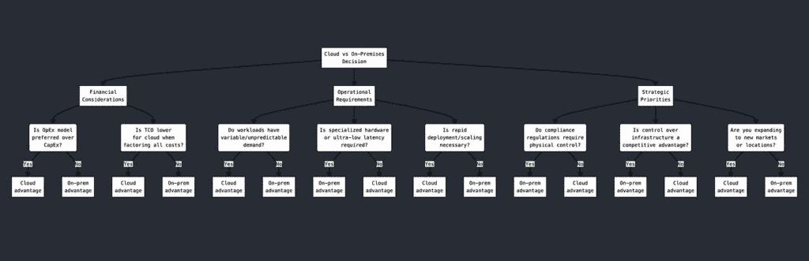

# 忘掉云计算吧。本地部署又重新流行起来

> 原文：[`towardsdatascience.com/forget-about-cloud-computing-on-premises-is-all-the-rage-again/`](https://towardsdatascience.com/forget-about-cloud-computing-on-premises-is-all-the-rage-again/)

十年前，每个人都对云着迷。它是新事物，快速采用它的公司看到了巨大的增长。例如，Salesforce 将自己定位为这一技术的[先驱](https://www.geekwire.com/2015/how-salesforce-innovates-co-founder-explains-super-early-adopter-approach/)，并取得了巨大的成功。

虽然云服务提供商仍然宣称他们是所有规模企业的最具成本效益和效率的解决方案，但这种说法与日常经验越来越不相符。

云计算曾被誉为可扩展性、灵活性和减少运营负担的解决方案。然而，越来越多的公司发现，在规模扩大时，成本和控制限制超过了其带来的好处。

被免费的 AWS 信用额度吸引，我和我的 CTO 开始将我们整个公司的 IT 基础设施部署在云上。然而，当我们看到仅仅几次软件测试后成本激增时，我们感到震惊。我们决定投资于一台高质量的服务器，并将整个基础设施迁移到它上面。而且我们不会回头看了：这个决定已经让我们每个月节省了数百欧元。

我们并非唯一这样做的人：Dropbox 已经在 2016 年采取了这一举措[（点击查看详情）](https://www.datacenterknowledge.com/cloud/here-s-how-much-money-dropbox-saved-by-moving-out-of-the-cloud)，并在接下来的两年里节省了近 7500 万美元。Basecamp 背后的公司 37signals 在 2022 年完成了这一转型[（点击查看详情）](https://basecamp.com/cloud-exit)，预计五年内将节省 700 万美元。

我们将更深入地探讨这一趋势的原因和与之相关的成本节约。你可以期待一些实用的见解，这将帮助你做出或影响你公司这样的决定。

## 云成本一直在激增

根据[Harness 最近的一项研究](https://www.harness.io/finops-in-focus)，企业云基础设施支出的 21%——到 2025 年将相当于 445 亿美元——被浪费在未充分利用的资源上。根据该研究的作者，云支出是许多软件企业的最大成本驱动因素，仅次于工资。

这项研究的前提是开发者必须对成本更加敏感。然而，我不同意。成本控制只能带你走这么远——许多聪明的开发者已经花费了大量的时间在成本控制上，而不是构建实际的产品。

云服务成本有随时间膨胀的趋势：每 GB 数据的存储成本可能看起来很低，但当你处理 TB 级的数据时——即使是像我们这样的三人初创公司也在做——成本会迅速增加。再加上检索和出口费用，你将面对一个难以忽视的账单。

高昂的数据检索和出口费用只服务于一个目的：云服务提供商希望激励你尽可能多地将数据保留在平台上，这样他们可以从每一次操作中获利。如果你从云端下载数据，这将会花费你大量的金钱。

基于 CPU 和 GPU 使用的可变成本在高性能工作负载期间往往会激增。CNCF 的一份报告发现，几乎一半的 Kubernetes 采用者发现，他们因此超出了预算。Kubernetes 是一个开源的容器编排软件，通常用于云部署。

云的按使用付费模式有其优点，但计费变得不可预测。因此，在使用高峰期间，成本可能会激增。云服务中的安全、监控和数据分析附加服务也往往价格昂贵，这通常会进一步增加成本。

因此，许多 IT 领导者已经开始将系统迁移回本地服务器。2023 年 Uptime 进行的一项[调查](https://journal.uptimeinstitute.com/high-costs-drive-cloud-repatriation-but-impact-is-overstated/)发现，33%的受访者在过去一年中至少将一些生产应用程序迁移回本地。

云服务提供商并未根据这一趋势调整其计费结构。有人可能会认为这样做会严重影响他们的盈利能力，尤其是在一个主要市场已经高度整合，新兴企业和外部竞争压力有限的情况下。只要这种情况持续，预计向本地化部署的趋势将继续。

## 成本效益和控制

有一个原因，云服务提供商倾向于向小型企业和初创公司大量宣传。由于按需付费模式和免费信用额，云基础设施的初始设置成本很低。

虽然设置简单，但这可能是一个陷阱，尤其是当你开始扩展时。（在我的公司，我们注意到，甚至在扩展到一定程度之前，我们的成本就已经失控，仅仅是因为我们处理了大量的数据。）本地化服务器的月度成本是固定和可预测的；云服务的成本可能会迅速超出预期。

如前所述，云服务提供商也会收取高额的数据出口费用，当你考虑混合基础设施时，这些费用会迅速累积。

本地化部署的初始安全成本可能较高。另一方面，你可以完全控制你实施的一切。云服务提供商负责基础设施安全，但你仍然负责数据安全和配置。这通常需要付费附加服务。

[`datawrapper.dwcdn.net/czWge/1/`](https://datawrapper.dwcdn.net/czWge/1/)

上述表格中可以找到汇总信息。总的来说，本地基础设施的设置成本较高，并且需要相当的专业知识。然而，这种初始投资很快就会得到回报，因为你的月度成本往往非常可预测，并且可以完全控制像安全措施这样的添加。

有许多公司通过回归本地节省了数百万的显著例子。然而，这对你来说是否是一个好选择，取决于几个需要仔细评估的因素。

## 你是否应该回归本地？

你是否应该回到服务器机架取决于几个因素。在大多数情况下，最重要的考虑因素是财务、运营和战略。

从财务角度来看，你公司的现金结构起着重要作用。如果你更喜欢精简的资本支出，但每月的高运营成本没有问题，那么你应该继续留在云端。如果你可以提前做出更高的资本支出，然后避免现金流失，那么你应该这样做。

最后，总运营成本（TCO）是关键。如果你的云上运营成本持续低于自己运行服务器，那么你绝对应该留在云端。

从运营角度来看，如果你经常面临使用高峰，留在云端是有意义的。本地服务器只能承载一定量的流量；云服务器可以根据需求无缝扩展。如果你在云上更容易获得昂贵和专业的硬件，这也是留在云端的理由之一。另一方面，如果你担心遵守特定的法规（例如 GDPR、HIPAA 或 CSRD 等），那么云服务的共享责任模式可能不适合你。

从战略角度来看，完全控制你的基础设施可以是一个战略优势。它让你避免与供应商锁定，并不得不接受他们向你收取的费用以及他们能提供的服务。如果你计划地理扩张或快速部署新服务，那么云可能是有利的。然而，从长远来看，即使你在地理上或服务范围上扩张，由于控制力增强和运营成本降低，回归本地可能也是有意义的。

*回归本地的决定取决于几个因素。图表由 Claude AI 生成*。

总体而言，如果你重视可预测性、控制和合规性，你应该考虑运行本地。另一方面，如果你重视灵活性，那么留在云端可能是更好的选择。

## 如何轻松回归

如果你正在考虑将服务回归，以下是一个简要的检查清单：

+   评估当前云使用情况：盘点应用程序和数据量。

+   成本分析：计算当前云成本与预计本地成本。

+   选择本地基础设施：服务器、存储和网络需求。

+   最小化数据出口成本：使用压缩并在非高峰时段安排传输。

+   安全规划：本地基础设施的防火墙、加密和访问控制。

+   测试和迁移：首先对非关键工作负载进行试点迁移。

+   监控和优化：设置资源监控并调整。

迁回并非仅限于那些登上头条的企业公司。正如我公司的例子所示，即使是小型初创公司也需要考虑这一点。你迁移得越早，损失的资金就越少。

## 总结：云并没有死去，但围绕它的炒作正在消亡

云服务不会消失。它们提供了灵活性和可扩展性，这在某些用例中是无与伦比的。对于工作负载不可预测或快速增长的初创公司和公司，云解决方案仍然非常有价值。

话虽如此，即使是早期公司也能从本地基础设施中受益，例如，如果他们处理的大量数据会使云费用失控。在我公司就是这种情况。

云经常被宣传为从数据存储到 AI 工作负载等一切问题的通用解决方案。我们可以看到这并非事实；现实情况比这更为细致。随着公司规模的扩大，云计算的成本、合规挑战和性能限制变得难以忽视。

云服务的炒作正在消亡，因为经验表明，确实存在实际限制和大量隐藏成本。此外，云服务提供商往往无法充分提供安全解决方案、合规性选项和用户控制，除非你为所有这些支付高额溢价。

大多数公司最终可能都会采用混合方法：本地基础设施提供控制和可预测性；当用户需求激增时，云服务器可以迅速介入。

没有真正的通用解决方案。然而，有一些具体的标准可以帮助你指导你的决策。就像每一个炒作一样，都有起伏。云服务不再被炒作并不意味着你现在需要全力以赴投入服务器机架。然而，这确实邀请我们更深入地反思这一趋势为公司带来的优势。
