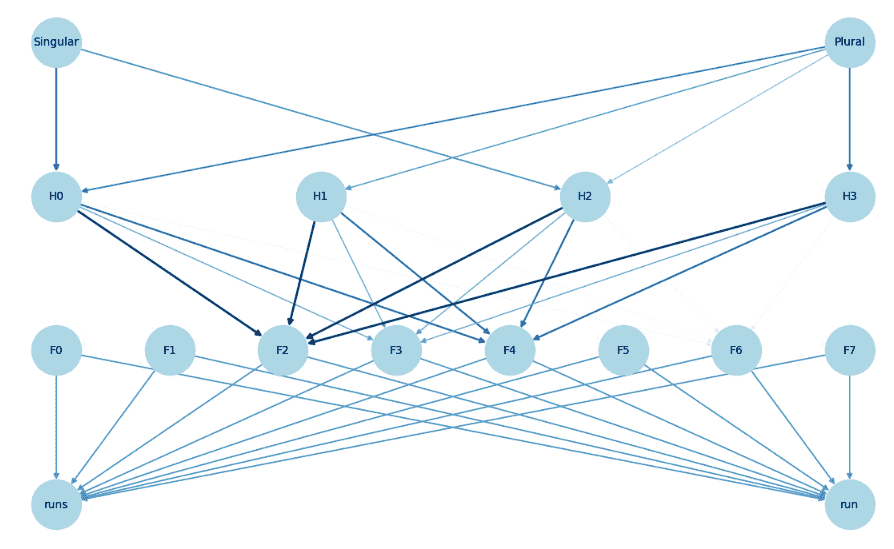
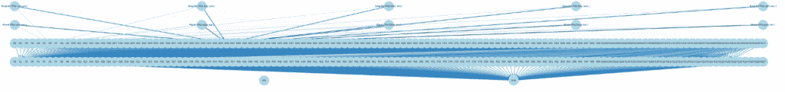

# 在 LLM 中使用稀疏自编码器构建特征电路

> 原文：[`towardsdatascience.com/formulation-of-feature-circuits-with-sparse-autoencoders-in-llm/`](https://towardsdatascience.com/formulation-of-feature-circuits-with-sparse-autoencoders-in-llm/)

大型语言模型（LLMs）已经取得了令人印象深刻的进展，这些大型模型可以执行各种任务，从生成类似人类的文本到回答问题。然而，理解这些模型的工作原理仍然具有挑战性，特别是由于一种称为超叠加的现象，其中特征被混合到一个神经元中，这使得从原始模型结构中提取人类可理解的表现变得非常困难。这正是稀疏自编码器等方法的用武之地，它们似乎可以解耦特征以实现可解释性。

在这篇博客文章中，我们将使用稀疏自编码器来寻找特定有趣的主谓一致案例中的某些特征电路，并了解模型组件如何有助于任务。

## 关键概念

### 特征电路

在神经网络背景下，**特征电路**是网络如何将输入特征组合成更高层次复杂模式的学习方式。我们用“电路”这个比喻来描述特征在神经网络层中的处理过程，因为这些过程让我们联想到电子电路中处理和组合信号的过程。

这些特征电路通过神经元和层之间的连接逐渐形成，其中每个神经元或层负责转换输入特征，它们的相互作用导致有用的特征组合，这些组合共同作用以做出最终预测。

这里有一个特征电路的例子：在许多视觉神经网络中，我们可以找到一个“作为一组单元检测不同角度方向的曲线的电路。这些曲线检测器主要是由早期的、不那么复杂的曲线检测器和线检测器实现的。这些曲线检测器在下一层中被用来创建 3D 几何和复杂形状检测器” [1]。

在接下来的章节中，我们将研究 LLMs 中用于主谓一致任务的一个特征电路。

### 超叠加和稀疏自编码器

在机器学习的背景下，我们有时观察到超叠加现象，指的是模型中的一个神经元代表多个重叠的特征，而不是单个、独特的特征。例如，InceptionV1 包含一个对猫脸、汽车正面和猫腿都有反应的神经元。

这就是稀疏自编码器（SAE）发挥作用的地方。

SAE 帮助我们解耦网络的激活为一系列稀疏特征。这些稀疏特征通常是人类可理解的，使我们能够更好地理解模型。通过将 SAE 应用于 LLM 模式的隐藏层激活，我们可以隔离对模型输出有贡献的特征。

你可以在我的前一篇[博客文章](https://medium.com/towards-data-science/sparse-autoencoder-from-superposition-to-interpretable-features-4764bb37927d)中找到 SAE 如何工作的详细信息。

## 案例研究：主谓一致

### 主谓一致

主谓一致是英语中的基本语法规则。句子中的主语和动词在数量上必须一致，即单数或复数。例如：

+   “The cat **runs**.” (单数主语，单数动词)

+   “The cats **run**.” (复数主语，复数动词)

对于人类来说，理解这个规则对于文本生成、翻译和问答等任务非常重要。但我们如何知道 LLM 是否真的学会了这个规则？

我们将在本章中探讨 LLM 如何为这样的任务形成一个特征电路。

### 构建特征电路

让我们现在构建创建特征电路的过程。我们将分 4 步进行：

1.  我们首先将句子输入到模型中。对于这个案例研究，我们考虑以下句子：

+   “The cat runs.” (单数主语)

+   “The cats run.” (复数主语)

1.  我们在这些句子上运行模型以获取隐藏激活。这些激活代表模型在每一层处理句子的方式。

1.  我们将激活传递给 SAE 以“解压缩”特征。

1.  我们构建一个特征电路作为计算图：

    +   输入节点代表单数和复数句子。

    +   隐藏节点代表处理输入的模型层。

    +   稀疏节点代表从 SAE 获得的特征。

    +   输出节点代表最终决策。在这种情况下：runs 或 run。

### 玩具模型

我们首先构建一个玩具语言模型，这个模型可能完全没有任何意义，如下面的代码所示。这是一个具有两个简单层的网络。

对于主谓一致，模型应该：

+   输入一个带有单数或复数动词的句子。

+   隐藏层将此类信息转换为抽象表示。

+   模型选择正确的动词形式作为输出。

```py
# ====== Define Base Model (Simulating Subject-Verb Agreement) ======
class SubjectVerbAgreementNN(nn.Module):
   def __init__(self):
       super().__init__()
       self.hidden = nn.Linear(2, 4)  # 2 input → 4 hidden activations
       self.output = nn.Linear(4, 2)  # 4 hidden → 2 output (runs/run)
       self.relu = nn.ReLU()

   def forward(self, x):
       x = self.relu(self.hidden(x))  # Compute hidden activations
       return self.output(x)  # Predict verb
```

隐藏层内部发生的事情并不清楚。因此，我们引入以下稀疏自编码器：

```py
# ====== Define Sparse Autoencoder (SAE) ======
class c(nn.Module):
   def __init__(self, input_dim, hidden_dim):
       super().__init__()
       self.encoder = nn.Linear(input_dim, hidden_dim)  # Decompress to sparse features
       self.decoder = nn.Linear(hidden_dim, input_dim)  # Reconstruct
       self.relu = nn.ReLU()

   def forward(self, x):
       encoded = self.relu(self.encoder(x))  # Sparse activations
       decoded = self.decoder(encoded)  # Reconstruct original activations
       return encoded, decoded
```

我们训练了原始模型`SubjectVerbAgreementNN`和设计用于表示不同动词单数和复数形式的句子的`SubjectVerbAgreementNN`，例如“ The cat runs”，“the babies run”。然而，就像之前一样，对于玩具模型，它们可能没有实际的意义。

现在我们可视化特征电路。如前所述，特征电路是处理特定特征的神经元单元。在我们的模型中，特征包括：

1.  **隐藏层**将语言属性转换为抽象表示。

1.  **SAE**具有**独立特征**，这些特征直接贡献于动词-主语一致任务。



训练特征电路：单数与复数（Dog/Dogs）

你可以在图中看到，我们将特征电路可视化为一个图：

+   隐藏激活和编码器的输出都是图的节点。

+   我们还将输出节点作为正确的动词。

+   图中的边通过激活强度加权，显示了在主谓一致决策中哪些路径最为重要。例如，你可以看到从 H3 到 F2 的路径起着重要的作用。

### GPT2-Small

对于一个实际案例，我们在 GPT2-small 上运行了类似的代码。我们展示了表示选择单数动词决策的特征电路图。



主谓一致（run/runs）的特征电路。有关代码细节和上述内容的更大版本，请参阅我的[notebook](https://colab.research.google.com/drive/1p50X-tTnUSA6wTxePkiiq_oTjhJftgFb#scrollTo=22HvXjpsKpw4)。

## 结论

特征电路帮助我们理解复杂 LLM 中不同部分是如何导致最终输出的。我们展示了使用 SAE 形成主谓一致任务特征电路的可能性。

然而，我们必须承认这种方法仍然需要一些人类水平的干预，因为在没有适当设计的情况下，我们并不总是知道一个电路是否真的可以形成。

## 参考文献

[1] 放大镜：[电路简介](https://distill.pub/2020/circuits/zoom-in/)
