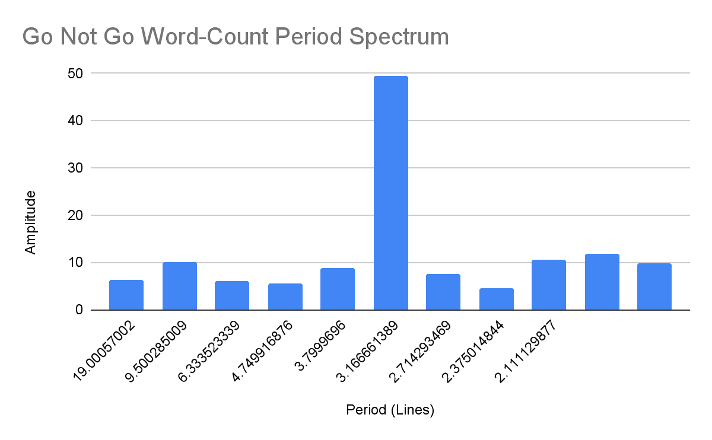
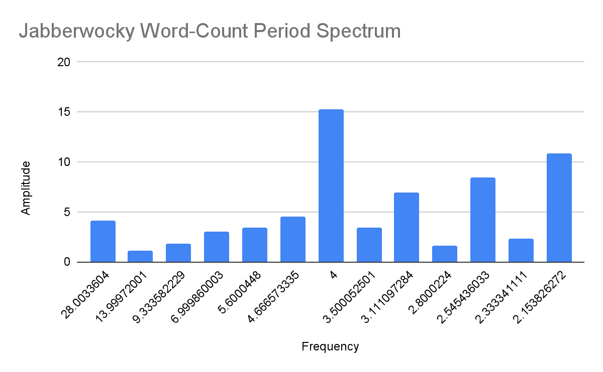
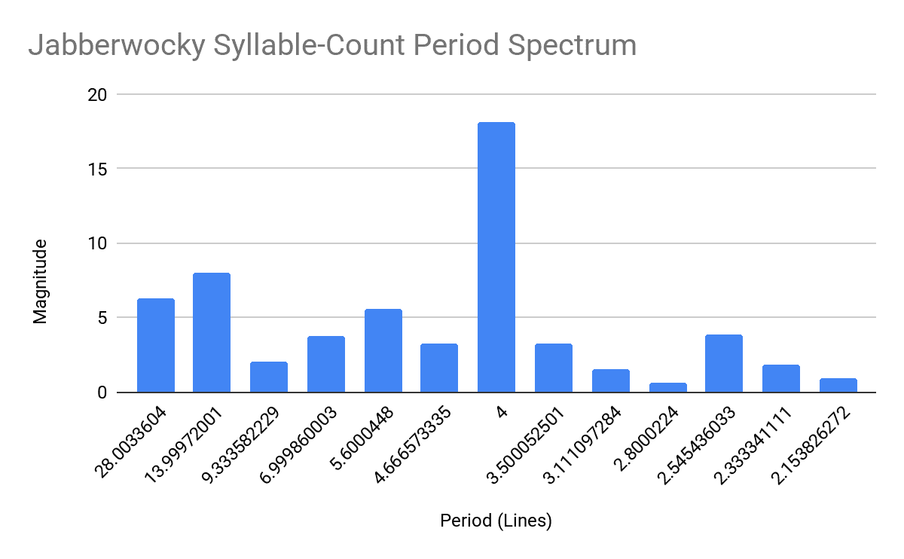

# 傅里叶变换在文学分析中的应用

> 原文：[`towardsdatascience.com/fourier-transform-applications-in-literary-analysis/`](https://towardsdatascience.com/fourier-transform-applications-in-literary-analysis/)

诗歌通常被视为一种纯粹的艺术形式，从俳句的严格结构到自由诗的流畅、不受约束的本质。然而，在分析这些作品时，数学和数据分析在多大程度上可以用来从这种自由流动的文学中提取意义？当然，修辞可以分析，可以找到参考文献，可以质疑词汇选择，但能否通过分析策略在文学中找到作者的潜在——甚至无意识的——思维过程？作为对计算辅助文学分析的一次初步探索，我们将尝试使用傅里叶变换程序来寻找诗歌中的周期性。为了测试我们的代码，我们将使用两个案例研究：Dylan Thomas 的“[不要温和地走进那个良夜](https://www.poetryfoundation.org/poems/46569/do-not-go-gentle-into-that-good-night)”和 Lewis Carroll 的“[疯狂兔子](https://www.poetryfoundation.org/poems/42916/jabberwocky)”。

## 1. 数据采集

### a. **行分割和词数**

在进行任何计算之前，必须收集所有必要的数据。就我们的目的而言，我们希望有一个包含每行字母数、单词数、音节数和视觉长度的数据集。首先，我们需要解析诗歌本身（以纯文本文件的形式输入），将其解析为每行的子字符串。这可以通过 Python 中的`.split()`方法轻松完成；将分隔符“`\n`”传递给方法将按行分割文件，返回每行的字符串列表。（完整方法是`poem.split(`\n`))`）。计算单词数就像分割行一样简单，并且很好地从中得出：首先，遍历所有行，再次应用`.split()`方法——这次不带分隔符——这样它将默认按空白分割，将每行字符串转换为单词字符串列表。然后，要计算任何给定行上的单词数，只需在每行上调用内置的`len()`函数；由于每行已被分割成单词列表，`len()`将返回行列表中的项目数，即单词数。

### b. 字母数

要计算每行的字母数，我们只需要将每个单词的字母数相加，因此对于给定的一行，我们遍历每个单词，调用`len()`来获取给定单词的字符数。遍历完一行中的所有单词后，将字符数相加得到该行上的总字符数；执行此操作的代码是`sum(len(word) for word in words)`。

### c. 视觉长度

计算每行的视觉长度很简单；假设使用的是[等宽字体](https://en.wikipedia.org/wiki/Monospaced_font)，每行的视觉长度只是该行上出现的总字符数（包括空格！）。因此，视觉长度只是`len(line)`。然而，大多数字体都不是等宽字体，尤其是常见的文学字体，如[卡斯隆](https://en.wikipedia.org/wiki/Caslon)、[加拉蒙德](https://en.wikipedia.org/wiki/Garamond)和[乔治亚](https://en.wikipedia.org/wiki/Georgia_(typeface))——这提出了一个问题，因为我们不知道作者写作时使用的确切字体，所以我们无法计算精确的行长度。虽然这个假设确实留下了错误的空间，但以某种方式考虑视觉长度是很重要的，所以必须使用等宽字体的假设。

### d. 音节计数

在不手动阅读每一行的情况下获取音节计数是数据收集中最具挑战性的部分。为了识别音节，我们将使用元音群。请注意，在我的程序中，我定义了一个函数`count_syllables(word)`来计算每个单词中的音节。为了预格式化单词，我们将它设置为全部小写，使用`word = word.lower()`，并使用`word = re.sub(r'[^a-z]', '', word)`移除单词中可能包含的所有标点符号。接下来，找到所有元音或元音群——每个都应该是一个音节，因为单个音节被明确定义为包含一个连续元音音素并由辅音包围的发音单位。为了找到每个元音群，我们可以使用包括 y 在内的所有元音的 regex：`syllables = re.findall(r'[aeiouy]+', word)`。在定义了音节之后，它将是一个给定单词中所有元音群的列表。最后，每个单词至少必须有一个音节，所以即使你输入一个无元音的单词（例如 Cwm），该函数也会返回一个音节。该函数是：

```py
def count_syllables(word):
    """Estimate syllable count in a word using a simple vowel-grouping method."""
    word = word.lower()
    word = re.sub(r'[^a-z]', '', word)  # Remove punctuation
    syllables = re.findall(r'[aeiouy]+', word)  # Find vowel clusters
    return max(1, len(syllables))  # At least one syllable per word
```

该函数将返回任何输入单词的音节计数，因此要找到整行文本的音节计数，返回到之前的循环（用于 1.a-1.c 中的数据收集），然后遍历单词列表，这将返回每个单词的音节计数。将音节计数相加将给出整行的计数：`num_syllables = sum(count_syllables(word) for word in words)`。

### e. 数据收集总结

数据收集算法被编译成一个单独的函数，它从将输入的诗句拆分成其行开始，遍历诗句的每一行执行所有之前描述的操作，并将每个数据点追加到为该数据集指定的列表中，最后生成一个字典来存储单行的所有数据点并将其追加到主数据集中。虽然对于使用的小量输入数据，时间复杂度实际上并不重要，但该函数以线性时间运行，这在分析大量数据时很有帮助。数据收集函数的完整内容是：

```py
def analyze_poem(poem):
    """Analyzes the poem line by line."""
    data = []
    lines = poem.split("\n")

    for line in lines:
        words = line.split()
        num_words = len(words)
        num_letters = sum(len(word) for word in words)
        visual_length = len(line)  # Approximate visual length (monospace)
        num_syllables = sum(count_syllables(word) for word in words)
        word.append(num_words)
        letters.append(num_letters)
        length.append(visual_length)
        sylls.append(num_syllables)

        data.append({
            "line": line,
            "words": num_words,
            "letters": num_letters,
            "visual_length": visual_length,
            "syllables": num_syllables
        })

    return data 
```

## 2. 离散傅里叶变换

**前言：**本节假设读者已经理解了（离散）傅里叶变换；为了一个相对简短且易于管理的介绍，可以尝试阅读 Sho Nakagome 的这篇文章：[this](https://medium.com/sho-jp/fourier-transform-101-part-4-discrete-fourier-transform-8fc3fbb763f3)。

### a. 特定的 DFT 算法

为了具体说明我使用的特定 DFT 算法，我们需要涉及到 NumPy 快速傅里叶变换方法。假设*N*是要转换的离散值的数量：如果*N*是 2 的幂，NumPy 使用[radix-2 Cooley-Tukey 算法](https://en.wikipedia.org/wiki/Cooley%E2%80%93Tukey_FFT_algorithm)，该算法递归地将输入分为偶数和奇数索引。如果*N*不是 2 的幂，NumPy 则采用混合基数方法，将输入分解为较小的质数因子，并使用有效的基例来计算 FFT。

### b. 应用 DFT

要将 DFT 应用于之前收集的数据，我创建了一个名为`fourier_analysis`的函数，该函数仅接受主数据集（每个线条的所有数据点的字典列表）作为参数。幸运的是，由于 NumPy 在数学方面非常擅长，代码很简单。首先，找到*N*，即要转换的数据点的数量；这很简单，即`N = len(data)`。接下来，使用`np.fft.fft(data)`方法将 NumPy 的 FFT 算法应用于数据，该方法返回表示傅里叶级数的幅度和相位的复系数数组。最后，`np.abs(fft_result)`方法提取每个系数的幅度，表示其在原始数据中的强度。该函数返回一个频率-幅度对的列表，作为傅里叶幅度频谱。

```py
def fourier_analysis(data):
    """Performs Fourier Transform and returns frequency data."""
    N = len(data)
    fft_result = np.fft.fft(data)  # Compute Fourier Transform
    frequencies = np.fft.fftfreq(N)  # Get frequency bins
    magnitudes = np.abs(fft_result)  # Get magnitude of FFT coefficients

    return list(zip(frequencies, magnitudes))  # Return (freq, magnitude) pairs
```

完整的代码可以在以下 GitHub 链接中找到：[GitHub](https://github.com/owj25/Fourier-Lit/tree/main)。

## 3. 案例研究

### a. 简介

我们已经通过了所有的代码和绕口令算法，现在是时候对程序进行测试了。为了节省时间，这里所做的文学分析将是最小化的，重点放在数据分析上。请注意，虽然这个傅里叶变换算法返回的是频谱，但我们想要的是周期谱，所以我们将使用关系 \( T = \frac{1}{f} \) 来获得周期谱。为了比较不同频谱的噪声水平，我们将使用信噪比（SNR）这一指标。平均信号噪声被计算为算术平均值，表示为 \( P_{noise} = \frac{1}{N-1} \sum_{k=0}^{N-1} |X_k| \)，其中 \( X_k \) 是任何索引 \( k \) 的系数，求和时排除了 \( X_{peak} \)，即信号峰值系数。要找到 SNR，只需取 \( \frac{X_{peak}}{P_{noise}} \)；更高的 SNR 意味着相对于背景噪声，信号强度更高。SNR 是检测诗歌周期性的一个强有力的选择，因为它量化了信号（即结构化的节奏模式）在背景噪声（词长或音节计数中的随机变化）中的突出程度。与方差（衡量整体分散度）或自相关（捕捉特定滞后处的重复）不同，SNR 直接突出了周期模式相对于不规则波动的支配程度，这使得它非常适合识别诗歌中的韵律结构。

### b. “不要温和地走进那个良夜”——迪伦·托马斯

这项工作具有明确和可见的周期结构，因此是很好的测试数据。不幸的是，这里的音节数据在这里找不到任何有趣的东西（托马斯的诗歌是写成的抑扬格五音步）；另一方面，单词计数数据在四个指标中具有最高的 SNR 值，为 6.086。



图 1。请注意，这个图和所有随后的图都是使用 Google Sheets 生成的。

上面的频谱显示在 4 行周期处有一个主导信号，在其他周期范围内相对较少的噪声。此外，考虑到与字母计数、音节计数和视觉长度相比的最高 SNR 值，有一个有趣的观察结果：这首诗遵循 ABA（空白）的押韵模式；这意味着每行的单词计数与押韵模式完美同步。其他两个相关频谱的 SNR 值也不远低于单词计数的 SNR，字母计数的 SNR 为 5.724，视觉长度的 SNR 为 5.905。这两个频谱的峰值也出现在 4 行周期处，这表明它们也符合诗歌的押韵模式。

### c. “疯狂鹅爸爸”——刘易斯·卡罗尔

卡罗尔的写作在结构上也是大部分周期性的，但也有一些不规则性；在单词周期频谱中，在约 5 行处有一个明显的峰值，但由 3.11 行、2.54 行和 2.15 行的三个明显次级峰值打破了相当低的噪声（信噪比 = 3.55）。这个次级峰值在图 2 中显示，表明卡罗尔使用的单词中存在一个显著的次级重复模式。此外，由于峰值随着接近 2 行周期而增加，一个结论是，卡罗尔在写作中有一个交替词数的结构。



图 2.

这种交替模式反映在视觉长度和字母计数的周期频谱中，两者在 2.15 行处都有次级峰值。然而，图 3 所示的音节频谱在 2.15 行周期处显示低幅度，表明每行的词数、字母数和视觉长度是相关的，但音节数不是。



图 3.

有趣的是，这首诗遵循 ABAB 押韵模式，暗示了每行视觉长度与押韵模式本身之间的联系。一个可能的结论是，卡罗尔在为押韵的词尾写作时，发现当这些词尾在页面上垂直对齐时，视觉效果更吸引人。这个结论，即每行的视觉美感改变了卡罗尔的写作风格，可以在阅读文本之前得出。

## 4. 结论

将傅里叶分析应用于诗歌揭示，数学工具可以揭示文学作品中的隐藏结构——可能反映作者的风格倾向或甚至无意识的抉择。在这两个案例研究中，都发现了诗歌结构与常在文学分析中被忽视的度量（如词数等）之间的可量化关系。虽然这种方法不能取代传统的文学分析，但它提供了一种探索写作形式品质的新方法。数学、计算机科学、数据分析与文学的交汇是一个有希望的领域，而这只是技术导致新发现的一种方式，在更广泛的数据科学领域如文体学、情感和情绪分析以及主题建模等方面具有潜力。[ ]
