# 从一个点到 L∞：如何抽象距离

> 原文：[`towardsdatascience.com/from-a-point-to-l%e2%88%9e/`](https://towardsdatascience.com/from-a-point-to-l%e2%88%9e/)

## 为什么你应该阅读这篇文章

作为一名数学学士，我最初了解到 L¹ 和 L² 是距离的度量…现在它似乎变成了误差的度量—我们走错了哪里？但开个玩笑，似乎有一种误解，认为 L₁ 和 L₂ 扮演着相同的功能—虽然有时可能如此，但每个范数以截然不同的方式塑造其模型。

在这篇文章中，我们将从线上的普通点一直走到 **L∞**，途中会看到为什么 **L¹** 和 **L²** 很重要，它们如何不同，以及 **L∞ 范数**在人工智能中的应用。

### 我们的议程：

+   **何时使用 L¹ 与 L² 损失函数**

+   **L¹ 和 L² 正则化如何将模型推向稀疏或平滑收缩**

+   **为什么最小的代数差异会使 GAN 图像模糊—或者使它们锋利**

+   **如何将距离泛化到 Lᵖ 空间以及 L∞ 范数代表什么**

## 关于数学抽象的简要说明

你可能有过这样的对话（可能是一个令人困惑的对话），其中提到了数学抽象这个术语，你可能离开那个对话后对数学家真正在做什么感到更加困惑。抽象是指从概念中提取基本模式和属性，以便将其推广，使其具有更广泛的应用。这听起来可能非常复杂，但看看这个简单的例子：

在**一维**中，一个点 *x = x₁*；在**二维**中：*x = (x₁, x₂)*；在**三维**中：*x = (x₁, x₂, x₃)*。现在我不知道你，但我无法可视化 42 维，但同样的模式告诉我，42 维中的一个点将是 *x = (x₁, …, x₄₂)*。

这可能看起来很微不足道，但抽象的概念是实现 L∞ 的关键：我们不再关注一个点，而是抽象出距离。从现在开始，让我们使用 *x = (x₁, x₂, x₃, …, xₙ)*，它也被称为其正式名称：**x**∈ℝⁿ。任何向量都是 *v = x  —  y = (x₁ — y₁, x₂ — y₂, …, xₙ — yₙ)*。

## “正常”范数：L1 和 L2

**关键要点**简单但强大：因为 L¹ 和 L² 范数在几个关键方面表现不同，你可以在一个目标函数中将它们结合起来，以平衡两个相互竞争的目标。在**正则化**中，损失函数内的 L¹ 和 L² 项有助于在偏差-方差谱上找到最佳位置，从而得到既准确又**可泛化**的模型。在**生成对抗网络（GANs）**中，**L¹ 像素损失**与**对抗损失**相结合，使得生成器生成的图像（i）看起来逼真，并且（ii）与预期的输出相匹配。这两种损失之间的微小差异解释了为什么 Lasso 进行特征选择，以及为什么在 GAN 中用 L² 替换 L¹ 常常会产生模糊的图像。

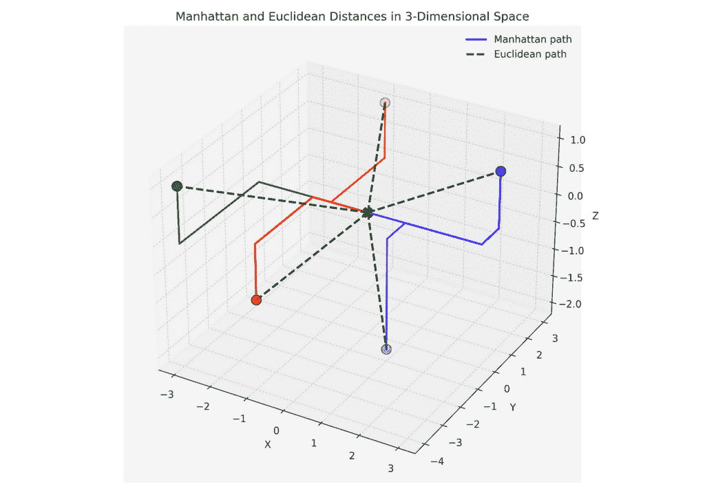

代码在 [Github](https://github.com/marco-hening-tallarico/From-a-Point-to-L-)

## L¹ vs. L² 损失函数—相似性与差异

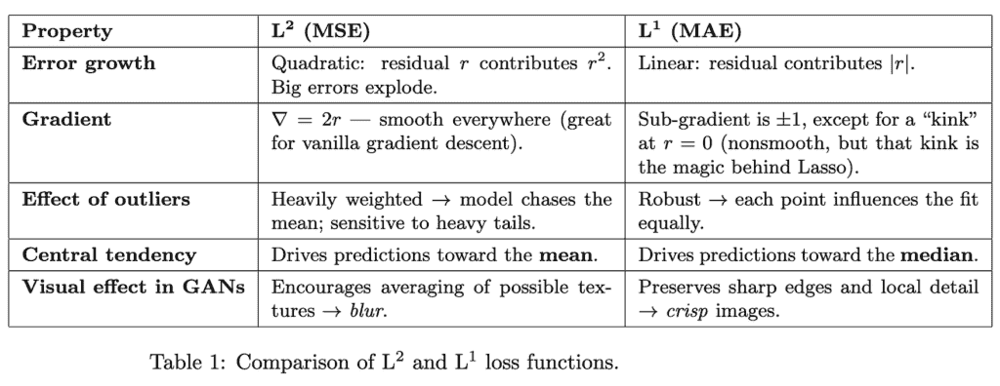

+   **如果你的数据可能包含许多异常值或重尾噪声**，你通常会求助于 **L¹**。

+   **如果你最关心整体平方误差并且数据相对干净**，**L²** 是可以接受的——并且更容易优化，因为它更平滑。

因为 MAE 按比例处理每个错误，使用 L¹ 训练的模型更靠近 **中位数** 观察值，这正是 L¹ 损失在 GANs 中保持纹理细节的原因，而 MSE 的二次惩罚将模型推向一个看起来模糊的 **平均值**。

### L¹ 正则化（Lasso）

优化和正则化朝相反的方向拉：优化试图完美地拟合训练集，而正则化故意牺牲一点训练精度以获得 **泛化能力**。添加 L¹ 惩罚 𝛼∥w∥₁​ 促进 **稀疏性**——许多系数完全塌陷到零。更大的 α 意味着更严格的特征修剪，更简单的模型，以及来自无关输入的更少噪声。在 Lasso 中，你得到 **内置特征选择**，因为 ∥w∥₁​​​ 项实际上关闭了小的权重，而 L² 只是缩小了它们。

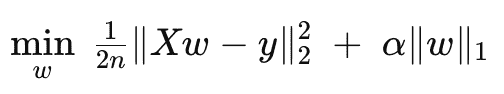

### L2 正则化（岭回归）

将正则化项更改为：

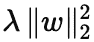

你还有 **岭回归**。Ridge **缩小** 权重趋向于零，而通常不会正好为零。这阻止了任何单个特征占主导地位，同时仍然保持每个特征都在游戏中——当你相信 **所有** 输入都很重要，但你想遏制过拟合时，这很有用。

Lasso 和 Ridge 都能提高 **泛化能力**；在 Lasso 中，一旦权重达到零，优化器就没有强烈的理由留下——就像站在平坦的地面上一样——所以零自然“粘”在那里。或者用更技术性的术语来说，它们只是以不同的方式塑造 **系数空间**——Lasso 的菱形约束集零坐标，Ridge 的球形约束集只是将它们压缩。如果你没有理解这一点，不要担心，这篇文章的范围之外有很多理论，但如果这对你感兴趣，这篇关于 [Lₚ 空间](https://en.wikipedia.org/wiki/Lp_space) 的阅读应该会有所帮助。

但回到正题。注意，当我们用相同的数据训练这两个模型时，Lasso 通过将系数精确设置为零来删除一些输入特征。

```py
from sklearn.datasets import make_regression
from sklearn.linear_model import Lasso, Ridge

X, y = make_regression(n_samples=100, n_features=30, n_informative=5, noise=10)

model = Lasso(alpha=0.1).fit(X, y)
print("Lasso nonzero coeffs:", (model.coef_ != 0).sum())

model = Ridge(alpha=0.1).fit(X, y)
print("Ridge nonzero coeffs:", (model.coef_ != 0).sum())
```

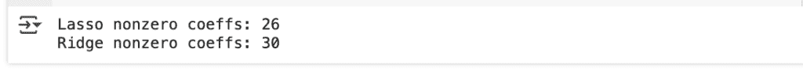

注意，如果我们将 **α** 增加到 10，将删除更多特征。这可能会相当危险，因为我们可能会丢失信息数据。

```py
model = Lasso(alpha=10).fit(X, y)
print("Lasso nonzero coeffs:", (model.coef_ != 0).sum())

model = Ridge(alpha=10).fit(X, y)
print("Ridge nonzero coeffs:", (model.coef_ != 0).sum())
```

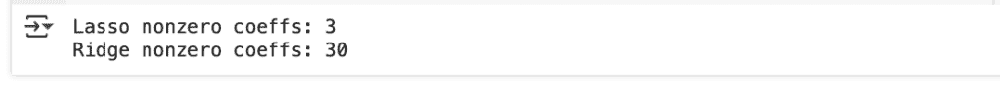

### 生成对抗网络（GANs）中的 L¹ 损失

GANs 将两个网络相互对抗，一个 **生成器** **G**（“伪造者”）对抗一个 **判别器** **D**（“侦探”）。为了使 **G** 生成令人信服且忠实的图像，许多图像到图像的 GANs 使用一个 **混合损失**

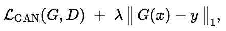

其中

+   ***x***—输入图像（例如，一张草图）

+   ***y***—真实目标图像（例如，一张照片）

+   ***λ***—现实与保真度之间的平衡旋钮


将像素损失转换为**L²**，你会平方像素误差；大的残差主导目标，因此**G**通过预测所有可能的纹理的*平均值*来确保安全—结果：更平滑、更模糊的输出。使用**L¹**，每个像素误差都同等重要，因此**G**倾向于*中值*纹理块并保持清晰的边界。

### 为什么微小的差异很重要

+   在回归中，**L¹**导数的拐角让**Lasso**能够将弱预测器的系数置零，而**Ridge**只是稍微调整它们。

+   在视觉中，**L¹**的线性惩罚保留了**L²**模糊掉的高频细节。

+   在这两种情况下，你可以混合**L¹**和**L²**来权衡**鲁棒性**、**稀疏性**和优化平滑性—这正是现代机器学习目标核心的平衡行为。

## 将距离推广到 Lᵖ

在我们达到**L∞**之前，我们需要讨论每个**范数**必须满足的四个规则：

+   **非负性**—距离不能为负；没有人会说“我离游泳池有-10 米远。”

+   **正定性**—距离仅在零向量处为零，即没有发生位移

+   **绝对均匀性（可扩展性）**—通过α缩放向量，其长度按|α|缩放：如果你加倍速度，你的距离也会加倍

+   **三角不等式**—绕 y 的迂回路径永远不会比直接从起点到终点（x + y）短

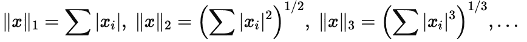

在本文的开头，我们进行的数学抽象相当简单。但现在，当我们查看以下范数时，你可以看到我们在更深层次上做了类似的事情。有一个明显的模式：求和内部的指数每次增加 1，求和外部的指数也增加。我们还检查了这种更抽象的距离概念是否仍然满足我们上面提到的核心属性。它是。因此，我们所做的是成功地将距离的概念抽象到 Lᵖ空间中。

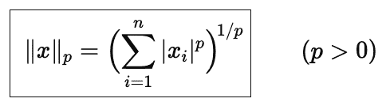

作为单一的距离**Lᵖ空间**的*家族*。当 p→∞时，将这个家族压缩到**L∞范数**。

## L∞范数

L∞范数有许多名称，如**最大值范数、最大范数、一致范数、切比雪夫范数**，但它们都具有以下极限特征：

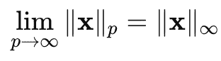

通过将我们的范数推广到 p 空间，我们可以在两行代码中编写一个函数，该函数可以计算任何可想象的范数的距离。非常有用。

```py
def Lp_norm(v, p):
    return sum(abs(x)**p for x in v) ** (1/p)
```

我们现在可以思考，当***p***增加时，我们的距离度量是如何变化的。查看下面的图表，我们看到我们的距离度量单调递减，并趋近于一个非常具体的点：向量的最大绝对值，用黑色虚线表示。

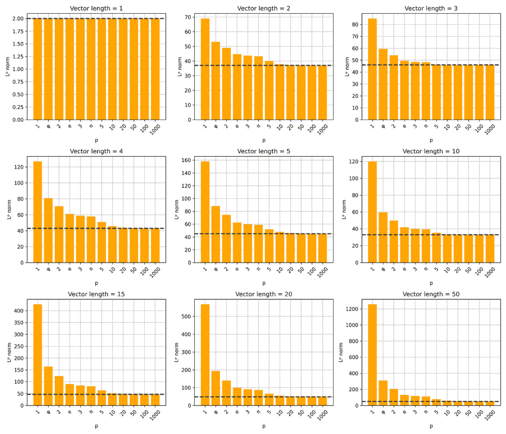

Lp 范数收敛到最大绝对坐标。

事实上，它不仅接近我们向量的最大绝对坐标，

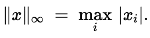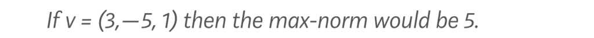

最大范数在任何需要**均匀保证**或**最坏情况控制**的时候出现。用非技术术语来说，如果没有任何单个坐标可以超过某个特定阈值，那么应该使用 L∞范数。如果你想要为你的向量的每个坐标设置一个硬上限，那么这也是你的首选范数。

这不仅仅是一个理论上的怪癖，而是一件非常有用的事情，并且在许多不同的环境中得到了很好的应用：

+   **最大绝对误差**—限制每个预测，使其不会漂移得太远。

+   **最大绝对值特征缩放**—将每个特征压缩到[−1,1]区间内，而不扭曲稀疏性。

+   **最大范数权重约束**—保持所有参数在一个轴对齐的盒子内。

+   **对抗鲁棒性**—将每个像素扰动限制在ε立方体（一个 L∞球体）内。

+   **Chebyshev 距离**在 k-NN 和网格搜索中—测量“国王步”的最快方式。

+   **鲁棒回归 / Chebyshev 中心投资组合问题**—线性规划，最小化最大残差。

+   **公平上限**—限制每个组的最大违规，而不仅仅是平均值。

+   **边界框碰撞测试**—将对象包裹在轴对齐的盒子中，以便快速检查重叠。

> *有了我们更抽象的距离概念，各种有趣的问题都浮出水面。我们可以考虑**p**值不是整数的情况，比如**p = π**（如你将在上面的图表中看到的）。我们还可以考虑**p** ∈ (0,1)，比如**p** = 0.3，这还会符合我们所说的每个范数必须遵守的 4 条规则吗？*

## 结论

抽象距离的概念可能会感觉难以驾驭，甚至可能是无谓的理论化，但将其提炼到其核心属性，就让我们能够提出其他情况下无法构建的问题。这样做揭示了具有具体、实际应用的新范数。虽然诱人将所有距离度量视为可互换的，但小的代数差异给每个范数赋予了独特的属性，这些属性塑造了基于它们的模型。从回归中的偏差-方差权衡到 GANs 中清晰或模糊图像的选择，距离的度量方式至关重要。

* * *

我接下来的文章：

Tallarico, M. H. (2025 年 5 月 12 日)。你能发现泄露吗？数据科学挑战：当模型飞得太高：一次危险的数据泄露之旅。Towards Data Science。[链接](https://towardsdatascience.com/will-you-spot-the-leaks-a-data-science-challenge/)。[谷歌学术](https://scholar.google.com/citations?view_op=view_citation&hl=en&user=uCZbo_kAAAAJ&citation_for_view=uCZbo_kAAAAJ:IjCSPb-OGe4C)。

我之前的文章：

Tallarico, M. H. (2025). 暴风雨还是信号：交易代理对决：使用强化学习测试天气是否具有优势。AI Advances。[链接](https://medium.com/ai-advances/storm-or-signal-a-trading-agent-showdown-5f3d662b2cef)。[谷歌学术](https://scholar.google.com/citations?view_op=view_citation&hl=en&user=uCZbo_kAAAAJ&citation_for_view=uCZbo_kAAAAJ:UeHWp8X0CEIC)。

* * *

[网站](https://marcoheningtallarico.com/) | [领英](https://www.linkedin.com/in/marco-hening-tallarico/) | [GitHub](https://github.com/marco-hening-tallarico?tab=repositories)

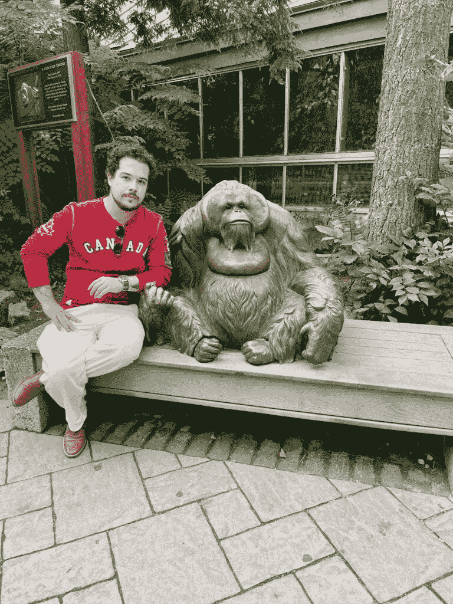

作者
