# 从经典模型到人工智能：数据中心能源和水效率的湿度预测

> 原文：[`towardsdatascience.com/from-classical-models-to-ai-forecasting-humidity-for-energy-and-water-efficiency-in-data-centers-2/`](https://towardsdatascience.com/from-classical-models-to-ai-forecasting-humidity-for-energy-and-water-efficiency-in-data-centers-2/)
> 
> > *预防胜于治疗*。
> > 
> > *本杰明·富兰克林*
> > 
> ## 1\. <mdspan datatext="el1761935136721" class="mdspan-comment">湿度预测的重要性</mdspan>
> ## 
> 随着人工智能对电力的需求激增，使其成为可能的基础设施正在面临有限资源的压力。到 2028 年，新的研究表明，人工智能可能消耗的电力相当于美国所有家庭的 22%[1]。高性能人工智能芯片的机架至少比数据中心中的传统服务器多消耗 10 倍的电力。因此，会产生大量的热量，冷却系统占据了大部分建筑空间[2]。除了碳足迹外，人工智能还有相当大的水足迹，其中大部分在水资源紧张的地区。例如，GPT-3 在微软的美国数据中心训练时需要 540 万升水[3]。季节性预测对于数据中心内部设备的日常运行至关重要。天气条件，如温度和湿度，会影响数据中心内部冷却系统的工作强度[4]。
> 
> 在本文中，湿度预测以多种方式进行计算。更好的温度和湿度预测可以促进更有效的负载规划、优化冷却时间表，并减少对电力和本地水源的需求。现在，由于本文主要讨论湿度，让我们看看其极端值的影响：
> 
> +   **高湿度**：冷凝成为一个大问题——它可能会腐蚀硬件并引发电气故障。它还使冷却器工作更努力，消耗更多能源和水。
> +   
> +   **低湿度**：危险反转：静电和静电放电（ESD）可以积累并损坏敏感的芯片。
> +   
> 准确的湿度预测可以帮助：
> 
> +   微调冷却时间表
> +   
> +   确定需求峰值
> +   
> +   安排维护
> +   
> +   在环境条件导致昂贵的停机时间之前重新分配工作负载
> +   
> 通过实施上述保护措施，我们减轻了电力和本地水源的压力，确保了人工智能中心的弹性和分布式计算基础设施的整体效率。
> 
> 不仅数据中心会受到湿度的影响；边缘设备，如传感器，也可能受到影响。由于它们通常位于户外和偏远地区，这些设备更容易受到天气条件的影响。边缘应用通常需要低延迟的预测。这有利于使用较轻的算法，例如 *XGBoost*。因此，在下面的预测部分，将讨论 *XGBoost* 和其他轻量级算法。
> 
> 让我们通过讨论位于月球上的数据中心的前瞻性封面图像来结束本节。月球数据中心将不受地球许多限制的影响，例如极端天气和地震。此外，月球提供了一个完美的中立数据所有权场所。事实上，在 2025 年 2 月 26 日，*SpaceX*发射了一枚*Falcon 9*火箭，该火箭携带了*Intuitive Machines Athena*月球着陆器 [5]。在众多事物中，*Athena*包含了一个名为*Freedom*的小型数据中心，由*Lonestar Holdings*开发。然而，*Athena*无法完成完全垂直的着陆，但*Freedom*在着陆前成功进行了数据操作。此外，尽管*Athena*着陆器在陨石坑内着陆，但*Freedom*数据中心幸存了下来，并证明了月球数据中心的可行性 [6]。
> 
> ## 2. 一个真实案例研究：使用精确区间预测湿度
> ## 
> 考虑到天气预报对数据中心的重要性，我转向了来自*Kaggle*的实时数据集，其中包含德里每日气候测量数据。印度拥有强大的数据中心产业。根据*DataCenters.com* [7]，德里目前有 30 个数据中心，德里开发商将投资 20 亿美元以进一步扩大印度数据中心的发展 [8]。
> 
> 数据包含温度、湿度、风速和大气压力测量值。提供了一个训练集，我们在其中训练了我们的模型，以及一个测试集，我们在其中测试了模型。关于*Kaggle*数据和其许可信息可在本文脚注中找到。
> 
> 虽然温度、风速和压力都会影响冷却需求，但我专注于湿度，因为它在蒸发冷却和水消耗中起着重要作用。湿度变化的速度也比温度快，因此，它是预测建模一个非常有意义的指标。
> 
> 我从经典方法如*AutoARIMA*开始，然后转向更灵活的模型，如*Facebook 的 Prophet*和*XGBoost*，最后以深度学习模型结束。以下是本文中所有预测方法的完整列表：
> 
> +   *AutoARIMA*
> +   
> +   *Prophet*
> +   
> +   *NeuralProphet*
> +   
> +   *随机森林*
> +   
> +   *XGBoost*
> +   
> +   *混合专家模型*
> +   
> +   *N-BEATS*
> +   
> 在这个过程中，我比较了准确性、可解释性和部署可行性**——这不是一项学术练习，而是为了回答一个实际问题：哪些预测工具可以提供可靠、可操作的气候预测，帮助数据中心优化冷却、降低能源成本并节约用水？
> 
> 此外，每个预测图都将包括一个**预测区间**，而不仅仅是单一的预测线。单独的线条可能会误导，因为它暗示我们“知道”未来某一天的精确湿度水平。由于天气从不确定，操作员需要不止一个预测。预测区间提供了一个可能的湿度值范围，反映了模型限制和自然变异性。
> 
> 置信区间告诉我们关于平均预测的信息。预测区间更宽——它们覆盖了实际湿度读数可能落在的区域。对于操作员来说，这种差异是关键的：低估范围会风险过热；高估它则会花费超过所需的金额。
> 
> 判断预测区间的良好方法是通过***覆盖率**。在 95%的置信区间中，我们预计大约 95 个点中的 100 个将落在其中。如果只有 86 个，则模型过于自信。**正规预测**调整范围，使*覆盖率*与承诺的一致。
> 
> 正规预测法从模型过去的误差（残差 = 实际值 - 预测值）中提取一个典型的误差大小（这些残差的分位数），并将其添加到每个新的预测周围，以创建一个覆盖真实值的所需概率的区间。
> 
> 这里是预测区间计算的主要算法：
> 
> 1.  创建一个校准集。
> 1.  
> 1.  计算残差：
> 1.  
> 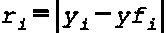
> 
> 其中方程右侧的第一个项是实际观察到的值，第二个项是同一点的模型预测。
> 
> 3. 找到残差的分位数：
> 
> 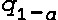
> 
> 其中 alpha 是显著性水平，例如 0.05。
> 
> 4. 形成新的预测的正则区间：
> 
> 时间 t 的区间等于：
> 
> 
> 
> ## 3. 数据和预测方法（带代码）
> ## 
> 本文讨论的所有预测方法的代码在*Github*上。目录链接在文章末尾。在我们讨论预测方法之前，让我们看看我们的数据。图 1 显示了训练数据，图 2 显示了测试数据。如图 1 所示，训练数据表现出稳定、平稳的行为。然而，图 2 讲述了一个不同的故事：测试期间打破了这种稳定性，出现了明显的下降趋势。这种鲜明的对比提高了风险。
> 
> 我们预计结构化方法，如 ARIMA，和传统机器学习方法，如随机森林，将难以捕捉到下降趋势，因为它们不具备时间意识。另一方面，深度学习预测方法可以理解测试序列反映了训练数据中的相似季节段，因此更有能力捕捉到下降趋势。
> 
> 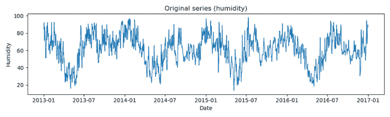
> 
> **图 1. 湿度训练数据**
> 
> 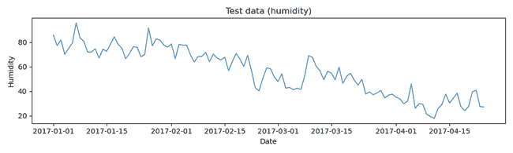
> 
> **图 2. 测试湿度数据**
> 
> ### 3. A. *AutoARIMA* 预测
> ### 
> *ARIMA*（自回归积分移动平均）模型结合了三个要素：
> 
> +   *AR*项捕捉过去值的记忆
> +   
> +   *MA*项考虑过去的预测误差
> +   
> +   差分（“I”）用于去除趋势并使序列平稳。
> +   
> #### 3. A. 1. AutoARIMA 测试数据预测
> #### 
> 传统上，分析师必须在拟合模型之前测试平稳性并决定应用多少差分。这是一个困难的过程，也可能容易出错。*AutoARIMA*通过在幕后运行统计测试来减轻这种负担。它自动决定差分的程度，并在*AR*和*MA*组合中搜索以根据信息标准选择最佳拟合。简而言之，你可以给它原始的非平稳数据，它将为你处理侦探工作——使其既强大又简单。
> 
> 图 3 显示了*AutoARIMA*的预测（橙色虚线）和预测区间（黄色阴影区域）。*ARIMA*可以跟随短期波动，但无法捕捉到更长的下降趋势；因此，预测变成了一条稳定的线。这是一个典型的限制：*ARIMA*可以捕捉局部自相关性，但不能捕捉演变的动态。预测区间的扩大是有意义的——它们反映了随着时间的推移不确定性在增加。
> 
> 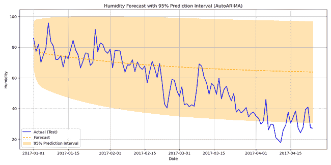
> 
> **图 3. *AutoARIMA*对测试数据的预测，包括预测区间。**
> 
> #### 3. A. 2. *AutoARIMA*的准确性和预测区间的覆盖率
> #### 
> | MSE | RMSE | MAE |
> | --- | --- | --- |
> | 398.19 | 19.95 | 15.37 |
> 
> **表 1. *AutoARIMA*的误差**
> 
> 在表 1 中，我们报告了三种不同的误差：*MSE*、*RMSE*和*MAE*，以提供一个关于模型准确性的完整图景。*RMSE*和*MAE*是最容易阅读的，因为它们使用与目标相同的单位。*RMSE*对大误差赋予更多权重，而*MAE*告诉你误差的平均大小。我们还报告了*MSE*，它不太直观但常用于比较。
> 
> 关于预测区间，我们没有应用一致性预测，因为*ARIMA*已经返回基于模型的 95%预测区间。这些区间是从*ARIMA*的统计假设中得出的，而不是从模型无关的一致性预测框架中得出的。然而，不使用一致性预测导致了预测区间的覆盖率不完美（85.96%）。
> 
> #### 3. A. 3. *AutoARIMA*的可解释性
> #### 
> *AutoARIMA*的一个吸引人的方面是很容易“看到”模型正在做什么。图 4 展示了偏自相关函数（*PACF*），它计算一个平稳时间序列与其自身滞后值的偏相关性。这个图显示，今天的湿度仍然“记得”昨天和前几天，相关性随着时间的推移而减弱。这种持续的回忆正是*ARIMA*用来构建其预测的。
> 
> 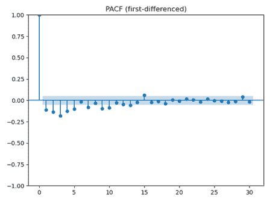
> 
> **图 4. *PACF*图**
> 
> 此外，我们还运行了*KPSS*测试，这证实了训练数据确实是平稳的。
> 
> #### 3. A. 4. 部署模式
> #### 
> *AutoARIMA*易于部署：一旦给定一个时间序列，它将自动选择订单并拟合，无需手动调整。它轻的计算足迹使其适用于批量预测，甚至适用于资源有限的边缘设备部署。然而，它的简单性意味着它最适合稳定的环境，而不是有突然结构变化的环境。
> 
> ### 3\. B. *Prophet*预测
> ### 
> 在本节中，我们将讨论*Prophet*，这是一个由*Facebook*（现在是*Meta*）最初开发的开放预测库。*Prophet*将时间序列视为三个关键部分的和：趋势、季节性和假日或特殊事件：
> 
> +   趋势：趋势可以通过直线建模，直线可以在变化点弯曲，或者通过饱和增长曲线建模，这种曲线先快速上升然后趋于平稳。这就像数据中心冷却需求随着工作负载增长，但最终在系统达到容量后趋于平稳。
> +   
> +   季节性通过平滑的*傅里叶*项捕捉，因此可以自动学习到诸如每周或年度周期等重复模式。
> +   
> +   可以将假日或事件添加为回归器来解释一次性峰值。
> +   
> 因此，我们看到*Prophet*具有非常方便的附加结构。这使得*Prophet*易于理解，并且对混乱的真实世界数据具有鲁棒性。
> 
> 下面的代码片段 1 展示了如何训练和拟合*Prophet*模型，并使用它来预测测试数据。请注意，*Prophet*预测返回*yhat_lower*和*yhat_upper*，这是预测区间的界限，并将预测区间设置为 95%（代码的第 1 行）。因此，与上面的*AutoARIMA*一样，预测区间不是来自一致性预测。
> 
> ```py
> #Train and Fit the Prophet Model
> model = Prophet(interval_width=0.95)
> model.fit(train_df)
> #Forecast on Test Data
> future = test_df[['ds']].copy()
> forecast = model.predict(future)
> cols = ['ds', 'yhat', 'yhat_lower', 'yhat_upper']
> forecast_sub = forecast[cols]
> y_true = test_df['y'].to_numpy()
> yhat       = forecast['yhat'].to_numpy()
> yhat_lower = forecast['yhat_lower'].to_numpy()
> yhat_upper = forecast['yhat_upper'].to_numpy() 
> ```
> 
> **代码片段 1\. 使用*Prophet*进行训练和预测**
> 
> #### 3\. B. 1\. *Prophet*测试数据预测
> #### 
> 图 5 展示了*Prophet*对测试数据的预测（橙色线）和预测区间（蓝色阴影区域）。与*AutoArima*相比，我们可以看到*Prophet*的预测很好地捕捉了数据的下降趋势。
> 
> 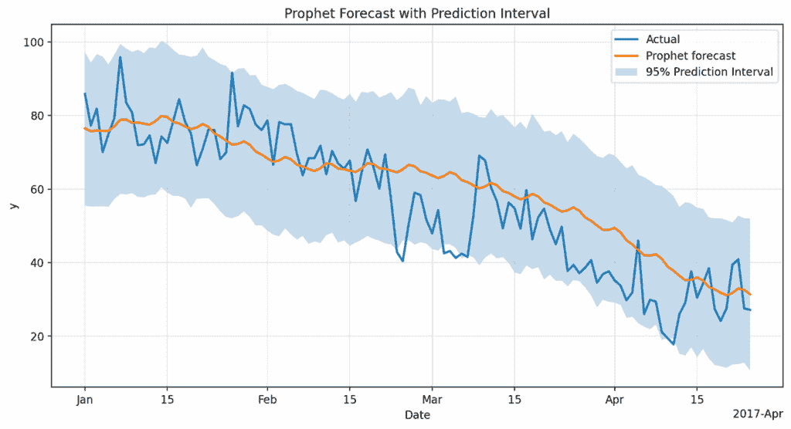
> 
> **图 5\. 带预测区间的*Prophet*测试数据预测**
> 
> #### 3\. B. 2\. *Prophet*准确性和预测区间覆盖率
> #### 
> | MSE | RMSE | MAE |
> | --- | --- | --- |
> | 105.26 | 10.25 | 8.28 |
> 
> **表 2\. Prophet 误差。**
> 
> 与*AutoARIMA*相比，*Prophet*的预测改进也可以在上述表 2 中看到，它描述了误差。
> 
> 正如我们上面所说的，预测区间不是使用一致性预测推导出来的。然而，与*AutoARIMA*相比，预测区间的*覆盖率*要好得多：93.86%。
> 
> #### 3\. B. 3\. *Prophet*可解释性
> #### 
> 正如我们上面所说的**，*Prophet*是透明可加的：它将预测分解为趋势、平滑的季节性和可选的假日/回归器效应，因此组件图可以精确显示每个部分如何贡献于*`yhat`*以及每个驱动因素如何移动预测。
> 
> 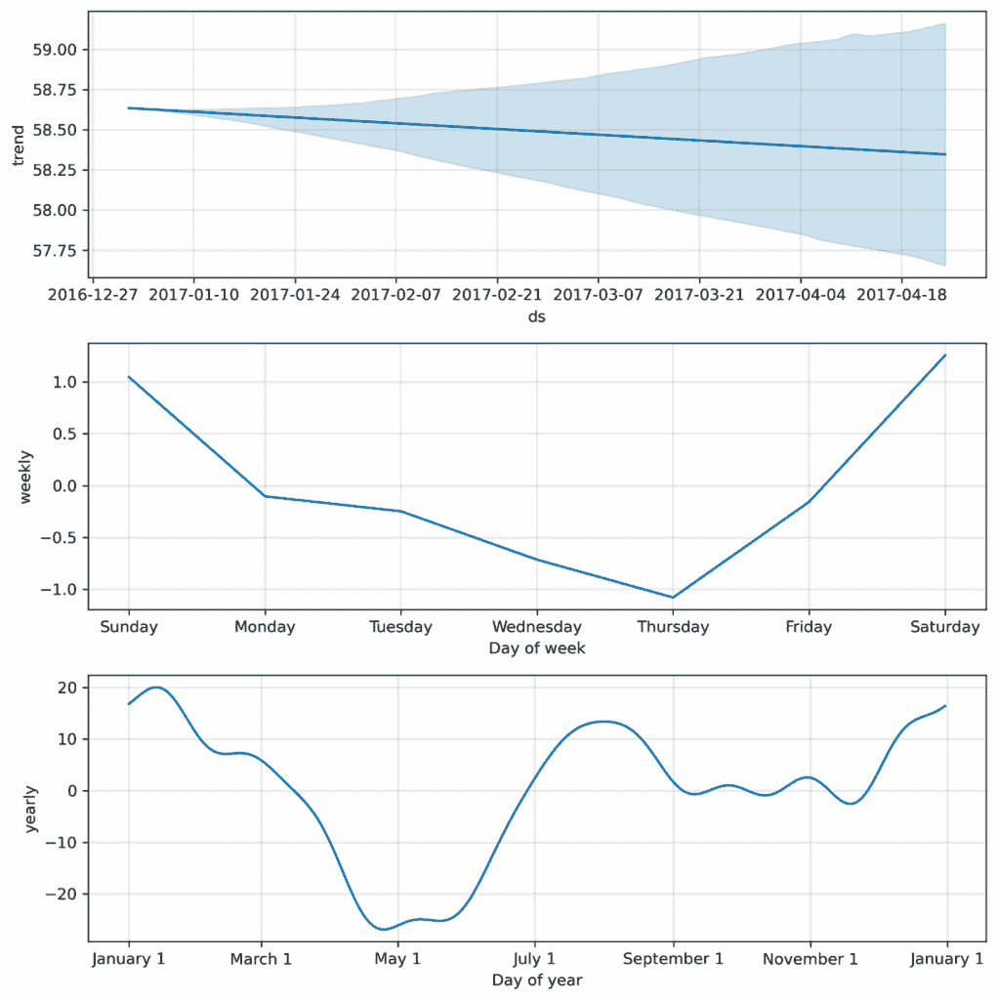
> 
> **图 6\. *Prophet* 预测组件。**
> 
> 上图 6 显示了 *Prophet* 的预测组件：随着时间的推移呈现温和的下降趋势（顶部），一个每周周期，周末湿度更高，而中间一周更干燥（中部），以及一个年度周期，冬季湿度高，春季下降，夏季和秋季再次上升（底部）。
> 
> #### 3\. B. 4\. *Prophet* 的部署模式
> #### 
> *Prophet* 部署简单，在标准 CPU 上运行效率高，可以大规模使用或在边缘设备上使用，非常适合需要快速、可解释预测的商业应用。
> 
> ### 3\. C. 使用 *NeuralProphet* 进行预测
> ### 
> *NeuralProphet* 是 *Prophet* 的基于神经网络的扩展。它保留了相同的核心结构（趋势 + 季节性 + 事件），但增加了：
> 
> +   一个前馈神经网络来捕捉更复杂、非线性的模式。
> +   
> +   支持滞后回归和自回归（可以直接使用过去值，如 AR 模型）。
> +   
> +   更灵活地学习多个季节性和高阶交互的能力。
> +   
> *Prophet* 具有统计和可加性的优秀特性，这使预测变得透明且快速。*NeuralProphet* 建立在这样一个框架之上，但引入了深度学习。*NeuralProphet* 可以捕捉非线性自回归效应，但额外的灵活性使其更难解释。
> 
> 如下面的代码片段 2 所示，我们在模型中使用了季节性来利用湿度的季节模式。
> 
> ```py
> model = NeuralProphet(
>     seasonality_mode='additive',
>     yearly_seasonality=False,
>     weekly_seasonality=False,
>     daily_seasonality=False,
>     n_changepoints=10,
>     quantiles=[0.025, 0.975]  # For 95% prediction interval
> )
> # Add custom seasonality (~6 months)
> model.add_seasonality(name='six_month', period=180, fourier_order=5)
> model.fit(train, freq='D', progress='bar')
> future=model.make_future_dataframe(train,periods=len(test), n_historic_predictions=len(train))
> forecast = model.predict(future) 
> ```
> 
> **代码片段 2\. 使用 *NeuralProphet* 进行训练和预测**
> 
> #### 3\. C. 1\. *NeuralProphet* 测试数据预测
> #### 
> 图 7 显示了 *NeuralProphet* 的预测（虚线绿色线）和预测区间（浅绿色阴影区域）。与 *Prophet* 类似，*NeuralProphet* 的预测很好地捕捉了数据的下降趋势。
> 
> 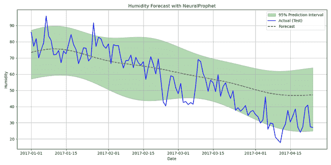
> 
> **图 7\. 带预测区间的 *NeuralProphet* 对测试数据的预测**
> 
> #### 3\. C. 2\. *NeuralProphet* 准确性和预测区间覆盖率
> #### 
> | MSE | RMSE | MAE |
> | --- | --- | --- |
> | 145.31 | 12.05 | 9.64 |
> 
> **表 3\. *NeuralProphet* 误差。**
> 
> 值得注意的是，尽管增加了神经增强和季节性的添加，*NeuralProphet* 的误差略高于 *Prophet*。*NeuralProphet* 增加了更多的动态部分，但这并不总是转化为更好的预测。在有限或混乱的数据上，其额外的灵活性实际上可能对其不利，而 *Prophet* 的简单设置通常能保持预测的稳定性并略微提高准确性。
> 
> 关于精度区间，它是使用 *NeuralProphet* 返回的极限变量 *yhat1 2.5* 和 *yhat1 97.5* 绘制的。95% 预测区间的 *覆盖率* 为 83.33%。这很低，但这是预期的，因为它不是使用一致性预测计算的。
> 
> #### 3\. C. 3\. *NeuralProphet* 可解释性
> #### 
> 下图 8 中的三个面板分别显示：
> 
> +   面板 1\. **趋势**：显示学习到的基线水平和分段线性趋势中的斜率变化（变化点）。
> +   
> +   面板 2. ***趋势率变化***：条形/尖峰表示趋势的斜率在每个变化点跳跃的程度（正值=增长更快，负值=减速/下降）。
> +   
> +   面板 3. ***季节性***：季节成分的单期形状/强度。
> +   
> 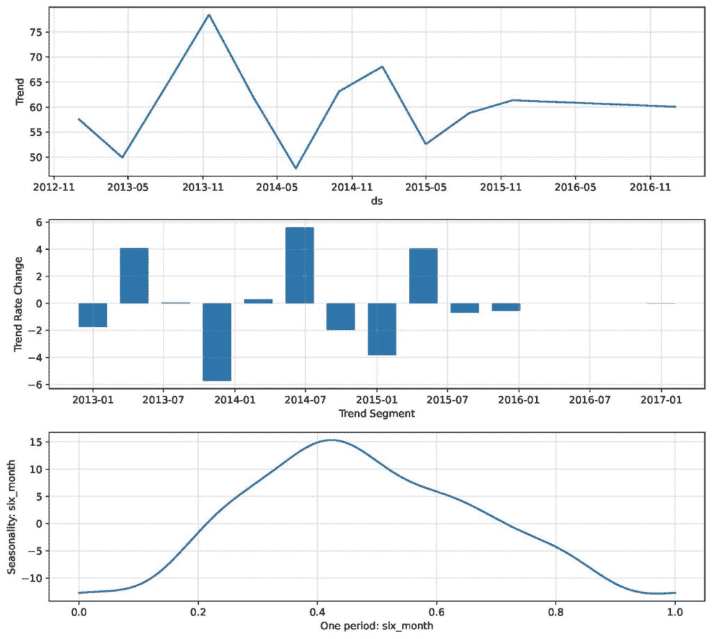
> 
> **图 8**。这三个面板显示了模型估计的学习趋势基线、趋势率变化和 6 个月季节性。这些突出了 NeuralProphet 如何检测斜率和整体变化动态的变动。
> 
> #### 3. C. 4. *NeuralProphet*部署模式
> #### 
> *NeuralProphet*在 CPU 上运行良好，可用于计划任务或小型 API。虽然比*Prophet*更重，但对于大多数容器化或批量部署来说仍然实用，并且也可以在经过一些设置后运行在边缘设备上，如*Raspberry Pi*。
> 
> ### 3. D. *随机森林*预测
> ### 
> *随机森林*是一种可以用于预测的机器学习技术。这是通过将过去值和外部因素转换为特征来实现的。这是它的工作方式：首先，它在数据随机选择的各个部分上构建多个决策树。然后，它平均它们的结果。这有助于避免过拟合并捕捉非线性模式。
> 
> #### 3. D. 1. *随机森林*预测
> #### 
> 下面的图 9 显示了*随机森林*预测（橙色线）和预测区间（蓝色阴影区域）。我们可以看到*随机森林*的表现并不好。这是因为*随机森林*并没有真正“理解”时间。它不是遵循数据的自然顺序，而是像看待普通特征一样查看滞后值。这使得模型擅长捕捉某些非线性模式，但在识别长期趋势或随时间的变化上较弱。结果是预测看起来过于平滑且不够准确，这也解释了更高的*MSE*。
> 
> 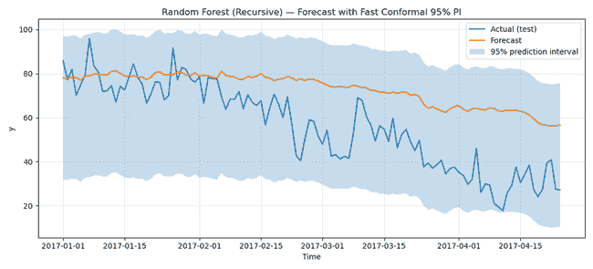
> 
> **图 9**. 带精确度区间的*随机森林*测试数据预测
> 
> #### 3. D. 2. *随机森林*准确性和精确度区间
> #### 
> | MSE | RMSE | MAE |
> | --- | --- | --- |
> | 448.77 | 21.18 | 17.6 |
> 
> **表 4**. 随机森林误差
> 
> *随机森林*表现不佳也体现在上表 4 中显示的高误差值。
> 
> 关于预测区间，**这是第一种使用一致性预测来计算预测区间的预测技术**。
> 
> 预测区间的覆盖率估计为令人印象深刻的 100%。
> 
> #### 3. D. 3. *随机森林*可解释性
> #### 
> 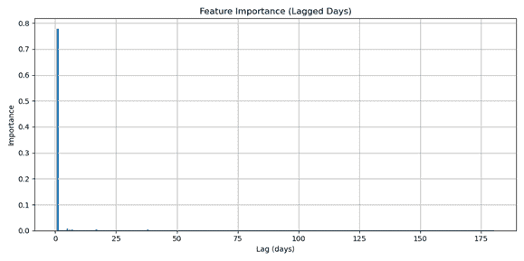
> 
> **图 10**. *随机森林*滞后重要性
> 
> *随机森林*通过对其预测中使用的特征的重要性进行排序，提供了一些可解释性。在时间序列预测中，这通常意味着检查哪些目标变量的滞后对模型的预测贡献最大。图 10 中上面的特征重要性图显示，最近的滞后（一天前）占主导地位，承担了近 80%的预测权重，而所有更长的滞后几乎没有任何贡献。这表明*随机森林*在做出预测时严重依赖于即时过去值，平滑了长期依赖关系。虽然这种可解释性有助于我们了解模型“看”的是什么，但它也突出了为什么与更适合序列结构的其他方法相比，*随机森林*可能在捕捉更广泛的时序动态方面表现不佳。
> 
> #### 3\. D.4\. 随机森林部署模式
> #### 
> *随机森林*模型部署相对轻量，因为它们由一系列决策树组成，不需要特殊的硬件或复杂的运行时。它们可以被导出并在标准服务器、嵌入式系统或有限的“计算”能力的边缘设备上高效运行，这使得它们适用于资源受限的实时应用。然而，当使用许多树时，它们的内存占用可能会增加，因此在边缘环境中可以应用紧凑版本或树剪枝。
> 
> **3\. E. *XGBoost*预测**
> 
> *XGBoost*是一种提升算法，它一个接一个地构建树，每个新树都纠正前一个树的错误。在预测中，我们向它提供滞后值、滚动平均值和外部变量等特征，使其能够学习时间模式和变量之间的关系。它之所以效果良好，是因为它结合了强大的正则化，这使得它比简单的方法更有效地处理大型和复杂的数据集。但是，像*随机森林*一样，它不自然地处理时间顺序，因此其成功很大程度上取决于基于时间特征的设计是否良好。
> 
> #### 3\. E. 1\. XGBoost 测试数据预测
> #### 
> 图 11 展示了*XGBoost*预测（橙色线）和预测区间（蓝色阴影区域）。我们可以看到预测紧密跟随湿度信号，因此在预测湿度方面非常成功。这也可以在下面的表 5 中得到证实，其中描绘了相对较小的误差，尤其是在与*随机森林*相比时。
> 
> 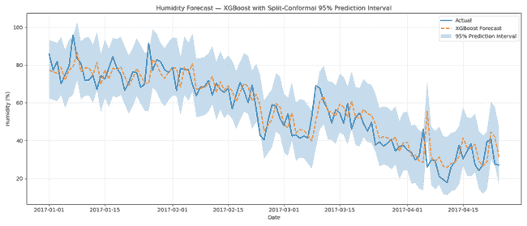
> 
> **图 11. *XGBoost*对测试数据的预测。**
> 
> *XGBoost*按顺序构建树，这是其优势的来源。正如我们之前所说，每个新树都纠正前一个树的错误。这个提升过程与强大的正则化相结合。这种方法可以捕捉快速变化，处理复杂模式，同时保持可靠性。这通常使得其预测比*随机森林*的预测更接近现实。
> 
> #### 3\. E. 2\. *XGBoost*预测准确性和预测区间覆盖率
> #### 
> | MSE | RMSE | MAE |
> | --- | --- | --- |
> | 57.46 | 7.58 | 5.69 |
> 
> **表 5\. *XGBoost* 预测误差。**
> 
> 在这里，我们也使用了一致性预测来计算预测区间。因此，精度区间的 *覆盖率* 很高：94.74%
> 
> #### 3\. E. 3\. *XGBoost* 预测解释性
> #### 
> 尽管复杂，但与深度学习模型相比，*XGBoost* 仍然相当可解释。它提供了特征重要性分数，显示了哪些滞后值或外部变量驱动了预测。我们可以查看特征重要性图，就像在 *随机森林* 中一样。为了更深入的了解，*SHAP* 值显示了每个因素如何影响单个预测。这既提供了整体图景，也提供了逐个案例的洞察。
> 
> 下面的图 12 显示了特征权重，例如它在分割中使用的频率。
> 
> 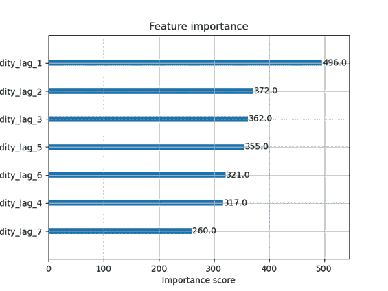
> 
> **图 12\. *XGBoost* 滞后期重要性。**
> 
> 下面的序列显示了每个滞后期的增益，即使用滞后期时的平均改进。
> 
> {'humidity_lag_1': 3431.917724609375, ‘humidity_lag_2’: 100.19515228271484, ‘humidity_lag_3’: 130.51077270507812, ‘humidity_lag_4’: 118.07515716552734, ‘humidity_lag_5’: 155.8759307861328, ‘humidity_lag_6’: 152.50379943847656, ‘humidity_lag_7’: 139.58169555664062}
> 
> 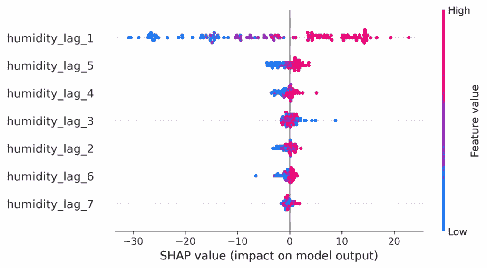
> 
> **图 13\. *SHAP* 值对于 *XGBoost* 滞后期。**
> 
> 图 13 中的 *SHAP* 概述图显示，*humidity_lag_1* 是最有影响力的特征，高近期的湿度值推动预测向上，而低近期的湿度值将预测向下拉。较晚的滞后期（2-7）只扮演了次要角色，表明模型主要依赖于最近的观测值来做出预测。
> 
> #### 3\. E. 4\. *XGBoost* 部署模式
> #### 
> *XGBoost* 也易于在各个平台上部署，从云服务到嵌入式系统。与 *随机森林* 相比，其主要优势在于效率：模型通常更小，推理速度更快。这使得模型适用于实时应用。它支持多种语言和平台，使得在各种环境中实现变得容易。
> 
> ### 3\. F. *专家混合* (*MoE*) 预测
> ### 
> *MoE* 方法结合了几个专门模型（“专家”），每个模型都调整以捕捉数据的不同方面，并使用一个 *门控网络* 来确定每个专家在最终预测中的权重。
> 
> 在代码片段 3 中，我们看到了 *AutoGluon* 和 *Chronos* 这两个关键字。让我们解释一下它们是什么：我们使用 *Hugging Face* 模型通过 *AutoGluon* 实现了 *专家混合*，其中 *Chronos* 作为专家之一。*Chronos* 是一个使用转换器构建的时间序列预测模型系列。*AutoGluon* 是一个有用的 *AutoML* 框架，可以处理表格、文本、图像和时间序列数据。*专家混合* 只是它用来通过模型集成提高性能的许多策略之一。
> 
> ```py
> from autogluon.timeseries import TimeSeriesDataFrame, TimeSeriesPredictor
> MODEL_REPO = "autogluon/chronos-bolt-small"  
> LOCAL_MODEL_DIR = "models/chronos-bolt-small
> predictor_roll = TimeSeriesPredictor(
>     prediction_length=1,
>     target="humidity",
>     freq=FREQ,
>     eval_metric="MSE",
>     verbosity=1
> )
> predictor_roll.fit(train_data=train_tsd, hyperparameters=hyperparams, time_limit=None) 
> ```
> 
> **代码片段 3：拟合 *Autogluon* 模型 *TimeSeriesPredictor***
> 
> 在上面的代码片段 3 中，预测器被命名为 *predictor_roll*，因为 *MoE* 预测以滚动方式生成预测：每个预测值都会反馈到模型中以预测下一步。这种方法反映了时间序列数据的顺序性。它还允许门控网络在预测的每个点上动态调整它所依赖的专家。滚动预测还揭示了错误随时间累积的方式。这样，我们就能获得多步性能的更真实视图。
> 
> #### 3. F. 1. *MOE* 测试数据预测
> #### 
> 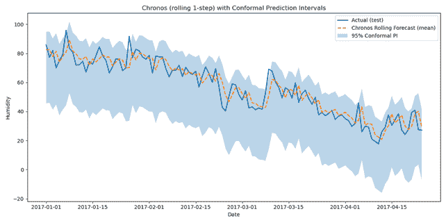
> 
> **图 14. *MOE* 测试数据预测和预测区间。**
> 
> 如上图 14 所示，*MoE* 表现得非常好，并且紧密跟随实际测试数据。如下表 6 所示，***MoE 在整体上实现了最佳准确性和最小的误差。***
> 
> #### 3. F. 2. *MOE* 预测准确性和预测区间覆盖率
> #### 
> | MSE | RMSE | MAE |
> | --- | --- | --- |
> | 45.52 | 6.75 | 5.18 |
> 
> **表 6. 混合专家预测误差。**
> 
> 由于我们使用了符合性预测，95% 预测区间的 *覆盖率* 非常好（97.37%）。
> 
> #### 3. F. 3. *MOE* 预测可解释性
> #### 
> 有几种方法可以深入了解 *MoE* 的工作原理：
> 
> +   门控网络权重：通过检查门控网络的输出，你可以看到每个预测中给予哪些专家最多的权重。这揭示了 *何时* 以及 *为什么* 某些专家被更多地信任。
> +   
> +   专家专业化：每个专家可以单独分析——例如，一个可能捕捉短期波动，而另一个可能处理更长的季节性趋势。将它们的预测并排放置可以帮助解释集成行为。
> +   
> +   特征归因（SHAP/特征重要性）：如果专家本身是可解释的模型（如树模型），则可以计算其特征重要性。即使是神经网络专家，我们也可以使用 *SHAP* 或集成梯度来理解特征如何影响决策。
> +   
> 因此，尽管 *MoE* 不像 *随机森林* 或 *XGBoost* 那样“开箱即用可解释”，但你可以通过分析何时以及为什么选择某些专家来打开黑盒。
> 
> #### 3. F. 4. *MoE* 部署模式
> #### 
> 部署 *混合专家* 比树集成更具有挑战性。原因是它涉及到专家模型和 *门控网络*。在数据中心、服务器上或在云端，由于现代框架如 *PyTorch* 和 *TensorFlow* 可以轻松处理编排，因此实现起来很简单。然而，对于边缘设备，部署要困难得多。具体挑战在于 *MoE* 的复杂性和大小。因此，剪枝、量化或限制活动专家的数量通常是必要的，以保持推理轻量。*AutoML* 框架如 *AutoGluon* 通过封装整个 *MoE* 管道来简化部署。*Hugging Face* 网站还托管了大规模 *MoE* 模型，可以帮助我们扩展到生产级人工智能系统。
> 
> ### 3. G. *N-BEATS* 预测
> ### 
> *N-BEATS* [9] 是一个由堆叠的全连接层组成的深度学习模型，这些层被分组到块中，用于时间序列预测。每个块输出一个预测和一个回溯，回溯从输入中移除，以便下一个块可以专注于剩余的内容。通过链接块，模型逐渐细化其预测并捕捉复杂模式。在我们的实现中，我们使用了滑动窗口设置：模型检查过去观察到的固定窗口（以及外部驱动因素，如平均温度）并学习同时预测几个未来点。然后窗口逐步向前移动，给模型提供许多重叠的训练示例，并帮助它泛化到未见的范围。
> 
> 在本文中，*N-BEATS* 使用了 *N-BEATSx* 实现，它是原始 *N-BEATS* 架构的扩展，包括外生驱动因素。*N-BEATS* 和 *N-BEATSx* 是 *NeuralForecast* 库 [10] 的一部分，该库提供了几个神经网络预测模型。如代码片段 4 所示，*N-BEATS* 使用工厂函数 (*make_model*) 设置，这允许我们定义预测 *范围* 变量并添加平均温度 (*meantemp*) 作为额外输入。包括 *meantemp* 的想法很简单：模型不仅从目标序列的过去值中学习，还从这个关键的外部因素中学习。
> 
> ```py
> def make_model(horizon):
>     return NBEATSx(
>         input_size=INPUT_SIZE,
>         h=horizon,
>         max_steps=MAX_STEPS,
>         learning_rate=LR,
>         stack_types=['seasonality','trend'],
>         n_blocks=[3,3],
>         futr_exog_list=['meantemp'],
>         random_seed=SEED,
>         # early_stop_patience=10,  # optional
>     )
> # Fit model on train_main
> model_cal = make_model(horizon=CAL_SIZE)
> nf_cal = NeuralForecast(models=[model_cal], freq='D') 
> ```
> 
> **代码片段 4：*N-BEATS* 模型创建和拟合。**
> 
> #### 3. G. 1. *N-BEATS* 测试数据预测
> #### 
> 图 15 显示了 *N-BEATS* 预测模型（橙色线）和预测区间（蓝色区域）。我们可以看到，预测能够跟随数据的下降趋势，但在数据线之上保持了一大部分数据。
> 
> 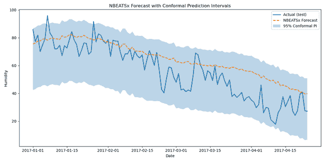
> 
> **图 15. *N-BEATS* 对测试数据的预测和预测区间。**
> 
> #### 3. G. 2. *N-BEATS* 准确性和预测区间覆盖率
> #### 
> | MSE | RMSE | MAE |
> | --- | --- | --- |
> | 166.76 | 12.91 | 10.32 |
> 
> **表 7. *N-BEATS* 预测误差。**
> 
> 对于 *N-Beats*，我们使用了符合性预测，因此预测区间的 *覆盖率* 非常好：98.25%
> 
> #### 3. G. 3. *N-BEATS* 可解释性
> #### 
> 在我们的实验中，我们使用了 *N-BEATS* 的通用形式，将模型视为黑盒预测器。然而，*N-BEATS* 还提供了一种具有“可解释块”的另一种架构，这些块明确地建模趋势和季节性成分。这意味着网络不仅产生准确的预测，还可以将时间序列分解为可读的部分，这使得理解驱动预测的因素变得更容易。
> 
> #### 3. G. 4. *N-BEATS* 部署模式
> #### 
> 由于 *N-BEATS* 完全由前馈层构建，与其他深度学习模型相比，它相对较轻量。这使得它不仅可以在服务器上部署，还可以在边缘设备上部署，在这些设备上，它可以实时提供多步预测，而无需重型硬件。
> 
> ## 结论
> ## 
> 在这篇文章中，我们比较了几种预测方法——从经典的基线方法如*AutoARIMA*和*Prophet*到机器学习方法如*XGBoost*以及深度学习架构如*N-BEATS*和*混合专家模型*。简单的模型提供了透明度和易于部署，但难以捕捉湿度序列的复杂性。相比之下，现代深度学习和基于集成的方法显著提高了准确性，其中*混合专家模型*实现了最低的误差（MSE = 45）。
> 
> 下面我们可以看到均方误差的总结：
> 
> +   *AutoARIMA* MSE = 398.19
> +   
> +   *Prophet* MSE = 105.26
> +   
> +   *NeuralProphet* MSE = 145.31
> +   
> +   *随机森林* MSE = 448.77
> +   
> +   *XGBoost* MSE = 57.46
> +   
> +   *混合专家模型* MSE = 45.52
> +   
> +   *N-BEATS* MSE = 166.76
> +   
> 除了准确性之外，我们还为每种预测方法计算了预测区间，并展示了使用一致性预测来计算准确预测区间的用法。每种预测方法的一致性预测代码可以在我的*Jupyter*笔记本上的*Github*找到。预测区间很重要，因为它们给出了预测不确定性的现实感。
> 
> 对于每种预测方法，我们还考察了其可解释性和部署方式。对于像*AutoARIMA*和*Prophet*这样的模型，解释直接来自它们的结构。*AutoARIMA*显示了过去值和误差如何影响现在，而*Prophet*将序列分解为趋势和季节性等可以绘制和检查的组成部分。深度学习模型如*N-BEATS*或*混合专家模型*更像黑盒。然而，在这种情况下，我们可以使用如*SHAP*或错误分析等工具来获得洞察。
> 
> 部署也同样重要：轻量级的模型，如*XGBoost*，可以在边缘设备上高效运行。较大的深度学习模型可以利用如 AutoGluon 等框架来简化它们的训练。一个巨大的好处是，这些模型可以本地部署以避免 API 限制。
> 
> 总结来说，我们的结果表明，可靠的湿度预测不仅是可能的，而且对日常数据中心运营非常有用。通过采用这些方法，数据中心运营商可以预期能源需求峰值并优化冷却计划。这样，他们可以减少能源消耗和水资源的使用。鉴于人工智能的电力需求不断上升，预测环境驱动因素，如湿度，至关重要，因为它可以使数字基础设施更具弹性和可持续性。
> 
> 感谢您的阅读！
> 
> 文章的完整代码可以在以下位置找到：
> 
> [`github.com/theomitsa/Humidity_forecasting`](http://example.com)
> 
> ## 参考文献
> ## 
> [1] J. O’Donnell 和 C. Crownhart，我们对 AI 的能源足迹进行了数学计算。这是您尚未听说的故事（2025），麻省理工学院技术评论。
> 
> [2] 内部作者，AI 容量无情竞赛的内幕（2025），金融时报，[`ig.ft.com/ai-data-centres/`](https://ig.ft.com/ai-data-centres/)
> 
> [3] P.  Li, 等人，让 AI 更节水：揭示并解决 AI 模型的水足迹问题（2025），ACM 通讯，[`cacm.acm.org/sustainability-and-computing/making-ai-less-thirsty/`](https://cacm.acm.org/sustainability-and-computing/making-ai-less-thirsty/)
> 
> [4] 杰克逊机械服务博客，管理湿度水平：数据中心效率和正常运行时间的关键因素（2025），[`www.jmsokc.com/blog/managing-humidity-levels-a-key-factor-for-data-center-efficiency-and-uptime/#:~:text=Inadequate%20management%20of%20humidity%20within,together%20might%20precipitate%20revenue%20declines.`](https://www.jmsokc.com/blog/managing-humidity-levels-a-key-factor-for-data-center-efficiency-and-uptime/#:~:text=Inadequate%20management%20of%20humidity%20within,together%20might%20precipitate%20revenue%20declines.)
> 
> [5] D. Genkina，在月球上建立数据中心是否疯狂？（2025），IEEE Spectrum。
> 
> [6] R. Burkett, 月球数据中心尽管月球着陆器着陆失败仍完好无损，圣彼得公司表示（2025），[`www.fox13news.com/news/lunar-data-center-intact-despite-lunar-landers-botched-landing-st-pete-company-says`](https://www.fox13news.com/news/lunar-data-center-intact-despite-lunar-landers-botched-landing-st-pete-company-says)
> 
> [7] 德里数据中心，[`www.datacenters.com/locations/india/delhi/delhi`](https://www.datacenters.com/locations/india/delhi/delhi)
> 
> [8] 记者团队，德里开发商将在印度数据中心繁荣中投资 20 亿美元（2025），印度经济时报，[`economictimes.indiatimes.com/tech/technology/delhi-developer-to-invest-2-billion-on-india-data-centre-boom/articleshow/122156065.cms?from=mdr`](https://economictimes.indiatimes.com/tech/technology/delhi-developer-to-invest-2-billion-on-india-data-centre-boom/articleshow/122156065.cms?from=mdr)
> 
> [9] B. N. Oreshkin 等人，N-BEATS：可解释时间序列预测的神经网络基础扩展（2019），[`arxiv.org/abs/1905.10437`](https://arxiv.org/abs/1905.10437)
> 
> [10] *NeuralForecast* 库，[`github.com/Nixtla/neuralforecast?tab=readme-ov-file`](https://github.com/Nixtla/neuralforecast?tab=readme-ov-file)
> 
> **脚注：**
> 
> 1.  所有图像/图表均为作者所有，除非另有说明。
> 1.  
> 1.  文章中用于预测的数据链接：[`www.kaggle.com/datasets/sumanthvrao/daily-climate-time-series-data/data`](https://www.kaggle.com/datasets/sumanthvrao/daily-climate-time-series-data/data)
> 1.  
> 1.  数据许可：数据拥有 Creative Commons 许可：**CC0 1.0**。数据许可链接：[`creativecommons.org/publicdomain/zero/1.0/`](https://creativecommons.org/publicdomain/zero/1.0/)
> 1.  
> 许可证中提及的商业用途摘录：*您可以复制、修改、分发和表演该作品，即使是为了商业目的，也无需请求许可。*
