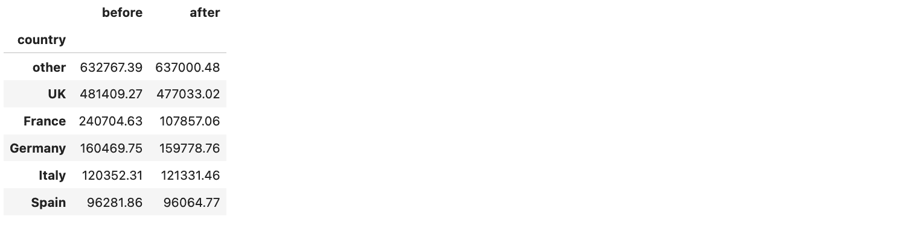
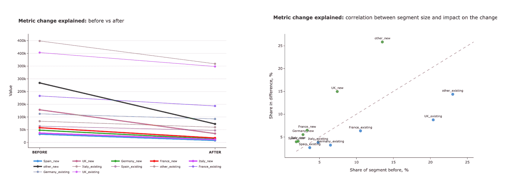

# 从数据到故事：KPI 叙事代码代理

> 原文：[`towardsdatascience.com/from-data-to-stories-code-agents-for-kpi-narratives/`](https://towardsdatascience.com/from-data-to-stories-code-agents-for-kpi-narratives/)

<mdspan datatext="el1748498929819" class="mdspan-comment">作为产品分析师</mdspan>，我们经常需要调查 KPI 的状况：无论是我们对仪表板上的异常做出反应，还是只是例行公事地更新数字。根据我作为 KPI 分析师多年的经验，我估计这些任务中有超过 80% 是相当标准的，只需遵循一个简单的清单就可以解决。

这是调查 KPI 变化的高级计划 (*你可以在文章“异常根本原因分析 101”中找到更多细节* [*“Anomaly Root Cause Analysis 101”*](https://towardsdatascience.com/anomaly-root-cause-analysis-101-98f63dd12016/)):

+   **估计指标的主要变化**以了解变化的幅度。

+   **检查数据质量**以确保数字准确可靠。

+   **收集关于可能影响变化的内部和外部事件的背景信息**。

+   **切片和切块指标**以确定哪些部分对指标的变化有贡献。

+   **在包含假设及其对主要 KPI 影响的估计的执行摘要中**中巩固你的发现。

由于我们有明确的执行计划，此类任务可以通过使用 AI 代理进行自动化。我们最近讨论的代码代理[讨论](https://towardsdatascience.com/code-agents-the-future-of-agentic-ai/)可能非常适合这里，因为它们编写和执行代码的能力将帮助它们高效地分析数据，最小化来回沟通。所以，让我们尝试使用 HuggingFace smolagents 框架构建这样的代理。

在处理我们的任务时，我们将讨论 smolagents 框架的更多高级功能：

+   调整各种提示以确保所需行为的技巧。

+   构建一个能够解释 KPI 变化并将其与根本原因联系起来的多代理系统。

+   在流程中添加反思，通过补充规划步骤。

## MVP 用于解释 KPI 变化

如同往常，我们将采取迭代方法，从简单的 MVP 开始，专注于分析切片和切块步骤。我们将分析一个简单指标（收入）的一个维度的变化（国家）。我们将使用我之前文章中的数据集，[“理解 KPI 变化”](https://towardsdatascience.com/making-sense-of-kpi-changes/)。

让我们先加载数据。

```py
raw_df = pd.read_csv('absolute_metrics_example.csv', sep = '\t')
df = raw_df.groupby('country')[['revenue_before', 'revenue_after_scenario_2']].sum()\
  .sort_values('revenue_before', ascending = False).rename(
    columns = {'revenue_after_scenario_2': 'after', 
      'revenue_before': 'before'})
```



图片由作者提供

接下来，让我们初始化模型。我已经选择了 OpenAI GPT-4o-mini 作为我的首选选项用于简单任务。然而，smolagents 框架[支持](https://huggingface.co/docs/smolagents/guided_tour)所有类型的模型，所以你可以使用你喜欢的模型。然后，我们只需要创建一个代理，给它分配任务和数据集。

```py
from smolagents import CodeAgent, LiteLLMModel

model = LiteLLMModel(model_id="openai/gpt-4o-mini", 
  api_key=config['OPENAI_API_KEY']) 

agent = CodeAgent(
    model=model, tools=[], max_steps=10,
    additional_authorized_imports=["pandas", "numpy", "matplotlib.*", 
      "plotly.*"], verbosity_level=1 
)

task = """
Here is a dataframe showing revenue by segment, comparing values 
before and after.
Could you please help me understand the changes? Specifically:
1\. Estimate how the total revenue and the revenue for each segment 
have changed, both in absolute terms and as a percentage.
2\. Calculate the contribution of each segment to the total 
change in revenue.

Please round all floating-point numbers in the output 
to two decimal places.
"""

agent.run(
    task,
    additional_args={"data": df},
)
```

代理返回了一个相当可信的结果。我们得到了每个部分指标变化及其对主要 KPI 影响的详细统计数据。

```py
{'total_before': 1731985.21, 'total_after': 
1599065.55, 'total_change': -132919.66, 'segment_changes': 
{'absolute_change': {'other': 4233.09, 'UK': -4376.25, 'France': 
-132847.57, 'Germany': -690.99, 'Italy': 979.15, 'Spain': 
-217.09}, 'percentage_change': {'other': 0.67, 'UK': -0.91, 
'France': -55.19, 'Germany': -0.43, 'Italy': 0.81, 'Spain': 
-0.23}, 'contribution_to_change': {'other': -3.18, 'UK': 3.29, 
'France': 99.95, 'Germany': 0.52, 'Italy': -0.74, 'Spain': 0.16}}}
```

让我们看看代理生成的代码。它没问题，但有一个潜在的问题。LLM 根据输入数据重新创建了数据框，而不是直接引用它。这种方法并不理想（尤其是在处理大量数据集时），因为它可能导致错误和更高的令牌使用。

```py
import pandas as pd                                                                                                        

# Creating the DataFrame from the provided data                 
data = {                                                        
    'before': [632767.39, 481409.27, 240704.63, 160469.75,      
120352.31, 96281.86],                                           
    'after': [637000.48, 477033.02, 107857.06, 159778.76,       
121331.46, 96064.77]                                            
}                                                               
index = ['other', 'UK', 'France', 'Germany', 'Italy', 'Spain']  
df = pd.DataFrame(data, index=index)                            

# Calculating total revenue before and after                    
total_before = df['before'].sum()                               
total_after = df['after'].sum()                                 

# Calculating absolute and percentage change for each segment   
df['absolute_change'] = df['after'] - df['before']              
df['percentage_change'] = (df['absolute_change'] /              
df['before']) * 100                                             

# Calculating total revenue change                              
total_change = total_after - total_before                       

# Calculating contribution of each segment to the total change  
df['contribution_to_change'] = (df['absolute_change'] /         
total_change) * 100                                             

# Rounding results                                              
df = df.round(2)                                                

# Printing the calculated results                               
print("Total revenue before:", total_before)                    
print("Total revenue after:", total_after)                      
print("Total change in revenue:", total_change)                 
print(df)
```

在构建更复杂的系统之前修复这个问题是值得的。

## 调整提示

由于 LLM 只是遵循给定的指令，我们将通过调整提示来解决此问题。

最初，我试图使任务提示更明确，明确指示 LLM 使用提供的变量。

```py
task = """Here is a dataframe showing revenue by segment, comparing 
values before and after. The data is stored in df variable. 
Please, use it and don't try to parse the data yourself. 

Could you please help me understand the changes?
Specifically:
1\. Estimate how the total revenue and the revenue for each segment 
have changed, both in absolute terms and as a percentage.
2\. Calculate the contribution of each segment to the total change in revenue.

Please round all floating-point numbers in the output to two decimal places.
"""
```

它没有工作。所以下一步是检查系统提示，看看为什么它会这样工作。

```py
print(agent.prompt_templates['system_prompt'])

#... 
# Here are the rules you should always follow to solve your task:
# 1\. Always provide a 'Thought:' sequence, and a 'Code:\n```py'序列以'```py<end_code>' sequence, else you will fail.
# 2\. Use only variables that you have defined.
# 3\. Always use the right arguments for the tools. DO NOT pass the arguments as a dict as in 'answer = wiki({'query': "What is the place where James Bond lives?"})', but use the arguments directly as in 'answer = wiki(query="What is the place where James Bond lives?")'.
# 4\. Take care to not chain too many sequential tool calls in the same code block, especially when the output format is unpredictable. For instance, a call to search has an unpredictable return format, so do not have another tool call that depends on its output in the same block: rather output results with print() to use them in the next block.
# 5\. Call a tool only when needed, and never re-do a tool call that you previously did with the exact same parameters.
# 6\. Don't name any new variable with the same name as a tool: for instance don't name a variable 'final_answer'.
# 7\. Never create any notional variables in our code, as having these in your logs will derail you from the true variables.
# 8\. You can use imports in your code, but only from the following list of modules: ['collections', 'datetime', 'itertools', 'math', 'numpy', 'pandas', 'queue', 'random', 're', 'stat', 'statistics', 'time', 'unicodedata']
# 9\. The state persists between code executions: so if in one step you've created variables or imported modules, these will all persist.
# 10\. Don't give up! You're in charge of solving the task, not providing directions to solve it.
# Now Begin!
```结尾

在提示的末尾，我们有指令“# 2. 只使用您已定义的变量！”这可能会被解释为一条严格的规则，不允许使用任何其他变量。所以我将其改为“# 2. 只使用您已定义的变量或附加参数中提供的变量！永远不要尝试复制和解析附加参数。”

```py
modified_system_prompt = agent.prompt_templates['system_prompt']\
    .replace(
        '2\. Use only variables that you have defined!', 
        '2\. Use only variables that you have defined or ones provided in additional arguments! Never try to copy and parse additional arguments.'
    )
agent.prompt_templates['system_prompt'] = modified_system_prompt
```

单独这个变化也没有帮助。然后，我检查了任务消息。

```py
╭─────────────────────────── New run ────────────────────────────╮
│                                                                │
│ Here is a pandas dataframe showing revenue by segment,         │
│ comparing values before and after.                             │
│ Could you please help me understand the changes?               │
│ Specifically:                                                  │
│ 1\. Estimate how the total revenue and the revenue for each     │
│ segment have changed, both in absolute terms and as a          │
│ percentage.                                                    │
│ 2\. Calculate the contribution of each segment to the total     │
│ change in revenue.                                             │
│                                                                │
│ Please round all floating-point numbers in the output to two   │
│ decimal places.                                                │
│                                                                │
│ You have been provided with these additional arguments, that   │
│ you can access using the keys as variables in your python      │
│ code:                                                          │
│ {'df':             before      after                           │
│ country                                                        │
│ other    632767.39  637000.48                                  │
│ UK       481409.27  477033.02                                  │
│ France   240704.63  107857.06                                  │
│ Germany  160469.75  159778.76                                  │
│ Italy    120352.31  121331.46                                  │
│ Spain     96281.86   96064.77}.                                │
│                                                                │
╰─ LiteLLMModel - openai/gpt-4o-mini ────────────────────────────╯
```

它包含有关使用附加参数的指令：“您已提供这些附加参数，您可以使用这些键作为变量在您的 Python 代码中访问它们”。我们可以尝试使其更具体、更清晰。不幸的是，此参数未公开，所以我不得不在[源代码](https://github.com/huggingface/smolagents/blob/24df5adec79ab2e7d19db298a6f794825ae2e701/src/smolagents/agents.py#L326)中定位它。要找到 Python 包的路径，我们可以使用以下代码。

```py
import smolagents 
print(smolagents.__path__)
```

然后，我找到了`agents.py`文件，并修改了这一行以包含更具体的指令。

```py
self.task += f"""
You have been provided with these additional arguments available as variables 
with names {",".join(additional_args.keys())}. You can access them directly. 
Here is what they contain (just for informational purposes): 
{str(additional_args)}."""
```

这有点像黑客行为，但 LLM 框架有时就是这样。别忘了之后重新加载包，然后我们就可以出发了。现在让我们测试它是否工作。

```py
task = """
Here is a pandas dataframe showing revenue by segment, comparing values 
before and after. 

Your task will be understand the changes to the revenue (after vs before) 
in different segments and provide executive summary.
Please, follow the following steps:
1\. Estimate how the total revenue and the revenue for each segment 
have changed, both in absolute terms and as a percentage.
2\. Calculate the contribution of each segment to the total change 
in revenue.

Round all floating-point numbers in the output to two decimal places. 
"""
agent.logger.level = 1 # Lower verbosity level
agent.run(
    task,
    additional_args={"df": df},
)
```

哈喽！问题已经解决。代理不再复制输入变量，而是直接引用`df`变量。以下是新生成的代码。

```py
import pandas as pd                                             

# Calculate total revenue before and after                      
total_before = df['before'].sum()                               
total_after = df['after'].sum()                                 
total_change = total_after - total_before                       
percentage_change_total = (total_change / total_before * 100)   
if total_before != 0 else 0                                     

# Round values                                                  
total_before = round(total_before, 2)                           
total_after = round(total_after, 2)                             
total_change = round(total_change, 2)                           
percentage_change_total = round(percentage_change_total, 2)     

# Display results                                               
print(f"Total Revenue Before: {total_before}")                  
print(f"Total Revenue After: {total_after}")                    
print(f"Total Change: {total_change}")                          
print(f"Percentage Change: {percentage_change_total}%")
```

现在，我们准备好着手构建将解决我们任务的真正代理了。

## KPI 叙述的 AI 代理

最后，是时候着手构建将帮助我们解释 KPI 变化和创建执行摘要的 AI 代理了。

我们代理将遵循以下计划进行根本原因分析：

+   估计关键绩效指标（KPI）的主要变化。

+   切割和分解指标，以了解哪些部分推动了变化。

+   在变更日志中查找事件，以查看它们是否可以解释指标变化。

+   在综合执行摘要中整合所有发现。

经过大量的实验和几次调整，我得到了一个有希望的结果。以下是我所做的关键调整（我们将在稍后详细讨论）：

+   我利用**多智能体设置**，通过添加另一个团队成员——变更日志智能体，该智能体可以访问变更日志并协助解释 KPI 变化。

+   我尝试了**更强大的模型**，如`gpt-4o`和`gpt-4.1-mini`，因为`gpt-4o-mini`不足以满足需求。使用更强的模型不仅提高了结果，而且显著减少了步骤数量：使用`gpt-4.1-mini`我只需六步就得到了最终结果，而使用`gpt-4o-mini`则需要 14-16 步。这表明，对于智能体工作流程来说，投资更昂贵的模型可能是值得的。

+   我为智能体提供了**复杂的工具**来分析简单指标的 KPI 变化。该工具执行所有计算，而 LLM 只需解释结果。我在[我之前的文章](https://towardsdatascience.com/making-sense-of-kpi-changes/)中详细讨论了 KPI 变化分析的方法。

+   我将提示重新表述为一个非常**清晰的步骤指南**，以帮助智能体保持正确的方向。

+   我添加了**规划步骤**，鼓励 LLM 智能体首先思考其方法，并在每三次迭代后回顾计划。

经过所有调整后，我从智能体那里得到了以下总结，这相当不错。

```py
Executive Summary:
Between April 2025 and May 2025, total revenue declined sharply by
approximately 36.03%, falling from 1,731,985.21 to 1,107,924.43, a
drop of -624,060.78 in absolute terms.
This decline was primarily driven by significant revenue 
reductions in the 'new' customer segments across multiple 
countries, with declines of approximately 70% in these segments.

The most impacted segments include:
- other_new: before=233,958.42, after=72,666.89, 
abs_change=-161,291.53, rel_change=-68.94%, share_before=13.51%, 
impact=25.85, impact_norm=1.91
- UK_new: before=128,324.22, after=34,838.87, 
abs_change=-93,485.35, rel_change=-72.85%, share_before=7.41%, 
impact=14.98, impact_norm=2.02
- France_new: before=57,901.91, after=17,443.06, 
abs_change=-40,458.85, rel_change=-69.87%, share_before=3.34%, 
impact=6.48, impact_norm=1.94
- Germany_new: before=48,105.83, after=13,678.94, 
abs_change=-34,426.89, rel_change=-71.56%, share_before=2.78%, 
impact=5.52, impact_norm=1.99
- Italy_new: before=36,941.57, after=11,615.29, 
abs_change=-25,326.28, rel_change=-68.56%, share_before=2.13%, 
impact=4.06, impact_norm=1.91
- Spain_new: before=32,394.10, after=7,758.90, 
abs_change=-24,635.20, rel_change=-76.05%, share_before=1.87%, 
impact=3.95, impact_norm=2.11

Based on analysis from the change log, the main causes for this 
trend are:
1\. The introduction of new onboarding controls implemented on May 
8, 2025, which reduced new customer acquisition by about 70% to 
prevent fraud.
2\. A postal service strike in the UK starting April 5, 2025, 
causing order delivery delays and increased cancellations 
impacting the UK new segment.
3\. An increase in VAT by 2% in Spain as of April 22, 2025, 
affecting new customer pricing and causing higher cart 
abandonment.

These factors combined explain the outsized negative impacts 
observed in new customer segments and the overall revenue decline.
```

LLM 智能体还生成了一堆说明性图表（它们是我们增长解释工具的一部分）。例如，这个图表显示了国家和成熟度的组合影响。



图片由作者提供

结果看起来非常令人兴奋。现在让我们深入实际实现，了解它底层是如何工作的。

### 多 AI 智能体设置

我们将从我们的变更日志智能体开始。这个智能体将查询变更日志，并尝试识别我们观察到的指标变化的潜在根本原因。由于这个智能体不需要执行复杂操作，我们将其实现为 ToolCallingAgent。因为该智能体将被另一个智能体调用，我们需要定义其`name`和`description`属性。

```py
@tool 
def get_change_log(month: str) -> str: 
    """
    Returns the change log (list of internal and external events that might have affected our KPIs) for the given month 

    Args:
        month: month in the format %Y-%m-01, for example, 2025-04-01
    """
    return events_df[events_df.month == month].drop('month', axis = 1).to_dict('records')

model = LiteLLMModel(model_id="openai/gpt-4.1-mini", api_key=config['OPENAI_API_KEY'])
change_log_agent = ToolCallingAgent(
    tools=[get_change_log],
    model=model,
    max_steps=10,
    name="change_log_agent",
    description="Helps you find the relevant information in the change log that can explain changes on metrics. Provide the agent with all the context to receive info",
)
```

由于管理智能体将调用此智能体，因此我们无法控制它收到的查询。因此，我决定修改系统提示，包括额外的上下文。

```py
change_log_system_prompt = '''
You're a master of the change log and you help others to explain 
the changes to metrics. When you receive a request, look up the list of events 
happened by month, then filter the relevant information based 
on provided context and return back. Prioritise the most probable factors 
affecting the KPI and limit your answer only to them.
'''

modified_system_prompt = change_log_agent.prompt_templates['system_prompt'] \
  + '\n\n\n' + change_log_system_prompt

change_log_agent.prompt_templates['system_prompt'] = modified_system_prompt
```

要使主要智能体能够将任务委派给变更日志智能体，我们只需在`managed_agents`字段中指定它。

```py
agent = CodeAgent(
    model=model,
    tools=[calculate_simple_growth_metrics],
    max_steps=20,
    additional_authorized_imports=["pandas", "numpy", "matplotlib.*", "plotly.*"],
    verbosity_level = 2, 
    planning_interval = 3,
    managed_agents = [change_log_agent]
)
```

让我们看看它的工作情况。首先，我们可以查看主要智能体的新系统提示。现在它包括有关团队成员的信息以及如何向他们求助的说明。

```py
You can also give tasks to team members.
Calling a team member works the same as for calling a tool: simply, 
the only argument you can give in the call is 'task'.
Given that this team member is a real human, you should be very verbose 
in your task, it should be a long string providing informations 
as detailed as necessary.
Here is a list of the team members that you can call:
```python

def change_log_agent("您的查询内容在这里。") -> str:

    """帮助你找到变更日志中的相关信息

    可以解释指标的变化。为智能体提供所有上下文

    以接收信息"""

```py
```

执行日志显示主要代理成功将任务委派给第二代理，并收到了以下响应。

```py
<-- Primary agent calling the change log agent -->

─ Executing parsed code: ─────────────────────────────────────── 
  # Query change_log_agent with the detailed task description     
  prepared                                                        
  context_for_change_log = (                                      
      "We analyzed changes in revenue from April 2025 to May      
  2025\. We found large decreases "                                
      "mainly in the 'new' maturity segments across countries:    
  Spain_new, UK_new, Germany_new, France_new, Italy_new, and      
  other_new. "                                                    
      "The revenue fell by around 70% in these segments, which    
  have outsized negative impact on total revenue change. "        
      "We want to know the 1-3 most probable causes for this      
  significant drop in revenue in the 'new' customer segments      
  during this period."                                            
  )                                                               

  explanation = change_log_agent(task=context_for_change_log)     
  print("Change log agent explanation:")                          
  print(explanation)                                              
 ──────────────────────────────────────────────────────────────── 

<-- Change log agent execution start -->
╭──────────────────── New run - change_log_agent ─────────────────────╮
│                                                                     │
│ You're a helpful agent named 'change_log_agent'.                    │
│ You have been submitted this task by your manager.                  │
│ ---                                                                 │
│ Task:                                                               │
│ We analyzed changes in revenue from April 2025 to May 2025\.         │
│ We found large decreases mainly in the 'new' maturity segments      │
│ across countries: Spain_new, UK_new, Germany_new, France_new,       │
│ Italy_new, and other_new. The revenue fell by around 70% in these   │
│ segments, which have outsized negative impact on total revenue      │
│ change. We want to know the 1-3 most probable causes for this       │
│ significant drop in revenue in the 'new' customer segments during   │
│ this period.                                                        │
│ ---                                                                 │
│ You're helping your manager solve a wider task: so make sure to     │
│ not provide a one-line answer, but give as much information as      │
│ possible to give them a clear understanding of the answer.          │
│                                                                     │
│ Your final_answer WILL HAVE to contain these parts:                 │
│ ### 1\. Task outcome (short version):                                │
│ ### 2\. Task outcome (extremely detailed version):                   │
│ ### 3\. Additional context (if relevant):                            │
│                                                                     │
│ Put all these in your final_answer tool, everything that you do     │
│ not pass as an argument to final_answer will be lost.               │
│ And even if your task resolution is not successful, please return   │
│ as much context as possible, so that your manager can act upon      │
│ this feedback.                                                      │
│                                                                     │
╰─ LiteLLMModel - openai/gpt-4.1-mini ────────────────────────────────╯
```

使用 smolagents 框架，我们可以轻松设置一个简单的多代理系统，其中管理代理协调并将任务委派给具有特定技能的团队成员。

### 在提示上进行迭代

我们从一个非常高级的提示开始，概述了目标和模糊的方向，但不幸的是，它并不总是有效。LLMs 目前还不够聪明，可以自己找出方法。因此，我创建了一个详细的分步提示，描述了整个计划，并包括我们使用的增长叙事工具的详细规格。

```py
task = """
Here is a pandas dataframe showing the revenue by segment, comparing values 
before (April 2025) and after (May 2025). 

You're a senior and experienced data analyst. Your task will be to understand 
the changes to the revenue (after vs before) in different segments 
and provide executive summary.

## Follow the plan:
1\. Start by udentifying the list of dimensions (columns in dataframe that 
are not "before" and "after")
2\. There might be multiple dimensions in the dataframe. Start high-level 
by looking at each dimension in isolation, combine all results 
together into the list of segments analysed (don't forget to save 
the dimension used for each segment). 
Use the provided tools to analyse the changes of metrics: {tools_description}. 
3\. Analyse the results from previous step and keep only segments 
that have outsized impact on the KPI change (absolute of impact_norm 
is above 1.25). 
4\. Check what dimensions are present in the list of significant segment, 
if there are multiple ones - execute the tool on their combinations 
and add to the analysed segments. If after adding an additional dimension, 
all subsegments show close different_rate and impact_norm values, 
then we can exclude this split (even though impact_norm is above 1.25), 
since it doesn't explain anything. 
5\. Summarise the significant changes you identified. 
6\. Try to explain what is going on with metrics by getting info 
from the change_log_agent. Please, provide the agent the full context 
(what segments have outsized impact, what is the relative change and 
what is the period we're looking at). 
Summarise the information from the changelog and mention 
only 1-3 the most probable causes of the KPI change 
(starting from the most impactful one).
7\. Put together 3-5 sentences commentary what happened high-level 
and why (based on the info received from the change log). 
Then follow it up with more detailed summary: 
- Top-line total value of metric before and after in human-readable format, 
absolute and relative change 
- List of segments that meaningfully influenced the metric positively 
or negatively with the following numbers: values before and after, 
absoltue and relative change, share of segment before, impact 
and normed impact. Order the segments by absolute value 
of absolute change since it represents the power of impact. 

## Instruction on the calculate_simple_growth_metrics tool:
By default, you should use the tool for the whole dataset not the segment, 
since it will give you the full information about the changes.

Here is the guidance how to interpret the output of the tool
- difference - the absolute difference between after and before values
- difference_rate - the relative difference (if it's close for 
  all segments then the dimension is not informative)
- impact - the share of KPI differnce explained by this segment 
- segment_share_before - share of segment before
- impact_norm - impact normed on the share of segments, we're interested 
  in very high or very low numbers since they show outsized impact, 
  rule of thumb - impact_norm between -1.25 and 1.25 is not-informative 

If you're using the tool on the subset of dataframe keep in mind, 
that the results won't be aplicable to the full dataset, so avoid using it 
unless you want to explicitly look at subset (i.e. change in France). 
If you decided to use the tool on a particular segment 
and share these results in the executive summary, explicitly outline 
that we're diving deeper into a particular segment.
""".format(tools_description = tools_description)
agent.run(
    task,
    additional_args={"df": df},
)
```

以如此详细的程度解释一切是一项相当艰巨的任务，但如果我们想要一致的结果，这是必要的。

#### 规划步骤

smolagents 框架允许您向您的代理流程添加规划步骤。这鼓励代理从计划开始，并在指定步骤数之后更新它。根据我的经验，这种反思对于保持对问题的关注并调整行动以保持与初始计划和目标一致非常有帮助。我确实推荐在需要复杂推理的情况下使用它。

为代码代理指定 `planning_interval = 3` 设置它就像易事。

```py
agent = CodeAgent(
    model=model,
    tools=[calculate_simple_growth_metrics],
    max_steps=20,
    additional_authorized_imports=["pandas", "numpy", "matplotlib.*", "plotly.*"],
    verbosity_level = 2, 
    planning_interval = 3,
    managed_agents = [change_log_agent]
)
```

那就是全部了。然后，代理提供了从考虑初始计划开始的反思。

```py
────────────────────────── Initial plan ──────────────────────────
Here are the facts I know and the plan of action that I will 
follow to solve the task:
```

## 1\. 事实调查

### 1.1\. 任务中给出的事实

- 我们有一个显示细分收入的 pandas 数据框`df`，对于

两个时间点：之前（2025 年 4 月）和之后（2025 年 5 月）。

- 数据框列包括：

- 维度：`country`，`maturity`，`country_maturity`，

`country_maturity_combined`

- 指标：`before`（2025 年 4 月的收入），`after`（

（2025 年 5 月）

- 任务是理解收入的变化（之后与

（之前）跨不同段。

- 提供关键指令和工具：

- 识别除之前/之后之外的所有维度以进行细分。

- 使用

`calculate_simple_growth_metrics`。

- 过滤对 KPI 变化有巨大影响的细分（绝对

规范化影响>1.25）。

- 如果有多个维度，请检查维度的组合

显著的细分。

- 总结重大变化并参与`change_log_agent`

对于上下文原因。

- 提供一个最终的执行摘要，包括主要变化

和细分级别的详细影响。

- 数据集片段显示结合了国家（`法国`，

`UK`，`Germany`，`Italy`，`Spain`，`other`）和成熟度状态

（`new`，`existing`）。

- 结合的细分在列中唯一标识

`country_maturity` 和 `country_maturity_combined`。

### 1.2\. 需要查找的事实

- 如果不清楚，请提供细分或描述（例如，

什么是定义`new`与`existing`成熟度的区别）。

- 可能不是强制性的，但可能会被要求提供

业务文档或变更日志。

- 关于变更日志的更多详细信息（可通过

差异化提供可能原因 - 如果所有子分段显示接近的

变化。

- 确认处理组合维度拆分的方法 - 确切地

`country_maturity_combined`。

8. 准备显著变化的摘要：

- 如果有额外的 KPI 维度（例如，`country`和`maturity`的组合）

除了收入外，其他相关（根据数据不太可能）。

- 日期确认分析期：2025 年 4 月（之前）和 5 月

2025 年（之后）的信息。无需查找，因为已给出。

### 1.3. 要得出的事实

- 识别可用于分段的全部维度列：

- 通过排除'before'和'after'，可能的候选者是

`country`，`maturity`，`country_maturity`，以及

`calculate_simple_growth_metrics`重复度量计算。

`country_maturity_combined`形成，并应在组合维度分析中解释。

工具：

- 每个分段的收入绝对和相对差异。

- 影响力、分段前份额和每个维度的标准化影响力

分段。

- 识别对 KPI 变化有不成比例影响的分段

- 对于每个维度，使用给定的

- 如果多个维度有显著分段，则合并

差异化或未差异化，基于 delta 率和 impact_norm

- 确定组合维度拆分是否提供有意义的

（|impact_norm| > 1.25）。

一致性。

- 前后总 KPI（绝对和相对）。

或使用现有的组合维度列）。

- 识别导致正面和负面变化的顶级分段

基于排序后的绝对绝对变化。

- 从变化日志代理那里收集有关

维度（例如，国家+成熟度）并重新分析。

2025 年 4 月期间形成的组合维度。

## `change_log_agent`），这可能为收入

1. 通过层级（聚合收入前后）识别 dataframe 中存在的所有维度列。

并排除'before'和'after'。

2. 制定计划

`country_maturity`，`country_maturity_combined`）：

- 在整个 dataframe 上使用`calculate_simple_growth_metrics`。

- 总结 KPI 变化的方向和幅度。

- 提取包括计算度量在内的

impact_norm。

3. 从所有单维度分析中汇总结果并筛选

分段，其中|impact_norm| > 1.25。

4. 确定这些显著分段所属的维度。

到。

2. 对于每个识别的维度（`country`，`maturity`，

分段，分析由这些

数据字典或度量描述。

与显著分段相关的可能原因以及 2025 年 5 月与

6. 使用

`calculate_simple_growth_metrics`在组合维度上。

7. 检查组合维度拆分是否产生有意义的

差异率。

和 impact_norm，排除拆分。

影响力。

5. 如果在这些显著维度中代表多个维度，

变化）。

- 按绝对绝对变化排序的具有影响力的分段列表

对整体收入有影响。

9. 提供具有详细信息的分段列表（前值，

后，绝对和相对变化，前份额，影响，

按该维度分组。

10. 使用这些汇总信息，查询`change_log_agent`

在完整上下文中：

    - 包括重要部分、它们的相对变化，以及

时期（2025 年 4 月至 5 月）。

11. 处理代理的响应，以识别 1-3 个主要可能的

KPI 变化的起因。

12. 起草执行摘要评论：

    - 基于日志的高级概述，说明了发生了什么以及为什么，以及

信息。

    - 详细总结包括主要变化和

段级度量影响。

13. 使用包含`final_answer`工具的最终答案。

上述执行摘要和数据驱动的见解。

```py

Then, after each three steps, the agent revisits and updates the plan. 

```

────────────────────────── 更新计划 ──────────────────────────

我仍然需要解决我分配的任务：

```py

Here is a pandas dataframe showing the revenue by segment, 
comparing values before (April 2025) and after (May 2025). 

You're a senior and experienced data analyst. Your task will be 
understand the changes to the revenue (after vs before) in 
different segments 
and provide executive summary.

<... repeating the full initial task ...>
```

这里是我所知道的事实以及我的新/更新行动计划，

解决以下任务：

```py
## 1\. Updated facts survey

### 1.1\. Facts given in the task
- We have a pandas dataframe with revenue by segment, showing 
values "before" (April 2025) and "after" (May 2025).
- Columns in the dataframe include multiple dimensions and the 
"before" and "after" revenue values.
- The goal is to understand revenue changes by segment and provide
an executive summary.
- Guidance and rules about how to analyze and interpret results 
from the `calculate_simple_growth_metrics` tool are provided.
- The dataframe contains columns: country, maturity, 
country_maturity, country_maturity_combined, before, after.

### 1.2\. Facts that we have learned
- The dimensions to analyze are: country, maturity, 
country_maturity, and country_maturity_combined.
- Analyzed revenue changes by dimension.
- Only the "new" maturity segment has significant impact 
(impact_norm=1.96 > 1.25), with a large negative revenue change (~
-70.6%).
- In the combined segment "country_maturity," the "new" segments 
across countries (Spain_new, UK_new, Germany_new, France_new, 
Italy_new, other_new) all have outsized negative impacts with 
impact_norm values all above 1.9.
- The mature/existing segments in those countries have smaller 
normed impacts below 1.25.
- Country-level and maturity-level segment dimension alone are 
less revealing than the combined country+maturity segment 
dimension which highlights the new segments as strongly impactful.
- Total revenue dropped substantially from before to after, mostly
driven by new segments shrinking drastically.

### 1.3\. Facts still to look up
- Whether splitting the data by additional dimensions beyond 
country and maturity (e.g., country_maturity_combined) explains 
further heterogeneous impacts or if the pattern is uniform.
- Explanation/context from change log about what caused the major 
drop predominantly in new segments in all countries.
- Confirming whether any country within the new segment behaved 
differently or mitigated losses.

### 1.4\. Facts still to derive
- A concise executive summary describing the top-level revenue 
change and identifying which segments explain the declines.
- Explanation involving the change log agent with summary of 
probable reasons for these outsized reductions in revenue in the 
new segments across countries for April-May 2025.

## 2\. Plan

### 2.1\. Verify if adding the additional dimension 
'country_maturity_combined' splits the impactful "new" segments 
into subsegments with significantly different impacts or if the 
change rates and normed impacts are relatively homogeneous. If 
homogeneous, we do not gain deeper insight and should disregard 
further splitting.

### 2.2\. Summarize all significant segments identified with 
outsized impact_norm ≥ 1.25, including their before and after 
values, absolute and relative changes, segment shares before, 
impact, and normalized impact, ordered by absolute value of the 
change.

### 2.3\. Query the change_log_agent with the full context: 
significant segments are the new country_maturity segments with 
large negative changes (~ -70%), timeframe April 2025 to May 2025,
and request top 1-3 most probable causes for the KPI revenue drop 
in these segments.

### 2.4\. Based on the change log agent's response, synthesize a 
3-5 sentence high-level commentary explaining what happened 
broadly and why.

### 2.5\. Draft a detailed executive summary including:
- Total revenue before and after in human-readable format with 
absolute and relative change.
- A list of significant segments driving these changes, in order 
by absolute impact, with detailed numbers (before, after, absolute
and relative change, segment share before, impact, normed impact).

### 2.6\. Use the `final_answer` tool to produce the finalized 
executive summary report.
```

我真的很喜欢代理被鼓励重复初始任务并专注于主要问题。这种定期的反思在现实生活中也很有帮助，因为团队往往会在过程中陷入困境，失去对所做事情背后的原因的认识。看到管理最佳实践被整合到代理框架中，这真的很酷。

那就是全部了！我们已经构建了一个能够分析简单指标 KPI 变化的代码代理，并探索了整个过程的全部关键细微差别。

> *您可以在[GitHub](https://github.com/miptgirl/miptgirl_medium/blob/main/growth_narrative_llm_agent/code_agents_mvp.ipynb)上找到完整的代码和执行日志。*

## 摘要

我们在代码代理上进行了大量实验，现在准备得出结论。对于我们的实验，我们使用了 HuggingFace 的 smolagents 框架，这是一个非常实用的工具集，它提供了：

+   与不同的 LLM（从本地模型通过 Ollama 到公共提供商如 Anthropic 或 OpenAI）轻松集成，

+   优秀的日志记录，使得理解代理整个思维过程和调试问题变得容易，

+   能够通过多 AI 代理设置或规划功能轻松构建复杂系统。

虽然 smolagents 目前是我最喜欢的代理框架，但它有其局限性：

+   它有时可能缺乏灵活性。例如，我不得不直接在源代码中修改提示来获得我想要的行为了。

+   它仅支持分层多代理设置（其中一位管理者可以将任务委派给其他代理），但不涵盖顺序工作流程或共识决策过程。

+   默认情况下没有长期记忆支持，这意味着你每次任务都是从零开始的。

> *非常感谢您阅读这篇文章。我希望这篇文章对您有所启发。*

## 参考

这篇文章灵感来源于 DeepLearning.AI 的“[使用 Hugging Face smolagents 构建代码代理](https://www.deeplearning.ai/short-courses/building-code-agents-with-hugging-face-smolagents/)”短期课程。
