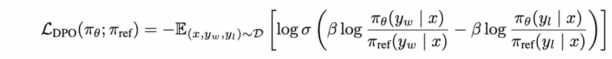
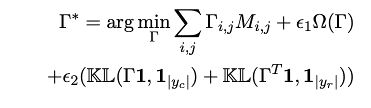
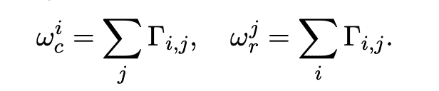
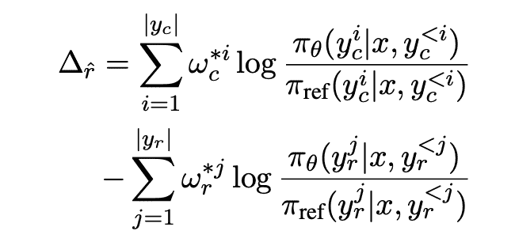

# 从等权重到智能权重：OTPO 的 LLM 对齐方法

> 原文：[`towardsdatascience.com/from-equal-weights-to-smart-weights-otpos-approach-to-better-llm-alignment/`](https://towardsdatascience.com/from-equal-weights-to-smart-weights-otpos-approach-to-better-llm-alignment/)

## 上下文

<mdspan datatext="el1752537727331" class="mdspan-comment">语言模型</mdspan>已经从基本的搜索工具发展到 AI 助手，可以进行编码、写作和进行研究。现在，它们可以通过互联网 API 通过智能手机应用程序访问，将强大的 AI 放在每个人的指尖上。这些系统正成为我们日常生活的重要组成部分。人们使用 AI 助手来寻求个人关系的建议、核实事实以形成观点（尽管它明确表示可能会出错）、制定饮食计划和下一个假期目的地。

随着越来越多强大的模型被推出，信任问题随之而来，模型也受到更严格的审查，以确保它们产生的响应是可信的并与人类价值观相一致。这些问题并非新出现。传统上，在模型公开发布之前，模型通常会在人类偏好数据（通常包含输入、选择的答案、拒绝的答案）上进行微调。模型对齐和安全一直是研究的主要领域，已经开发了多个算法来训练模型以实现对齐。在所有对齐训练算法中，由于简单和高效，直接偏好优化（DPO）是最受欢迎的。

但 DPO 有一个根本的限制。在计算响应的可能性时，它对响应中出现的每个单词或标记使用相同的权重，尽管人类自然会给有意义的单词更多的重视或权重。例如，让我们看看以下用户与 LLM 的互动。

> **用户**：法国的首都是什么？
> 
> **LLM**：法国的首都是巴黎，它是一个美丽的城市，有很多景点。

在这次互动中，人类主要关心的是“巴黎”的准确性，而不是风格上的修饰，但标准的 DPO 对每个标记给予相同的权重，允许不那么相关的内容稀释学习信号。

已经有多次尝试来解决 DPO 的问题。引入了像 SimPO 和 SamPO 这样的算法来解决不同的问题。在这篇文章中，我们将探讨 2025 年 5 月发表在“**O**ptimal **T**ransport-Based Token Weighting scheme for Enhanced **P**reference **O**ptimization (**OTPO**)”上的另一个算法。本文解释了他们工作的核心思想，并为理解 LLM 与人类偏好的对齐奠定了基础。

## 为什么等权重标记失败

要理解为什么标记加权很重要，我们首先需要检查 DPO 实际上是如何处理标记的。通常，预训练模型使用万亿个参数进行训练，然后进行微调，接着使用 DPO 在人类偏好数据上进行进一步训练以与人类偏好对齐，然后发布给公众。

DPO 通过计算所选和拒绝响应在标记级别的对数似然差异来运行。对于每个具有所选响应 y_w 和拒绝响应 y_l 的训练示例，DPO 计算其目标值。DPO 的核心在于其损失函数公式：

图片来自 [DPO 论文](https://arxiv.org/pdf/2305.18290)

Pi_theta(πθ) 是要优化的模型，Pi_reference(π_ref) 是一个参考模型，而 π∗(y|x) 表示在用户输入 x 的情况下响应 y 的概率。

π∗(y|x) 分解为标记级别的计算。对于一个具有标记 `[t₁, t₂, ..., tₙ]` 的所选响应，对数概率变为：

log π∗(y|x) = Σᵢ log π(tᵢ|x, t₁…tᵢ₋₁)

每个标记都对整体序列概率贡献其各自的 log 概率，并且没有机制可以给重要内容比填充内容更多的权重。让我们看看偏好数据的例子。

> **输入**：法国的首都是什么？
> 
> **Chosen**：法国的首都是巴黎。
> 
> **Rejected**：法国的首都是意大利，这实际上是错误的。

DPO 对每个标记计算对数概率是相同的。

`Chosen: log P("The") + log P("capital") + log P("of") + log P("France") + log P("is") + log P("Paris") + log P(".")`

`Rejected: log P("The") + log P("capital") + ... + log P("Italy") + ... + log P("incorrect") + log P(".")`

关键的事实差异在于“巴黎”与“意大利”，但 DPO 对冠词、介词和事实关键标记给予相同的权重。这种统一的标记处理在优化重点和人类实际关心的事情之间造成了不匹配。

模型从语义上重要的标记（“巴黎”）和不重要的标记（“which”，“actually”）那里接收相同的学习信号。这导致了冗长陷阱，更长的序列通过单纯的标记数量积累更多的对数似然质量，因此 DPO 可能无意中奖励冗长而不是质量。

当语义上重要的标记与风格上的标记平均时，学习信号变得不可靠，导致次优偏好学习。如果我们有更好的方法在计算响应概率时给予相关标记更多权重，这些问题就可以得到解决。这正是 OTPO 所做的。

## 基于最优传输的标记加权（OTPO）

现在我们已经理解了 DPO 的标记加权问题，让我们看看 OTPO 是如何使用最优传输理论来解决它的。OTPO 将偏好优化视为一个传输问题，将一个响应转换为另一个响应需要多少努力？

关键的洞察是，将“法国的首都是巴黎”改为“法国的首都是意大利”需要多少最小努力？大多数标记保持不变，但“巴黎” → “意大利”需要显著的语义转换，因为它们是完全不同的概念。

OTPO 将此表述为一个最优运输问题，其中源是选择响应中的标记，目标是拒绝响应中的标记，运输成本反映了标记对之间的语义相似性。语义相似的标记（如“巴黎”和“伦敦”）具有低运输成本，而遥远的标记（如“巴黎”和“苹果”）具有高成本。

该算法计算出一个最优运输解决方案，告诉我们如何以最小的总成本在响应之间移动概率质量。在此运输中参与度高的标记对，尤其是那些需要昂贵语义转换的标记对，在最终损失计算中会得到更高的权重。这意味着 OTPO 自动将学习重点放在对人类偏好最重要的标记上，解决了 DPO 的等权重问题。

## OTPO 背后的数学

现在，让我们深入了解 OTPO 的数学基础。该算法有三个主要组成部分：构建成本矩阵、解决最优运输问题和计算加权标记损失。

### 第 1 步：构建成本矩阵

OTPO 首先构建一个成本矩阵 M，该矩阵衡量每对标记之间的语义距离。对于选择(w)响应中的第 i 个标记和拒绝(l)响应中的第 j 个标记，成本是

M[i][j] = ( h[w][i] - h[l][j] )²

其中 h[w][i]和 h[l][j]是模型中标记的最后层隐藏表示。这种欧几里得距离捕捉语义相似性。类似的标记，如“巴黎”和“伦敦”，具有低成本，而遥远的标记，如“巴黎”和“苹果”，具有高成本。

### 第 2 步：最优运输问题

OTPO 将标记权重表述为一个不平衡的最优运输优化：

图片来自[OTPO 论文](https://arxiv.org/pdf/2505.18720)

在这里，Γ是运输计划（我们要解决的问题），它将选择和拒绝响应之间的标记对齐。Ω控制熵正则化。KL 项确保Γ的边缘分布接近于原始 DPO 均匀权重。解Γ*告诉我们如何最优地运输选择和拒绝标记之间的概率质量。

### 第 3 步：计算标记权重

从最优运输解决方案中，我们通过沿维度求和推导出标记级别的权重：

图片来自[OTPO 论文](https://arxiv.org/pdf/2505.18720)

在这里，Γ(i,j)代表从选择(w)和拒绝(r)响应中分配给每个标记对(i, j)的权重。最后，这些权重被应用于 DPO 以替换均匀加权。奖励差异与加权方案。

图片来自[OTPO 论文](https://arxiv.org/pdf/2505.18720)

## 实验结果和局限性

OTPO 在各种任务上进行了测试，但都是在受控环境中进行的。当应用于摘要任务时，它比其他方法提高了大约 8.5%。当在 UltraFeedback 数据集上测试长度偏差，使用像 Llama-3–8B 这样的较小模型时，OTPO 产生了较短的响应。这些初步测试提供了证据，表明 OTPO 有助于减少冗余并提高响应质量，这些响应更有可能被人类选择。

测试并不足够全面，无法在整个领域内展示准确率数字。在不同数据集上存在混合结果。OTPO 需要昂贵的成本指标和传输计划计算。此外，使用 LLM 作为评判者来计算响应质量，随后由少数人手动进一步检查。这些方法虽然不错，但完全依赖于可能容易对某些数据集产生偏见的审稿人。

## 结论

LLM 对齐一直是研究的主要话题，OTPO 在受控环境中提供了有希望的结果。虽然这种方法并不完美，但加权标记选择的出现为对齐任务中的更精细偏好建模奠定了基础。

## 参考文献：

1.  直接策略优化（DPO）。[`arxiv.org/pdf/2305.18290`](https://arxiv.org/pdf/2305.18290)

1.  基于最优传输的标记加权方案。[`arxiv.org/pdf/2505.18720`](https://arxiv.org/pdf/2505.18720)

1.  消除直接偏好优化（SamPO）的偏长依赖。[`arxiv.org/pdf/2406.10957`](https://arxiv.org/pdf/2406.10957)
