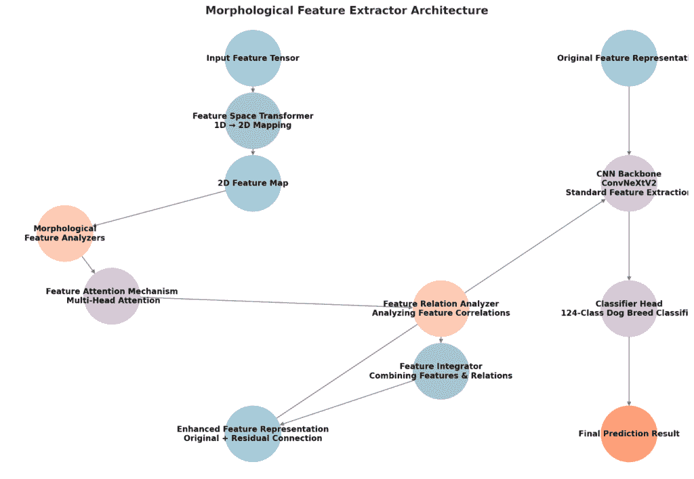
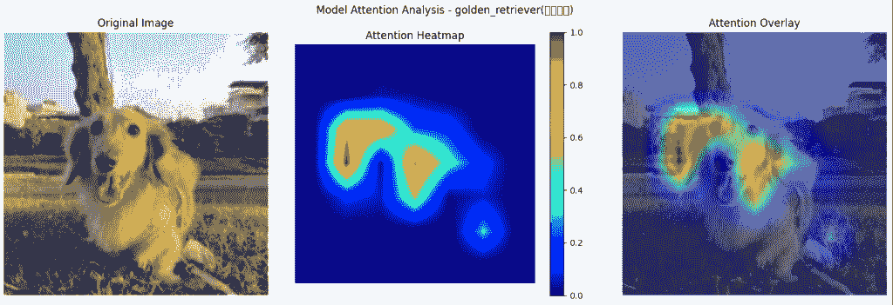
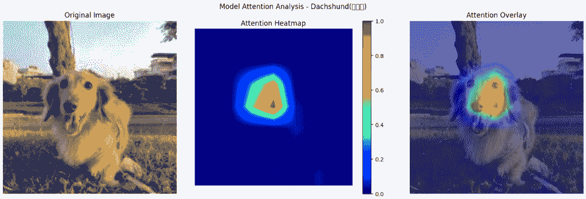
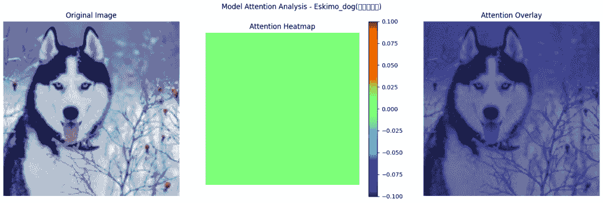
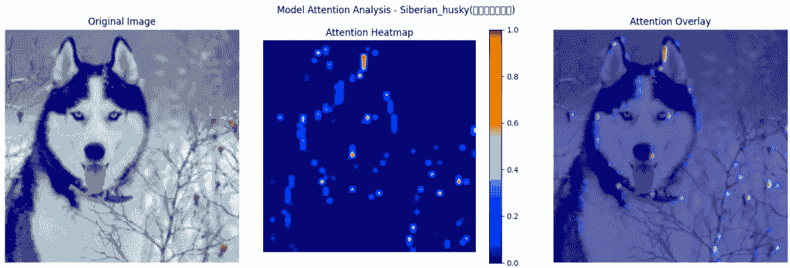

# 从模糊到精确：形态特征提取器如何增强 AI 的识别能力

> 原文：[`towardsdatascience.com/from-fuzzy-to-precise-how-a-morphological-feature-extractor-enhances-ais-recognition-capabilities-2/`](https://towardsdatascience.com/from-fuzzy-to-precise-how-a-morphological-feature-extractor-enhances-ais-recognition-capabilities-2/)

## 简介：AI 真的能像人类专家一样区分犬种吗？

有一天散步时，我看到一只毛茸茸的白色小狗，想知道，“那是比熊犬还是马尔济斯犬？”无论我多么仔细地看，它们似乎几乎一模一样。哈士奇和阿拉斯加玛拉穆特犬、柴犬和秋田犬，我总是发现自己犹豫不决。专业兽医和研究人员是如何一眼就能看出差异的？他们在关注什么？🤔

这个问题在我开发**PawMatchAI**的过程中一直萦绕在我心头。有一天，当我努力提高模型准确率时，我意识到，当我识别物体时，我不会一次性处理所有细节。相反，我首先注意到整体形状，然后集中精力关注具体特征。这种“从粗到细”的处理方式是否是专家们准确识别相似犬种的关键？

在深入研究研究的过程中，我遇到了一篇[认知科学](https://pmc.ncbi.nlm.nih.gov/articles/PMC3306444/)论文，证实了人类的视觉识别依赖于**多级特征分析**。专家们不仅仅是记住图像，他们还会分析结构化的特征，例如：

+   **整体身体比例**（大型犬与小型犬，方形身体与细长身体形状）

+   **头部特征**（耳朵形状、吻部长度、眼睛间距）

+   **毛发质地和分布**（柔软、卷曲、光滑，双层毛皮与单层毛皮）

+   **颜色和图案**（特定斑纹、色素分布）

+   **行为和姿态特征**（尾巴姿势、行走风格）

这让我重新思考了传统的卷积神经网络（Convolutional Neural Networks）。虽然它们在学习和提取局部特征方面非常强大，但它们并没有像人类专家那样明确地分离关键特征。相反，这些特征在数百万个参数中交织在一起，缺乏清晰的解释性。

因此，我设计了**形态特征提取器**，这是一种帮助 AI 在结构化层中分析品种的方法——就像专家们做的那样。这种架构特别关注**身体比例、头部形状、毛发质地、尾巴结构和颜色图案**，使 AI 不仅能够“看到”物体，而且能够“理解”它们。

PawMatchAI 是我个人的项目，它可以识别**124 种犬种**，并根据用户偏好提供品种比较和建议。如果你感兴趣，你可以在 HuggingFace Space 上尝试它，或者在 GitHub 上查看完整的代码：

⚜️ HuggingFace: [PawMatchAI](https://huggingface.co/spaces/DawnC/PawMatchAI)

⚜️ GitHub: [PawMatchAI](https://github.com/Eric-Chung-0511/Learning-Record/tree/main/Data%20Science%20Projects/PawMatchAI)

在这篇文章中，我将更深入地探讨这种受生物学启发的设计，并分享我是如何将简单的日常观察转化为实用的 AI 解决方案的。

* * *

## 1. 人类视觉与机器视觉：两种根本不同的感知世界的方式

起初，我认为人类和 AI 以相似的方式识别物体。但在测试我的模型并研究[认知科学](https://pmc.ncbi.nlm.nih.gov/articles/PMC3306444/)后，我意识到一个惊人的事实，**人类和 AI 实际上以根本不同的方式处理视觉信息**。这完全改变了我对基于 AI 的识别方法的理解。

### 🧠 人类视觉：结构化和适应性

人类视觉系统在识别物体时遵循一种高度结构化但灵活的方法：

1️⃣ **首先看到整体图景** → 我们的大脑首先扫描物体的整体形状和大小。这就是为什么，仅仅通过看狗的轮廓，我们就能迅速判断它是大型犬还是小型犬。就我个人而言，这总是我遇到狗时的第一直觉。

2️⃣ **关注关键特征** → 接下来，我们的注意力会自动转移到最能区分不同品种的特征上。在研究过程中，我发现专业兽医经常强调**耳朵形状和吻部长度**作为品种识别的主要指标。这让我意识到专家是如何快速做出决定的。

3️⃣ **通过经验学习** → 我们看到的狗越多，我们的识别过程就越精细。第一次看到萨摩耶的人可能会关注它蓬松的白色毛发，而经验丰富的狗爱好者会立即认出它独特的**“萨摩耶微笑”**，这是一种独特的上翘嘴型。

### 🤖 CNN 如何“看”世界

卷积神经网络（CNN）遵循一种**完全不同的**识别策略：

+   **一个难以解释的复杂系统** → CNN 确实从简单的边缘和纹理学习到高级特征，但所有这些都在数百万个参数内部发生，这使得理解模型真正关注的内容变得困难。

+   **当 AI 将背景误认为是狗** → 我遇到的最令人沮丧的问题之一是我的模型总是根据周围环境误识别品种。例如，如果一只狗在一个雪地环境中，它几乎总是猜测是西伯利亚雪橇犬，即使品种完全不同。

* * *

## 2. 形态特征提取器：受认知科学启发

### 2.1 核心设计理念

在 PawMatchAI 的开发过程中，我一直试图使模型能够像人类专家一样准确地识别外观相似的狗品种。然而，我早期的尝试并没有按计划进行。最初，我认为使用更多参数的更深的 CNN 可以提高性能。但无论模型多么强大，它仍然在处理相似品种时遇到困难，将比熊误认为是马耳他犬，或将哈士奇误认为是爱斯基摩犬。这让我想知道：**AI 真的能够仅仅通过变得更大、更深来理解这些细微的差异吗？**

然后，我想起了之前注意到的一件事，当人类识别物体时，我们不会一次性处理所有信息。我们首先观察整体形状，然后逐渐放大细节。这让我思考，**如果 CNN 能够通过从整体形态开始，然后关注详细特征来模仿人类物体识别习惯，这会提高识别能力吗？**

基于这个想法，我决定停止仅仅使 CNN 更深，而是设计一个更结构化的模型架构，最终确立了三个核心设计原则：

1.  **显式形态特征：** 这让我反思了自己的问题：*专业人士究竟在观察什么？* 结果表明，兽医和品种专家**不仅仅依赖直觉**，他们遵循一套明确的准则，专注于特定的特征。因此，而不是让模型“猜测”哪些部分重要，我设计了它直接从这些专家定义的特征中学习，使其决策过程更接近人类认知。

1.  **多尺度并行处理：** 这对应于我的认知洞察：人类不会线性处理视觉信息，而是同时关注不同级别的特征。当我们看到一只狗时，我们不需要在观察局部细节之前完成对整体轮廓的分析；相反，这些过程是同时发生的。因此，我设计了多个并行特征分析器，每个分析器专注于不同尺度的特征，它们是协同工作而不是顺序工作的。

1.  **为什么特征之间的关系比个体特征更重要：** 我逐渐意识到，仅仅观察个体特征往往不足以确定一个品种。识别过程不仅仅是识别单独的特征，更重要的是它们之间的相互作用。例如，一个短毛、尖耳朵的狗，如果它有一个苗条的身材，它可能是一只杜宾犬。但如果同样的组合出现在一个粗壮、紧凑的框架上，它更有可能是一只波士顿梗。显然，**特征之间的关系往往是区分品种的关键**。

* * *

### 2.2 五种形态特征分析器的技术实现

每个分析器使用不同的卷积核大小和层来处理各种特征：

**1️⃣ 身体比例分析器**

```py
# Using large convolution kernels (7x7) to capture overall body features
'body_proportion': nn.Sequential(
    nn.Conv2d(64, 128, kernel_size=7, padding=3),
    nn.BatchNorm2d(128),
    nn.ReLU(),
    nn.Conv2d(128, 128, kernel_size=3, padding=1),
    nn.BatchNorm2d(128),
    nn.ReLU()
)
```

最初，我尝试了更大的核，但发现它们过于关注背景。最终我使用了(7×7)的核来捕捉整体形态特征，就像犬类专家首先注意到狗是大型、中型还是小型，以及其身体形状是方形还是矩形一样。例如，在识别类似的小型白色品种（如比熊犬与马尔他犬）时，身体比例通常是初步的区分点。

**2️⃣ 头部特征分析器**

```py
# Medium-sized kernels (5x5) are suitable for analyzing head structure
'head_features': nn.Sequential(
    nn.Conv2d(64, 128, kernel_size=5, padding=2),
    nn.BatchNorm2d(128),
    nn.ReLU(),
    nn.Conv2d(128, 128, kernel_size=3, padding=1),
    nn.BatchNorm2d(128),
    nn.ReLU()
)
```

头部特征分析器是我测试最多的部分。技术挑战在于头部包含多个关键识别点（耳朵、鼻吻、眼睛），但它们的相对位置对于整体识别至关重要。最终的设计使用了 5×5 卷积核，这使得模型能够在保持计算效率的同时学习这些特征的相对位置。

**3️⃣ 尾部特征分析器**

```py
'tail_features': nn.Sequential(
    nn.Conv2d(64, 128, kernel_size=5, padding=2),
    nn.BatchNorm2d(128),
    nn.ReLU(),
    nn.Conv2d(128, 128, kernel_size=3, padding=1),
    nn.BatchNorm2d(128),
    nn.ReLU()
)
```

尾巴通常只占据图像的一小部分，并且有多种形式。尾巴形状是某些品种的关键识别特征，例如哈士奇向上卷曲的尾巴和萨摩耶犬向后卷曲的尾巴。最终的解决方案使用与头部分析器类似的结构，但在训练过程中增加了更多数据增强（如随机裁剪和旋转）。

**4️⃣ 毛发特征分析器**

```py
# Small kernels (3x3) are better for capturing fur texture
'fur_features': nn.Sequential(
    nn.Conv2d(64, 128, kernel_size=3, padding=1),
    nn.BatchNorm2d(128),
    nn.ReLU(),
    nn.Conv2d(128, 128, kernel_size=3, padding=1),
    nn.BatchNorm2d(128),
    nn.ReLU()
)
```

毛发质感和长度是区分视觉上相似的品种的关键特征。在判断毛发长度时，需要一个更大的感受野。通过实验，我发现堆叠两个 3×3 卷积层可以提高识别精度。

**5️⃣ 颜色模式分析器**

```py
# Color feature analyzer: analyzing color distribution
'color_pattern': nn.Sequential(
    # First layer: capturing basic color distribution
    nn.Conv2d(64, 128, kernel_size=3, padding=1),
    nn.BatchNorm2d(128),
    nn.ReLU(),

    # Second layer: analyzing color patterns and markings
    nn.Conv2d(128, 128, kernel_size=3, padding=1),
    nn.BatchNorm2d(128),
    nn.ReLU(),

    # Third layer: integrating color information
    nn.Conv2d(128, 128, kernel_size=1),
    nn.BatchNorm2d(128),
    nn.ReLU()
)
```

由于区分颜色本身及其分布模式比较困难，颜色模式分析器的设计比其他分析器更复杂。例如，德国牧羊犬和罗威纳犬都有黑色和黄褐色毛发，但它们的分布模式不同。三层设计允许模型首先捕捉基本颜色，然后分析分布模式，最后通过 1×1 卷积整合这些信息。

* * *

### 2.3 特征交互和集成机制：关键突破

为每个特征设置不同的分析器很重要，但使它们相互交互是最关键的部分：

```py
# Feature attention mechanism: dynamically adjusting the importance of different features
self.feature_attention = nn.MultiheadAttention(
    embed_dim=128,
    num_heads=8,
    dropout=0.1,
    batch_first=True
)

# Feature relationship analyzer: analyzing connections between different morphological features
self.relation_analyzer = nn.Sequential(
    nn.Linear(128 * 5, 256),  # Combination of five morphological features
    nn.LayerNorm(256),
    nn.ReLU(),
    nn.Linear(256, 128),
    nn.LayerNorm(128),
    nn.ReLU()
)

# Feature integrator: intelligently combining all features
self.feature_integrator = nn.Sequential(
    nn.Linear(128 * 6, in_features),  # Five original features + one relationship feature
    nn.LayerNorm(in_features),
    nn.ReLU()
)
```

多头注意力机制对于识别每个品种的最具代表性的特征至关重要。例如，短毛品种在识别时更依赖于体型和头部特征，而长毛品种则更依赖于毛发的质感和颜色。

* * *

### 2.4 特征关系分析器：为什么特征关系如此重要

经过几周的挫折，我终于意识到我的模型缺少一个关键元素——当我们人类识别某物时，我们不仅仅回忆个别细节。我们的大脑**连接这些点**，将特征联系起来形成一个完整的图像。特征之间的关系与特征本身一样重要。一个长耳朵、毛茸茸的小狗可能是一只博美犬，但同样特征的大狗可能表明是一只萨摩耶犬。

因此，我构建了**特征关系分析器**来体现这一概念。不是分别处理每个特征，而是在将它们传递到连接层之前，将所有五个形态学特征连接起来。这使得模型**学习特征之间的关系**，帮助它区分那些乍一看几乎相同的品种，特别是在四个关键方面：

1.  **身体和头部协调** → 牧羊犬品种通常具有类似狼的头部和细长的身体，而牛头犬品种则具有宽阔的头部和肌肉发达、体型结实的身体。模型学习这些关联，而不是分别处理头部和身体形状。

1.  **毛皮和颜色联合分布** → 某些品种具有特定的毛皮类型，通常伴随着独特的颜色。例如，边境牧羊犬倾向于有黑白两色的毛皮，而金毛寻回犬通常有长长的金色毛皮。识别这些共现特征可以提高准确性。

1.  **头部和尾部配对特征** → 尖耳朵和卷曲的尾巴在北方的雪橇犬品种（如萨摩耶犬和哈士奇）中很常见，而耷拉耳朵和直尾巴在猎犬和猎犬品种中更为典型。

1.  **身体、毛皮和颜色三维特征空间** → 一些组合是特定品种的强烈指标。大型体型、短毛和黑棕色几乎总是指向德国牧羊犬。

通过关注**特征之间的相互作用而不是分别处理它们**，特征关系分析器弥合了人类直觉和基于 AI 的识别之间的差距。

* * *

### 2.5 残差连接：保持原始信息完整

在前向传播函数的末尾，有一个关键的残差连接：

```py
# Final integration with residual connection
integrated_features = self.feature_integrator(final_features)

return integrated_features + x  # Residual connection
```

这种残差连接（+ x）扮演几个重要的角色：

+   **保留重要细节** → 确保在关注形态学特征的同时，模型仍然保留了原始表示中的关键信息。

+   **帮助深度模型更好地训练** → 在像 ConvNeXtV2 这样的大型架构中，残差防止梯度消失，保持学习稳定。

+   **提供灵活性** → 如果原始特征已经很有用，模型可以“跳过”某些转换，而不是强制进行不必要的更改。

+   **模仿大脑处理图像的方式** → 就像我们的大脑同时分析物体及其位置一样，模型并行学习不同的视角。

在模型设计中，采用了类似的概念，允许不同的特征分析器同时运行，每个分析器专注于不同的形态学特征（如体型、毛发、耳型等）。通过残差连接，这些不同的信息通道可以相互补充，确保模型不会错过关键信息，从而提高识别精度。

* * *

### 2.6 完整工作流程

完整的特征处理流程如下：

1.  五个形态学特征分析器同时处理空间特征，每个使用不同大小的卷积层，并专注于不同的特征

1.  特征注意力机制动态调整对不同特征的聚焦

1.  特征关系分析器捕捉特征之间的相关性，真正理解品种特性

1.  特征集成器结合所有信息（五个原始特征 + 一个关系特征）

1.  残差连接确保没有原始信息丢失

* * *

## 3. 架构流程图：形态学特征提取器的工作原理



观察图示，我们可以看到两个处理路径之间的明显区别：在左侧，一个专门的**形态学特征提取过程**，在右侧，**基于传统 CNN 的识别路径**。

### 左路径：形态学特征处理

1.  **输入特征张量**：这是模型的输入，包含来自 CNN 中间层的信息，类似于人类在观察图像时首先获得的大致轮廓。

1.  **特征空间转换器将压缩的 1D 特征重新塑形为结构化的 2D 表示**，提高了模型捕捉空间关系的能力。例如，在分析狗的耳朵时，它们的特征可能散布在一个 1D 向量中，这使得模型难以识别它们之间的联系。通过将它们映射到二维空间，这种转换将相关的特征更靠近，使得模型可以像人类自然地那样同时处理它们。

1.  **二维特征图**：这是转换后的二维表示，正如上述所述，现在具有更多的空间结构，可用于形态学分析。

1.  该系统的核心是五个专门化的**形态学特征分析器**，每个分析器都设计用来专注于犬种识别的关键方面：

    +   **身体比例分析器**：使用大卷积核（7×7）来捕捉整体形状和比例关系，这是初步分类的第一步

    +   **头部特征分析器**：使用中等大小的卷积核（5×5）结合较小的卷积核（3×3），专注于头部形状、耳位、吻部长度等关键特征

    +   **尾部特征分析器**：同样使用 5×5 和 3×3 卷积核的组合来分析尾巴形状、卷曲程度和姿势，这些通常是区分相似品种的决定性特征

    +   **毛发特征分析器**：使用连续的小卷积核（3×3），专门设计用于捕捉毛发纹理、长度和密度——这些细微特征

    +   **颜色图案分析器**：采用多层卷积架构，包括用于颜色整合的 1×1 卷积，专门分析颜色分布模式和特定标记

1.  类似于我们识别面孔时本能地关注最显著的特征，**特征注意力机制**动态调整其对关键形态学特征的焦点，确保模型优先考虑每个品种最相关的细节。

### 正确路径：标准 CNN 处理

1.  **原始特征表示**：图像的初始特征表示。

1.  **CNN 主干网络（ConvNeXtV2）**：使用 ConvNeXtV2 作为主干网络，通过标准的深度学习方法提取特征。

1.  **分类器头部**：将特征转换为 124 个犬种的分类概率。

### 集成路径

1.  **特征关系分析器**超越了孤立的特征，它考察了不同特征之间的相互作用，捕捉定义品种独特外观的关系。例如，“头型 + 尾部姿势 + 毛发纹理”这样的组合可能指向特定的品种。

1.  **特征整合器**：整合形态学特征及其关系信息，形成一个更全面的表示。

1.  **增强特征表示**：最终的特征表示，结合了原始特征（通过残差连接）和从形态学分析中获得的特征。

1.  最后，模型给出了其预测，根据原始 CNN 特征和形态学分析的结合来确定品种。

* * *

## 4. 性状特征提取器的性能观察

在分析整个模型架构后，最重要的问题是：它实际上是否有效？为了验证形态学特征提取器的有效性，我测试了 30 张模型通常容易混淆的犬种照片。模型之间的比较显示出了显著的改进：基线模型正确分类了 30 张图像中的 23 张（76.7%），而添加形态学特征提取器后，准确率提高到 90%（30 张图像中的 27 张）。

这种改进不仅体现在数字上，还体现在模型区分品种的方式上。下面的热图显示了在整合特征提取器前后，模型关注的图像区域。

### 4.1 识别腊肠犬的独特身体比例

让我们从误分类的案例开始。下面的热图显示，没有形态学特征提取器的情况下，模型错误地将腊肠犬分类为金毛寻回犬。



+   没有形态特征，模型**过度依赖颜色和毛发纹理**，而不是识别狗的整体结构。热图显示，模型的关注点分散，不仅集中在狗的脸上，还集中在**背景元素，如屋顶**上，这可能会影响误分类。

+   由于长毛腊肠犬和金毛寻回犬**拥有相似的毛色**，模型被误导，更多地关注表面相似性，而不是区分关键特征，如**身体比例和耳朵形状**。

这显示了深度学习模型的一个常见问题，如果没有适当的指导，它们可能会关注错误的事情并犯错误。在这里，背景干扰使模型无法注意到腊肠犬的长身体和短腿，这使得它与金毛寻回犬区分开来。

然而，在集成形态特征提取器之后，模型的关注点发生了显著转变，如下面的热图所示：



从腊肠犬的关注热图中得出的关键观察结果：

+   **背景干扰显著减少**。模型学会了忽略环境元素，如草地和树木，更多地关注狗的结构特征。

+   模型的关注点转向了腊肠犬的面部特征，尤其是眼睛、鼻子和嘴巴，这些是品种识别的关键特征。与之前相比，关注点不再分散，导致分类更加稳定和自信。

这证实了形态特征提取器有助于模型**过滤掉无关的背景噪声**，并关注**每个品种的标志性面部特征**，使其预测更加可靠。

* * *

### 4.2 区分西伯利亚雪橇犬和其他北方品种

对于雪橇犬来说，形态特征提取器的影响更为明显。以下是应用提取器之前的热图，其中模型将西伯利亚雪橇犬误分类为爱斯基摩犬。



如热图所示，模型**未能关注任何区分特征**，而是显示出一种扩散的、不集中的关注点分布。这表明模型对哈士奇的定义特征不确定，导致误分类。

然而，在引入形态特征提取器后，发生了关键性的转变：



区分西伯利亚雪橇犬和其他北方品种（如阿拉斯加玛拉穆特）是另一个让我印象深刻的案例。正如您在热图中可以看到的，模型的关注点高度集中在哈士奇的面部特征上。

有趣的是，眼睛周围的黄色高亮区域。哈士奇的标志性蓝色眼睛和独特的“面具”图案是区分其与其他雪橇犬的关键特征。模型还注意到哈士奇独特的耳朵形状，比阿拉斯加玛拉穆特犬的耳朵更小，更靠近头部，形成一个明显的三角形。

最令我惊讶的是，尽管背景中有雪和红莓（这些元素可能会干扰基线模型），改进后的模型对这些干扰的关注度极低，专注于品种本身。

* * *

### 4.3 热图分析总结

通过这些热图，我们可以清楚地看到形态特征提取器如何改变了模型的“思考过程”，使其更接近专家的识别能力：

1.  **形态优先于颜色**：模型不再受表面特征（如毛色）的影响，而是学会了优先考虑体型、头型和其他专家用来区分相似品种的特征。

1.  **注意力的动态分配**：模型在特征优先级方面表现出灵活性：对腊肠犬强调体型比例，对哈士奇强调面部斑纹，这与专家的识别过程相似。

1.  **增强干扰抵抗力**：该模型已经学会忽略背景和非特征部分，即使在嘈杂的环境中也能保持对关键形态特征的专注。

* * *

## 5. 潜在应用和未来改进

通过这个项目，我相信形态特征提取器的概念不会仅限于犬种识别。这个概念可以应用于其他依赖识别细微差异的领域。然而，定义“形态特征”的标准因领域而异，使得直接迁移成为挑战。

### 5.1 精细视觉分类中的应用

受生物学分类原理的启发，这种方法特别适用于区分细微差异的对象。一些实际应用包括：

+   **医疗诊断**：肿瘤分类、皮肤病学分析和放射学（X 射线/CT 扫描），医生依赖形状、纹理和边界特征来区分病情。

+   **植物和昆虫识别**：某些有毒蘑菇与可食用蘑菇非常相似，需要专家知识根据形态来区分。

+   **工业质量控制**：检测制造产品中的微观缺陷，例如电子元件的形状误差或金属表面的划痕。

+   **艺术品与文物鉴定**：博物馆和拍卖行通常依赖纹理图案、雕刻细节和材料分析来区分真伪文物，在这一领域人工智能可以提供帮助。

这种方法还可以应用于**监控和法医分析**，例如通过步态分析、服装细节或车辆识别在刑事调查中识别个人。

* * *

### 5.2 挑战和未来改进

虽然形态学特征提取器已经证明了其有效性，但还存在一些挑战和改进领域：

+   **特征选择灵活性**：当前系统依赖于预定义的特征集。未来的改进可以融入**自适应特征选择**，根据物体类型（例如，狗的耳朵形状，鸟的翅膀结构）动态调整关键特征。

+   **计算效率**：虽然最初预期可以很好地扩展，但实际部署揭示了增加的计算复杂性，对移动或嵌入式设备提出了限制。

+   **与高级架构的集成**：将形态学分析与 Transformer 或自监督学习等模型相结合可以提高性能，但引入了特征表示一致性方面的挑战。

+   **跨领域适应性**：虽然对狗品种分类有效，但将这种方法应用于新领域（例如，医学成像或植物识别）需要重新定义形态学特征。

+   **可解释性和少样本学习潜力**：形态学特征的直观性可能有助于**低数据学习场景**。然而，克服深度学习对大量标记数据集的依赖性仍然是一个关键挑战。

这些挑战表明了方法可以改进的领域，而不是其设计中的基本缺陷。

* * *

## 结论

这个开发过程让我意识到，形态学特征提取器不仅仅是另一种机器学习技术，它是朝着使人工智能更像人类思考迈出的一步。这种方法不是被动地记忆模式，而是帮助人工智能专注于关键特征，就像专家们做的那样。

除此之外，这个想法还可以影响人工智能推理、决策和信息解释的有效性。随着人工智能的发展，我们不仅正在改进模型，还在塑造以更类似于人类的方式**学习**的系统。

感谢您的阅读。通过开发 PawMatchAI，我在人工智能视觉系统和特征识别方面获得了宝贵的经验，这让我对人工智能的发展有了新的视角。如果您有任何观点或想要讨论的话题，我欢迎交流。 🙌

+   📧 **电子邮件**

+   💻 [**GitHub**](https://github.com/Eric-Chung-0511)

### 参考文献 & 数据来源

#### **数据集来源**

+   **斯坦福狗数据集** – [Kaggle 数据集](https://www.kaggle.com/datasets/jessicali9530/stanford-dogs-dataset/data)

    +   原始来源 [斯坦福视觉实验室 – ImageNet Dogs](http://vision.stanford.edu/aditya86/ImageNetDogs/)

    +   **引用**：

        +   Aditya Khosla, Nityananda Jayadevaprakash, Bangpeng Yao, 和 Li Fei-Fei. *细粒度图像分类的新数据集.* FGVC Workshop, CVPR, 2011。

+   **Unsplash 图片** – 为了数据集增强，额外获取了四种品种（**比熊犬、腊肠犬、柴犬、巴厘岛犬**）的图片，来源于 [Unsplash](https://unsplash.com/)。

#### **研究参考文献**

+   [**DiCarlo, J. J., Zoccolan, D., & Rust, N. C.** (2012). *大脑如何解决视觉物体识别问题?* ](https://pmc.ncbi.nlm.nih.gov/articles/PMC3306444/)

#### **图片归属**

+   **除非另有说明，所有图片均由作者创作。**

## **免责声明**

*本文中描述的方法和途径基于我的个人研究和实验发现。虽然形态特征提取器在特定场景中已经显示出改进，但其性能可能因数据集、实现细节和训练条件而异。*

*本文仅用于教育和信息目的。读者应进行独立评估，并根据其特定用例调整方法。不对其在所有应用中的有效性做出保证。*
