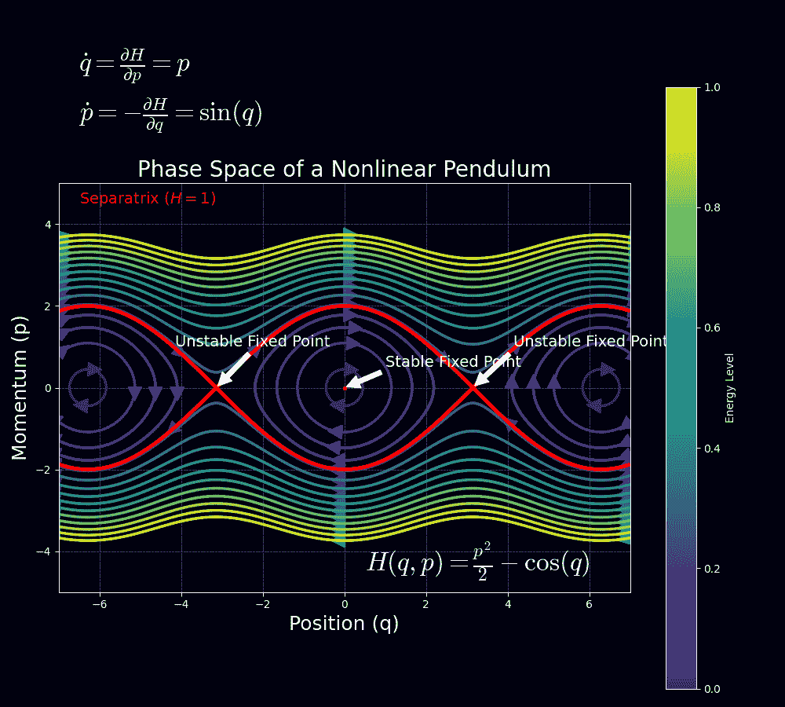
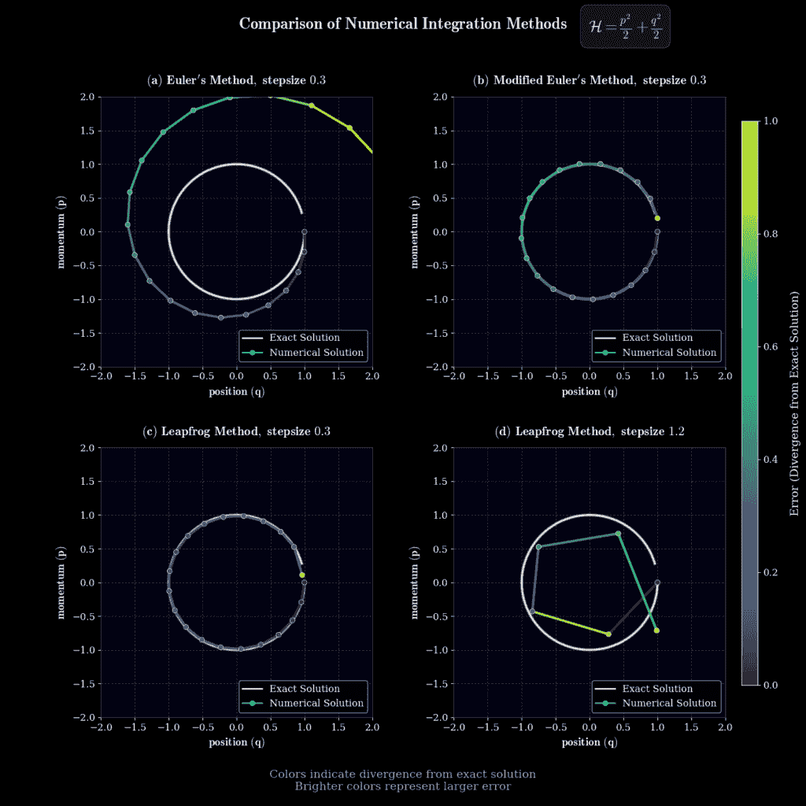
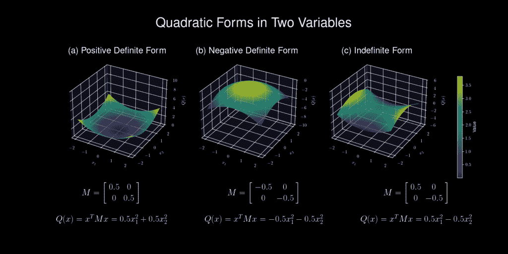
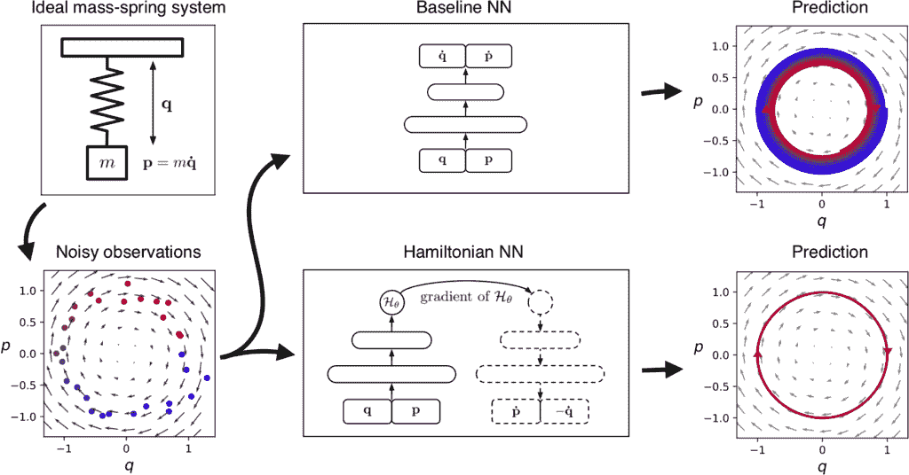

# 从物理学到概率：生成模型和 MCMC 的哈密顿力学

> 原文：[`towardsdatascience.com/from-physics-to-probability-hamiltonian-mechanics-for-generative-modeling-and-mcmc/`](https://towardsdatascience.com/from-physics-to-probability-hamiltonian-mechanics-for-generative-modeling-and-mcmc/)

非线性摆动的相空间。照片由[作者](https://soran-ghaderi.github.io/)提供。

<mdspan datatext="el1743188451748" class="mdspan-comment">哈密顿力学</mdspan>是一种描述物理系统（如行星或摆）随时间运动的方式，它关注的是能量而不是仅仅的力。通过通过能量视角重新构架复杂的动力学，这个 19 世纪的物理框架现在为前沿的生成式 AI 提供了动力。它使用广义坐标 \( q \)（如位置）及其共轭动量 \( p \)（与动量相关），形成一个相空间，捕捉系统的状态。这种方法对于具有许多部分的复杂系统特别有用，使得寻找模式和守恒定律变得更容易。

## 目录

+   数学改革：从二阶到一阶 ⚙️

+   拉格朗日序曲：作用量原理

+   牛顿 vs. 拉格朗日 vs. 哈密顿：一场哲学对决

+   哈密顿方程：相空间的几何学 ⚙️

+   辛几何：神圣的不变量

+   我们将如何解决它？

+   辛数值积分器 💻

    +   蛙跳 Verlet

+   为什么辛几何性很重要

+   哈密顿蒙特卡洛方法

    +   从相空间到概率空间

    +   HMC 算法

+   **TorchEBM 库** 📚

+   与基于能量的模型的关系

+   潜在的研究方向 🔮

    +   机器学习模型中的辛几何性

    +   HMC 用于复杂分布

    +   将哈密顿力学与其他机器学习技术结合

    +   哈密顿生成对抗网络

+   想要一起合作吗？ 🤓

+   结论

+   参考文献和有用链接 📚

## 数学改革：从二阶到一阶 ⚙️

牛顿的 \( F = m\ddot{q} \) 需要解二阶微分方程，对于约束系统或识别守恒量时变得难以处理。

**核心思想**

**哈密顿力学将** \( \ddot{q} = F(q)/m \) **分解为两个一阶方程**，通过引入共轭动量 \( p \)：

\[

\begin{align*}

\dot{q} = \frac{\partial H}{\partial p} & \text{(位置)}, \quad \dot{p} = -\frac{\partial H}{\partial q} & \text{(动量)}

\end{align*}

\]

它将加速度分解为互补动量/位置流。这种相空间视角揭示了隐藏的几何结构。

## 拉格朗日预备知识：作用量原理

拉格朗日量 \( \mathcal{L}(q, \dot{q}) = K – U \) 通过变分法导出欧拉-拉格朗日方程：

\[ \frac{d}{dt}\left( \frac{\partial \mathcal{L}}{\partial \dot{q}} \right) – \frac{\partial \mathcal{L}}{\partial q} = 0 \]

> **动能符号**
> 
> 注意，在 \( \mathcal{L}(q, \dot{q}) = K – U \) 中的 \( K \) 也可以表示为**\( T \)**。

但这些仍然是二阶的。关键的飞跃是通过**勒让德变换 \( (\dot{q} \rightarrow p) \)**。哈密顿量通过定义共轭动量 \( p_i = \frac{\partial \mathcal{L}}{\partial \dot{q}_i} \) 从拉格朗日量通过**勒让德变换**导出；然后哈密顿量可以写成：

\[ H(q,p) = \sum_i p_i \dot{q}_i – \mathcal{L}(q, \dot{q}) \]

我们可以将 \( H(q,p) \) 写得更直观：

\[ H(q,p) = K(p) + U(q) \]

这改变了剧本：不再是 \( \dot{q} \) 中心动力学，我们得到了**辛相流**。

> **这为什么重要**
> 
> 对于许多物理系统，哈密顿量成为系统的总能量 \( H = K + U \)。它还提供了一个框架，其中时间演化是一个**正则变换**——一个保持基本泊松括号结构 \( \{q_i, p_j\} = \delta_{ij} \) 的对称性。
> 
> 更多关于正则、非正则变换和泊松括号的信息，包括详细的数学和示例，请查看[TorchEBM 关于哈密顿力学的帖子](https://soran-ghaderi.github.io/torchebm/latest/blog/hamiltonian-mechanics/#lagrangian-prelude-action-principles)。

这种变换不是正则的，因为它不保持泊松括号结构。

## 牛顿与拉格朗日与哈密顿：一场哲学对决

| 方面 | 牛顿 | 拉格朗日 | 哈密顿 |
| --- | --- | --- | --- |
| **状态变量** | 位置 \( x \) 和速度 \( \dot{x} \) | 广义坐标 \( q \) 和速度 \( \dot{q} \) | 广义坐标 \( q \) 和共轭动量 \( p \) |
| **公式** | 二阶微分方程 \( (F=ma) \) | 最小作用量原理 (\( \delta \int L \, dt = 0 \))：\( L = K – U \) | 从哈密顿函数得到的一阶微分方程（相流 \( (dH) \)）：\( H = K + U \) |
| **识别对称性** | 手动识别或通过特定方法 | 诺特定理 | 正则变换和泊松括号 |
| **机器学习联系** | 物理信息神经网络、模拟 | 最优控制、强化学习 | 哈密顿蒙特卡洛（HMC）采样、基于能量的模型 |
| **能量守恒** | 不是固有的（必须推导） | 通过守恒定律内置 | 中心（哈密顿量是能量） |
| **广义坐标** | 可能，但通常很繁琐 | 自然拟合 | 自然拟合 |
| **时间可逆性** | 是 | 是 | 尤其是在辛形式中是 |

## 哈密顿方程：相空间的几何学 ⚙️

相空间是一个数学空间，我们可以表示物理系统的可能状态集合。对于一个具有 \( n \) 个自由度的系统，相空间是一个 \( 2n \)-维空间，通常可视化为一个地图，其中每个点 \( (q, p) \) 代表一个独特的状态。系统的演化由该空间中点的运动描述，受哈密顿方程的支配。

<https://contributor.insightmediagroup.io/wp-content/uploads/2025/03/pendulum_phase_space-1.mp4>

非线性摆的相空间肖像显示振荡运动（封闭轨道）、旋转运动（波浪轨迹）和连接不稳定平衡点的分离线（红色曲线）。位置（q）和动量（p）的动力学说明了哈密顿系统基本守恒原理。动画由[作者](https://soran-ghaderi.github.io/)制作。

这种公式提供了几个优点。它使得通过规范变换和泊松括号直接识别守恒量和对称性变得简单，这为系统的行为提供了更深入的见解。例如，刘维定理指出，系统集合在相空间中占据的体积随时间保持不变，表达为：

\[ \frac{\partial \rho}{\partial t} + \{\rho, H\} = 0 \]

或者等价地：

\[ \frac{\partial \rho}{\partial t} + \sum_i \left(\frac{\partial \rho}{\partial q_i}\frac{\partial H}{\partial p_i} – \frac{\partial \rho}{\partial p_i}\frac{\partial H}{\partial q_i}\right) = 0 \]

其中 \( \rho(q, p, t) \) 是密度函数。这有助于我们表示相空间流及其在辛变换下保持面积的方式。它与[辛几何](https://en.wikipedia.org/wiki/Symplectic_geometry)的关系使得数学性质与许多数值方法直接相关。例如，它使得哈密顿蒙特卡洛方法在高维空间中表现良好，通过定义 MCMC 策略来增加接受样本（粒子）的机会。

## 辛性质：神圣的不变量

哈密顿流保持辛 2-形式 \( \omega = \sum_i dq_i \wedge dp_i \)。

**辛 2-形式 \( \omega \)**

辛 2-形式，记作 \( \omega = \sum_i dq_i \wedge dp_i \)，是辛几何中使用的数学对象。它测量相空间切空间中向量形成的平行四边形的面积。

+   \( dq_i \) 和 \( dp_i \)：位置和动量坐标的无限小变化。

+   **\( \wedge \)**：楔积，以反对称的方式结合微分形式，意味着 \( dq_i \wedge dp_i = -dp_i \wedge dq_i \)。

+   **\( \sum_i \)**：对所有自由度求和。

想象一个相空间，其中每个点代表一个物理系统的状态。辛形式为每对向量分配一个值，实际上测量了它们张成的平行四边形的面积。这个面积在哈密顿流下保持不变。

**关键属性**

+   **封闭性**：\( d\omega = 0 \)，这意味着其外导数为零 \( d\omega=0 \)。这一属性确保了形式在连续变换下不变。

+   **非退化**: 如果对于所有 \( Y \) 都有 \( d\omega(X,Y)=0 \)，则 \( X=0 \)，那么这种形式是非退化的。这确保了每个向量都有一个唯一的“伙伴”向量，使得它们在 \( \omega \) 下的配对非零。

**示例**

对于一个自由度为一的简单谐振子，\( \omega = dq \wedge dp \)。这衡量了由代表位置和动量变化的向量在相空间中张成的平行四边形的面积。

**一个非常简化的 PyTorch 代码**：

虽然 PyTorch 不直接处理微分形式，但你可以从概念上使用张量表示辛形式：

这段代码说明了楔积的反对称性质。

在数值上，这意味着好的积分器必须遵守：

\[ \frac{\partial (q(t + \epsilon), p(t + \epsilon))}{\partial (q(t), p(t))}^T J \frac{\partial (q(t + \epsilon), p(t + \epsilon))}{\partial (q(t), p(t))} = J \\ \text{其中 } J = \begin{pmatrix} 0 & I \\ -I & 0 \end{pmatrix} \]

**公式分解**

+   **几何数值积分**：在保持系统几何属性的同时求解微分方程。

+   **辛性**：哈密顿系统固有的几何属性。它确保了相空间 \( (q, p) \) 中几何结构（例如，平行四边形）的面积随时间保持不变。这编码在辛形式 \( \omega = \sum_i dq_i \wedge dp_i \) 中。

+   一个数值方法是**辛的**：如果它保持 \( \omega \)。从 \( (q(t), p(t)) \) 到 \( (q(t + \epsilon), p(t + \epsilon)) \) 的变换的雅可比矩阵必须满足上述条件。

+   **雅可比矩阵** \( \frac{\partial (q(t + \epsilon), p(t + \epsilon))}{\partial (q(t), p(t))} \)：量化初始状态 \( (q(t), p(t)) \) 的小变化如何传播到下一个状态 \( (q(t + \epsilon), p(t + \epsilon)) \)。

+   \( q(t) \) 和 \( p(t) \)：在时间 \( t \) 的位置和动量。

+   \( q(t + \epsilon) \) 和 \( p(t + \epsilon) \)：经过一个时间步 \( \epsilon \) 后更新的位置和动量。

+   **\( \frac{\partial}{\partial (q(t), p(t))} \)**：相对于初始状态的偏导数。

## 我们将如何解决这个问题？

微分方程的数值求解器不可避免地会引入影响解精度的误差。这些误差表现为相空间中真实轨迹的偏差，在像谐振子这样的能量守恒系统中尤为明显。误差分为两大类：局部截断误差，源于连续导数的近似用离散步长（与 \( \mathcal{O}(\epsilon^n+1) \) 成正比，其中 \( \epsilon \) 是步长，n 取决于方法）；以及全局累积误差，它在积分时间上累积。

**前向欧拉法在这里失败！**

**关键问题：非简谐更新导致的能量漂移**

前向欧拉法（FEM）违反了哈密顿系统的几何结构，导致长期模拟中的**能量漂移**。让我们分析一下原因。

> 要详细了解像前向欧拉法这样的方法在哈密顿系统中的表现以及为什么它们不能保持简谐性——包括数学崩溃和实际例子——请查看来自[TorchEBM 库文档](https://soran-ghaderi.github.io/torchebm/latest/blog/hamiltonian-mechanics/#how-are-we-going-to-solve-it)关于哈密顿力学这篇帖子。

为了克服这个问题，我们转向简谐积分器——这些方法尊重哈密顿系统的基础几何结构，自然地引导我们到跳蛙 Verlet 方法，这是一种强大的简谐替代方案。 🚀

## 简谐数值积分器 💻

### 跳蛙 Verlet

对于可分离的哈密顿量 \( H(q,p) = K(p) + U(q) \)，其中相应的概率分布由以下给出：

\[ P(q,p) = \frac{1}{Z} e^{-U(q)} e^{-K(p)}, \]

跳蛙 Verlet 积分器的步骤如下：

\[ \begin{aligned} p_{i}\left(t + \frac{\epsilon}{2}\right) &= p_{i}(t) – \frac{\epsilon}{2} \frac{\partial U}{\partial q_{i}}(q(t)) \\ q_{i}(t + \epsilon) &= q_{i}(t) + \epsilon \frac{\partial K}{\partial p_{i}}\left(p\left(t + \frac{\epsilon}{2}\right)\right) \\ p_{i}(t + \epsilon) &= p_{i}\left(t + \frac{\epsilon}{2}\right) – \frac{\epsilon}{2} \frac{\partial U}{\partial q_{i}}(q(t + \epsilon)) \end{aligned} \]

这种 Störmer-Verlet 方案能够精确地保持简谐性，局部误差为 \( \mathcal{O}(\epsilon³) \)，全局误差为 \( \mathcal{O}(\epsilon²) \)。你可以在[这里](https://lemesurierb.people.charleston.edu/numerical-methods-and-analysis-python/main/ODE-IVP-6-multi-step-methods-introduction-python.html)了解更多关于 Python 中的数值方法和分析。

> **究竟如何？**
> 
> 想要知道跳蛙 Verlet 方法如何确保具有详细方程和证明的简谐性？[TorchEBM 库关于跳蛙 Verlet 的文档](https://soran-ghaderi.github.io/torchebm/latest/blog/hamiltonian-mechanics/#leapfrog-verlet)逐步分解了这一点。

## 为什么简谐性很重要

它们是物理模拟中的**可逆神经网络**！

辛积分器如 Leapfrog Verlet 对于哈密顿系统的**长期稳定性**至关重要。

+   **相空间保持**：在 \( (q, p) \)-空间中的体积被精确保持，避免了人工能量漂移。

+   **近似能量守恒**：虽然能量 \( H(q,p) \) 并不完全守恒（由于 \( \mathcal{O}(\epsilon²) \) 错误），但它会在指数级长的时间尺度上围绕真实值振荡。

+   **实际应用**：这使得辛积分器在分子动力学和哈密顿蒙特卡洛（HMC）中变得不可或缺，在这些领域中，准确的采样依赖于稳定的轨迹。

相空间中简单谐振子的数值积分方法比较。颜色渐变表示误差大小，颜色越亮表示与精确解的偏差越大（白色）。欧拉方法（a）表现出能量增长，改进的欧拉方法（b）显示出改进的稳定性，而 Leapfrog 在小的步长下（c）保持了良好的能量守恒，但在大的步长下（d）发展出几何畸变。照片由作者[作者](https://soran-ghaderi.github.io/)拍摄。

欧拉方法（一阶）系统地给系统注入能量，导致图中看到的特征向外螺旋。改进的欧拉方法（二阶）显著减少了这种能量漂移。最重要的是，像 Leapfrog 方法这样的辛积分器通过保持相空间体积守恒，即使在相对较大的步长下也能保持哈密顿系统几何结构的完整性。这种结构保持是 Leapfrog 在分子动力学和天体物理学中长期模拟中仍然是首选方法的原因，尽管在大步长下存在可见的多边形离散化伪影，但能量守恒仍然至关重要。

非辛方法（例如，Euler-Maruyama）在这些情况下往往失败得很惨。

| 积分器 | 辛性 | 阶数 | 类型 |
| --- | --- | --- | --- |
| 欧拉方法 | ❌ | 1 | 显式 |
| 辛性欧拉 | ✅ | 1 | 显式 |
| Leapfrog (Verlet) | ✅ | 2 | 显式 |
| Runge-Kutta 4 | ❌ | 4 | 显式 |
| Forest-Ruth 积分器 | ✅ | 4 | 显式 |
| Yoshida 6 阶 | ✅ | 6 | 显式 |
| Heun 方法（RK2） | ❌ | 2 | 显式 |
| 三阶 Runge-Kutta | ❌ | 3 | 显式 |
| 隐式中点法 | ✅ | 2 | 隐式（求解方程） |
| 四阶 Adams-Bashforth | ❌ | 4 | 多步（显式） |
| 后向欧拉方法 | ❌ | 1 | 隐式（求解方程） |

关于局部和全局误差或这些积分器最适合什么等方面更详细的说明，可以在[哈密顿力学：为什么辛性很重要](https://soran-ghaderi.github.io/torchebm/latest/blog/hamiltonian-mechanics/#why-symplectic-matters)的便捷文章中找到，它涵盖了所有内容。

## 哈密顿蒙特卡洛

汉密尔顿蒙特卡洛（HMC）是一种马尔可夫链蒙特卡洛（MCMC）方法，它利用汉密尔顿动力学来有效地从复杂的概率分布中采样，尤其是在贝叶斯统计和机器学习中。

### 从相空间到概率空间

HMC 将目标分布 \( P(z) \) 解释为玻尔兹曼分布：

\[ P(z) = \frac{1}{Z} e^{\frac{-E(z)}{T}} \]

将其代入此公式，哈密尔顿量给我们一个联合密度：

\[ P(q,p) = \frac{1}{Z} e^{-U(q)} e^{-K(p)} \\ \text{其中 } U(q) = -\log[p(q), p(q|D)] \]

其中 \( p(q|D) \) 是给定数据 \( D \) 的似然，T=1 因此被移除。我们使用势能 \( U(q) \) 来估计我们的后验分布，因为 \( P(q,p) \) 由两个独立的概率分布组成。

通过人工动量 \( p \sim \mathcal{N}(0,M) \) 进行增强，然后模拟哈密尔顿动力学，根据位置变量 \( U(q) \) 的分布提出新的 \( q’ \)，其中 \( U(q) \) 作为目标分布 \( P(q) \) 的“势能”，从而在高概率区域创建山谷。

想了解更多关于 HMC 的信息，请查看[这个解释](https://arxiv.org/abs/1701.02434)或[这个教程](https://mc-stan.org/docs/2_19/reference-manual/hamiltonian-monte-carlo.html)。

> **物理系统**：\( H(q,p) = U(q) + K(p) \) 表示总能量
> 
> **采样系统**：\( H(q,p) = -\log P(q) + \frac{1}{2}p^T M^{-1} p \) 定义了探索动力学

动能以流行的形式 \( K(p) = \frac{1}{2}p^T M^{-1} p \)，通常是高斯形式，为穿越这些景观注入动量。关键的是，质量矩阵 \( M \) 扮演着**预处理器**的角色——对角 \( M \) 适应参数尺度，而密集 \( M \) 可以与相关结构对齐。\( M \) 是对称的、正定的，通常是对角的。

**什么是正定？**

**正定**：对于任何非零向量 \( x \)，表达式 \( x^T M x \) 总是正的。这确保了稳定性和效率。

不同二次形式在两个变量中的示意图，展示了不同协方差矩阵如何影响形状。图示：

影响这些形式的形状。图示：

a) **正定形式**：一个碗形表面，所有特征值都是正的，表示一个最小值。

b) **负定形式**：一个倒置的碗，所有特征值都是负的，表示一个最大值。

c) **不定形式**：一个鞍形表面，具有正负特征值，表示既不是最大值也不是最小值。

每个子图包括矩阵（\( M \)）和相应的二次形式（\( Q(x) = x^T M x \)）。照片由[作者](https://soran-ghaderi.github.io/)提供。

\[

\( x^T M x > 0 \)

\]

**动能选择**

+   **高斯（标准 HMC）**：\( K(p) = \frac{1}{2}p^T M^{-1} p \)

    产生欧几里得轨迹，适用于中等维度。

+   **相对论性（黎曼 HMC）**：\( K(p) = \sqrt{p^T M^{-1} p + c²} \)

    限制最大速度，防止在病态空间中发散。

+   **自适应（代理梯度）**：通过神经网络学习 \( K(p) \) 以匹配目标几何形状。

> **关键直觉**
> 
> 拉格朗日量 \( H(q,p) = U(q) + \frac{1}{2}p^T M^{-1} p \) 创建了一个能量景观，其中动量**携带采样器通过高概率区域**，避免随机游走行为。

### HMC 算法

算法涉及：

1.  **初始化**：从一个初始位置 \( q_0 \) 和样本动量 \( p_0 \sim \mathcal{N}(0,M) \) 开始。

1.  **蛙跳积分**：使用蛙跳法来近似哈密顿动力学。对于步长 \( \epsilon \) 和 L 步，更新：

    +   半步动量：\( p(t + \frac{\epsilon}{2}) = p(t) – \frac{\epsilon}{2} \frac{\partial U}{\partial q}(q(t)) \)

    +   全步位置：\( q(t + \epsilon) = q(t) + \epsilon \frac{\partial K}{\partial p}(p(t + \frac{\epsilon}{2})) \)，其中 \( K(p) = \frac{1}{2} p^T M^{-1} p \)，所以 \( \frac{\partial K}{\partial p} = M^{-1} p \)

    +   全步动量：\( p(t + \epsilon) = p(t + \frac{\epsilon}{2}) – \frac{\epsilon}{2} \frac{\partial U}{\partial q}(q(t + \epsilon)) \) 这重复 L 次以得到建议的 \( \dot{q} \) 和 \( \dot{p} \)。

1.  **Metropolis-Hastings 接受度**：以概率 \( \min(1, e^{H(q_0,p_0) – H(\dot{q},\dot{p})}) \) 接受建议的 \( \dot{q} \)，其中 \( H(q,p) = U(q) + K(p) \)。

这个过程生成一个具有平稳分布 \( P(q) \) 的马尔可夫链，利用哈密顿动力学来采取比随机游走方法更大、更有效的步骤。

> **为什么比随机游走更好？**
> 
> HMC 沿着能量轮廓在多维空间中导航——就像沿着山间小路行走而不是随意漫步！
> 
> **哈密顿方程的回顾？**
> 
> \[
> 
> \begin{cases}
> 
> \dot{q} = \nabla_p K(p) = M^{-1}p & \text{(引导探索)} \\
> 
> \dot{p} = -\nabla_q U(q) = \nabla_q \log P(q) & \text{(贝叶斯更新)}
> 
> \end{cases}
> 
> \]

这个耦合系统驱动 \( (q,p) \) 沿着 \( P(q) \) 的等概率轮廓，动量**在每个步骤中旋转**而不是**重置**，就像在随机游走 Metropolis 中那样——想象一下沿着山间小路行走而不是随意漫步！关键参数——积分时间 \( \tau = L\epsilon \) 和步长 \( \epsilon \)——平衡探索与计算成本：

+   **短 \( \tau \)**：局部探索，更高的接受率

+   **长 \( \tau \)**：全局移动，存在 U 型转弯（周期性轨道）

> **关键参数和调整**
> 
> 将 \( M \) 调整以匹配 \( P(q) \) 的协方差（例如，通过预热适应）并设置 \( \tau \sim \mathcal{O}(1/\lambda_{\text{max}}) \)，其中 \( \lambda_{\text{max}} \) 是 \( \nabla² U \) 的最大特征值，通常会产生最佳混合效果。

#### TorchEBM 库 📚

哦，顺便说一下，我一直在用 Python 玩这个，然后创建了一个名为[**TorchEBM**](https://soran-ghaderi.github.io/torchebm/latest/)的库。它包含了一些基于能量的、分数匹配、扩散和流模型以及我一直在尝试的 HMC 工具。没有什么花哨的，只是一个研究者的沙盒，用于测试这类想法。如果你喜欢编写这类代码，请在[TorchEBM GitHub](https://github.com/soran-ghaderi/torchebm)上四处看看，并告诉我你的想法——欢迎提交 PR！在写这篇帖子的时候，玩这个很有趣。

## 与基于能量的模型（EBMs）的联系

基于能量的模型（EBMs）是一类生成模型，它使用能量函数在数据点上定义一个概率分布。数据点的概率与 \( e^{-E(x)} \) 成正比，其中 \( E(x) \) 是能量函数。这种公式与统计物理中的玻尔兹曼分布直接类似，其中概率与状态的能量相关。在哈密顿力学中，哈密顿函数 \( H(q, p) \) 代表系统的总能量，相空间中的概率分布由 \( e^{-H(q,p)/T} \) 给出，其中 \( T \) 是温度。

在 EBMs 中，哈密顿蒙特卡洛（HMC）常用于从模型分布中进行采样。HMC 利用哈密顿动力学来提出新的状态，然后根据 Metropolis-Hastings 标准接受或拒绝这些状态。这种方法对于高维问题特别有效，因为它减少了样本之间的相关性，并允许更有效地探索状态空间。例如，在图像生成任务中，HMC 可以从由能量函数定义的分布中进行采样，从而促进高质量图像的生成。

EBMs 通过哈密顿量定义概率：

\[ p(x) = \frac{1}{Z}e^{-E(x)} \quad \leftrightarrow \quad H(q,p) = E(q) + K(p) \]

## 可能的研究方向 🔮

### 机器学习模型中的辛几何性

哈密顿神经网络（HNN）架构概述。图片来自[HNN](https://arxiv.org/abs/1906.01563)论文。

将哈密顿力学的辛结构纳入机器学习模型，以保留能量守恒等性质，这对于长期预测至关重要。将哈密顿神经网络（HNNs），如[哈密顿神经网络](https://greydanus.github.io/2019/05/15/hamiltonian-nns/)中讨论的，推广到更复杂的系统或开发新的保持辛几何性的架构

### HMC 用于复杂分布

HMC 用于从复杂、高维和多模态分布中进行采样，如深度学习中遇到的情况。将 HMC 与其他技术（如并行退火）相结合，可以更有效地处理具有多个模态的分布。

### 将哈密顿力学与其他机器学习技术相结合

将汉密尔顿力学与强化学习相结合，以指导在连续状态和动作空间中的探索。使用它来模拟环境可能会改善探索策略，如机器人在潜在应用中的表现所示。此外，使用汉密尔顿力学在变分推理中定义近似后验，可能导致更灵活和准确的近似。

### 汉密尔顿生成对抗网络

将汉密尔顿形式主义作为神经网络生成物理上可能的视频的归纳偏差。

## 想要一起合作吗？🤓

如果你们中的一些人在进行高级魔法时对研究合作感兴趣，我很乐意在咖啡☕️（虚拟或现实中的伦敦）上讨论生成模型。如果你有兴趣将这些想法进一步发展，请与我联系！在[Twitter](https://twitter.com/soranghadri)/[BlueSky](https://bsky.app/profile/soranghaderi.bsky.social)或[GitHub](https://github.com/soran-ghaderi)上关注我——我通常在那里胡言乱语关于这些事情。如果你好奇，还可以在[LinkedIn](https://www.linkedin.com/in/soran-ghaderi)和[Medium](https://soran-ghaderi.medium.com/)/[TDS](https://towardsdatascience.com/author/soran-ghaderi/)上找到我。想了解更多关于我的研究兴趣，请访问我的[个人网站](https://soran-ghaderi.github.io/)。

* * *

## 结论

汉密尔顿力学通过能量重新定义物理系统，使用相空间通过一阶方程揭示对称性和守恒定律。像 Leapfrog Verlet 这样的辛积分器保持这种结构，确保模拟中的稳定性——这对于分子动力学和汉密尔顿蒙特卡洛（HMC）等应用至关重要。HMC 利用这些动力学有效地采样复杂分布，将经典物理学与现代机器学习联系起来。

* * *

## 参考资料和有用链接 📚

+   [多步方法简介：跳蛙法](https://lemesurierb.people.charleston.edu/numerical-methods-and-analysis-python/main/ODE-IVP-6-multi-step-methods-introduction-python.html)

+   [汉密尔顿蒙特卡洛入门指南](https://bayesianbrad.github.io/posts/2019_hmc.html)

+   [汉密尔顿蒙特卡洛](https://bjlkeng.io/posts/hamiltonian-monte-carlo/)

+   [汉密尔顿蒙特卡洛——Stan](https://mc-stan.org/docs/2_19/reference-manual/hamiltonian-monte-carlo.html) – Stan 解释

+   [《汉密尔顿力学傻瓜指南：直观介绍》](https://profoundphysics.com/hamiltonian-mechanics-for-dummies/)

+   [汉密尔顿力学维基百科页面](https://en.wikipedia.org/wiki/Hamiltonian_mechanics)

+   [拉格朗日和哈密顿力学简介讲义](https://www.macs.hw.ac.uk/~simonm/mechanics.pdf)

+   [汉密尔顿力学——杰里米·塔图姆，维多利亚大学](https://phys.libretexts.org/Bookshelves/Classical_Mechanics/Classical_Mechanics_%28Tatum%29/14:_Hamiltonian_Mechanics)

+   [汉密尔顿神经网络——博客](https://greydanus.github.io/2019/05/15/hamiltonian-nns/)

+   [哈密顿神经网络](https://arxiv.org/abs/1906.01563)

+   其他：[自然智能 - Sam Greydanus 的博客](https://greydanus.github.io/) – 许多有趣的主题

\[\]
