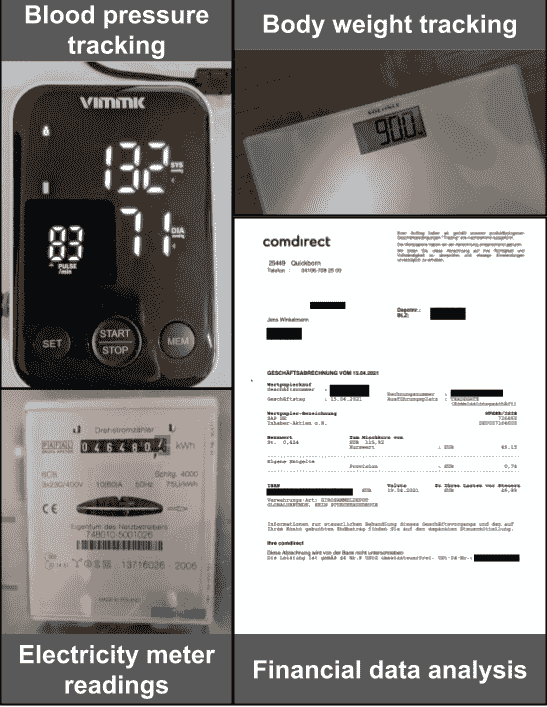
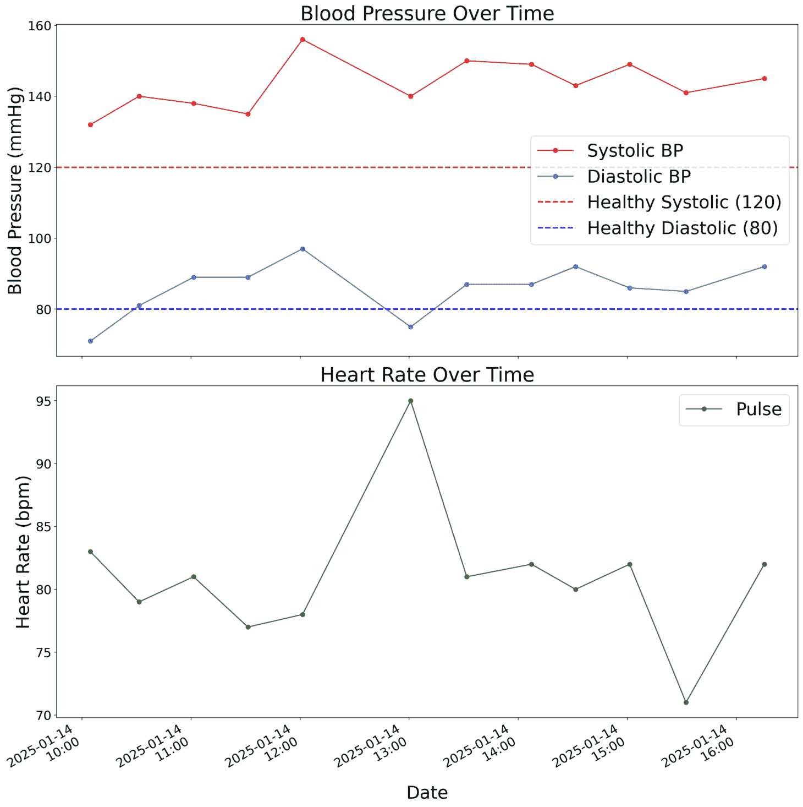
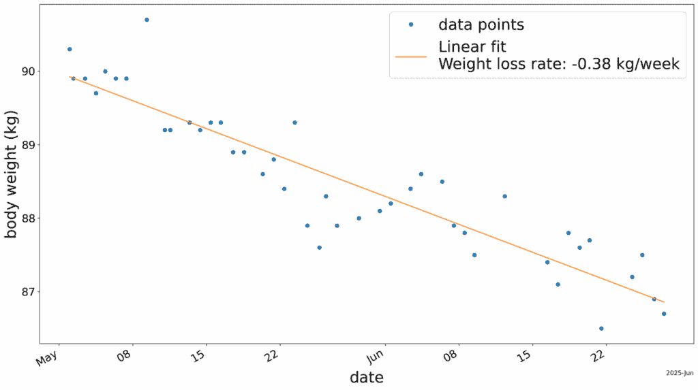
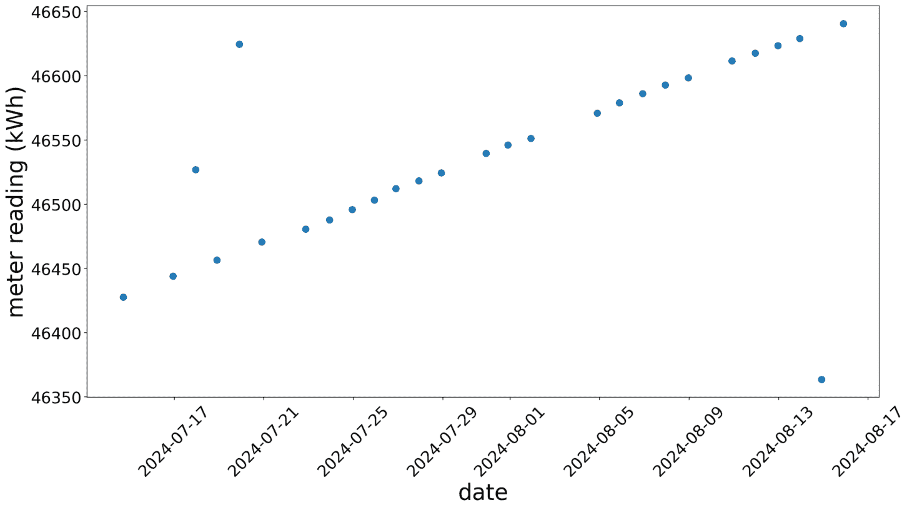
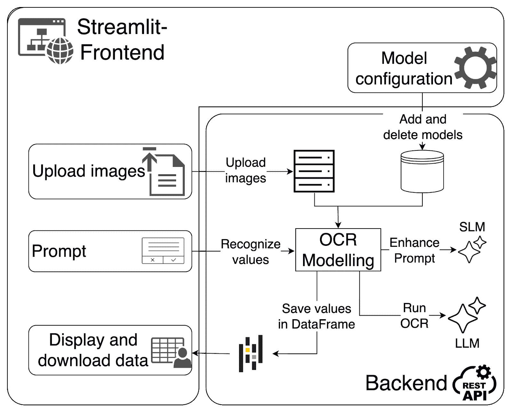
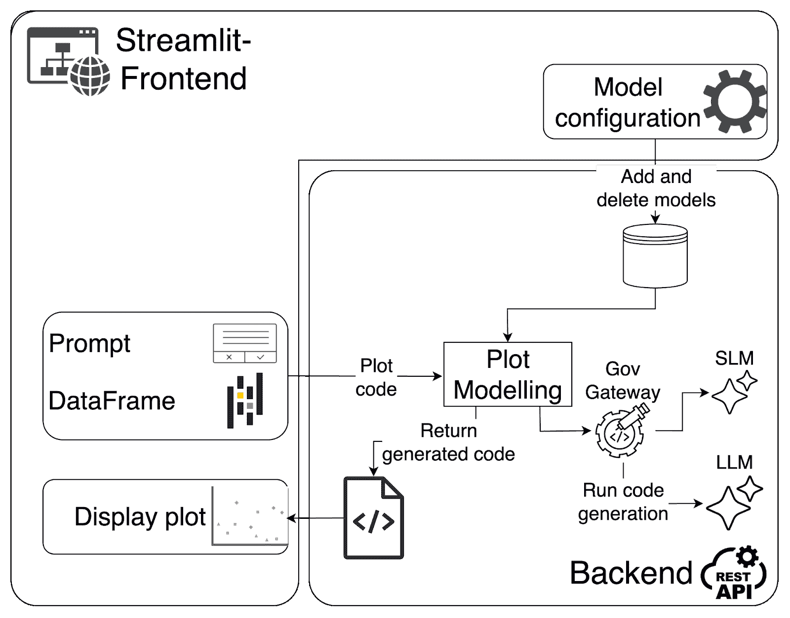
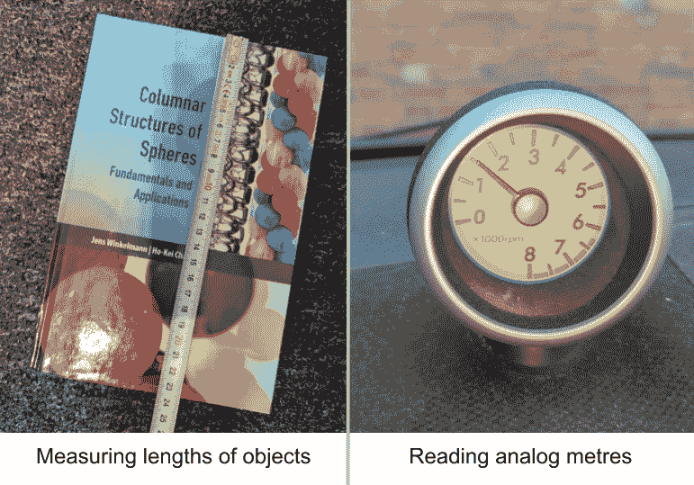
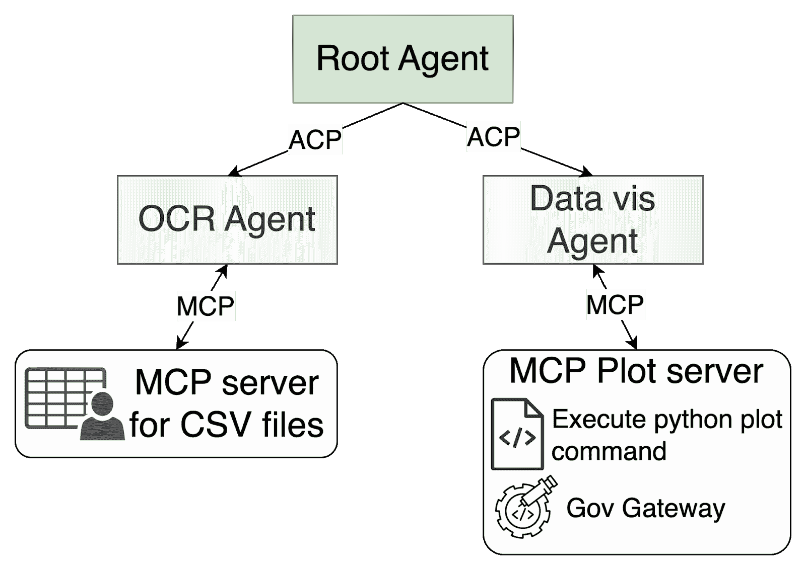

# 从像素到图表

> 原文：[`towardsdatascience.com/from-pixels-to-plots/`](https://towardsdatascience.com/from-pixels-to-plots/)

## 将繁琐的实验室工作迅速转化为可操作的见解

在我作为物理学生期间，手动提取和分析实验测量数据往往是物理实验室中不可避免且令人沮丧的一部分。从仪器读取数值、写下它们、将它们转移到电子表格中，最后绘制结果，这个过程既缓慢又重复，且容易出错。

现在我从事生成式 AI 工作，我想：*为什么不使用 AI 来自动化这个过程呢？*

这引导我构建了**AI-OCR**，这是一个开源原型，它使用 AI 从图像中提取数值数据并将其转换为有洞察力的图表。从图像中提取文本或数字的过程通常被称为光学字符识别（OCR），因此这个项目的名字就是这样来的。

它是如何工作的：

1.  上传测量图像（或如财务报告这样的结构化 PDF）

1.  指示 AI 将特定值提取到干净的 DataFrame 中

1.  指示 AI 生成时间序列、直方图、散点图等可视化

通过自动化原本繁琐的工作，AI-OCR 帮助减少了人工工作量，同时也打破了供应商锁定。在许多实验室和工业环境中，即使是数字数据也常常存在于专有格式中，需要昂贵的软件或受限制的软件才能访问和分析。使用 AI-OCR，你可以简单地拍照测量数据，从图像中提取数据，并通过简单的提示进行分析和可视化。

虽然这个工具的初衷是简化实验室工作流程，但其应用范围远超科学领域。**从跟踪健康指标到分析水电费或财务报表，AI-OCR 可以支持广泛的日常数据任务**。

在这篇文章中，我将介绍：

+   原型在实际应用中的案例

+   它内部工作原理的分解

+   遇到的挑战、限制和权衡

+   进一步发展的潜在方法

## 实际应用案例：AI-OCR 的亮点

由于我不再在物理实验室工作，而且很不幸，我地下室里也没有实验室，所以我无法在最初预期的环境中测试 AI-OCR。相反，我发现了一些日常应用场景，这个原型在这些场景中证明非常有帮助。

在本节中，我将介绍四个现实世界例子。我使用 AI-OCR 从日常图像/文档中提取数值数据，如下面的图像所示，并投入最小的努力生成有意义的图表。对于这些用例中的每一个，我都使用了**OpenAI 的 GPT-4.1 模型 API**进行 OCR 和数据可视化（更多技术细节在第三部分中）。

四个 AI-OCR 可以应用的现实世界例子。*图片由作者提供*。

### 血压跟踪

在这个第一个用例中，我使用 AI-OCR 跟踪我一天中的血压和心率。你可以在以下视频中看到这个用例的完整演示：

🎥 **[`youtu.be/pTk9RgQ5SkM`](https://youtu.be/pTk9RgQ5SkM)**

这里是如何在实际中使用的：

1.  我大约每 30 分钟记录一次血压，通过拍照监控器的显示。

1.  我上传了图像，并提示 AI 提取：收缩压、舒张压和心率。

1.  AI-OCR 返回了一个`pandas.DataFrame`，其中包含提取的值，并使用图像元数据进行了时间戳。

1.  最后，我要求 AI 绘制收缩压和舒张压的时间序列图，包括表示标准健康范围的水平线，以及心率在单独的子图中。

AI 生成的我一天内血压和心率的图表。*图片由作者提供*。

结果？一天中我（略有升高）的血压波动直观概述，下午 1 点午餐后明显下降。特别令人鼓舞的是，图表没有显示出任何明显的异常值，这是一个很好的合理性检查，表明 AI 正确地从图像中提取了值。

大多数现代血压计只存储有限数量的读数。例如，我使用的设备可以存储多达 120 个值。然而，许多经济实惠的型号（如我的）不支持数据导出。即使它们支持，通常也需要专有应用程序，将你的健康数据锁定在封闭的生态系统中。正如你所看到的，这里并非如此。

### 体重跟踪

在另一个与健康相关的用例中，我使用 AI-OCR 跟踪我在个人减肥努力期间几周内的体重。

传统上，你可能需要称重并将结果手动输入到健身应用程序中。一些现代体重秤提供通过蓝牙同步，但数据通常被锁定在专有应用程序中。这些应用程序通常限制数据访问和可以生成的可视化类型，这使得真正拥有或分析自己的健康数据变得困难。

使用 AI-OCR，我只需每天早上拍一张体重秤的读数照片。对于不是特别喜欢早上的人来说，这比在早餐茶前摆弄应用程序要容易得多。一旦我有一批图像，我就上传它们，并要求 AI-OCR 提取体重值并生成我体重的时序图。

AI 生成的我体重随时间变化的图表以及线性回归。*图片由作者提供*

从生成的图表中，你可以看到我大约在两个月内减重了 3 公斤。我还让 AI 进行线性回归，估计每周减重率为~0.4 公斤**。**使用这种方法，用户可以完全控制分析过程：我可以要求 AI 生成趋势线，估计我的减重率，或者应用我需要的任何自定义逻辑。

### 财务数据分析

AI-OCR 不仅对健康跟踪有用，还可以帮助你理解个人财务。在我的情况下，我发现我的经纪应用提供的分析只是对投资组合的基本总结，并且经常错过关于我的投资策略的关键见解。一些数字甚至不准确或不完整。

举个例子：在我将投资组合转移到新经纪人后，我想验证我的买入价值是否正确转移。这可能会很麻烦，尤其是当股票通过储蓄计划或多次部分购买积累起来时。手动做这件事意味着要翻阅许多 PDF 文件，将数字复制到电子表格中，并双重检查公式，所有这些都很耗时且容易出错。

AI-OCR 自动化了整个工作流程。我将之前经纪人的所有 PDF 购买确认上传，并提示 AI 提取股票名称、面值和购买价格。在第二步，我要求它计算每只股票的买入价值，并生成结果条形图。在提示中，我解释了如何计算买入价值：

> *“买入价值 = 股票价格 × 面值，按总面值标准化。”*

生成的图表让我能快速发现买入价值转移中的不一致性。事实上，这个图表让我发现了来自新经纪应用中数字的一些错误。

同样，你可以提示 AI-OCR 根据你的交易历史计算随时间实现的收益或损失。这是我的经纪应用甚至不提供的指标。

### 电表读数

对于最终的使用案例，我将演示我是如何使用这个原型将我的电力消耗数字化并跟踪的。

像德国许多老房子一样，我的房子仍然使用着模拟电表，这使得使用现代（数字）技术进行日常跟踪几乎不可能。如果我想分析某个时间段内的消耗，我必须在时间段开始和结束时手动读取电表。然后我必须为每个间隔/天重复这一过程。这样做在多天之内很快就会变得单调乏味且容易出错。

相反，我几乎每天都会拍照电表几周，并将图像上传到 AI-OCR。通过两个简单的提示，该工具提取了读数，并生成了我累计电力消耗（千瓦时）的时间序列图。

AI 生成的我累计电力消耗随时间变化的图表。*图片由作者提供*。

图表显示了一个大致的线性趋势，这是我的日常消耗相对稳定的迹象。然而，可以看到三个异常值。这些并不是由我的秘密比特币挖矿设备引起的，而是由于 OCR 过程中的误读数字。在 27 张图像中的 3 张，模型简单地犯了识别错误。

这些故障指向了 AI-OCR 当前的局限性，我将在稍后更详细地探讨。但首先，让我们更仔细地看看这个原型实际上是如何在底层工作的。

## 底层：AI-OCR 是如何工作的

AI-OCR 分为两个主要组件：一个[前端](https://github.com/jWinman91/AI-OCR-Frontend)和一个[后端](https://github.com/jWinman91/AI-OCR)。前端使用[Streamlit](https://streamlit.io/)构建，这是一个 Python 库，让您轻松地将 Python 脚本转换为 Web 应用，几乎不需要额外的工作。它因其简单性而成为机器学习原型和概念验证的流行选择。尽管如此：Streamlit 并不适用于生产规模的应用。

这也是为什么本文的主要关注点是后端，数据提取和可视化在这里进行。它围绕两个不同的过程设计：

1.  **OCR（光学字符识别）**：使用 AI 从图像或文档中识别数值数据。

1.  **数据可视化**：将提取的数据转化为有洞察力的图表。

AI-OCR 的一个优势是其灵活性：它不依赖于单一的大型语言模型（LLM）供应商。根据用例，可以配置和交换商业和开源模型。每个过程都由可配置的 LLM 提供动力。除了 OpenAI 的 GPT-4.1 等模型外，原型（到目前为止）还支持 GGUF 格式的量化模型，这是一种将模型权重和元数据打包在一起的二进制文件格式。这些模型通过`llama.cpp` Python 库加载并在本地运行。

对于 OCR 任务，Hugging Face 提供了大量的量化模型，如 LLaVa、DeepSeek-VL 或 Llama-3-vision。对于可视化组件的代码生成，具有强大编码能力的模型最为有效。由于家中缺乏计算资源（我没有访问到强大的 GPU），我仅通过 API 彻底测试了此原型与 OpenAI 模型。

### OCR 组件：提取数据

为了将图像转化为洞察，必须从图像中识别出相关数据，这由 OCR 组件处理。这个过程从用户上传图像并提交一个提示开始，描述了应从图像中识别哪些值以及可选的附加上下文以协助模型。输出是一个包含提取值和图像时间戳的`pandas.DataFrame`。

下面的图示说明了数据提取管道的设计。外框代表基于 Streamlit 的前端，而内部部分详细说明了后端架构，一个 REST API。连接前端和后端的箭头代表 API 调用。在后端中，每个图标代表后端的一个不同组件。

OCR 组件的设计。*图片由作者提供*。

后端的核心是 OCR 模型对象。当提交提示时，该对象接收它以及选定的模型配置。它加载适当的模型并访问上传的图像。

此设计的一个特别有教育意义的部分是处理提示的方式。在实际 OCR 任务执行之前，用户提示通过一个小型语言模型（SLM）得到增强。SLM 的作用是识别用户提示中提到的特定值，并将它们作为列表返回。例如，在血压用例中，SLM 会返回：

`[“心率”， “舒张压”， “收缩压”]`。

此信息用于自动增强原始用户提示。LLM 总是请求返回结构化输出。因此，提示需要通过特定的 JSON 输出格式进行增强，对于血压案例，其格式如下：

`{“心率”： “值”， “舒张压”： “值”， “收缩压”： “值”}`。

注意，这里使用的 SLM 是通过 `llama.cpp` 在本地运行的。对于之前讨论的用例，我使用了 Gemma-2 9B（以量化 GGUF 格式）。这项技术突出了如何使用更小、更轻量级的模型进行高效和自动的提示优化。

此增强的提示随后依次与每个图像一起发送到选定的 LLM。模型从图像中推断出请求的值。然后将这些响应汇总到一个 `pandas.DataFrame` 中，最终将其返回给用户以供查看和下载。

### 可视化结果

将您的图像转换为洞察力的第二部分是可视化过程。在这里，OCR 过程中提取到 DataFrame 中的数值数据根据用户请求转换为有意义的图表。

用户提供一个描述他们想要的视觉类型（例如，时间序列、直方图、散点图）的提示。然后 LLM 生成 Python 代码来创建所需的图表。此生成的代码在前端执行，并将生成的可视化直接显示在前端。

下面的图再次详细说明了此过程。此特定过程的重点是 Plot 模型对象。它接收两个关键输入：

+   用户描述所需可视化的提示

+   由 OCR 处理生成的 `pandas.DataFrame`。

数据可视化组件的设计。*图片由作者提供。*

在将 DataFrame 的提示和元数据传递给 LLM 之前，提示首先通过一个治理网关。其任务是确保安全，通过防止生成或执行恶意代码。它被实现为一个 SLM。正如之前所述，我使用了 Gemma-2 9B（以量化 GGUF 格式）作为本地运行的 SLM，使用 `llama.cpp`。

具体来说，治理门户首先通过指示的 SLM 验证用户的提示包含有效的数据可视化请求，并且不包含任何有害或可疑的指令。只有当提示通过这一初步检查后，它才会被转发给 LLM 生成 Python 绘图代码。代码生成后，它会被发送回 SLM 进行第二次安全审查，以确保代码可以安全执行。

通过第二次安全验证后，生成的代码被发送回前端，在那里执行以生成所需的图表。这种双因素治理方法有助于确保 AI 生成的代码安全且安全地运行，同时使用户能够在 Matplotlib 生态系统中生成任何所需的数据可视化。

## 挑战、限制和权衡

正如在用例部分已经提到的，这个原型，特别是 OCR 组件，由于底层语言模型的限制，存在明显的局限性。

在本节中，我想明确展示两个当前工具在处理上存在显著困难的场景（如图下所示），以及为什么在某些情况下，它可能不是最佳解决方案。这两个场景都需要解释模拟数据。尽管实验室设备的数字化程度不断提高，但这对于许多物理实验室中此类工具的应用仍然是一个重要要求。

AI-OCR 在两个示例场景中挣扎的例子。*图片由作者提供。*

在左边是使用物理尺子测量物体长度（在这种情况下，一本书）的尝试。在右边是我的汽车模拟转速表的图片。在这两种情况下，我都使用原型处理了多个图像：用于测量书本长度的静态图像和用于读取转速表的视频帧。尽管提供了高质量的输入并精心设计了提示，但得到的测量结果仍然不够精确。虽然提取的值始终在预期的数值范围内，但它们对于实际应用来说偏差太大。

虽然 AI-OCR 提供了便利，但在某些情况下，整体成本可能会超过其好处。例如，在体重追踪器的情况下，值得指出的是，这个工具提供了便利，但代价是内存和令牌的使用。每张图片可能有好几兆字节，而提取的数据（一个浮点数）只有几字节。使用 LLM 进行图像分析也可能很昂贵。这些权衡突出了始终将 AI 应用与明确业务价值对齐的必要性。

## 结论：面向未来的实验室定制 AI 代理

在这篇文章中，我们探讨了如何构建一个由 LLM 驱动的原型，该原型将测量图像转换为结构化数据和有洞察力的图表。用户可以上传图像，描述他们想要从图像中识别的值以及要执行的数据可视化类型。然后，用户将收到原始值和视觉解释。

如果您尝试过 ChatGPT 或其他 LLM 平台，您可能已经注意到：它已经可以做到很多，也许更多。只需将图像上传到聊天中，描述您希望的数据可视化（可选添加上下文），系统（例如 ChatGPT）就会处理其余部分。在底层，这很可能依赖于一组协同工作的 AI 代理系统。

同样的架构也是未来版本的 AI-OCR 可能采用的。*但为什么还要费心去构建它，如果可以直接使用 ChatGPT 呢？* **这是因为定制化和控制**。与 ChatGPT 不同，AI-OCR 中的 AI 代理可以根据您的特定需求（如实验室助手的需求）进行定制，并且使用本地模型，您可以完全控制您的数据。例如，您很可能不愿意将您的个人财务文件上传到 ChatGPT。

以下图表展示了这种 AI 代理系统的可能架构（ChatGPT 很可能也依赖于这种架构）：

可能在实验室助手中集成的 AI 代理系统的可能架构。*图片由作者提供。*

在最高级别，根代理接收用户的输入并通过代理通信协议（ACP）委派任务。它可以选择两个辅助代理：

+   **OCR 代理**：从图像中提取相关的数值数据，并与管理 CSV 数据存储的模型上下文协议（MCP）服务器接口。

+   **数据可视化代理**：连接到一个可以执行 Python 代码的独立 MCP 绘图服务器。该服务器包括由 SLM 驱动的治理网关，确保所有代码在执行前都是安全和适当的。

与 ChatGPT 不同，这个设置可以完全定制：从用于数据保护的本地 LLM 到针对特定任务的代理的系统提示调整。AI-OCR 并非旨在取代 ChatGPT，而是补充它。它可能演变成一个自主的实验室助手，在特定环境中简化数据提取、绘图和分析。 

## 致谢

如果您对 AI-OCR 的未来感兴趣或想探讨想法和合作，请随时通过[LinkedIn](https://www.linkedin.com/in/jens-winkelmann-phd-685555168/)与我联系。

最后，我想感谢 Oliver Sharif、Tobias Jung、Sascha Niechciol、Oisín Culhane 和[Justin Mayer](https://justinmayer.com/)对本文的反馈和细致的校对。您的见解大大提高了这篇文章的质量。
