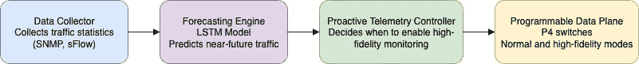

# 从反应式到预测式：使用机器学习和 INT 预测网络拥塞

> 原文：[`towardsdatascience.com/from-reactive-to-predictive-forecasting-network-congestion-with-machine-learning-and-int/`](https://towardsdatascience.com/from-reactive-to-predictive-forecasting-network-congestion-with-machine-learning-and-int/)

## 背景

在大型数据中心中，网络减速可能突然出现。分布式系统、微服务或 AI 训练作业的突然流量激增可能在几秒钟内耗尽交换机缓冲区。问题不仅仅是知道何时出现问题，而是能够在问题发生之前看到它。

遥测系统被广泛用于监控网络健康，但大多数系统处于反应式模式。它们只有在性能下降后才会标记拥塞。一旦链路饱和或队列满载，你已经错过了早期诊断的机会，追溯原始原因也变得非常困难。

带内网络遥测，或称 INT，试图通过在数据包通过网络时标记元数据来解决这一差距。它为你提供了实时查看流量流动、队列在哪里积累、延迟在哪里出现以及每个交换机如何处理转发的视图。当谨慎使用时，它是一个强大的工具。但它也有代价。在所有数据包上启用 INT 可能会引入严重开销，并将大量遥测数据推送到控制平面，其中大部分你可能甚至不需要。

如果我们能更具有选择性会怎样？不是跟踪所有事物，而是预测问题可能形成的地方，并只为这些区域和短时间内启用 INT。这样，在关键时刻我们能够获得详细的可见性，而不必支付持续监控的全部成本。

## 持续遥测的问题

INT 为你提供了一个强大、详细的网络内部情况视图。你可以直接从数据包路径中跟踪队列长度、逐跳延迟和时间戳。但这也带来了一定的代价：这种遥测数据会增加每个数据包的重量，如果你将其应用于所有流量，它可能会消耗大量的带宽和处理能力。

为了解决这个问题，许多系统采取了捷径：

**采样：**仅对一小部分（例如——1%）的数据包添加遥测数据。

**事件触发遥测：**仅在出现严重问题时才启用 INT，例如队列超过阈值。

这些技术有助于控制开销，但它们错过了流量激增的关键早期时刻，如果你试图防止减速，这是你最想了解的部分。

## 介绍一种预测方法

我们设计了一个系统，可以在拥塞发生之前预测拥塞并主动激活详细遥测，而不是对症状做出反应。想法很简单：如果我们能够预测流量何时何地会激增，我们就可以选择性地只为那个热点和正确的时间窗口启用 INT。

这样可以降低开销，但在真正需要的时候提供深入可见性。

## 系统设计

我们提出了一种简单的方法，使网络监控更加智能。它可以预测何时何地需要进行监控。想法不是采样每个数据包，也不是等待拥塞发生。相反，我们希望有一个系统可以早期捕捉到问题的迹象，并在需要时选择性地启用高保真监控。

那么，我们是如何完成这个任务的？我们创建了以下四个关键组件，每个组件都针对一个特定的任务。



图片来源：作者

### 数据收集器

我们首先收集网络数据以监控在任何给定时刻有多少数据正在通过不同的网络端口移动。我们使用 sFlow 进行数据收集，因为它有助于收集重要指标而不影响网络性能。这些指标以固定的时间间隔捕获，以获得任何时间点的实时网络视图。

### 预测引擎

预测引擎是我们系统最重要的组件。它是使用长短期记忆（LSTM）模型构建的。我们选择 LSTM 是因为它学习如何随时间演变模式，这使得它适合网络流量。我们在这里不追求完美。重要的是要发现通常在拥塞开始之前出现的异常流量峰值。

### 遥测控制器

控制器监听这些预测并做出决策。当一个预测的峰值超过警报阈值时，系统会做出响应。它向交换机发送命令，切换到详细监控模式，但仅针对相关的流或端口。它也知道何时退回，一旦条件恢复正常，关闭额外的遥测。

### 可编程数据平面

最后的部分是交换机本身。在我们的设置中，我们使用 P4 可编程 BMv2 交换机，它允许我们动态调整数据包的行为。大多数时候，交换机只是简单地转发流量而不做任何改变。但是当控制器开启 INT 时，交换机开始将遥测元数据嵌入到匹配特定规则的包中。这些规则由控制器推送，并允许我们针对我们关心的流量进行定位。

这样可以避免在持续监控和盲目采样之间的权衡。相反，我们可以在需要的时候获得详细的可见性，而不会在系统其余时间中淹没不必要的数据。

## 实验设置

我们使用以下工具构建了这个系统的完整模拟：

+   **Mininet** 用于模拟叶-脊网络

+   **BMv2 (P4 软件交换机)** 用于可编程数据平面行为

+   **sFlow-RT** 用于实时流量统计

+   **TensorFlow + Keras** 用于 LSTM 预测模型

+   **Python + gRPC + P4Runtime** 用于控制器逻辑

LSTM 模型是在 Mininet 中使用 iperf 生成的合成交通轨迹上训练的。一旦训练完成，该模型将循环运行，每 30 秒进行一次预测，并将预测结果存储起来供控制器执行。

这里是预测循环的简化版本：

```py
For every 30 seconds:
latest_sample = data_collector.current_traffic()
slinding_window += latest_sample
if sliding_window size >= window size:
forecast = forecast_engine.predict_upcoming_traffic()
if forecast > alert_threshold:
telem_controller.trigger_INT()
```

交换机立即响应，为特定流量切换遥测模式。

## 为什么选择 LSTM？

我们选择 LSTM 模型是因为网络流量往往具有结构。它并非完全随机。存在与一天中的时间、背景负载或批量处理作业相关的模式，而 LSTM 特别擅长捕捉这些时间关系。与独立处理每个数据点的简单模型不同，LSTM 可以记住之前发生的事情，并利用这种记忆来做出更好的短期预测。对于我们的用例，这意味着只需观察最后几分钟的行为，就能发现即将到来的激增的早期迹象。我们不需要它来预测确切的数字，只需要标记可能出现的异常情况。LSTM 给我们足够的准确性，可以触发主动遥测，而不会过度拟合噪声。

## 评估

我们没有运行大规模的性能基准测试，但通过我们的原型和测试条件下的系统行为，我们可以概述这种设计方法的实际优势。

### 预先期优势

这种预测系统的主要好处之一是它能够早期捕捉到问题。反应式遥测解决方案通常要等到队列阈值被越过或性能下降，这意味着你已经落后了。相比之下，我们的设计基于交通趋势预测拥堵，并提前激活详细监控，为操作员提供更清晰的关于问题原因的图景，而不仅仅是症状出现后的情况。

### 监控效率

在这个项目中，一个关键目标是保持开销低而不牺牲可见性。我们不是在所有流量上应用完整的 INT 或依赖粗粒度采样，而是我们的系统选择性地为短暂的高保真遥测启用，并且仅在预测表明可能存在问题的位置。虽然我们没有量化确切的成本节约，但设计自然地通过保持 INT 集中和短暂来限制开销，这是静态采样或反应式触发无法比拟的。

### 遥测策略的概念比较

虽然我们没有记录开销指标，但设计的意图是找到一个中间地带，提供比采样或反应式系统更深入的可见性，但成本仅为始终开启遥测的一小部分。以下是这种方法在高级别上的比较：


图片来源：作者

## 结论

我们想要找到一种更好的方法来监控网络流量。通过结合机器学习和可编程交换机，我们构建了一个系统，该系统能够在拥堵发生之前预测拥堵，并在恰当的位置和时间激活详细的遥测。

这似乎只是从反应变为预测的微小变化，但它开启了一个新的可观察性层面。随着遥测在 AI 规模数据中心和低延迟服务中变得越来越重要，这种智能监控将成为基本期望，而不仅仅是锦上添花。

## 参考文献

1.  [自适应遥测软件定义移动网络](https://www.researchgate.net/publication/340034106_Adaptive_Telemetry_for_Software-Defined_Mobile_Networks)

1.  [hpcc.pdf](https://liyuliang001.github.io/publications/hpcc.pdf)
