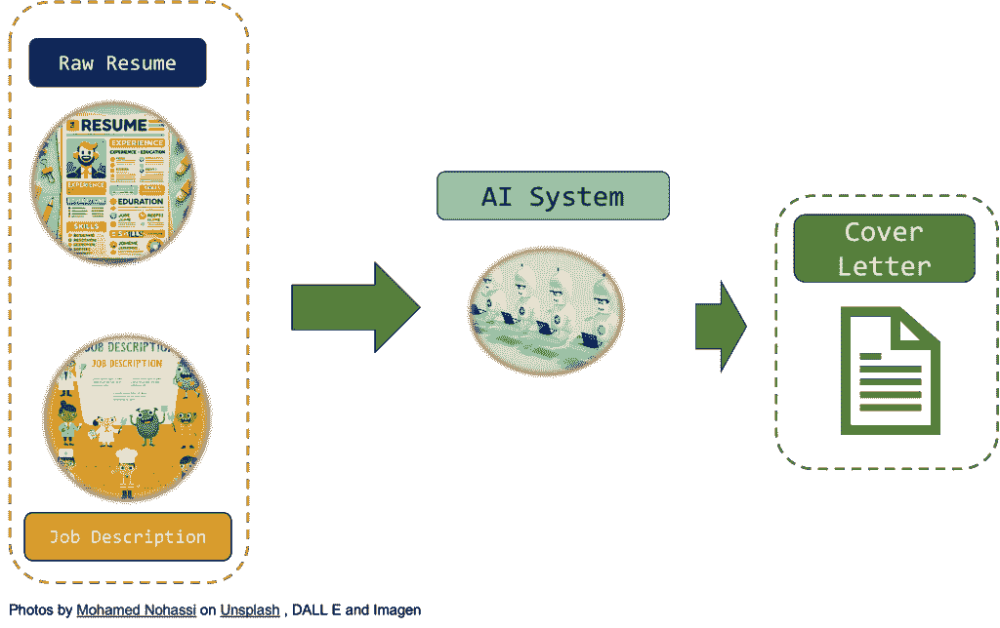
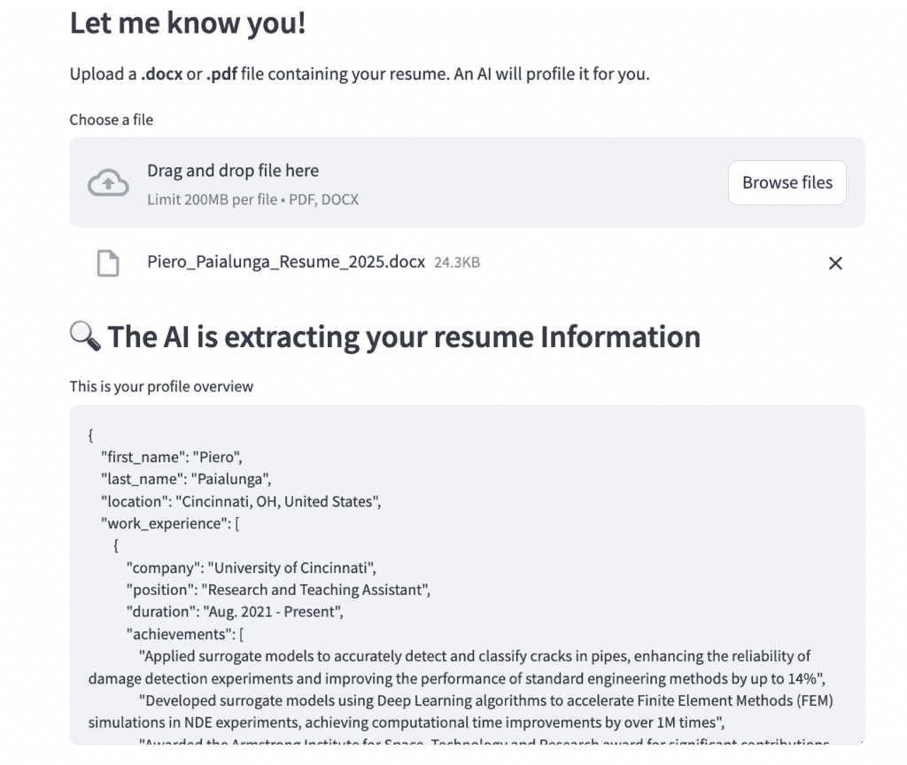
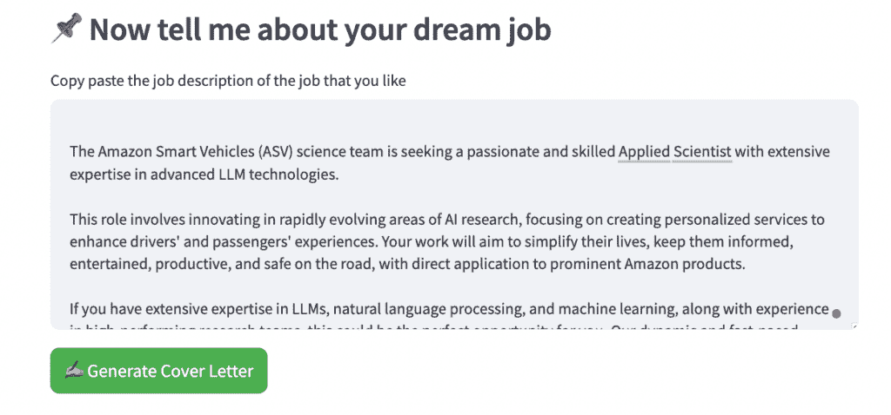
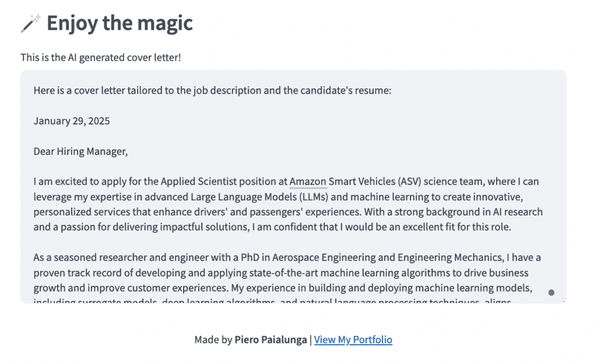
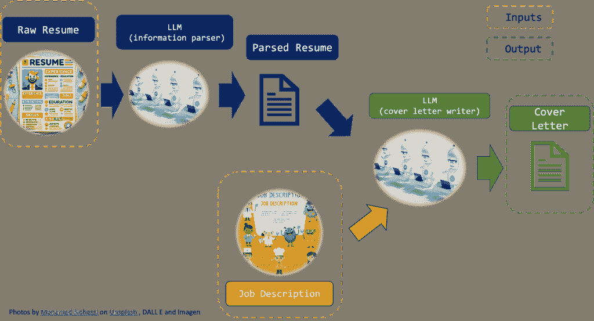

# 使用 AI 和 LLM 从简历到求职信，利用 Python 和 Streamlit

> 原文：[`towardsdatascience.com/from-resume-to-cover-letter-using-ai-and-llm-with-python-and-streamlit/`](https://towardsdatascience.com/from-resume-to-cover-letter-using-ai-and-llm-with-python-and-streamlit/)
> 
> **免责声明**：使用 AI 制作求职信或简历的想法显然不是从我这里开始的。**很多人之前已经做过这个，并且非常成功**，他们从这一想法中建立了网站甚至公司。这只是一个**教程**，教你如何使用 Python 和几行代码构建自己的求职信 AI 生成器应用程序。你将在本博客文章中提到的所有代码都可以在我的公共[GitHub 文件夹](https://github.com/PieroPaialungaAI/CoverLetterAI/tree/main)中找到。祝您享受。 🙂

比尔·盖茨是一位（非常成功）的曼城**足球**教练。在巴塞罗那的莱昂内尔·梅西时代，他发明了一种足球打法，称为“**控球战术**”。这意味着一旦你接到球，你就立即传球，甚至不控制球。你可以在进球前传球 30-40 次。

十多年后，我们可以看到让瓜迪奥拉和他的巴塞罗那队成名的足球打法已经消失了。如果你看曼城的比赛，他们会拿球并立即寻找前锋或边锋。你只需要几脚垂直传球，立即寻找机会。这更加可预测，但你做得如此频繁，最终你会找到射门得分的空间。

我认为**就业市场**也以某种方式走向了同一方向。

在你有机会去公司，提交简历，与他们交谈，在他们周围，安排面试，并积极与人交谈之前。你会花几周时间准备这次旅行，润色你的简历，并复习问题和答案。

对于许多人来说，这种老式的策略仍然有效，**我** **相信**这一点。如果你有一个好的社交机会，或者正确的时间和地点，递交简历的事情会非常顺利。我们喜欢人与人之间的联系，实际上**认识**某人是非常有效的。

需要考虑的是，还有一种完全不同的方法。像**LinkedIn**、**Indeed**这样的公司，甚至整个**互联网**都彻底改变了游戏规则。你可以向许多公司发送许多简历，并从统计数据中找到一份工作。**AI 正在进一步改变这个游戏**。有许多 AI 工具可以帮助你为特定公司定制简历，使你的简历更加引人注目，或者构建**针对特定工作的求职信**。确实有许多**公司**向寻找工作的人提供这类服务。

现在，请相信我，我对这些公司没有任何意见，但它们使用的 AI 并非真正的“***它们的 AI***”。我的意思是，如果你使用 ChatGPT、Gemini 或最新的 DeepSeek 来完成确切的任务，你很可能**不会**得到比你在它们网站上使用的（付费）工具更差的响应。你实际上是在为拥有一个后端 API 而付费，这个 API 做的事情是我们通过 ChatGPT 必须做的。这是公平的。

尽管如此，我想向你展示，使用**大型语言模型**制作自己的“简历助手”确实非常简单且便宜。特别是，我想专注于**求职信**。**你给我你的简历和职位描述，我给你你的求职信，你可以复制粘贴到 LinkedIn、Indeed 或你的电子邮件**。

在一张图片中，它看起来像这样：



现在，大型语言模型（LLM）是专门用于生成文本的 AI 模型。更具体地说，它们是**巨大的**机器学习模型（即使是小的模型也非常大）。

这意味着自己构建 LLM 或从头开始训练一个 LLM 非常，非常昂贵。我们不会做这样的事情。我们将使用一个完全工作的 LLM，并巧妙地指导它执行我们的任务。更具体地说，我们将使用 **Python** 和一些 API 来做这件事。正式来说，这是一个付费 API。尽管如此，自从我开始整个项目（包括所有试错过程）以来，我只花了 ***不到 30 美分***。你可能会花 **4** 或 **5 美分**。

此外，我们还将制作一个可工作的 **Web 应用程序**，让你只需几点击就能拥有你的求职信。这将是一个包含几百行代码（包括空格）的努力。

为了激励你，这里有一些最终应用程序的截图：



很酷吧？我从头开始构建整个东西只花了不到 5 个小时。相信我：***这真的很简单***。在这篇博客文章中，我们将按以下顺序描述：

1.  **LLM API 策略**。这部分将帮助读者了解我们正在使用哪些 LLM 代理以及我们如何将它们连接起来。

1.  **LLM 对象**。这是使用 **Python** 实现上述 LLM API 策略的实现。

1.  **Web 应用程序和结果**。然后，使用 **Streamlit** 将 LLM 对象转移到 Web 应用程序中。我会向你展示如何访问它和一些结果。

我会尽量具体，以便你拥有自己制作所需的所有内容，但如果这部分内容过于技术性，你可以自由地跳到第三部分，尽情享受日落🙃。

让我们开始吧！

### 1. LLM API 策略

这是这个项目的机器学习系统设计部分，我将其保持得非常简洁，因为我希望最大化整个方法的可读性（而且说实话，它不需要比那样更复杂）。

我们将使用两个 API：

1.  **一个文档解析 LLM API**将读取简历并提取所有有意义的信息**。**这些信息将被放入一个.json 文件中，以便在生产中，我们可以在我们的内存中的某个地方存储已经处理并存储好的简历。

1.  **一个封面信 LLM API**。这个 API 将读取解析后的简历（前一个 API 的输出）和**职位描述**，然后输出封面信。



两个主要点：

1.  **这个任务最好的 LLM 是什么？**对于文本提取和摘要，已知**LLama**（https://medium.com/@ankit941208/generating-summaries-for-large-documents-with-llama2-using-hugging-face-and-langchain-f7de567339d2）或**Gemma**（https://ai.google.dev/gemma）是相对便宜且高效的 LLM。由于我们打算使用 LLama 进行摘要任务，为了保持一致性，我们也可以将其用于其他 API。如果你想使用其他模型，请随意。

1.  **我们如何连接 API**？你可以用很多种方式来做这件事。我决定尝试使用[**Llama API**](https://www.llama-api.com/)。文档并不十分详尽，但它工作得很好，并允许你尝试许多模型。你需要登录，购买一些信用（1 美元对这个任务来说已经足够了），并保存你的 API 密钥。如果你觉得其他解决方案（如[Hugging Face](https://huggingface.co/meta-llama/Llama-3.3-70B-Instruct)或[Langchain](https://www.langchain.com/))更适合，请随意切换。

好的，现在我们已经知道了**要做什么**，我们只需要实际在 Python 中实现它。

### 2. LLM 对象

我们首先需要的是实际的**LLM**提示。在 API 中，提示通常使用字典传递。由于它们可能相当长，并且结构总是相似的，因此将它们存储在**.json 文件**中是有意义的。我们将读取 JSON 文件，并将它们用作 API 调用的输入。

#### 2.1 LLM 提示

在这个.json 文件中，你将会有**模型**（你可以称它为你喜欢的任何名称）和**内容**，这是 LLM 的指令。当然，内容键有一个静态部分，即“指令”，以及一个“动态”部分，即 API 调用的具体输入。例如：这是第一个 API 的.json 文件，我将其命名为***resume_parser_api.json***：

如您从“内容”中看到的，有一个静态调用：

> “你是一个简历解析器。你将从这份简历中提取信息，并将它们放入一个.json 文件中。你的字典键将是 first_name、last_name、location、work_experience、school_experience、skills。在选择信息时，注意最具有洞察力的。”

我想要从我的“.json”文件中提取的键是：

```py
[first_name, last_name, location, work_experience, school_experience, skills]
```

随意添加任何你想要从简历中“提取”的更多信息，但请记住，这些信息只应该对求职信有影响。具体的简历将在文本之后添加，以形成完整的调用/指令。稍后会有更多关于这个的说明。

指令的顺序是***cover_letter_api.json***：

现在指令是这样的：

> “你是求职和求职信写作的专家。给定一个简历 json 文件、工作描述和日期，为这位候选人写一封求职信。要有说服力，要专业。简历 JSON：{resume_json}；工作描述：{job_description}，日期：{date}”

如你所见，有三个占位符：“**Resume_json**”，“**job_description**”和“**date**”。和之前一样，这些占位符将被正确信息替换，以形成完整的提示。

#### 2.2 constants.py

我创建了一个非常小的***constants.py***文件，其中包含两个.json 提示文件的路径以及你必须从 LLamaApi（或实际上你使用的任何 API）生成的 API。如果你想在本地上运行文件，请修改此文件。

#### 2.3 file_loader.py

这个文件是简历的“加载器”集合。虽然无聊但很重要。

#### 2.4 cover_letter.py

LLM 策略的整个实现都可以在这个我称之为**CoverLetterAI**的对象中找到。就在这里：

我花了很多时间试图使一切模块化并易于阅读。我还为所有函数添加了很多注释，这样你可以清楚地看到每个函数的作用。**我们如何使用这个怪物**？

所以整个代码只运行了 5 行。就像这样：

```py
from cover_letter import CoverLetterAI<br>cover_letter_AI = CoverLetterAI()<br>cover_letter_AI.read_candidate_data('path_to_your_resume_file')<br>cover_letter_AI.profile_candidate()<br>cover_letter_AI.add_job_description('Insert job description')<br>cover_letter_AI.write_cover_letter()
```

所以按照顺序：

1.  你调用**CoverLetterAI**对象。它将是这场演出的明星

1.  你给我你的**简历**路径。可以是 PDF 或 Word 格式，我会阅读你的信息并将它们存储在一个变量中。

1.  你调用***profile_candidate()***，然后我运行我的第一个 LLM。这个过程处理候选人的单词信息，并创建我们将用于第二个 LLM 的.json 文件

1.  你给我**工作描述**，并将其添加到系统中。已存储。

1.  你调用***write_cover_letter()***，然后我运行我的第二个 LLM，根据工作描述和简历.json 文件生成求职信

### 3. 网络应用程序和结果

所以这就是全部内容。你已经在之前的段落中看到了这篇博客文章的所有技术细节。

为了更加花哨并展示它的工作原理，我还将其制作成了一个网络应用程序，你只需**上传你的简历**，**添加你的工作描述**，然后点击**生成求职信**。这是[链接](https://coverletterpieropaialunga.streamlit.app/)，这是[代码](https://github.com/PieroPaialungaAI/CoverLetterAI/blob/main/main.py)。

现在，生成的**求职信**非常好。

这是一个随机例子：

2025 年 2 月 1 日

> 招聘经理，
> 
> [我故意模糊的公司]
> 
> 我非常激动能够申请[我故意模糊的公司名称]的杰出人工智能工程师职位，在那里我可以利用我对构建负责任和可扩展人工智能系统的热情，来革新银行业。作为一名经验丰富的机器学习工程师和研究员，我在物理学和工程学方面有着坚实的背景，我坚信我的技能和经验与这个职位的要求数值相符。
> 
> 我拥有辛辛那提大学航空航天工程和工程力学博士学位以及罗马托尔维加塔大学复杂系统物理和大数据硕士学位，我拥有独特的理论与实践知识结合。我在开发和部署人工智能模型、设计和实现机器学习算法以及处理大数据方面的经验，使我具备了推动人工智能工程创新的能力。
> 
> 作为辛辛那提大学的科研和教学助理，我应用代理模型来检测和分类管道裂缝，在损伤检测实验中实现了 14%的改进。我还开发了使用深度学习算法的代理模型来加速有限元方法（FEM）模拟，从而将计算时间减少了 1 百万倍。我在为对人工智能感兴趣的青少年教授信号处理和图像处理课程的经验，磨练了我有效传达复杂概念的能力。
> 
> 在我之前担任 Gen Nine, Inc.、Apex Microdevices 和 Accenture 的机器学习工程师角色中，我成功设计、开发和部署了人工智能解决方案，包括配置毫米波雷达和 Jetson 设备进行数据收集，实施最先进的点云算法，并领导 FastMRI 项目以加速 MRI 扫描时间。我在 Python、TensorFlow、PyTorch 和 MATLAB 等编程语言方面的专业知识，以及我在 AWS、Docker 和 Kubernetes 等云平台方面的经验，使我能够开发和部署可扩展的人工智能解决方案。
> 
> 我特别被[我故意模糊的公司名称]致力于创建负责任和可靠的 AI 系统所吸引，这些系统优先考虑客户体验和简单性。我对紧跟最新人工智能研究的热情以及我在生产中审慎应用新技术的能力与公司的愿景相吻合。我对有机会与一个跨职能团队——包括工程师、研究科学家和产品经理——合作，交付能够改变[我故意模糊的公司名称]服务客户方式的人工智能产品感到兴奋。
> 
> 除了我的技术技能和经验外，我还拥有出色的沟通和演示技巧，这在我在 Towards Data Science 的科技写作经验中得到了证明，在那里我撰写了关于机器学习和数据科学的全面文章，每月吸引了 50k+的观众。
> 
> 感谢您考虑我的申请。我渴望讨论我的技能和经验如何为[我故意模糊的公司]和[我故意模糊的公司]通过人工智能将人类和简单性带入银行业的使命做出贡献。我坚信，我对人工智能的热情、我的技术专长以及我协作的能力将使我成为您团队的有价值资产。
> 
> 诚挚地，
> 
> Piero Paialunga

它们看起来就像我会为特定的职位描述写的。话虽如此，在 2025 年，你需要小心，因为招聘经理**确实**知道你在使用 AI 来写它们，而且“计算机语气”很容易被发现（例如，“***渴望***”这样的词非常 ChatGPT 风格 lol）。因此，我想说，**要明智地使用这些工具**。当然，你可以用它们构建你的“***模板***”，但一定要加入你个人的风格，否则你的求职信将与其他数千封求职信一样，其他申请人也在发送。

> 这是构建网页[应用](https://github.com/PieroPaialungaAI/CoverLetterAI/blob/main/main.py)的代码。

### 4. 结论

在这篇文章中，我们发现了如何使用 LLM 将您的简历和职位描述转换为特定的**求职信**。以下是我们的观点：

1.  **人工智能在求职中的应用**。在第一章中，我们讨论了求职是如何被人工智能彻底革命的。

1.  **大型语言模型的想法**。明智地设计 LLM API 非常重要。我们在第二段中做到了这一点。

1.  **LLM API 实现**。我们使用 Python 有机且高效地实现了 LLM API。

1.  **网页应用**。我们使用 streamlit 构建了一个 Web App API 来展示这种方法的力量。

1.  **这种方法的优势**。我认为 AI 生成的求职信确实非常好。它们切中要点，专业且制作精良。尽管如此，如果每个人都开始使用 AI 来构建求职信，它们看起来都差不多，或者至少它们都有相同的语气，这并不好。有些事情需要思考。

### 5. 参考文献和其他出色的实现

我认为公正地提到许多在我之前就有这个想法并且已经公开并使任何人都可以使用这个想法的杰出人物是应该的。这些只是我在网上找到的一小部分。

[**求职信制作**](https://coverlettercraft.com/)由[**Balaji Kesavan**](https://balajikesavan.com/)开发的 Streamlit 应用，实现了使用 AI 制作求职信的非常类似的想法。我们与那个应用的不同之处在于，我们直接从 Word 或 PDF 中提取简历，而他的应用则需要复制粘贴。话虽如此，我认为这个人非常有才华，非常富有创意，我推荐您看看他的[作品集](https://balajikesavan.com/)。

[**兰迪·佩图斯**](https://medium.com/u/a55ed7fac031)也有一个[**类似的想法**](https://medium.com/better-programming/creating-an-ai-powered-cover-letter-generator-with-openai-ad224852f80a)。他方法和本教程中提出的方法的区别在于，他在信息上非常具体，会问一些像“当前招聘经理”和模型温度这样的问题。他思考求职信的方式非常有趣（而且聪明），你可以清楚地看到他是如何引导 AI 按照他喜欢的样子构建求职信的。强烈推荐。

[**胡安·埃斯特班·塞佩达**](https://github.com/Juanchobanano)在他的[**应用**](https://datapalooza-cover-letters.streamlit.app/)中也做得非常好。你也可以看出，他正在努力使它不仅仅是一个简单的 streamlit 插件，因为他添加了公司链接和用户的一堆评论。干得好，非常努力。 🙂

### 6. 关于我！

再次感谢您抽出宝贵时间。这对您意义重大 ❤

我的名字是皮埃罗·帕亚尔乌恩加，就是我这个人：


我是辛辛那提大学航空航天工程系的一名博士候选人，也是 Gen Nine 的机器学习工程师。我在博客文章和领英上谈论人工智能和机器学习。如果您喜欢这篇文章，并想了解更多关于机器学习的内容，以及跟随我的研究，您可以：

A. 请关注我的[**领英**](https://www.linkedin.com/in/pieropaialunga/)，我在那里发布所有我的故事

B. 订阅我的[**通讯**](https://piero-paialunga.medium.com/subscribe)。这将让您了解新故事，并有机会给我发信息，以获得您可能有的所有更正或疑问。

C. 成为[**推荐会员**](https://piero-paialunga.medium.com/membership)，这样您就不会有“每月故事数量上限”的限制，您可以阅读我（以及成千上万的机器学习和数据科学顶级作家）关于最新技术的任何文章。

D. 想和我一起工作吗？请查看我的收费和项目[**Upwork**](https://www.upwork.com/freelancers/~017f9a75d13c030610)！

如果您想向我提问或开始合作，请在这里或[**领英**](https://www.linkedin.com/in/pieropaialunga/)上留言：

***[[email protected]](/cdn-cgi/l/email-protection)***
