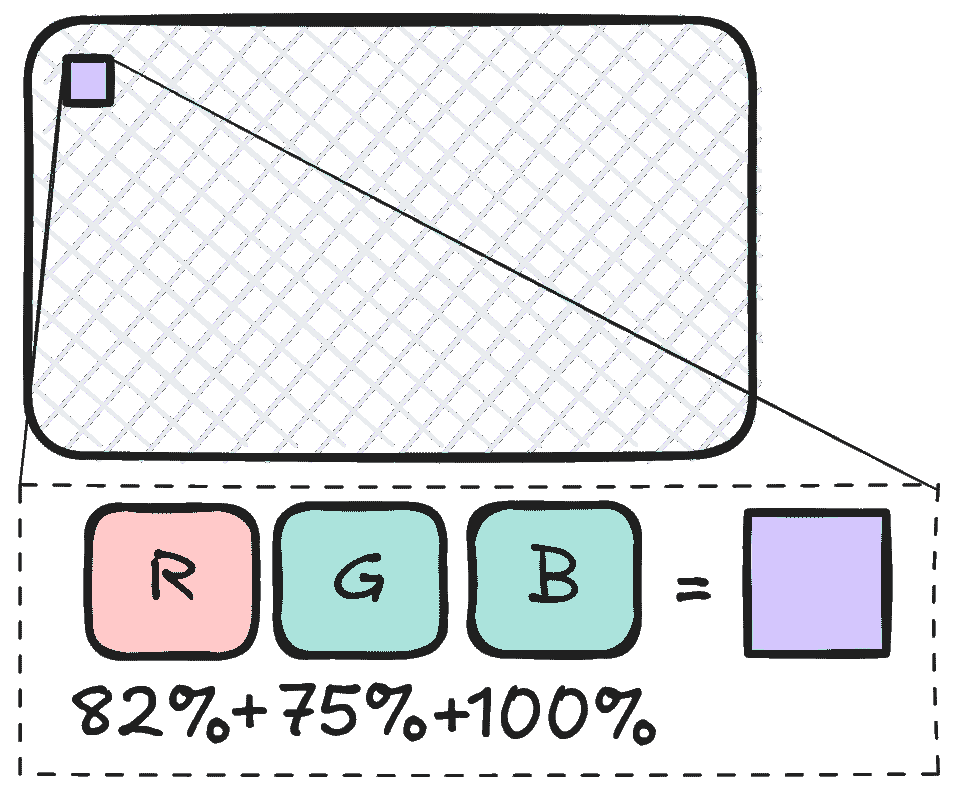
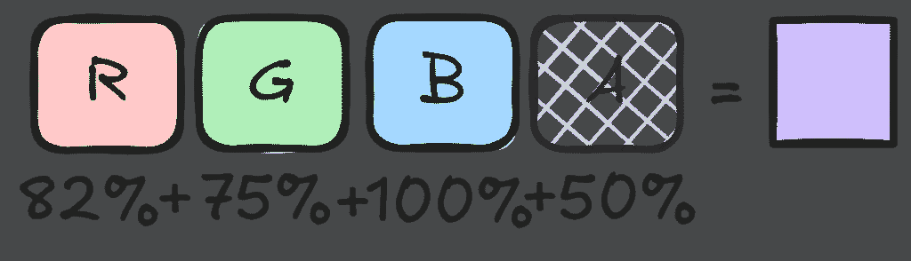
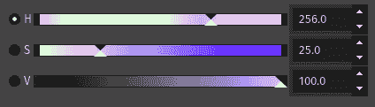
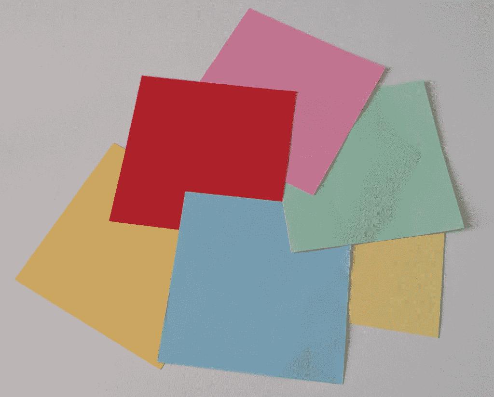
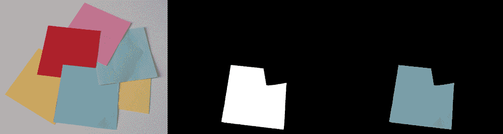
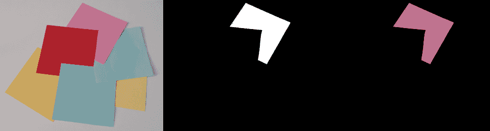
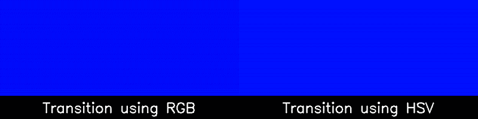

# 从 RGB 到 HSV — 以及返回

> 原文：[`towardsdatascience.com/from-rgb-to-hsv-and-back-again/`](https://towardsdatascience.com/from-rgb-to-hsv-and-back-again/)

## <mdspan datatext="el1746559529827" class="mdspan-comment">引言</mdspan>

**计算机视觉**中的一个基本概念是理解图像是如何存储和表示的。在磁盘上，图像文件以各种方式编码，从有损的、压缩的 *JPEG* 文件到无损的 *PNG* 文件。一旦你将图像加载到程序中并从相应的文件格式解码，它很可能具有类似数组的结构，代表图像中的像素。

## RGB

每个像素都包含关于图像中特定点的某些 **颜色信息**。现在最常见的方式来表示这种颜色是在 *RGB* 空间中，其中每个像素有三个值：红色、绿色和蓝色。这些值描述了每种颜色存在的量，并且它们将以加法方式混合。例如，所有值都设置为零的图像将是黑色。如果所有三个值都设置为 100%，则生成的图像将是白色。



有时这些颜色通道的顺序可能会交换。另一种常见的顺序是 *BGR*，因此顺序是反转的。这在 **OpenCV** 中很常见，并且在读取或显示图像时是默认顺序。

## 透明通道

图像也可以包含关于透明度的信息。在这种情况下，将存在一个额外的 alpha 通道（*RGBA*）。alpha 值表示每个像素的不透明度：alpha 为零表示像素完全透明，值为 100% 表示完全不透明的像素。



## HSV

现在 *RGB(A)* 并不是表示颜色的唯一方式。实际上，有许多不同的颜色模型可以表示颜色。其中最有用的模型之一是 *HSV* 模型。在这个模型中，每种颜色都由一个 **色调**、**饱和度** 和 **值** 属性来表示。色调描述了颜色的色调，不考虑亮度和饱和度。有时这在一个圆圈上表示，数值在 0 到 360 或 0 到 180 之间，或者简单地介于 0 到 100% 之间。重要的是，它是循环的，意味着数值会环绕。第二个属性，饱和度描述了颜色色调的 **强度**，因此饱和度为 0 会导致灰色。最后，值属性描述了颜色的亮度，因此亮度为 0% 总是黑色。



现在这个颜色模型在图像处理中非常有用，因为它允许我们将色调与饱和度和亮度分离，这在 *RGB* 中是直接无法做到的。例如，如果你想在两种颜色之间进行过渡并保持整个过渡过程中的亮度不变，使用 *RGB* 颜色模型将非常复杂，而在 *HSV* 模型中，这通过简单地插值色调就可以直接实现。

## 实际示例

我们将探讨三个使用 Python 和 OpenCV 处理这些颜色空间的方法示例。在第一个示例中，我们提取出图像中特定颜色的部分。在第二部分，我们创建了一个工具函数来在颜色空间之间转换颜色。最后，在第三个应用中，我们创建了一个具有恒定亮度和饱和度的颜色之间的连续动画。

### 1 – 颜色掩码

这一部分的目标是找到一个掩码，根据图像中颜色的色调来隔离颜色。在下面的图片中，有不同的彩色纸张碎片，我们希望将它们分开。



使用 OpenCV，我们可以加载图像并将其转换为 HSV 颜色空间。默认情况下，图像以*BGR*格式读取，因此我们需要在转换中使用标志`cv2.COLOR_BGR2HSV`：

```py
import cv2

img_bgr = cv2.imread("images/notes.png")
img_hsv = cv2.cvtColor(img_bgr, cv2.COLOR_BGR2HSV)
```

现在，在*HSV*图像上，我们可以使用`cv2.inRange`函数应用颜色过滤器，为每个属性（色调、饱和度、明度）指定一个下限和上限。经过一些实验，我得到了以下过滤器的值：

| **属性** | **下限** | **上限** |
| --- | --- | --- |
| **色调** | 90 | 110 |
| **饱和度** | 60 | 100 |
| **明度** | 150 | 200 |

```py
mask = cv2.inRange(
    src=img_hsv,
    lowerb=np.array([90, 60, 150]),
    upperb=np.array([110, 100, 200]),
)
```

此处的色调过滤器限制在 90 到 110 之间，对应于图像底部的浅蓝色纸张。我们还设置了一个饱和度和亮度的值范围，以获得一个相对准确的掩码。


为了展示结果，我们首先需要将单通道掩码转换回具有 3 个通道的*BGR*图像形状。此外，我们还可以将掩码应用到原始图像上并可视化结果。

```py
mask_bgr = cv2.cvtColor(mask, cv2.COLOR_GRAY2BGR)
img_bgr_masked = cv2.bitwise_and(img_bgr, img_bgr, mask=mask)

composite = cv2.hconcat([img_bgr, mask_bgr, img_bgr_masked])
cv2.imshow("Composite", composite)
```



通过改变色调范围，我们还可以隔离其他部分。例如，对于紫色纸张，我们可以指定以下范围：

| **属性** | **下限** | **上限** |
| --- | --- | --- |
| **色调** | 160 | 175 |
| **饱和度** | 80 | 110 |
| **明度** | 170 | 210 |



### 2 – 颜色转换

虽然 OpenCV 提供了一个方便的函数来在颜色空间之间转换完整图像，但它没有提供现成的解决方案来在颜色空间之间转换单个颜色。我们可以编写一个简单的包装器，创建一个包含输入颜色的 1×1 像素的小图像，使用集成的 OpenCV 函数将其转换为另一个颜色空间，并再次提取这个单像素的颜色。

```py
def convert_color_space(input: tuple[int, int, int], mode: int) -> tuple[int, int, int]:
    """
    Converts between color spaces

    Args:
        input: A tuple representing the color in any color space (e.g., RGB or HSV).
        mode: The conversion mode (e.g., cv2.COLOR_RGB2HSV or cv2.COLOR_HSV2RGB).

    Returns:
        A tuple representing the color in the target color space.
    """
    px_img_hsv = np.array([[input]], dtype=np.uint8)
    px_img_bgr = cv2.cvtColor(px_img_hsv, mode)
    b, g, r = px_img_bgr[0][0]
    return int(b), int(g), int(r)
```

现在，我们可以用任何颜色测试这个函数。我们可以验证，如果我们从 RGB -> HSV -> RGB 转换回原始格式，我们会得到相同的值。

```py
red_rgb = (200, 120, 0)

red_hsv = convert_color_space(red_rgb, cv2.COLOR_RGB2HSV)
red_bgr = convert_color_space(red_rgb, cv2.COLOR_RGB2BGR)
red_rgb_back = convert_color_space(red_hsv, cv2.COLOR_HSV2RGB)

print(f"{red_rgb=}") # (200, 120, 0)
print(f"{red_hsv=}") # (18, 255, 200)
print(f"{red_bgr=}") # (0, 120, 200)
print(f"{red_rgb_back=}") # (200, 120, 0)
```

### 3 – 连续颜色过渡

在这个第三个示例中，我们将创建两个颜色之间的过渡，其中亮度和饱和度进行恒定插值。这将与直接在初始和最终 RGB 值之间进行插值进行比较。

```py
def interpolate_color_rgb(
    start_rgb: tuple[int, int, int], end_rgb: tuple[int, int, int], t: float
) -> tuple[int, int, int]:
    """
    Interpolates between two colors in RGB color space.
    Args:
        start_rgb: The starting color in RGB format.
        end_rgb: The ending color in RGB format.
        t: A float between 0 and 1 representing the interpolation factor.
    Returns:
        The interpolated color in RGB format.
    """
    return (
        int(start_rgb[0] + (end_rgb[0] - start_rgb[0]) * t),
        int(start_rgb[1] + (end_rgb[1] - start_rgb[1]) * t),
        int(start_rgb[2] + (end_rgb[2] - start_rgb[2]) * t),
    )

def interpolate_color_hsv(
    start_rgb: tuple[int, int, int], end_rgb: tuple[int, int, int], t: float
) -> tuple[int, int, int]:
    """
    Interpolates between two colors in HSV color space.
    Args:
        start_rgb: The starting color in RGB format.
        end_rgb: The ending color in RGB format.
        t: A float between 0 and 1 representing the interpolation factor.
    Returns:
        The interpolated color in RGB format.
    """
    start_hsv = convert_color_space(start_rgb, cv2.COLOR_RGB2HSV)
    end_hsv = convert_color_space(end_rgb, cv2.COLOR_RGB2HSV)

    hue = int(start_hsv[0] + (end_hsv[0] - start_hsv[0]) * t)
    saturation = int(start_hsv[1] + (end_hsv[1] - start_hsv[1]) * t)
    value = int(start_hsv[2] + (end_hsv[2] - start_hsv[2]) * t)

    return convert_color_space((hue, saturation, value), cv2.COLOR_HSV2RGB) 
```

现在我们可以编写一个循环来比较这两种插值方法。为了创建图像，我们使用`np.full`方法将图像数组中所有像素填充为指定的颜色。使用`cv2.hconcat`我们可以将两个图像水平组合成一张图像。在我们显示它们之前，我们需要将其转换为 OpenCV 的 BGR 格式。

```py
def run_transition_loop(
    color_start_rgb: tuple[int, int, int],
    color_end_rgb: tuple[int, int, int],
    fps: int,
    time_duration_secs: float,
    image_size: tuple[int, int],
) -> None:
    """
    Runs the color transition loop.

    Args:
        color_start_rgb: The starting color in RGB format.
        color_end_rgb: The ending color in RGB format.
        time_steps: The number of time steps for the transition.
        time_duration_secs: The duration of the transition in seconds.
        image_size: The size of the images to be generated.
    """

    img_shape = (image_size[1], image_size[0], 3)
    num_steps = int(fps * time_duration_secs)

    for t in np.linspace(0, 1, num_steps):
        color_rgb_trans = interpolate_color_rgb(color_start_rgb, color_end_rgb, t)
        color_hue_trans = interpolate_color_hsv(color_start_rgb, color_end_rgb, t)

        img_rgb = np.full(shape=img_shape, fill_value=color_rgb_trans, dtype=np.uint8)
        img_hsv = np.full(shape=img_shape, fill_value=color_hue_trans, dtype=np.uint8)

        composite = cv2.hconcat((img_rgb, img_hsv))
        composite_bgr = cv2.cvtColor(composite, cv2.COLOR_RGB2BGR)

        cv2.imshow("Color Transition", composite_bgr)

        key = cv2.waitKey(1000 // fps) & 0xFF
        if key == ord("q"):
            break

    cv2.destroyAllWindows()
```

现在我们可以简单地调用这个函数，传入我们想要可视化的两种颜色。以下我可视化从*蓝色*到*黄色*的过渡。

```py
run_transition_loop(
    color_start_rgb=(0, 0, 255),  # Blue
    color_end_rgb=(255, 255, 0),  # Yellow
    fps=25,
    time_duration_secs=5,
    image_size=(512, 256),
)
```



差异相当显著。在右侧动画中，饱和度和亮度保持不变，但在直接在*RGB*空间进行插值的过渡中，它们发生了相当大的变化。

* * *

*为了获取更多实现细节，请查看 GitHub 仓库中的完整源代码：*

[`github.com/trflorian/auto-color-filter`](https://github.com/trflorian/auto-color-filter)

* * *

*本帖中的所有可视化都是由作者创建的。*
