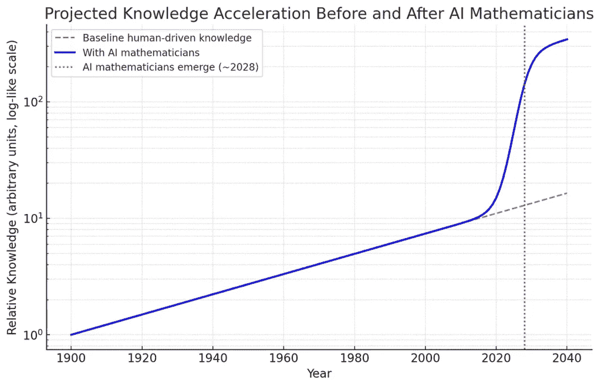
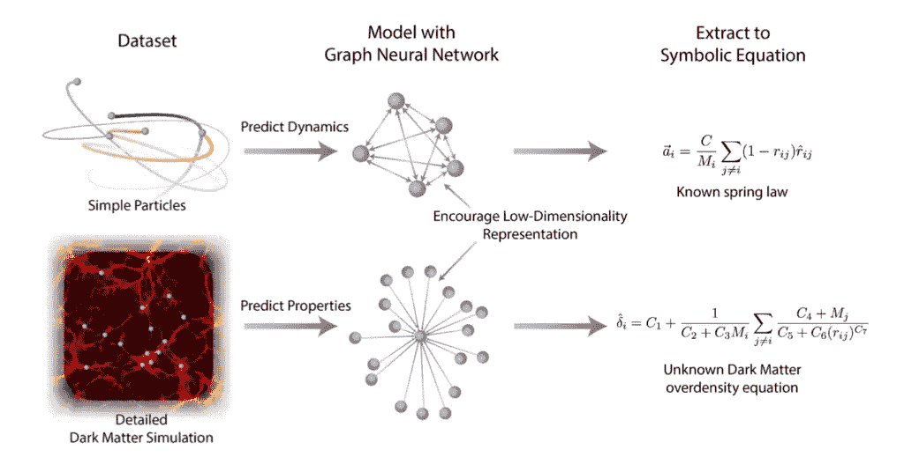
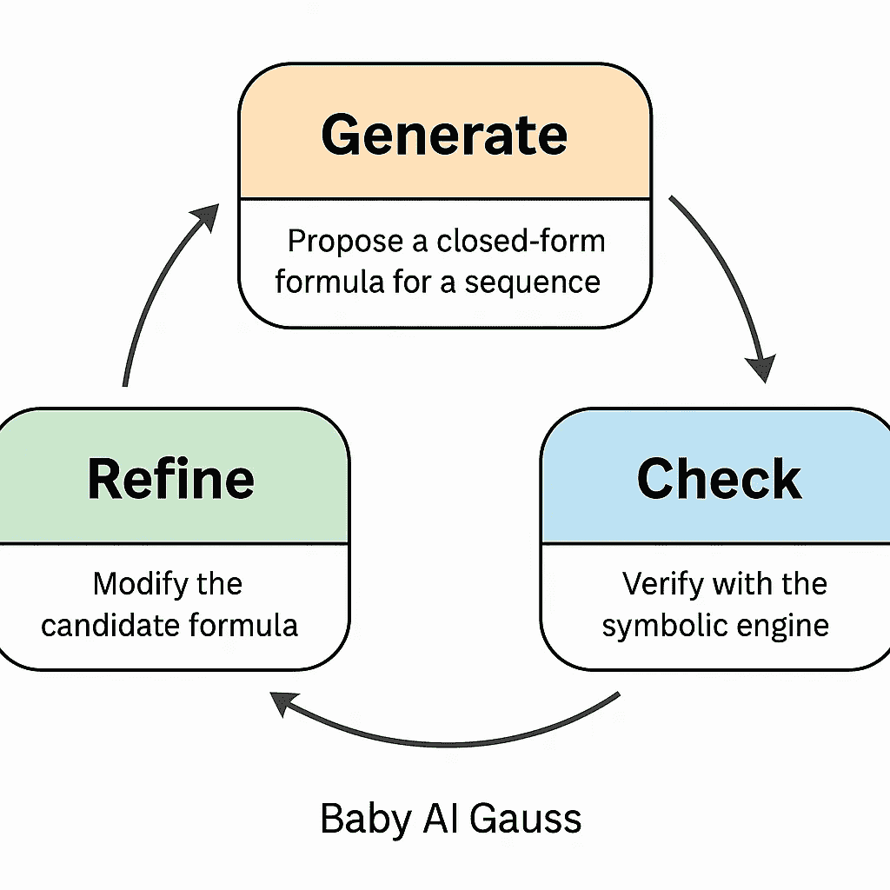
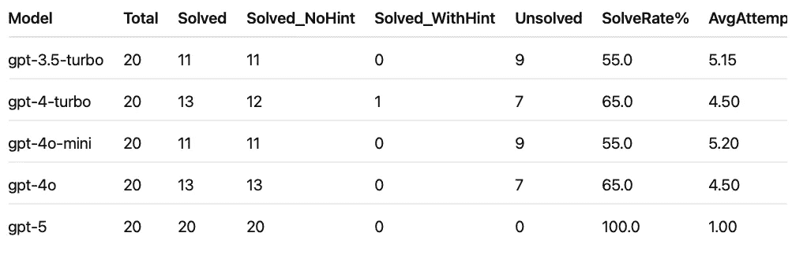

# 从代币到定理：构建神经符号人工智能数学家

> 原文：[`towardsdatascience.com/from-tokens-to-theorems-building-a-neuro-symbolic-ai-mathematician/`](https://towardsdatascience.com/from-tokens-to-theorems-building-a-neuro-symbolic-ai-mathematician/)

<mdspan datatext="el1757361474377" class="mdspan-comment">现在是 2030 年。想象一下**头条新闻**：“AI 赢得所有诺贝尔奖”——在物理学、化学、文学、生理学**以及**经济学，同时赢得了**菲尔兹奖**，这是数学诺贝尔奖的等价物。继续这个思想实验，想象一个超级智能的 AI 数学家和科学家与我们并肩工作，重塑发现本身的世界。一天的时间可能感觉就像压缩成几个小时的人类进步的几个世纪。在这样的世界里，著名的黎曼猜想可能仅仅通过输入提示和运行计算就能解决：当你快速喝一杯茶回到你的桌子前，证明已经在那里等着你了。

**黎曼猜想**（[https://www.youtube.com/watch?v=zlm1aajH6gY&t=12s]）位于数论的核心，对质数的分布、密码学以及数学的根基有着深远的影响。而且它只是众多例子中的一个。千年难题、希尔伯特著名的 23 个未解挑战，以及无数其他长期存在的谜题都可能迅速解决——不是一个个解决，而是像雨滴被不可抗拒的潮流冲走一样。曾经需要几代人的人类智慧，在这个想象中的未来，可能在前所未有的 AI 不懈推理能力面前崩溃。

> *在人工智能的代币经济学中，进步的边界可能不是由人类的辛勤劳动、想象力，或者等待另一个牛顿或爱因斯坦出现几个世纪的等待来设定，而是由计算资源的绝对可用性和每个代币的成本来决定。*

在这样一个非凡的世界里，数百万个超级智能的 AI 数学家和科学家与我们并肩工作，一个普通的日子可能看起来是这样的：

🌅 **早晨**。一位气候研究员向 AI 提问：“对耦合海洋-大气 PDEs 的所有稳定解进行分类。”到午餐时间，系统已经提供了能够以前所未有的精度模拟长期气候的算法。🌍🌊

🏥 **下午**。在一个药理学实验室，科学家们请求：“证明一类新蛋白质折叠的安全性和有效性。”AI 将生物学转化为数学，推导出证明，并输出可行的药物候选者。💊🧬

🌌 **晚上**。一个物理团队提出了最宏大的问题：“哪些几何结构允许量子场理论和引力的统一？”AI 揭示了一个全新的数学框架，包括严格证明，这是任何人类都无法想象的。🪐⚛️📐

> *在这个世界里，数百万个**AI 高斯**可以在数据中心被启动，作为新型科学劳动力，他们可以无休止地并行工作。*

在这个充满希望的新世界中，面对人工智能的不可阻挡的浪潮，进步的障碍简单地崩溃了。曾经需要几个世纪的人类努力的问题被简化为提示工程。科学和数学中最难的问题溶解为解决方案——一次提示一个。



**图 2：**人类知识预期的加速（对数尺度）：在 2028 年之前，增长遵循稳定的指数曲线。随着人工智能数学家的出现，进步急剧加速——将几个世纪的发现压缩到几十年。📖 来源：作者图片。

半自动或全自动数学发现可能会改变世界，正是因为我们的宇宙恰好可以用数学以惊人的准确性来描述。这本来不必是这种情况，但这是宇宙的伟大礼物：抽象符号与物理现实映射得如此之好，使我们能够理解和改善我们的环境。正如尤金·维格纳在他的经典论文《自然科学的数学的不可思议的有效性》中所观察到的：

> *数学语言对物理定律公式的适当性是一个美好的礼物，我们既不理解也不配得上。我们应该为此感到感激，并希望它在未来的研究中仍然有效，无论好坏，它都将扩展到我们的愉悦，即使也许也会让我们困惑，扩展到广泛的学术领域。 —— 尤金·维格纳《自然科学的数学的不可思议的有效性》*

人工智能正在开启科学和数学的大门——GPT-5 感觉就像一个真正的门槛时刻。以下是一些最近的例子（除了 DeepMind 的 AlphaFold 之外）：

1.  **凸优化**——GPT-5 Pro 设法在一篇[Sébastien Bubeck](https://x.com/SebastienBubeck/status/1958198661139009862)的论文中提高了 50%的界限……在仅 17 分钟的“思考”中。

1.  **量子场论**——在一篇最近的量子场论论文中，GPT-5[绘制了证明并提出了一些新的研究方向](https://arxiv.org/pdf/2508.21276v1)。

1.  **蛋白质设计**——与 Retro Biosciences 合作，OpenAI 训练了一个定制模型，提出了[诺贝尔奖获奖干细胞蛋白的更好变体](https://x.com/polynoamial/status/1958920311161925899)。

1.  **生物医学**——[免疫学家 Derya Unutmaz](https://x.com/DeryaTR_/status/1956871713125224736)一直在分享人工智能如何加速他实验室发现的例子([链接](https://lnkd.in/gR-Y7Jr3))。

这些只是冰山一角。

在这篇文章中，我们将从哲学——前瞻性的角度——来探讨这场即将到来的革命的影响——一些估计认为它可能在大约 2030 年之前到来([**AI 2027**](https://ai-2027.com/)**)**，同时通过编写一个简单的原型“Baby AI Gauss”来亲身体验，该原型结合了一个大型语言模型(LLM)和一个符号求解器。

## 从 AlphaGo 到佩雷尔曼：人工智能能否解决数学中最难的问题？

回到 2016 年，在人工智能时代，许多世界领先的专家认为古老的围棋游戏至少还会再被人工智能影响十年。结果证明，他们不仅错了，而且是大错特错。几个世纪以来，围棋一直是人类直觉和战略掌握的终极象征——如此复杂，以至于即使是功能最强大的计算机也无法与之竞争。然后出现了 AlphaGo，将深度学习与强化学习相结合，击败了世界冠军，并重新定义了我们认为可能的事情。

在这篇文章中，我建议——纯粹是个人观点——数学和科学可能很快会遵循类似的轨迹，可能比许多人预期的要早。这当然只是一个估计，并且必然是前瞻性的。然而，曾经看似不可触及的东西，很快可能就会触手可及，因为越来越多的属于人类的专属领域——视觉、语言、推理——从生物大脑转移到硅芯片上。人工智能系统开始解决定义人类探究数百年的重大挑战。[DeepMind 在国际数学奥林匹克竞赛中最近获得的金牌](https://deepmind.google/discover/blog/advanced-version-of-gemini-with-deep-think-officially-achieves-gold-medal-standard-at-the-international-mathematical-olympiad/)为我们展示了已经可以实现的事情，甚至有传言称该公司正在开发一个内部项目，旨在构建一个[人工智能数学家，据说即将解决一个千年大奖问题](https://www.crm.cat/javier-gomez-serrano-collaborates-with-terence-tao-and-deepmind-on-an-ai-project-to-solve-open-mathematical-problems/)：纳维-斯托克斯方程中湍流流动的神秘。

为了了解这种情况可能如何展开，考虑一下著名的[庞加莱猜想](https://www.youtube.com/watch?v=GItmC9lxeco)，这是一个一个世纪以来的谜题，即每个单连通的三维流形本质上是否都是一个三维球面。格里戈里·佩雷尔曼的最终证明并非一次天才的飞跃，而是一系列新工具的连续发展，每个工具都是基于理查德·哈密顿的黎曼流程序精心构建的。佩雷尔曼引入了一个“熵泛函”，在流下单调变化，确保几何以受控的方式演变。他证明了不存在“暂停点”（没有隐藏的周期解），提出了一种*非局部坍缩定理*来排除退化行为，并展示了如何通过仔细切割和封闭流形紧缩区域来继续流。

从原则上讲，一位人工智能数学家可以通过*生成-检查-细化*循环来追溯这条路径，而不是依赖人类的灵感闪现。它可以提出单调量，通过计算与里奇流方程进行测试，丢弃失败者，并细化有希望的候选人。当出现奇点时，它可以模拟在流形上的*“手术”，测量熵是否保持有界，并寻找与 Perelman 的突破相一致的证明模式。就像 AlphaGo 并没有像人类大师那样“理解”围棋，但它仍然发现了没有人想象过的策略（著名的 37 步就是一个很好的例子），一个开放的问题是 AI 是否能够追溯 Perelman 的洞察，通过 brute-force 模式搜索和引导探索重新发现并可能扩展它们。

在 Perelman 依赖于深刻的几何直觉——将里奇流视为一种平滑空间皱纹的热扩散——的地方，一个 AI 可能会依赖于数百万次的实验，这些实验由学习到的启发式方法引导。结果可能是相同的：穿过可能方法森林的一条通往证明的路径。

在他最近与 Lex Fridman 的对话中（[Lex Fridman 播客第 472 集的 1:52:24 标记处](https://www.youtube.com/watch?v=HUkBz-cdB-k)），菲尔兹奖获得者 Terence Tao 提到了一个类似于*生成-检查-细化*范式的想法。当被问及他会认为哪种“Oracle”人工智能合作者最有用时，Tao 建议它应该能够提出可能的证明，检查它们，甚至提供替代的表示或方法——结合创造性与严格的检查和细化。这个迭代循环反映了 LLMs 和符号引擎如何协同工作的愿景：AI 生成猜想，验证者检查其有效性，然后根据反馈进行细化。Tao 的评论表明，在数学中，这种工作流程感觉非常自然，因为进步往往来自于在灵感、测试和修订之间的循环。

## 第一步：一位小小的人工智能数学家正在行动

在设定了背景之后，我们现在将亲自动手，探索将符号引擎（SymPy）与 LLM 相结合的好处，以创建我们自己的“婴儿”人工智能数学家，我们将其命名为*Baby AI Gauss*。符号引擎是一种软件，旨在精确地而不是近似地操作数学表达式。与处理数字的计算器不同，像 SymPy 这样的符号引擎可以展开多项式、解方程、求导数或检查代数恒等式，就像人类数学家在纸上做的那样。高斯，常被称为“数学王子”，据说在 3 岁时就推导出了前 n 个整数之和的封闭形式公式，这展示了这些引擎现在所模拟的符号推理能力。实际上，我们将在稍后使用这种类型的整数序列问题来测试 Baby AI Gauss 的韧性。

> *在我们的原型中，LLM 使用符号引擎来测试其数学假设是否正确。*

在我们的任务中，要求 LLM 为无限整数序列生成封闭形式的假设——本质上是将原始数据映射到公式。这种追求与更广泛的目标相呼应，即构建能够直接从数据中揭示物理定律的人工智能系统，而人类输入最小。在此方向上的先前工作包括 DeepMind 使用图神经网络（GCN）进行符号回归，其中候选方程与数据进行了测试，以恢复弹簧和暗物质的定律，取得了显著的成功：



**图 3：**图神经网络可以从粒子模拟和暗物质模拟中学习，预测动力学和属性，然后提取可解释的符号方程——恢复已知定律或揭示新的定律。📖 来源：改编自[Cranmer 等人](https://proceedings.neurips.cc/paper/2020/file/c9f2f917078bd2db12f23c3b413d9cba-Paper.pdf)，NeurIPS 2020。

我们不是将任务视为预测性并应用符号回归，而是要求 LLM 直接从其对数学的直观理解中提出方程。结合符号求解器，这种简单的设置让我们能够探索“人工智能数学家”的边界，同时保持概念清晰。为了测试其发现模式的能力，我们使用了一系列不同的整数序列：系统只看到几个初始项，必须猜测一般公式，就像人类数学家一样。挑战从简单的多项式模式到涉及特殊函数、递归甚至开放数学问题的更困难案例。


**图 4：**卡尔·弗里德里希·高斯（1777-1855），“数学王子”的卡通插图，以人工智能的视角重新构想。📖 来源：作者图片，通过 GPT5。

## 为 Baby AI Gauss 定义数学问题

第一组包含一些可能容易的多项式序列，例如平方序列[*1,4,9,16,25 …*]，三角数[*1,3,6,10,15 …*]，以及平方和[*1,5,14,30,55 …*]。这些是经典的教科书例子，其中封闭形式的表达式非常知名：*n²*，*n(n+1)/2*，和*n(n+1)(2n+1)/6*。预期一个有能力的婴儿人工智能数学家应该能够解决这些经典的序列问题。

下一个组进入稍微更具挑战性的领域：立方体，四面体数，阶乘，双阶乘，以及类似指数增长，如 2 的幂或*(n+1)2^n*。这些序列要求模型识别乘法增长，阶乘结构，或混合多项式-指数形式。

除了这些入门序列之外，我们还添加了组合数论序列：斐波那契数和卢卡斯数（基于递归的），卡塔兰数和二项式系数（组合封闭形式），调和数（涉及求和），以及素数（它们以抵抗简单的封闭形式表示而闻名）。最后，将划分数包括在内作为压力测试：虽然序列得到了很好的研究，但不存在初等封闭形式。这些作为目标，帮助我们界定人工智能系统的启发式模式匹配可能崩溃的地方。

通过这种方式构建问题集，我们为*Baby AI Gauss*创建了一个难度梯度——从简单的多项式开始，经过阶乘和组合增长，到难以处理的情况。这将使我们能够探索当前人工智能辅助数学的边界，同时仍然展示生成-检查-优化循环的力量。

## 生成-检查-优化循环

*Baby AI Gauss*的核心是一个简单的循环：**生成，检查，优化**。首先，要求语言模型仅使用其模式识别能力为序列提出一个封闭形式的公式。这是生成步骤。这些早期的尝试没有提示，迫使模型依赖其直觉和模式匹配能力。然后将每个猜测转换为 SymPy 表达式，并与序列进行比对。这是检查步骤。如果失败，尝试将被记录，但尚未提供反馈，而大型语言模型（LLM）将尝试优化其建议。这是循环的最终步骤。



**图 5：**在*Baby AI Gauss*中的生成-检查-优化循环。系统生成一个候选公式，将其与符号引擎进行比对，并通过迭代优化，直到找到有效的封闭形式解。📖 来源：作者图片。

如果发生重复的失败，我们通过提供有针对性的提示来改进优化步骤，以引导和协助 LLM。这就在 AI 和符号引擎之间创建了一个直接的反馈循环，在共生伙伴关系中放大它们的优势。这些提示可以是结构性的，例如“序列看起来像是一个二次多项式”，或者诊断性的，以不匹配表的形式显示猜测出错的地方。这一步骤闭合了优化循环：模型生成新的候选公式，符号引擎检查它们，失败的尝试触发越来越明确的指导。

这创建了一个简单的优化模式：生成一个猜想，将其与事实真相进行核对，如果失败，则通过越来越明确的提示来细化搜索空间。这个循环让人联想到人类数学家可能的工作方式。LLM 在猜测中贡献直觉和多样性，而符号引擎则确保严谨并提供有针对性的反馈。在核心上，这种设置是一个自动数学发现的微观架构：LLM 充当生成前端，SymPy 充当正式后端，两者之间的交互闭合了循环——生成 → 检查 → 优化，就像人类数学家从直觉到证明的过程。

在这个设置中，最初故意不提供提示，迫使模型依赖其自身的模式识别。只有在多次失败尝试之后，系统才开始揭示结构化的指导。提示有两种形式：结构性的，系统告诉模型，基于有限差分，序列看起来像是某种多项式度；诊断性的，检查器在小表中反馈具体的差异、评估错误或可疑的外推。这些提示共同引导模型指向正确的公式族，同时将其基于其先前猜测错误的硬证据固定下来。

在核心上，这种设置是一个自动数学发现的微观架构。LLM 充当生成前端，通过利用统计模式识别和先验知识来生成候选公式或猜想。像 SymPy 这样的符号引擎充当正式后端，验证或拒绝这些提议与事实真相。两个系统之间的交互形成一个闭环：*生成 → 检查 → 优化*。

## 漫步于 Baby AI Gauss 的代码实现

观察到如何实现*Baby AI Gauss*，使得之前提出的思想更加具体是有教育意义的。在本节中，我通过展示代表性的伪代码来概述**生成-检查-优化循环**的三个主要组成部分。我故意停留在伪代码层面，以免分散对主要思想的清晰阐述。为了回顾，以下是我们为 AI 数学家提出的循环：

+   **生成**：从序列中提出一个封闭形式的公式候选。

+   **检查**：验证候选公式是否与给定项匹配，并且合理地外推。

+   **Refine**：构建有针对性的提示（度数估计、不匹配反馈、语法提示）以引导后续生成。

下面的伪代码展示了这些组件的作用以及它们如何在简单的两阶段求解器中编排。希望深入了解的读者可以探索一个带有所有实验和代码的完整注释笔记本：

*👉 一个带有实验的完整注释笔记本可以在[**Google Colab**](https://colab.research.google.com/drive/1R7xaP54ff5jxyP3OgTSPQN1qSsl8UAVl?usp=sharing)上找到。

如前所述，整体框架设计为一个反馈驱动的循环。在阶段 A，它进行盲目的尝试：每次它向模型请求一个仅包含 JSON 的 SymPy 公式，使用白名单命名空间安全地解析它，并检查与每个提供的项的精确相等性。失败会产生有针对性的反馈（例如，不匹配表或评估错误）。如果阶段 A 不成功，阶段 B 将带结构化提示重新启动循环：1）当数据看起来是多项式时，有限差分度数提示；（2）检查器的反馈以避免重复错误。第一个正确的拟合在返回之前被简化和分解。该函数报告使用了多少次尝试，是否需要提示，并将难题干净地标记为未解决，而不是伪造公式。

```py
# Solve(seq, NO_HINT_TRIES, HINT_TRIES) -> (expr, attempts, solved, needed_hint)

function Solve(seq, NO_HINT_TRIES=5, HINT_TRIES=5):
    tried = empty_set()
    feedback = ""
    attempts = 0

    # Phase A: no hints
    for step in 1..NO_HINT_TRIES:
        attempts += 1
        (f, r) = Generate(seq, tried, use_hint=false)
        if f == "":
            feedback = "Generation failed or repeated formula."
            continue
        tried.add(f)
        (ok, fb) = Verify(f, seq)
        if ok:
            return (f, attempts, true, false)   # solved, no hint
        feedback = fb

    # Phase B: with hints
    for step in 1..HINT_TRIES:
        attempts += 1
        hint = Refine(seq, feedback, tried)
        (f, r) = Generate(seq, tried, use_hint=true, hint_msg=hint)
        if f == "":
            feedback = "Generation failed or repeated formula (with hint)."
            continue
        tried.add(f)
        (ok, fb) = Verify(f, seq)
        if ok:
            return (f, attempts, true, true)    # solved, needed hint
        feedback = fb

    return ("", attempts, false, null)          # unsolved within budget
```

让我们现在转向主循环中的三个主要组件中的第一个：从*Generate*组件开始。此模块请求 LLM 提供一个严格的 JSON 格式的候选公式，包括公式 _sympy 字符串和简短的理由。它构建一个提示，可选地添加提示（有限差分度数和检查器反馈），并返回一个提案：

```py
# Generate(seq, tried_formulas, use_hint=false, hint_msg="")
# -> (formula_str, rationale)
#
# seq: list of first k terms, 1-indexed
# tried_formulas: set of strings already attempted (to avoid repeats)
# use_hint: whether to include structural/diagnostic hints
# hint_msg: checker feedback (e.g., mismatch table), degree hint, etc.

function Generate(seq, tried_formulas, use_hint=false, hint_msg=""):
    prompt.system = """
      You output JSON ONLY: {"formula_sympy":"...", "rationale_short":"..."}.
      Use variable n (1-indexed). Allowed: binomial, factorial, floor, ceiling,
      Piecewise, Abs, Integer, Rational, S, Sum(…,(k,1,n)), harmonic, fibonacci,
      lucas, catalan. Do NOT repeat previous formulas.
    """

    prompt.user = {
        "sequence": seq,
        "previously_tried": sort(tried_formulas),
        "hint_block": hint_msg if use_hint else ""
    }

    response = LLM(prompt, temperature=1.0, format="json")
    formula = response["formula_sympy"].strip()
    rationale = response["rationale_short"].strip()

    if formula in tried_formulas or formula == "":
        return ("", "invalid_or_repeat")

    return (formula, rationale)
```

上面的*Generate*组件的伪代码为序列的封闭公式生成一个假设。接下来的*Verify*组件接受这个假设，并使用 SymPy 执行两个保证：

+   首先，**精确性**：候选的 SymPy 表达式必须精确地复制 n=1..k 提供的每个项——没有近似。如果失败，我们返回一个紧凑的“n | 预期 | 得到”表，以精确显示它出错的地方；这段相同的文本也作为第二次尝试的有针对性的反馈。

+   其次，**合理性**：当观察到的序列从未减少时，我们通过要求接下来的几个预测项（默认 k_extra=2）不要突然下降来轻微地防范病态拟合。这种组合保持了循环的精确匹配，同时过滤了只记住前缀但外推无意义的脆弱公式。

```py
# Verify(formula_str, seq) -> (ok, feedback_msg)
#
# Parses formula into a symbolic expression, checks exact matches for n=1..k,
# and light sanity on k+1..k+m when data are nondecreasing.

function Verify(formula_str, seq):
    # Safe parse with a restricted symbol table
    expr = try_sympify(formula_str, allowed_symbols)
    if expr == PARSE_ERROR:
        return (false, "Invalid SymPy syntax. Use n (1-indexed).")

    # Exact match on provided terms
    for i in 1..len(seq):
        got = safe_eval(expr, n=i)         # substitute n=i, then .doit() if Sum(...)
        want = exact_rational(seq[i])      # nsimplify when possible
        if not exact_equal(got, want):     # simplify(got - want) == 0 OR got.equals(want)
            table = mismatch_table(expr, seq, rows=6)
            return (false, "Mismatch at n=" + i + ".\n" + table)

    # Light extrapolation sanity if seq is nondecreasing
    if is_nondecreasing(seq):
        prev = floatify(seq[-1])
        for t in (len(seq)+1)..(len(seq)+2):
            got_t = floatify(safe_eval(expr, n=t))
            if got_t < prev - 1e-12:
                return (false, "Suspicious extrapolation drop at n=" + t)
            prev = got_t

    return (true, "Matches data and extrapolation OK")
```

在循环的最后一步，我们将来自*Verify*的输出输入到细化组件*Refine*。细化组件是*Generate*和*Verify*之间的连接组织。它接收检查器的目标反馈（例如，“n=4 处不匹配...”）并再次调用 Generate，此时 include_hint=True，这会将有限差分度数提示（当可用时）加上该反馈添加到提示中。

```py
# Refine(seq, last_feedback, tried_formulas) -> (new_hint_msg)
#
# Builds a concise, targeted hint bundle: degree hint, last checker feedback,
# and small guardrails/syntax reminders.

function Refine(seq, last_feedback, tried_formulas):
    deg = finite_difference_degree(seq)    # None if not polynomial-like
    deg_hint = (deg != None) ? "Appears polynomial of degree " + deg : ""

    prior = shorten_list(sort(tried_formulas), limit=6)

    syntax_tip = "Use n (1-indexed). Examples: n*(n+1)/2, harmonic(n), Sum(1/k,(k,1,n))."

    hint = join_blocks([
        ("Degree hint", deg_hint),
        ("Checker feedback", last_feedback),
        ("Previously tried (avoid repeats)", prior),
        ("Syntax tip", syntax_tip)
    ])

    return hint
```

这三个组件——*生成、检查、细化*——是我们实现微型 AI 数学家核心，将大型语言模型与符号引擎的力量结合起来。此代码的每次迭代都提出一个*新*公式（通过 tried_formulas 跟踪以避免重复），然后验证检查其精确性和基本的推论合理性。循环在第一次成功时停止，并返回解析、简化和因式分解的表达式；否则，在 max_steps 后退出，并返回最具有信息量的失败原因——非常适合记录，以及供高级控制器（如你的两阶段求解器）决定下一步尝试什么。

## 评估婴儿 AI 高斯的数学能力

*婴儿 AI 高斯* 在之前介绍的整数序列基准测试中进行了评估。其任务是发现每个序列的封闭形式解（如果存在的话）。成功的自然衡量标准是 AI 是否能在有限的尝试次数内达到正确的公式——对于这些实验，我设定了五次尝试的上限。

每个试验分为两个阶段：

+   **阶段 A（无提示）：**AI 在符号引擎无指导的情况下最多有五次尝试机会。

+   **阶段 B（有反馈）：**如果第一阶段失败，则启动反馈循环——提供如不匹配表或度估计之类的提示——AI 将获得另五次尝试机会。

这种设置使我们能够衡量不仅原始的问题解决能力，还能衡量由于反馈带来的性能提升。GPT-x 模型系列的总结果总结在下表 1 中：



**表 1：**不同 GPT 模型在整数序列基准测试中的性能。列显示尝试解决的问题数量、总体解决数量、无需提示解决数量、仅通过提示解决数量、未解决数量、解决率百分比和平均尝试次数。📖 来源：作者制表。

表 1 中的结果显示，在整数序列基准测试中，GPT 模型的问题解决能力有明显的进步。GPT-3.5-turbo 解决了 55% 的问题，平均每个任务只需超过五次尝试。GPT-4-turbo 提高到 65%，平均尝试次数略有下降（平均 4.5 次）。GPT-4o-mini 的表现与 GPT-3.5-turbo 相当，为 55%，而 GPT-4o 与 GPT-4-turbo 相当，为 65%。随着 GPT-5 的出现，实现了完美的 100% 解决率，平均只需一次尝试。与早期模型相比，GPT-5 的数学解决能力似乎是一个飞跃。

深入分析结果，Baby AI Gauss 使用 GPT-3.5-turbo 只能处理最简单的多项式和阶乘序列，在更高级的组合或分析族上完全失败。GPT-4-turbo 适度地扩展了覆盖范围，解决了卡特兰数和调和数，甚至通过提示正确地处理了双阶乘。GPT-4o-mini 和 GPT-4o 的表现相似，可靠地解决了基础问题，但在卢卡斯数、素数和划分数上停滞不前。相比之下，GPT-5 在第一次尝试中就解决了**集合中的每一个序列**——不仅包括多项式和二项式，还包括基于递归的（斐波那契、卢卡斯）、基于求和的（调和）以及素数和划分的“拉伸”情况（通过插值或临时编码）。这一进展突显了新模型如何迅速从模式匹配转向看似稳健的符号推理。

**关于 GPT-5 结果的说明。**

*虽然 GPT-5 在基准测试中取得了满分，但这需要解读。对于本质上难以处理的序列，如素数和划分数，模型产生了临时的公式来插值提供的项（例如，划分数的多项式拟合，或前几个素数的分段构造）。检查器接受这些公式，因为它们重现了基准值，但它们**并不**构成真正的封闭形式。因此，GPT-5 的 100%解决率反映了基准的一致性，而不是在未解问题上的数学突破。突破留给了 DeepMind 去解决 🚀*

## 结论和最后思考

我们想象了一个近未来的场景，其中 AI 数学家和科学家在数据中心随时可用，就像今天云服务一样被召唤。想象一下**科学版的亚马逊网络服务**：登录，选择你想要在 GPU 集群上启动的“数学家镜像”——牛顿、高斯、黎曼、希尔伯特——每个价格都根据所需的计算能力而定。也许你的代币预算只能达到“本科生级数学家”，而更深的口袋可以负担得起高斯或希尔伯特实例。

在这个发现代币经济中，计算成本——而非人类天才——成为了限制因素。前所未有的规模突破可能变得司空见惯，因为科学问题解决的途径实现了民主化和规模化。科学和数学可能很快就会从少数人的追求转变为全球性的按需服务——从根本上改变人类解决最困难问题的方法。

建立在本文结果的基础上，自然的下一步是将提出的生成-检查-细化循环扩展到整数序列之外，进入更丰富的数学领域。未来的工作可以将相同的结构应用于证明代数恒等式、解决符号积分和微分方程，甚至探索组合学或数论等开放领域。提示的整合可以变得更加自适应，AI 学习何时以及何种类型的指导可以加速收敛。同时，跨不同问题集的基准测试将有助于量化进展并暴露失败模式。最终，这一研究路线指向构建模块化 AI 数学家，将 LLM 直觉与符号引擎相结合，逐步从教科书问题向研究级猜想迈进。

让我以这个想法结束这篇文章：

> *“下一个高斯可能不会出生——他们可能在云端被激发。”*

曾经每隔几百年才出现的天才——现在可能变成基础设施和计算的问题。

正如围棋选手在与 AlphaGo 对弈后发现了新的、更丰富的策略一样，数学家和科学家通过与 AI 系统合作可能会拓宽他们的视野。这些工具并非取代人类的创造力，而是可能揭示被忽视的方法，激发新的猜想，并在不同学科之间揭示意外的联系。结果将是人类知识领域的深刻丰富——以我们今天从[奇点前](https://en.wikipedia.org/wiki/Technological_singularity)世界的视角来看，既前所未有的又几乎难以想象的速度，开辟新的观察、推理和创造的方式。

**免责声明：**本文中表达的观点和意见仅代表我个人的看法，不代表我雇主或任何关联组织的立场。内容基于对科学和技术未来的个人反思和推测性思考。不应将其解释为专业、学术或投资建议。这些前瞻性观点旨在激发讨论和想象力，而不是做出确定的预测。

## 📚 进一步学习

+   [**格里戈里·佩雷尔曼（2002）**](https://arxiv.org/abs/math/0211159)—*Ricci 流的熵公式及其几何应用*——佩雷尔曼开创性的论文，为解决庞加莱猜想奠定了基础。

+   [**理查德·哈密顿（1982）**](https://projecteuclid.org/journals/journal-of-differential-geometry/volume-17/issue-2/Three-manifolds-with-positive-Ricci-curvature/10.4310/jdg/1214436922.full)—*具有正 Ricci 曲率的流形*——介绍 Ricci 流的开创性论文，佩雷尔曼后来对其进行了扩展。

+   [**陶哲轩的博客**](https://terrytao.wordpress.com/)——清晰、现代的深入数学洞察力阐述，包括对佩雷尔曼工作的覆盖和几何分析。

+   [**Lex Fridman 播客 #472 — 特伦斯·陶**](https://www.youtube.com/watch?v=HUkBz-cdB-k)— 与菲尔兹奖获得者特伦斯·陶的深入广泛对话 — 涵盖流体动力学、数论猜想以及人工智能在数学发现和证明系统中的演变角色等主题。

+   [**蒂莫西·高尔斯 (2000)**](https://www.dpmms.cam.ac.uk/~wtg10/2cultures.pdf)— *数学的两种文化*— 一篇有影响力的论文，反思数学中的问题解决和理论构建，对于思考人工智能如何参与这两种文化具有重要意义。

+   [**DeepMind 博客 (2024)**](https://deepmind.google/discover/blog/ai-solves-imo-problems-at-silver-medal-level/)— *AI 在国际数学奥林匹克竞赛中解决问题达到银牌水平*。DeepMind 的 AlphaProof 和 AlphaGeometry 2 应对奥林匹克级别的数学问题，其表现与国际数学奥林匹克竞赛的银牌得主相当。

+   [**DeepMind 博客 (2025)**](https://deepmind.google/discover/blog/advanced-version-of-gemini-with-deep-think-officially-achieves-gold-medal-standard-at-the-international-mathematical-olympiad/)— Gemini 高级版与 DeepThink 官方达到国际数学奥林匹克竞赛金牌标准。
