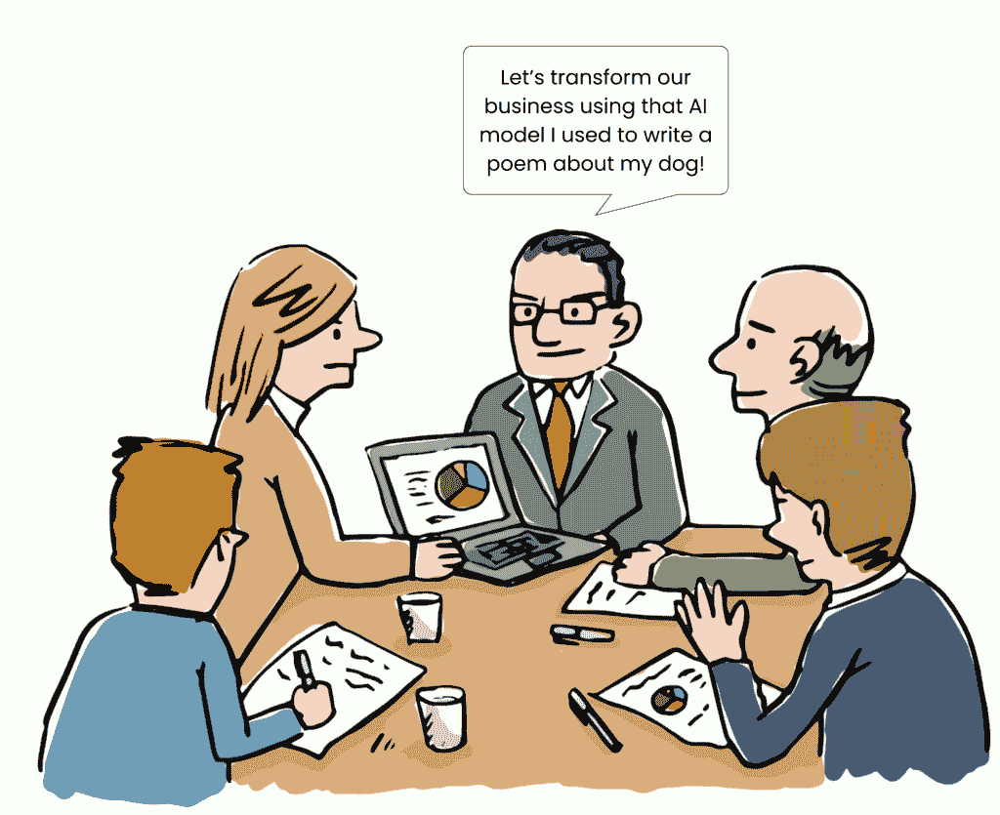
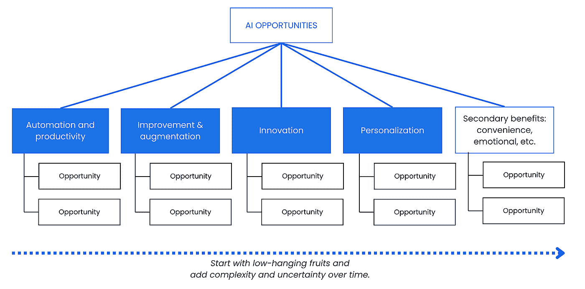
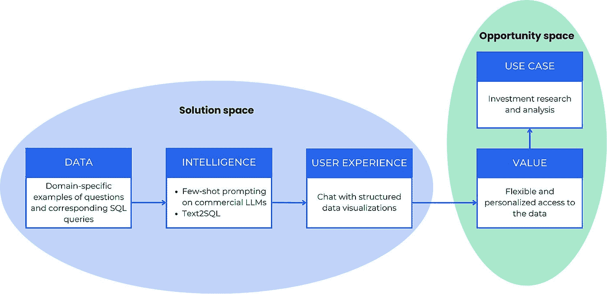
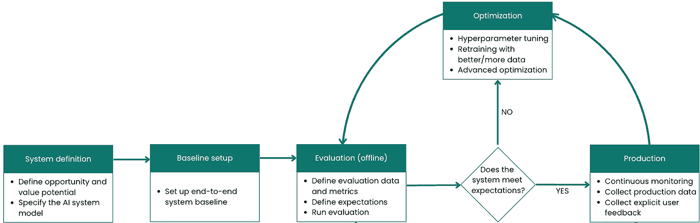
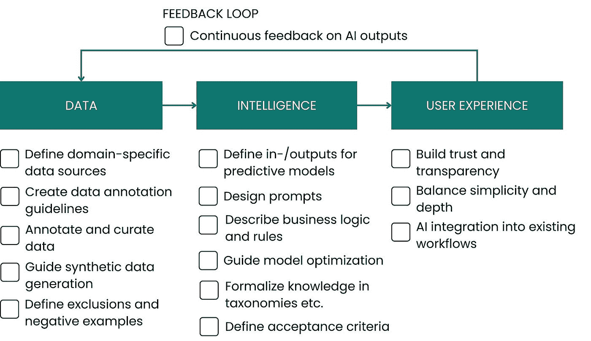

# 在 AI 中获得战略清晰度

> 原文：[`towardsdatascience.com/gaining-strategic-clarity-in-ai/`](https://towardsdatascience.com/gaining-strategic-clarity-in-ai/)

<mdspan datatext="el1748634416072" class="mdspan-comment">你是否曾经</mdspan>参加过一次 AI 战略会议，每个人都似乎在说不同的语言？工程师们深入到最新的 LLM 更新中，合规部门左一个右一个地提出红旗，而领导层希望有激进的创新。最终，没有任何东西被推进到生产成熟阶段。

图 1：一次 AI 会议偏离轨道（来源：freepik.com）

在目睹了类似情况多次之后，我开始开发一个结构化的 AI 方法论，以创建缺失的宏观图景和一致性。它体现在我的新书《AI 产品开发的艺术》（https://www.amazon.com/Art-AI-Product-Development-Delivering/dp/1633437051）中。在其核心，有一个心理模型网络，引导 AI 团队通过发现、开发和采用的整个生命周期。其中一些适用于任何 AI 项目，而其他一些则在面对特定挑战时非常有用。

在这篇文章中，我想给你这个方法的第一印象。我将分享四个关键的模型，这些模型帮助我们交付和整合了实际的 AI 系统。每个模型都包含其动机、实施指导和常见反模式：

+   [**AI 机会树**](https://www.ai-strategy-partners.com/knowledge-hub/mental-models/ai-opportunity-tree) — 发现并优先考虑与商业价值一致的 AI 用例。

+   [**AI 系统蓝图**](https://www.ai-strategy-partners.com/knowledge-hub/mental-models/ai-system-model) — 通过映射完整的 AI 系统来使技术和业务利益相关者保持一致。

+   [**迭代开发过程**](https://www.ai-strategy-partners.com/knowledge-hub/mental-models/iterative-development) — 通过快速启动和改进来构建从现实世界使用中学习的 AI 产品。

+   [**领域专业知识注入**](https://www.ai-strategy-partners.com/knowledge-hub/mental-models/domain-expertise-injection) — 将专家知识嵌入到您的系统中，使其感觉像一个专家，而不是局外人。

让我们深入探讨。

# [心理模型#1：AI 机会树](https://www.ai-strategy-partners.com/knowledge-hub/mental-models/ai-opportunity-tree)

许多 AI 项目都是从“让我们使用 AI”而不是“让我们解决问题 XY”开始的。这有多种原因——竞争压力、领导层的需求，或者对技术的兴奋。所有这些都可以是很好的起点，但你需要通过验证和调整你的 AI 解决方案的商业价值来跟进。如果你跳过这一步，它将脱离用户需求和业务成果。

[**AI 机会树**](https://www.ai-strategy-partners.com/knowledge-hub/mental-models/ai-opportunity-tree) 帮助团队在吸引人的技术和实际业务影响之间建立联系。

图 2：AI 机会树

## 它是如何工作的

树的每一分支都代表 AI 的核心好处：

+   **自动化和生产力**：AI 可以支持或自动化常规任务，如欺诈检测、客户服务或发票处理。它释放了人力并使新的工作流程成为可能。

+   **改进和增强**：AI 可以通过结合广泛的知识（例如，来自 LLM 的知识）与人类背景来提高结果。

+   **创新和转型**：在快速变化的世界中，AI 可以将不同的洞察力连接起来，产生新的想法，并支持适应性创新。

+   **个性化**：AI 能够提供定制体验，适应用户需求，这是 B2C 和 B2B 环境中的核心优势。

存在的次要好处，如便利性或情感价值，但也很少定义核心。

## 实施步骤

1.  **来源想法**：从用户、技术趋势和内部洞察中收集想法。

1.  **塑造它们**：使用[AI 系统蓝图](https://www.ai-strategy-partners.com/knowledge-hub/mental-models/ai-system-model)来绘制可行性。

1.  **评估和优先排序**：评估影响、技术适应性和与战略的一致性。

1.  **跟随学习曲线**：从简单到变革性的机会（通常意味着在树中从左到右前进）。

1.  **可视化并重新审视**：保持树更新并使所有利益相关者都能访问。

## 反模式

+   从“让我们使用 AI”而不是一个明确的问题（即“为了 AI 而 AI”）开始

+   首先解决抽象或过于复杂的问题

+   跳过用户验证

+   在没有路线图的情况下运行断开的 AI 项目

# [心理模型#2：AI 系统蓝图](https://www.ai-strategy-partners.com/knowledge-hub/mental-models/ai-system-model)

我记得在一家金融公司的一次启动会议。我们的目标是建立一个聊天机器人，让投资经理能够快速访问和分析财务数据，就像彭博社和公司一样。在研讨会之前，我要求每个团队成员勾勒出他们想象中的系统。结果显示了他们的不同观点：

+   工程师绘制了软件架构。

+   UX 映射用户流程。

+   数据科学家制定了管道。

+   合规性标记了护栏。

他们的问题也揭示了不匹配：

+   **工程师**：“我们将调用 LLM API 来处理用户问题并将它们转换为 SQL 查询。我们如何选择这个任务的最佳模型？”

+   **未来用户和 UX**：“速度很重要，但信任更重要。我们需要可靠的答案。当 AI 出错时会发生什么？”

+   **数据科学家**：“这取决于我们训练它的效果。我们需要对话记录来微调模型——但我们还没有。我们如何启动数据？”

+   **合规官**：“这是一个大问题。如果聊天机器人进入提供投资建议的领域，我们就处于危险之中。我们需要护栏。我们应该阻止主题、添加免责声明，还是强制总结而不是生成？”

即使是我的优先级也有所不同。考虑到用户可能会多么怀疑，我主要担心聊天机器人无法展现出足够的领域深度，听起来像是不经验丰富的实习生在与经验丰富的投资专业人士交谈。

由于必要性，我迅速绘制了一个简单的模型，以便让所有人达成共识：

图 3：AI 系统蓝图

在我有时间完善草图之前，它已经在领导层和投资者的会议上流传开来。它既简单易懂又信息丰富。所有利益相关者都可以自信地用它来解释、讨论和规划案例。[AI 系统蓝图](https://www.ai-strategy-partners.com/knowledge-hub/mental-models/ai-system-model) 因此诞生。

## 如何运作

蓝图将 AI 系统分为两个空间。机会空间定义了 AI 系统旨在实现的目标：

+   **用例** —— 系统解决的现实世界场景。

+   **价值** —— AI 系统为用户和业务创造的具体价值。

解决方案空间指定了如何通过 AI 实现机会：

+   **数据** —— 训练、评估和运行系统的“燃料”。

+   **智能** —— 模型、复合架构或其他 AI 组件。

+   **用户体验 (UX)** —— 向用户交付 AI 价值的渠道；可以是会话式、图形化、混合式等。

+   **治理** —— 来自监管、IT 安全和合规要求的约束。

所有组件都紧密相连，忽视任何一个都可能削弱整个系统。例如，当 AI 系统没有生成准确或专业的输出时，缺乏适当的数据会直接影响到价值组件。

## 实施步骤

1.  **定义系统目标：** 从你的 [AI 机会树](https://www.ai-strategy-partners.com/knowledge-hub/mental-models/ai-opportunity-tree) 开始。你的 AI 系统旨在支持哪些用户问题或业务成果？定义清晰的成功标准和影响目标。

1.  **探索和设计解决方案空间**：映射所有主要组件：数据源和管道、模型架构、用户体验接触点、基础设施需求等。为此，探索完整的 [AI 解决方案空间图](https://www.ai-strategy-partners.com/knowledge-hub/mental-models/ai-solution-space-map)。

1.  **协调利益相关者：** 将蓝图作为沟通工具。确保所有团队成员和其他利益相关者都理解所有组件。

1.  **在整个迭代过程中更新：** 你的 AI 系统是一个活生生的对象。随着你迭代和学习更多关于技术和用户的信息，更新蓝图以保持一致性。

> **实施提示**：打印出来，贴在墙上，并在每次规划会议上参考。

## 反模式

+   **以解决方案为先的思考** —— 不基于实际用例而过分关注模型或架构。

+   **技术追逐** —— 关注最新的 AI 趋势和模型，而不是一个稳固的 AI 架构。

+   **隔离设计** — 忽略数据、模型、UX 和治理之间的依赖关系和反馈循环。

# [心智模型 #3：迭代开发过程](https://www.ai-strategy-partners.com/knowledge-hub/mental-models/iterative-development)

通常，AI 项目从不确定性开始。你知道前方有路，但目的地和地形仍然不清楚。许多关键变量尚未到位：数据的质量、正确的评估方法，或者用户将带给系统的信任和 AI 熟练程度。尽管如此，这种冲动仍然存在，您需要开始行动。

尤其是在生成式 AI 的情况下，在第一次发布之前，您需要系好安全带，因为您不可避免地会遇到“数据偏移”。受控的评估数据和测试假设很少能反映现实世界用户行为的不可预测性。真正重要的见解不是来自内部测试，而是在您的系统进入市场后出现，解决用户的真实问题。

[**迭代开发过程**](https://www.ai-strategy-partners.com/knowledge-hub/mental-models/iterative-development)强调在早期发布基线系统后的迭代和优化阶段。

图 4：迭代开发过程

## 它是如何工作的

迭代开发过程包括以下核心阶段：

+   **系统定义** — 选择一个现实世界的机会（参照 AI 机会树）并指定 AI 系统蓝图

+   **基线设置** — 准备训练数据，选择初始模型，并设置基本工作架构。

+   **评估** — 定义评估方法、指标和验收标准。持续且透明地运行评估。

+   **优化** — 通过超参数调整、更好的数据、架构升级和架构特定的优化方法来改进系统。

+   **生产** — 监控系统性能，收集数据以进行微调和评估，并了解现实世界用户行为。

如果在评估时模型未达到预期，您将回退到优化阶段并再次调整。一旦模型表现稳定良好，您将进入生产阶段，在那里监控、数据收集和用户反馈将继续推动改进。

价值来自于短而快的循环。在我们的 3-9 个月 B2B 项目中，我们通常旨在几周内推出基线。迭代可以是几天到两周不等，每次迭代都会增加确定性并降低风险。

您可能会想：*但如果用户对过于原始的基线系统感到反感怎么办？*这是一个合理的担忧，关键在于尽早发布而不让用户感到疏远。您的系统应该通过提供价值将用户拉入循环，并且足够灵活，可以通过他们的反馈进行演变。如果您对 AI 发布艺术的未来一集感兴趣，请在评论中告诉我！

## 如何使用它

+   **预发布阶段**：定义成功标准并就迭代节奏达成一致。

+   **开发期间**：使用此模型来构建反馈和改进。

+   **发布后**：真正的学习从生产开始——从这里开始，重复清洗和重复。

## 反模式

+   长反馈循环

+   首次发布延迟

+   范围蔓延，每次迭代添加太多功能或优化

+   认为生产意味着你已经完成了

# [心理模型#4：领域专业知识注入](https://www.ai-strategy-partners.com/knowledge-hub/mental-models/domain-expertise-injection)

即使是大型数据集也不总是编码专家持有的隐性知识。这在复杂、细微的领域（如医疗保健、金融或可持续性）中尤其如此。AI 系统可能在外人看来很令人印象深刻，但让这些领域的专业人士感到困惑。

[**领域专业知识注入**](https://www.ai-strategy-partners.com/knowledge-hub/mental-models/domain-expertise-injection)确保您的系统表现得像一个精明的内部人士。

图 5：领域专业知识注入

## 它是如何工作的

该模型遵循[AI 系统蓝图](https://www.ai-strategy-partners.com/knowledge-hub/mental-models/ai-system-model)中的解决方案空间。对于每个组件，它展示了涉及领域专家并将他们的知识引入 AI 系统的不同方法：

+   **数据**：专家定义相关来源、边缘情况、注释指南和合成数据需求。

+   **智能**：他们共同设计提示，嵌入领域逻辑，并构建知识（分类法、知识图谱）。

+   **用户体验**：专家指导系统如何表达不确定性和融入实际工作流程。

这些方法以清单的形式提供。很可能你不会一次性实施所有这些方法，而是从 1-3 个能够带来最大效益而不压倒团队的注入路径开始。请注意，不同的方法适合不同的 AI 技能水平。有些可以在没有 AI 专业知识的情况下执行——例如，选择编码了特定领域知识的来源。其他，如提示工程，则需要 AI 流利度。

## 实施步骤

1.  **使用**[**AI 系统蓝图**](https://www.ai-strategy-partners.com/knowledge-hub/mental-models/ai-system-model)映射您的系统架构：展示您的系统如何处理数据、智能和用户体验——然后确定缺乏或错误表述专家洞察力的薄弱环节。

1.  **在每个层级嵌入专业知识**：使用清单选择数据、模型逻辑和用户界面层中的实用注入方法。

1.  **启用专家反馈循环**：建立轻量级渠道，让专家可以标记问题、提出改进建议，并在一段时间内纠正模型行为。

1.  **协作验证输出**：让领域专家参与塑造验收标准、审查边缘情况以及压力测试决策。

## 反模式

+   假设更多数据 = 更智能的 AI

+   隐藏专家逻辑所在之处（黑盒用户体验）

+   在未测试其效果的情况下硬编码规则

+   过度设计，使用诸如本体等复杂结构，而简单工具就足够了

+   一次咨询专家，然后将他们的输入冻结成静态规则

有关不同方法的详细描述和实际案例研究，请参阅这篇文章：[将领域专业知识注入您的 AI 系统](https://towardsdatascience.com/injecting-domain-expertise-into-your-ai-system-792febff48f0/).

这就是我们对心理模型集合的初步了解。如果您想了解更多：

+   查看我们的完整[**AI 战略手册**](https://www.ai-strategy-partners.com/knowledge-hub/mental-models).

+   阅读[*《AI 产品开发的艺术》*](https://www.amazon.com/Art-AI-Product-Development-Delivering/dp/1633437051)，以获取如何在特定技术场景中应用这些模型的详细指导。

+   请保持关注更新，因为我们很快将添加新的心理模型。
