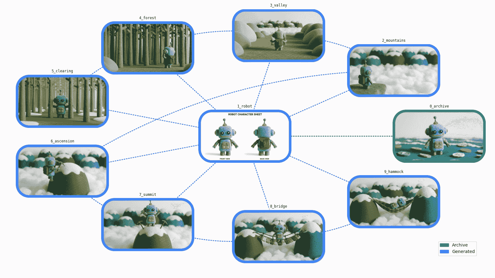
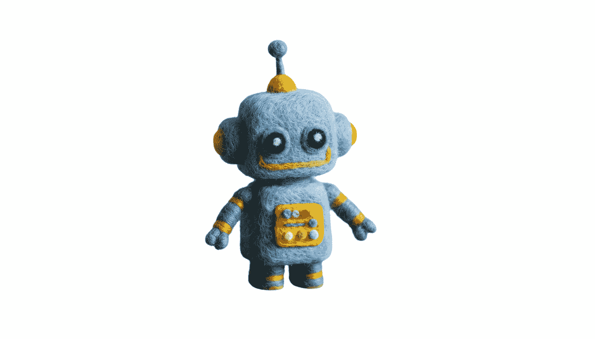
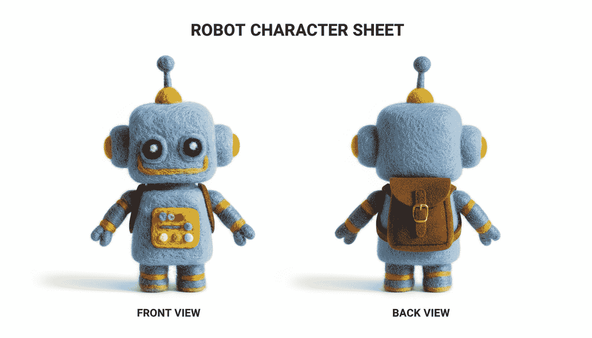
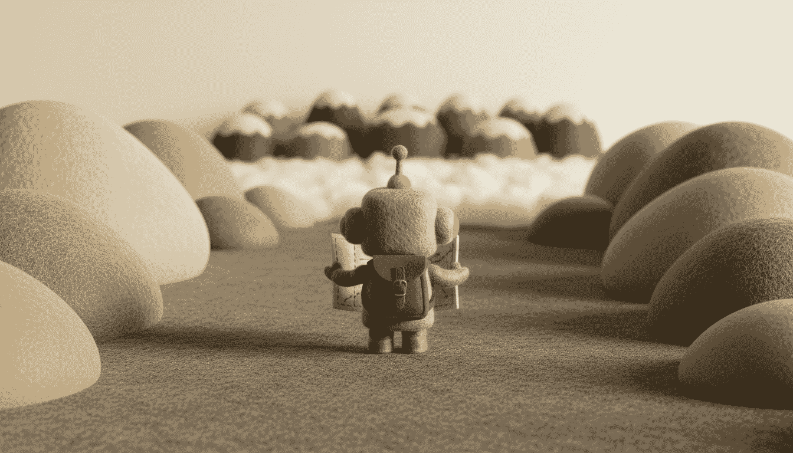
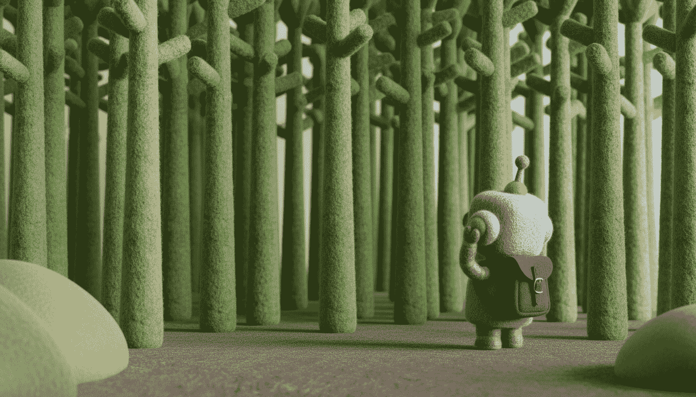
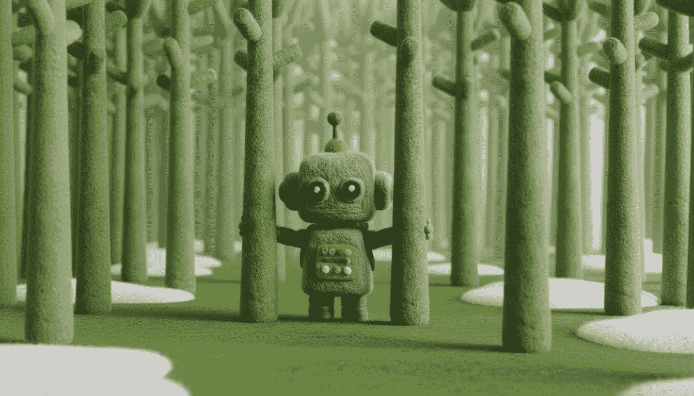
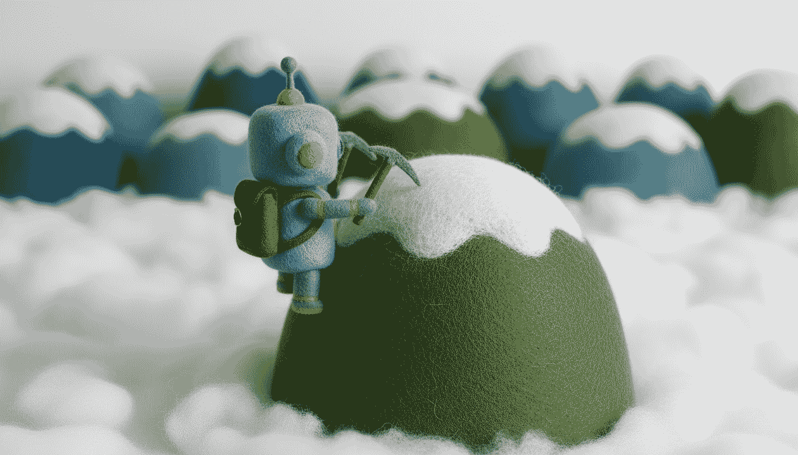
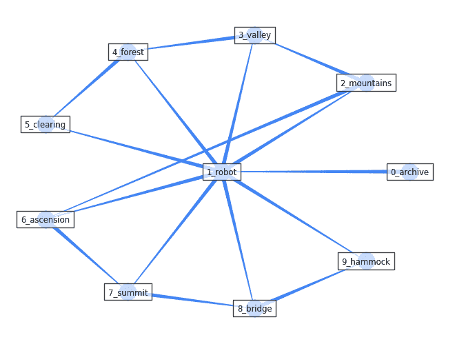
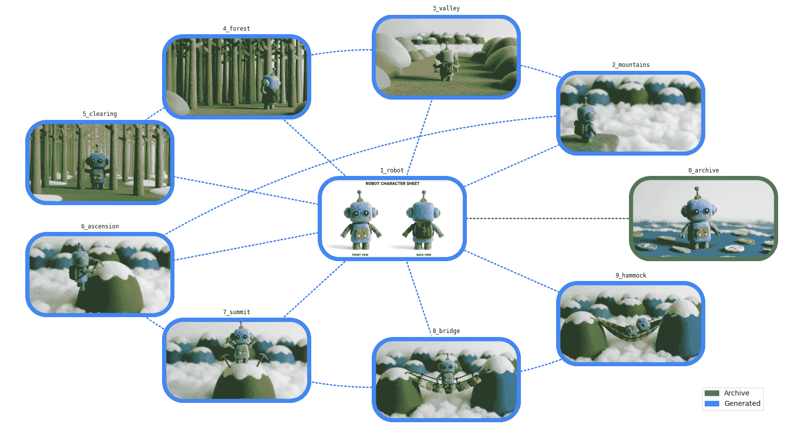

# 使用 Gemini 生成一致图像

> 原文：[`towardsdatascience.com/generating-consistent-imagery-with-gemini/`](https://towardsdatascience.com/generating-consistent-imagery-with-gemini/)



* * *

*<mdspan datatext="el1758663996151" class="mdspan-comment">在深入探讨之前的一些注意事项：*</mdspan>*

+   *我是 Google Cloud 的一名开发者。这里表达的思想和观点完全是我的个人观点。*

+   *本文的完整源代码，包括未来的更新，可在 Apache 2.0 许可证下在 [此笔记本](https://github.com/GoogleCloudPlatform/generative-ai/blob/main/gemini/use-cases/media-generation/consistent_imagery_generation.ipynb) 中找到。*

+   *本文中所有的新图像均使用 Gemini Nano Banana 和在此处探索的证明概念生成管道生成。*

+   *您可以在 [Google AI Studio](https://aistudio.google.com) 中免费尝试 Gemini。请注意，对 Nano Banana 的程序化 API 访问是一项按使用付费的服务。*

+   *2025–10–02：Nano Banana 已普遍可用于生产，并增加了对十个宽高比的支持。笔记本和文章已相应更新。*

* * *

## 🔥 挑战

我们都有一些现有的图像，可以在不同的环境中重复使用。这通常意味着修改图像，这是一个复杂（如果不是不可能）的任务，需要非常特定的技能和工具。这也解释了为什么我们的档案中充满了被遗忘或未使用的宝藏。最先进的视觉模型已经发展得如此之快，以至于我们可以重新考虑这个问题。

那么，我们能否为我们的视觉档案注入新的活力？

让我们按照以下步骤尝试完成这个挑战：

+   1️⃣ 从我们想要重复使用的存档图像开始

+   2️⃣ 提取一个角色以创建全新的参考图像

+   3️⃣ 使用提示和新的资产生成一系列图像，以展示角色的旅程

对于这个，我们将探索“Gemini 2.5 闪存镜像”，也称为“Nano Banana” 🍌 的功能。

* * *

## 🏁 设置

### 🐍 Python 包

我们将使用以下包：

+   `google-genai`：[Google Gen AI Python SDK](https://pypi.org/project/google-genai) 允许我们用几行代码调用 Gemini

+   `networkx` 用于图管理

我们还将使用以下依赖项：

+   `pillow` 和 `matplotlib` 用于数据可视化

+   `tenacity` 用于请求管理

```py
%pip install --quiet "google-genai>=1.40.0" "networkx[default]"
```

* * *

### 🤖 生成式 AI SDK

创建一个 `google.genai` 客户端：

```py
from google import genai

check_environment()

client = genai.Client()
```

检查您的配置：

```py
check_configuration(client)
```

```py
Using the Vertex AI API with project "…" in location "europe-west1"
```

* * *

## 🧠 Gemini 模型

对于这个挑战，我们将选择最新的 Gemini 2.5 闪存镜像模型：

`GEMINI_2_5_FLASH_IMAGE = "gemini-2.5-flash-image"`

> 💡 “Gemini 2.5 闪存镜像”也被称为“Nano Banana” 🍌

* * *

## 🛠️ 辅助工具

<details class="wp-block-details is-layout-flow wp-block-details-is-layout-flow"><summary>定义一些生成和显示图像的辅助函数：🔽</summary>

```py
import IPython.display
import tenacity
from google.genai.errors import ClientError
from google.genai.types import GenerateContentConfig, ImageConfig, PIL_Image

GEMINI_2_5_FLASH_IMAGE = "gemini-2.5-flash-image"

# You can add the "TEXT" modality for potential textual feedback (or in iterative chat mode)
RESPONSE_MODALITIES = ["IMAGE"]

# Supported aspect ratios: "1:1", "2:3", "3:2", "3:4", "4:3", "4:5", "5:4", "9:16", "16:9", and "21:9"
ASPECT_RATIO = "16:9"

GENERATION_CONFIG = GenerateContentConfig(
    response_modalities=RESPONSE_MODALITIES,
    image_config=ImageConfig(aspect_ratio=ASPECT_RATIO),
)

def generate_content(sources: list[PIL_Image], prompt: str) -> PIL_Image | None:
    prompt = prompt.strip()
    contents = [*sources, prompt] if sources else prompt

    response = None
    for attempt in get_retrier():
        with attempt:
            response = client.models.generate_content(
                model=GEMINI_2_5_FLASH_IMAGE,
                contents=contents,
                config=GENERATION_CONFIG,
            )

    if not response or not response.candidates:
        return None
    if not (content := response.candidates[0].content):
        return None
    if not (parts := content.parts):
        return None

    image: PIL_Image | None = None
    for part in parts:
        if part.text:
            display_markdown(part.text)
            continue
        assert (sdk_image := part.as_image())
        assert (image := sdk_image._pil_image)
        display_image(image)

    return image

def get_retrier() -> tenacity.Retrying:
    return tenacity.Retrying(
        stop=tenacity.stop_after_attempt(7),
        wait=tenacity.wait_incrementing(start=10, increment=1),
        retry=should_retry_request,
        reraise=True,
    )

def should_retry_request(retry_state: tenacity.RetryCallState) -> bool:
    if not retry_state.outcome:
        return False
    err = retry_state.outcome.exception()
    if not isinstance(err, ClientError):
        return False
    print(f"❌ ClientError {err.code}: {err.message}")

    retry = False
    match err.code:
        case 400 if err.message is not None and " try again " in err.message:
            # Workshop: Cloud Storage accessed for the first time (service agent provisioning)
            retry = True
        case 429:
            # Workshop: temporary project with 1 QPM quota
            retry = True
    print(f"🔄 Retry: {retry}")

    return retry

def display_markdown(markdown: str) -> None:
    IPython.display.display(IPython.display.Markdown(markdown))

def display_image(image: PIL_Image) -> None:
    IPython.display.display(image)
```</details>

* * *

## 🖼️ 资产

让我们定义我们角色旅程的资产以及管理它们的函数：

```py
import enum
from collections.abc import Sequence
from dataclasses import dataclass

class AssetId(enum.StrEnum):
    ARCHIVE = "0_archive"
    ROBOT = "1_robot"
    MOUNTAINS = "2_mountains"
    VALLEY = "3_valley"
    FOREST = "4_forest"
    CLEARING = "5_clearing"
    ASCENSION = "6_ascension"
    SUMMIT = "7_summit"
    BRIDGE = "8_bridge"
    HAMMOCK = "9_hammock"

@dataclass
class Asset:
    id: str
    source_ids: Sequence[str]
    prompt: str
    pil_image: PIL_Image

class Assets(dict[str, Asset]):
    def set_asset(self, asset: Asset) -> None:
        # Note: This replaces any existing asset (if needed, add guardrails to auto-save|keep all versions)
        self[asset.id] = asset

def generate_image(source_ids: Sequence[str], prompt: str, new_id: str = "") -> None:
    sources = [assets[source_id].pil_image for source_id in source_ids]
    prompt = prompt.strip()
    image = generate_content(sources, prompt)
    if image and new_id:
        assets.set_asset(Asset(new_id, source_ids, prompt, image))

assets = Assets()
```

* * *

### 📦 参考存档

<details class="wp-block-details is-layout-flow wp-block-details-is-layout-flow"><summary>我们现在可以获取我们的参考存档并将其作为我们的第一个资产：🔽</summary>

```py
import urllib.request

import PIL.Image

ARCHIVE_URL = "https://storage.googleapis.com/github-repo/generative-ai/gemini/use-cases/media-generation/consistent_imagery_generation/0_archive.png"

def load_archive() -> None:
    image = get_image_from_url(ARCHIVE_URL)
    assets.set_asset(Asset(AssetId.ARCHIVE, [], "", image))
    display_image(image)

def get_image_from_url(image_url: str) -> PIL_Image:
    with urllib.request.urlopen(image_url) as response:
        return PIL.Image.open(response)
```

```py
load_archive()
```


这张存档图像是在 2024 年 7 月使用 Imagen 3 的测试版生成的，提示为 *“在白色背景上，一个蓝色机器人的小型手工羊毛玩具。羊毛柔软舒适…”*。结果看起来非常好，但当时完全没有确定性，也没有一致性。因此，**这是一次很好的单次图像生成，但可爱的小机器人似乎永远消失了…**

* * *

### ⛏️ 资产提取

让我们尝试提取我们的小机器人：

```py
source_ids = [AssetId.ARCHIVE]
prompt = "Extract the robot in a clean cutout on a solid white fill."

generate_image(source_ids, prompt)
```



⚠️ 机器人提取得非常完美，但这本质上是一个很好的背景去除，许多模型都能做到。这个提示使用了图形软件中的术语，而我们现在可以用图像构图来推理。此外，尝试使用传统的二值掩码可能也不是一个好主意，因为物体的边缘和阴影传达了关于形状、纹理、位置和光照的许多重要细节。

让我们回到我们的存档中，进行一次高级提取，并直接生成一个角色表...

* * *

### 🪄 角色表

Gemini 具有空间理解能力，因此能够在保留视觉特征的同时提供不同的视角。让我们生成一个前后角色表，并且由于我们的小机器人将踏上旅程，同时添加一个背包：

```py
source_ids = [AssetId.ARCHIVE]
prompt = """
- Scene: Robot character sheet.
- Left: Front view of the extracted robot.
- Right: Back view of the extracted robot (seamless back).
- The robot wears a same small, brown-felt backpack, with a tiny polished-brass buckle and simple straps in both views. The backpack straps are visible in both views.
- Background: Pure white.
- Text: On the top, caption the image "ROBOT CHARACTER SHEET" and, on the bottom, caption the views "FRONT VIEW" and "BACK VIEW".
"""
new_id = AssetId.ROBOT

generate_image(source_ids, prompt, new_id)
```



💡 几点说明：

+   我们的任务提示关注场景的构图，这是媒体工作室中常见的做法。

+   依次生成的图像将保持一致，保留在提供的图像中可见的所有机器人特征。然而，由于我们只指定了背包的一些特征（例如，一个单排扣）并留下了其他未指定的部分，我们将得到略微不同的背包。

+   为了简单起见，我们直接将背包包含在角色表中。在实际的生产流程中，我们可能会将其作为单独的配件表的一部分。

+   为了控制背包的确切形状和设计，我们也可以使用一个真实背包的参考照片，并指示 Gemini 将“将背包转换成风格化的羊毛版本”。

+   Gemini 可以生成 `1024 × 1024` 的图像（`1:1` 比例）或等效分辨率（按令牌计）用于其他支持的宽高比（`2:3`、`3:2`、`3:4`、`4:3`、`4:5`、`5:4`、`9:16`、`16:9` 和 `21:9`）。

+   在请求配置中，我们指定了 `aspect_ratio="16:9"`，这会生成 `1344 × 768` 像素的图像。如果省略此参数，Gemini 将使用输入图像的宽高比（如果有多个提供，则是最后一个）来选择最接近的支持宽高比。

这个新资产现在可以成为我们未来图像生成中的设计参考。

* * *

### ✨ 第一幕

让我们从一幅山景开始：

```py
source_ids = [AssetId.ROBOT]
prompt = """
- Image 1: Robot character sheet.
- Scene: Macro photography of a beautifully crafted miniature diorama.
- Background: Soft-focus of a panoramic range of interspersed, dome-like felt mountains, in various shades of medium blue/green, with curvy white snowcaps, extending over the entire horizon.
- Foreground: In the bottom-left, the robot stands on the edge of a medium-gray felt cliff, viewed from a 3/4 back angle, looking out over a sea of clouds (made of white cotton).
- Lighting: Studio, clean and soft.
"""
new_id = AssetId.MOUNTAINS

generate_image(source_ids, prompt, new_id)
```


> 💡 山的形状被指定为“穹顶状”，这样我们的角色就可以站在山顶之一。

在这个第一幕上花些时间是重要的，因为，在连锁反应中，它将定义我们故事的整体外观。花些时间来完善提示或尝试几次以获得最佳变化。

从现在开始，我们的生成输入将包括角色表和参考场景…

* * *

### ✨ 连续场景

让我们把机器人放到山谷中：

```py
source_ids = [AssetId.ROBOT, AssetId.MOUNTAINS]
prompt = """
- Image 1: Robot character sheet.
- Image 2: Previous scene.
- The robot has descended from the cliff to a gray felt valley. It stands in the center, seen directly from the back. It is holding/reading a felt map with outstretched arms.
- Large smooth, round, felt rocks in various beige/gray shades are visible on the sides.
- Background: The distant mountain range. A thin layer of clouds obscures its base and the end of the valley.
- Lighting: Golden hour light, soft and diffused.
"""
new_id = AssetId.VALLEY

generate_image(source_ids, prompt, new_id)
```



💡 一些注意事项：

+   提供的关于输入图像的规格（`"Image 1:…"`，`"Image 2:…"`）很重要。没有它们，“机器人”可能指的是输入图像中的任何三个机器人（角色表中两个，前一个场景中一个）。有了它们，我们表明它是同一个机器人。如果出现混淆，我们可以用`"the [entity] from image [number]"`来更加具体。

+   另一方面，由于我们没有提供山谷的精确描述，连续的请求将给出不同、有趣和创造性的结果（我们可以选择我们最喜欢的，或者使提示更精确以获得更多的确定性）。

+   这里，我们也测试了不同的照明，这显著改变了整个场景。

然后，我们可以进入这个场景：

```py
source_ids = [AssetId.ROBOT, AssetId.VALLEY]
prompt = """
- Image 1: Robot character sheet.
- Image 2: Previous scene.
- The robot goes on and faces a dense, infinite forest of simple, giant, thin trees, that fills the entire background.
- The trees are made from various shades of light/medium/dark green felt.
- The robot is on the right, viewed from a 3/4 rear angle, no longer holding the map, with both hands clasped to its ears in despair.
- On the left & right bottom sides, rocks (similar to image 2) are partially visible.
"""
new_id = AssetId.FOREST

generate_image(source_ids, prompt, new_id)
```



💡 有趣的是：

+   我们可以定位角色，改变其视角，甚至“动画”其手臂以增加表现力。

+   “不再持有地图”的精确性阻止了模型以有意义的方式尝试保留前一个场景中的地图（例如，机器人把地图扔到了地板上）。

+   我们没有提供照明细节：光源、质量和方向都保留了前一个场景。

让我们穿过森林：

```py
source_ids = [AssetId.ROBOT, AssetId.FOREST]
prompt = """
- Image 1: Robot character sheet.
- Image 2: Previous scene.
- The robot goes through the dense forest and emerges into a clearing, pushing aside two tree trunks.
- The robot is in the center, now seen from the front view.
- The ground is made of green felt, with flat patches of white felt snow. Rocks are no longer visible.
"""
new_id = AssetId.CLEARING

generate_image(source_ids, prompt, new_id)
```



> 💡 我们改变了地面，但没有提供关于视图和森林的额外细节：模型通常会保留大部分树木。

现在山谷-森林序列已经结束，我们可以沿着原始的山景向上走，以那个环境为参考返回：

```py
source_ids = [AssetId.ROBOT, AssetId.MOUNTAINS]
prompt = """
- Image 1: Robot character sheet.
- Image 2: Previous scene.
- Close-up of the robot now climbing the peak of a medium-green mountain and reaching its summit.
- The mountain is right in the center, with the robot on its left slope, viewed from a 3/4 rear angle.
- The robot has both feet on the mountain and is using two felt ice axes (brown handles, gray heads), reaching the snowcap.
- Horizon: The distant mountain range.
"""
new_id = AssetId.ASCENSION

generate_image(source_ids, prompt, new_id)
```



> 💡 从模糊的背景中推断出的山景特写相当令人印象深刻。

让我们爬到山顶：

```py
source_ids = [AssetId.ROBOT, AssetId.ASCENSION]
prompt = """
- Image 1: Robot character sheet.
- Image 2: Previous scene.
- The robot reaches the top and stands on the summit, seen in the front view, in close-up.
- It is no longer holding the ice axes, which are planted upright in the snow on each side.
- It has both arms raised in sign of victory.
"""
new_id = AssetId.SUMMIT

generate_image(source_ids, prompt, new_id)
```


> 💡 这是一个逻辑上的后续，也是一个很好的、不同的视角。

现在，让我们尝试一些不同的东西，以显著重组场景：

```py
source_ids = [AssetId.ROBOT, AssetId.SUMMIT]
prompt = """
- Image 1: Robot character sheet.
- Image 2: Previous scene.
- Remove the ice axes.
- Move the center mountain to the left edge of the image and add a slightly taller medium-blue mountain to the right edge.
- Suspend a stylized felt bridge between the two mountains: Its deck is made of thick felt planks in various wood shades.
- Place the robot on the center of the bridge with one arm pointing toward the blue mountain.
- View: Close-up.
"""
new_id = AssetId.BRIDGE

generate_image(source_ids, prompt, new_id)
```


💡 有趣的是：

+   这个命令提示从动作的角度来构建场景。它有时比描述更容易。

+   按照指示添加了一座新山，它既不同又一致。

+   桥梁以非常合理的方式连接到山顶，似乎遵循物理定律。

+   “移除冰镐”的指令有它的原因。没有它，就好像我们在提示“尽可能使用前一个场景中的冰镐：把它们留在原地，不要让机器人离开时不带它们，或者做其他任何事情”，导致结果随机。

+   也有可能让机器人从侧面走过桥梁（这是我们之前从未生成过的），但让它从左到右一致地走是困难的。在角色表中添加左右视图应该可以解决这个问题。

让我们生成一个最终场景，让机器人得到应得的休息：

```py
source_ids = [AssetId.ROBOT, AssetId.BRIDGE]
prompt = """
- Image 1: Robot character sheet.
- Image 2: Previous scene.
- The robot is sleeping peacefully (both eyes changed into a "closed" state), in a comfortable brown-and-tan tartan hammock that has replaced the bridge.
"""
new_id = AssetId.HAMMOCK

generate_image(source_ids, prompt, new_id)
```


💡 有趣的是：

+   这次，提示是描述性的，并且与之前的命令提示一样有效。

+   桥-吊床变换非常好，并且保留了山顶上的连接。

+   机器人的变换也非常令人印象深刻，因为这个位置之前从未见过。

+   闭眼是最难保持一致性的细节（可能需要尝试几次），这可能是由于我们同时积累了许多不同的变换（并稀释了模型的注意力）。为了实现完全控制和更确定的结果，我们可以关注迭代步骤中的显著变化，或者事先创建各种角色表。

我们用 9 张新的连续图像来描绘我们的故事！让我们退后一步，了解我们构建了什么…

* * *

## 🗺️ 图可视化

我们现在有一系列图像资产，从档案到全新的生成资产。

让我们添加一些数据可视化，以更好地了解完成的步骤…

* * *

### 🔗 有向图

我们的新资产都是相关的，通过一个或多个“由...生成”的链接相互连接。从数据结构的角度来看，这是一个有向图。

我们可以使用`networkx`库构建相应的有向图：

```py
import networkx as nx

def build_graph(assets: Assets) -> nx.DiGraph:
    graph = nx.DiGraph(assets=assets)
    # Nodes
    for asset in assets.values():
        graph.add_node(asset.id, asset=asset)
    # Edges
    for asset in assets.values():
        for source_id in asset.source_ids:
            graph.add_edge(source_id, asset.id)
    return graph

asset_graph = build_graph(assets)
print(asset_graph)
```

```py
DiGraph with 10 nodes and 16 edges
```

<details class="wp-block-details is-layout-flow wp-block-details-is-layout-flow"><summary>让我们将最常用的资产放在中心，并将其他资产围绕其显示：🔽</summary>

```py
import matplotlib.pyplot as plt

def display_basic_graph(graph: nx.Graph) -> None:
    pos = compute_node_positions(graph)
    color = "#4285F4"
    options = dict(
        node_color=color,
        edge_color=color,
        arrowstyle="wedge",
        with_labels=True,
        font_size="small",
        bbox=dict(ec="black", fc="white", alpha=0.7),
    )
    nx.draw(graph, pos, **options)
    plt.show()

def compute_node_positions(graph: nx.Graph) -> dict[str, tuple[float, float]]:
    # Put the most connected node in the center
    center_node = most_connected_node(graph)
    edge_nodes = set(graph) - {center_node}
    pos = nx.circular_layout(graph.subgraph(edge_nodes))
    pos[center_node] = (0.0, 0.0)
    return pos

def most_connected_node(graph: nx.Graph) -> str:
    if not graph.nodes():
        return ""
    centrality_by_id = nx.degree_centrality(graph)
    return max(centrality_by_id, key=lambda s: centrality_by_id.get(s, 0.0))
```</details>

```py
display_basic_graph(asset_graph)
```



这是对我们不同步骤的正确总结。如果能可视化我们的资产那就更好了…

* * *

### 🌟 资产图

<details class="wp-block-details is-layout-flow wp-block-details-is-layout-flow"><summary>让我们添加自定义的`matplotlib`函数来以更视觉吸引力的方式渲染带有资产的图节点：🔽</summary>

```py
import typing
from collections.abc import Iterator
from io import BytesIO
from pathlib import Path

import PIL.Image
import PIL.ImageDraw
from google.genai.types import PIL_Image
from matplotlib.axes import Axes
from matplotlib.backends.backend_agg import FigureCanvasAgg
from matplotlib.figure import Figure
from matplotlib.image import AxesImage
from matplotlib.patches import Patch
from matplotlib.text import Annotation
from matplotlib.transforms import Bbox, TransformedBbox

@enum.unique
class ImageFormat(enum.StrEnum):
    # Matches PIL.Image.Image.format
    WEBP = enum.auto()
    PNG = enum.auto()
    GIF = enum.auto()

def yield_generation_graph_frames(
    graph: nx.DiGraph,
    animated: bool,
) -> Iterator[PIL_Image]:
    def get_fig_ax() -> tuple[Figure, Axes]:
        factor = 1.0
        figsize = (16 * factor, 9 * factor)
        fig, ax = plt.subplots(figsize=figsize)
        fig.tight_layout(pad=3)
        handles = [
            Patch(color=COL_OLD, label="Archive"),
            Patch(color=COL_NEW, label="Generated"),
        ]
        ax.legend(handles=handles, loc="lower right")
        ax.set_axis_off()
        return fig, ax

    def prepare_graph() -> None:
        arrows = nx.draw_networkx_edges(graph, pos, ax=ax)
        for arrow in arrows:
            arrow.set_visible(False)

    def get_box_size() -> tuple[float, float]:
        xlim_l, xlim_r = ax.get_xlim()
        ylim_t, ylim_b = ax.get_ylim()
        factor = 0.08
        box_w = (xlim_r - xlim_l) * factor
        box_h = (ylim_b - ylim_t) * factor
        return box_w, box_h

    def add_axes() -> Axes:
        xf, yf = tr_figure(pos[node])
        xa, ya = tr_axes([xf, yf])
        x_y_w_h = (xa - box_w / 2.0, ya - box_h / 2.0, box_w, box_h)
        a = plt.axes(x_y_w_h)
        a.set_title(
            asset.id,
            loc="center",
            backgroundcolor="#FFF8",
            fontfamily="monospace",
            fontsize="small",
        )
        a.set_axis_off()
        return a

    def draw_box(color: str, image: bool) -> AxesImage:
        if image:
            result = pil_image.copy()
        else:
            result = PIL.Image.new("RGB", image_size, color="white")
        xy = ((0, 0), image_size)
        # Draw box outline
        draw = PIL.ImageDraw.Draw(result)
        draw.rounded_rectangle(xy, box_r, outline=color, width=outline_w)
        # Make everything outside the box outline transparent
        mask = PIL.Image.new("L", image_size, 0)
        draw = PIL.ImageDraw.Draw(mask)
        draw.rounded_rectangle(xy, box_r, fill=0xFF)
        result.putalpha(mask)
        return a.imshow(result)

    def draw_prompt() -> Annotation:
        text = f"Prompt:\n{asset.prompt}"
        margin = 2 * outline_w
        image_w, image_h = image_size
        bbox = Bbox([[0, margin], [image_w - margin, image_h - margin]])
        clip_box = TransformedBbox(bbox, a.transData)
        return a.annotate(
            text,
            xy=(0, 0),
            xytext=(0.06, 0.5),
            xycoords="axes fraction",
            textcoords="axes fraction",
            verticalalignment="center",
            fontfamily="monospace",
            fontsize="small",
            linespacing=1.3,
            annotation_clip=True,
            clip_box=clip_box,
        )

    def draw_edges() -> None:
        STYLE_STRAIGHT = "arc3"
        STYLE_CURVED = "arc3,rad=0.15"
        for parent in graph.predecessors(node):
            edge = (parent, node)
            color = COL_NEW if assets[parent].prompt else COL_OLD
            style = STYLE_STRAIGHT if center_node in edge else STYLE_CURVED
            nx.draw_networkx_edges(
                graph,
                pos,
                [edge],
                width=2,
                edge_color=color,
                style="dotted",
                ax=ax,
                connectionstyle=style,
            )

    def get_frame() -> PIL_Image:
        canvas = typing.cast(FigureCanvasAgg, fig.canvas)
        canvas.draw()
        image_size = canvas.get_width_height()
        image_bytes = canvas.buffer_rgba()
        return PIL.Image.frombytes("RGBA", image_size, image_bytes).convert("RGB")

    COL_OLD = "#34A853"
    COL_NEW = "#4285F4"
    assets = graph.graph["assets"]
    center_node = most_connected_node(graph)
    pos = compute_node_positions(graph)
    fig, ax = get_fig_ax()
    prepare_graph()
    box_w, box_h = get_box_size()
    tr_figure = ax.transData.transform  # Data → display coords
    tr_axes = fig.transFigure.inverted().transform  # Display → figure coords

    for node, data in graph.nodes(data=True):
        if animated:
            yield get_frame()
        # Edges and sub-plot
        asset = data["asset"]
        pil_image = asset.pil_image
        image_size = pil_image.size
        box_r = min(image_size) * 25 / 100  # Radius for rounded rect
        outline_w = min(image_size) * 5 // 100
        draw_edges()
        a = add_axes()  # a is used in sub-functions
        # Prompt
        if animated and asset.prompt:
            box = draw_box(COL_NEW, image=False)
            prompt = draw_prompt()
            yield get_frame()
            box.set_visible(False)
            prompt.set_visible(False)
        # Generated image
        color = COL_NEW if asset.prompt else COL_OLD
        draw_box(color, image=True)

    plt.close()
    yield get_frame()

def draw_generation_graph(
    graph: nx.DiGraph,
    format: ImageFormat,
) -> BytesIO:
    frames = list(yield_generation_graph_frames(graph, animated=False))
    assert len(frames) == 1
    frame = frames[0]

    params: dict[str, typing.Any] = dict()
    match format:
        case ImageFormat.WEBP:
            params.update(lossless=True)

    image_io = BytesIO()
    frame.save(image_io, format, **params)

    return image_io

def draw_generation_graph_animation(
    graph: nx.DiGraph,
    format: ImageFormat,
) -> BytesIO:
    frames = list(yield_generation_graph_frames(graph, animated=True))
    assert 1 <= len(frames)

    if format == ImageFormat.GIF:
        # Dither all frames with the same palette to optimize the animation
        # The animation is cumulative, so most colors are in the last frame
        method = PIL.Image.Quantize.MEDIANCUT
        palettized = frames[-1].quantize(method=method)
        frames = [frame.quantize(method=method, palette=palettized) for frame in frames]

    # The animation will be played in a loop: start cycling with the most complete frame
    first_frame = frames[-1]
    next_frames = frames[:-1]
    INTRO_DURATION = 3000
    FRAME_DURATION = 1000
    durations = [INTRO_DURATION] + [FRAME_DURATION] * len(next_frames)
    params: dict[str, typing.Any] = dict(
        save_all=True,
        append_images=next_frames,
        duration=durations,
        loop=0,
    )
    match format:
        case ImageFormat.GIF:
            params.update(optimize=False)
        case ImageFormat.WEBP:
            params.update(lossless=True)

    image_io = BytesIO()
    first_frame.save(image_io, format, **params)

    return image_io

def display_generation_graph(
    graph: nx.DiGraph,
    format: ImageFormat | None = None,
    animated: bool = False,
    save_image: bool = False,
) -> None:
    if format is None:
        format = ImageFormat.WEBP if running_in_colab_env else ImageFormat.PNG
    if animated:
        image_io = draw_generation_graph_animation(graph, format)
    else:
        image_io = draw_generation_graph(graph, format)

    image_bytes = image_io.getvalue()
    IPython.display.display(IPython.display.Image(image_bytes))

    if save_image:
        stem = "graph_animated" if animated else "graph"
        Path(f"./{stem}.{format.value}").write_bytes(image_bytes)
```</details>

我们现在可以显示我们的生成图：

```py
display_generation_graph(asset_graph)
```



* * *

## 🚀 任务完成

我们成功地使用 Nano Banana 生成了一套完整的新的一致性图像，并在过程中学到了一些东西：

+   图像再次证明它们的价值：现在从现有图像和简单指令生成新图像变得容易得多。

+   我们可以仅从构图的角度创建或编辑图像（让我们所有人都能成为艺术总监）。

+   我们可以使用描述性或命令性指令。

+   模型的空间理解允许 3D 操作。

+   我们可以在输出中添加文本（角色表），也可以在我们的输入中引用文本（正面/背面视图）。

+   一致性可以在非常不同的层面上得到保持：角色、场景、纹理、照明、摄像机角度/类型…

+   生成过程仍然可以是迭代的，但感觉比达到期望结果快 10 倍到 100 倍。

+   现在可以给我们的档案注入新的活力！

可能的下一步：

+   我们遵循的过程本质上是一个生成管道。它可以实现自动化（例如，更改一个节点会重新生成其子节点）或并行生成不同变体（例如，同一组图像可以用于不同的美学、受众或模拟）。

+   为了简化探索，提示被有意设计得简单。在生产环境中，它们可以有一个固定的结构，并带有系统化的参数集。

+   我们描述场景就像在摄影棚中一样。几乎任何可以想象的艺术风格都是可能的（逼真的、抽象的、2D…）。

+   我们可以通过在图像元数据（例如，在 PNG 块中）保存提示和祖先，使我们的资产能够自给自足，从而实现完全的本地存储和检索（无需数据库，也不会再丢失提示！）。有关详细信息，请参阅笔记本中的“资产元数据”部分（以下链接）。

作为额外奖励，让我们以我们的旅程的动画版本结束，同时生成图也展示了我们的指令的一瞥：

```py
display_generation_graph(asset_graph, animated=True)
```


* * *

## ➕ 更多！

**想要深入了解？**

+   **亲自尝试：** 使用[文章的配套笔记本](https://github.com/GoogleCloudPlatform/generative-ai/blob/main/gemini/use-cases/media-generation/consistent_imagery_generation.ipynb)来重现结果或生成您自己的图像。

+   **获得灵感：** 查看 Nano Banana 食谱笔记本[https://github.com/GoogleCloudPlatform/generative-ai/blob/main/gemini/nano-banana/nano_banana_recipes.ipynb]，了解更多实用示例。

+   **跟随我：** 在[LinkedIn](https://www.linkedin.com/in/picardparis)或[Twitter-X](https://x.com/PicardParis)上与我（@PicardParis）联系，了解更多云、应用 AI 和 Python 探索…

感谢阅读。期待看到您的创作！
