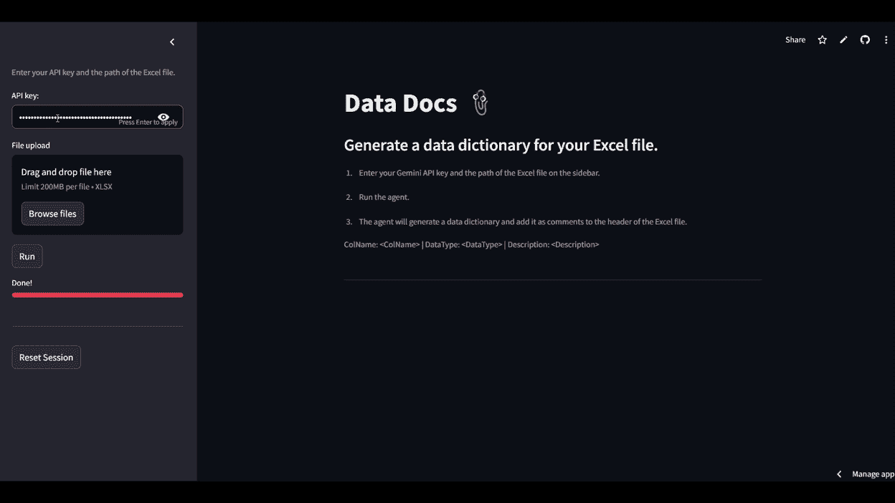

# 使用 OpenPyxl 和 AI 代理生成 Excel 文件的数据字典

> 原文：[`towardsdatascience.com/generating-data-dictionary-for-excel-files-using-openpyxl-and-ai-agents/`](https://towardsdatascience.com/generating-data-dictionary-for-excel-files-using-openpyxl-and-ai-agents/)

## <mdspan datatext="el1746681273986" class="mdspan-comment">简介</mdspan>

我至今为止为每家公司工作，那里都有：坚韧不拔的 MS Excel。

Excel 首次发布于 1985 年，至今仍保持强劲势头。它经历了关系型数据库的兴起、许多编程语言的演变、拥有无限在线应用的互联网，以及最终，它也正在经历人工智能时代。

呼吸一下！

你对 Excel 的韧性有疑问吗？我没有。

我认为这是因为其*快速启动和操作文档的实用性*。想想这种情况：我们在工作中，在会议中，突然领导分享了一个 CSV 文件，并要求进行快速计算或提供几个计算出的数字。现在，选项有：

1. 打开一个 IDE（或笔记本）并疯狂编码以生成一个简单的 matplotlib 图形；

2. 打开 Power BI，导入数据，并开始创建带有动态图形的报告。

3. 在 Excel 中打开 CSV 文件，编写几个公式，并创建一个图形。

我不能代表你，但很多时候我会选择选项 3。特别是由于 Excel 文件与所有东西都兼容，易于分享，而且对初学者友好。

我这么说只是为了引入话题，我想说的是，我认为 Excel 文件在不久的将来不会消失，即使是在人工智能快速发展的今天。很多人会喜欢这一点，也有人会讨厌这一点。

因此，我的行动是利用 AI 使 Excel 文件有更好的文档记录。数据团队对 Excel 的主要抱怨之一是缺乏最佳实践和可重复性，因为列名可以有任何名称和数据类型，但没有任何文档。

因此，我创建了一个 AI 代理，它可以读取 Excel 文件并创建这个小文档。这是它的工作方式：

1.  Excel 文件被转换为 CSV 格式，并输入到大型语言模型（LLM）中。

1.  AI 代理生成包含列信息（变量名、数据类型、描述）的数据字典。

1.  数据字典作为注释添加到 Excel 文件的标题中。

1.  带有注释的输出文件已保存。

好的。现在动手实践。让我们在这个教程中完成这个任务。

## 代码


让我们开始编码！| 由 AI 生成的图像。Meta Llama，2025。https://meta.ai

我们将首先设置一个虚拟环境。使用你选择的工具创建一个`venv`，例如 Poetry、Python Venv、Anaconda 或 UV。在我看来，我真的很喜欢 UV，因为它最快、最简单。如果你已经安装了 UV [[5]](https://docs.astral.sh/uv/getting-started/installation/)，打开一个终端并创建你的`venv`。

```py
uv init data-docs
cd data-docs
uv venv
uv add streamlit openpyxl pandas agno mcp google-genai
```

现在，让我们导入必要的模块。这个项目是用 Python 3.12.1 创建的，但我相信 Python 3.9 或更高版本可能已经足够。我们将使用：

+   **Agno**：用于 AI 代理管理

+   **OpenPyxl**：用于操作 Excel 文件

+   **Streamlit**：用于前端界面。

+   Pandas、OS、JSON、Dedent 和 Google Genai 作为支持模块。

```py
# Imports
import os
import json
import streamlit as st
from textwrap import dedent

from agno.agent import Agent
from agno.models.google import Gemini
from agno.tools.file import FileTools

from openpyxl import load_workbook
from openpyxl.comments import Comment
import pandas as pd
```

太好了。下一步是创建我们将需要用来处理 Excel 文件和创建 AI 代理的函数。

注意，所有函数都有详细的 **docstrings**。这是故意的，因为 LLMs 使用 docstrings 来了解给定函数的功能，并决定是否将其用作工具。

因此，如果你正在使用 Python 函数作为 AI 代理的工具，请确保使用详细的 docstrings。如今，有了像 Windsurf [[6]](https://windsurf.com/vscode_tutorial) 这样的免费代码伴侣，创建它们甚至更容易。

### 将文件转换为 CSV

这个函数将：

+   读取 Excel 文件的前 10 行。这足以让我们发送给 LLM。这样做，我们还防止发送过多的标记作为输入，使这个代理变得过于昂贵。

+   将文件保存为 CSV 格式，以便作为 AI 代理的输入。CSV 格式更容易让模型接受，因为它是一堆由逗号分隔的文本。而且我们知道 LLMs 在处理文本方面表现优异。

下面是这个函数。

```py
def convert_to_csv(file_path:str):
   """
    Use this tool to convert the excel file to CSV.

    * file_path: Path to the Excel file to be converted
    """
   # Load the file  
   df = pd.read_excel(file_path).head(10)

   # Convert to CSV
   st.write("Converting to CSV... :leftwards_arrow_with_hook:")
   return df.to_csv('temp.csv', index=False)
```

让我们继续。

### 创建代理

下一个函数用于创建 AI 代理。我使用 `Agno` [1]，因为它非常灵活且易于使用。我还选择了模型 `Gemini 2.0 Flash`。在测试阶段，这是表现最好的模型，能够生成数据文档。要使用它，你需要从 Google 获取一个 API 密钥。别忘了在这里获取一个 [[7]](https://ai.google.dev/gemini-api/docs/api-key)。

这个函数：

+   接收前一个函数输出的 CSV 文件。

+   通过 AI 代理传递，该代理生成包含列名、描述和数据类型的数据字典。

+   注意，`description` 参数是代理的提示。使其详细且精确。

+   数据字典将使用名为 `FileTools` 的工具保存为 `JSON` 文件，该工具可以读取和写入文件。

+   我已设置 `retries=2`，这样我们就可以在第一次尝试中处理任何错误。

```py
def create_agent(apy_key):
    agent = Agent(
        model=Gemini(id="gemini-2.0-flash", api_key=apy_key),
        description= dedent("""\
                            You are an agent that reads the temp.csv dataset presented to you and 
                            based on the name and data type of each column header, determine the following information:
                            - The data types of each column
                            - The description of each column
                            - The first column numer is 0

                            Using the FileTools provided, create a data dictionary in JSON format that includes the below information:
                            {<ColNumber>: {ColName: <ColName>, DataType: <DataType>, Description: <Description>}}

                            If you are unable to determine the data type or description of a column, return 'N/A' for that column for the missing values.
                            \
                            """),
        tools=[ FileTools(read_files=True, save_files=True) ],
        retries=2,
        show_tool_calls=True
        )

    return agent 
```

好的。现在我们需要另一个函数来保存数据字典到文件。

### 将数据字典添加到文件的头部

这是最后要创建的函数。它将：

+   从前一个步骤获取数据字典 `json` 和原始 Excel 文件。

+   将数据字典作为注释添加到文件的头部。

+   保存输出文件。

+   文件保存后，它会显示一个下载按钮，供用户获取修改后的文件。

```py
def add_comments_to_header(file_path:str, data_dict:dict="data_dict.json"):
    """
    Use this tool to add the data dictionary {data_dict.json} as comments to the header of an Excel file and save the output file.

    The function takes the Excel file path as argument and adds the {data_dict.json} as comments to each cell
    Start counting from column 0
    in the first row of the Excel file, using the following format:    
        * Column Number: <column_number>
        * Column Name: <column_name>
        * Data Type: <data_type>
        * Description: <description>

    Parameters
    ----------
    * file_path : str
        The path to the Excel file to be processed
    * data_dict : dict
        The data dictionary containing the column number, column name, data type, description, and number of null values

    """

    # Load the data dictionary
    data_dict = json.load(open(data_dict))

    # Load the workbook
    wb = load_workbook(file_path)

    # Get the active worksheet
    ws = wb.active

    # Iterate over each column in the first row (header)
    for n, col in enumerate(ws.iter_cols(min_row=1, max_row=1)):
        for header_cell in col:
            header_cell.comment = Comment(dedent(f"""\
                              ColName: {data_dict[str(n)]['ColName']}, 
                              DataType: {data_dict[str(n)]['DataType']},
                              Description: {data_dict[str(n)]['Description']}\
    """),'AI Agent')

    # Save the workbook
    st.write("Saving File... :floppy_disk:")
    wb.save('output.xlsx')

    # Create a download button
    with open('output.xlsx', 'rb') as f:
        st.download_button(
            label="Download output.xlsx",
            data=f,
            file_name='output.xlsx',
            mime='application/vnd.openxmlformats-officedocument.spreadsheetml.sheet'
        ) 
```

好的。下一步是在 Streamlit 前端脚本中将所有这些粘合在一起。

### Streamlit 前端

在这个步骤中，我可以创建一个不同的文件用于前端，并将函数导入其中。但我决定使用同一个文件，所以让我们从著名的开始：

```py
if __name__ == "__main__":
```

首先，几行代码来配置网页和显示在 Web 应用程序中的消息。我们将使用页面上的`居中`内容，并且有一些关于应用程序如何工作的信息。

```py
# Config page Streamlit
    st.set_page_config(layout="centered", 
                       page_title="Data Docs", 
                       page_icon=":paperclip:",
                       initial_sidebar_state="expanded")

    # Title
    st.title("Data Docs :paperclip:")
    st.subheader("Generate a data dictionary for your Excel file.")
    st.caption("1\. Enter your Gemini API key and the path of the Excel file on the sidebar.")
    st.caption("2\. Run the agent.")
    st.caption("3\. The agent will generate a data dictionary and add it as comments to the header of the Excel file.")
    st.caption("ColName: <ColName> | DataType: <DataType> | Description: <Description>")

    st.divider()
```

接下来，我们将设置侧边栏，用户可以输入他们的 Google API 密钥并选择要修改的`.xlsx`文件。

有一个按钮可以运行应用程序，另一个可以重置应用程序状态，还有一个进度条。没有什么太花哨的。

```py
with st.sidebar:
        # Enter your API key
        st.caption("Enter your API key and the path of the Excel file.")
        api_key = st.text_input("API key: ", placeholder="Google Gemini API key", type="password")

        # Upload file
        input_file = st.file_uploader("File upload", 
                                       type='xlsx')

        # Run the agent
        agent_run = st.button("Run")

        # progress bar
        progress_bar = st.empty()
        progress_bar.progress(0, text="Initializing...")

        st.divider()

        # Reset session state
        if st.button("Reset Session"):
            st.session_state.clear()
            st.rerun()
```

一旦点击**运行**按钮，它就会触发其余代码运行代理。以下是执行步骤的顺序：

1.  调用第一个函数将文件转换为 CSV 格式

1.  进度在进度条上记录。

1.  代理被创建。

1.  进度条已更新。

1.  将提示输入到代理中，以读取`temp.csv`文件，创建数据字典，并将输出保存到`data_dictionary.json`。

1.  数据字典会在屏幕上打印出来，因此用户可以在它保存到 Excel 文件时看到生成的内容。

1.  Excel 文件被修改并保存。

```py
# Create the agent
    if agent_run:
        # Convert Excel file to CSV
        convert_to_csv(input_file)

        # Register progress
        progress_bar.progress(15, text="Processing CSV...")

        # Create the agent
        agent = create_agent(api_key)

        # Start the script
        st.write("Running Agent... :runner:")

        # Register progress
        progress_bar.progress(50, text="AI Agent is running...")

        # Run the agent    
        agent.print_response(dedent(f"""\
                                1\. Use FileTools to read the temp.csv as input to create the data dictionary for the columns in the dataset. 
                                2\. Using the FileTools tool, save the data dictionary to a file named 'data_dict.json'.
                                \
                                """),
                        markdown=True)

        # Print the data dictionary
        st.write("Generating Data Dictionary... :page_facing_up:")
        with open('data_dict.json', 'r') as f:
            data_dict = json.load(f)
            st.json(data_dict, expanded=False)

        # Add comments to header
        add_comments_to_header(input_file, 'data_dict.json')

        # Remove temporary files
        st.write("Removing temporary files... :wastebasket:")
        os.remove('temp.csv')
        os.remove('data_dict.json')    

    # If file exists, show success message
    if os.path.exists('output.xlsx'):
        st.success("Done! :white_check_mark:")
        os.remove('output.xlsx')

    # Progress bar end
    progress_bar.progress(100, text="Done!")
```

就这样。这里有一个代理在行动的演示。



数据文档已添加到您的 Excel 文件中。图片由作者提供。

美丽的结果！

### 尝试一下

您可以在此尝试部署的应用程序：[`excel-datadocs.streamlit.app/`](https://excel-datadocs.streamlit.app/)

## 在你离开之前

在我看来，Excel 文件在不久的将来不会消失。无论喜欢还是讨厌它们，我们都要坚持使用它们一段时间。

Excel 文件功能多样，易于处理和共享，因此它们对于工作中的日常*临时*任务仍然非常有用。

然而，现在我们可以利用人工智能来帮助我们处理这些文件，并使它们变得更好。人工智能正在触及我们生活的许多方面。工作中的日常工具和工具只是其中之一。

让我们利用人工智能，每天更高效地工作！

如果您喜欢这个内容，可以在下面的网站和 GitHub 上找到更多我的工作。

### GitHub 仓库

这里是这个项目的 GitHub 仓库。

[`github.com/gurezende/Data-Dictionary-GenAI`](https://github.com/gurezende/Data-Dictionary-GenAI)

### 找到我

您可以在我的网站上找到更多关于我的工作。

[`gustavorsantos.me`](https://gustavorsantos.me)

## 参考资料

[1. Agno 文档](https://docs.agno.com/introduction/agents)

[2. OpenPyxl 文档](https://openpyxl.readthedocs.io/en/stable/index.html)

[3. Streamlit 文档](https://docs.streamlit.io/)

[4. 数据-Docs 网页应用](https://excel-datadocs.streamlit.app/)

[5. 安装 UV](https://docs.astral.sh/uv/getting-started/installation/)

[6. 风帆编码协同伙伴](https://windsurf.com/vscode_tutorial)

[7. Google Gemini API 密钥](https://ai.google.dev/gemini-api/docs/api-key)
