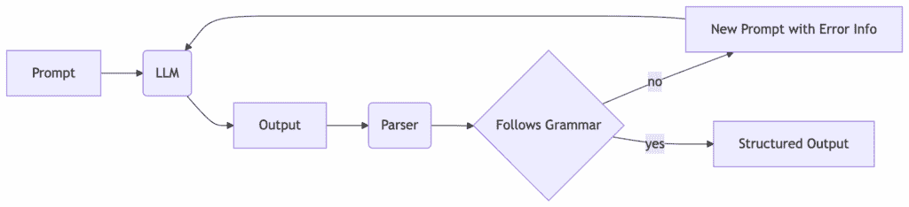
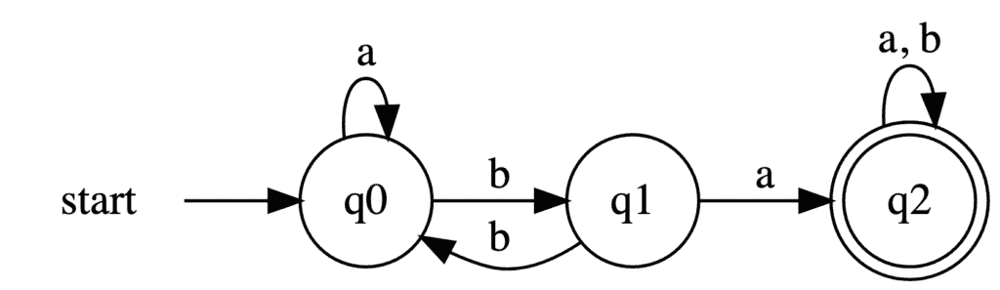
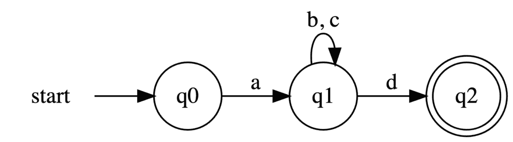

# 从 LLM 生成结构化输出

> 原文：[`towardsdatascience.com/generating-structured-outputs-from-llms/`](https://towardsdatascience.com/generating-structured-outputs-from-llms/)

<mdspan datatext="el1754676689102" class="mdspan-comment">今天，与 LLM 交互最常见</mdspan>的接口是通过[ChatGPT](https://chatgpt.com/)、[Gemini](https://gemini.google.com/app)或[DeepSeek](https://deep-seek.chat/deepseek-chat/)中发现的经典聊天 UI。该界面非常简单，用户输入一段文本，模型则响应另一段文本，这些文本可能或可能不遵循特定结构。由于人类可以理解非结构化的自然语言，因此该界面对于其设计的目标受众来说是合适且非常有效的。

然而，LLM 的用户基础远大于地球上居住的 80 亿人类。它扩展到数百万个软件程序，这些程序可能能够利用这些大型生成模型的力量。与人类不同，软件程序无法理解非结构化数据，这阻止了它们利用这些神经网络生成的知识。

为了解决这个问题，已经开发出各种技术来从 LLM 生成遵循预定义模式的结果。本文将概述从 LLM 生成结构化输出的三种最流行的方法。本文是为对将 LLM 集成到其软件应用中感兴趣的工程师所写。

## 结构化输出生成

从大型语言模型（LLM）生成结构化输出涉及使用这些模型来生成符合预定义模式的数据，而不是生成非结构化文本。该模式可以定义在多种格式中，其中 JSON 和正则表达式是最常见的。例如，当使用 JSON 格式时，模式指定了每个值预期的键和数据类型（如 int、string、float 等）。然后 LLM 输出一个仅包含定义的键和正确格式化值的 JSON 对象。

在 LLM 中需要结构化输出的情况有很多。格式化非结构化文本是这项技术的一个大型应用领域。你可以使用模型从大量文本或甚至图像（使用 VLM）中提取特定信息。例如，你可以使用一个通用的 VLM 从收据中提取购买日期、总价和商店名称。

从 LLM 生成结构化输出的技术有很多。本文将讨论三种。

1.  依赖 API 提供商

1.  提示和重提示策略

1.  约束解码

## 依赖 API 提供商的“魔法”

包括 OpenAI 和谷歌的 Gemini 在内的多个 LLM 服务 API 提供商允许用户为模型的输出定义一个模式。这个模式通常使用 Pydantic 类定义，并提交给 API 端点。如果您使用 LangChain，可以遵循[这个](https://python.langchain.com/docs/how_to/structured_output/)教程将结构化输出集成到您的应用程序中。

简单性是这种特定方法最伟大的方面。您以您熟悉的方式定义所需的模式，将其传递给 API 提供商，然后坐下来放松，让服务提供商为您完成所有的*魔法*。

然而，使用这种技术将限制您只能使用提供所述服务的 API 提供商。这限制了您项目的增长和灵活性，因为它关闭了使用多个模型，尤其是开源模型的大门。如果 API 提供商突然决定提高服务的价格，您将被迫接受额外费用或寻找其他提供商。

此外，服务提供商所做的不完全是*霍格沃茨魔法*。提供商遵循某种方法为您生成结构化输出。了解底层技术将有助于应用程序开发并加速调试过程和错误理解。出于上述原因，掌握底层科学可能是值得努力的。

## 基于提示和重提示（reprompting）的技术

如果您之前与一个 LLM 进行过聊天，那么这种技术可能已经在您的脑海中。如果您想让模型遵循某种结构，只需告诉它这样做！在系统提示中，指示模型遵循某种结构，提供一些示例，并要求它不要添加任何额外的文本或描述。

在模型响应用户请求并且系统接收到输出后，您应该使用解析器将字节序列转换为系统中的适当表示。如果解析成功，那么恭喜自己并感谢提示工程的力量。如果解析失败，那么您的系统将不得不从错误中恢复。

### 提示本身是不够的

提示（prompting）的问题在于其不可靠性。单独使用提示并不足以信任模型遵循所需的结构。它可能会添加额外的解释，忽略某些字段，并使用错误的数据类型。提示应该与错误恢复技术相结合，以处理模型违反模式的情况，这种情况是通过解析失败检测到的。

有些人可能会认为解析器就像一个布尔函数。它接受一个字符串作为输入，检查其是否符合预定义的语法规则，并返回一个简单的*“是”*或*“否”*答案。实际上，解析器比这更复杂，并且提供比**“遵循”*或*“不遵循”*结构更丰富的信息。

解析器可以根据语法规则检测输入文本中的错误和不正确的标记(Aho et al. 2007, 192–96)。这些信息为我们提供了有关输入字符串中错位具体情况的宝贵信息。例如，解析器是检测你在运行 Java 代码时缺少分号错误的工具。

图 1 描述了基于提示技术的流程。



图 1：提示和重提示技术的一般流程。由作者使用[mermaid](https://mermaid.js.org/)生成

### 提示工具

最受欢迎的基于提示的 LLM 结构化输出生成库之一是[instructor](https://github.com/567-labs/instructor)。Instructor 是一个在 GitHub 上拥有超过 11k 星标的 Python 库。它支持使用 Pydantic 进行数据定义，集成了超过 15 个提供者，并在解析失败时提供自动重试。除了 Python，该包还可在[TypeScript](https://github.com/567-labs/instructor-js)、[Go](https://github.com/567-labs/instructor-go)、[Ruby](https://github.com/567-labs/instructor-rb)和[Rust](https://github.com/567-labs/instructor-rs)中使用(2)。

Instructor 的美丽之处在于其简单性。你所需要做的就是定义一个 Pydantic 类，使用其名称和 API 密钥（如果需要）初始化客户端，并传递你的请求。下面的示例代码，来自[docs](https://python.useinstructor.com/)，展示了 Instructor 的简单性。

```py
import instructor
from pydantic import BaseModel
from openai import OpenAI

class Person(BaseModel):
    name: str
    age: int
    occupation: str

client = instructor.from_openai(OpenAI())
person = client.chat.completions.create(
    model="gpt-4o-mini",
    response_model=Person,
    messages=[
        {
          "role": "user",
          "content": "Extract: John is a 30-year-old software engineer"
        }
    ],
)
print(person)  # Person(name='John', age=30, occupation='software engineer')
```

### 重提示的成本

尽管重提示技术可能非常方便，但它代价高昂。LLM 的使用成本，无论是服务提供商 API 成本还是 GPU 使用，都会随着输入标记数和生成标记数的线性增长而增长。

如前所述，基于提示的技术可能需要重提示。重提示的成本将与原始提示大致相同。因此，成本会随着重提示次数的线性增长而增长。

如果你打算使用这种技术，你必须牢记成本问题。没有人愿意被 API 提供商的大额账单吓到。一个有助于减少意外成本的想法是在系统中应用硬编码的限制，以限制允许的重提示次数。这将帮助你将单个提示和重提示周期的成本限制在最高限度内。

## 约束解码

与提示不同，约束解码不需要重试来生成有效、遵循结构的输出。约束解码利用计算语言学技术和对 LLM 中标记生成过程的知识来生成保证遵循所需模式的输出。

### 它是如何工作的？

LLM 是自回归模型。它们一次生成一个标记，并将生成的标记用作相同模型的输入。

LLM 的最后一层基本上是一个逻辑回归模型，它为模型词汇表中的每个标记计算其跟随输入序列的概率。模型计算每个标记的 logits 值，然后使用 softmax 函数，将这些值缩放并转换为概率值。

限制解码通过限制每个生成步骤中可用的标记来产生结构化输出。标记的选择使得最终输出遵循所需的结构。为了了解如何确定可能的下一个标记集，我们需要访问 RegEx。

正则表达式（RegEx）用于定义文本的特定模式。它们用于检查一个文本序列是否与预期的结构或模式相匹配。所以基本上，RegEx 是一种可以用来从 LLMs 定义预期结构的语言。由于其流行度，存在大量工具和库可以将其他形式的数据结构定义（如 Pydantic 类和 JSON）转换为 RegEx。由于其灵活性和广泛的转换工具可用性，我们现在可以转换我们的目标，专注于使用 LLMs 生成遵循 RegEx 模式的输出。

#### 确定性有限自动机（DFA）

编译 RegEx 模式并对其与文本体进行测试的一种方法是将模式转换为确定性有限自动机（DFA）。DFA 简单来说是一个状态机，用于检查一个字符串是否遵循某种结构或模式。

一个 DFA 由 5 个组件组成。

1.  一组标记（称为 DFA 的字母表）

1.  一组状态

1.  一组转换。每个转换连接两个状态（可能是一个状态连接到自身）并注有来自字母表的一个标记

1.  一个起始状态（用输入箭头标记）

1.  一个或多个最终状态（标记为双圆圈）

一个字符串是一系列标记的序列。要测试一个字符串是否与由 DFA 定义的模式匹配，你从起始状态开始，遍历字符串的标记，在每次移动时采取与标记相对应的转换。如果在任何时刻，你有一个没有从当前状态到相应转换的标记，解析失败，字符串违反了模式。如果解析结束于一个最终状态，则字符串匹配模式；否则也失败。



图 2：具有字母表 `{a, b}`、状态 `{q0, q1, q2}` 和单个最终状态 `q2` 的 DFA 的示例。由作者使用 [Grpahviz](https://graphviz.org/) 生成。

例如，字符串 `abab` 与 图 2 中的模式匹配，因为从 `q0` 开始，按照 `a`、`b`、`a` 和 `b` 的顺序跟随标记的转换，最终会到达 `q2`，这是一个最终状态。

另一方面，字符串 `abba` 不匹配模式，因为其路径结束于 `q0`，这不是一个最终状态。

正则表达式的一个优点是它可以编译成 DFA；毕竟，它们只是指定模式的不同方式。关于这种转换的讨论超出了本文的范围。感兴趣的读者可以查看 Aho et al. (2007, 152–66) 以了解执行转换的两种技术。

#### 有效下一个标记集合的 DFA



图 3：从正则表达式 `a(b|c)*d` 生成的 DFA 的示例。由作者使用 [Grpahviz](https://graphviz.org/) 生成。

让我们回顾一下我们已经达到的。我们想要一种技术来确定遵循特定模式的有效下一个标记集合。我们使用正则表达式定义了模式，并将其转换为 DFA。现在我们将展示 DFA 如何在解析过程中任何时刻告诉我们可能的标记集合，符合我们的需求和目标。

在构建了 DFA 之后，我们可以轻松地在任何状态下确定有效下一个标记的集合，这是从当前状态退出的任何转换标注的标记集合。

以 图 3 中的 DFA 为例。下表显示了每个状态的有效下一个标记集合。

| 状态 | 有效下一个标记 |
| --- | --- |
| `q0` | {`a`} |
| `q1` | {`b`, `c`, `d`} |
| `q2` | {} |

### 将 DFA 应用到 LLMs

回到我们从 LLMs 获取结构化输出的问题上，我们可以将我们的模式转换为正则表达式，然后转换为 DFA。这个 DFA 的字母表将被设置为 LLM 的词汇（模型可以生成的所有标记的集合）。当模型生成标记时，我们将通过 DFA 移动，从起始状态开始。在每一步，我们都能确定有效下一个标记的集合。

现在的技巧发生在 softmax 缩放阶段。通过将不在有效标记集合中的所有标记的 logits 设置为零，我们只计算有效标记的概率，迫使模型生成遵循模式的标记序列。这样，我们可以以零额外成本生成结构化输出！

### 约束解码工具

Outlines (Willard and Louf 2023) 是最受欢迎的用于约束解码的 Python 库之一。它非常易于使用，并且可以与许多 LLM 提供商集成，如 [OpenAI](https://openai.com/)、[Anthropic](https://www.anthropic.com/)、[Ollama](https://www.ollama.com/) 和 [vLLM](https://github.com/vllm-project/vllm)。

您可以使用 Pydantic 类定义模式，库将处理正则表达式转换，或者直接使用正则表达式模式。

```py
from pydantic import BaseModel
from typing import Literal
import outlines
import openai

class Customer(BaseModel):
    name: str
    urgency: Literal["high", "medium", "low"]
    issue: str

client = openai.OpenAI()
model = outlines.from_openai(client, "gpt-4o")

customer = model(
    "Alice needs help with login issues ASAP",
    Customer
)
# ✓ Always returns valid Customer object
# ✓ No parsing, no errors, no retries
```

上面的代码片段来自 [docs](https://dottxt-ai.github.io/outlines/latest/)，展示了使用 Outlines 的简单性。有关库的更多信息，您可以查看 [docs](https://dottxt-ai.github.io/outlines/latest/) 和 [dottxt 博客](https://blog.dottxt.ai/)。

## 结论

从 LLMs 生成结构化输出是一个强大的工具，它扩展了 LLMs 在简单人机聊天之外的潜在应用场景。本文讨论了三种方法：依赖 API 提供商、提示和重提示策略，以及约束解码。在大多数情况下，由于其灵活性和低成本，约束解码是首选方法。此外，像 Outlines 这样的流行库的存在简化了约束解码在软件项目中的引入。

如果你想了解更多关于约束解码的信息，我强烈推荐由 Outlines 库的创造者[deeplearning.ai](https://www.deeplearning.ai/)和[dottxt](https://dottxt.ai/)提供的[这门课程](https://www.deeplearning.ai/short-courses/getting-structured-llm-output/)。该课程通过视频和代码示例，帮助你通过本文讨论的技术从 LLMs 中获得结构化输出，获得实际操作经验。

### 参考文献

[1] Aho, Alfred V., Monica S. Lam, Ravi Sethi, 和 Jeffrey D. Ullman, 《编译原理、技术与工具》（2007 年），Pearson/Addison Wesley

[2] Willard, Brandon T. 和 Rémi Louf, 《大型语言模型的效率引导生成》（2023 年），[`arxiv.org/abs/2307.09702`](https://arxiv.org/abs/2307.09702)。

###### 脚注

1.  本文所提及的包信息均基于撰写本文时的[文档](https://python.useinstructor.com/)。
