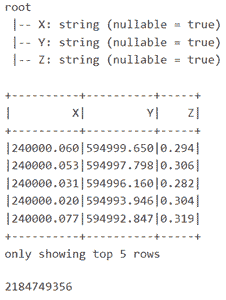
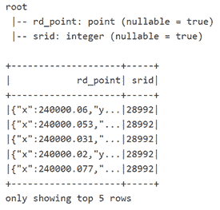
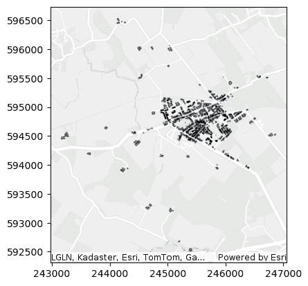
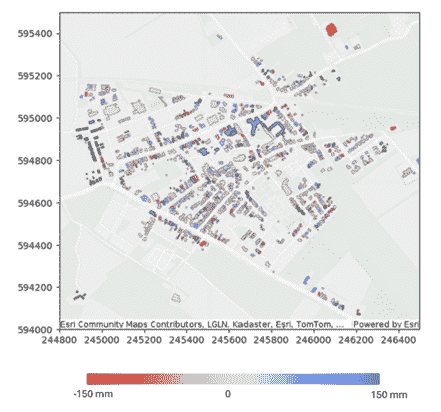

# 展示 Microsoft Fabric 和 ESRI GeoAnalytics 的地理空间功能

> 原文：[`towardsdatascience.com/geospatial-capabilities-of-microsoft-fabric-and-esri-geoanalytics-demonstrated/`](https://towardsdatascience.com/geospatial-capabilities-of-microsoft-fabric-and-esri-geoanalytics-demonstrated/)

<mdspan datatext="el1747287101152" class="mdspan-comment">俗话说</mdspan>，政府收集、存储和维护的 80% 的数据可以与地理位置相关联。尽管从未经过经验证明，但它说明了地理位置在数据中的重要性。不断增长的数据量对处理地理空间数据的系统提出了限制。最初为扩展文本数据而设计的常见大数据计算引擎需要适应才能有效地与地理空间数据一起工作——想想地理索引、分区和运算符。在这里，我介绍并展示了如何利用 [Microsoft Fabric](https://learn.microsoft.com/en-us/fabric/) Spark 计算引擎，该引擎与本地集成的 [ESRI GeoAnalytics 引擎](https://developers.arcgis.com/geoanalytics-fabric/^#) 用于地理空间大数据处理和分析。

Fabric 中的可选 GeoAnalytics 功能能够处理和分析矢量类型的地理空间数据，其中矢量类型的地理空间数据指的是点、线、多边形。这些功能包括超过 150 个空间函数，用于创建几何形状、测试和选择空间关系。由于它扩展了 Spark，GeoAnalytics 函数可以在使用 Python、SQL 或 Scala 时调用。这些空间操作自动应用空间索引，使得 Spark 计算引擎也适用于此类数据。它能够处理 10 种额外的常见空间数据格式来加载和保存空间数据，除了 Spark 本地支持的数据源格式之外。本博客文章重点介绍了我在关于[人工智能时代的地理空间](https://medium.com/spatial-data-science/handling-geospatial-data-in-the-age-of-ai-9c751363e212)的帖子中介绍的可扩展地理空间计算引擎。

## 演示说明

在这里，我通过展示在大数据集上的数据操作和分析步骤来演示这些空间功能。通过使用覆盖点云数据（一系列 x、y、z 值）的几个瓦片，一个庞大的数据集开始形成，尽管它仍然覆盖了一个相对较小的区域。目前，开放的 [荷兰 AHN](https://www.ahn.nl/) 数据集，这是一个国家数字高程和表面模型，正处于第五次更新周期，跨越了近 30 年的时间。在这里，使用了第二次、第三次和第四次采集的数据，因为这些数据拥有全国覆盖（第五次尚未），而第一个版本没有包含点云发布（只有衍生的网格版本）。

另一个荷兰公开数据集，即[建筑数据，BAG](https://www.kadaster.nl/zakelijk/registraties/basisregistraties/bag/over-bag)，用于说明空间选择。建筑数据集包含建筑的轮廓作为多边形。目前，此数据集包含超过 1100 万座建筑。为了测试空间函数，我使用每个 AHN 版本的 4 个 AHN 瓦片。因此，在这种情况下，共有 12 个瓦片，每个瓦片为 5 x 6.25 平方公里。总面积超过 125 平方公里的 3.5 亿个点。所选区域覆盖了 Loppersum 市政区，这是一个由于天然气提取而容易发生地面沉降的区域。

需要采取的步骤包括在 Loppersum 区域内选择建筑，从建筑的屋顶选择 x,y,z 点。然后，我们将 3 个数据集合并到一个 dataframe 中，并对其进行额外分析。通过空间回归预测建筑预期高度，基于其高度历史以及其直接周围建筑的历史。这不一定是对这些数据进行实际预测的最佳分析，但它仅适用于展示 Fabric 的 ESRI GeoAnalytics 的空间处理能力。所有以下代码片段也作为[github 上的 notebooks](https://github.com/delange/Fabric_GeoAnalytics)提供。

## 第 1 步：读取数据

空间数据可以以许多不同的数据格式存在；我们遵循地理帕克特数据格式进行进一步处理。BAG 建筑数据，包括建筑轮廓以及伴随的市政边界，已经以地理帕克特格式提供。然而，点云 AHN 数据，版本 2、3 和 4，以 LAZ 文件格式提供——这是一种用于点云的压缩行业标准格式。我还没有找到可以读取 LAZ 的 Spark 库（如果有，请留言），并使用[LAStools](https://lastools.github.io/)^+首先创建了一个单独的 txt 文件。

```py
# ESRI - FABRIC reference: https://developers.arcgis.com/geoanalytics-fabric/

# Import the required modules
import geoanalytics_fabric
from geoanalytics_fabric.sql import functions as ST
from geoanalytics_fabric import extensions

# Read ahn file from OneLake
# AHN lidar data source: https://viewer.ahn.nl/

ahn_csv_path = "Files/AHN lidar/AHN4_csv"
lidar_df = spark.read.options(delimiter=" ").csv(ahn_csv_path)
lidar_df = lidar_df.selectExpr("_c0 as X", "_c1 as Y", "_c2 Z")

lidar_df.printSchema()
lidar_df.show(5)
lidar_df.count() 
```

上述代码片段^&提供了以下结果：



现在，使用空间函数[`make_point`](https://developers.arcgis.com/geoanalytics-fabric/sql-functions/st_make_point/)和[`srid`](https://developers.arcgis.com/geoanalytics-fabric/sql-functions/st_srid/)，将 x,y,z 列转换为点几何，并将其设置为特定的荷兰坐标系（SRID = 28992），请参阅以下代码片段^&：

```py
# Create point geometry from x,y,z columns and set the spatial refrence system
lidar_df = lidar_df.select(ST.make_point(x="X", y="Y", z="Z").alias("rd_point"))
lidar_df = lidar_df.withColumn("srid", ST.srid("rd_point"))
lidar_df = lidar_df.select(ST.srid("rd_point", 28992).alias("rd_point"))\
  .withColumn("srid", ST.srid("rd_point"))

lidar_df.printSchema()
lidar_df.show(5) 
```



使用扩展的 `spark.read` 函数可以读取地理帕克特（geoparquet）的市政和建筑数据，请参阅代码片段^&：

```py
# Read building polygon data
path_building = "Files/BAG NL/BAG_pand_202504.parquet"
df_buildings = spark.read.format("geoparquet").load(path_building)

# Read woonplaats data (=municipality)
path_woonplaats = "Files/BAG NL/BAG_woonplaats_202504.parquet"
df_woonplaats = spark.read.format("geoparquet").load(path_woonplaats)

# Filter the DataFrame where the "woonplaats" column contains the string "Loppersum"
df_loppersum = df_woonplaats.filter(col("woonplaats").contains("Loppersum")) 
```

## 第 2 步：进行选择

在附带的[notebooks](https://github.com/delange/Fabric_GeoAnalytics)中，我读取和写入地理帕克特。为了确保正确读取数据为 dataframes，请参阅以下代码片段：

```py
# Read building polygon data
path_building = "Files/BAG NL/BAG_pand_202504.parquet"
df_buildings = spark.read.format("geoparquet").load(path_building)

# Read woonplaats data (=municipality)
path_woonplaats = "Files/BAG NL/BAG_woonplaats_202504.parquet"
df_woonplaats = spark.read.format("geoparquet").load(path_woonplaats)

# Filter the DataFrame where the "woonplaats" column contains the string "Loppersum"
df_loppersum = df_woonplaats.filter(col("woonplaats").contains("Loppersum")) 
```

当所有数据都在数据框中时，进行空间选择变得简单。以下代码片段^&展示了如何选择 Loppersum 市镇边界内的建筑物，并分别选择在整个时期内存在的建筑物（该区域的点云 AHN-2 数据于 2009 年获取）。这导致了 1196 座建筑物，占目前 2492 座建筑物的比例。

```py
# Clip the BAG buildings to the gemeente Loppersum boundary
df_buildings_roi = Clip().run(input_dataframe=df_buildings,
                    clip_dataframe=df_loppersum)

# select only buildings older then AHN data (AHN2 (Groningen) = 2009) 
# and with a status in use (Pand in gebruik)
df_buildings_roi_select = df_buildings_roi.where((df_buildings_roi.bouwjaar<2009) & (df_buildings_roi.status=='Pand in gebruik')) 
```

然后根据选定的建筑数据对使用的三个 AHN 版本（2、3 和 4），分别命名为 T1、T2 和 T3 进行裁剪。可以使用[`AggregatePoints`](https://developers.arcgis.com/geoanalytics-fabric/tools/aggregate-points/)函数来计算一些统计信息，例如每个屋顶的平均值、标准差以及基于 z 值的数量；请参阅代码片段：

```py
# Select and aggregrate lidar points from buildings within ROI

df_ahn2_result = AggregatePoints() \
            .setPolygons(df_buildings_roi_select) \
            .addSummaryField(summary_field="T1_z", statistic="Mean", alias="T1_z_mean") \
            .addSummaryField(summary_field="T1_z", statistic="stddev", alias="T1_z_stddev") \
            .run(df_ahn2)

df_ahn3_result = AggregatePoints() \
            .setPolygons(df_buildings_roi_select) \
            .addSummaryField(summary_field="T2_z", statistic="Mean", alias="T2_z_mean") \
            .addSummaryField(summary_field="T2_z", statistic="stddev", alias="T2_z_stddev") \
            .run(df_ahn3)

df_ahn4_result = AggregatePoints() \
            .setPolygons(df_buildings_roi_select) \
            .addSummaryField(summary_field="T3_z", statistic="Mean", alias="T3_z_mean") \
            .addSummaryField(summary_field="T3_z", statistic="stddev", alias="T3_z_stddev") \
            .run(df_ahn4) 
```

## 第 3 步：聚合和回归

由于地理分析功能[地理加权回归（GWR）](https://developers.arcgis.com/geoanalytics-fabric/tools/gwr/)只能处理点数据，因此使用[`centroid`](https://developers.arcgis.com/geoanalytics-fabric/sql-functions/st_centroid/)函数从建筑多边形中提取它们的质心。将 3 个数据框合并为一个，也可以参考笔记本，此时即可执行 GWR 功能。在这个例子中，它基于局部回归函数预测 T3（AHN4）的高度。

```py
# Import the required modules
from geoanalytics_fabric.tools import GWR

# Run the GWR tool to predict AHN4 (T3) height values for buildings at Loppersum
resultGWR = GWR() \
            .setExplanatoryVariables("T1_z_mean", "T2_z_mean") \
            .setDependentVariable(dependent_variable="T3_z_mean") \
            .setLocalWeightingScheme(local_weighting_scheme="Bisquare") \
            .setNumNeighbors(number_of_neighbors=10) \
            .runIncludeDiagnostics(dataframe=df_buildingsT123_points) 
```

可以查阅模型诊断以获取预测的 z 值，在这种情况下，生成了以下结果。请注意，再次强调，这些结果不能用于实际应用，因为数据和方法的适用性可能不适合沉降建模的目的——它只是展示了 Fabric GeoAnalytics 功能。

| R2 | 0.994 |
| --- | --- |
| 调整后的 R2 | 0.981 |
| AICc | 1509 |
| 方差 | 0.046 |
| 自由度 | 378 |

## 第 4 步：可视化结果

使用空间函数图，结果可以在笔记本内以地图的形式进行可视化——仅适用于 Spark 的 Python API。首先，展示 Loppersum 市镇内所有建筑物的可视化。

```py
# visualize Loppersum buildings
df_buildings.st.plot(basemap="light", geometry="geometry", edgecolor="black", alpha=0.5) 
```



这里展示了 T3（AHN4）和 T3 预测值（T3 预测值减去 T3）之间的高度差可视化。

```py
# Vizualize difference of predicted height and actual measured height Loppersum area and buildings

axes = df_loppersum.st.plot(basemap="light", edgecolor="black", figsize=(7, 7), alpha=0)
axes.set(xlim=(244800, 246500), ylim=(594000, 595500))
df_buildings.st.plot(ax=axes, basemap="light", alpha=0.5, edgecolor="black") #, color='xkcd:sea blue'
df_with_difference.st.plot(ax=axes, basemap="light", cmap_values="subsidence_mm_per_yr", cmap="coolwarm_r", vmin=-10, vmax=10, geometry="geometry") 
```



## 摘要

这篇博客文章讨论了地理数据的重要性。它强调了数据量增加对地理空间数据系统带来的挑战，并建议传统的大数据引擎必须适应以有效地处理地理空间数据。在这里，展示了如何使用 Microsoft Fabric Spark 计算引擎及其与 ESRI GeoAnalytics 引擎的集成，以进行有效的地理空间大数据处理和分析。

这里的观点是我的。

## 脚注

# 在预览中

* 为了以更高的精度和更频繁的时间频率模拟地面沉降，可以采用其他方法和数据，例如使用卫星 InSAR 方法（也见[Bodemdalingskaart](https://bodemdalingskaart.nl/en-us/)))

+ 在这里单独使用 Lastools，测试 Fabric 用户数据函数（预览）的使用或者利用 Azure Function 来完成这个目的会很有趣。

& 代码片段这里设置是为了可读性，不一定是为了效率。多个数据处理步骤可以串联起来。

## 参考文献

GitHub 仓库中的笔记本: [delange/Fabric_GeoAnalytics](https://github.com/delange/Fabric_GeoAnalytics)

Microsoft Fabric: [Microsoft Fabric 文档 – Microsoft Fabric | Microsoft Learn](https://learn.microsoft.com/en-us/fabric/)

ESRI GeoAnalytics for Fabric: [概览 | ArcGIS GeoAnalytics for Microsoft Fabric | ArcGIS 开发者](https://developers.arcgis.com/geoanalytics-fabric/)

AHN: [首页 | AHN](https://www.ahn.nl/)

BAG: [Over BAG – Basisregistratie Adressen en Gebouwen – Kadaster.nl zakelijk](https://www.kadaster.nl/zakelijk/registraties/basisregistraties/bag/over-bag)

Lastools: [LAStools：在 LAS 和 LAZ 格式中转换、过滤、查看、处理和压缩激光雷达数据](https://lastools.github.io/)

表面和物体运动图: [Bodemdalingskaart –](https://bodemdalingskaart.nl/en-us/)
