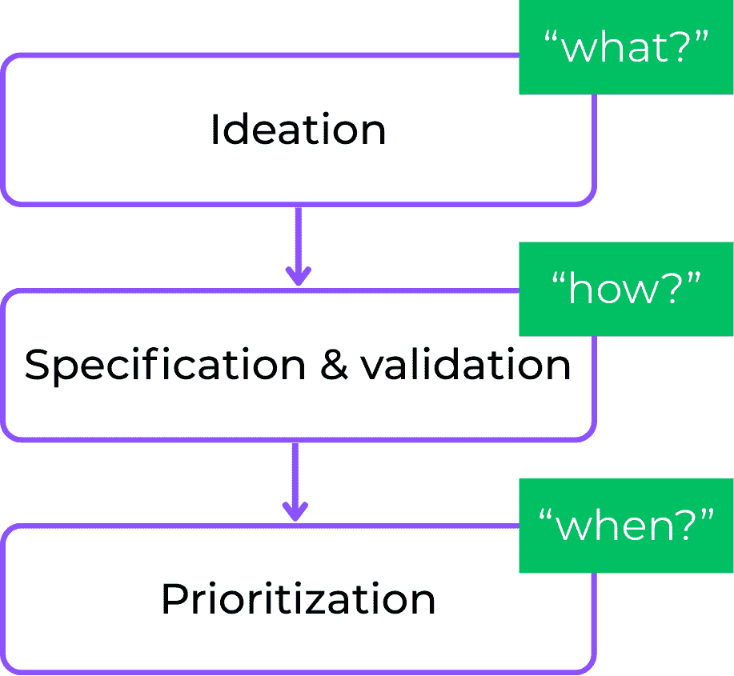
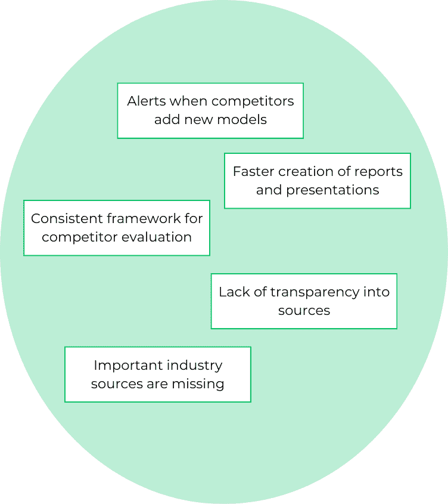
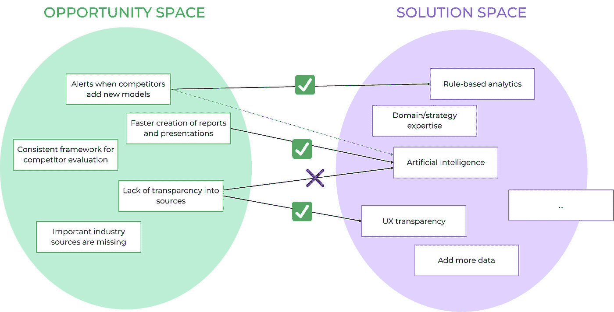
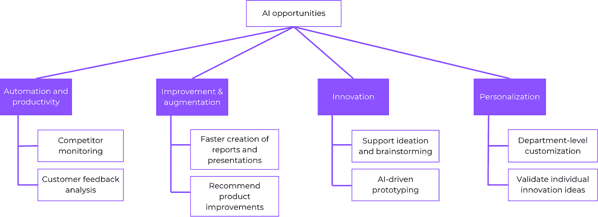
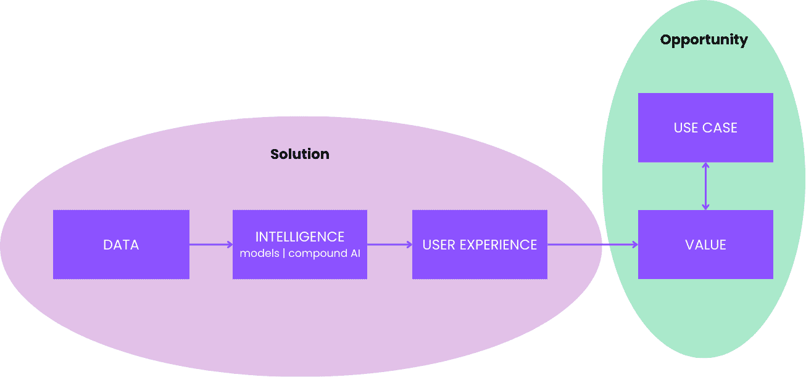
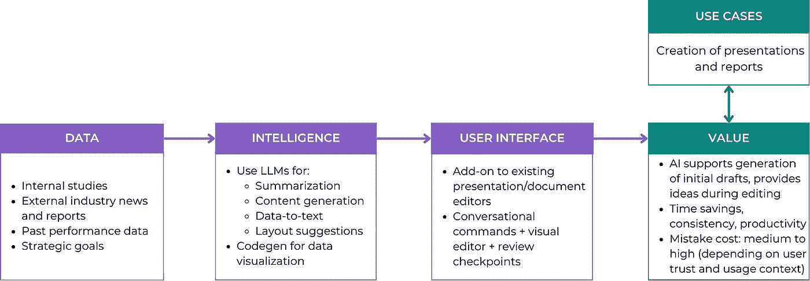
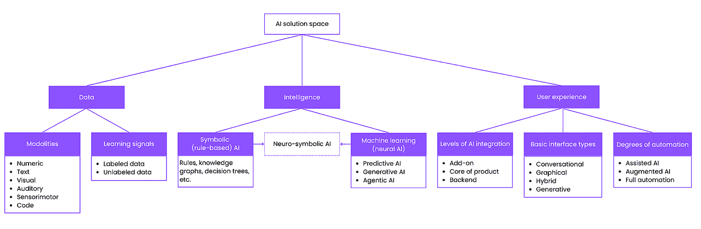
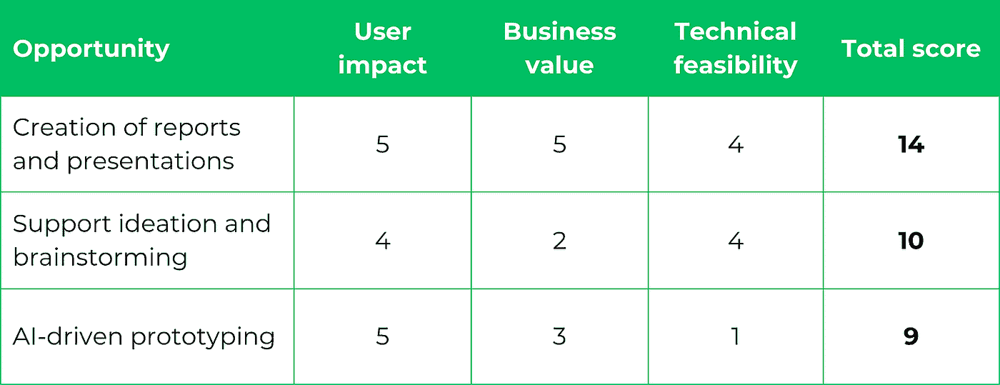

# 正确实现人工智能发现

> 原文：[`towardsdatascience.com/getting-ai-discovery-right/`](https://towardsdatascience.com/getting-ai-discovery-right/)

<mdspan datatext="el1753387551319" class="mdspan-comment">当你使用人工智能构建时，复杂性会累积——有更多的不确定性、更多的未知和更多的变动部分跨越团队、工具和期望。这就是为什么拥有一个坚实的发现过程比构建传统的确定性软件时更加重要。

根据[最近的研究](https://www.rand.org/pubs/research_reports/RRA2680-1.html)，人工智能项目失败的第 1 个原因是公司使用人工智能解决错误的问题。这些问题可以是：

+   太小，没有人关心

+   太简单，不值得使用人工智能和处理更多复杂性

+   或者一开始就完全不适合人工智能

在这篇文章中，我将分享我们如何处理人工智能驱动产品的发现，将其分解为三个关键步骤：

图 1：发现过程

我将以汽车行业最近的一个项目为例来说明这种方法。其中一些描述的点将是新的，并且与人工智能相关；其他点是传统开发中已知的，但在人工智能的背景下更有意义。

📚 *注意：本文内容基于我的新书*[***人工智能产品开发的艺术***](https://www.amazon.com/Art-AI-Product-Development-Delivering/dp/1633437051)。查看它，深入了解发现以及更多内容！*

## 构思：寻找合适的 AI 机会

让我们从构思开始——任何发现过程中的第一步，你试图收集大量想法以供开发。我们将探讨两种熟悉的方式：一种教科书版本，其中你遵循产品管理的最佳实践，以及一种常见的现实生活场景，其中事情往往会有点偏颇和混乱。请放心——两条路径都可以通往成功。

> *💡* 根据 Jeremy Utley 和 Perry Klebahn 的书籍[*Ideaflow*](https://www.amazon.de/Ideaflow-Only-Business-Metric-Matters/dp/0593420586)，衡量企业**创新能力**的最佳指标是思想流——在给定时间内，个人或团体围绕特定情况产生的创新想法数量。

### 课本场景：以问题为先的思考

在理想的世界里，你有大量时间来探索和构建机会空间——也就是说，你已识别的所有客户需求、愿望和痛点。这些可能来自不同的来源，例如：

+   客户访谈和反馈

+   销售和支持对话

+   竞争性研究

+   有时只是团队的直觉和行业经验

例如，以下是我们的汽车客户的机会空间摘录，其目标是利用人工智能监控全球汽车市场并制定战略创新的建议：

图 2：机会空间摘录

注意，在这个例子中，我们正在查看一个棕色地带场景。机会空间不仅包括新的功能想法，还包括对现有功能的批评，例如“缺乏对来源的透明度。”

一旦你确定了需求，你就可以查看解决方案空间——所有可能的技术解决方案。例如，这些可以包括：

+   基于规则的分析

+   用户体验改进

+   人工智能

+   增加更多领域专业知识

+   …

重要的是，人工智能是解决方案空间的一部分，但绝不是特权——它只是众多选择中的一个。

最后，你将机会与解决方案相匹配，如下面的图所示：

图 3：将你的机会空间映射到你的解决方案空间

让我们来看看一些链接：

+   如果几个用户说，“当竞争对手推出新模型时，我需要收到警报”，你可能会考虑使用人工智能。然而，一个简单的基于规则的系统，可以从竞争对手的网站上抓取他们的产品，也可以解决这个问题。

+   如果问题是“我需要更快地创建报告和演示文稿”，那么人工智能开始发光。总结大量数据或文本以重新构建它并生成新内容正是现代人工智能擅长的领域。

+   但是，如果问题是“我不信任这些数据，因为我看不到来源”，那么人工智能可能根本不适合。这是一个用户体验和透明度挑战，而不是机器学习问题。

在这种场景中，当将每个需求与正确的解决方案相匹配时，保持公正非常重要。即使你内心激动地想要开始使用最新的 AI 工具（谁不会呢？），你也必须耐心等待合适的机遇出现。

### 真实场景：“让我们使用人工智能！”

现在，在现实中，事情往往从不同的角度开始。例如，你在一个团队会议上，有人说，“让我们使用人工智能！”或者你的 CEO 发表了一场神奇的演讲，突然将人工智能列入议程，而没有提供任何关于如何使用它的指导或方向。不进行进一步的讨论，你可能会陷入“为了人工智能而人工智能”的陷阱。

然而，这并不一定是一场灾难。我们正在谈论一种极其灵活的技术，你可以从人工智能优先的必要性出发，通过围绕人工智能的核心优势和不足进行构思来找到巨大的机会。

**人工智能机会树：关注人工智能的核心优势**

当我与已经决定“想要做人工智能”的团队合作时，我帮助他们围绕人工智能擅长的事情来构建对话。在 B2B 环境中，你可以围绕以下四个主要好处来构建：

1.  **自动化与生产力：**使用人工智能使现有流程更快、更便宜。例如，Intercom 使用 AI 聊天机器人自动处理常见的客户服务问题，减少响应时间，并释放人力资源处理更复杂的情况。

1.  **改进与增强：**帮助人们提高他们工作的成果。例如，Notion AI 协助起草、总结和改进内容，而将最终决策和编辑留给人类用户。

1.  **创新与转型：**解锁全新的产品、功能或商业模式。例如，特斯拉使用 AI 从销售硬件转向通过驾驶员辅助、电池优化和在空中更新车内体验等功能提供持续软件驱动的价值。

1.  **个性化：**针对特定用户或情境定制输出。例如，Spotify 使用 AI 创建个性化的播放列表，如每周发现，根据每个听众的独特品味调整推荐。

在构思时，您应该尝试通过收集每个益处的多个机会来构建一个丰富的想法空间。这将导致一个结构化的[AI 机会树](https://www.ai-strategy-partners.com/knowledge-hub/mental-models/ai-opportunity-tree)。以下是我们在汽车场景中构建的机会树的一部分：

图 4：市场情报系统 AI 机会树的示例

**使用 AI 的不足作为排除标准**

识别 AI 不是最佳答案的情况也很重要。以下是一些 AI 的用户界面不足，您可以用它们来过滤不适当的使用案例：

+   AI 通常是一个**黑盒**——用户并不总是理解它是如何工作的。

*示例：在金融风险评估中，如果贷款申请人被一个不透明的 AI 模型拒绝，银行需要解释原因。如果没有清晰的推理，系统在法律和道德上都会失败。*

+   AI 引入了**不确定性**——相同的或相似的输入可以产生不同的输出。

*示例：在法律文件起草中，微小的提示变化可能导致截然不同的合同条款。这种不可预测性使得高风险、受监管的行业风险增加。*

+   AI 会犯错误——有时是以您无法完全预测的方式。

*示例：在医疗诊断中，错误的 AI 预测不仅仅是错误——它可能导致具有生死攸关后果的有害决策。*

如果您的用例需要完全的准确性、可解释性或可预测性，请继续前进——AI 可能不是正确的解决方案。

在明确了您的 AI 机会和使用案例后，现在让我们看看您如何为您的想法添加更多细节，并为其进一步优先排序和开发进行具体化。

## 规范与验证：迭代至最佳系统设计

在绘制了您的用例和潜在功能后，下一步是规范和验证。在这里，您定义您将如何构建一个 AI 系统来解决特定的用例。在我们深入框架之前，让我们暂停一下，谈谈流程，特别是迭代在 AI 背景下的力量。

### 采用迭代实践

我的书[*《人工智能产品开发的艺术》*](https://hubs.la/Q03pVdvK0)的封面是一个旋转的舞者。正如这些舞者在无尽而专注的运动中旋转，您需要培养迭代的习惯以在人工智能领域取得成功。在您的旅程开始时，不确定性很高：

+   您正在探索一片新土地。与“传统”软件开发相比，我们在构建上有很多历史智慧可以借鉴，但解决方案和最佳实践尚未确定。

+   人工智能系统会犯错误，这是信任和采用的主要风险。从一开始，您就应该分配大量时间来理解、预测和预防这些错误。

+   您的用户对人工智能的素养水平各不相同。有些人知道如何处理错误和不确定性；而其他人可能会盲目地信任人工智能的输出，这可能导致后续出现问题。

通过迭代，您减少了这种不确定性，并在团队和用户中建立了信心。关键是分步骤进行指定和验证：进行快速实验，构建原型，并创建反馈循环，以了解哪些有效，哪些无效。

最重要的是，尽早获取真实反馈。如今，人们很容易沉浸于由人工智能驱动的研发和模拟的世界中。然而，这是一个危险的舒适区。如果您不与真实用户交流，也不将您的原型交给他们，那么当您的产品最终发布时，您可能会面临激烈的冲突。人工智能是人工智能，人类是人类。要构建成功的东西，您需要理解和连接这两个世界。

### 使用人工智能系统蓝图指定您的系统

为了使人工智能想法更加具体，我们使用[**人工智能系统蓝图**](https://www.ai-strategy-partners.com/knowledge-hub/mental-models/ai-system-model)。这个模型代表了机会和解决方案，其美丽之处在于其简洁性和普遍性。在过去的两年里，我能够在遇到的每一个人工智能项目中使用它来明确正在构建的内容。它有助于让所有人围绕同一个愿景达成一致：产品经理、设计师、工程师、数据科学家，甚至高管。

图 5：人工智能系统蓝图是一个简单但强大的模型，用于指定任何人工智能应用

这就是如何填写它：

1.  从您的 AI 机会树中选择一个用例。

1.  绘制人工智能可以为这个用例提供的实际价值的图：

+   你能自动化多少？通常，只有部分自动化是可能的（并且足够）。

+   人工智能犯下的错误将带来多少成本？从对错误频率和潜在成本的粗略估计开始，随着从原型设计和用户测试中获得更多信息，进行修正。

+   您的用户真的想要自动化吗？在某些情况下——尤其是创造性任务——用户可能会抵制自动化。他们可能更愿意自己完成任务，或者欢迎轻量级的人工智能辅助，而不是一个黑盒系统接管他们的工作流程。

3. 指定人工智能解决方案：

+   **数据**将是驱动你的 AI 系统的原材料。

+   **智能**，包括 AI 模型和更大的架构，将使用 AI 算法从你的数据中提炼价值。

+   **用户体验**是将价值传递给用户的渠道。

因此，我们用于创建演示文稿和报告的用例的初始蓝图可以看起来如下：

图 6：辅助创建幻灯片和报告的 AI 系统的示例蓝图

## 避免过早地缩小你的解决方案空间

下图显示了 AI 的[高级解决方案空间](https://www.ai-strategy-partners.com/knowledge-hub/mental-models/ai-solution-space-map)：

图 7：AI 解决方案空间概述

这个空间的详细描述超出了本文的范围（你可以在我的书的第 3-10 章中找到）。在这里，我想提醒你避免一个常见的错误——定义你的解决方案空间过于狭窄。这限制了创造力，导致糟糕的工程决策，并可能导致你陷入次优路径。注意以下三个反模式：

1.  **“让我们构建一个智能体。”** 目前，几乎每家公司都想要构建自己的 AI 智能体。但当你问，“*在你的语境中，智能体究竟是什么？*”，大多数团队都没有明确的答案。这通常是一个策略不足、炒作过度的迹象。

1.  **“让我们选择一个模型，以后再解决。”** 一些团队首先选择一个模型或供应商，然后匆忙寻找用例。这几乎总是导致不一致、迭代死胡同和资源浪费。

1.  **“我们就用我们平台提供的。”** 许多公司默认使用他们的云服务提供商的建议，跳过了关键架构决策。云服务提供商倾向于自己的生态系统。如果你盲目遵循他们的剧本，你会限制你的选择，错过发展 AI 技能和构建真正差异化产品的机会。

因此，在你决定工具、模型或平台之前，退一步问问自己：

+   我们需要就数据、模型、AI 架构和 UX 做出哪些高级决策？

+   它们是如何相互连接的？

+   我们愿意做出哪些权衡？

此外，确保你的整个团队都理解整个解决方案空间。在 AI 领域，跨职能依赖性很普遍。例如，UX 设计师需要熟悉 AI 模型的训练数据，因为这很大程度上决定了用户看到的输出。另一方面，数据和 AI 工程师需要了解 UX，以便他们能够以允许 AI 系统提供不同见解和交互的方式组合 AI 系统。因此，每个人都应该对潜在解决方案和 AI 系统的最终规范有一个共享的心理模型。

> **通过我们的 AI 雷达保持对 AI 解决方案空间的最新了解**[**AI 雷达**](https://www.ai-strategy-partners.com/ai-radar)：随着你的规范越来越具体，跟上不断变化的部分和新发展的难度就越大。我们的**AI 雷达**监控最新的 AI 出版物、模型和用例，并以一种使产品团队能够采取行动的方式对它们进行结构化。如果你感兴趣，请在此处注册等待名单[*这里*](https://www.ai-strategy-partners.com/ai-radar)*。

## 优先级：决定先构建什么

我们发现过程的最后一步是优先级排序——决定先构建什么。现在，如果你在规范和验证方面已经做了扎实的工作，这通常会引导你指向具有高潜力的用例，使你的优先级排序更加顺畅。让我们从简单的优先级矩阵开始，然后学习如何完善你的优先级标准和流程。

### 优先级矩阵

我们大多数人熟悉经典的优先级矩阵：你定义标准，如用户价值、技术可行性，甚至风险，并相应地为你的想法评分。然后，你加总分数，得分最高的机会获胜。以下图显示了我们的 AI 机会树中的一些项目的示例：

图 8：AI 功能的示例优先级矩阵

这种框架之所以受欢迎，是因为它创造了清晰度，并让利益相关者感到满意。看到杂乱无章的想法变成数字，有一种令人安心的感觉。然而，优先级矩阵是现实的高度简化的预测。它们隐藏了优先级背后的复杂性和细微差别，因此你应该避免过度依赖这种表示。

### 为你的 AI 优先级添加细节

尤其当你即将引入 AI 时，你不仅仅是排名功能，而是在对你的产品方向、技术堆栈和定位及差异化进行长期投资。与其将优先级简化为电子表格练习，不如面对复杂性，进行深入的对话和潜在的错位。花时间处理细微的细节，权衡利弊，并做出决策，不仅与现在容易构建的内容一致，而且与你的业务中 AI 的长期愿景一致。

**1. 首先选择容易实现的目标**

第一部分中的 AI 机会树为你提供了优先级的第一提示。通常，你最好从树的左侧开始，随着你在 AI 方面获得更多经验和动力，再向右移动。原因如下：

+   在左侧，你有简单的自动化任务。这些通常风险低，易于衡量，是很好的起点。

+   当你向右移动时，你会看到更高级、战略性的用例，如趋势预测、推荐甚至新产品想法。这些可以带来更大的影响，但也伴随着更多的风险和复杂性。

从左侧开始可以帮助你建立信任和动力。它带来了快速的成功，给你的公司时间来适应 AI，并为未来的更雄心勃勃的项目打下基础。

**2. 工作在战略一致性上**

在你决定要构建什么之前，考虑 AI 在你业务中的作用。虽然你的公司可能还没有明确的 AI 战略（目前还没有），但你可以从其企业战略中推断出重要信息。例如，AI 是一个潜在的差异化因素，还是你只是在市场上追赶？如果你想通过 AI 获得竞争优势，你将希望快速沿着机会树实施更先进和差异化的使用案例。你的工程决策将倾向于更定制和巧妙的替代方案，如开源模型、定制流水线，甚至本地基础设施。相比之下，如果你的目标是追随竞争对手，你可能会更长时间地关注自动化和生产力的提升，并选择大型云供应商和模型提供商提供的更安全、现成的解决方案。

**3. 定义优先级的定制标准**

AI 项目通常需要超出通常的用户价值、业务影响和可行性三重奏之外的定制优先级维度。考虑以下因素：

+   **可扩展性与泛化能力：**你的 AI 解决方案能否在不同用户群体、市场或领域中进行泛化？例如，如果你需要为每个新客户注入大量的领域专业知识，这将限制你的扩展曲线。

+   **隐私与安全：**一些 AI 使用案例与数据治理和隐私问题紧密相关。如果你在金融、医疗保健或受监管的行业，这一点变得至关重要。

+   **竞争差异化：**你是在构建真正的新事物，还是在追随行业趋势？如果你的差异化策略中包含 AI，那么请优先考虑新颖的使用案例或独特的功能，而不仅仅是其他人都在推出的特性。

**4. 规划溢出效应**

另一个重要的考虑因素是[溢出效应](https://www.ai-strategy-partners.com/knowledge-hub/mental-models/ai-spillover-model)以及构建可重用 AI 资产的长远价值。当你设计并开发数据集、模型、流水线或知识表示时，考虑到可重用性，你不仅是在解决一个孤立的问题，而是在创建一个基础 AI 能力。这将使你能够加速未来的项目，减少冗余，并在你的业务中解锁复利回报。如果 AI 是你的业务中的战略差异化因素，这一点尤为重要。

## 摘要

我希望这篇文章能帮助你更好地理解在混乱、复杂的 AI 产品开发世界中，结构化发现过程的价值。让我们总结一下我们讨论的框架和最佳实践：

+   **使用 AI 机会树**来收集、映射和优先考虑广泛潜在 AI 使用案例。

+   **依靠迭代和持续反馈**来减少不确定性，并在一段时间内完善您的 AI 产品。

+   **利用 AI 系统蓝图**来统一团队对共同愿景的认识，避免跨职能脱节。

+   **探索完整的 AI 解决方案空间**——不要过早地陷入只限于特定工具、模型或供应商的陷阱。

+   **将优先级视为战略对齐**，而不仅仅是功能评分。这是一种逐步显现、塑造和细化您更大 AI 策略的方法。

*注意：除非另有说明，所有图片均为作者所有。*
