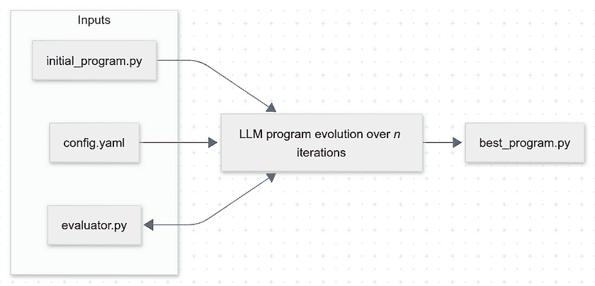
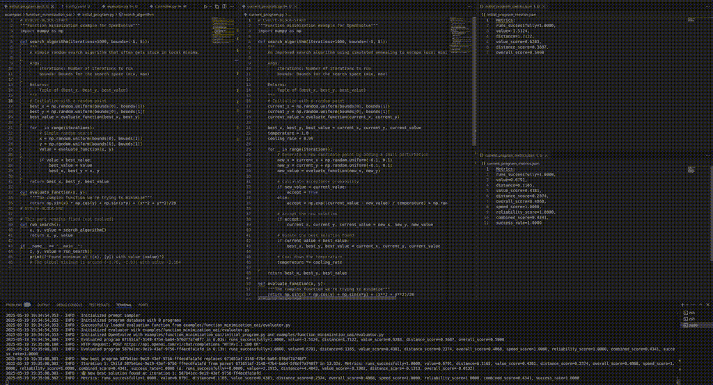

# Google 的 AlphaEvolve：开始使用进化编码代理

> 原文：[`towardsdatascience.com/googles-alphaevolve-getting-started-with-evolutionary-coding-agents/`](https://towardsdatascience.com/googles-alphaevolve-getting-started-with-evolutionary-coding-agents/)

# <mdspan datatext="el1747946688359" class="mdspan-comment">引言</mdspan>

[AlphaEvolve](https://github.com/codelion/openevolve) [1] 是 Google DeepMind 的新兴编码代理，具有很大的潜力。让我们看看它是什么以及为什么它引起了轰动。谷歌论文的大部分内容都是关于 AlphaEvolve 通过其改进代码直到以真正好的方式解决问题来促进*新颖研究*的主张。令人惊讶的是，作者报告称 AlphaEvolve 已经实现了这样的研究突破。

在这篇文章中，我们将先介绍一些基本背景知识，然后深入研究 Google DeepMind 的论文，最后看看如何运行开源演示实现 [OpenEvolve](https://github.com/codelion/openevolve) [2]，这是 AlphaEvolve 论文精髓的开源实现。最后，你将准备好进行自己的实验！我们还将简要讨论可能的含义。

然而，你不会得到关于“它有多好”的绝对陈述。应用这个工具仍然需要大量劳动力和成本，尤其是对于困难问题。

事实上，很难确定这一突破的程度，它是建立在先前研究基础之上的。最重要的引用是 2023 年的另一篇 Google DeepMind 论文 [another](https://arxiv.org/abs/1504.04909) [4]。谷歌在这里确实提出了许多关于可能的研究应用的建议。他们似乎正在尝试扩大研究应用的范围：他们声称 AlphaEvolve 已经在他们的实验室产生了许多新颖的研究成果。

现在，其他研究人员必须复制这些结果并将它们置于上下文中，还需要创造更多证明其价值的证据。这并不简单，而且，这又将花费时间。

首次尝试将 AlphaEvolve 算法应用于开源项目在几天内就出现了。其中之一是 OpenEvolve，它以一种干净且易于理解的方式实现了解决方案。这有助于其他人评估类似的方法并确定它们的益处。

但让我们从开始讲起。这一切都是关于什么的？

## 背景知识：编码代理与进化算法

如果你正在阅读这篇文章，那么你可能已经听说过编码代理。它们通常将大型语言模型（LLMs）应用于以惊人的速度自动生成计算机程序。聊天机器人不是产生文本，而是生成 Python 代码或其他东西。通过在每次尝试后确认生成的程序输出，编码代理可以自动生成和改进可操作的计算机程序。有些人认为这是 LLM 能力的强大进化。故事是这样的：最初，LLMs 只是虚构和梦想出文本以及以其他模态（如图像）输出的内容。然后出现了能够处理待办事项列表、持续运行甚至管理自己记忆的代理。通过结构化的 JSON 输出和工具调用，这进一步扩展到让代理访问额外的服务。最后，开发了能够以可重复的方式创建和执行算法的编码代理。从某种意义上说，这使 LLM 能够通过扩展其能力来包括计算机长期以来就拥有的那些能力来作弊。

创建一个可靠的 LLM 系统还有很多工作要做，更多内容将在未来的文章中介绍。然而，对于 AlphaEvolve 来说，可靠性并不是首要关注的问题。它的任务范围有限，结果必须清晰可衡量（更多内容将在下文介绍）。

无论如何，编码代理。有很多。要实现自己的，你可以从像[smolagents](https://github.com/huggingface/smolagents)、[swarms](https://github.com/kyegomez/swarms)或[Letta](https://github.com/letta-ai)这样的框架开始。如果你只是想在有编码代理支持的情况下开始编码，流行的工具包括 GitHub [CoPilot](https://github.com/features/copilot)，集成在 VS Code 中，以及[Aider](https://aider.chat/)和[Cursor](https://www.cursor.com/)。这些工具通过实时提供从你的代码库到 LLM 的正确上下文来内部编排 LLM 聊天机器人的交互。由于这些工具基于无状态的 LLM 接口生成半自主函数，因此它们被称为“代理”。

> > 真是愚蠢至极，竟然没想到这一点！

现在，谷歌正宣称基于编码代理的一种突破。这是否意味着什么重大且新的东西？嗯，其实并不是。他们应用了一些非常古老的东西。

回到 1809 年：查尔斯·达尔文出生。他的书《物种起源》，概述了自然选择导致生物进化的证据，使生物学家托马斯·亨利·赫胥黎发出了上述感叹。


图片由[Logan Gutierrez](https://unsplash.com/@photosoflogan?utm_source=medium&utm_medium=referral)在[Unsplash](https://unsplash.com/?utm_source=medium&utm_medium=referral)上提供

当然，除了生物进化之外，还有其他形式的进化。在比喻中，你几乎可以声称任何适者生存导致特定结果的情况。爱，星星——你叫它什么名字都行。在计算机科学中，进化算法（遗传算法作为最常见的子类）遵循一个简单的方法。首先，随机生成*n*个配置。然后，检查是否有任何配置满足你的需求（评估它们的适应性）。如果是这样，就停止。如果不是，选择一个或多个父代配置——理想情况下，非常适应的配置——通过混合父母创建一个新的配置（这是可选的，被称为交叉；单个父代也可以工作），可选地添加随机突变，移除一些之前的配置——最好是弱的配置——然后重新开始。

在这里有三点需要注意：

+   适应性函数的必要性意味着存在可衡量的成功。AlphaEvolve 不会自己进行科学研究，为你找到任何东西。它在一个完美定义的目标上工作，对于这个目标，你可能已经有一个解决方案，只是不是最好的。

+   为什么不把目标定为“变得非常富有”？一个简短的警告：进化算法很慢。它们需要一个大的种群规模和许多代才能偶然达到局部最优。而且它们并不总是能识别全局最优解。这就是为什么我们最终到了这里，对吧？

    如果目标过于宽泛，初始种群过于原始，请准备好让它运行几百万年，结果仍然不明朗。

+   为什么引入突变？在进化算法中，它们有助于克服轻易陷入局部最优的缺陷。没有随机性，算法可能会迅速找到一个较差的解决方案，并陷入一个无法通过进一步进化带来改进的路径，这仅仅是因为可能的父代配置种群可能不足以允许创造一个更好的个体。这启发了 AlphaEvolve 的一个核心设计目标：混合强大和弱小的 LLM，以及将精英父代配置与更平凡的配置混合。这种多样性使得迭代（思想探索）更快，同时仍然留有创新的空间。

## 背景知识：关于如何实现基本进化算法的示例

为了手指练习或为了基本了解进化算法通常可能看起来是什么样子，这是一个例子：

```py
import random

POP, GEN, MUT = 20, 100, 0.5
f = lambda x: -x**2 + 5

# Create an equally distributed start population
pop = [random.uniform(-5, 5) for _ in range(POP)]

for g in range(GEN):
    # Sort by fitness
    pop.sort(key=f, reverse=True)
    best = pop[0]
    print(f"gen #{g}: best x={best}, fitness={f(best)}")

    # Eliminate the worst 50 %
    pop = pop[:POP//2]

    #  Double the number of individuals and introduce mutations
    pop = [p + random.gauss(0, MUT) for p in pop for _ in (0, 1)]

best = max(pop, key=f)
print(f"best x={best}, fitness=", f(best))
```

目标是通过将 *x* 尽可能地接近 *0* 来最大化适应度函数 *-x²+5*。系统初始化时使用的随机“种群”在每一代都会被修改。较弱的半数被淘汰，另一半通过在其自身上添加高斯值（一种随机突变）来产生“后代”。*注意：在给定的例子中，省略一半种群淘汰和引入“孩子”的过程是可以的。如果每个个体都发生突变，结果也会相同。然而，在其他实现中，例如通过两个父母混合产生后代的遗传算法，淘汰步骤是必要的。*

由于程序是随机的，每次执行它时，输出都会有所不同，但将与以下类似

> gen #0 最佳 x=0.014297341502906846 适应度=4.999795586025949
> 
> gen #1 最佳 x=-0.1304768836196552 适应度=4.982975782840903
> 
> gen #2 最佳 x=-0.06166058197494284 适应度=4.996197972630512
> 
> gen #3 最佳 x=0.051225496901524836 适应度=4.997375948467192
> 
> gen #4 最佳 x=-0.020009912942005076 适应度=4.999599603384054
> 
> gen #5 最佳 x=-0.002485426169108483 适应度=4.999993822656758
> 
> [..]
> 
> best x=0.013335836440791615, fitness=4.999822155466425

大概接近零吧。简单吧？你可能也注意到了进化过程中的两个属性：

+   结果是随机的，但最适应的候选人会收敛。

+   进化并不一定识别出最优解，甚至不是显而易见的最优解。

在 LLM（大型语言模型）的背景下，事情变得更加有趣。LLM 可以智能地引导进化的方向。就像你和我一样，它会推断出 *x* 必须为零。

## 它是如何工作的：认识 AlphaEvolve

AlphaEvolve 是一个使用智能提示生成、进化算法来优化提供上下文以及两个强大基础 LLM 的编码代理。主要模型可以快速生成许多想法，而更强的二级 LLM 则提高了质量水平。算法不依赖于使用的 LLM 模型，但更强大的模型会产生更好的结果。

在 AlphaEvolve 中，对于 LLM 的进化意味着其上下文随着每次推理而适应。本质上，LLM 被提供了关于成功和失败的过去代码尝试的信息，并且这个程序列表通过每次迭代的进化算法得到优化。上下文还提供了关于程序适应度结果的反馈，表明它们的优缺点。也可以添加特定问题的指令（LLM 研究人员和人类研究人员形成一个团队，以某种方式互相帮助）。最后，上下文包括元提示，这是 LLM 的自我管理指令。这些元提示以与最适应代码结果相同的方式进化。

实施的进化算法可能与此相关。它结合了一种名为[MAP-Elites](https://arxiv.org/abs/1504.04909) [5]的策略，以及基于岛屿的种群模型，例如传统的遗传算法。基于岛屿的种群模型允许亚种群独立进化。另一方面，MAP-Elites 是一种智能搜索策略，它选择在多个维度上表现良好的最适候选者。通过结合这些方法，探索和利用得到了混合。在一定的速率下，精英被选中并增加了基因池的多样性。

适应性被确定为多维值向量，*每个*值都应最大化。似乎没有使用加权，即所有值都同等重要。作者们驳斥了这种做法可能成为问题的担忧，指出好的代码通常可以提高多个指标的结果。

适应性评估分为两个阶段（“评估级联”）：首先，进行快速测试以过滤掉明显较差的候选解决方案。只有在第二阶段，可能需要更多执行时间，才会进行完整评估。其目的是通过快速考虑许多想法来最大化吞吐量，并且不浪费比必要的更多资源在不良想法上。

整个方法很容易并行化，这也帮助提高了吞吐量。作者们考虑得很长远：他们提到，即使单个测试需要数百个计算小时的问题评估，在这种设置下也是可能的。不良候选者被早期淘汰，许多长时间运行的测试在数据中心同时进行。

LLM 的输出是 LLM 想要替换的代码序列列表。这意味着 LLM 不需要重新生成整个程序，而是可以触发对特定行的修改。这或许允许 AlphaEvolve 更有效地处理更大的代码库。为了实现这一点，LLM 在其系统提示中被告知使用以下 diff 输出格式：

```py
<<<<<<< SEARCH
search text
=======
replace text
>>>>>>> REPLACE
```

## 论文的关键发现

论文中大部分内容讨论了 AlphaEvolve 已经产生的相关研究进展。研究问题通过代码和清晰的评估函数表达出来。这在数学、计算机科学和相关领域的问题中通常是可能的。

具体来说，作者们描述了 AlphaEvolve 产生的以下研究结果：

+   他们报告说，AlphaEvolve 找到了矩阵乘法算法的（略微）更快的算法。他们提到，这需要非平凡的 15 项显著进步。

+   他们用它来寻找不同数学问题中的搜索算法。

+   他们借助 AlphaEvolve 的帮助，能够提升数据中心调度效率。

+   他们让 AlphaEvolve 优化了一个 Verilog 硬件电路设计。

+   尝试优化编译器生成的代码产生了一些结果，速度提高了 15-32%。作者建议这可以系统地用来优化代码性能。

注意，这些结果的幅度[正在讨论中](https://news.ycombinator.com/item?id=43985489)。

除了 AlphaEvolve 产生的直接研究结果外，作者们的消融研究也很有见地。在消融研究中，研究人员通过系统地移除系统的一部分来尝试确定哪些部分对结果贡献最大（见第 18 页，图 8）。我们了解到：

+   LLM 的自我引导元提示贡献不大。

+   主要模型与次要模型混合略微提高了结果。

+   提示中的手工编写上下文对结果贡献很大。

+   最后，产生传递给 LLM 的进化上下文的进化算法对结果产生了所有的影响。**结果表明，AlphaEvolve 的进化方面对于成功解决问题至关重要**。这表明进化提示的优化可以极大地提高 LLM 的能力。

## OpenEvolve：设置

是时候开始使用 OpenEvolve 进行自己的实验了。设置很简单。首先，决定你是否想使用 Docker。Docker 可能会添加一个额外的安全层，因为编码代理可能存在安全风险（见下文）。

要本地安装，只需克隆 Git 仓库，创建一个虚拟环境，然后安装需求：

```py
git clone https://github.com/codelion/openevolve.git
cd openevolve
python3 -m venv .venv
source .venv/bin/activate
pip install -e .
```

然后，你可以在目录中使用示例中的编码“问题”运行代理：

```py
python3 openevolve-run.py \
    examples/function_minimization/initial_program.py \
    examples/function_minimization/evaluator.py \
    --config examples/function_minimization/config.yaml \
    --iterations 5
```

要使用更安全的 Docker 方法，请输入以下命令序列：

```py
git clone https://github.com/codelion/openevolve.git
cd openevolve
make docker-build
docker run --rm -v $(pwd):/app \
    openevolve \
    examples/function_minimization/initial_program.py \
    examples/function_minimization/evaluator.py \
    --config examples/function_minimization/config.yaml \
    --iterations 5
```

## OpenEvolve：实现问题

要创建一个新的问题，将示例程序复制到一个新的文件夹中。

```py
cp examples/function_minimization/ examples/your_problem/
```

代理将优化初始程序，并以最佳程序作为输出。根据你投入的迭代次数，结果可能会越来越好，但没有确定性的逻辑来确定理想的停止点。通常，你有一个“计算预算”会耗尽，或者你等待结果似乎达到平台期。



代理接受一个初始程序和评估程序作为输入，并使用给定的配置，产生初始程序的新的进化版本。对于每个进化版本，评估器执行当前的程序进化版本，并将指标返回给代理，代理的目标是最大化这些指标。一旦达到配置的迭代次数，找到的最佳程序将被写入文件。（图片由作者提供）

让我们从一个非常基础的例子开始。

在您的 *initial_program.py* 中，定义您的函数，然后使用 `# EVOLVE-BLOCK-START` 和 `# EVOLVE-BLOCK-END` 注释标记您希望代理能够修改的部分。代码不一定需要做任何事情；它只需简单地返回一个有效、恒定的值。然而，如果代码已经代表了一个您希望优化的基本解决方案，您将在进化过程中看到更快的结果。*initial_program.py* 将由 *evaluator.py* 执行，因此您可以定义任何函数名称和逻辑。这两个必须相互匹配。让我们假设这是您的初始程序：

```py
# EVOLVE-BLOCK-START
def my_function(x):
  return 1
# EVOLVE-BLOCK-END
```

接下来，实现评估函数。还记得之前的级联评估吗？有两个评估函数：*evaluate_stage1(program_path)* 执行基本试验以查看程序是否运行正常，基本上看起来不错：执行，测量时间，检查异常和有效返回类型等。

在第二阶段，*evaluate(program_path)* 函数应该对提供的程序进行全面评估。例如，如果程序是随机的并且因此不总是产生相同的输出，在第二阶段，您可能需要多次执行它（评估时间更长），就像在 *examples/function_minimization/* 文件夹中的示例代码中所做的那样。每个评估函数必须返回您选择的指标，只需确保“越大越好”，因为这是进化算法要优化的。这允许您将程序优化为不同的目标，例如执行时间、准确性、内存使用等。—无论您能测量和返回什么。

```py
from smolagents.local_python_executor import LocalPythonExecutor

def load_program(program_path, additional_authorized_imports=["numpy"]):
    try:
        with open(program_path, "r") as f:
            code = f.read()

        # Execute the code in a sandboxed environment
        executor = LocalPythonExecutor(
            additional_authorized_imports=additional_authorized_imports
        )
        executor.send_tools({}) # Allow safe builtins
        return_value, stdout, is_final_answer_bool = executor(code)

        # Confirm that return_value is a callable function
        if not callable(return_value):
            raise Exception("Program does not contain a callable function")

        return return_value

    except Exception as e:
        raise Exception(f"Error loading program: {str(e)}")

def evaluate_stage1(program_path):
    try:
        program = load_program(program_path)
        return {"distance_score": program(1)}
    except Exception as e:
        return {"distance_score": 0.0, "error": str(e)}

def evaluate(program_path):
    try:
        program = load_program(program_path)

        # If my_function(x)==x for all values from 1..100, give the highest score 1.
        score = 1 - sum(program(x) != x for x in range(1, 101)) / 100

        return {
            "distance_score": score,  # Score is a value between 0 and 1
        }
    except Exception as e:
        return {"distance_score": 0.0, "error": str(e)}
```

这个评估程序需要安装 smolagents，它用于沙盒代码执行：

```py
pip3 install smolagents
```

使用这个评估器，*my_function(x)* 必须对每个测试值返回 *x*。如果它做到了，它将获得 *1* 分。代理会优化初始程序以做到这一点吗？

在尝试之前，请设置您的配置选项在 *config.yaml* 中。可用的完整选项列表在 [*configs/default_config.yml*](https://github.com/codelion/openevolve/blob/main/configs/default_config.yaml)*.* 这里是配置 LLM 的一些重要选项：

```py
log_level: "INFO"           # Logging level (DEBUG, INFO, WARNING, ERROR, CRITICAL)

llm:
  # Primary model (used most frequently)
  primary_model: "o4-mini"
  primary_model_weight: 0.8 # Sampling weight for primary model

  # Secondary model (used for occasional high-quality generations)
  secondary_model: "gpt-4o"
  secondary_model_weight: 0.2 # Sampling weight for secondary model

  # API configuration
  api_base: "https://api.openai.com/v1/"
  api_key: "sk-.."

prompt:
  system_message: "You are an expert programmer specializing in tricky code 
                   problems. Your task is to find a function that returns an 
                   integer that matches an unknown, but trivial requirement."
```

您可以使用类似以下设置从另一个与 OpenAI 兼容的端点配置 LLM，例如本地 Ollama 安装：

```py
llm:
  primary_model: "gemma3:4b"
  secondary_model: "cogito:8b"
  api_base: "http://localhost:11434/v1/"
  api_key: "ollama"
```

*注意：如果 config.yml 中未设置 API 密钥，您必须将其作为环境变量提供。在这种情况下，您可以使用以下方式调用您的程序：

```py
export OPENAI_API_KEY="sk-.."
python3 openevolve-run.py \
    examples/your_problem/initial_program.py \
    examples/your_problem/evaluator.py \
    --config examples/your_problem/config.yaml \
    --iterations 5
```

然后，它会迅速完成...并且，神奇的是，它会工作！

你注意到我使用的系统提示了吗？

> 你是一位擅长解决复杂代码问题的专家程序员。你的任务是找到一个返回整数并匹配未知但简单要求的函数。

我第一次运行代理时，它尝试了“return 42”，这是一个合理的尝试。接下来的尝试是“return x”，当然，这就是答案。

OpenEvolve 仓库中*examples/function_minimization/*文件夹中的更难问题使得事情更有趣：



左上角：初始程序；中间：OpenEvolve 使用 OpenAI 模型进行不同尝试；右上角：初始指标；右下角：当前版本指标（50 倍速度，视频由作者提供）

在这里，我进行了两个实验，每个实验 100 次迭代。第一次尝试，以*cogito:14b*作为主要模型和次要模型，在我的系统上超过了一个小时。*注意，不建议没有更强的次要模型，但在我本地设置中，由于没有模型切换，这增加了速度。*

> [..]
> 
> 2025-05-18 18:09:53,844 – INFO – 新的最佳程序 18de6300-9677-4a33-b2fb-9667147fdfbe 取代了 ad6079d5-59a6-4b5a-9c61-84c32fb30052
> 
> [..]
> 
> 2025-05-18 18:09:53,844 – INFO – 🌟 在第 5 次迭代中找到新的最佳解决方案：18de6300-9677-4a33-b2fb-9667147fdfbe
> 
> [..]
> 
> 进化完成！
> 
> 最佳程序指标：
> 
> runs_successfully: 1.0000
> 
> value: -1.0666
> 
> distance: 2.7764
> 
> value_score: 0.5943
> 
> distance_score: 0.3135
> 
> overall_score: 0.5101
> 
> speed_score: 1.0000
> 
> reliability_score: 1.0000
> 
> combined_score: 0.5506
> 
> success_rate: 1.0000

相比之下，使用 OpenAI 的*gpt-4o*作为主要模型和*gpt-4.1*作为更强的次要模型，我在 25 分钟内得到了结果：

> 进化完成！
> 
> 最佳程序指标：
> 
> runs_successfully: 1.0000
> 
> value: -0.5306
> 
> distance: 2.8944
> 
> value_score: 0.5991
> 
> distance_score: 0.3036
> 
> overall_score: 0.5101
> 
> speed_score: 1.0000
> 
> reliability_score: 1.0000
> 
> combined_score: 0.5505
> 
> success_rate: 1.0000

令人惊讶的是，尽管 GPT-4o 比 140 亿参数的*cogito* LLM 的能力远强，但最终的指标似乎相似。*注意：数字越大越好！该算法旨在最大化所有指标。*然而，在观察 OpenAI 进行迭代时，它似乎尝试了更多创新组合。也许问题太简单，它最终没有获得优势。

## 关于安全性的说明

请注意，尽管编码代理存在相当大的安全风险，但 OpenEvolve 本身并不实施任何类型的控制措施。HuggingFace 团队已记录了[与编码代理相关的安全考虑](https://huggingface.co/docs/smolagents/tutorials/secure_code_execution)。为了将安全风险降低到合理的程度，上述评估函数使用了沙箱执行环境，该环境仅允许导入白名单库和执行白名单函数。如果 LLM 生成了一个尝试禁止导入的程序，则会触发如下异常：

> 加载程序错误：代码在行‘import os’处执行失败，原因：InterpreterError

没有这项额外的工作，执行代码将完全访问您的系统，可以删除文件等。

## 讨论和展望

所有这些意味着什么，又将如何被使用？

运行准备充分的实验需要相当的计算能力，而且只有少数人能够指定它们。结果缓慢出现，因此将它们与替代方案进行比较并不简单。然而，从理论上讲，你可以用代码直接或间接地描述任何问题。

关于非代码用例或我们缺乏适当指标的情况怎么办？也许是一些基于另一个 LLM 评估（例如文本质量）的适应度函数。一组 LLM 审稿人可以进行评估和评分。事实上，AlphaEvolve 的作者也在暗示这个选项。他们写道：

> 虽然 AlphaEvolve 确实允许使用 LLM 提供的想法评估，但这并不是我们优化的设置。然而，同时进行的工作表明这是可能的[3]

论文中讨论的另一种观点是使用 AlphaEvolve 来改进基础 LLMs 本身。但这并不意味着超速进化。论文提到，“改进 AlphaEvolve 下一个版本的反馈循环大约需要几个月”。

关于编码代理，我想知道哪些基准会有帮助，以及 AlphaEvolve 在这些基准上的表现会如何。[SWE-Bench](https://medium.com/@te2be/coding-agents-open-source-approaches-on-swe-bench-074cc28c5bb0)就是这样一种基准。我们能否以这种方式进行测试？

最后，关于 OpenEvolve 的前景如何？希望它能够继续。其作者表示，重现 AlphaEvolve 的一些结果是他们的目标。

更重要的是：进化编码代理有多少潜力，我们如何才能最大化这些工具的影响并实现更广泛的可访问性？我们能否以某种方式扩展我们提供给它们的问题的数量？

感谢阅读！

## 参考文献

1.  Novikov 等人，[AlphaEvolve：一个 Gemini 驱动的用于设计高级算法的编码代理](https://deepmind.google/discover/blog/alphaevolve-a-gemini-powered-coding-agent-for-designing-advanced-algorithms/) (2025)，Google DeepMind

1.  Asankhaya Sharma，[OpenEvolve：AlphaEvolve 的开源实现](https://github.com/codelion/openevolve) (2025)，Github

1.  Gottweis 等人，[迈向人工智能合著者](https://arxiv.org/abs/2502.18864) (2025)，arXiv:2502.18864

1.  Romera-Paredes 等人，[大型语言模型程序搜索中的数学发现](https://arxiv.org/abs/1504.04909) (2023)，自然

1.  Mouret 和 Clune，[通过映射精英照亮搜索空间（2015）](https://arxiv.org/abs/1504.04909)，arXiv:1504.04909
