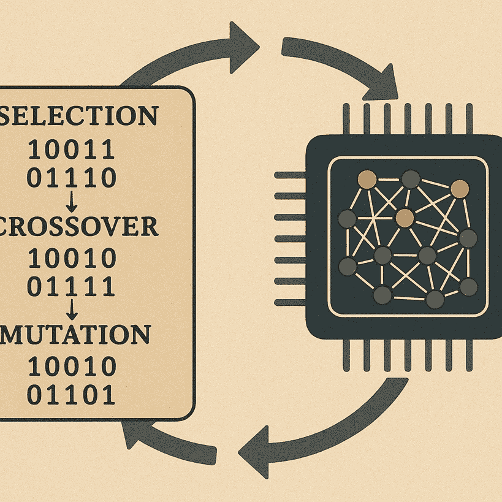

# 谷歌的 AlphaEvolve 正在进化新的算法——它可能是一个游戏规则的改变者

> 原文：[`towardsdatascience.com/googles-alphaevolve-is-evolving-new-algorithms-and-it-could-be-a-game-changer/`](https://towardsdatascience.com/googles-alphaevolve-is-evolving-new-algorithms-and-it-could-be-a-game-changer/)

将 AlphaEvolve 想象为与大型语言模型耦合的遗传算法。这幅图是由作者使用包括 Dall-E3 通过 ChatGPT 在内的各种工具创作的。

<mdspan datatext="el1747355961098" class="mdspan-comment">大型语言模型</mdspan>无疑已经革命性地改变了我们许多人对待编码的方式，但它们往往更像是一个超级实习生，而不是经验丰富的建筑师。错误、bug 和幻觉时常发生，甚至可能发生代码运行良好，但…它并没有做我们想要的事情。

现在，想象一个 AI 不仅根据它所看到的编写代码，而且积极地*进化*它。出人意料的是，这意味着你增加了编写正确代码的机会；然而，它远远超出了这个范围：谷歌展示了它可以使用这种 AI 方法来发现更快、更高效，有时甚至是全新的算法。

我在谈论 AlphaEvolve，这是谷歌 DeepMind 最近的一个重磅炸弹。让我再说一遍：它不仅仅是一个代码生成器，而是一个生成和进化代码的系统，允许它发现新的算法。由谷歌强大的 Gemini 模型（我打算很快介绍，因为我对其力量感到震惊！）提供支持，AlphaEvolve 可能会彻底改变我们对待编码、数学、算法设计，甚至数据分析的方式。

## AlphaEvolve 是如何“进化”代码的？

想象一下，就像自然选择，但针对软件。也就是说，考虑一下已经存在于数据科学、数值方法和计算数学几十年的遗传算法。简而言之，AlphaEvolve 不是每次都从头开始，而是从一个初始的代码片段开始——可能是人类提供的“骨架”，其中标明了需要改进的特定区域——然后对其进行迭代的过程进行优化。

让我在这里总结一下 Deepmind 的白皮书中详细说明的程序：

**智能提示**：AlphaEvolve“足够聪明”，可以为底层的 Gemini LLM 构建自己的提示。这些提示指示 Gemini 像某个特定领域的世界级专家一样行动，拥有来自先前尝试的上下文，包括似乎工作正确的点和明显的失败点。这就是像 Gemini 这样的模型（甚至在谷歌的 AI 工作室中你可以运行多达一百万个标记）的巨大上下文窗口发挥作用的地方。

**创造性突变：** 然后 LLM 生成一个多样化的“候选”解决方案池——原始代码的变体和突变，探索解决给定问题的不同方法。这非常接近常规遗传算法的内部工作原理。

**适者生存：** 再次像在遗传算法中一样，但候选解决方案会自动编译、运行，并严格根据预定义的指标进行评估。

**顶级程序的繁殖：** 表现最好的解决方案被选中，成为下一代“父母”，就像在遗传算法中一样。父母程序的优良特性被反馈到提示机制中。

**重复（以进化）：** 这个循环——生成、测试、选择、学习——是重复的，并且随着每一次迭代，AlphaEvolve 探索可能的程序的大搜索空间，从而逐渐聚焦于更好和更好的解决方案，同时清除那些失败的方案。你让它运行的时间越长（研究人员称之为“测试时间计算”），解决方案可以变得更加复杂和优化。

## 建立在先前的尝试之上

AlphaEvolve 是早期 Google 项目如 AlphaCode（解决竞技编程）和 FunSearch（更直接地说）的继承者。FunSearch 是一个令人着迷的概念证明，展示了 LLM 如何通过进化小的 Python 函数来发现新的数学见解。

AlphaEvolve 将这个概念“注入了类固醇”。我是指这个意思……

首先，由于 Gemini 拥有巨大的 token 窗口，AlphaEvolve 可以处理整个代码库，长达数百行，而不仅仅是像早期测试 FunSearch 那样的微小函数。其次，因为像其他 LLM 一样，Gemini 已经看到了成千上万种代码，涉及数十种编程语言；因此，它涵盖了更广泛的任务（因为通常不同的语言在某个领域比其他领域使用得更多），它成为了一种多语言程序员。

注意，随着更智能的 LLM 作为引擎，AlphaEvolve 本身可以进化，以在寻找解决方案和最优程序时变得更加快速和高效。

## AlphaEvolve 在现实世界问题上的令人惊叹的结果

在白皮书中展示了以下最有趣的应用：

+   **优化 Google 数据中心效率：** AlphaEvolve 发现了一种新的调度启发式方法，在 Google 的计算资源中节省了 0.7%。这可能看起来很小，但考虑到 Google 的规模，这意味着实质性的生态和货币削减！

+   **设计更好的 AI 芯片：** AlphaEvolve 可以简化 Google 的 TPU 中的一些复杂电路，特别是对于现代 AI 的生命线——矩阵乘法操作。这提高了计算速度，再次有助于降低生态和经济成本。

+   **更快的 AI 训练：**AlphaEvolve 甚至将它的优化目光转向了内部，通过加速训练它所依赖的 Gemini 模型所使用的矩阵乘法库！这意味着 AI 训练时间略有但显著减少，再次降低了生态和经济成本！

+   **数值方法：**在一种验证测试中，AlphaEvolve 被释放到超过 50 个臭名昭著的数学难题中。在其中的大约 75%中，它独立地重新发现了最著名的人类解决方案！

## 向着自我改进的 AI？

工具如 AlphaEvolve 的最深远影响之一是 AI 能够通过“良性循环”改进 AI 模型本身。此外，更高效的模式和硬件使 AlphaEvolve 本身更加强大，使其能够发现更深层次的优化。这是一个可能极大地加速 AI 进步并导致未知领域的反馈循环。这是某种使用 AI 来使 AI 变得更好、更快、更智能的方式——这是通往更强大甚至可能是通用人工智能道路上的真正一步。

不考虑这个反思，它很快就会接近科学功能的领域，关键是对于科学、工程和计算中的一大类问题，AlphaEvolve 可能代表一个范式转变。作为一名计算化学家和生物学家，我自己使用基于 LLMs 和推理 AI 系统的工具来协助我的工作，编写和调试程序，测试它们，更快地分析数据等等。现在 Deepmind 所展示的，更加清晰地表明我们正走向一个未来，AI 不仅仅是执行人类的指令，而是成为发现和创新中的创造性伙伴。

已经有几个月的时间，我们正在从完成我们代码的 AI 转向几乎完全创建代码的 AI，像 AlphaFold 这样的工具将推动我们进入 AI 仅仅坐着解决问题（或为我们！）的时代，编写和进化代码以获得最优解，甚至可能是完全意想不到的解决方案。毫无疑问，接下来的几年将会非常疯狂。

## 参考文献和相关阅读

+   Deepmind 的[博客文章](https://deepmind.google/discover/blog/alphaevolve-a-gemini-powered-coding-agent-for-designing-advanced-algorithms/)和[关于 AlphaEvolve 的白色论文](https://storage.googleapis.com/deepmind-media/DeepMind.com/Blog/alphaevolve-a-gemini-powered-coding-agent-for-designing-advanced-algorithms/AlphaEvolve.pdf)

+   [包含 AlphaEvolve 数学发现的 Google Colab 笔记本](https://colab.research.google.com/github/google-deepmind/alphaevolve_results/blob/master/mathematical_results.ipynb#scrollTo=5RChGCn7d8eP)，概述在论文的第三部分！

+   [通过自然语言请求，让 LLMs 访问函数进行强大的数据分析与绘图](https://towardsdatascience.com/powerful-data-analysis-and-plotting-via-natural-language-requests-by-giving-llms-access-to-9d34841c2a5d/)

+   [New DeepMind Work Unveils Supreme Prompt Seeds for Language Models](https://medium.com/data-science/new-deepmind-work-unveils-supreme-prompt-seeds-for-language-models-e95fb7f4903c)

***[www.lucianoabriata.com](https://www.lucianoabriata.com/)** 我写关于我广泛兴趣范围内的一切：自然、科学、技术、编程等。**[通过电子邮件订阅我的新故事](https://lucianosphere.medium.com/subscribe)**。要**咨询小任务**，请查看我的**[服务页面](https://lucianoabriata.altervista.org/services/index.html)**。您可以通过**[这里联系我](https://lucianoabriata.altervista.org/office/contact.html)**。您还可以**[在这里给我小费](https://paypal.me/LAbriata)**。*
