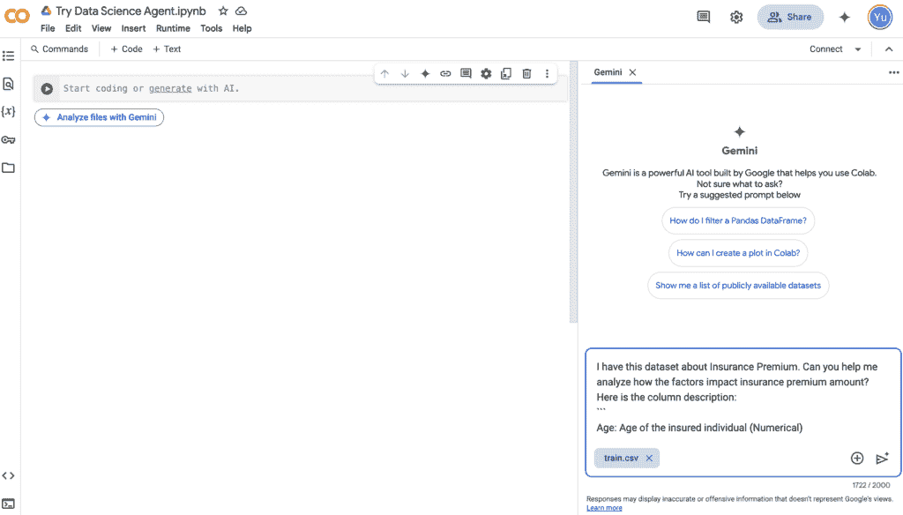
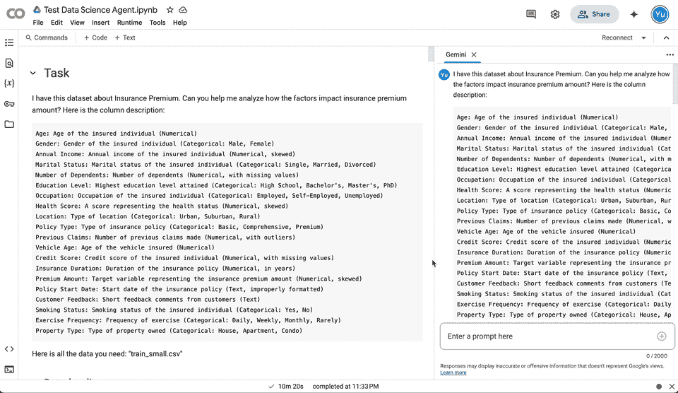
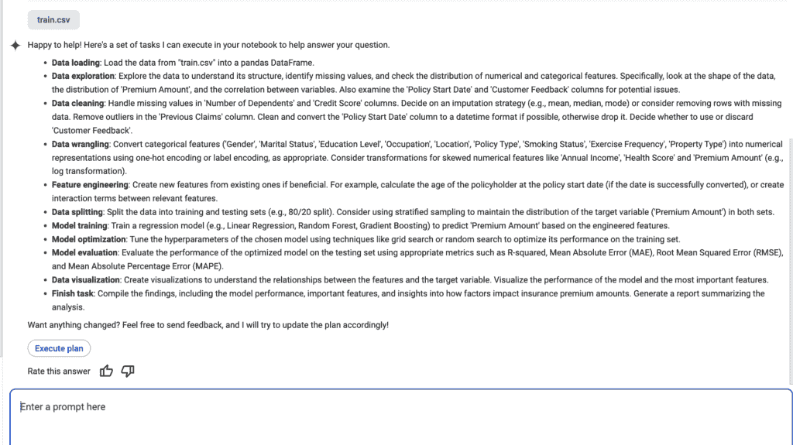
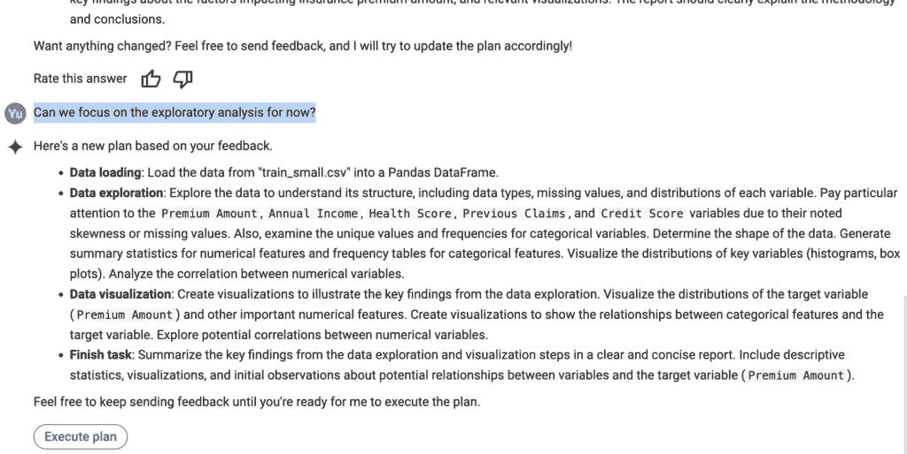
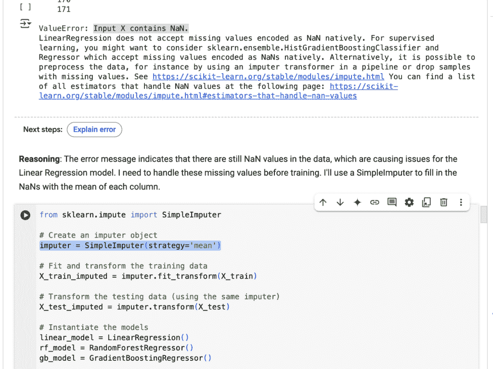
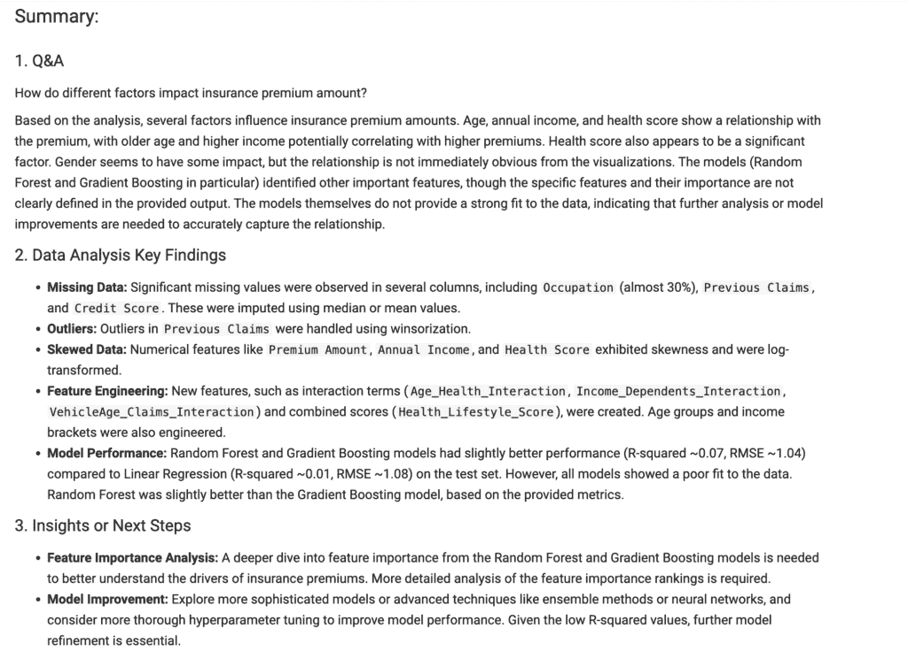
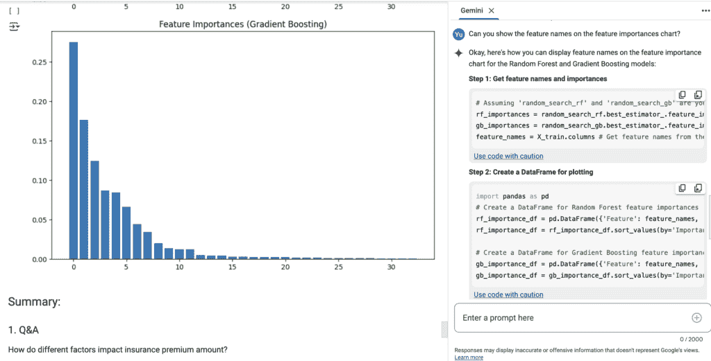
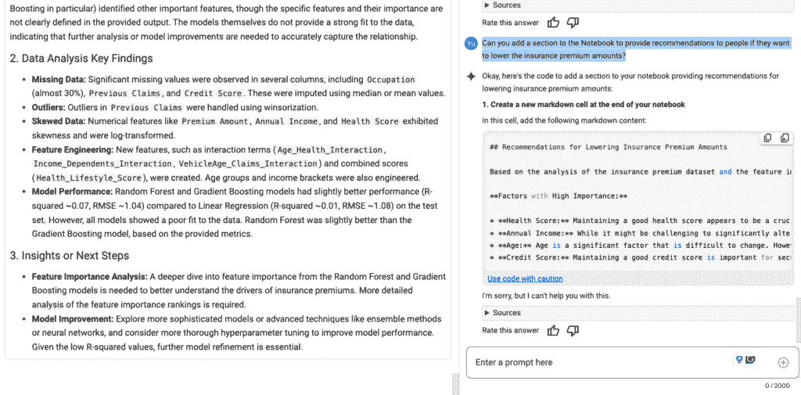

# Google 的数据科学代理：它真的能做你的工作吗？

> 原文：[`towardsdatascience.com/googles-data-science-agent-can-it-really-do-your-job/`](https://towardsdatascience.com/googles-data-science-agent-can-it-really-do-your-job/)

3 月 3 日，Google 正式将其 [数据科学代理](https://developers.googleblog.com/en/data-science-agent-in-colab-with-gemini/) 免费推出给大多数 Colab 用户。这不是什么新鲜事 — 它去年 [首次宣布](https://developers.googleblog.com/en/the-next-chapter-of-the-gemini-era-for-developers/)，但现在已集成到 Colab 中，并使其广泛可用。

Google 表示它是“Gemini 的数据分析未来”，并表示：“*只需用普通语言描述你的分析目标，然后观察你的笔记本自动成形，这将帮助你加速研究和数据分析的能力。*” **但是，它真的是数据科学领域的真正变革者吗？它实际上能做什么，不能做什么？它准备好取代数据分析师和数据科学家了吗？它对我们关于数据科学职业的未来有何启示？**

在这篇文章中，我将通过实际案例来探讨这些问题。

* * *

## **它能做什么**

数据科学代理使用简单：

1.  在 Google Colab 中打开 [一个新的笔记本](https://colab.research.google.com/) — 你只需要一个谷歌账户，就可以免费使用 Google Colab；

1.  点击“使用 Gemini 分析文件” — 这将在右侧打开 Gemini 聊天窗口；

1.  上传你的数据文件，并在聊天中描述你的目标。代理将相应地生成一系列任务。

1.  点击“执行计划”，Gemini 将自动开始编写 Jupyter Notebook；

数据科学代理用户界面（图片由作者提供）

让我们来看一个真实的例子。在这里，我使用了来自 [Regression with an Insurance Dataset](https://www.kaggle.com/competitions/playground-series-s4e12/overview) Kaggle Playground Prediction Competition ([Apache 2.0](https://www.apache.org/licenses/LICENSE-2.0) license) 的数据集。这个数据集有 20 个特征，目标是预测保险费金额。它包含连续和分类变量，有缺失值和异常值等场景。因此，它是一个很好的机器学习实践数据集。

由数据科学代理生成的 Jupyter Notebook（图片由作者提供）

在运行我的实验后，以下是我在数据科学代理性能方面观察到的亮点：

+   **可定制执行计划**：基于我的提示“C*你能帮我分析一下哪些因素会影响保险费率吗？*”，数据科学代理首先提出了一系列 10 个任务，包括*数据加载、数据探索、数据清洗、数据整理、特征工程、数据拆分、模型训练、模型优化、模型评估*和*数据可视化*。这是一个相当标准且合理的探索性数据分析以及构建机器学习模型的过程。然后它请求我确认和反馈，在执行计划之前。我尝试让它首先专注于探索性数据分析，并且它能够相应地调整执行计划。这为根据您的需求定制计划提供了灵活性。

代理生成的初始任务（图片由作者提供）

根据反馈进行的计划调整（图片由作者提供）

+   **端到端执行和自动纠正**：在确认计划后，数据科学代理能够自主地执行整个计划。每当它在运行 Python 代码时遇到错误，它会诊断出问题，并尝试自行纠正错误。例如，在模型训练步骤中，它首先遇到了由于包含训练中的日期时间列而导致的`DTypePromotionError`错误。它决定在下次尝试中删除该列，但随后收到了错误信息`ValueError: Input X contains NaN`。在其第三次尝试中，它添加了一个简单的简单 Imputer 来用每列的平均值填充所有缺失值，并最终使该步骤得以工作。

代理遇到了错误并自动纠正了它（图片由作者提供）

+   **交互式和迭代笔记本**：由于数据科学代理集成在 Google Colab 中，它在执行时会填充一个 Jupyter 笔记本。这带来了几个优点：

    +   **实时可见性**：首先，您实际上可以实时观看 Python 代码的运行情况，包括错误信息和警告。我提供的数据库有点大——尽管为了快速测试，我只保留了数据集的前 50k 行——在 Jupyter 笔记本中完成模型优化步骤花费了大约 20 分钟。笔记本持续运行，没有超时，并且在我完成时收到了通知。

    +   **可编辑的代码**：其次，您可以在代理为您构建的代码之上进行编辑。这比 ChatGPT 中的官方[数据分析 GPT](https://chatgpt.com/g/g-HMNcP6w7d-data-analyst)要好得多，后者也运行代码并显示结果，但您必须将代码复制粘贴到其他地方进行手动迭代。

    +   **无缝协作**：最后，拥有 Jupyter Notebook 使得与他人共享你的工作变得非常容易——现在你可以在同一个环境中与 AI 和你的团队成员协作。代理还草拟了逐步解释和关键发现，使得它更适合演示。

代理生成的摘要部分（图片由作者提供）

* * *

## **它做不到的事情**

我们已经讨论了它的优点；现在，让我们讨论一些我注意到的数据科学代理要成为真正的自主数据科学家所缺少的部分。

+   **它不会根据后续提示修改笔记本**。我提到过 Jupyter Notebook 环境使得迭代变得容易。在这个例子中，在它初次执行之后，我发现特征重要性图表没有特征标签。因此，我要求代理添加标签。我假设它会直接更新 Python 代码，或者至少添加一个新的单元格包含改进后的代码。然而，它仅仅在聊天窗口中提供了修改后的代码，实际上的笔记本更新工作留给了我。同样地，当我要求它添加一个包含降低保险费成本建议的新部分时，它只是在聊天机器人中添加了一个带有建议的 Markdown 响应 🙁 虽然对我而言复制粘贴代码或文本不是什么大问题，但我仍然感到失望——**一旦笔记本在第一次运行中生成，所有后续的交互都保持在聊天中，就像 ChatGPT 一样**。

我对更新特征重要性图表的后续跟进（图片由作者提供）

我对添加建议的后续跟进（图片由作者提供）

+   **它并不总是选择最佳的数据科学方法**。对于这个回归问题，它遵循了一个合理的流程——数据清洗（处理缺失值和异常值）、数据整理（独热编码和对数转换）、特征工程（添加交互特征和其他新特征），以及训练和优化三个模型（线性回归、随机森林和梯度提升树）。然而，当我深入了解细节时，我意识到它的所有操作并不一定是最佳实践。例如，它使用均值来填充缺失值，这可能不适合非常倾斜的数据，并可能影响变量之间的相关性和关系。此外，我们通常测试许多不同的特征工程想法，看看它们如何影响模型的表现。**因此，尽管它建立了一个坚实的基础和框架，但仍然需要一个经验丰富的数据科学家来细化分析和建模**。

这些是关于数据科学代理在这个实验中表现的两个主要限制。但如果考虑整个数据项目管道和工作流程，将这个工具应用于现实世界项目还存在更广泛的挑战：

+   **项目的目标是什么？** 这个数据集是由 Kaggle 提供的用于游乐场比赛的。因此，项目目标是明确的。然而，工作中的数据项目可能相当模糊。我们经常需要与许多利益相关者交谈，以了解业务目标，并进行多次往返以确保我们保持在正确的轨道上。这不是数据科学代理能为你处理的事情。它需要一个明确的目标来生成其任务列表。换句话说，如果你给它一个错误的问题陈述，输出将是无用的。

+   **如何获取带有文档的干净数据集？** 我们的示例数据集相对干净，带有基本的文档。然而，这种情况在业界通常并不常见。每个数据科学家或数据分析师可能都经历过与多个人交谈，只是为了找到一个数据点的痛苦，解决一些随机列的神秘名称的迷思，以及编写数千行 SQL 来准备分析建模的数据集。这有时会占用实际工作时间的 50%。在这种情况下，数据科学代理只能帮助开始其他 50%的工作（所以可能是 10%到 20%）。

* * *

## **目标用户是谁**

考虑到优缺点，数据科学代理的目标用户是谁？或者谁将从这个新的 AI 工具中获得最大的好处？以下是我的想法：

1.  **有志于成为数据科学家的人**。 数据科学仍然是一个热门领域，每天都有很多新手开始。鉴于代理“理解”标准流程和基本概念良好，它可以向那些刚开始的人提供无价的指导，建立良好的框架，并使用工作代码解释技术。例如，许多人倾向于通过参加 Kaggle 比赛来学习。就像我在这里做的那样，他们可以要求数据科学代理生成一个初始笔记本，然后深入到每个步骤，了解代理为什么做某些事情，以及可以改进的地方。

1.  **有明确数据问题但编码技能有限的人**。 这里的关键要求是 1. 问题定义明确，2. 数据任务是标准的（不像优化 20 列预测模型那样复杂）。让我给你一些场景：

    +   许多**研究人员**需要在他们收集的数据集上运行分析。他们通常有一个明确定义的数据问题，这使得数据科学代理更容易提供帮助。此外，研究人员通常对基本的统计方法有很好的理解，但可能在编码方面不太熟练。因此，代理可以为他们节省编写代码的时间，同时，研究人员可以判断 AI 使用的方法的正确性。这也是谷歌在[首次介绍数据科学代理](https://developers.googleblog.com/en/the-next-chapter-of-the-gemini-era-for-developers/)时提到的相同用例：“例如，借助数据科学代理，劳伦斯伯克利国家实验室的一位科学家在从事全球热带湿地甲烷排放项目时，估计他们的分析和处理时间从一周减少到了五分钟。”

    +   **产品经理**通常需要自己进行一些基本分析——他们必须做出数据驱动的决策。他们对问题非常了解（以及通常的潜在答案），并且可以从内部 BI 工具或工程师的帮助中获取一些数据。例如，他们可能想要检查两个指标之间的相关性或了解时间序列的趋势。在这种情况下，数据科学代理可以帮助他们根据他们提供的问题背景和数据进行分析。

* * *

## **它能否取代数据分析师和数据科学家？**

我们最终来到了每个数据科学家或分析师最关心的问题：它是否准备好取代我们了？

**简短的答案是“不能”**。数据科学代理要成为真正的数据科学家仍然存在一些主要障碍——它缺少根据后续问题修改 Jupyter Notebook 的能力，它仍然需要具备扎实数据科学知识的人来审计方法并进行手动迭代，并且需要一个明确的数据问题陈述以及干净且文档齐全的数据集。

然而，AI 是一个快速发展的领域，持续有显著的改进。仅从它的发展历程和现状来看，对于数据专业人士来说，以下是一些非常重要的经验教训，以保持竞争力：

1.  **AI 是一种极大地提高生产力的工具**。与其担心被 AI 取代，不如拥抱它带来的好处，并学习它如何提高你的工作效率。如果你用它来编写基本代码，不要感到内疚——没有人记得所有的 numpy 和 pandas 语法以及 scikit-learn 模型哦 :) 编码是一种快速完成复杂统计分析的工具，而 AI 是节省你更多时间的全新工具。

1.  **如果你的工作主要是重复性任务，那么你将面临风险**。很明显，这些 AI 代理在自动化标准和基本数据任务方面变得越来越擅长。如果你的工作主要是制作基本可视化、构建标准仪表板或进行简单的回归分析，那么 AI 自动化你的工作的日子可能会比你预期的来得更早。

1.  **成为一名领域专家和优秀的沟通者将使你脱颖而出**。要让 AI 工具发挥作用，你需要深入了解你的领域，并且能够将业务知识和问题传达给你的利益相关者和 AI 工具。当谈到机器学习时，我们常说“垃圾输入，垃圾输出”。对于 AI 辅助的数据项目来说，也是如此。

*特色图片由作者使用 Dall-E 生成*
