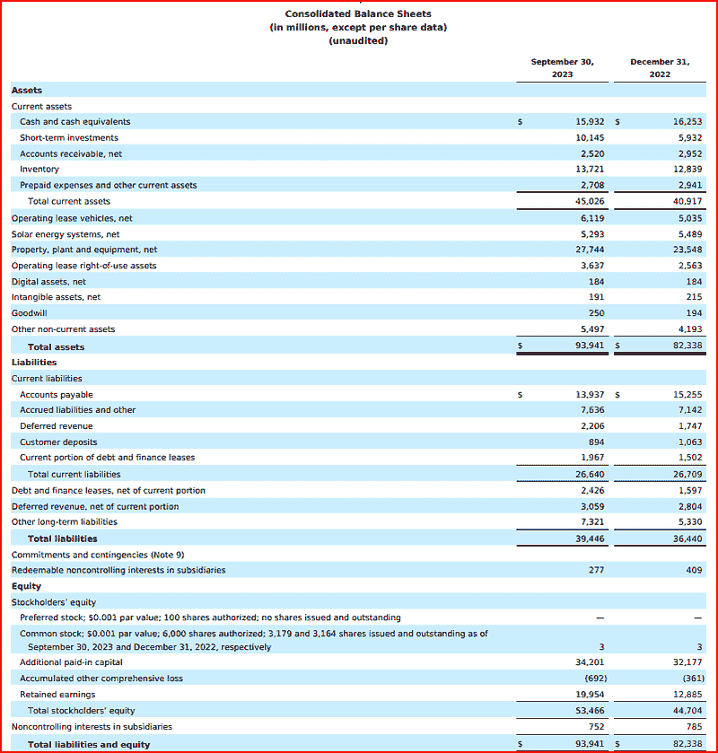
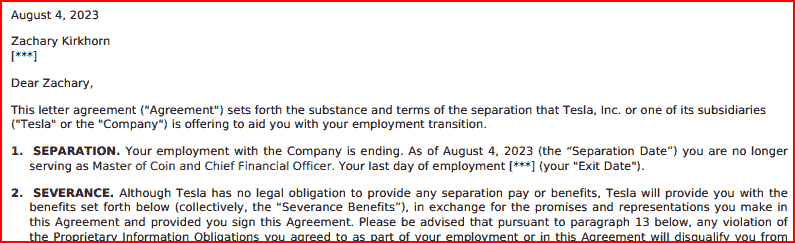
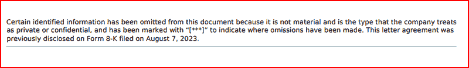

# Google 的 URL 上下文定位：RAG 棺材上的另一个钉子？

> 原文：[`towardsdatascience.com/googles-url-context-grounding-another-nail-in-rags-coffin/`](https://towardsdatascience.com/googles-url-context-grounding-another-nail-in-rags-coffin/)

<mdspan datatext="el1756187448592" class="mdspan-comment">Google 在 AI 相关发布上的热门势头持续不断。就在几天前，它为 Gemini 发布了一个名为 URL 上下文定位的新工具。</mdspan>

可以单独使用 URL 上下文定位，或与 Google 搜索定位结合，对互联网内容进行深入研究。

## 什么是 URL 上下文定位？

简而言之，这是一种通过编程方式让 Gemini 读取、理解并回答关于单个 Web URL（包括指向 PDF 的 URL）中的内容和数据的问题的方法，而无需执行我们所说的传统 RAG 处理。

换句话说，没有必要提取 URL 文本和内容，将其分块，向量化，存储等等。你告诉 Google 你感兴趣的 URL，然后就可以开始了。正如你将看到的，编码非常简单，而且非常准确。

正是因为这些原因，我说这可能是 RAG 棺材上的另一个钉子。

但它有效吗？让我们看看几个例子。

我首先将在 Windows 的 Ubuntu WSL2 下设置我的开发环境。请跟随或使用您习惯的方法。

```py
$ uv init url_context
$ cd url_context
$ uv venv url_context
$ uv pip install jupyter
$ uv pip install "google-genai>=1.16.0"
```

你还需要一个 Google API 密钥。如果你还没有，请前往 Google AI Studio，如果需要的话进行注册，并设置你的密钥。这样做的方法将在仪表板页面的右上角附近。

[**Google AI Studio**](https://aistudio.google.com/)

现在运行此命令应该在您的浏览器中打开一个新的标签页，显示一个笔记本。

```py
$ jupyter notebook
```

## 应该注意的一些限制

在我们进行编码示例之前，您应该了解一些关于 URL 上下文定位使用限制和约束。

1.  每个请求最多可以包含 20 个 URL。

1.  从单个 URL 检索的内容最大大小为 34MB。

1.  以下内容类型**不支持**

+   付费墙内容

+   YouTube 视频

+   Google Workspace 文件，如 Google Docs 或电子表格

+   视频和音频文件

话虽如此，让我们继续我们的示例。

### 示例 1—询问一个复杂的 PDF

当我对 RAG 或类似处理针对 PDF 中的数据进行测试时，我常用的测试数据文件是特斯拉的 10-Q 季度收益报告。它大约有 50 页长，有一些相当复杂的布局，包括表格等。

由于它是一份 SEC 文件，这也意味着它是公开可用的，并且完全免费使用其内容。

如果你想亲自查看，文档可以在以下 URL 找到。

[`ir.tesla.com/_flysystem/s3/sec/000162828023034847/tsla-20230930-gen.pdf`](https://ir.tesla.com/_flysystem/s3/sec/000162828023034847/tsla-20230930-gen.pdf)

对于这个 PDF，我总是提出的问题是这样的，

```py
"What are the Total liabilities and Total assets for 2022 and 2023"
```

这个问题的答案在文档的第 4 页。以下是那一页。



来自特斯拉 SEC 10-Q 文件文档的图片

对人类来说，答案很容易找到。如您所见，2022/2023 年的总资产为（以百万为单位）$82,338/$93,941。总负债为（以百万为单位）$36,440/$39,446。

回到过去（即大约 18 个月前），使用传统的 RAG 方法从这份文档中获取这些信息是具有挑战性的。

谷歌的 URL 上下文定位将如何应对？

在您的 Jupyter 笔记本中输入此代码。

```py
from google import genai
from google.genai import types

from IPython.display import HTML, Markdown

client = genai.Client(api_key='YOUR_API_KEY HERE')

# We can use most of the Gemini models such as 2.5 Flash etc... here 
MODEL_ID = "gemini-2.5-pro"

prompt = """
  Based on the contents of this PDF https://ir.tesla.com/_flysystem/s3/sec/000162828023034847/tsla-20230930-gen.pdf, What 
  are the Total liabilities and Total assets for 2022 and 2023\. Lay them out in this format
                   September 30 2023    December 31, 2022
Total Assets         $123               $456
Total Liabilities    $67                $23

Don't output anything else, just the above information
"""

config = {
    "tools": [{"url_context": {}}],
}

response = client.models.generate_content(
    contents=[prompt],
    model=MODEL_ID,
    config=config
)

display(response.text)
```

就这么多了，只有几行，但让我们看看输出结果。

```py
'September 30 2023 December 31, 2022\nTotal Assets $93,941 $82,338\nTotal Liabilities $39,446 $36,440'
```

精准命中，相当不错。

让我们看看它是否能提取其他信息。在 PDF 的末尾，有一封给即将离职的员工的信，概述了他们的离职条款。URL 上下文定位能确定信中提到的离职日期为什么被标记为星号（***）吗？以下是信的片段。



来自特斯拉 SEC 10-Q 文件文档的图片

隐藏离职日期的原因在脚注中给出。



来自特斯拉 SEC 10-Q 文件文档的图片

我们需要提取这些信息的代码与我们的第一个例子非常相似。事实上，唯一改变的是提示，所以我只会展示那个。

```py
...
...
prompt = """
  Based on https://ir.tesla.com/_flysystem/s3/sec/000162828023034847/tsla-20230930-gen.pdf, an employee severance letter is displayed
  Why is the exit date referred to in the letter marked with ***
"""
...
...
```

输出结果如何？

```py
'Based on the provided document, the exit date in the employee severance 
letter is marked with "[***]" because specific, non-material information 
that the company treats as private or confidential has been intentionally 
omitted from the public filing.\n\nThe document includes a note clarifying 
this practice: "Certain identified information has been omitted from this 
document because it is not material and is the type that the company treats 
as private or confidential, and has been marked with "[***]" to indicate 
where omissions have been made."'
```

如您所见，这又是一次精准的命中。

## URL 上下文定位还有什么其他用途？

在我看来，这开辟了丰富的新的机会，包括：-

**深入内容分析和综合。**

+   数据提取。该工具可以从多个 URL 中提取特定信息，例如价格、名称或关键发现。

+   文档比较。它可以分析多个报告、文章，甚至 PDF，以识别差异和跟踪趋势。

+   内容创作。通过结合来自多个源 URL 的信息，AI 可以生成准确的摘要、博客文章或报告。例如，开发者可以使用该工具比较来自不同网站的两种食谱，分析成分和烹饪时间。

+   代码和文档分析。开发者可以将 AI 指向 GitHub 仓库或技术文档，以解释代码、生成设置说明或回答关于它的具体问题。

**复杂的代理工作流程。**

+   通过谷歌搜索进行广泛发现和通过 URL 上下文工具进行深度分析的结合，构成了复杂的多步骤任务的基础。一个 AI 代理可以先搜索一个主题的相关文章，然后使用 URL 上下文工具从最相关的搜索结果中深入“阅读”和综合信息。

+   Gemini CLI，一个开源的 AI 代理，利用 URL 上下文工具进行其网络抓取命令。这允许开发者快速总结网页、提取关键信息，甚至可以直接从他们的终端翻译内容。

**提高事实准确性并减少幻觉。**

+   通过将响应建立在特定网页的内容基础上，人工智能的事实准确性得到提高，减少了生成错误或虚构信息的机会。这也使得人工智能能够为其主张提供引用，通过展示其信息来源来建立用户信任。

**支持广泛的多种内容类型**。

+   PDFs。人工智能可以提取 PDF 文档中的文本，并理解表格的结构，使得报告和手册易于理解。

+   Images。它可以处理和分析各种格式的图像（PNG、JPEG、BMP、WebP），利用多模态能力来理解图表和图表。

+   Web 和 Data Files。对 HTML、JSON、XML、CSV 和纯文本文件的支持确保了广泛的适用性。

### 示例 2—执行价格比较

对于我们的第二个例子，让我们假设我们正在寻找一套新的耳机。我们将把几个在线商店销售该产品的 URL 列表输入到我们的代码中，并要求模型检索符合我们规格的三种最便宜的产品。

> *这个例子可能感觉有点冗余，因为市面上有很多购物比价网站，但它实际上只是用来突出你可以用这个工具做什么*。

假设我们想购买一款特定的耳机型号，例如索尼 WH-1000XM5 无线降噪耳机。我们已经确定了价格最具竞争力的在线商店，但这些价格几乎每天都会波动。让我们创建一个可以在任何时间运行的脚本，以返回三家价格最低的商店。

同样，这个例子代码和我们的第一个例子之间唯一的区别是提示。其余的代码都是相同的。

```py
prompt = """
  Based on these URL links, output the three cheapest prices for these 
  headphones and the relevant store.

  https://electronics.sony.com/audio/headphones/headband/p/wh1000xm5-b?srsltid=AfmBOopJmjebTtZEieUvHEf5xEke7C7piVi3BdlSUdTPJH3wuBfTksJy
  https://tristatecamera.com/product/TRI_STATE_CAMERA_Sony_WH-1000XM5_Wireless_Noise-Canceling_Over-Ear_Headphones_Black_1_Yr_WH1000XM5BS2.html?refid=279&KPID=SONWH1000XM5BS2&fl=GSOrganic&srsltid=AfmBOoqnE7vgc1uOELadhkaRlhHuJx3HGRTV5ICN7ihNkFXI_UEuImZ2gXU
  https://poshmark.com/listing/Sony-WH-1000xm5-Headphones-672d0ab515ad54b37949b845#utm_source=gdm_unpaid
  https://reverb.com/item/91492218-sony-wh-1000xm5-wireless-noise-canceling-over-the-ear-headphones-silver?utm_campaign=US-Shop_unpaid&utm_medium=cpc&utm_source=google
  [Sony WH-1000XM5 Noise-Canceling Wireless Over-Ear Headphones (Black)](https://www.thetedstore.com/products/sony-wh-1000xm5blk-us?currency=USD&variant=40129045889085&utm_source=google&utm_medium=cpc&utm_campaign=Google%20Shopping&stkn=b659bcb48606&gad_source=1&gad_campaignid=22537557305&gbraid=0AAAAADAmM1cNpON24l2EbowMzKB_XcqWW&gclid=Cj0KCQjwqqDFBhDhARIsAIHTlkskFykBTXEOuxY_je01HYLPKmho4LhM3je8NJSR24vOzxXK6OCx-hIaAj5tEALw_wcB)
  https://www.newegg.com/p/0TH-000U-00JZ4?item=9SIA29PK9N4805&utm_source=google&utm_medium=organic+shopping&utm_campaign=knc-googleadwords-_-headphones+and+accessories-_-sony-_-9SIA29PK9N4805&source=region&srsltid=AfmBOooONnd3a1lju0DgyhpdXlT1VtUp_skJdsx_uYH1DdHKLWPNe_DWBuY&com_cvv=8fb3d522dc163aeadb66e08cd7450cbbdddc64c6cf2e8891f6d48747c6d56d2c 
"""
```

这次输出是。

```py
'Based on the provided URLs, here are the three cheapest prices for the 
Sony WH-1000XM5 headphones:\n\n1\.  
**$145.00** at Reverb.\n2\. 
**$258.99** at Teds Electronics.\n3\.  
**$329.99** at Sony.'
```

### 示例 3—公司财务分析和比较。

在这个例子中，我们将比较 2025 年第二季度的亚马逊和微软的收益报告。我们将要求模型分析这两份报告，提取关键信息，并以总结的形式指出两家公司的关键优势和策略。数据再次是从它们的公开 SEC 10-Q 收益报告中获得的。

```py
from google import genai
from google.genai import types

from IPython.display import HTML, Markdown

client = genai.Client(api_key='YOUR_API_KEY_HERE')

MODEL_ID = "gemini-2.5-pro" 

microsoft_earnings_url = "https://www.sec.gov/ix?doc=/Archives/edgar/data/0000789019/000095017025100235/msft-20250630.htm"
amazon_earnings_url = "https://www.sec.gov/ix?doc=/Archives/edgar/data/0001018724/000101872425000086/amzn-20250630.htm"

# --- Step 3: Construct the Detailed, Non-Trivial Prompt ---
# This prompt guides the AI to perform a deep, comparative analysis
# rather than just a simple data extraction.

prompt = f"""
Please act as a senior financial analyst and provide a comparative analysis of the latest quarterly earnings reports for Amazon  and Microsoft.

Access and thoroughly analyse the content from the following two URLs:
1\.  **Microsoft Earnings Report:** {microsoft_earnings_url}
2\.  **Amazon's Earnings Report:** {amazon_earnings_url}

Based *only* on the information contained within these two documents, please perform the following tasks:

1\.  **Extract and Compare Key Financial Metrics:**
    *   Identify and extract the Total Revenue, Net Income, and Diluted Earnings Per Share (EPS) for both companies.
    *   Present these core metrics in a clear, formatted markdown table for easy comparison.

2\.  **Analyse and Summarise Management Commentary:**
    *   Review the sections containing quotes from the CEOs (Satya Nadella for Microsoft, Jeff Bezos for Amazon) and CFOs.
    * For each company, write a paragraph summarising the key themes they are emphasising. What are the primary drivers of their performance, according to them? What is the overall tone of their commentary (e.g., optimistic, cautious)?

3\.  **Identify and Contrast Strategic Focus:**
    * Pinpoint the specific business segments or product categories that each company highlights as major growth drivers (e.g., Microsoft Cloud and AI, Amazon's AWS services, etc).
    *   Contrast their primary strategic focus for the quarter. Is one more focused on enterprise/cloud, while the other is more focused on consumer hardware and ecosystem growth?

4\.  **Synthesise a Conclusive Executive Summary:**
    *   Write a final, concise paragraph that synthesises the findings. Compare the overall health and current strategic posture of the two companies based on these reports. For example, conclude which company demonstrated stronger growth in this specific quarter and in which areas.

Just output your final analysis. There is no need to output intervening steps thopughts or data
"""

config = {
    "tools": [{"url_context": {}}],
}

response = client.models.generate_content(
    contents=[prompt],
    model=MODEL_ID,
    config=config
)

display(Markdown(response.text))
```

这里是输出。

```py
Here is a comparative analysis of the latest quarterly earnings reports for 
Amazon and Microsoft.

1\. Key Financial Metrics
Metric          Amazon (Q2 2025)        Microsoft (FY25 Q2)
Total Revenue   143.7 billion            61 9 billion
Net Income      10.4 billion             21.9 billion 
Diluted EPS     1                        2.94

2\. Management Commentary Analysis
Microsoft:

Microsoft's management, led by CEO Satya Nadella, maintains a highly 
optimistic tone, emphasizing the transformative impact of AI on their 
business. Nadella's commentary highlights the "Microsoft Cloud" as a primary 
performance driver, citing its role in helping customers apply AI at scale. 
The company's CFO, Amy Hood, reinforces this by noting that the strong 
quarterly results were driven by the Microsoft Cloud, which saw a 23% increase 
in revenue. The overarching theme from Microsoft's leadership is that their 
investments in AI are not just paying off but are fundamentally reshaping their
product offerings and customer relationships, leading to significant growth 
and market leadership.

Amazon:

Amazon's leadership, including CEO Jeff Bezos, presents a confident and 
forward-looking perspective. The commentary highlights the strong performance 
of Amazon Web Services (AWS) and the company's continued innovation in AI, 
particularly with services like Bedrock and the development of custom AI chips.
Bezos emphasizes the company's focus on long-term, customer-centric innovation.
The overall tone is one of robust optimism, with a clear message that Amazon's 
investments in AI and cloud computing are yielding substantial results and 
will continue to be central to their strategy.

3\. Strategic Focus Contrast
Microsoft:

Microsoft's strategic focus for the quarter is heavily centered on its 
enterprise and cloud offerings, with a particular emphasis on artificial 
intelligence. The report repeatedly highlights the "Microsoft Cloud" as the 
cornerstone of its success, with specific mentions of products like Azure, 
Dynamics 365, and Microsoft 365, all of which are being infused with AI 
capabilities. The commentary from CEO Satya Nadella explicitly points to the 
company's success in helping customers apply AI at scale as a key 
differentiator and growth driver.

Amazon:

Amazon's strategic focus, while also heavily invested in cloud and AI through 
AWS, is broader, encompassing its vast e-commerce and consumer-facing 
businesses. The report underscores the growth of AWS, with a notable increase 
in revenue and operating income, and highlights the company's innovation in 
AI with services like Bedrock. However, unlike Microsoft, Amazon's report also 
points to the strength of its consumer business, with a focus on selection, 
price, and convenience, as well as the growth of its advertising services.

4\. Executive Summary
Based on their latest quarterly reports, both Microsoft and Amazon are 
demonstrating strong financial health and are strategically positioned to 
capitalize on the growth of cloud computing and artificial intelligence. 
Microsoft's report indicates a more focused strategy, with the "Microsoft 
Cloud" and its integrated AI capabilities serving as the primary engine of 
growth, resulting in impressive profitability. Amazon, while also experiencing 
significant growth in its AWS segment, presents a more diversified strategy, 
balancing its enterprise cloud business with its massive e-commerce and 
advertising operations. In this specific quarter, Microsoft has shown stronger 
growth in net income and EPS, reflecting the high margins of its enterprise 
software and cloud business.
```

## 摘要

文章介绍了谷歌为 Gemini 推出的新 URL 上下文定位工具，该工具允许开发者直接查询和分析特定网页 URL（包括 PDF）的内容，无需传统的检索增强生成（RAG）步骤，如文本提取、分块和向量化。

我通过在 Jupyter 笔记本上运行的 Python 代码示例展示了其易用性，展示了从特斯拉 10-Q SEC 文件 PDF 中成功检索数据、在线商店之间的产品价格比较以及亚马逊和微软 2025 年第二季度财务结果的分析。

虽然指出了一些限制，例如该工具不支持付费墙 URL 和一些媒体内容，如 YouTube 视频，但我强调了它能够在广泛的网页和在线 PDF 上进行深度文档调查、数据提取、比较和综合的能力——通过将响应基于真实来源来提高其准确性。

对于许多用例，这个工具有效地取代了传统的 RAG 工作流程，尤其是在与 Google Search grounding 结合以实现更复杂的代理工作流程、事实可靠性和多模态内容分析时。

我希望这篇文章已经激起了你对这个有用工具所能提供的各种用例的兴趣。
