# 谷歌的 Willow 量子计算芯片：一场变革？

> 原文：[`towardsdatascience.com/googles-willow-quantum-computing-chip-a-game-changer-b9463ca996c3/`](https://towardsdatascience.com/googles-willow-quantum-computing-chip-a-game-changer-b9463ca996c3/)

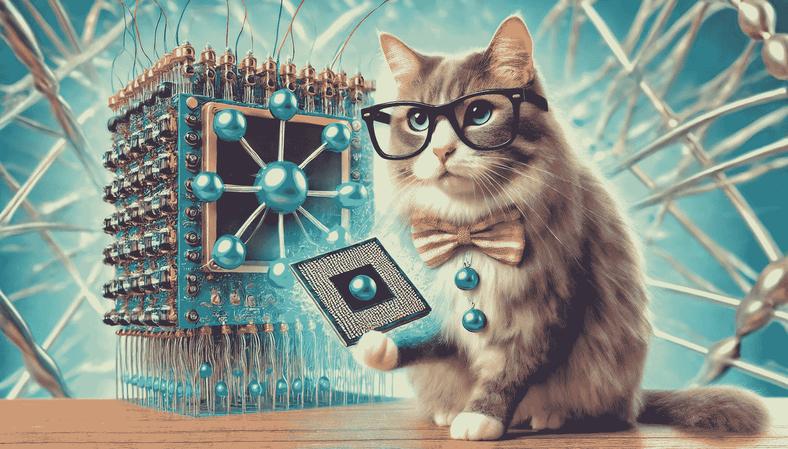

一只好奇的猫手持量子芯片（由 DALLE 生成）

最近，谷歌公布了他们最先进的量子芯片，[Willow](https://blog.google/technology/research/google-willow-quantum-chip/)，突出了可能带来相关实际应用的一些突破性成果，而不仅仅是科学家和工程师好奇和猜测的工具。

如果你正在寻找关于多宇宙和利用量子计算破解加密的炒作，这篇帖子不是你该来的地方。

在这里，我将从非专业人士的角度来探讨量子相干性和量子纠错，以及是什么使得谷歌的 Willow 芯片成为一项潜在的突破性发现。以下是我想要在这里讨论的来自谷歌 Nature 期刊论文的一些主题：

+   ***相干性和去相干性；T1 时间***

+   ***纯态和混合态；密度矩阵***

+   ***量子纠错；表面码***

让我们开始吧！

* * *

### 量子比特的相干性：

简单来说，相干性可以描述为量子比特在没有受到噪声或与其环境相互作用干扰的情况下维持其量子状态的能力。相干性对于量子计算至关重要，因为量子算法依赖于对量子比特叠加和纠缠的精确操作。那么，我们该如何思考叠加和纠缠呢？

用 |ψ⟩ 表示的量子比特状态，它是状态 |0⟩ 和 |1⟩ 的叠加，可以表示如下：

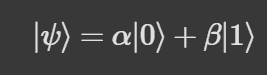

等式 1：处于 0 和 1 基底状态叠加的量子比特

尝试测量这个量子比特将使其坍缩到 ∣0⟩ 或 ∣1⟩，概率分别为 |α|² 和 |β|²。

另一方面，纠缠指的是涉及两个或更多量子比特的量子状态，它们的个体状态不能独立描述。一个量子比特的状态与另一个（或多个）量子比特的状态相关联，无论它们相隔多远。我之前已经详细讨论了 [贝尔态](https://medium.com/a-bit-of-qubit/quantum-computing-bell-state-and-entanglement-with-qiskit-621489fb36bd)，但在这里让我们看看一个纠缠态的例子：

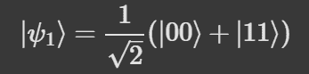

纠缠态（贝尔态的四种状态之一）

+   状态 ∣00⟩ 表示两个量子比特都处于 ∣0⟩ 状态。

+   状态 ∣11⟩ 表示两个量子比特都处于 ∣1⟩ 状态。

+   如果我们测量第一个量子比特并发现它在 ∣0⟩ 状态，第二个量子比特将**立即**坍缩到 ∣0⟩，对于 ∣1⟩ 也是如此。

量子算法基于这些基本的叠加和纠缠概念，并且我们希望我们能理解为什么量子比特必须保持其量子状态，在执行某些计算之前不被噪声所破坏。

**T1 或弛豫时间：** 测量相干性（量子比特保持其量子状态）的一种方法是通过 T1 时间或*弛豫时间*（另一种称为 T2 时间或去相干时间）。我们可以将相干时间视为一个上限，即一个人可以可靠地使用量子比特进行量子操作的最长时间。与谷歌之前包含 53 个量子比特的 Sycamore 量子芯片（谷歌声称在 2019 年使用 Sycamore 芯片实现了量子霸权）²相比，其 T1 时间约为 20μs（20 微秒），而 105 量子比特的 Willow 处理器大约有 5 倍的更高 T1 时间（约 98μs）。

***

### 超导量子比特和 T1 时间：

Sycamore 和 Willow 处理器都是基于超导量子比特。尽管可能存在具有更高 T1 时间的捕获离子量子比特系统，但超导量子比特通常更受青睐，主要原因有以下几点：

+   与捕获离子量子比特（微秒到毫秒）相比，超导量子比特具有**更快的门操作时间**（在纳秒范围内，10–100 ns）。更快的操作时间意味着在更短的时间内可以进行更多的计算。

+   超导量子比特建立在固态电路之上；与需要复杂光学设置（激光、真空等）的捕获离子系统相比，这是一种更成熟的半导体制造技术。这使得捕获离子系统在更大量子比特阵列的扩展上更具挑战性。

我所知道的至少有一家正在积极研发捕获离子量子比特系统的公司是霍尼韦尔；与 IBM 和谷歌使用的超导量子比特技术不同。

如果量子比特的初始状态是|1⟩（将其视为与基态|0⟩相比的激发态）且 T1 时间为 30μs，那么处于状态|1⟩的概率会随时间指数下降；

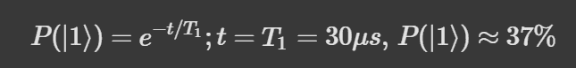

热噪声和电磁波动缩短了量子比特的 T1 寿命。这就是为什么你会看到关于为什么量子处理器要维持接近绝对零度的温度（目前，我们可以达到并维持大约几毫开尔文）是必要的报告或视频。在这些低温下，光子的热能：k_B T（k_B 是玻尔兹曼常数，T 是开尔文温度）远小于室温，这使得这些系统具有非常低的热噪声。由于量子比特非常脆弱，任何小的扰动，如热噪声都可能导致去相干（量子比特无法维持其预期的量子状态），因此更高的相干时间是构建稳健和可靠量子系统的一个重要因素。

***

### 密度矩阵：纯态到混合态；相干到去相干

另一种思考相干性和退相干性的方式是利用密度矩阵。这部分内容是针对专业人士的，如果你想避免数学，请跳转到 TLDR 然后到下一节。

在我们简单思考叠加态之前，我们也可以用另一种更通用的形式来表示它：

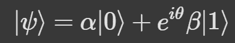

式（2）：一个纯量子态

在这里 *θ* 是复系数之间的相位差。据此，我们可以写出不同 *θ* 值的已知叠加态。例如，α、β 和 0（度）相位差具有相等振幅将导致：

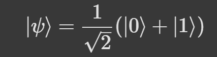

式（3）：从式（2）得出，α = β 且 θ = 0

类似地，振幅相等但 θ = 180 时，会导致：

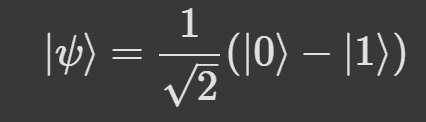

式（4）：从式（2）得出，α = β 且 θ = 180

对于 θ = 90，我们将得到：

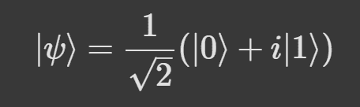

式（5）：从式（2）得出，α = β 且 θ = 90

对于所有这些情况，测量 |0⟩、|1⟩ 的概率相同；由 |α|² = |β|² = 0.5 给出。

相对相位不能直接测量，因为量子力学只允许测量概率。但当我们应用某些量子门或在不同的基上进行测量时，它将产生影响：例如，让我们将哈达玛门（H）应用于式（3）中的量子态 |ψ⟩（其中 *θ* = 0）以一个通用的 *θ*，

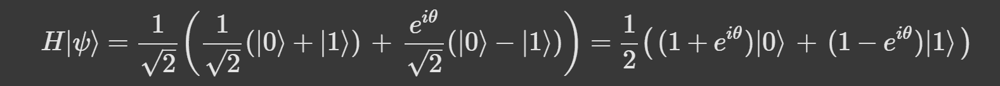

式（6）：将哈达玛门应用于式（3）中的量子态

（如果你想了解更多关于哈达玛门的信息，请查看我的[旧帖子](https://medium.com/a-bit-of-qubit/simple-quantum-circuits-to-understand-multiple-qubit-states-79e576a9d0fe)) 现在，我们看到这个相对相位差将影响 {∣0⟩,∣1⟩} 基上的测量概率，从而证明了干涉效应。

式（3）、式（4）和式（5）中的量子态是**纯态**的例子。关于纯态的最佳思考方式是利用密度矩阵。我们可以将状态 |ψ⟩（式（2））的密度矩阵写成 ρ = |ψ⟩ ⟨ ψ|，这将是一个 2×2 矩阵，如下所示：

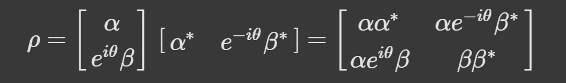

式（7）：给定式（2）的纯态密度矩阵

密度矩阵中的非对角项编码了**相干性**，我们可以看到它们受到这个 θ 的影响。一个**纯态**将满足 Tr(_ρ_²)=1 这一性质，我们将其视为由单个波函数表示的量子态，对该状态没有不确定性。这与**最大混合态**形成对比，在最大混合态中，非对角项不存在（=0），表示没有相干性和对该状态的最大不确定性。

我们通常将这种从纯态到混合态的转变视为退相干。例如，在方程 2 中表示的纯态|ψ⟩当转变为最大混合态时，密度矩阵变为：

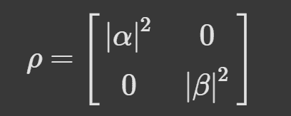

方程 8：最大混合态的密度矩阵

对于混合态 Tr(_ρ_²)<1，因此一旦我们知道一个状态的密度矩阵，我们就可以验证它是否是纯态或混合态。

如果我们以最大确定性制备一个量子态，随着时间的推移，由于噪声和与环境的相互作用，我们会对系统当前处于哪种状态变得不确定。这种从纯态到混合态的转变以及相干的丧失可以被视为量子系统的演化（作为时间的函数）和退相干。

*TLDR：要了解一个量子态是纯态还是混合态，我们可以检查密度矩阵；由于与环境的相互作用和噪声导致的从纯态到混合态的转变可以被视为随时间从相干到退相干的转变。*

如果你想了解密度矩阵和布洛赫球体[链接](https://medium.com/a-bit-of-qubit/understanding-bloch-sphere-from-density-matrix-perspective-618bd5911d4f)之间是如何相关的，你可以在这里了解它们。

* * *

### 量子纠错：

Nature 论文中发表的主要结果与谷歌的 Willow 处理器相关，研究人员表明，增加量子比特数量会导致错误减少。这是一个非常简化和难以理解的说法。因此，为了弄清楚它究竟意味着什么，我们首先需要了解***逻辑***量子比特和***物理***量子比特之间的区别。

*逻辑量子比特：*

+   逻辑量子比特是通过将量子信息的一个量子比特编码到多个*物理量子比特*中创建的**错误保护量子比特**。

+   这种编码使得逻辑量子比特能够抵抗错误，前提是错误在积累过多之前被检测和纠正。

直接引用 Nature 论文的摘要¹：

> 量子纠错通过将多个物理量子比特组合成一个逻辑量子比特，从而提供了一条达到实用量子计算的道路，其中逻辑错误率随着量子比特数量的增加而指数级降低。

对于超导量子比特（如谷歌的 Sycamore 和 Willow 处理器），表面码是一种常见的量子纠错（QEC）码，用于创建逻辑量子比特。那么什么是表面码呢？由于讨论量子纠错算法会超出这篇文章的范围，让我们简单概述一下。

***表面码：*** 这代表一种量子纠错码，它将逻辑量子比特编码到排列在二维网格上的物理量子比特数组中。它通过检测和纠正通过局部测量量子比特组（称为稳定子）的错误来保护量子信息，而不直接测量持有逻辑信息的量子比特。表面码中的一些常见特性包括：

+   主要有两种类型的量子比特以二维网格的形式排列；数据量子比特持有计算所需的必要量子信息，辅助量子比特用于测量错误符号。

+   表面码使用稳定子算符来检测错误，而不会干扰量子信息。我们可以将稳定子视为一组用于检查位翻转如 ∣0⟩↔ ∣1⟩（称为 X 错误）、相位翻转 ∣+⟩ ↔ ∣−⟩（Z 错误）或两者（称为 Y 错误）的量子比特。

+   逻辑量子比特在整个物理量子比特网格中编码。逻辑操作（如 X、Z、Hadamard）作为跨网格的大规模操作实现。

+   表面码在所有量子纠错码中具有最高的错误阈值（物理错误，发生在物理量子比特层面），只要物理错误率低于这个阈值，我们就可以添加更多的量子比特，这会以指数方式降低逻辑错误率。

+   一旦通过反复测量稳定子检测到错误，就会应用错误纠正算法来恢复逻辑量子比特到其预期的量子状态。

这里的主要观点是，只有当物理错误率足够低并且 **** 超过某个点，如果错误密度太高，添加更多的量子比特会引入比码能纠正的更多的错误时，添加更多的物理量子比特才能增加对错误的保护。

***逻辑错误率抑制：*** 随着我们添加更多的物理量子比特，它以指数方式降低逻辑错误率（影响编码量子信息的错误），前提是我们之前讨论的条件，并且这可以用数学公式表示为：

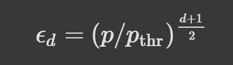

公式 9：逻辑错误率抑制

在这里，*p* 和 _ε*d* 分别是物理和逻辑错误率。_p__{thr} 是码的阈值错误率，*d* 是码距离，表示每个逻辑量子比特使用的物理量子比特数 2_d_²−1。

通过这个关系，我们可以欣赏到：

+   如果 p < p_{thr}，即物理错误率低于临界阈值；随着 *d* 的增加，逻辑错误抑制得到改善。

+   当 p > p_{thr} 时，逻辑错误率随着 *d* 的增加而增加，因为系统引入的错误超过了码能纠正的错误。

增加量子比特提供了更好的错误抑制，但量子比特的需求以 ∼ 2_d_² 的速度增长，这使得硬件要求更高。

在《自然》杂志的论文¹中，谷歌团队还定义了一个量 Λ，它表示通过增加码距离 2 来减少错误，如下所示：

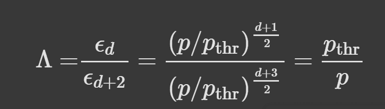

公式 10：通过增加码距离 2 来抑制错误

只是为了提供一个感觉，当物理错误率 (*p*) 很低于阈值时，错误抑制因子 Λ 非常大。

+   例如，如果 p=0.1%，且 p_{thr} =1%；Λ = 1%/0.1 % = 10。这意味着通过增加码距离 2 可以将逻辑错误率降低 10 倍。

**Willow 芯片的主要观点是，谷歌量子 AI 团队首次展示了构建表面代码在临界阈值以下运行的超导量子处理器是可能的，这展示了随着量子比特数量的增加，指数级逻辑错误率抑制。这种低于阈值的操作甚至可以在解码时间保持。**

凯利博士在观看谷歌的 Willow 视频（以下链接）大约 3 分钟时强调了这一点。

正如我之前所写的，Willow 中的物理错误率低于临界阈值，为制造更大、更复杂的量子芯片铺平了道路。

在随机电路采样基准上对最强大的经典超级计算机进行测试，谷歌展示了他们的量子处理器可以在不到 5 分钟内完成计算，而这需要超级计算机 10²⁵年！

这令人兴奋，我只有赞赏研究人员和科学家们为完成这一壮举所做出的惊人的硬件发展！量子计算的未来可能会非常激动人心，因为这种类型的处理器应该是构建大规模纠错量子计算机的骨架。谷歌的博客³强调，他们希望通过解决经典计算机无法解决的困难优化问题，在药物/药物、电池和聚变能源领域推动边界！让我们看看未来会带来什么！！

你怎么看？

* * *

### 参考文献：

[1] ["Quantum Error Correction Below the Surface Code Threshold"](https://www.nature.com/articles/s41586-024-08449-y); Google Quantum AI 和合作者，自然 2024。

[2] ["Quantum Supremacy Using a Programmable Superconducting Processor"](https://www.nature.com/articles/s41586-019-1666-5); F. Arute 等人，自然 2019。

[3] "[遇见 Willow，我们的最先进量子芯片](https://blog.google/technology/research/google-willow-quantum-chip/)"; H. Neven.
