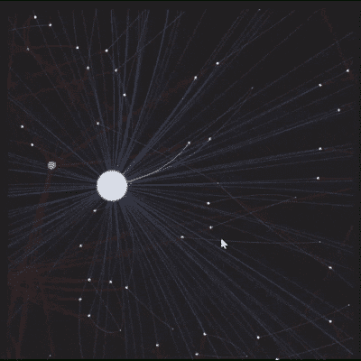
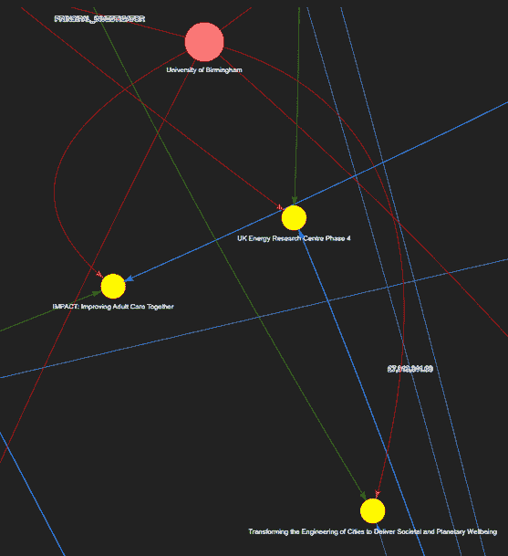
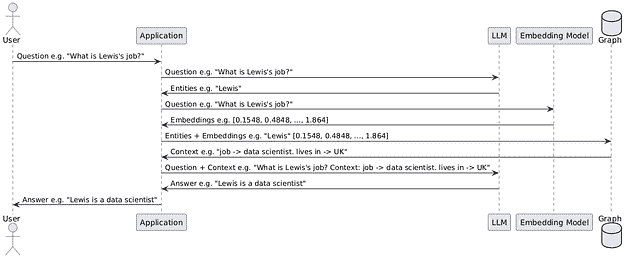

# 政府资助图 RAG

> 原文：[`towardsdatascience.com/government-funding-graph-rag/`](https://towardsdatascience.com/government-funding-graph-rag/)

<mdspan datatext="el1745527782909" class="mdspan-comment">在本文中</mdspan>，我介绍了我的最新开源项目——政府资助图。

这个项目的灵感来源于制作更好的资助写作工具的愿望，即建议研究主题、资助机构、研究机构和研究人员。我过去曾制作过[创新英国](https://www.ukri.org/councils/innovate-uk/)的资助申请，因此我对政府资助环境已有一些兴趣。

具体来说，最近的政治讨论很多都集中在政府支出上，比如美国埃隆·马斯克的[政府效率部 (DOGE)](https://doge.gov/savings)以及在英国这里类似的观点，正如基尔·斯塔默试图[将 AI 引入政府](https://www.bbc.co.uk/news/articles/c74kep983x3o)。

也许这个项目的发布时机恰到好处。虽然并非初衷，但我希望这篇文章的次要成果能够激发更多对开源公共支出数据集的探索。



政府资助图（图片由作者提供）

* * *

我已经使用 NetworkX 和 PyVis 来可视化 UKRI API 数据的图。然后，我详细介绍了 LlamaIndex 图 RAG 的实现。为了完整性，我还包括了我基于 LangChain 的初始解决方案。网页框架是 Streamlit，演示托管在 Streamlit 社区云上。

本文包含以下部分。

1.  定义

1.  UKRI API

1.  构建 NetworkX 图

1.  过滤 NetworkX 图

1.  使用 PyVis 进行图可视化

1.  使用 LlamaIndex 构建 Graph RAG

1.  使用 Pylint 进行代码检查

1.  文章末尾的 Streamlit 社区云演示应用程序

* * *

## 1. 定义

### 什么是 UKRI？

英国研究与创新（UKRI）是由科学、创新和技术部（DSIT）资助的非部门性公共机构，负责分配研发资金。通常，资金授予研究机构和企业。

> “我们每年投资 80 亿英镑的纳税人资金用于研究和创新以及使之成为可能的人们。我们在广泛的领域工作——从生物多样性保护到量子计算，从太空望远镜到创新医疗保健。我们为每个人提供贡献和受益的机会，将全国和全球的人们和组织聚集在一起，创造、开发和部署新的想法和技术。” —— [UKRI 网站](https://www.ukri.org/)

### 什么是图？

图是一种方便的数据结构，显示了不同实体（节点）及其相互关系（边）。在某些情况下，我们还将这些关系与数值相关联。

> “在计算机科学中，图是一种抽象数据类型，旨在在数学的图论领域中实现无向图和有向图的概念。
> 
> 图数据结构由有限（可能可变）的顶点集（也称为节点或点）组成，以及一组无序的顶点对，用于无向图，或有序对，用于有向图。这些对被称为边（也称为链接或线），在有向图中也称为边，但有时也称为箭头或弧。“——[维基百科](https://en.wikipedia.org/wiki/Graph_(abstract_data_type))



政府资助图（作者图片）

### 什么是 NetworkX？

NetworkX 是本项目中的一个有用库，用于构建和存储我们的图。具体来说，虽然库支持许多图变体，如多重图，但库也支持与图相关的实用函数。

> “NetworkX 是一个用于创建、操作和研究复杂网络的结构、动态和功能的 Python 包”——[NetworkX 网站](https://networkx.org/)

### 什么是 PyVis？

我们使用 PyVis Python 包来创建我们图的动态网络视图，这些截图可以在文章的各个部分找到。

> “pyvis 库旨在通过最少的 Python 代码快速生成可视网络图。它被设计为一个围绕流行的 Javascript visJS 库的包装器”——[PyVis 文档](https://pyvis.readthedocs.io/en/latest/tutorial.html)

### 什么是 LlamaIndex？

LlamaIndex 是一个流行的 LLM 应用库，包括对代理工作流程的支持，我们用它来执行本项目中的图 RAG 组件。

> “LlamaIndex（GPT Index）是 LLM 应用的数据框架。使用 LlamaIndex 通常涉及与 LlamaIndex 核心和所选集成（或插件）一起工作。”——[LlamaIndex Github](https://github.com/run-llama/llama_index)

### 什么是图 RAG？



图 RAG 高级视图（作者图片）

检索增强生成，或简称 RAG，是一个 AI 框架，它使用来自外部知识库的额外上下文来使 LLM 答案具体化。通过扩展，图 RAG 涉及到使用图来提供这种额外上下文。

> “GraphRAG 是一个强大的检索机制，通过利用图数据结构中的丰富上下文来改进 GenAI 应用……基本的 RAG 系统完全依赖于向量数据库中的语义搜索来检索和排名孤立文本片段的集合。虽然这种方法可以揭示一些相关信息，但它无法捕捉连接这些片段的上下文。因此，基本的 RAG 系统在回答复杂的多跳问题时准备不足。这正是 GraphRAG 发挥作用的地方。它使用知识图来表示和连接信息，不仅捕获更多的数据点，还捕获它们之间的关系。因此，基于图的检索器可以通过揭示通常不明显但对于关联信息至关重要的隐藏连接，提供更准确和相关的结果。” — [Neo4j 网站](https://neo4j.com/blog/genai/what-is-graphrag/)

### 什么是 Streamlit？

Streamlit 是我们将用于创建此项目网络应用的轻量级 Python 网络框架。

> “Streamlit 是一个开源的 Python 框架，数据科学家和 AI/ML 工程师可以使用它仅用几行代码来交付动态数据应用。在几分钟内构建和部署强大的数据应用。” — [Streamlit 网站](https://docs.streamlit.io/)

## 2. UKRI API

UKRI API 是一个便于访问公共 UKRI 资助数据集的服务，无需认证，文档可以在[这里](https://gtr.ukri.org/resources/api.html)找到。我只为我们的应用程序使用两个端点，它们是[搜索项目端点](https://gtr.ukri.org/resources/gtrapi-search-api.html)和[项目端点](https://gtr.ukri.org/resources/gtrapi-project-api.html#get-project)。这允许用户根据关键词搜索来查找项目，并检索所有项目特定信息。

搜索词、页面大小和页面号作为查询字符串参数提供。查询字符串参数；

*`selectedSortableField=pro.am&selectedSortOrder=DESC`*

确保结果按资助金额降序返回。

我还包含了用于异步分页的代码。

```py
import math
import requests
import concurrent.futures
import os 
from itertools import chain
import urllib.parse
import logging

def search_ukri_projects(args):
    """
    Search UKRI projects based on a search term page size and page number.
    More details can be found here: https://gtr.ukri.org/resources/api.html
    """
    search_term, page_size, page_number = args
    try:
        encoded_search_term = urllib.parse.quote(search_term)
        if (
            (
                response := requests.get(
                    f"https://gtr.ukri.org/api/search/project?term={encoded_search_term}&page={page_number}&fetchSize={page_size}&selectedSortableField=pro.am&selectedSortOrder=DESC&selectedFacets=&fields=project.abs",
                    timeout=10,
                )
            )
            and (response.status_code == 200)
            and (
                items := response.json()
                .get("facetedSearchResultBean", {})
                .get("results")
            )
        ):
            return items
    except Exception as error:
        logging.exception("ERROR search_ukri_projects: %s", error)
    return []

def search_ukri_paginate(search_term, number_of_results, page_size=100):
    """
    Asynchronous pagination requests for project lookup.
    """
    args = [
        (search_term, page_size, page_number + 1)
        for page_number in range(int(math.ceil(number_of_results / page_size)))
    ]
    with concurrent.futures.ThreadPoolExecutor(os.cpu_count()) as executor:
        future = executor.map(search_ukri_projects, args)
    results = [result for result in future if result]
    return list(chain.from_iterable(results))[:number_of_results]
```

以下函数用于使用独特的 UKRI 项目参考获取项目特定数据。项目参考是从上述项目搜索结果中派生的。

```py
import requests 
import logging

def get_ukri_project_data(project_grant_reference):
    """
    Search UKRI project data based on grant reference.
    """
    try:
        if (
            (
                response := requests.get(
                    f"https://gtr.ukri.org/api/projects?ref={project_grant_reference}",
                    timeout=10,
                )
            )
            and (response.status_code == 200)
            and (items := response.json().get("projectOverview", {}))
        ):
            return items
    except Exception as error:
        logging.exception("ERROR get_ukri_project_data: %s", error)
```

同样，我们解析出构建图所需的相关数据，并删除冗余信息。

```py
def parse_data(projects):
    """
    Parse project data into a usable format and validate.
    """
    data = []
    for project in projects:
        project_composition = project.get("projectComposition", {})
        project_data = project_composition.get("project", {})
        fund = project_data.get("fund", {})
        funder = fund.get("funder")
        value_pounds = fund.get("valuePounds")
        lead_research_organisation = project_composition.get("leadResearchOrganisation")
        person_roles = project_composition.get("personRoles")
        if all(
            [
                project_composition,
                project_data,
                fund,
                funder,
                value_pounds,
                lead_research_organisation,
            ]
        ):
            record = {}
            record["funder_name"] = funder.get("name")
            record["funder_link"] = funder.get("resourceUrl")
            record["project_title"] = project_data.get("title")
            record["project_grant_reference"] = project_data.get("grantReference")
            record["value"] = value_pounds
            record["lead_research_organisation"] = lead_research_organisation.get(
                "name", ""
            )
            record["lead_research_organisation_link"] = lead_research_organisation.get(
                "resourceUrl", ""
            )
            record["people"] = person_roles
            record["project_url"] = project_data.get("resourceUrl")
            data.append(record)
    return data
```

## 3. 构建 NetworkX 图

有不同类型的图，我选择了有向图，其中边的方向很重要。更正式地说；

> “DiGraph 存储具有可选数据或属性的节点和边。DiGraph 包含有向边。自环是允许的，但多边（并行）边是不允许的。” — [NetworkX 网站](https://networkx.org/documentation/stable/reference/classes/digraph.html)

要构建 NetworkX 图，我们必须添加节点和边——包括节点属性的顺序更新。

与 PyVis 图渲染兼容的标准属性如下；

+   标题（悬停时出现的标签）

+   组（颜色编码）

+   大小（节点在图中的显示大小）

我们还使用自定义属性“funding”，我们将用它来汇总所有的研究和资助组织的资金。这将根据特定组的总资金百分比来规范化节点大小。

对于我们的图，我们有来自四个组的节点。它们被分类为：`funder_name`、`lead_research_organisation`、`project_title`和`person_name`。

可以在节点标题中使用 HTML 链接，以便用户可以轻松点击通过到 URL。我下面包括了一个辅助函数来做这件事。有项目、人员和研究组织特定的链接，如果重定向将向用户提供更多信息。


政府资助图（作者图片）

构建 NetworkX 图的代码如下。DiGraph 类有检查图是否已经有一个节点的方法，同样也有检查边的方法。还有添加节点和边的方法。当我们遍历项目时，我们想要汇总资助组织和主导研究机构的总资金。有从图中节点获取属性和在节点上设置属性的方法。根据源节点和目标节点，我们还应用不同的标题和标签来反映特定的谓词。这些可以在下面的代码中看到。

```py
import networkx as nx

def get_link_html(link, text):
    """
    Helper function to construct a HTML link.
    """
    return f"""<a href="{link}" target="_blank">{text}</a>"""

def set_networkx_attribute(graph, node_label, attribute_name, value):
    """
    Helper to set attribute for networkx graph.
    """
    attrs = {node_label: {attribute_name: value}}
    nx.set_node_attributes(graph, attrs)

def append_networkx_value(graph, node_label, attribute_name, value):
    """
    Helper to append value to current node attribute scalar value.
    """
    current_map = nx.get_node_attributes(graph, attribute_name, default=0)
    current_value = current_map[node_label]
    current_value = current_value + value
    set_networkx_attribute(graph, node_label, attribute_name, current_value)

def create_networkx(data):
    """
    Create networkx graph from UKRI data.
    """
    graph = nx.DiGraph()
    for row in data:
        if (
            (funder_name := row.get("funder_name"))
            and (project_title := row.get("project_title"))
            and (lead_research_organisation := row.get("lead_research_organisation"))
        ):

            project_data_lookup = row.get("project_data_lookup", {})

            if not graph.has_node(funder_name):
                graph.add_node(
                    funder_name, title=funder_name, group="funder_name", size=100
                )
            if not graph.has_node(project_title):
                link_html = get_link_html(
                    row.get("project_url", "").replace("api/", ""), project_title
                )
                graph.add_node(
                    project_title,
                    title=link_html,
                    group="project_title",
                    project_data_lookup=project_data_lookup,
                    size=25,
                )
            if not graph.has_edge(funder_name, project_title):
                graph.add_edge(
                    funder_name,
                    project_title,
                    value=row.get("value"),
                    title=f"{'£{:,.2f}'.format(row.get('value'))}",
                    label=f"{'£{:,.2f}'.format(row.get('value'))}",
                )

        if not graph.has_node(lead_research_organisation):
            link_html = get_link_html(
                row.get("lead_research_organisation_link").replace("api/", ""),
                lead_research_organisation,
            )
            graph.add_node(
                lead_research_organisation,
                title=link_html,
                group="lead_research_organisation",
                size=50,
            )
        if not graph.has_edge(lead_research_organisation, project_title):
            graph.add_edge(
                lead_research_organisation, project_title, title="RELATES TO"
            )

        append_networkx_value(graph, funder_name, "funding", row.get("value", 0))
        append_networkx_value(graph, project_title, "funding", row.get("value", 0))
        append_networkx_value(
            graph, lead_research_organisation, "funding", row.get("value", 0)
        )

        person_roles = row.get(
            "people", []
        )  

        for person in person_roles:
            if (
                (person_name := person.get("fullName"))
                and (person_link := person.get("resourceUrl"))
                and (project_title := row.get("project_title"))
                and (roles := person.get("roles"))
            ):
                if not graph.has_node(person_name):
                    link_html = get_link_html(
                        person_link.replace("api/", ""), person_name
                    )
                    graph.add_node(
                        person_name, title=link_html, group="person_name", size=10
                    )
                for role in roles:
                    if (not graph.has_edge(person_name, project_title)) or (
                        not graph[person_name][project_title]["title"]
                        == role.get("name")
                    ):
                        graph.add_edge(
                            person_name,
                            project_title,
                            title=role.get("name"),
                            label=role.get("name"),
                        )
    return graph
```

一旦构建了图，如前所述，我想根据特定组的总资金百分比来规范化节点大小。我还将总资金，无论是作为总和还是作为百分比，附加到节点标签上，以便用户更容易查看。

缩放因子只是一个应用于美观目的的倍数，使得节点大小相对于其他节点组呈现相对大小。

```py
import networkx as nx
import math 
import utils.config as config  # pylint: disable=consider-using-from-import, import-error

def set_networkx_attribute(graph, node_label, attribute_name, value):
    """
    Helper to set attribute for networkx graph.
    """
    attrs = {node_label: {attribute_name: value}}
    nx.set_node_attributes(graph, attrs)

def calculate_total_funding_from_group(graph, group):
    """
    Helper to calculate total funding for a group.
    """
    return sum(
        [
            data.get("funding")
            for node_label, data in graph.nodes(data=True)
            if data.get("funding") and data.get("group") == group
        ]
    )

def set_weighted_size_helper(graph, node_label, totals, data):
    """
    Create normalized weights based on percentage funding amount.
    """
    if (
        (group := data.get("group"))
        and (total_funding := totals.get(group))
        and (funding := data.get("funding"))
    ):
        div = funding / total_funding
        funding_percentage = math.ceil(((100.0 * div)))
        set_networkx_attribute(graph, node_label, "size", funding_percentage)

def annotate_value_on_graph(graph):
    """
    Calculate normalized graph sizes and append to title.
    """
    totals = {}
    for group in ["lead_research_organisation", "funder_name"]:
        totals[group] = calculate_total_funding_from_group(graph, group)

    for node_label, data in graph.nodes(data=True):
        if (
            (funding := data.get("funding"))
            and (group := data.get("group"))
            and (title := data.get("title"))
        ):
            new_title = f"{title} | {'£ {:,.0f}'.format(funding)}"
            if total_funding := totals.get(group):
                div = funding / total_funding
                funding_percentage = math.ceil(((100.0 * div)))
                set_networkx_attribute(
                    graph,
                    node_label,
                    "size",
                    config.NODE_SIZE_SCALE_FACTOR * funding_percentage,
                )
                new_title += f" | {' {:,.0f}'.format(funding_percentage)} %"

            set_networkx_attribute(graph, node_label, "title", new_title)
```

## 4. 过滤 NetworkX 图


政府资助图 UI（作者图片）

我允许用户通过 UI 过滤节点以创建子图。在 Streamlit 中执行此操作的表单如下。我还找到了过滤节点的邻居。我遇到了一些问题，Pylint 从生成器中引发了不必要的理解错误，我已经禁用了它——在文章的后面部分将详细介绍 Pylint。较小的图将需要较少的时间来渲染，并确保排除无关的上下文。

```py
import networkx as nx
import streamlit as st

def find_neighbor_nodes_helper(node_list, graph):
    """
    Find unique node neighbors and flatten.
    """
    successors_generator_array = [
        # pylint: disable=unnecessary-comprehension
        [item for item in graph.successors(node)]
        for node in node_list
    ]
    predecessors_generator_array = [
        # pylint: disable=unnecessary-comprehension
        [item for item in graph.predecessors(node)]
        for node in node_list
    ]
    neighbors = successors_generator_array + predecessors_generator_array
    flat = sum(neighbors, [])
    return list(set(flat))

def render_filter_form(annotated_node_data, graph):
    """
    Render form to allow the user to define search nodes.
    """
    st.session_state["filter"] = st.radio(
        "Filter", ["No filter", "Filter results"], index=0, horizontal=True
    )
    if (filter_determinant := st.session_state.get("filter")) and (
        filter_determinant == "Filter results"
    ):
        st.session_state["node_group"] = st.selectbox(
            "Entity type", list(annotated_node_data.keys())
        )
        if node_group := st.session_state.get("node_group"):
            ordered_lookup = dict(
                sorted(
                    annotated_node_data[node_group].items(),
                    key=lambda item: item[1].get("neighbor_len"),
                    reverse=True,
                )
            )
            st.session_state["search_nodes_label"] = st.multiselect(
                "Filter projects", list(ordered_lookup.keys())
            )
        if search_nodes_label := st.session_state.get("search_nodes_label"):
            filter_nodes = [
                ordered_lookup[label].get("label") for label in search_nodes_label
            ]
            search_nodes_neighbors = find_neighbor_nodes_helper(filter_nodes, graph)
            search_nodes = find_neighbor_nodes_helper(search_nodes_neighbors, graph)
            st.session_state["search_nodes"] = list(
                set(search_nodes + filter_nodes + search_nodes_neighbors)
            )
```

NetworkX 通过[subgraph_view](https://networkx.org/documentation/stable/reference/classes/generated/networkx.classes.graphviews.subgraph_view.html)函数使从节点列表创建子图变得容易，该函数接受一个可调用的参数。可调用函数接受一个图节点作为参数，如果返回布尔值 True，则该节点将被包含在子图中。

```py
import networkx as nx
import streamlit as st

def filter_node(node):
    """
    Check to see if the filter term is in the nodes selected.
    """
    if (
        (filter_term := st.session_state.get("filter"))
        and (filter_term == "Filter results")
        and (search_nodes := st.session_state.get("search_nodes"))
    ):
        if node not in search_nodes:
            return False
    return True

graph = nx.subgraph_view(graph, filter_node=filter_node)
```

## 5. 使用 PyVis 进行图可视化

为了生成文章中前面提到的可视化，我们必须首先将 NetworkX 图转换为 PyVis 网络，然后在 Streamlit UI 中渲染 HTML 文件。

如果你不太熟悉[Streamlit](https://docs.streamlit.io/)，你可以查看我其他关于这个主题的文章，[这里](https://towardsdatascience.com/custom-ai-jira-agent-google-mesop-django-langchain-agent-co-star-chain-of-thought-cot-and-fb903468bff6/)有介绍。

将 NetworkX 图转换为 PyVis 格式相对简单，以下代码可以实现。Network 类是可视化功能的主要类，首先我们实例化这个类，在这个例子中，图是定向的。然后调用`barnes_hut`方法，这是一个重力模型。`from_nx`方法接受一个现有的 NetworkX 图作为参数，并将其转换为 PyVis，这是在原地调用的。

```py
from pyvis.network import Network

def convert_graph(graph):
    """
    Convert networkx to pyvis graph.
    """
    net = Network(
        height="700px",
        width="100%",
        bgcolor="#222222",
        font_color="white",
        directed=True,
    )
    net.barnes_hut()
    net.from_nx(graph)
    return net
```

要将图渲染到 UI 上，我们首先创建一个唯一的用户 ID，因为我们使用 PyVis 的[save_graph](https://pyvis.readthedocs.io/en/latest/documentation.html)方法在服务器上保存图的 HTML 文件。`uuid`确保了文件名的唯一性，然后这个文件被读入 streamlit UI 中，文件删除后。

```py
import uuid
import contextlib
import os
import streamlit as st

def render_graphs(net):
    """
    Helper to render graph visualization from pyvis graph.
    """
    uuid4 = uuid.uuid4()
    file_name = f"./output/{uuid4}.html"
    with contextlib.suppress(FileNotFoundError):
        os.remove(file_name)
    net.save_graph(file_name)
    with open(file_name, "r", encoding="utf-8") as html_file:
        source_code = html_file.read()
    st.components.v1.html(source_code, height=650, width=650)
    os.remove(file_name)
```

## 6. 使用 LlamaIndex 进行图 RAG


政府资助图 RAG（图片由作者提供）

通过图检索增强生成，我们可以直接查询我们的图数据，一个例子可以在之前的屏幕截图中看到。从用户查询中提取的实体在图中查找，为 AI 提供特定的上下文，以便其定位响应，因为这个信息可能不会在训练语料库中，因此任何给出的答案都有更高的可能性是幻觉。

我们创建一个聊天引擎，将用户的先前查询历史传递给模型。通常，Open AI API 密钥在 LlamaIndex 中作为环境变量读取——然而，由于这是用户提交给我们的应用程序，我们不希望保存用户的 Open AI 凭据，因此我们需要将凭据作为关键字参数传递给 LLM 和嵌入模型类。

然后，我们创建一个空的 LlamaIndex 知识图谱索引，并通过插入[三元组](https://www.oxfordsemantic.tech/faqs/what-is-a-triple)来填充知识图谱。这些三元组来自遍历我们的 NetworkX 图的边并调用`upsert_triplet_and_node`方法，如果它们还不存在，该方法将创建三元组和节点。

由于图是定向的，我们可以交换主语和宾语，使得图可以双向遍历。聊天引擎使用响应构建器的 tree_summarize 选项。

> “树形总结响应构建器。此响应构建器递归地合并文本块并以自下而上的方式总结它们（即从叶子到根构建树）。更具体地说，在每一步递归中：1. 我们重新打包文本块，以便每个块填充 LLM 的上下文窗口 2. 如果只有一个块，我们给出最终响应 3. 否则，我们总结每个块并递归地总结总结。” — [LlamaIndex 网站](https://docs.llamaindex.ai/en/stable/api_reference/response_synthesizers/tree_summarize/)

调用聊天方法并从 Streamlit 状态对象中构建聊天历史包括在此处。

```py
from llama_index.core import KnowledgeGraphIndex
from llama_index.core.schema import TextNode
from llama_index.embeddings.openai import OpenAIEmbedding
from llama_index.llms.openai import OpenAI
from llama_index.core.llms import ChatMessage, MessageRole
import streamlit as st
import utils.ui_utils as ui_utils  # pylint: disable=consider-using-from-import, import-error

def init_llama_index_graph(graph_nx, open_ai_api_key):
    """
    Construct a knowledge graph using llama index.
    """
    llm = OpenAI(model="gpt-3.5-turbo", api_key=open_ai_api_key)
    embed_model = OpenAIEmbedding(api_key=open_ai_api_key)

    graph = KnowledgeGraphIndex(
        [], llm=llm, embed_model=embed_model, api_key=open_ai_api_key
    )

    for subject_entity, object_entity in graph_nx.edges():
        predicate = graph_nx[subject_entity][object_entity].get("label", "relates to")
        graph.upsert_triplet_and_node(
            (subject_entity, predicate, object_entity), TextNode(text=subject_entity)
        )
        graph.upsert_triplet_and_node(
            (object_entity, predicate, subject_entity), TextNode(text=subject_entity)
        )

    chat_engine = graph.as_chat_engine(
        include_text=True,
        response_mode="tree_summarize",
        embedding_mode="hybrid",
        similarity_top_k=5,
        verbose=True,
        llm=llm,
    )

    return chat_engine

def add_result_to_state(question, response):
    """
    Add model output to state.
    """
    if response:
        graph_answers = st.session_state.get("graph_answers") or []
        graph_answers.append((question, response))
        st.session_state["graph_answers"] = graph_answers
    else:
        st.error("Query failed, please try again later.", icon="⚠️")

def query_llama_index_graph(query_engine, question):
    """
    Query llama index knowledge graph using graph RAG.
    """
    graph_answers = st.session_state.get("graph_answers", [])
    chat_history = []
    for query, answer in graph_answers:
        chat_history.append(ChatMessage(role=MessageRole.USER, content=query))
        chat_history.append(
            ChatMessage(role=MessageRole.ASSISTANT, content=answer)
        )

    if response := query_engine.chat(question, chat_history):
        add_result_to_state(question, response.response)
```

同样，我最初探索了[LangChain](https://www.langchain.com/)的实现，尽管在实验过程中，我决定继续使用之前展示的基于 LlamaIndex 的方法。为了参考，如果对你有用，我将其包含在下面。

为了简洁起见，解释被省略了，尽管对于读者来说应该是显而易见的。

```py
from langchain_community.chains.graph_qa.base import GraphQAChain
from langchain_community.graphs import NetworkxEntityGraph
from langchain_community.graphs.networkx_graph import KnowledgeTriple
from langchain_openai import ChatOpenAI
import streamlit as st

def add_result_to_state(question, response):
    """
    Add model output to state.
    """
    if response:
        graph_answers = st.session_state.get("graph_answers") or []
        graph_answers.append((question, response))
        st.session_state["graph_answers"] = graph_answers
    else:
        st.error("Query failed, please try again later.", icon="⚠️")

def construct_graph_langchain(graph_nx, open_ai_api_key, question):
    """
    Construct a knowledge graph in Langchain and preform graph RAG.
    """
    graph = NetworkxEntityGraph()
    for node in graph_nx:
        graph.add_node(node)

    for subject_entity, object_entity in graph_nx.edges():
        predicate = graph_nx[subject_entity][object_entity].get("label", "relates to")
        graph.add_triple(KnowledgeTriple(subject_entity, predicate, object_entity))

    llm = ChatOpenAI(
        api_key=open_ai_api_key, model="gpt-4", temperature=0, max_retries=2
    )

    chain = GraphQAChain.from_llm(llm=llm, graph=graph, verbose=True)

    if response := chain.invoke({"query": question}):
        answer = response.get("result")
        add_result_to_state(question, answer)
```

## 7. 使用 Pylint 进行代码检查


政府资助图（作者提供）

由于我在上述示例（示例来自 GitHub 仓库）中留下了一些注释来禁用代码检查器，我想简要地介绍一下代码检查的主题。

对于不熟悉的人来说，代码检查有助于检查你的代码中可能存在的错误和风格问题。代码检查器自动强制执行编码标准。

要开始，通过运行命令安装[Pylint](https://github.com/pylint-dev/pylint)。

```py
pip install pylint
```

其次，我们需要在项目的根目录下创建一个.pylintrc 文件（我们也可以根据我们在哪里创建.pylintrc 文件来设置默认的全局和用户特定设置）。为此，你需要运行。

```py
pylint --generate-rcfile > .pylintrc
```

我们可以通过更新.pylintrc 文件中的默认值来配置此文件以适应我们的偏好。

要手动运行代码检查器，你可以使用。

```py
pylint ./main.py && pylint ./**/*.py
```

当[Docker](https://www.docker.com/)镜像构建时，它将自动运行 Pylint，并在检测到代码问题时引发错误。这可以在 Dockerfile 中看到。

```py
FROM python:3.10.16 AS base 

WORKDIR /app

COPY requirements.txt .

RUN pip install --upgrade pip

RUN pip install -r requirements.txt 

COPY . .

RUN mkdir -p /app/output

RUN pylint ./main.py && pylint ./**/*.py

RUN python -m unittest -v tests.test_ukri_utils.Testing

CMD ["streamlit", "run", "./main.py"]
```

一个你可能也会觉得有用的流行格式化工具是[Black](https://github.com/psf/black)——

> “*Black*是一个符合[PEP 8](https://peps.python.org/pep-0008/)的偏执格式化工具。*Black*会就地重新格式化整个文件。”

运行 Black 将自动解决一些由代码检查器引发的问题。

## 8. Streamlit 社区云演示应用

使用 [Streamlit 社区云](https://streamlit.io/cloud)，任何人都可以免费托管他们的应用程序。如果您有一个想要部署的应用程序，您可以按照这个[教程](https://docs.streamlit.io/deploy/streamlit-community-cloud/get-started)进行操作。

点击下面的链接查看托管演示。

[`governmentfundinggraph.streamlit.app`](https://governmentfundinggraph.streamlit.app)

* * *

感谢您阅读我的文章——如承诺，您可以在 GitHub 仓库[这里](https://github.com/lewisExternal/Government-Funding-Graph)找到所有代码。

任何和所有的反馈对我来说都很宝贵，因为它为我的未来项目提供了方向。如果您觉得这篇文章有用，请告诉我。

如果您有任何具体问题，也可以在 [LinkedIn](https://www.linkedin.com/in/lewisjames1/) 上找到我。

对开源 AI 奖学金写作项目感兴趣？请在此处[注册我们的邮件列表](https://docs.google.com/forms/d/e/1FAIpQLScMwyRLHUwc_qTqCPndJCudVQCn0zQl4upcHmqj26ZG5akl4g/viewform)。

*除非另有说明，所有图像均为作者所有。*

## 参考文献

+   [使用 llamaindex 从自己的 Obsidian 笔记创建知识图谱 RAG](https://medium.com/@haiyangli_38602/make-knowledge-graph-rag-with-llamaindex-from-own-obsidian-notes-b20a350fa354)

+   [使用 Langchain 的 graphrag](https://medium.com/data-science-in-your-pocket/graphrag-using-langchain-31b1ef8328b9)
