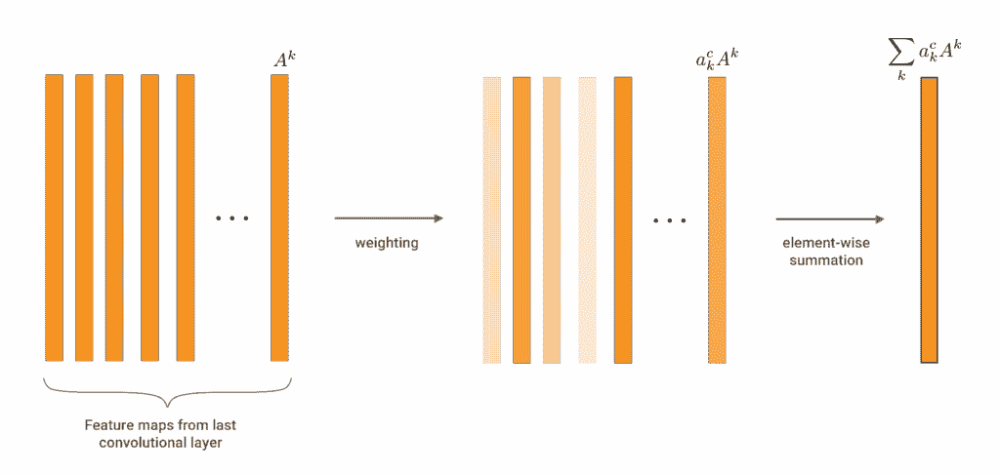
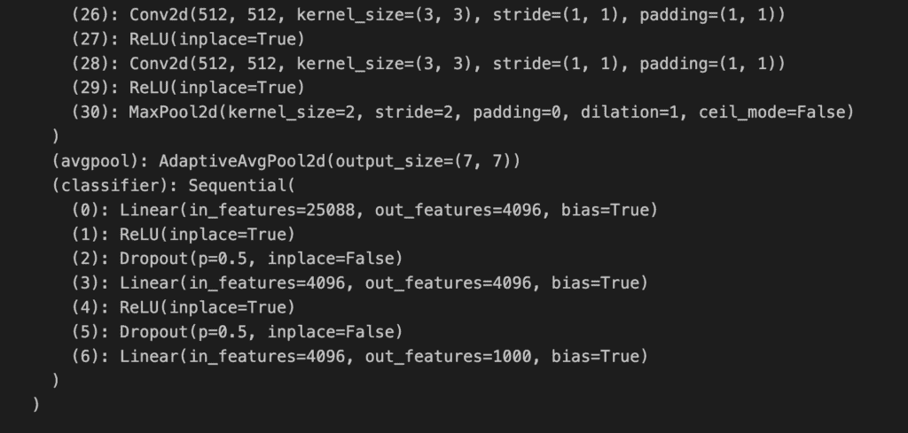
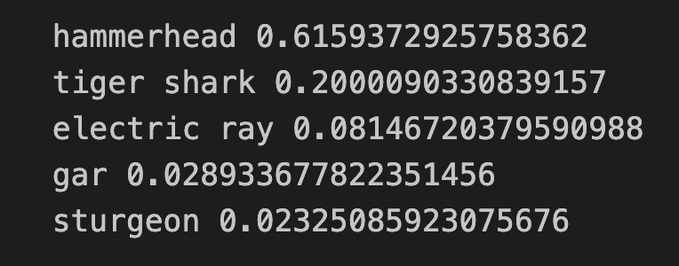
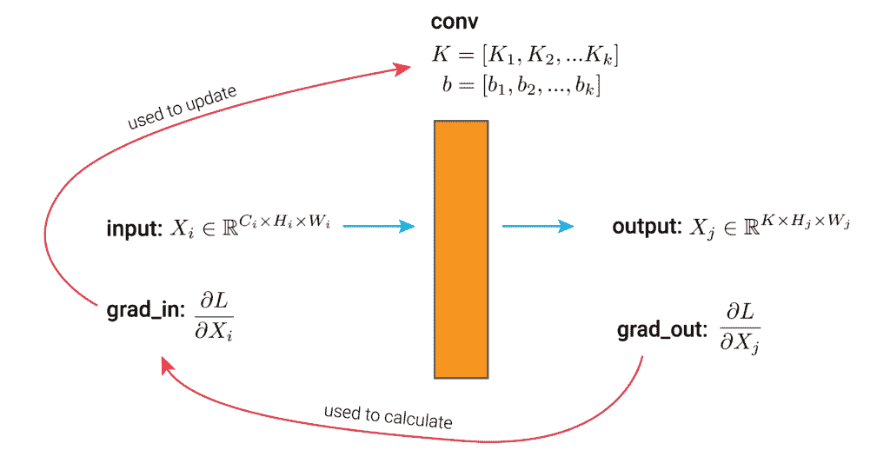
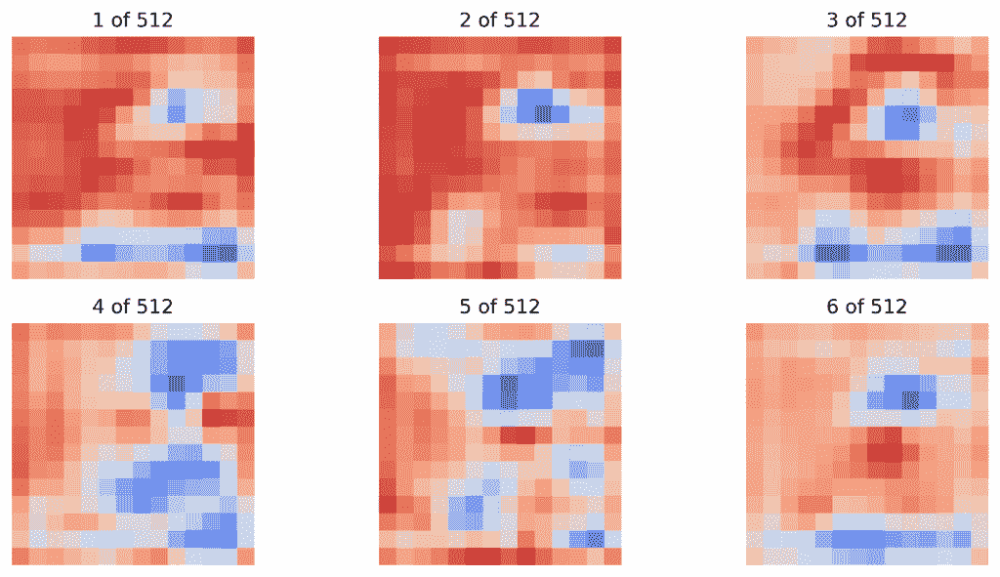
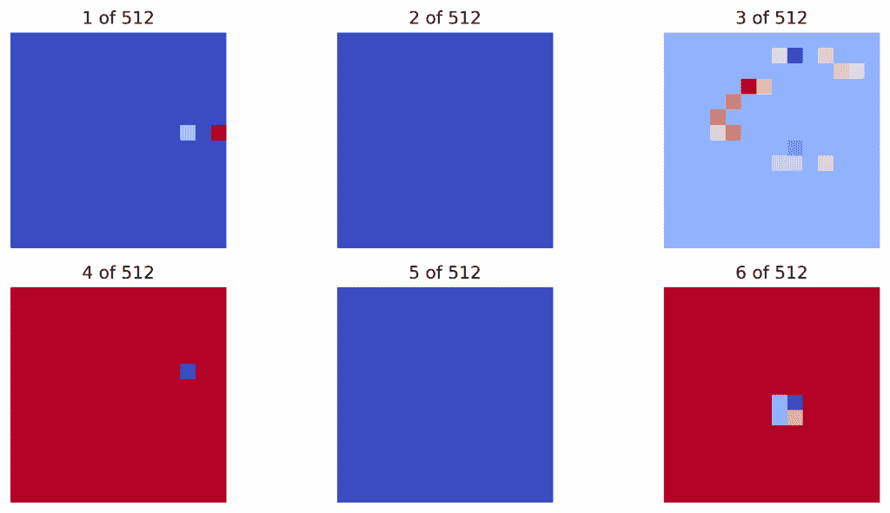
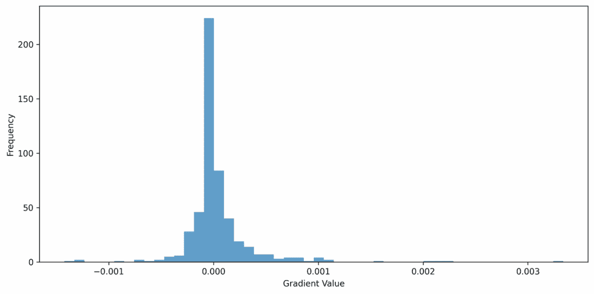
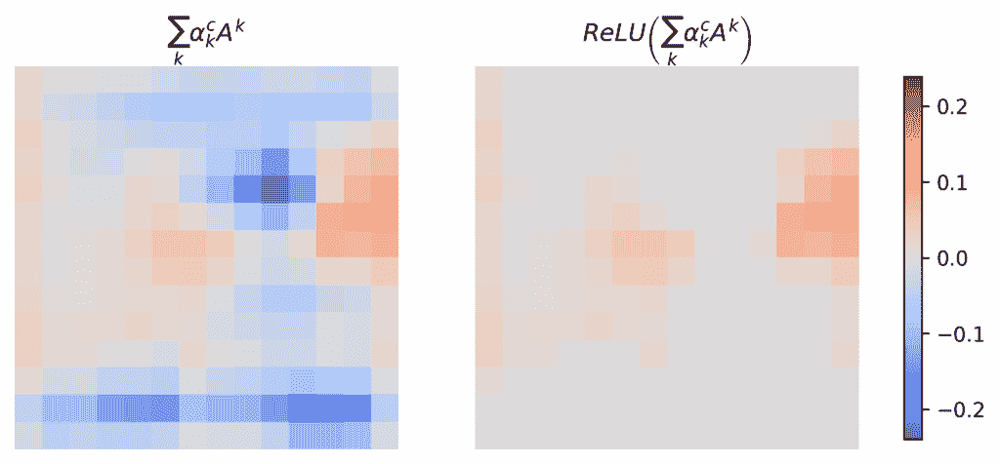
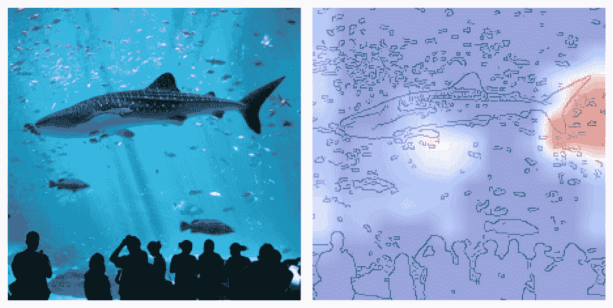
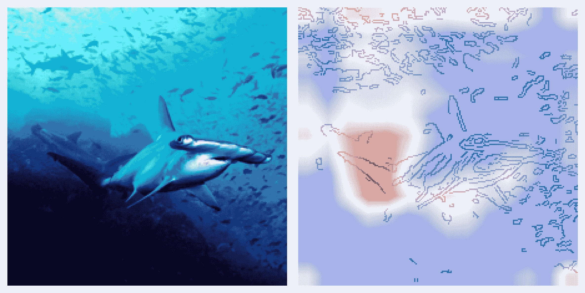

# 使用 PyTorch Hooks 从头开始实现 Grad-CAM

> 原文：[`towardsdatascience.com/grad-cam-from-scratch-with-pytorch-hooks/`](https://towardsdatascience.com/grad-cam-from-scratch-with-pytorch-hooks/)

<mdspan datatext="el1750139294583" class="mdspan-comment">一辆自动驾驶</mdspan>汽车突然停车。令人担忧的是，附近没有看到停车标志。工程师们只能猜测汽车神经网络为什么会困惑。可能是滚过街道的蓬草，另一条车道上驶来的汽车，或者是背景中的红色广告牌。为了找到真正的原因，他们转向 **Grad-CAM** [1]。

[Grad-CAM](https://adataodyssey.com/grad-cam/) 是一种 **可解释人工智能 (XAI**) 技术，它有助于揭示卷积神经网络 (CNN) 做出特定决策的原因。该方法生成一个 **热图**，突出显示图像中对预测最重要的区域。以我们的自动驾驶汽车为例，这可能显示杂草、汽车或广告牌的像素是否导致了汽车停车。

现在，Grad-CAM 是众多 [计算机视觉的 XAI 方法](https://adataodyssey.com/xai-for-cv/) 之一。由于其速度、灵活性和可靠性，它迅速成为最受欢迎的方法之一。它还激发了众多相关方法。因此，如果你对 XAI 感兴趣，了解这种方法是如何工作的非常有价值。为此，我们将使用 Python 从头开始实现 Grad-CAM。

具体来说，我们将依赖 **PyTorch Hooks**。正如你将看到的，这些允许我们在前向和反向传递过程中动态提取 **梯度** 和 **激活**。这些是实用的技能，不仅允许你实现 Grad-CAM，还可以实现任何基于梯度的 XAI 方法。查看 GitHub 上的完整项目 [GitHub](https://github.com/a-data-odyssey/XAI-for-CV/blob/main/src/gradient/grad-cam-from-scratch.ipynb)。

## Grad-CAM 的理论

在我们进入代码之前，值得探讨 Grad-CAM 背后的理论。如果你想深入了解，请查看下面的视频。如果你想了解其他方法，请参见这个免费的 [计算机视觉 XAI 课程](https://adataodyssey.com/xai-for-cv/)。

总结来说，在创建 Grad-CAM 热图时，我们从一个训练好的 CNN 开始。然后我们使用单个样本图像通过这个网络进行前向传递。这将激活网络中的所有卷积层。我们称这些为 **特征图** **($A^k$**)。它们将是一组包含在样本图像中检测到的不同特征的 2D 矩阵。

使用 Grad-CAM，我们通常对网络的最后一层卷积层的映射感兴趣。当我们将此方法应用于 **VGG16** 时，你会看到其最终层有 **512 个特征图**。我们使用这些特征图，因为它们包含具有最详细语义信息的同时仍保留空间信息的特征。换句话说，它们告诉我们用于预测的内容以及图像中的位置。

问题在于这些图也包含对其他类别重要的特征。为了减轻这种情况，我们遵循**图 1**中显示的过程。一旦我们有了特征图（**$A^k$**），我们就根据它们对感兴趣类（**$y_c$**）的重要性进行加权。我们使用**$a_k^c$**——$y_c$相对于特征图中元素的分数的平均梯度来完成这项工作。然后我们进行**逐元素求和**。对于 VGG16，您将看到我们是从 14×14 像素的 512 个图转换到单个 14×14 图。



**图 1**：CNN 中最后卷积层的加权特征图的逐元素求和（来源：作者）

单个元素（**$\frac{\partial y^c}{\partial A_{ij}^k}$**）的梯度告诉我们，当元素发生微小变化时，分数将如何变化。这意味着大的平均梯度表明整个特征图都很重要，应该对最终热图做出更多贡献。因此，当我们对图进行加权和求和时，包含其他类别特征的图可能贡献较少。

最后的步骤是应用 ReLU 激活函数，以确保所有负元素都将具有零值。然后我们使用插值上采样，以便热图与样本图像具有相同的尺寸。最终图由下面的公式总结。您可能从 Grad-CAM 论文[1]中认出它。

$$ L_{Grad-CAM}^c = ReLU\left( \sum_{k} a_k^c A^k \right) $$

## 从零开始实现 Grad-CAM

如果理论不是完全清楚，请不要担心。我们将一步一步地讲解，当我们从零开始应用这种方法时。您可以在[GitHub](https://github.com/a-data-odyssey/XAI-for-CV/blob/main/src/gradient/grad-cam-from-scratch.ipynb)上找到完整的项目。首先，我们下面有我们的导入。这些都是计算机视觉问题中常见的导入。

```py
import matplotlib.pyplot as plt
import numpy as np

import cv2
from PIL import Image

import torch
import torch.nn.functional as F
from torchvision import models, transforms

import urllib.request
```

### 从 PyTorch 加载预训练模型

我们将应用 Grad-CAM 到在**[ImageNet](https://www.image-net.org/)**上预训练的**VGG16**。为了帮助，我们提供了下面的两个函数。第一个函数将以正确的方式格式化图像，以便将其输入到模型中。使用的归一化值是 ImageNet 中图像的均值和标准差。**224×224**的大小也是 ImageNet 模型的常规尺寸。

```py
def preprocess_image(img_path):

    """Load and preprocess images for PyTorch models."""

    img = Image.open(img_path).convert("RGB")

    #Transforms used by imagenet models
    transform = transforms.Compose([
        transforms.Resize((224, 224)),
        transforms.ToTensor(),
        transforms.Normalize(mean=[0.485, 0.456, 0.406], std=[0.229, 0.224, 0.225]),
    ])

    return transform(img).unsqueeze(0)
```

ImageNet 有很多类别。第二个函数将格式化模型的输出，以便我们显示预测概率最高的类别。

```py
def display_output(output,n=5):

    """Display the top n categories predicted by the model."""

    # Download the categories
    url = "https://raw.githubusercontent.com/pytorch/hub/master/imagenet_classes.txt"
    urllib.request.urlretrieve(url, "imagenet_classes.txt")

    with open("imagenet_classes.txt", "r") as f:
        categories = [s.strip() for s in f.readlines()]

    # Show top categories per image
    probabilities = torch.nn.functional.softmax(output[0], dim=0)
    top_prob, top_catid = torch.topk(probabilities, n)

    for i in range(top_prob.size(0)):
        print(categories[top_catid[i]], top_prob[i].item())

    return top_catid[0]
```

我们现在加载[预训练的 VGG16 模型](https://docs.pytorch.org/vision/main/models/generated/torchvision.models.vgg16.html)（第 2 行），将其移动到 GPU（第 5-8 行）并设置为评估模式（第 11 行）。您可以在**图 2**中看到模型输出的一个片段。VGG16 由**16 个加权层**组成。在这里，您可以看到 13 个卷积层中的最后两个和 3 个全连接层。

```py
# Load the pre-trained model (e.g., VGG16)
model = models.vgg16(pretrained=True)

# Set the model to gpu
device = torch.device('mps' if torch.backends.mps.is_built() 
                      else 'cuda' if torch.cuda.is_available() 
                      else 'cpu')
model.to(device)

# Set the model to evaluation mode
model.eval()
```

**图 2**中您看到的名称很重要。稍后，我们将使用它们来引用网络中的特定层以访问其激活和梯度。具体来说，我们将使用*model.features[28]*。这是网络中的最后一个卷积层。如您在快照中看到的，这个层包含 512 个特征图。



图 2：VGG16 网络最终层的快照（来源：作者）

### 带有样本图像的前向传递

我们将解释这个模型的预测。为此，我们需要一个将被输入到模型中的样本图像。我们从维基百科共享下载了一个（第 2-3 行）。然后我们加载它（第 5-6 行），将其裁剪为等高和等宽（第 7 行）并显示它（第 9-10 行）。在**图 3**中，您可以看到我们使用的是水族馆中**鲸鲨**的图像。

```py
# Load a sample image from the web
img_url = "https://upload.wikimedia.org/wikipedia/commons/thumb/a/a1/Male_whale_shark_at_Georgia_Aquarium.jpg/960px-Male_whale_shark_at_Georgia_Aquarium.jpg"
urllib.request.urlretrieve(img_url, "sample_image.jpg")[0]

img_path = "sample_image.jpg"
img = Image.open(img_path).convert("RGB")
img = img.crop((320, 0, 960, 640))  # Crop to 640x640

plt.imshow(img)
plt.axis("off")
```


图 3：水族馆中的雄性鲸鲨（来源：[维基媒体共享](https://commons.wikimedia.org/wiki/File:Male_whale_shark_at_Georgia_Aquarium.jpg))（许可：[CC BY-SA 2.5](https://creativecommons.org/licenses/by-sa/2.5/))

ImageNet 没有为鲸鲨设置专门的类别，因此将很有趣地看到模型会做出什么预测。为此，我们首先处理我们的图像（第 2 行）并将其移动到 GPU（第 3 行）。然后我们进行前向传递以获取预测（第 6 行）并显示前 5 个概率（第 7 行）。您可以在**图 4**中看到这些内容。

```py
# Preprocess the image
img_tensor = preprocess_image(img_path)
img_tensor = img_tensor.to(device)

# Forward pass
predictions = model(img_tensor)
display_output(predictions,n=5)
```

考虑到可用的类别，这些看起来是合理的。它们都是海洋生物，前两个是鲨鱼。现在，让我们看看我们如何解释这个预测。我们希望了解图像的哪些区域对最高预测类别——**锤头鲨**——的贡献最大。



图 4：使用 VGG16 对鲸鲨示例图像的前 5 个预测类别（来源：作者）

### PyTorch 钩子命名规范

Grad-CAM 热图是使用前向传递的激活和反向传递的梯度创建的。要访问这些，我们将使用 PyTorch 钩子。这些是允许您保存层输入和输出的函数。我们在这里不会这样做，但它们甚至允许您更改这些方面。例如，通过确保仅使用反向钩子传播正梯度，可以应用[引导反向传播](https://adataodyssey.com/guided-backpropagation/)。

下面是一些这些函数的示例。一个*forwards_hook*将在前向传递期间被调用。它将注册在给定的模块（即层）上。默认情况下，该函数接收三个参数——模块、其输入和其输出。同样，一个*backwards_hook*将在反向传递期间触发，与模块以及输入和输出的梯度相关。

```py
# Example of a forwards hook function
def fowards_hook(module, input, output):
    """Parameters:
            module (nn.Module): The module where the hook is applied.
            input (tuple of Tensors): Input to the module.
            output (Tensor): Output of the module."""
    ...

# Example of a backwards hook function 
def backwards_hook(module, grad_in, grad_out):
    """Parameters:
            module (nn.Module): The module where the hook is applied.
            grad_in (tuple of Tensors): Gradients w.r.t. the input of the module.
            grad_out (tuple of Tensors): Gradients w.r.t. the output of the module."""
    ...
```

为了避免混淆，让我们明确这些函数使用的参数名称。请参阅 **图 5** 中卷积层标准反向传播过程的概述。这个层由一组核 $K$ 和偏置 $b$ 组成。其他部分包括：

+   *input* – 一组特征图或一张图像

+   *output* – 一组特征图

+   *grad_in* 是相对于层输入的损失梯度。

+   *grad_out* 是相对于层输出的损失梯度。

我们使用与调用后续钩子函数相同的参数名称来标记这些内容。



图 5：深度学习模型中卷积层的反向传播。蓝色箭头表示前向传递，红色箭头表示反向传递。（来源：作者）

请记住，我们不会像反向传播那样使用梯度。通常，我们使用一批图像的梯度来更新 $K$ 和 $b$。现在，我们只对单个样本图像的 *grad_out* 感兴趣。这将给出层特征图中元素的梯度。换句话说，我们使用的梯度是用来加权特征图的。

### 使用 PyTorch 前向钩子激活

我们使用 ReLU（*inplace=True.*）创建了 VGG16 网络。这些修改内存中的张量，因此原始值会丢失。也就是说，用作输入的张量会被 ReLU 函数覆盖。这可能导致在使用钩子时出现问题，因为我们可能需要原始输入。因此，我们使用下面的代码将所有 ReLU 函数替换为 *inplace=False* 的版本。这不会影响模型的输出，但会增加其内存使用。

```py
# Replace all in-place ReLU activations with out-of-place ones
def replace_relu(model):

    for name, child in model.named_children():
        if isinstance(child, torch.nn.ReLU):
            setattr(model, name, torch.nn.ReLU(inplace=False))
            print(f"Replacing ReLU activation in layer: {name}")
        else:
            replace_relu(child)  # Recursively apply to submodules

# Apply the modification to the VGG16 model
replace_relu(model)
```

下面是我们的第一个钩子函数 — *save_activations*。这会将模块的输出（第 6 行）追加到激活列表（第 2 行）中。在我们的情况下，我们只会在一个模块上注册钩子（即最后一个卷积层），因此这个列表只会包含一个元素。注意我们如何格式化输出（第 6 行）。我们将其从 [计算图](https://pytorch.org/blog/computational-graphs-constructed-in-pytorch/) 中分离出来，这样网络就不会受到影响。我们还将其格式化为 numpy 数组并压缩批量维度。

```py
# List to store activations
activations = []

# Function to save activations
def save_activations(module, input, output):
    activations.append(output.detach().cpu().numpy().squeeze())
```

要使用钩子函数，我们需要在最后一个卷积层上注册它 — *model.features[28].* 这是通过使用 *register_forward_hook* 函数完成的。

```py
# Register the hook to the last convolutional layer
hook = model.features[28].register_forward_hook(save_activations)
```

现在，当我们进行前向传递（第 2 行）时，*save_activations* 钩子函数将为此层调用。换句话说，其输出将被保存到 *activations* 列表中。

```py
# Forward pass through the model to get activations
prediction = model(img_tensor) 
```

最后，当不再需要钩子函数时，删除钩子函数是一种良好的实践（第 2 行）。这意味着如果我们再次进行前向传递，前向钩子函数将不会被触发。

```py
# Remove the hook after use
hook.remove() 
```

这些激活的形状是 **(512, 14, 14)**。换句话说，我们有 512 个特征图，每个图是 14×14 像素。您可以在 **图 6** 中看到一些示例。其中一些图可能包含对其他类别重要的特征或那些降低预测类别概率的特征。因此，让我们看看我们如何找到梯度来帮助我们识别最重要的图。

```py
act_shape = np.shape(activations[0])
print(f"Shape of activations: {act_shape}") # (512, 14, 14)
```



图 6：网络最后一层卷积层的激活特征图示例（来源：作者）

### 使用 PyTorch 反向钩子计算梯度

要获取梯度，我们遵循与之前类似的过程。关键区别在于我们现在使用 `*register_full_backward_hook*` 来注册 `*save_gradients*` 函数（第 7 行）。这将确保它在反向传播期间被调用。重要的是，我们从具有最高分数的类的输出（第 13 行）进行反向传播（第 16 行）。这实际上将这个类别的分数设置为 1，而所有其他分数设置为 0。换句话说，我们得到了锤头类相对于特征图元素的梯度。

```py
gradients = []

def save_gradient(module, grad_in, grad_out):
    gradients.append(grad_out[0].cpu().numpy().squeeze())

# Register the backward hook on a convolutional layer
hook = model.features[28].register_full_backward_hook(save_gradient)

# Forward pass
output = model(img_tensor)

# Pick the class with highest score
score = output[0].max()

# Backward pass from the score
score.backward()

# Remove the hook after use
hook.remove()
```

我们将为特征图的每个元素都有一个梯度。所以，再次，形状是 **(512, 14, 14)**。**图 7** 可视化了一些这些梯度。您可以看到一些倾向于有更高的值。然而，我们并不那么关心单个梯度。当我们创建 Grad-CAM 热图时，我们将使用每个特征图的平均梯度。

```py
grad_shape = np.shape(gradients[0])
print(f"Shape of gradients: {grad_shape}") # (512, 14, 14)
```



图 7：与最后一层卷积层中特征图元素相关的梯度（来源：作者）

最后，在我们继续之前，重置模型的梯度（第 2 行）是一个好的实践。如果您计划对多张图片运行代码，这尤其重要，因为梯度可以在每次反向传播中累积。

```py
# Reset gradients
model.zero_grad() 
```

### 创建 Grad-CAM 热图

首先，我们为每个特征图找到 **平均梯度**。将有 512 个这样的平均梯度。绘制它们的直方图，您可以看到大多数倾向于在 0 附近。换句话说，这些对预测分数的影响不大。有一些倾向于有负面影响和正面影响。我们想要给予这些特征图更多权重。

```py
# Step 1: aggregate the gradients
gradients_aggregated = np.mean(gradients[0], axis=(1, 2))
```



图 8：平均梯度的直方图（来源：作者）

我们通过进行 **逐元素求和**（第 2-4 行）来组合所有激活。当我们这样做时，我们将每个特征图按其平均梯度加权（第 3 行）。最后，我们将有一个 14×14 的数组。

```py
# Step 2: weight the activations by the aggregated gradients and sum them up
weighted_activations = np.sum(activations[0] * 
                              gradients_aggregated[:, np.newaxis, np.newaxis], 
                              axis=0)
```

这些加权激活将包含正像素和负像素。我们可以将负像素视为抑制预测分数。换句话说，这些区域值的增加往往会降低分数。由于我们只对**正贡献**感兴趣——支持类别预测的区域——我们在最终的热图上应用了一个**ReLU 激活**（第 2 行）。您可以在**图 9**中看到热图之间的差异。

```py
# Step 3: ReLU summed activations
relu_weighted_activations = np.maximum(weighted_activations, 0)
```



图 9：加权激活的 relu（来源：作者）

您可以看到**图 9**中的热图相当粗糙。如果它具有原始图像的尺寸，将更有用。这就是为什么创建 Grad-CAM 热图的最后一步是将尺寸上采样到输入图像的尺寸（第 2-4 行）。在这种情况下，我们有一个**224×224**的图像。

```py
#Step 4: Upsample the heatmap to the original image size
upsampled_heatmap = cv2.resize(relu_weighted_activations, 
                               (img_tensor.size(3), img_tensor.size(2)), 
                               interpolation=cv2.INTER_LINEAR)

print(np.shape(upsampled_heatmap))  # Should be (224, 224)
```

**图 10**为我们提供了最终的可视化。我们在热图（第 10-15 行）旁边显示样本图像（第 5-7 行）。对于后者，我们通过**Canny 边缘检测**（第 10 行）创建了一个清晰的视觉表示。这给我们提供了一个样本图像的边缘图（即轮廓）。然后我们可以在其上叠加热图（第 14 行）。

```py
# Step 5: visualise the heatmap
fig, ax = plt.subplots(1, 2, figsize=(8, 8))

# Input image
resized_img = img.resize((224, 224))
ax[0].imshow(resized_img)
ax[0].axis("off")

# Edge map for the input image
edge_img = cv2.Canny(np.array(resized_img), 100, 200)
ax[1].imshow(255-edge_img, alpha=0.5, cmap='gray')

# Overlay the heatmap 
ax[1].imshow(upsampled_heatmap, alpha=0.5, cmap='coolwarm')
ax[1].axis("off")
```

观察我们的 Grad-CAM 热图，有一些噪声。然而，模型似乎依赖于尾鳍，并且在一定程度上依赖于胸鳍来做出预测。这开始让人理解为什么模型将这条鲨鱼分类为锤头鲨。也许这两种动物都有这些特征。



图 10：输入图像（左）和 grad-cam 热图叠加在边缘图上（右）（来源：作者）

为了进行进一步的研究，我们应用了相同的过程，但现在使用的是锤头鲨的实际图像。在这种情况下，模型似乎依赖于相同的特征。这有点令人担忧。我们不是期望模型使用鲨鱼的一个定义特征——锤头吗？最终，这可能导致 VGG16 混淆不同类型的鲨鱼。



图 11：一个额外的示例图像（来源：[维基共享资源](https://commons.wikimedia.org/wiki/File:Scalloped_hammerhead_cocos.jpg)）（许可：[CC BY 2.0](https://creativecommons.org/licenses/by/2.0/deed.en)）

通过这个例子，我们看到 Grad-CAM 如何突出我们模型中的潜在缺陷。我们不仅可以获得它们的预测，还可以了解它们是如何做出的。我们可以了解所使用的特征是否会导致未来的不可预见的预测。这可能会节省我们大量的时间、金钱，在更重要的应用中，甚至可能拯救生命！

如果您想了解更多关于 CV 的 XAI，请查看这些文章之一。或者查看这个免费的[XAI for CV 课程](https://adataodyssey.com/xai-for-cv/)。

> [从零开始使用 PyTorch 钩子进行引导反向传播](https://adataodyssey.com/guided-backpropagation/)
> 
> [从零开始学习类激活图（Class Activation Maps）](https://adataodyssey.com/class-activation-maps/)

* * *

我希望您喜欢这篇文章！查看[课程页面](https://adataodyssey.com/course/)获取更多 XAI 课程。您也可以在我的[Bluesky](https://bsky.app/profile/conorosullyds.bsky.social) | [Threads](https://www.threads.net/@conorosullyds) | [YouTube](https://www.youtube.com/channel/UChsoWqJbEjBwrn00Zvghi4w) | [Medium](https://medium.com/@conorosullyds)上找到我。

### 参考文献

[1] Ramprasaath R Selvaraju, Michael Cogswell, Abhishek Das, Ramakrishna Vedantam, Devi Parikh, and Dhruv Batra. Grad-cam: Visual explanations from deep networks via gradient-based localization. In Proceedings of the IEEE international conference on computer vision, pages 618–626, 2017.
