# 数据科学中的图着色：全面指南

> 原文：[`towardsdatascience.com/graph-coloring-for-data-science/`](https://towardsdatascience.com/graph-coloring-for-data-science/)

<mdspan datatext="el1756215885810" class="mdspan-comment">Rita</mdspan>正在给一朵有六个花瓣的圆形花朵的图片着色。她希望用以下四种颜色中的任意一种给每个花瓣着色：红色、橙色、黄色和蓝色。相邻的两个花瓣不能有相同的颜色。不一定需要使用所有四种颜色。Rita 有多少种方式可以着色花朵花瓣，同时满足这些约束？这是[2025 凯莱竞赛](https://cemc.uwaterloo.ca/sites/default/files/documents/2025/2025CayleyContest.html)问题#25 的基础，它恰好是关于*图着色*概念的一类组合数据科学问题的具体例子。在以下各节中，我们将解决 Rita 的具体问题，推导其通解和闭式解，并探讨一些有趣的工业应用。

**注意：**以下各节中的所有图表和公式均由本文作者创建。

## 一个理论难题

要解决 Rita 的问题，让我们首先将花瓣可视化为一个由 6 个节点组成的循环图，这些节点通过图 1 中所示的方式连接：

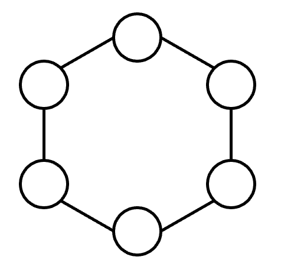

图 1：未着色的花瓣循环

图 2 显示了花瓣的一些有效着色（也称为*正确*着色）：

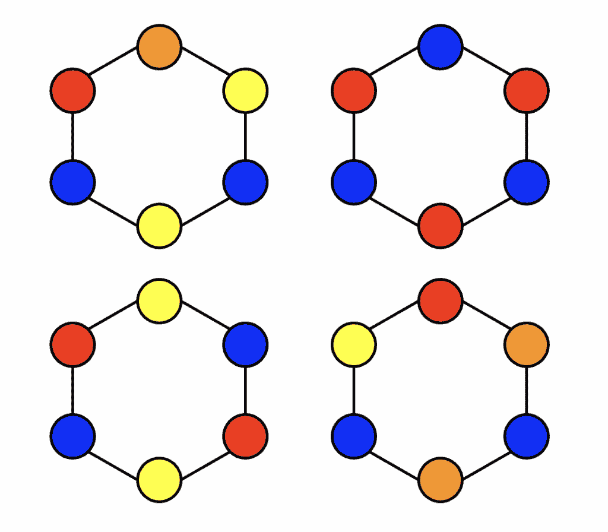

图 2：有效着色的例子

设*P*(*n*, *k*)为我们可以用*k*种颜色着色*n*个节点的循环的方式的数量，使得相邻节点没有相同的颜色。

现在，考虑如果我们把循环分解成由*n*个节点组成的链会发生什么。有多少种方式*P[chain]*(*n*, *k*)来用*k*种颜色着色*n*个节点的链，使得相邻节点没有相同的颜色？对于链中的起始（最左边的）节点，我们有*k*种颜色的选择。但对于链中接下来的*n* – 1 个节点中的每一个，我们只有*k* – 1 种颜色的选择，因为其中一个颜色已经被前面的节点占用。这种直觉在下图 3 中得到了说明：

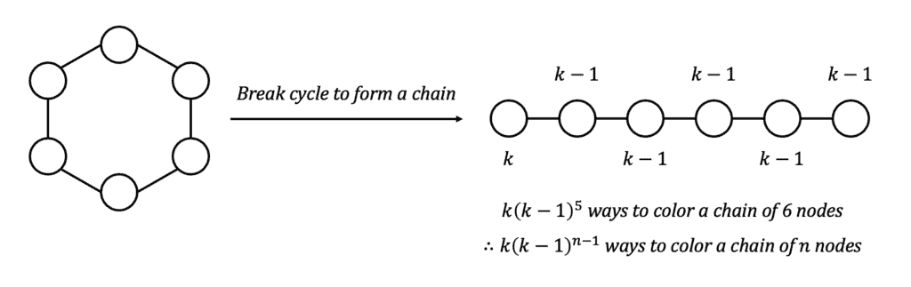

图 3：从循环到链

因此，我们有：

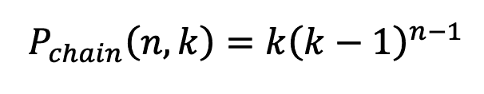

然而，请注意，在这些有效着色中，链中的第一个和最后一个节点将共享相同的颜色——如果我们从*P[chain]*(*n*, *k*)中减去这些情况，那么我们就会得到所需的*P*(*n*, *k*)。此外，请注意，要减去的情况等同于*P*(*n – 1, *k*)，即用*k*种颜色着色*n* – 1 个节点的循环的方式，使得相邻节点没有相同的颜色。这种所谓的*删除-收缩*技巧在下图 4 中得到了说明：

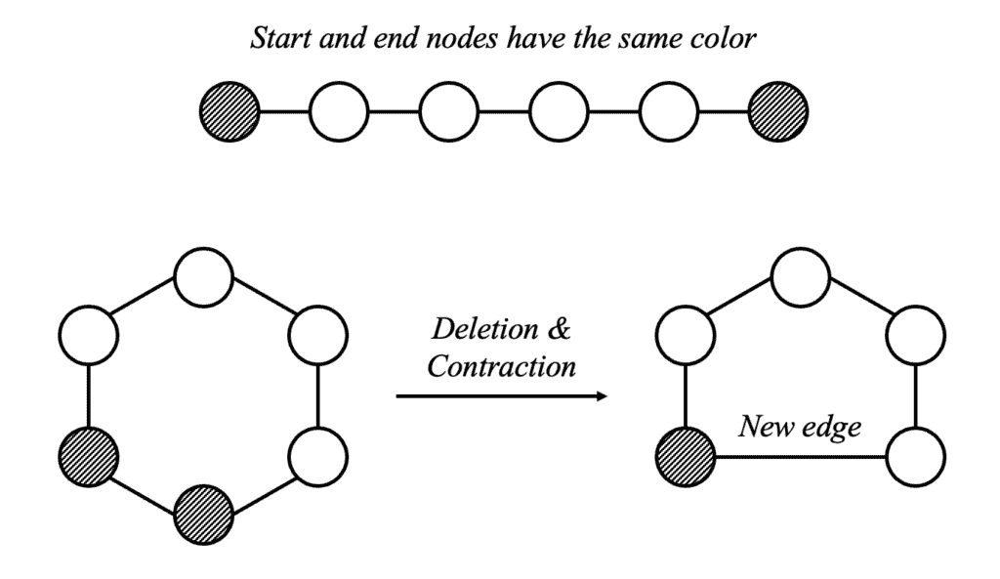

图 4：删除-收缩操作

下面的图 5 显示了 *P*(*n*, *k*) 的基本案例，对于给定的值 *k*：

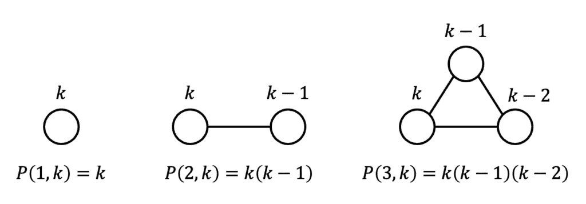

图 5：基本案例

将所有这些洞察力综合起来，我们得到以下一阶递归关系，适用于正整数 *n* > 3 和 *k*，以及上述描述的基本案例：

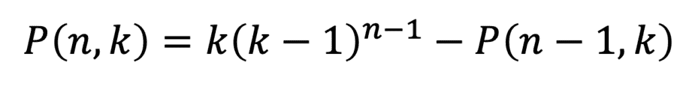

现在，解决丽塔的问题相当于评估递归函数 *P*(*n*, *k*)，其中 *n* = 6 且 *k* = 4。由于在这个情况下数字相对较小，我们可以通过如下展开 *P*(6, 4) 来进行评估：

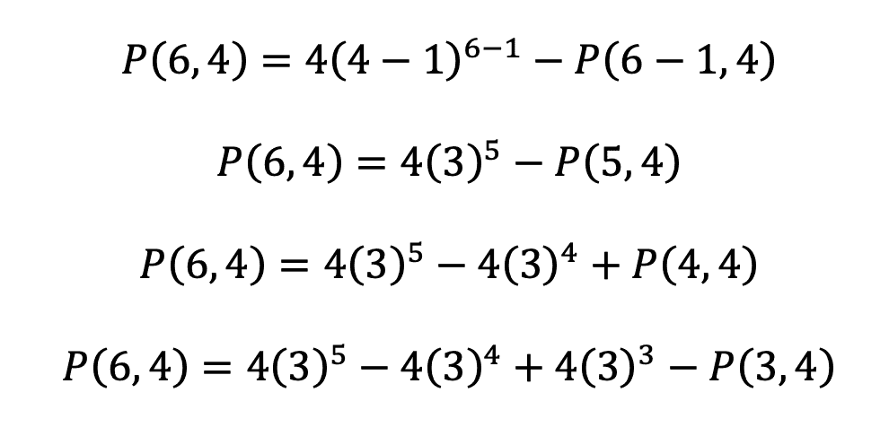

使用基本案例 *P*(3, *k*) 的表达式，注意：

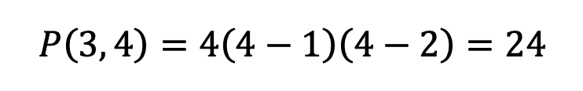

因此：

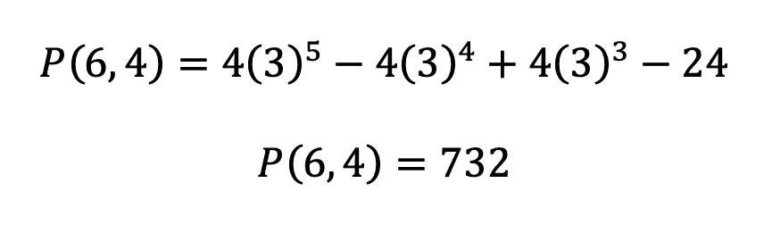

因此，丽塔在满足给定约束的情况下，为她花的花瓣着色有恰好 732 种方式。

以下 Python 函数（兼容 Python 版本≥3.9）实现了递归，使我们能够快速评估 *P*(*n*, *k*) 对于较大的输入值：

```py
def num_proper_colorings(n: int, k: int) -> int:
    """
    Iteratively compute the number of proper colorings of a cycle graph with n nodes and k colors.

    Parameters:
    - n (int): Number of nodes in the cycle graph.
    - k (int): Number of available colors.

    Returns:
    - int: Number of proper colorings.
    """
    if n == 1:
        return k
    elif n == 2:
        return k * (k - 1)
    elif n == 3:
        return k * (k - 1) * (k - 2)

    # Initialize base case num_proper_colorings(3, k)
    num_prev = k * (k - 1) * (k - 2) 

    for i in range(4, n + 1):
        current = k * (k - 1)**(i - 1) - num_prev
        num_prev = current

    return num_prev
```

图着色也可以通过回溯来实现，这是一种探索各种类型数据科学问题的解空间的有用技术，并逐步构建候选解。[这篇文章](https://towardsdatascience.com/a-gentle-introduction-to-backtracking/)提供了对回溯的直观介绍，以下视频展示了如何将回溯应用于图着色问题：

## 封闭形式解

上面的迭代 Python 函数在循环图中的节点数 *n* 方面的时间复杂度为 *O*(*n*)。然而，如果我们能找到 *P*(*n*, *k*) 的 *解析* 或 *封闭形式解*，我们就可以直接评估结果；相应的 Python 函数的时间复杂度将仅为 *O*(1)，因此在 *n* 非常大时可以节省大量时间。时间复杂度和封闭形式解的优点在[这篇文章](https://medium.com/data-science/algorithmic-thinking-for-data-scientists-4601ac68496f)中进行了更深入的讨论。

为了找到一个简化的封闭形式解，让我们将我们的递归关系重新排列如下：

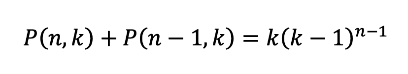

在这一点上，我们可以利用线性代数中的一个巧妙原理：线性代数方程 *f*(*x*) = *y* 的通解是其齐次方程 *f*(*x*) = 0 的通解 *x[h]* 和方程 *f*(*x*) = *y* 的特解 *x[p]* 的和。为了提醒自己为什么这行得通，我们可以将 *x[h]* + *x[p]* 代入 *f*(*x*) = *y*，得到 *f*(*x[h]* + *x[p]*) = *y*。由于 *f*(*x*) 是一个线性函数，*f*(*x[h]* + *x[p]*) = *f*(*x[h]*) + *f*(*x[p]*) = *y*。我们知道 *f*(*x[h]*) = 0 和 *f*(*x[p]*) = *y*。通过代入，*f*(*x[h]*) + *f*(*x[p]*) = 0 + *y* = *y*。方程 *y* = *y* 显然是正确的，这证实了 *x[h]* + *x[p]* 确实是 *f*(*x*) = *y* 的通解。因此，我们的任务现在变成了：

+   找到齐次方程 *P*(*n*, *k*) + *P*(*n* – 1, *k*) = 0 的通解 *x[h]*

+   找到递推方程 *P*(*n*, *k*) + *P*(*n* – 1, *k*) = *k*(*k* – 1)^((*n* – 1)) 的特解 *x[p]*

+   将 *x[h]* 和 *x[p]* 结合起来，推导出我们递推的通解

因此，让我们从解决以下齐次方程开始：

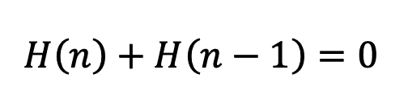

注意，为了简化，我们让：

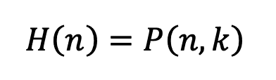

每一项似乎都抵消了前一项，所以它必须在每一步交替符号，即存在一个常数项 *C*（我们将在下面推导它）使得：

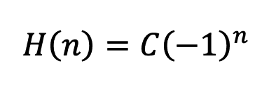

接下来，由于原始递推方程的右侧是 (*k* – 1)^((*n* – 1)) 的倍数，让我们尝试以下特解 *P*‘：

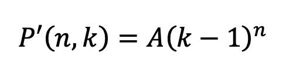

*A* 是一个常数项，我们可以通过将 *P’* 插入原始递推方程的左侧来推导出来，如下所示：

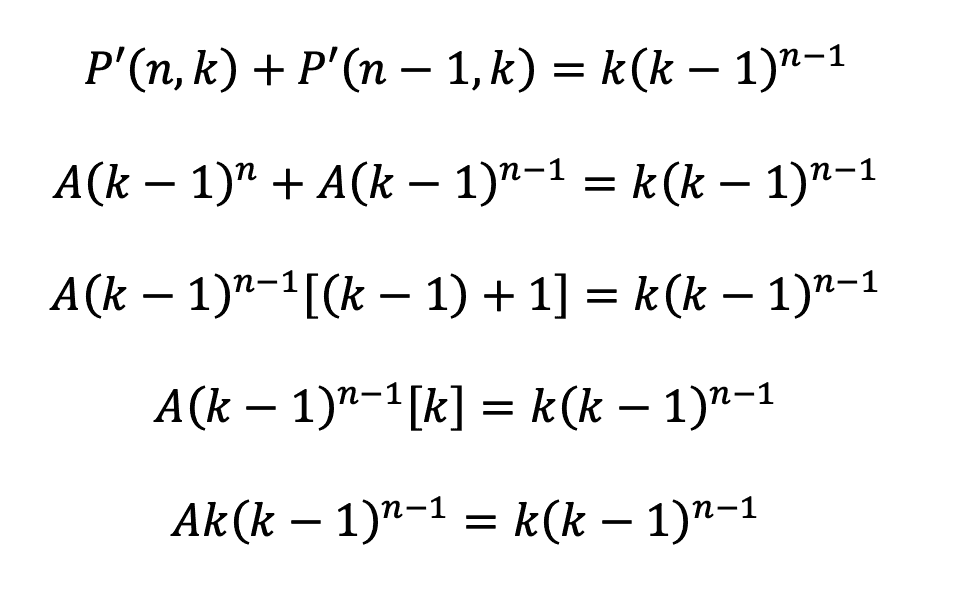

这意味着 *A* = 1，所以我们有：

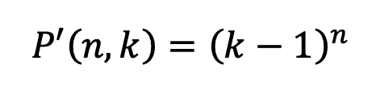

将特解和齐次解结合起来，我们得到：

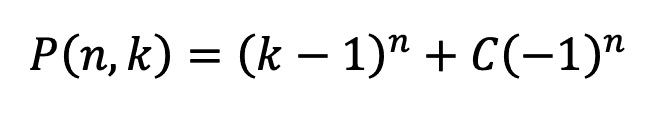

现在，我们可以使用我们的基例 *n* = 3 来推导 *C*：

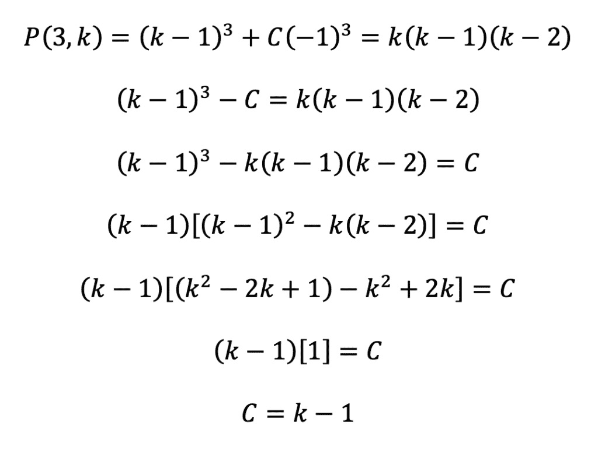

将 *C* 代回到组合解中，我们得到以下闭式解：

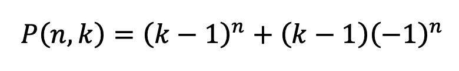

我们可以验证这确实为我们提供了凯莱竞赛问题的正确解：

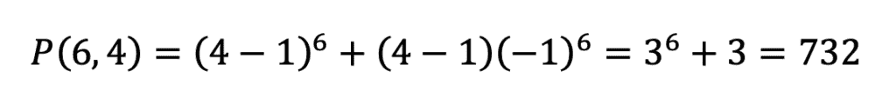

## 实际应用

图着色是图论中的一个基本问题，涉及将标签（或“颜色”）分配给图的节点，使得没有两个相邻节点共享相同的颜色。本质上，图着色试图将图划分为独立的集合，这些集合可以统一处理（即，集合中的所有元素可以分配相同的颜色），同时不违反相邻约束。这种问题框架可以应用于涉及基于约束的优化和资源分配的广泛数据科学用例。我们下面将探讨一些这些应用。

### 调度和排程

图着色可以用来解决调度问题，其中任务或事件必须安排得没有冲突。用于模拟此类场景的图通常被称为*冲突图*。

考虑设计学校课程表的直观情况。每个班级可以在图中表示为一个节点，如果有些学生同时上这两个班级，则两个班级之间有一条边连接。时间槽由颜色表示。图的适当着色——即相邻节点不共享相同的颜色——确保没有学生面临同时参加两个课程的困境。考试排程的情况也类似，因为考试必须分配时间槽，以便没有学生有冲突的考试时间。图着色可以用来解决这类问题，并最小化整体所需的时间槽数量。

图着色还可以帮助解决工业环境中基于约束的调度问题。例如，汽车制造厂的产品组装通常涉及各种任务，如喷漆、布线、底盘装配和安装发动机。每个任务都需要专门的工具、工作站和熟练的工人，并且可能对任务顺序有某些限制。喷漆不应紧接布线之后进行，因为残留的油漆气味可能会损坏敏感的电子产品。发动机安装和底盘装配可能需要一些相同的设备（例如，升降机或校准装置），这些设备短缺且不能同时使用。为了应用图着色，我们可以将每个任务建模为图中的一个节点，如果相应的任务存在冲突（即，任务不能连续安排），则两个节点之间有一条边连接。颜色代表不同的时间槽或组装阶段。适当的图着色确保冲突任务不会连续安排；这有助于优化制造工作流程，减少停机时间和资源瓶颈，并防止昂贵的错误。

### 聚类和特征选择

在数据挖掘和机器学习（ML）中，聚类算法根据共享特征或关系将数据点分组在一起。图着色通过将数据视为一个图，其中节点代表单个数据点，边表示节点之间的某种关系（例如，相似性、类别成员资格）提供了一种自然的方法来进行聚类。图着色使我们能够将数据划分为独立的集合（即，不直接连接的节点组），以有效地检测聚类；这种方法在社交网络分析、生物数据建模和推荐系统中可能特别有用，在这些系统中实体之间的关系可能相当复杂。适当的图着色有助于确保每个聚类在内部具有凝聚力，同时与其他聚类区分开来，为下游分析提供了一个干净且可解释的结构。感兴趣的读者可以查看[这篇文章](https://doi.org/10.1016/j.ijresmar.2018.10.001)和[这本书](https://www.amazon.com/Advanced-Applications-Network-Analysis-Marketing/dp/3746068118)，深入了解数据特征工程中图论表示的深入探讨。

最后，特征选择在构建高效且可解释的机器学习（ML）模型时是一个重要的考虑因素，尤其是在高维数据（例如，在基因组学和金融等领域）的背景下。在许多特征上训练模型计算成本高昂，并且高度相关的特征往往包含冗余信息，这可能导致训练效率低下和过拟合。图着色提供了一种优雅的解决方案：构建一个图，其中每个节点代表一个特征，边连接高度相关的特征对。适当的图着色确保没有两个高度相关的特征被分配相同的颜色，从而允许每个颜色选择一个代表性的特征。这种技术降低了维度，同时保留了信息多样性，导致模型更简单，可能具有更好的泛化能力。

## 总结

图着色，虽然根植于组合数学，但其实际相关性远远超出了理论谜题。从涉及花瓣的数学竞赛问题开始，我们推导出了循环图正确着色的通用和封闭形式解，并探讨了图着色如何应用于广泛的数据科学问题。此类实际应用的关键在于智能的问题构建：如果问题以正确的方式构建为一个图——仔细考虑节点、边和着色约束的定义——那么解决方案可能就会显而易见。借用一个经常（错误地）归功于爱因斯坦的[引言](https://quoteinvestigator.com/2014/05/22/solve/)，“如果你有一个小时来解决一个问题，你应该花 55 分钟思考问题，5 分钟思考解决方案。”最终，随着数据科学领域的持续发展，图着色等技术可能会在研究和应用环境中变得更加相关。
