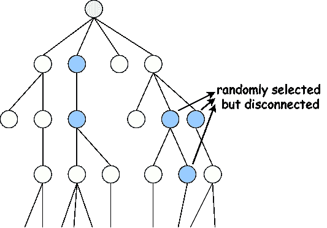
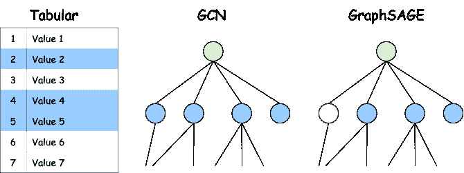
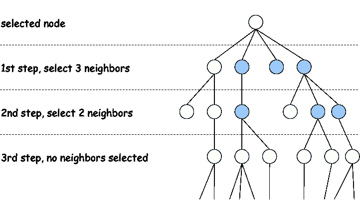

# 图神经网络系列第三部分：GraphSAGE 如何处理变化的图结构

> 原文：[`towardsdatascience.com/graph-neural-networks-part-3-how-graphsage-handles-changing-graph-structure/`](https://towardsdatascience.com/graph-neural-networks-part-3-how-graphsage-handles-changing-graph-structure/)

**<mdspan datatext="el1743488306877" class="mdspan-comment">在前面的</mdspan>本系列文章中，我们探讨了图卷积网络（GCNs）和图注意力网络（GATs）。这两种架构运行良好，但它们也有一些局限性！一个很大的问题是，对于大型图，使用 GCNs 和 GATs 计算节点表示会变得非常慢。另一个局限性是，如果图结构发生变化，GCNs 和 GATs 将无法泛化。所以如果图中有新节点添加，GCN 或 GAT 就无法对其做出预测。幸运的是，这些问题是可以解决的！**

在这篇文章中，我将解释 GraphSAGE 以及它是如何解决 GCNs 和 GATs 的常见问题的。我们将训练 GraphSAGE 并用它来进行图预测，以比较其与 GCNs 和 GATs 的性能。

> 新手学习 GNNs？你可以从[关于 GCNs 的第一篇帖子](https://towardsdatascience.com/graph-neural-networks-part-1-graph-convolutional-networks-explained-9c6aaa8a406e/)开始（也包含了运行代码示例的初始设置），以及[关于 GATs 的第二篇帖子](https://towardsdatascience.com/graph-neural-networks-part-2-graph-attention-networks-vs-gcns-029efd7a1d92/).

* * *

## GCNs 和 GATs 的两个关键问题

我在引言中简要提到了它，但让我们更深入地探讨一下。前一代 GNN 模型有哪些问题？

### 问题 1\. 它们不具备泛化能力

GCNs 和 GATs 在泛化到未见过的图方面存在困难。图结构需要与训练数据相同。这被称为**归纳学习**，其中模型在同一个固定的图上训练并做出预测。这实际上是对特定图拓扑的过拟合。在现实中，图会发生变化：节点和边可以被添加或删除，这在现实世界场景中经常发生。我们希望我们的 GNNs 能够学习到可以泛化到未见节点或完全新图的模式（这被称为**归纳**学习）。

### 问题 2\. 它们存在可扩展性问题

在大规模图上训练 GCNs 和 GATs 计算成本很高。GCNs 需要重复的邻居聚合，这会随着图大小的增加而呈指数增长，而 GATs 涉及（多头）注意力机制，这些机制随着节点数量的增加而表现不佳。

在大型生产推荐系统中，这些系统具有包含数百万用户和产品的庞大图，GCNs 和 GATs 不切实际且速度慢。

让我们来看看 GraphSAGE 来解决这些问题。

## GraphSAGE (SAmple and aggreGatE)

[GraphSAGE](https://arxiv.org/pdf/1706.02216)使训练变得更快且可扩展。它是通过*仅采样邻居的子集*来实现的。对于超级大图，处理一个节点的所有邻居在计算上是不可行的（除非你有无限的时间，但我们都没有……），就像传统的 GCNs 一样。GraphSAGE 的另一个重要步骤是*将采样邻居的特征与聚合函数相结合*。

我们将在下面逐步介绍 GraphSAGE 的所有步骤。

### 1. 采样邻居

对于表格数据，采样很容易。这是在创建训练、测试和验证集的每个常见机器学习项目中都会做的事情。对于图，你不能选择随机节点。这可能导致断开的图、没有邻居的节点等等：



随机选择节点，但有些是断开的。图由作者提供。

你可以用图来做的，是选择一个随机固定大小的邻居子集。例如在一个社交网络中，你可以为每个用户采样 3 个朋友（而不是所有朋友）：



随机选择表中的三行，所有在 GCN 中选择的邻居，GraphSAGE 中选择的三个邻居。图由作者提供。

### 2. 聚合信息

在上一部分中的邻居选择之后，GraphSAGE 将它们的特征组合成一个单一表示。有多种方法可以做到这一点（多种*聚合函数*）。最常见类型和论文中解释的类型是*平均聚合*、*LSTM*和*池化*。

使用平均聚合，计算所有采样邻居特征的平均值（非常简单且通常有效）。在公式中：


LSTM 聚合使用一个[LSTM](https://www.bioinf.jku.at/publications/older/2604.pdf)（一种神经网络类型）来顺序处理邻居特征。它可以捕捉更复杂的关系，并且比平均聚合更强大。

第三种类型，池化聚合，应用非线性函数来提取关键特征（想想神经网络中的[max-pooling](https://paperswithcode.com/method/max-pooling)，在那里你也取一些值的最大值）。

### 3. 更新节点表示

在采样和聚合之后，节点会将它的先前特征与聚合的邻居特征相结合。节点将从它们的邻居那里学习，同时保持自己的身份，就像我们在之前的 GCNs 和 GATs 中看到的那样。信息可以在图中有效地流动。

这是这一步的公式：


第二步的聚合是在所有邻居上进行的，然后将节点的特征表示连接起来。这个向量乘以权重矩阵，并通过非线性（例如 ReLU）。作为最终步骤，可以应用归一化。

### 4. 重复多层

前三个步骤可以重复多次，当这种情况发生时，信息可以从远端邻居流向。在下面的图像中，你可以看到一个在第一层（直接邻居）中选择了三个邻居的节点，以及在第二层（邻居的邻居）中选择了两个邻居。



选择具有选择邻居的节点，第一层有三个，第二层有两个。值得注意的是，第一步中节点的其中一个邻居就是所选节点，因此在第二步选择两个邻居时，它也可以被选中（只是可视化起来稍微困难一些）。图由作者提供。

总结来说，GraphSAGE 的关键优势在于其可扩展性（采样使其对大规模图高效）；灵活性，你可以用它进行归纳学习（当用于预测未见节点和图时表现良好）；聚合有助于泛化，因为它平滑了噪声特征；多层允许模型从远端节点学习。

太酷了！最好的是，GraphSAGE 在[PyG](https://pyg.org/)中得到了实现，所以我们可以在 PyTorch 中轻松使用它。

## 使用 GraphSAGE 进行预测

在之前的帖子中，我们在[Cora](https://paperswithcode.com/dataset/cora)数据集（CC BY-SA）上实现了 MLP、GCN 和 GAT。为了让你稍微回忆一下，Cora 是一个包含科学出版物数据集，你必须预测每篇论文的主题，总共有七个类别。这个数据集相对较小，所以它可能不是测试 GraphSAGE 的最佳选择。我们仍然会这样做，只是为了能够进行比较。让我们看看 GraphSAGE 的表现如何。

我喜欢强调的与 GraphSAGE 相关的代码的有趣部分：

+   执行每层邻居选择的`NeighborLoader`：

```py
from torch_geometric.loader import NeighborLoader

# 10 neighbors sampled in the first layer, 10 in the second layer
num_neighbors = [10, 10]

# sample data from the train set
train_loader = NeighborLoader(
    data,
    num_neighbors=num_neighbors,
    batch_size=batch_size,
    input_nodes=data.train_mask,
)
```

+   聚合类型在`SAGEConv`层中实现。默认为`mean`，你可以将其更改为`max`或`lstm`：

```py
from torch_geometric.nn import SAGEConv

SAGEConv(in_c, out_c, aggr='mean')
```

+   另一个重要的区别是，GraphSAGE 在迷你批次中训练，而 GCN 和 GAT 在完整数据集上训练。这触及了 GraphSAGE 的本质，因为 GraphSAGE 的邻居采样使其能够在迷你批次中训练，我们不再需要完整的图。GCN 和 GAT 需要完整的图来进行正确的特征传播和计算注意力分数，这就是为什么我们在完整图上训练 GCN 和 GAT。

+   其余的代码与之前类似，只是我们有一个类，其中所有不同的模型都是基于`model_type`（GCN、GAT 或 SAGE）实例化的。这使得比较或进行小改动变得容易。

这是完整的脚本，我们训练了 100 个 epoch，并重复实验 10 次，以计算每个模型的平均准确率和标准差：

```py
import torch
import torch.nn.functional as F
from torch_geometric.nn import SAGEConv, GCNConv, GATConv
from torch_geometric.datasets import Planetoid
from torch_geometric.loader import NeighborLoader

# dataset_name can be 'Cora', 'CiteSeer', 'PubMed'
dataset_name = 'Cora'
hidden_dim = 64
num_layers = 2
num_neighbors = [10, 10]
batch_size = 128
num_epochs = 100
model_types = ['GCN', 'GAT', 'SAGE']

dataset = Planetoid(root='data', name=dataset_name)
data = dataset[0]
device = torch.device('cuda' if torch.cuda.is_available() else 'cpu')
data = data.to(device)

class GNN(torch.nn.Module):
    def __init__(self, in_channels, hidden_channels, out_channels, num_layers, model_type='SAGE', gat_heads=8):
        super().__init__()
        self.convs = torch.nn.ModuleList()
        self.model_type = model_type
        self.gat_heads = gat_heads

        def get_conv(in_c, out_c, is_final=False):
            if model_type == 'GCN':
                return GCNConv(in_c, out_c)
            elif model_type == 'GAT':
                heads = 1 if is_final else gat_heads
                concat = False if is_final else True
                return GATConv(in_c, out_c, heads=heads, concat=concat)
            else:
                return SAGEConv(in_c, out_c, aggr='mean')

        if model_type == 'GAT':
            self.convs.append(get_conv(in_channels, hidden_channels))
            in_dim = hidden_channels * gat_heads
            for _ in range(num_layers - 2):
                self.convs.append(get_conv(in_dim, hidden_channels))
                in_dim = hidden_channels * gat_heads
            self.convs.append(get_conv(in_dim, out_channels, is_final=True))
        else:
            self.convs.append(get_conv(in_channels, hidden_channels))
            for _ in range(num_layers - 2):
                self.convs.append(get_conv(hidden_channels, hidden_channels))
            self.convs.append(get_conv(hidden_channels, out_channels))

    def forward(self, x, edge_index):
        for conv in self.convs[:-1]:
            x = F.relu(conv(x, edge_index))
        x = self.convs-1
        return x

@torch.no_grad()
def test(model):
    model.eval()
    out = model(data.x, data.edge_index)
    pred = out.argmax(dim=1)
    accs = []
    for mask in [data.train_mask, data.val_mask, data.test_mask]:
        accs.append(int((pred[mask] == data.y[mask]).sum()) / int(mask.sum()))
    return accs

results = {}

for model_type in model_types:
    print(f'Training {model_type}')
    results[model_type] = []

    for i in range(10):
        model = GNN(dataset.num_features, hidden_dim, dataset.num_classes, num_layers, model_type, gat_heads=8).to(device)
        optimizer = torch.optim.Adam(model.parameters(), lr=0.01, weight_decay=5e-4)

        if model_type == 'SAGE':
            train_loader = NeighborLoader(
                data,
                num_neighbors=num_neighbors,
                batch_size=batch_size,
                input_nodes=data.train_mask,
            )

            def train():
                model.train()
                total_loss = 0
                for batch in train_loader:
                    batch = batch.to(device)
                    optimizer.zero_grad()
                    out = model(batch.x, batch.edge_index)
                    loss = F.cross_entropy(out, batch.y[:out.size(0)])
                    loss.backward()
                    optimizer.step()
                    total_loss += loss.item()
                return total_loss / len(train_loader)

        else:
            def train():
                model.train()
                optimizer.zero_grad()
                out = model(data.x, data.edge_index)
                loss = F.cross_entropy(out[data.train_mask], data.y[data.train_mask])
                loss.backward()
                optimizer.step()
                return loss.item()

        best_val_acc = 0
        best_test_acc = 0
        for epoch in range(1, num_epochs + 1):
            loss = train()
            train_acc, val_acc, test_acc = test(model)
            if val_acc > best_val_acc:
                best_val_acc = val_acc
                best_test_acc = test_acc
            if epoch % 10 == 0:
                print(f'Epoch {epoch:02d} | Loss: {loss:.4f} | Train: {train_acc:.4f} | Val: {val_acc:.4f} | Test: {test_acc:.4f}')

        results[model_type].append([best_val_acc, best_test_acc])

for model_name, model_results in results.items():
    model_results = torch.tensor(model_results)
    print(f'{model_name} Val Accuracy: {model_results[:, 0].mean():.3f} ± {model_results[:, 0].std():.3f}')
    print(f'{model_name} Test Accuracy: {model_results[:, 1].mean():.3f} ± {model_results[:, 1].std():.3f}') 
```

下面是结果：

```py
GCN Val Accuracy: 0.791 ± 0.007
GCN Test Accuracy: 0.806 ± 0.006
GAT Val Accuracy: 0.790 ± 0.007
GAT Test Accuracy: 0.800 ± 0.004
SAGE Val Accuracy: 0.899 ± 0.005
SAGE Test Accuracy: 0.907 ± 0.004
```

令人印象深刻的改进！即使在这个小数据集上，GraphSAGE 也轻易地超越了 GAT 和 GCN！我重复了这个测试，针对 CiteSeer 和 PubMed 数据集，GraphSAGE 总是表现最佳。

我想在这里注意的是，GCN 仍然非常有用，它是最有效的基线之一（如果图结构允许的话）。此外，我没有进行很多超参数调整，只是采用了某些标准值（例如，GAT 多头注意力的 8 个头）。在更大、更复杂和更嘈杂的图中，GraphSAGE 的优势比这个例子中更加明显。我们没有进行任何性能测试，因为对于这些小图，GraphSAGE 并不比 GCN 快。

* * *

## 结论

相比于 GAT 和 GCN，GraphSAGE 为我们带来了非常不错的改进和好处。归纳学习是可能的，GraphSAGE 可以很好地处理变化的图结构。而且我们在这篇文章中没有对其进行测试，但邻居采样使得为具有良好性能的大图创建特征表示成为可能。

### 相关

> [**优化连接：图内的数学优化**](https://towardsdatascience.com/optimizing-connections-mathematical-optimization-within-graphs-7364e082a984)
> 
> [**图神经网络第一部分：图卷积网络解析**](https://towardsdatascience.com/graph-neural-networks-part-1-graph-convolutional-networks-explained-9c6aaa8a406e)
> 
> [**图神经网络第二部分：图注意力网络与 GCN 的比较**](https://towardsdatascience.com/graph-neural-networks-part-2-graph-attention-networks-vs-gcns-029efd7a1d92)
