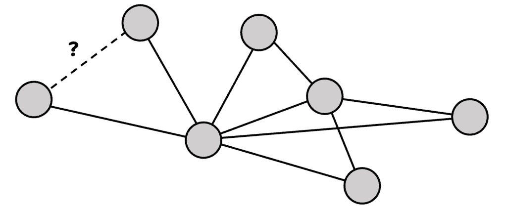
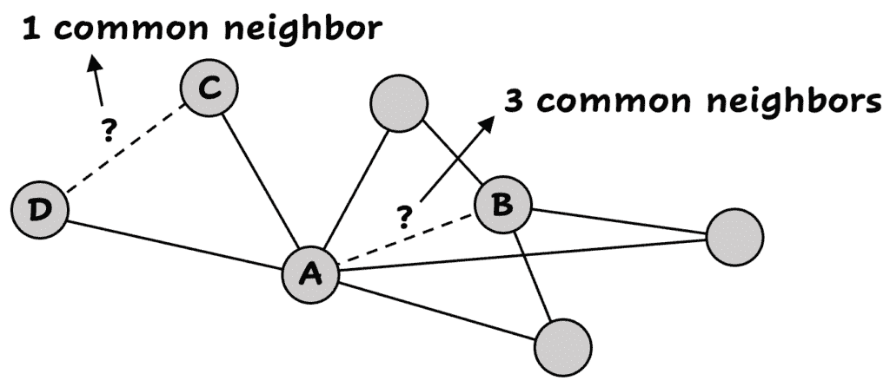
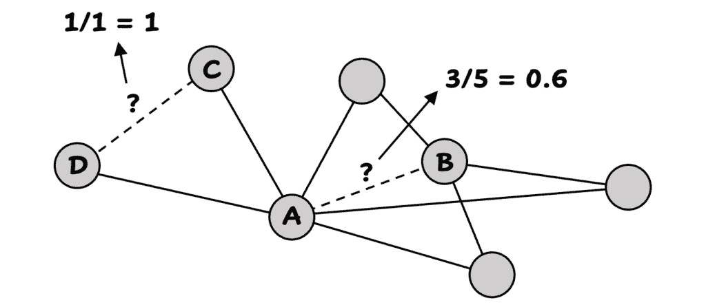
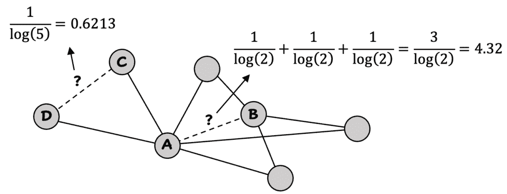
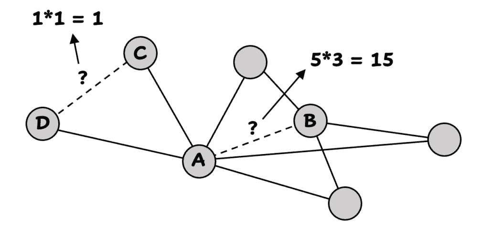
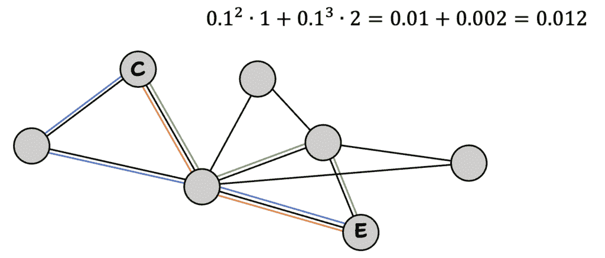
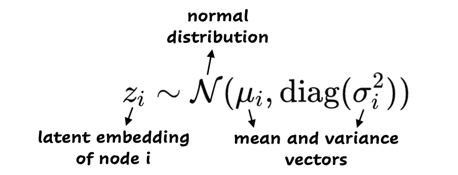
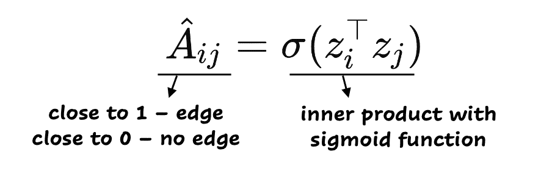
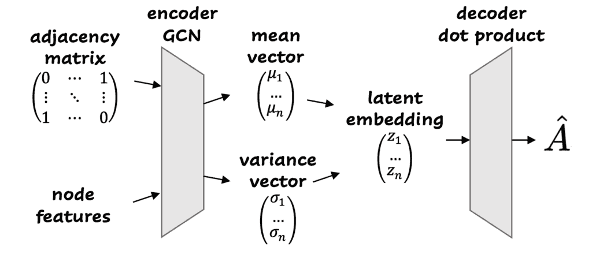
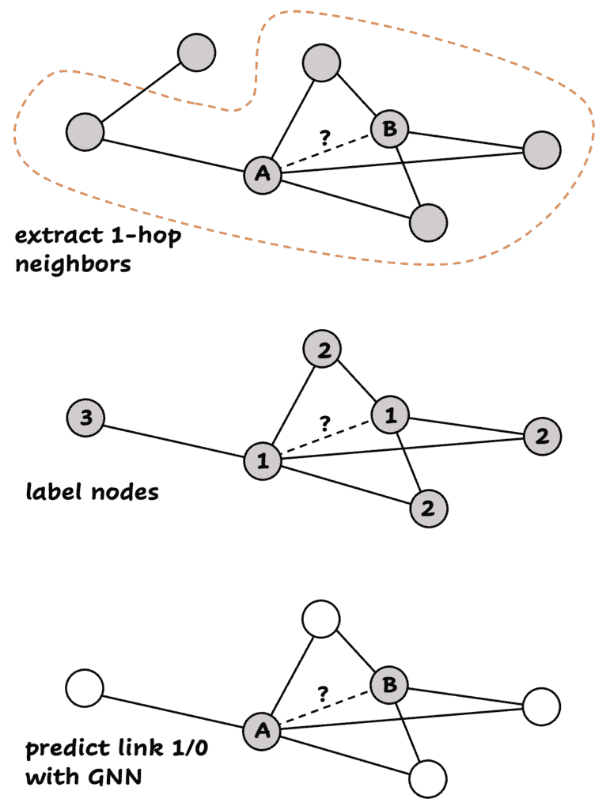

# 图神经网络第四部分：教模型连接点

> 原文：[`towardsdatascience.com/graph-neural-networks-part-4-teaching-graphs-to-connect-the-dots/`](https://towardsdatascience.com/graph-neural-networks-part-4-teaching-graphs-to-connect-the-dots/)

**<mdspan datatext="el1745951325198" class="mdspan-comment">你是否**）曾想过 Facebook 是如何知道你可能认识谁？或者为什么它有时会建议一个完全陌生的人？这个问题被称为链接预测。在社会网络图中，人们是节点，友谊是边，目标是预测两个节点之间是否应该存在连接。

链接预测是一个非常热门的话题！它可以用于在社交网络中推荐朋友，在电子商务网站上建议产品或在 Netflix 上推荐电影，或者预测生物中的蛋白质相互作用。在这篇文章中，你将探索链接预测是如何工作的。首先，你将学习简单的启发式方法，然后我们以基于 GNN 的强大方法 SEAL 作为结束。

> 前几篇文章解释了[GCNs](https://towardsdatascience.com/graph-neural-networks-part-1-graph-convolutional-networks-explained-9c6aaa8a406e/)、[GATs](https://towardsdatascience.com/graph-neural-networks-part-2-graph-attention-networks-vs-gcns-029efd7a1d92/)和[GraphSage](https://towardsdatascience.com/graph-neural-networks-part-3-how-graphsage-handles-changing-graph-structure/)。它们主要涵盖了预测节点属性，所以你可以单独阅读这篇文章，因为这次我们将重点转向预测边。如果你想更深入地了解节点表示，我建议重新阅读之前的文章。代码设置可以在[这里](https://towardsdatascience.com/graph-neural-networks-part-1-graph-convolutional-networks-explained-9c6aaa8a406e/)找到。

* * *

## 什么是链接预测？

链接预测是预测图中节点之间缺失或未来连接（边）的任务。给定一个图 *G = (V, E)*，目标是预测是否存在一条边连接两个节点 (*u, v*) ∉ *E*。

为了评估链接预测模型，你可以通过隐藏现有边的一部分来创建一个测试集，并要求模型预测它们。当然，测试集应该包含正样本（真实边），以及负样本（随机节点对，它们之间没有连接）。你可以在剩余的图上训练模型。

模型的输出是每个节点对的链接得分或概率。你可以用 AUC 或平均精度等指标来评估这些。

我们将探讨简单的基于启发式的方法，然后我们转向更复杂的方法。



节点和边的图。我们将使用这个图作为启发式方法的示例。图片由作者提供。

## 基于启发式的方法

我们可以将这些“简单”的方法分为两类：本地和全局。本地启发式算法基于局部结构，而全局启发式算法使用整个图。这些方法基于规则，并且作为链接预测任务的基线效果良好。

### 本地启发式算法

正如其名所示，本地启发式算法依赖于你正在测试潜在链接的两个节点的*直接邻域*。实际上，它们可以非常有效。本地启发式算法的优点是它们速度快且可解释。但它们只关注紧密邻域，因此捕捉关系的复杂性是有限的。

#### 共同邻居

理念很简单：如果两个节点共享许多共同邻居，它们更有可能连接在一起。

对于计算，你统计节点共有的邻居数。这里的一个问题是，它没有考虑到共有邻居的相对数量。

在下面的示例中，A 和 B 之间的共同邻居数是 3，C 和 D 之间的共同邻居数是 1。



#### Jaccard 系数

Jaccard 系数解决了共同邻居的问题，并计算了共有邻居的相对数量。

你将共有邻居数除以两个节点的总唯一邻居数。

所以现在情况有点变化：节点 A 和 B 的 Jaccard 系数是 3/5 = 0.6（它们有 3 个共同邻居和 5 个总唯一邻居），而节点 C 和 D 的 Jaccard 系数是 1/1 = 1（它们有 1 个共同邻居和 1 个唯一邻居）。在这种情况下，C 和 D 之间的连接更有可能，因为它们只有 1 个邻居，而且它也是一个共同邻居。



Jaccard 系数对于两条不同边。图片由作者提供。

#### Adamic-Adar 指数

Adamic-Adar 指数比共同邻居更进一步：它使用共同邻居的受欢迎程度，并给更受欢迎的邻居（它们有更多连接）赋予更少的权重。背后的直觉是，如果一个节点与所有人连接，它并不能告诉我们关于特定连接的太多信息。

这在公式中看起来是什么样子？


因此，对于每个共同邻居*z*，我们添加一个分数，即 1 除以*z*的邻居数对数。通过这样做，共同邻居越受欢迎，其贡献就越小。

让我们计算一下我们的示例中的 Adamic-Adar 指数。



Adamic-Adar 指数。如果一个共同邻居很受欢迎，它的贡献就会减少。图片由作者提供。

#### 优先连接

另一种方法是优先连接。其背后的理念是，度数较高的节点更有可能形成链接。计算非常简单，你只需将两个节点的度数（连接数）相乘。

对于 A 和 B，度数分别是 5 和 3，所以得分是 5*3=15。C 和 D 的得分是 1*1=1。在这种情况下，A 和 B 更有可能建立连接，因为它们在一般情况下有更多的邻居。



示例中的优先连接得分。图片由作者提供。

### 全局启发式

全局启发式方法考虑路径、游走或整个图结构。它们可以捕捉更丰富的模式，但计算成本更高。

#### Katz 指数

链接预测中最著名的全局启发式方法是 Katz 指数。它考虑两个节点之间所有不同的路径（通常只有最多三步的路径）。每条路径都会根据其长度以指数方式衰减得到一个权重。这在直观上是有意义的，因为路径越短，它就越重要（共同的朋友意味着很多）。另一方面，间接路径也很重要！它们可以暗示潜在的链接。

Katz 公式：


我们取两个节点，C 和 E，并计算它们之间的路径。有三条路径，最多有三步：一条两步的路径（橙色），和两条三步的路径（蓝色和绿色）。现在我们可以计算 Katz 指数，让我们选择 0.1 作为 beta 值：



对节点 C 和 E 进行 Katz 指数计算。较短路径增加更多权重。图片由作者提供。

#### 根节点 PageRank

这种方法使用随机游走来确定从第一个节点开始的随机游走最终结束在第二个节点的可能性。所以你从第一个节点开始，然后你可以走到一个随机邻居，或者跳回到第一个节点。你最终到达第二个节点的概率告诉你两个节点有多接近。如果概率很高，那么节点之间应该有很好的链接机会。

## 基于机器学习的链接预测

机器学习方法通过直接从数据中学习模式将链接预测超越了启发式方法。与依赖于预定义规则不同，ML 模型可以学习复杂的特征，这些特征表明是否存在链接。

一种基本的方法是将链接预测视为一个二元分类任务：对于每个节点对（u，v），我们创建一个特征向量，并训练一个模型来预测 1（存在链接）或 0（不存在链接）。你可以添加我们之前计算出的启发式方法作为特征。启发式方法并不总是同意边的可能性，有时 A 和 B 之间的边更有可能，而其他时候 C 和 D 之间的边是更好的选择。通过包括多个分数作为特征，我们不必选择一个启发式方法。当然，根据问题，某些启发式方法可能比其他启发式方法更有效。

你可以添加的另一种类型的功能是聚合特征：例如节点度数、节点嵌入、属性平均值等。

然后使用任何分类器（例如，逻辑回归、随机森林、XGBoost）来预测链接。这已经比单独使用启发式方法表现更好，尤其是当它们结合使用时。

在这篇文章中，我们将使用 Cora 数据集来测试不同的链接预测方法。[Cora 数据集](https://paperswithcode.com/dataset/cora)包含科学论文。边表示论文之间的引用。让我们训练一个机器学习模型作为基线，其中我们只添加 Jaccard 系数：

```py
import os.path as osp

from sklearn.linear_model import LogisticRegression
from sklearn.metrics import roc_auc_score, average_precision_score
from torch_geometric.datasets import Planetoid
from torch_geometric.transforms import RandomLinkSplit
from torch_geometric.utils import to_dense_adj

# reproducibility
from torch_geometric import seed_everything
seed_everything(42)

# load Cora dataset, create train/val/test splits
path = osp.join(osp.dirname(osp.realpath(__file__)), '..', 'data', 'Planetoid')
dataset = Planetoid(path, name='Cora')

data_all = dataset[0]
transform = RandomLinkSplit(num_val=0.05, num_test=0.1, is_undirected=True, split_labels=True)
train_data, val_data, test_data = transform(data_all)

# add Jaccard and train with Logistic Regression
adj = to_dense_adj(train_data.edge_index, max_num_nodes=data_all.num_nodes)[0]

def jaccard(u, v, adj):
    u_neighbors = set(adj[u].nonzero().view(-1).tolist())
    v_neighbors = set(adj[v].nonzero().view(-1).tolist())
    inter = len(u_neighbors & v_neighbors)
    union = len(u_neighbors | v_neighbors)
    return inter / union if union > 0 else 0.0

def extract_features(pairs, adj):
    return [[jaccard(u, v, adj)] for u, v in pairs]

train_pairs = train_data.pos_edge_label_index.t().tolist() + train_data.neg_edge_label_index.t().tolist()
train_labels = [1] * train_data.pos_edge_label_index.size(1) + [0] * train_data.neg_edge_label_index.size(1)

test_pairs = test_data.pos_edge_label_index.t().tolist() + test_data.neg_edge_label_index.t().tolist()
test_labels = [1] * test_data.pos_edge_label_index.size(1) + [0] * test_data.neg_edge_label_index.size(1)

X_train = extract_features(train_pairs, adj)
clf = LogisticRegression().fit(X_train, train_labels)

X_test = extract_features(test_pairs, adj)
probs = clf.predict_proba(X_test)[:, 1]
auc_ml = roc_auc_score(test_labels, probs)
ap_ml = average_precision_score(test_labels, probs)
print(f"[ML Heuristic] AUC: {auc_ml:.4f}, AP: {ap_ml:.4f}") 
```

我们用 AUC 来评估。这是结果：

```py
[ML Model] AUC: 0.6958, AP: 0.6890
```

我们可以更进一步，并使用直接在图结构上操作的神经网络。

## VGAE：编码和解码

[变分图自动编码器](https://arxiv.org/abs/1611.07308)就像一个神经网络，它学习猜测图的隐藏结构。然后，它可以利用这些隐藏知识来预测缺失的链接。

VGAE 实际上是 GAE（图自动编码器）和 [VAE](https://en.wikipedia.org/wiki/Variational_autoencoder)（变分自动编码器）的结合。我稍后会回到 GAE 和 VGAE 之间的区别。

VGAE 的步骤如下。首先，VGAE **将节点编码为潜在向量**，然后它 **解码节点对**以 **预测它们之间是否存在边**。

编码是如何工作的？每个节点被映射到一个潜在变量，即某个隐藏空间中的一个点。编码器是一个 [图卷积网络](https://towardsdatascience.com/graph-neural-networks-part-1-graph-convolutional-networks-explained-9c6aaa8a406e/)（GCN），它为每个节点生成一个均值和方差向量。它使用节点特征和邻接矩阵作为输入。使用这些向量，VGAE 从正态分布中采样一个潜在嵌入。重要的是要注意，每个节点不仅仅被映射到一个单一点，而是到一个分布！这是 GAE 和 VGAE 之间的区别，在 GAE 中，每个节点被映射到一个单一点。



下一步是解码步骤。VGAE 将猜测两个节点之间是否存在边。它是通过计算两个节点的嵌入之间的内积来做到这一点的：



其背后的想法是：如果节点在隐藏空间中更靠近，那么它们更有可能连接在一起。

VGAE 可视化：



模型是如何学习的？它优化了两件事：

+   重建损失：预测的边是否与真实边匹配？

+   KL 散度损失：潜在空间是否良好且规则？

让我们在 Cora 数据集上测试 VGAE：

```py
import os.path as osp

import numpy as np
import torch
from sklearn.metrics import roc_auc_score, average_precision_score

from torch_geometric.datasets import Planetoid
from torch_geometric.nn import GCNConv, VGAE
from torch_geometric.transforms import RandomLinkSplit

# same as before
from torch_geometric import seed_everything
seed_everything(42)

path = osp.join(osp.dirname(osp.realpath(__file__)), '..', 'data', 'Planetoid')
dataset = Planetoid(path, name='Cora')

data_all = dataset[0]
transform = RandomLinkSplit(num_val=0.05, num_test=0.1, is_undirected=True, split_labels=True)
train_data, val_data, test_data = transform(data_all)

# VGAE
class VGAEEncoder(torch.nn.Module):
    def __init__(self, in_channels, out_channels):
        super().__init__()
        self.conv1 = GCNConv(in_channels, 2 * out_channels)
        self.conv_mu = GCNConv(2 * out_channels, out_channels)
        self.conv_logstd = GCNConv(2 * out_channels, out_channels)

    def forward(self, x, edge_index):
        x = self.conv1(x, edge_index).relu()
        return self.conv_mu(x, edge_index), self.conv_logstd(x, edge_index)

vgae = VGAE(VGAEEncoder(dataset.num_features, 32))
vgae_optimizer = torch.optim.Adam(vgae.parameters(), lr=0.01)

x = data_all.x
edge_index = train_data.edge_index

# train VGAE model
for epoch in range(1, 101):
    vgae.train()
    vgae_optimizer.zero_grad()
    z = vgae.encode(x, edge_index)
    # reconstruction loss
    loss = vgae.recon_loss(z, train_data.pos_edge_label_index)
    # KL divergence
    loss = loss + (1 / data_all.num_nodes) * vgae.kl_loss()
    loss.backward()
    vgae_optimizer.step()

vgae.eval()
z = vgae.encode(x, edge_index)

@torch.no_grad()
def score_edges(pairs):
    edge_tensor = torch.tensor(pairs).t().to(z.device)
    return vgae.decoder(z, edge_tensor).view(-1).cpu().numpy()

vgae_scores = np.concatenate([score_edges(test_data.pos_edge_label_index.t().tolist()),
                              score_edges(test_data.neg_edge_label_index.t().tolist())])
vgae_labels = np.array([1] * test_data.pos_edge_label_index.size(1) +
                       [0] * test_data.neg_edge_label_index.size(1))

auc_vgae = roc_auc_score(vgae_labels, vgae_scores)
ap_vgae = average_precision_score(vgae_labels, vgae_scores)
print(f"[VGAE] AUC: {auc_vgae:.4f}, AP: {ap_vgae:.4f}")
```

并且结果是（添加了机器学习模型以进行比较）：

```py
[VGAE]     AUC: 0.9032, AP: 0.9179
[ML Model] AUC: 0.6958, AP: 0.6890
```

哇！与机器学习模型相比，有巨大的改进！

## SEAL：从子图中学习

最强大的基于 GNN 的方法之一是 [SEAL](https://proceedings.neurips.cc/paper_files/paper/2018/file/53f0d7c537d99b3824f0f99d62ea2428-Paper.pdf)（基于子图嵌入的链接预测）。其想法简单而优雅：SEAL 不像全局节点嵌入那样看，而是查看每个节点对的 **局部子图**。

下面是逐步解释：

1.  对于每个节点对（u，v），提取一个小包围子图。例如，仅邻居（1 跳邻域）或邻居及其邻居（2 跳邻域）。

1.  在此子图中标记节点以反映其角色：哪些是 u，v，哪些是邻居。

1.  使用一个 GNN（如 DGCNN 或 GCN）从子图中学习并预测是否存在链接。

步骤的可视化：



SEAL 的三个步骤。图由作者提供。

SEAL 非常强大，因为它直接从示例中学习结构模式，而不是依赖于手工规则。它还与稀疏图很好地工作，并且可以跨不同类型的网络进行泛化。

让我们看看 SEAL 能否提高 Cora 数据集上 VGAE 的结果。对于 SEAL 代码，我使用了[PyTorch geometric 的示例代码](https://github.com/pyg-team/pytorch_geometric/blob/master/examples/seal_link_pred.py)（通过链接查看），因为 SEAL 需要相当多的处理。你可以在代码中识别出不同的步骤（准备数据、提取子图、标记节点）。训练 50 个 epoch 后得到以下结果：

```py
[SEAL]     AUC: 0.9038, AP: 0.9176
[VGAE]     AUC: 0.9032, AP: 0.9179
[ML Model] AUC: 0.6958, AP: 0.6890
```

几乎与 VGAE 完全相同的结果。因此，对于这个问题，VGAE 可能是最佳选择（VGAE 比 SEAL 快得多）。当然，这可能会因问题而异。

* * *

## 结论

在这篇文章中，我们深入探讨了链接预测的主题，从启发式方法到 SEAL。启发式方法速度快，可解释性强，可以作为良好的基线，但基于 ML 和 GNN 的方法，如 VGAE 和 SEAL，可以学习更丰富的表示并提供更好的性能。根据你的数据集大小和任务复杂性，探索两者都值得！

感谢阅读，下次再见！

### 相关

> **[图神经网络第一部分：图卷积网络解释**](https://towardsdatascience.com/graph-neural-networks-part-1-graph-convolutional-networks-explained-9c6aaa8a406e/)**
> 
> [**图神经网络第二部分：图注意力网络与 GCN 的比较**](https://towardsdatascience.com/graph-neural-networks-part-2-graph-attention-networks-vs-gcns-029efd7a1d92/)
> 
> [**图神经网络第三部分：GraphSAGE 如何处理变化的图结构**](https://towardsdatascience.com/graph-neural-networks-part-3-how-graphsage-handles-changing-graph-structure/)
