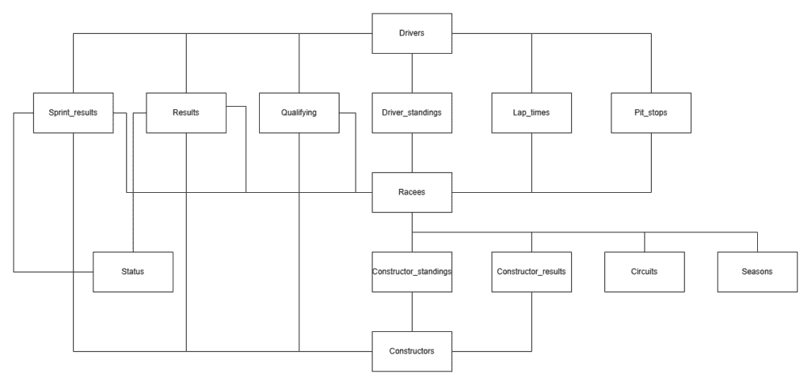
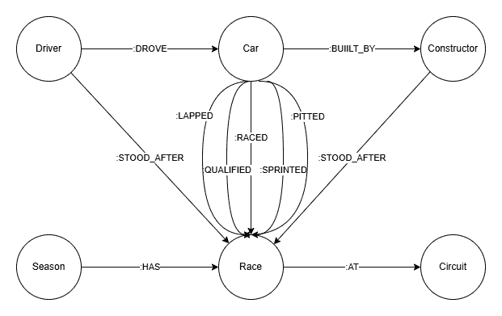

# 图形 RAG 与 SQL RAG 的比较

> 原文：[`towardsdatascience.com/graph-rag-vs-sql-rag/`](https://towardsdatascience.com/graph-rag-vs-sql-rag/)

我将一个一级方程式[结果数据集](https://www.kaggle.com/datasets/rohanrao/formula-1-world-championship-1950-2020)存储在图形数据库和 SQL 数据库中，然后使用各种大型语言模型（LLMs）通过检索增强生成（RAG）方法来回答关于数据的问题。通过在两个系统中使用相同的 dataset 和问题，我评估了哪种数据库范式能提供更准确和有洞察力的结果。

**检索增强生成（RAG）**是一个 AI 框架，它通过允许模型在生成答案之前检索相关的外部信息来增强大型语言模型（LLMs）。RAG 不是仅仅依赖于模型训练的内容，而是动态查询知识源（在本篇文章中是一个 SQL 或图形数据库），并将这些结果整合到其响应中。RAG 的介绍可以在[这里](https://towardsdatascience.com/retrieval-augmented-generation-rag-an-introduction/)找到。

SQL 数据库将数据组织成由行和列组成的**表**。每一行代表一条记录，每一列代表一个属性。表之间的关系使用**键**和**连接**定义，所有数据都遵循固定的**模式**。SQL 数据库非常适合结构化、事务性数据，其中一致性和精度很重要——例如，金融、库存或患者记录。

图形数据库将数据存储为**节点**（实体）和**边**（关系），两者都可以附加可选的**属性**。它们不使用表连接，而是直接表示关系，允许快速遍历连接的数据。图形数据库非常适合建模**网络和关系**——例如社交图、知识图或分子相互作用图——在这些图中，连接与实体本身一样重要。

## 数据

我用来比较 RAG 性能的 dataset 包含了从 1950 年到 2024 年的一级方程式结果。它包括关于车手和车队（团队）在资格赛、冲刺赛、主赛以及甚至圈速和停站时间的详细结果。每场比赛后的车手和车队冠军排名也包括在内。

### SQL 模式

此数据集已经以表格形式结构化，带有键，以便可以轻松设置 SQL 数据库。数据库的模式如下所示：



SQL 数据库设计

*Races*是中心表，它与所有类型的结果以及额外的信息（如赛季和赛道）相关联。结果表也与*Drivers*和*Constructors*表相关联，以记录他们在每场比赛的结果。每场比赛后的车手和车队冠军排名存储在*Driver_standings*和*Constructor_standings*表中。

### 图形模式

下面是图数据库的模式：



图数据库设计

由于图数据库可以在节点和关系中存储信息，因此与 SQL 数据库的 14 张表相比，它只需要六个节点。*Car*节点是一个中间节点，用于表示车手在特定赛事中驾驶了某个构造商的赛车。由于车手-构造商配对会随时间变化，因此这种关系需要为每一场赛事定义。赛事结果存储在关系中，例如*Car*和*Race.*之间的*:RACED*关系。而*:STOOD_AFTER*关系则包含每场赛事后车手和构造商的锦标赛排名。

## 查询数据库

我使用了[LangChain](https://python.langchain.com/docs/tutorials/sql_qa/)来为两种数据库类型构建一个 RAG 链，该链根据用户问题生成查询，执行查询，并将查询结果转换为对用户的答案。代码可以在本[仓库](https://github.com/ReinhardSellmair/graph_rag)中找到。我定义了一个通用的系统提示，可用于生成任何 SQL 或图数据库的查询。唯一的数据特定信息是通过将自动生成的数据库模式插入提示中包含的。系统提示可以在[这里](https://github.com/ReinhardSellmair/graph_rag/blob/main/src/qa_chain.py)找到。

下面是一个如何初始化模型链并提问的例子：“哪位车手赢得了在比利时举办的 92 年大奖赛？”

```py
from langchain_community.utilities import SQLDatabase
from langchain_openai import ChatOpenAI
from qa_chain import GraphQAChain
from config import DATABASE_PATH

# connect to database
connection_string = f"sqlite:///{DATABASE_PATH}"
db = SQLDatabase.from_uri(connection_string)

# initialize LLM
llm = ChatOpenAI(temperature=0, model="gpt-5")

# initialize qa chain
chain = GraphQAChain(llm, db, db_type='SQL', verbose=True)

# ask a question
chain.invoke("What driver won the 92 Grand Prix in Belgium?")
```

返回结果：

```py
{'write_query': {'query': "SELECT d.forename, d.surname
FROM results r
JOIN races ra ON ra.raceId = r.raceId
JOIN drivers d ON d.driverId = r.driverId
WHERE ra.year = 1992
AND ra.name = 'Belgian Grand Prix'
AND r.positionOrder = 1
LIMIT 10;"}} 
{'execute_query': {'result': "[('Michael', 'Schumacher')]"}}
 {'generate_answer': {'answer': 'Michael Schumacher'}}
```

SQL 查询将*Results*、*Races*和*Drivers*表连接起来，选择 1992 年比利时大奖赛的比赛和获得第一名的车手。LLM 将年份 92 转换为 1992 年，并将赛事名称从“Grand Prix in Belgium”转换为“Belgian Grand Prix”。这些转换是从包含每个表三个样本行的数据库模式中得出的。查询结果是“迈克尔·舒马赫”，这是 LLM 返回的答案。

## 评估

现在我想要回答的问题是，LLM 在查询 SQL 数据库或图数据库方面是否更好。我定义了三个难度级别（简单、中等和困难），其中简单的问题是只需查询一个表或节点的数据即可回答的问题，中等问题需要表或节点之间的一到两个链接，而困难问题则需要更多的链接或子查询。对于每个难度级别，我定义了五个问题。此外，我还定义了五个无法用数据库中的数据回答的问题。

我用三个 LLM 模型（GPT-5、GPT-4 和 GPT-3.5-turbo）回答了每个问题，以分析是否需要最先进的模型，或者较旧且较便宜的模型也能产生令人满意的结果。如果一个模型给出了正确答案，它得到 1 分，如果它回答说无法回答问题，它得到 0 分，如果它给出了错误答案，它得到-1 分。所有问题和答案都列在[这里](https://github.com/ReinhardSellmair/graph_rag/blob/main/qa_results.csv)。以下是所有模型和数据库类型的分数：

| **模型** | **图数据库** | **SQL 数据库** |
| --- | --- | --- |
| GPT-3.5-turbo | -2 | 4 |
| GPT-4 | 7 | 9 |
| GPT-5 | 18 | 18 |

模型 – 数据库评估分数

非常引人注目的是，更先进的模型优于简单的模型：GPT-3-turbo 答错的题目数量大约是其他模型的一半，GPT-4 答错了 2 到 3 个问题，但无法回答 6 到 7 个问题，而 GPT-5 除了一个问题外都答对了。简单的模型似乎在 SQL 数据库上比在图数据库上表现更好，而 GPT-5 在两种数据库上都取得了相同的分数。

GPT-5 在使用 SQL 数据库时，唯一答错的问题是“哪位驾驶员赢得了最多的世界锦标赛？”答案“刘易斯·汉密尔顿，共 7 次世界锦标赛”是不正确的，因为刘易斯·汉密尔顿和迈克尔·舒马赫都赢得了 7 次世界锦标赛。生成的 SQL 查询按驾驶员汇总了锦标赛次数，按降序排列，并仅选择了第一行，而第二行的驾驶员拥有相同数量的锦标赛。

使用图数据库，GPT-5 唯一答错的问题是“2017 年谁赢得了二级方程式锦标赛？”答案是“刘易斯·汉密尔顿”（刘易斯·汉密尔顿那年赢得了一级方程式锦标赛，但没有赢得二级方程式锦标赛）。这是一个棘手的问题，因为数据库只包含一级方程式结果，没有二级方程式结果。预期的答案应该是回复说根据提供的数据无法回答这个问题。然而，考虑到系统提示中没有关于数据集的任何具体信息，这个问题没有正确回答是可以理解的。

有趣的是，使用 SQL 数据库 GPT-5 给出了正确的答案“查尔斯·勒克莱尔”。生成的 SQL 查询仅搜索了驾驶员表中的“查尔斯·勒克莱尔”这个名字。在这里，LLM 必须已经意识到数据库不包含二级方程式结果，并从其常识中回答了这个问题。尽管这在这个案例中得到了正确的答案，但如果 LLM 没有使用提供的数据来回答问题，这可能会很危险。降低这种风险的一种方法可以在系统提示中明确指出数据库必须是回答问题的唯一来源。

## 结论

使用一级方程式结果数据集对 RAG 性能进行的比较表明，最新的 LLM 表现异常出色，能够产生高度准确和上下文感知的答案，而无需任何额外的提示工程。虽然简单的模型难以应对，但像 GPT-5 这样的新模型能够以近乎完美的精确度处理复杂查询。重要的是，图数据库和 SQL 数据库方法在性能上没有显著差异——用户只需选择最适合其数据结构的数据库范式即可。

这里使用的数据集仅作为说明性示例；使用其他数据集时，结果可能会有所不同，尤其是那些需要特定领域知识或访问非公开数据源的数据集。总的来说，这些发现突出了检索增强型大型语言模型在将结构化数据与自然语言推理相结合方面取得的进步。

*除非另有说明，所有图像均由作者创建。*
