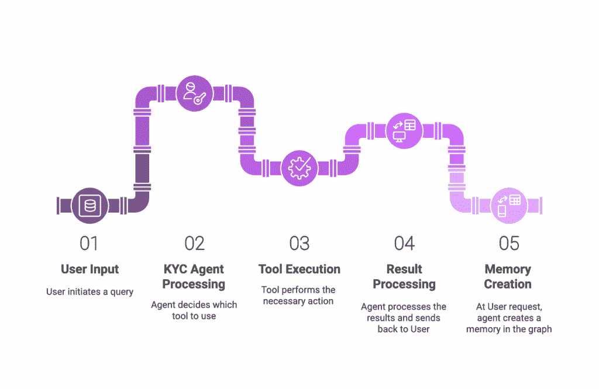
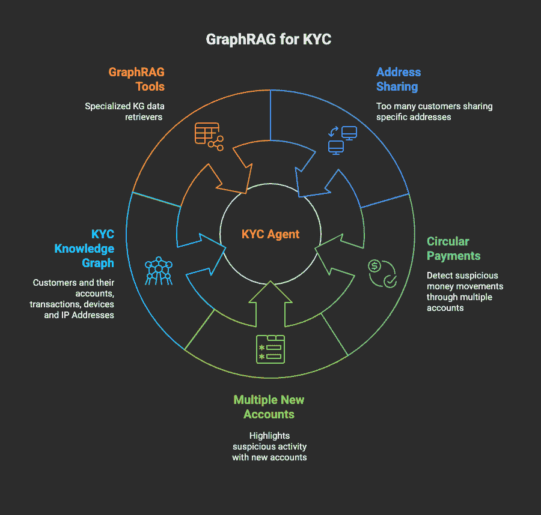
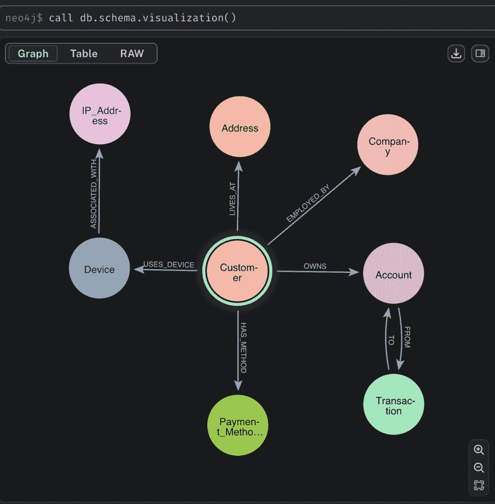

# GraphRAG 动作：一个简单的 KYC 调查代理

> 原文：[`towardsdatascience.com/graphrag-in-action/`](https://towardsdatascience.com/graphrag-in-action/)

<mdspan datatext="el1751568872317" class="mdspan-comment">在金融服务领域，了解客户（KYC）和反洗钱（AML）是防止非法活动的关键防线。KYC 自然地被建模为图问题，其中客户、账户、交易、IP 地址、设备和位置都是庞大关系网络中相互连接的节点。调查人员在这些复杂的连接网络中筛选，试图连接看似不相关的点，以揭露欺诈、制裁违规和洗钱团伙。]

这是一个基于知识图谱（GraphRAG）的 AI 的绝佳用例。复杂的连接网络需要超越标准基于文档的 RAG（通常基于向量相似性搜索和重排序技术）的能力。

### 声明

我是 Neo4j（本文中提到的图数据库）的 [高级人工智能产品经理](https://www.linkedin.com/in/edsandovaluk/)，虽然这些片段主要关注 Neo4j，但相同的模式可以应用于任何图数据库。我的主要目标是与 AI/ML 社区分享构建 GraphRAG 代理的实用指南。所有代码在 [链接仓库](https://github.com/neo4j-product-examples/graphrag-kyc-agent) 中都是开源的，您可以自由探索、实验和修改。

所有 <mdspan datatext="el1751569449252" class="mdspan-comment">图片</mdspan> 在这篇博客文章中都是由作者创建的。

## 图 RAG KYC 代理

本文为 AI 工程师和开发者提供了一本实用的指南，介绍如何使用 [OpenAI 代理 SDK](https://openai.github.io/openai-agents-python/) 构建初始 KYC 代理原型。我们将探讨如何为我们的代理配备一系列工具，以揭露和调查潜在的欺诈模式。

下面的图表展示了代理处理管道，以回答 KYC 调查期间提出的问题。



作者使用 [Napkin AI](https://www.napkin.ai/) 生成的图片

让我们逐一了解其主要组件：

+   **KYC 代理**：它利用 OpenAI 代理 SDK，充当“大脑”，根据用户的查询和对话历史决定使用哪个工具。它充当 [Neo4j MCP Cypher 服务器](https://neo4j.com/developer/genai-ecosystem/model-context-protocol-mcp/#_mcp_neo4j_cypher) 的 MCP 主机和 MCP 客户端。最重要的是，它运行一个非常简单的循环，从用户那里获取问题，调用代理，并处理结果，同时保持对话历史。

+   **工具集**。 代理可用的工具集合。

    +   GraphRAG 工具：这些是封装特定 Cypher 查询的图数据检索函数。例如：

        +   获取客户详情：一个图检索工具，给定一个客户 ID，它检索有关客户的信息，包括他们的账户和最近的交易历史。

    +   Neo4j MCP 服务器：[一个 Neo4j MCP Cypher 服务器](https://neo4j.com/developer/genai-ecosystem/model-context-protocol-mcp/#_mcp_neo4j_cypher)，提供与 Neo4j 数据库交互的工具。它提供了三个基本工具：

        1.  从数据库中获取模式。

        1.  在数据库上运行一个 READ Cypher 查询

        1.  在数据库上运行一个 WRITE Cypher 查询

    +   文本到 Cypher 工具：一个 Python 函数，它封装了一个通过 Ollama 在本地上运行的微调后的 Gemma3-4B 模型。该工具将自然语言问题转换为 Cypher 图查询。

    +   内存创建工具：这个工具使调查人员能够直接在知识图谱中记录他们的发现。它在知识图谱中创建一个“记忆”（调查的），并将其链接到所有相关的客户、交易和账户。随着时间的推移，这有助于为未来的调查建立一个宝贵的知识库。

+   KYC 知识图谱：一个存储 8,000 名虚构客户、他们的账户、交易、设备和 IP 地址的知识图谱的 Neo4j 数据库。它还用作代理的长期记忆存储。

**想要现在就试用这个代理吗？**只需遵循[项目仓库中的说明](https://github.com/neo4j-product-examples/graphrag-kyc-agent)。稍后您可以回来阅读代理是如何构建的。

## 为什么选择 GraphRAG 进行 KYC？

传统的 RAG 系统专注于在大型文本块中查找信息，这些文本块被分成片段。KYC 调查依赖于在复杂的数据网络中找到有趣的模式——客户与账户相连，账户通过交易相连，交易与 IP 地址和设备相关联，以及客户与个人和雇主地址相关联。

理解这些关系对于揭露复杂的欺诈模式至关重要。

+   “这位客户是否与观察名单上的某个人共享 IP 地址？”

+   “这笔交易是否是设计用来掩盖资金来源的循环支付循环的一部分？”

+   “是否有多个人在为同一家新注册的空壳公司开设多个新账户？”

这些是关于连接性的问题。一个知识图谱，其中客户、账户、交易和设备是节点，它们之间的关系是显式的边，是完成这项任务的理想数据结构。GraphRAG（数据检索）工具使得识别异常活动模式变得简单。



作者使用[Napkin AI](https://www.napkin.ai/)生成的图片

## 合成 KYC 数据集

为了本博客的目的，我创建了一个包含 8,000 名虚构客户及其账户、交易、注册地址、设备和 IP 地址的合成数据集。

下面的图像显示了在将数据集加载到 Neo4j 后数据库的“模式”。在 Neo4j 中，模式描述了存储在数据库中的实体和关系的类型。在我们的案例中，主要实体是：客户、地址、账户、设备、IP 地址、交易。它们之间主要的关联关系如下所示。



数据集中包含一些异常。一些客户涉及可疑的交易环。有几个孤立的设备和 IP 地址（未链接到任何客户或账户）。有一些地址被大量客户共享。如果您想了解或修改数据集以满足您的需求，请随意探索合成的[数据集生成脚本](https://github.com/neo4j-product-examples/graphrag-kyc-agent/blob/main/generate_kyc_dataset.py)。

## 基于 OpenAI Agents SDK 的基本代理

让我们浏览 KYC 代理的**关键部分**

实现主要在[kyc_agent.py](https://github.com/neo4j-product-examples/graphrag-kyc-agent/blob/main/kyc_agent.py)中。完整的源代码以及如何运行代理的逐步说明可在[Github](https://github.com/neo4j-product-examples/graphrag-kyc-agent)上找到。

首先，让我们用合适的指令定义代理的核心身份。

```py
import os
from agents import Agent, Runner, function_tool
# ... other imports

# Define the instructions for the agent
instructions = """You are a KYC analyst with access to a knowledge graph. Use the tools to answer questions about customers, accounts, and suspicious patterns.
You are also a Neo4j expert and can use the Neo4j MCP server to query the graph.
If you get a question about the KYC database that you can not answer with GraphRAG tools, you should
- use the Neo4j MCP server to fetch the schema of the graph (if needed)
- use the generate_cypher tool to generate a Cypher query from question and the schema
- use the Neo4j MCP server to query the graph to answer the question
"""
```

**指令**至关重要。它们设定了代理的角色，并为如何处理问题提供了一个高级策略，尤其是在预定义的工具不适合用户请求时。

现在，让我们从一个最小代理开始。没有工具。只有指令。

```py
# Agent Definition, we will add tools later. 
kyc_agent = Agent(
   name="KYC Analyst",
   instructions=instructions,
   tools=[...],      # We will populate this list
   mcp_servers=[...] # And this one
) 
```

## 让我们在 KYC 代理中添加一些工具

代理的好坏取决于其工具。让我们检查我们提供给 KYC 分析师的五种工具。

### 工具 1 和 2：预定义的 Cypher 查询

对于常见和关键的查询，最好有优化、预先编写的 Cypher 查询，并用 Python 函数包装。您可以使用 OpenAI Agent SDK 的**@function_tool**装饰器使这些函数可用于代理。

#### 工具 1：`find_customer_rings`

此工具旨在检测洗钱的特征性递归模式，特别是“循环交易”，其中资金通过多个账户循环以掩盖其来源。

在 KYC 图中，这直接转化为在有向交易图中找到循环或路径，这些路径返回或接近其起始点。实现此类检测涉及复杂的图遍历算法，通常利用可变长度的路径探索最多一定“跳数”距离的连接。

下面的代码片段展示了**find_customer_rings**函数，该函数对 KYC 数据库执行 Cypher 查询并返回最多 10 个潜在客户环。对于每个环，返回以下信息：涉及该环的客户账户和交易。

```py
@function_tool
def find_customer_rings(max_number_rings: int = 10, customer_in_watchlist: bool = True, ...):
   """
   Detects circular transaction patterns (up to 6 hops) involving high-risk customers.
   Finds account cycles where the accounts are owned by customers matching specified
   risk criteria (watchlisted and/or PEP status).
   Args:
       max_number_rings: Maximum rings to return (default: 10)
       customer_in_watchlist: Filter for watchlisted customers (default: True)
       customer_is_pep: Filter for PEP customers (default: False)
       customer_id: Specific customer to focus on (not implemented)
   Returns:
       dict: Contains ring paths and associated high-risk customers
   """
   logger.info(f"TOOL: FIND_CUSTOMER_RINGS")
   with driver.session() as session:
       result = session.run(
           f"""
           MATCH p=(a:Account)-[:FROM|TO*6]->(a:Account)
           WITH p, [n IN nodes(p) WHERE n:Account] AS accounts
           UNWIND accounts AS acct
           MATCH (cust:Customer)-[r:OWNS]->(acct)
           WHERE cust.on_watchlist = $customer_in_watchlist
           // ... more Cypher to collect results ...
           """,
           max_number_rings=max_number_rings,
           customer_in_watchlist=customer_in_watchlist,
       )
       # ... Python code to process and return results ... 
```

值得注意的是，文档字符串（doc string）被 OpenAI Agents SDK 自动用作工具描述！所以好的 Python 函数文档是值得的！

#### 工具 2：`get_customer_and_accounts`

一个简单但至关重要的工具，用于检索客户的资料，包括他们的账户和最近的交易。这是任何调查的基础。代码与我们之前的工具类似——一个接受客户 ID 并围绕简单的 Cypher 查询包装的函数。

再次强调，该函数被装饰为**@function_tool**，以便可供代理使用。

下面展示了由 Python 包装的 Cypher 查询

```py
result = session.run(
           """
           MATCH (c:Customer {id: $customer_id})-[o:OWNS]->(a:Account)
           WITH c, a
           CALL (c,a) {
               MATCH (a)-[b:TO|FROM]->(t:Transaction)
               ORDER BY t.timestamp DESC
               LIMIT $tx_limit
               RETURN collect(t) as transactions
           }
           RETURN c as customer, a as account, transactions
           """,
           customer_id=input.customer_id
       ) 
```

该工具设计的一个显著方面是使用 Pydantic 来指定函数的输出。OpenAI AgentsSDK 使用函数返回的 Pydantic 模型自动生成输出参数的文本描述。

如果你仔细观察，该函数返回

```py
return CustomerAccountsOutput(          
 customer=CustomerModel(**customer),
 accounts=[AccountModel(**a) for a in accounts],
) 
```

*CustomerModel*和*AccountModel*包括每个客户返回的属性，其账户以及最近交易列表。你可以在[schemas.py](https://github.com/neo4j-product-examples/graphrag-kyc-agent/blob/main/schemas.py)中看到它们的定义。

### 工具 3 & 4：Neo4j MCP 服务器与 Text-To-Cypher 的相遇

这就是我们的 KYC 代理获得更多有趣能力的地方。

在构建多才多艺的 AI 代理时，一个重大挑战是使它们能够与复杂的数据源动态交互，而不仅仅是预定义的静态函数。代理需要执行通用查询的能力，新的见解可能需要即兴的数据探索，而不需要为每个可能的行为提供先验的 Python 包装器。

本节探讨了处理此问题的常见架构模式。一个将自然语言问题翻译成 Cypher 的工具，以及另一个允许动态查询执行的工具。

我们使用**[Neo4 MCP 服务器](https://neo4j.com/developer/genai-ecosystem/model-context-protocol-mcp/#_mcp_neo4j_cypher)**来展示动态图查询执行，以及一个**Google [Gemma3-4B 微调](https://neo4j.com/blog/news/text2cypher-vertex-ai/)模型**用于 Text-to-Cypher 翻译。

#### 工具 3：添加 Neo4j MCP 服务器工具集

对于一个健壮的代理能够有效地与知识图谱操作，它需要理解图的结构并执行 Cypher 查询。这些能力使代理能够内省数据并执行动态的即兴查询。

MCP Neo4j Cypher 服务器提供了基本工具：`get-neo4j-schema`（用于动态检索图模式），`read-neo4j-cypher`（用于执行任意读取查询），以及`write-neo4j-cypher`（用于创建、更新、删除查询）。

幸运的是，OpenAI Agents SDK 支持 MCP。下面的代码片段显示了将 Neo4j MCP 服务器添加到我们的 KYC 代理是多么简单。

```py
# Tool 3: Neo4j MCP server setup
neo4j_mcp_server = MCPServerStdio(
   params={
       "command": "uvx",
       "args": ["[[email protected]](/cdn-cgi/l/email-protection)"],
       "env": {
           "NEO4J_URI": NEO4J_URI,
           "NEO4J_USERNAME": NEO4J_USER,
           "NEO4J_PASSWORD": NEO4J_PASSWORD,
           "NEO4J_DATABASE": NEO4J_DATABASE,
       },
   },
   cache_tools_list=True,
   name="Neo4j MCP Server",
) 
```

你可以在[这里](https://openai.github.io/openai-agents-python/mcp/)了解更多关于 MCP 在 OpenAI Agents SDK 中支持的信息。

#### 工具 4：文本到 Cypher 工具

将自然语言动态转换为强大的图查询的能力通常依赖于 **专门的大语言模型 (LLMs)** ——经过针对具有模式感知查询生成的微调。

我们可以使用公开的权重，例如 Huggingface 上可用的公开 Text-to-Cypher 模型，如 [neo4j/text-to-cypher-Gemma-3-4B-Instruct-2025.04.0](https://huggingface.co/neo4j/text-to-cypher-Gemma-3-4B-Instruct-2025.04.0)。该模型专门经过微调，可以从用户问题和模式中生成准确的 Cypher 查询。

为了在本地设备上运行此模型，我们可以转向 Ollama。使用 [Llama.cpp](https://github.com/ggml-org/llama.cpp)，将任何 HuggingFace 模型转换为 GGUF 格式相对简单，这是在 Ollama 中运行模型所必需的。使用 [‘convert-hf-to-GGUF’](https://github.com/ggml-org/llama.cpp/blob/master/convert_hf_to_gguf.py) Python 脚本，我生成了 Gemma3-4B 微调模型的 GGUF 版本并将其上传到 Ollama。

如果您是 Ollama 用户，您可以使用以下命令将此模型下载到您的本地设备：

```py
ollama pull ed-neo4j/t2c-gemma3-4b-it-q8_0-35k
```

#### 当用户提出的问题与我们的任何预定义工具都不匹配时会发生什么？

例如，“对于客户 CUST_00001，找到他的地址并检查这些地址是否与其他客户共享”

我们的代理不会失败，而是可以即时生成 Cypher 查询……

```py
@function_tool
async def generate_cypher(request: GenerateCypherRequest) -> str:
   """
   Generate a Cypher query from natural language using a local finetuned text2cypher Ollama model
   """
   USER_INSTRUCTION = """...""" # Detailed prompt instructions

   user_message = USER_INSTRUCTION.format(
       schema=request.database_schema,
       question=request.question
   )
   # Generate Cypher query using the text2cypher model
   model: str = "ed-neo4j/t2c-gemma3-4b-it-q8_0-35k"
   response = await chat(
       model=model,
       messages=[{"role": "user", "content": user_message}]
   )
   return response['message']['content'] 
```

`generate_cypher` 工具解决了 Cypher 查询生成的问题，但代理如何知道何时使用此工具？答案在于代理的说明。

您可能记得，在博客的开头，我们为代理定义了以下说明：

```py
instructions = """You are a KYC analyst with access to a knowledge graph. Use the tools to answer questions about customers, accounts, and suspicious patterns.
   You are also a Neo4j expert and can use the Neo4j MCP server to query the graph.
   If you get a question about the KYC database that you can not answer with GraphRAG tools, you should
   - use the Neo4j MCP server to get the schema of the graph (if needed)
   - use the generate_cypher tool to generate a Cypher query from question and the schema
   - use the Neo4j MCP server to query the graph to answer the question
   """ 
```

这次，请注意处理无法通过图检索工具回答的临时查询的具体说明。

当代理走这条路时，它会经过以下步骤：

1.  代理获得了一个新问题。

1.  它首先调用 **`neo4j-mcp-server.get-neo4j-schema`** 来获取数据库的模式。

1.  然后，它将模式和用户的问题输入到 **`generate_cypher`** 工具中。这将生成一个 Cypher 查询。

1.  最后，它使用 **`neo4j-mcp-server.read-neo4j-cypher`** 运行生成的 Cypher 查询。

如果在 Cypher 生成或执行过程中出现错误，代理将尝试重新生成 Cypher 并重新运行它。

如您所见，上述方法并非万无一失。它严重依赖于 Text-To-Cypher 模型来生成有效且正确的 Cypher 语句。在大多数情况下，它都能正常工作。然而，在它无法正常工作的情况下，您应该考虑：

+   为此类问题定义明确的 Cypher 检索工具。

+   在您的 UI/UX 中添加某种形式的最终用户反馈（点赞/踩），这将有助于标记代理难以处理的问题。然后，您可以决定最佳方法来处理此类问题。（例如，Cypher 检索工具、更好的说明、改进文本 2Cypher 模型、安全网或让您的代理礼貌地拒绝回答问题）。

### 工具 5 – 为 KYC 代理添加内存

最近，代理内存的话题受到了很多关注。

虽然代理通过会话历史内在地管理 *短期记忆*，但像金融调查这样的复杂、多会话任务需要更持久和不断发展的 *长期记忆*。

这长期记忆不仅仅是过去交互的日志；它是一个动态的知识库，可以积累见解，跟踪正在进行中的调查，并在不同的会话甚至不同的代理之间提供上下文。

`create_memory` 工具实现了一种显式知识图谱内存的形式，其中调查摘要存储为专用节点，并明确链接到相关实体（客户、账户、交易）。

```py
@function_tool
def create_memory(content: str, customer_ids: list[str] = [], account_ids: list[str] = [], transaction_ids: list[str] = []) -> str:

   """
   Create a Memory node and link it to specified customers, accounts, and transactions
   """
   logger.info(f"TOOL: CREATE_MEMORY")
   with driver.session() as session:
       result = session.run(
           """
           CREATE (m:Memory {content: $content, created_at: datetime()})
           WITH m
           UNWIND $customer_ids as cid
           MATCH (c:Customer {id: cid})
           MERGE (m)-[:FOR_CUSTOMER]->(c)
           WITH m
           UNWIND $account_ids as aid
           MATCH (a:Account {id: aid})
           MERGE (m)-[:FOR_ACCOUNT]->(a)
           WITH m
           UNWIND $transaction_ids as tid
           MATCH (t:Transaction {id: tid})
           MERGE (m)-[:FOR_TRANSACTION]->(t)
           RETURN m.content as content
           """,
           content=content,
           customer_ids=customer_ids,
           account_ids=account_ids,
           transaction_ids=transaction_ids
           # ...
       )
```

实现“代理内存”的额外考虑因素包括：

+   内存架构：探索不同类型的内存（情景、语义、程序性）及其常见实现（用于语义搜索的向量数据库、关系数据库或用于结构化见解的知识图谱）。

+   上下文化：知识图谱结构如何允许对记忆进行丰富的上下文化，从而基于关系和模式进行强大的检索，而不仅仅是关键词匹配。

+   更新和检索策略：记忆如何随时间更新（例如，附加、摘要、细化），以及代理如何检索它们（例如，通过图遍历、语义相似性或固定规则）。

+   挑战：管理内存一致性、处理冲突信息、防止在内存检索中出现“幻觉”，以及确保内存保持相关性和时效性，同时不会变得过于庞大或嘈杂。”

这是一个活跃开发且快速发展的领域，许多框架解决了上述一些考虑因素。

## 将所有这些放在一起——一个示例调查

让我们看看我们的代理如何处理典型的流程。您可以自己运行（或者可以自由地按照 KYC 代理 github 仓库中的[步骤说明](https://github.com/neo4j-product-examples/graphrag-kyc-agent)逐步进行）。

1. **“给我数据库的模式”**

+   代理行为：代理将其识别为模式查询，并使用 Neo4j MCP 服务器的 ***`get-neo4j-schema`*** 工具。

2. “**给我展示 5 个涉嫌参与可疑团伙的监控客户**”

+   代理行为：这直接符合我们自定义工具的目的。代理使用 **`*find_customer_rings*`** 并传递 ***`customer_in_watchlist=True`***。

3. **“为每位客户找到他们的地址，并查明这些地址是否与其他客户共享”**。

+   代理行为：这是一个无法使用任何 GraphRAG 工具回答的问题。代理应遵循其指示：

    +   它已经具有模式（来自我们上面的第一次交互）。

    +   它使用 ***`generate_cypher`*** 与问题和模式。该工具返回一个 Cypher 查询，试图回答调查者的提问。

    +   它使用 Neo4j MCP Cypher 服务器***`read-neo4j-cypher`***工具执行这个 Cypher 查询。

4. “**对于地址共享的客户，你能给我更多细节吗**？”

+   代理动作：代理确定***`get_customer_and_accounts`***工具是完美的选择，并使用客户的 ID 调用它。

5. “**为这次调查写一个 300 字的摘要。将其存储为记忆。确保将其链接到属于此客户的每个账户和交易**。”

+   代理动作：代理首先使用其内部 LLM 能力生成摘要。然后，它调用***`create_memory`***工具，传递摘要文本以及它在对话过程中遇到的所有客户、账户和交易 ID 列表。

## 关键要点

如果您已经走到这一步，我希望您喜欢熟悉 KYC GraphRAG 代理基本实现的旅程。这里有很多酷技术：OpenAI 代理 SDK、MCP、Neo4j、Ollama 和 Gemma3-4B 微调的 Text-To-Cypher 模型！

我希望您对以下内容有所欣赏：

+   GraphRAG，或者更具体地说，作为连接数据问题的一个基本要素的图增强数据检索。它允许代理回答那些使用标准 RAG 无法回答的与高度连接数据相关的问题。

+   平衡工具包的重要性是强大的。将 MCP 服务器工具与您自己的优化工具结合起来。

+   MCP 服务器是一个变革者。它们允许您将您的代理连接到越来越多的 MCP 服务器。

    +   尝试[更多 MCP 服务器](https://github.com/modelcontextprotocol/servers)，以便您更好地了解可能性。

+   代理应该能够以受控的方式将信息写回到您的数据存储中。

    +   在我们的例子中，我们看到了分析师如何持久化其发现（例如，向知识图谱添加**记忆**节点）并在过程中创建一个良性循环，其中代理改善了整个调查团队的基础知识库。

    +   代理向知识图谱添加信息，它永远不会更新或删除现有信息。

这里讨论的模式和工具不仅限于 KYC。它们可以应用于供应链分析、数字孪生管理、药物发现以及任何数据点之间的关系与数据本身一样重要的领域。

图感知 AI 代理的时代已经到来。

## 接下来是什么？

您已经在 OpenAI Agents SDK 的基础上构建了一个简单的 AI 代理，使用了 MCP、Neo4j 和一个 Text-to-Cypher 模型。**所有都在单个设备上运行**。

虽然这个初始代理提供了一个强大的基础，但过渡到生产级系统需要解决几个额外的要求，例如：

+   代理 UI/UX：这是用户与您的代理互动的核心部分。这最终将是您的代理采用和成功的关键驱动因素。

    长运行任务和多代理系统：有些任务很有价值，但运行时间很长。在这些情况下，代理应该能够将它们的工作负载的一部分卸载到其他代理。

    +   OpenAI 确实提供了一些将任务转交给子代理的支持，但这可能不适合长时间运行的代理。

+   代理安全限制 - OpenAI 代理 SDK 为 Guardrails 提供了一些支持。

+   代理托管 - 它将您的代理暴露给您的用户。

+   保护您的代理通信 - 终端用户对您的代理的认证和授权。

+   数据库访问控制 - 管理对存储在 KYC 知识图中的数据的访问控制。

+   对话历史。

+   代理可观察性。

+   代理内存。

+   代理评估 - 改变代理指令或添加/删除工具会对产生什么影响？。

+   此外……

同时，我希望这已经激励了您继续学习和实验！

## 学习资源

+   [OpenAI 代理 SDK](https://openai.github.io/openai-agents-python/)

    +   [OpenAI 代理和 MCP](https://openai.github.io/openai-agents-python/)

+   [开发者需要了解的关于 MCP 的一切](https://go.neo4j.com/WBR-EDU-250610-MCP_Registration.html?utm_source=GSearch&utm_medium=PaidSearch&utm_campaign=Evergreen&utm_content=EMEA-Search-SEMCE-DSA-None-SEM-SEM-NonABM&utm_term=&utm_adgroup=DSA&gad_source=1&gad_campaignid=20769286937&gbraid=0AAAAADk9OYq0L-yWHOu6kNCxCTOuVIAqT&gclid=CjwKCAjwr5_CBhBlEiwAzfwYuGY2gKua3WTIVG4vZtryyntuCYpQ8gE7prRtjwW0MYBHsPneTc1McBoCtt4QAvD_BwE)

+   [MCP 简介](https://modelcontextprotocol.io/introduction)

+   [Neo4j 的 MCP 集成](https://neo4j.com/developer/genai-ecosystem/model-context-protocol-mcp/)

+   [Neo4j GraphRAG 开发者指南](https://neo4j.com/developer/genai-ecosystem/)

+   [免费 Neo4j GraphAcademy 课程](https://neo4j.com/developer/genai-ecosystem/#_graphacademy_courses)

+   [开始使用 Ollama](https://github.com/ollama/ollama)

+   [Google 和 Neo4j 在 Gemma3 微调的 Text-To-Cypher 模型上合作](https://neo4j.com/blog/news/text2cypher-vertex-ai/)
