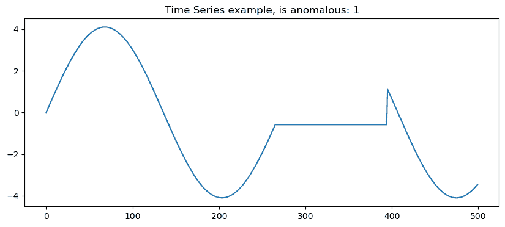
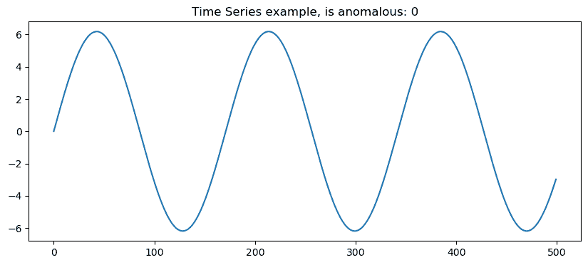
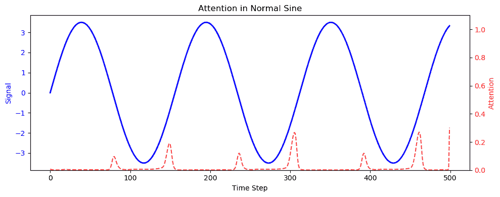
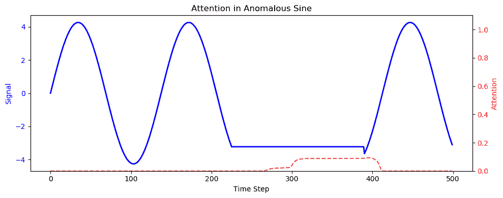

# 使用 Python 进行时间序列分类的动手注意力机制

> 原文：[`towardsdatascience.com/hands-on-attention-mechanism-for-time-series-classification-with-python/`](https://towardsdatascience.com/hands-on-attention-mechanism-for-time-series-classification-with-python/)

<mdspan datatext="el1748636228402" class="mdspan-comment">注意力机制</mdspan>是机器学习中的一个**颠覆性变革**。事实上，在深度学习的近期历史中，允许模型在预测时**专注于输入序列中最相关的部分**这一想法，彻底改变了我们看待神经网络的方式。

话虽如此，我对注意力机制有一个有争议的看法：

> 学习注意力机制的最佳方式**不是**通过自然语言处理（NLP）。

这（技术上）是一个有争议的观点，原因有两个。

1.  人们自然地使用自然语言处理案例（例如，翻译或 NSP），因为自然语言处理（NLP）是注意力机制最初被开发的原因。最初的目标是**克服 RNN 和 CNN 在处理语言中长期依赖性的局限性**（如果你还没有，你真的应该阅读一下论文[Attention is All You Need](https://arxiv.org/abs/1706.03762)）。

1.  其次，我必须说，理解将“注意力”放在特定单词上以进行翻译任务的一般想法是非常直观的。

话虽如此，如果我们想通过实际操作了解注意力机制真正的工作原理，我相信**时间序列**是最佳框架。我之所以这么说，有很多原因。

1.  计算机并不是真正“制作”来处理字符串的；它们处理的是一和零。将文本转换为向量所需的所有嵌入步骤都增加了一个额外的复杂性层，这与注意力理念本身并没有严格的关系。

1.  尽管注意力机制最初是为文本开发的，但它有许多其他应用（例如，在计算机视觉中），因此我也喜欢从另一个角度探索注意力的想法。

1.  对于**时间序列**而言，我们可以创建非常小的数据集，并在几分钟内（是的，包括训练）运行我们的注意力模型，而不需要任何花哨的 GPU。

在这篇博客文章中，我们将看到如何构建时间序列的注意力机制，特别是在**分类**设置中。我们将使用正弦波，并尝试用“修改过的”正弦波来分类一个正常的正弦波。这个“修改过的”正弦波是通过**压平原始信号的一部分**来创建的。也就是说，在波的某个位置，我们简单地移除振荡，并用一条水平线替换它，就像信号暂时停止或损坏了一样。

为了使事情更加***辣味十足***，我们将假设正弦波可以具有任何**频率**或**振幅**，以及“校正”部分的**位置**和扩展（我们称之为**长度**）也是参数。换句话说，正弦波可以是任何正弦波，我们可以在正弦波上任意位置放置我们的“直线”。

好吧，好的，但为什么我们甚至要费心去考虑注意力机制呢？为什么我们不使用更简单的东西，比如前馈神经网络（FFNs）或卷积神经网络（CNNs）？

好吧，因为再次，我们假设“修改后的”信号可以在时间序列的任何位置（在任何位置）“展平”，并且它可以展平任何长度（校正部分可以具有任何长度）。这意味着标准的神经网络并不那么高效，因为时间序列的异常“部分”并不总是在信号的同一部分。换句话说，如果你只是试图用线性权重矩阵和非线性函数来处理这个问题，你将得到次优的结果，因为时间序列 1 的第 300 个索引可能与时间序列 14 的第 300 个索引完全不同。我们需要的是一种动态的方法，将注意力放在序列的异常部分上。这就是为什么（以及在哪里）注意力方法发光。

这篇博客文章将分为以下 4 个步骤：

1.  **代码设置**。在进入代码之前，我将展示设置，包括我们需要的所有库。

1.  **数据生成**。我将提供数据生成部分所需的代码。

1.  **模型实现**。我将提供注意力模型的实现

1.  **结果探索**。通过注意力分数和分类指标来展示注意力模型的好处，以评估我们方法的表现。

看起来我们有很多东西要讲。让我们开始吧！ 🚀

* * *

## 1\. 代码设置

在深入代码之前，让我们召唤一些我们将在剩余实现中需要的伙伴。

这些只是可以在整个项目中使用的默认值。下面是简短而精炼的 requirements.txt 文件。

我喜欢事情容易改变且模块化。因此，我创建了一个.json 文件，我们可以更改设置的所有内容。其中一些参数包括：

1.  正常时间序列与异常时间序列的数量（两者之间的**比率**）

1.  时间序列步骤的数量（你的时间序列有多长）

1.  生成数据集的大小

1.  线性化部分的**最小**和**最大**位置和长度

1.  更多。

.json 文件看起来像这样。

所以，在进入下一步之前，请确保您有：

1.  **constants.py**文件位于您的文件夹中

1.  您工作文件夹中的**.json 文件**或您记得的路径中的文件

1.  requirements.txt 文件中所需的**库**已安装

* * *

## 2\. 数据生成

两个简单的函数构建了正常的正弦波和修改后的（整流）正弦波。这段代码可以在 data_utils.py 中找到：

现在我们有了基础知识，我们可以在 **data.py** 中完成所有后端工作。这个函数旨在完成所有工作：

1.  从 .json 文件接收设置信息（这就是为什么你需要它的原因！）

1.  构建修改后的和正常的正弦波

1.  对于模型验证，是否有训练/测试分割和训练/验证/测试分割

data.py 脚本如下：

额外的数据脚本是为 Torch（SineWaveTorchDataset）准备数据的脚本，看起来像这样：

如果你想看看，这是一个随机异常的时间序列：

由作者生成的图像

这是一条非异常的时间序列：

由作者生成的图像

现在我们有了我们的数据集，我们可以担心模型实现了。

***

## 3. 模型实现

模型的实现、训练和加载器可以在 **model.py** 代码中找到：

现在，让我花点时间解释一下为什么注意力机制在这里是一个变革性的因素。与 FFNN 或 CNN 不同，它们会平等地对待所有时间步，注意力机制动态地突出序列中对于分类最重要的部分。这使得模型能够“聚焦”于异常部分（无论它出现在哪里），使其特别适用于不规则或不可预测的时间序列模式。

让我更精确地谈谈神经网络。

在我们的模型中，我们使用双向 LSTM 来处理时间序列，在每个时间步捕获过去和未来的上下文。然后，我们不是直接将 LSTM 的输出输入到分类器中，而是在整个序列上计算注意力分数。这些分数决定了每个时间步在形成用于分类的最终上下文向量时应该有多少权重。这意味着模型学会了只关注信号的有意义部分（即平坦的异常），无论它们出现在哪里。

现在，让我们将模型和数据连接起来，看看我们方法的表现。

***

## 4. 实际示例

### 4.1 训练模型

由于我们开发了大的后端部分，我们可以用这个超级简单的代码块来**训练**模型。

这在 CPU 上大约花费了 5 分钟来完成。

注意，我们在后端实现了早停和训练/验证/测试来避免过拟合。我们是有责任的孩子。

### 4.2 注意力机制

在这里，让我们使用以下函数来显示注意力机制与正弦函数一起。

让我们展示一个正常时间序列的注意力分数。

由作者使用上述代码生成的图像

如我们所见，注意力分数在平坦部分（类似于时间偏移）局部化，这会接近峰值。尽管如此，这些仍然是**局部峰值**。

现在，让我们看看一个异常的时间序列。

由作者使用上述代码生成的图像

如我们所见，该模型识别出（具有相同的时间偏移）函数变平的区域。然而，这一次，它不是一个局部的峰值。这是一个信号的整体部分，我们的得分比平时高。 bingo。

### 4.3 分类性能

好的，这很好，但是这真的有效吗？让我们实现一个生成分类报告的功能。

结果如下：

> **准确度：** 0.9775 **精确度：** 0.9855 **召回率：** 0.9685 **F1 分数：** 0.9769 **ROC AUC 分数：** 0.9774
> 
> **混淆矩阵：** [[1002 14]
> 
> [ 31 953]]

在所有指标方面都表现出非常高的性能。效果如魔法般神奇。🙃

* * *

## 5. 结论

非常感谢您阅读这篇文章 ❤️。这对我们意义重大。让我们总结一下我们在这次旅程中找到的内容以及为什么这很有帮助。在这篇博客文章中，我们应用了注意力机制来对时间序列进行分类任务。分类是在正常时间序列和“修改过”的时间序列之间进行的。当我们说“修改过”时，意味着一部分（一个随机部分，长度随机）已经被修正（用直线替换）。我们发现：

1.  **注意力机制最初是在自然语言处理（NLP）中开发的，**但它们在识别时间序列数据中的异常方面也非常出色，尤其是在异常位置随样本变化时。这种灵活性是传统 CNN 或 FFNN 难以实现的。

1.  通过使用**双向 LSTM 结合注意力层**，我们的模型学会了哪些信号部分最重要。我们通过注意力分数（alpha）事后得知，这些分数揭示了哪些时间步对于分类最为相关。这个框架提供了一种透明且可解释的方法：我们可以可视化注意力权重来理解模型为何做出某种预测。

1.  仅用少量数据和没有 GPU，我们仅用几分钟就训练了一个高度准确的模式（F1 分数≈0.98），这证明了注意力即使是对于小型项目也是可访问且强大的。

* * *

#### 6. 关于我！

再次感谢您抽出宝贵的时间。这对我们意义重大 ❤️

我叫 Piero Paialunga，就是我这个人：

我是辛辛那提大学航空航天工程系的博士候选人。我在博客文章和 LinkedIn 上，以及在这里的 TDS 上谈论人工智能和机器学习。如果你喜欢这篇文章，并想了解更多关于机器学习的内容，以及跟随我的研究，你可以：

A. 在[**LinkedIn**](https://www.linkedin.com/in/pieropaialunga/)上关注我，我在那里发布所有我的故事

B. 在[**GitHub**](https://github.com/PieroPaialungaAI)上关注我，你可以看到我所有的代码

C. 对于问题，你可以通过以下邮箱发送给我 ***[[邮箱保护]](/cdn-cgi/l/email-protection)***

Ciao!
