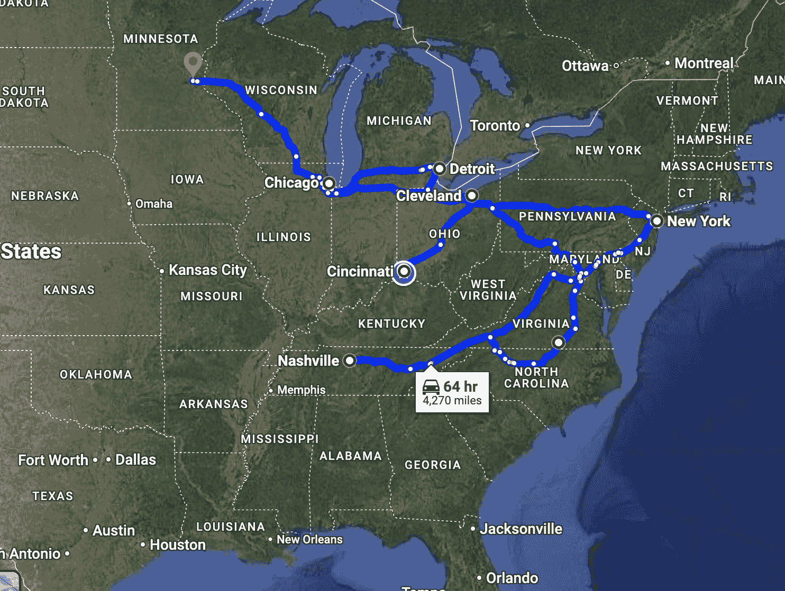
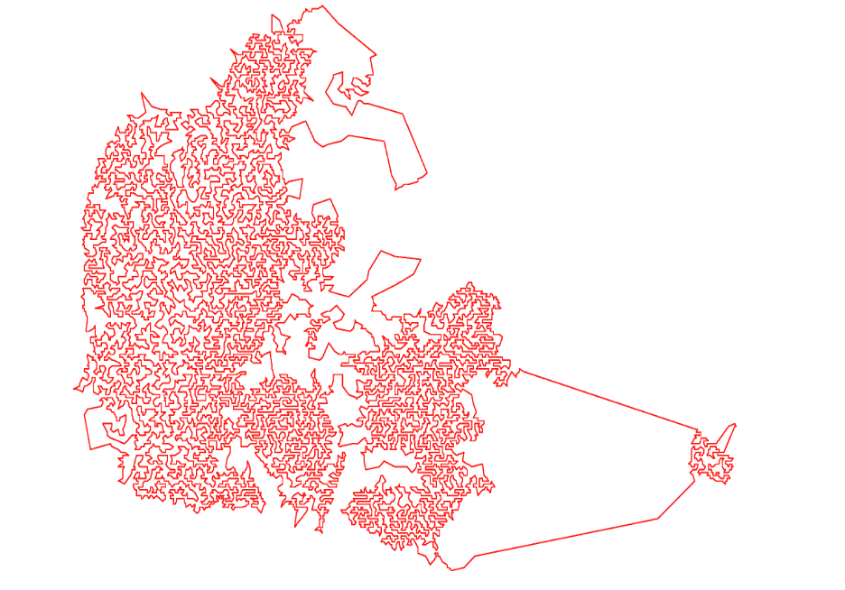
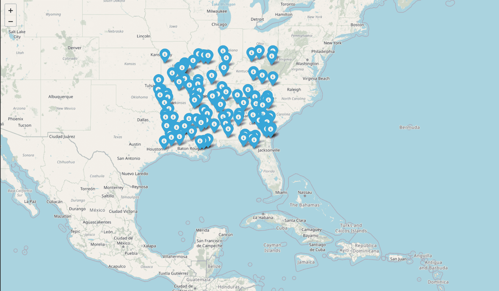
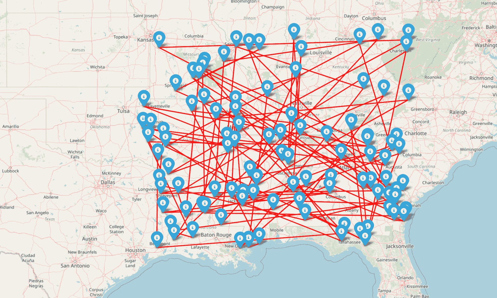
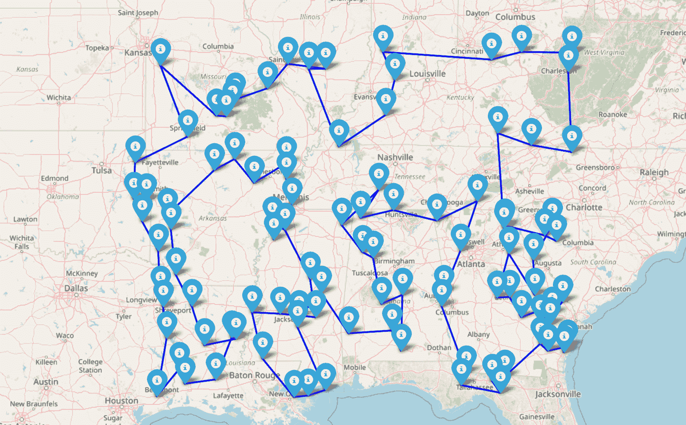

# 使用 LKH 和 Python 进行人工智能的现场配送路线优化（TSP）

> 原文：[`towardsdatascience.com/hands-on-delivery-routes-optimization-tsp-with-ai-using-lkh-and-python-9078768068cc/`](https://towardsdatascience.com/hands-on-delivery-routes-optimization-tsp-with-ai-using-lkh-and-python-9078768068cc/)


由 [Mudit Agarwal](https://unsplash.com/@dreamingfire?utm_content=creditCopyText&utm_medium=referral&utm_source=unsplash) 在 [Unsplash](https://unsplash.com/photos/a-red-truck-driving-across-a-bridge-over-water-V6wWEKDwRwg?utm_content=creditCopyText&utm_medium=referral&utm_source=unsplash) 上拍摄的照片

> 这篇文章的代码可以在这个 [GitHub 文件夹](https://github.com/PieroPaialungaAI/TaxiRouteTSP/tree/main)中找到。

在我的学习生涯中，我最喜欢的教授之一曾经告诉我：

> “仅仅因为你的算法效率低下，并不意味着问题**困难**”

这意味着，无论你想解决什么问题（简单或困难），总会有一种足够天真的方法，以至于效率极低。例如，假设你必须去一个新的工作地点。与其使用 Google Maps，你不如从你家的巷子开始，尝试所有可能的街道组合（北、南、西和东）。等你到达工作地点时，你的公司可能正在申请破产或解雇你。

让我们尽量更正式一点。假设在任何一个商业或工程环境中，你必须找到函数的**最小值**或**最大值**。例如，你的公司必须最大化某个部门的销售收入。我们称这个函数为**f**。你拉动的“字符串”，即你为了最大化收入可以做出的**决策**是一个向量**x**。显然，你不能通过每周雇佣 10⁶ 人或让人们每天工作 18 小时来增加销售，所以你显然有一些约束。所以我们说，你可以在决策空间 **X** 中做出这些决策。所以任务是：


假设 f 函数是**线性的**。

如果你必须**天真地**做这件事，你实际上没有任何机会，因为空间是**连续的**，这意味着你将不得不探索一个封闭的无限空间：如果 x¹ 在 0 和 1 之间，你将在边界之间有无限多个数字，对于所有其他变量也是如此，组合上也是如此。所以如果你有 10 个变量，就像是无限¹⁰ 个要探索的。尽管如此，这个问题可以通过一种称为**[单纯形法](https://en.wikipedia.org/wiki/Simplex_algorithm)**的方法来解决。这个算法只关注 **X** 空间的顶点，并在 2^n（对于最坏情况）内解决问题，其中 n 是你问题的变量数。大多数情况下，运行时间实际上是 n³，所以比 2^n 快得多。

回到我们的问题。优化线性函数销售的问题“困难”吗？其实并不困难，但如果你足够天真地试图枚举所有可能的情况，那么问题不仅变得困难，而且变得**不可能**。

现在假设我们是**卡车司机**。我们需要在美国的多个城市之间行驶。例如，假设我们需要从**辛辛那提**出发，游览东海岸的多个城市，我们必须访问**克利夫兰、芝加哥、明尼阿波利斯、纽约、纳什维尔**和**底特律**：



作者使用 Google Maps 制作的截图。

现在的问题是什么**路线**可以最小化距离？我应该如何规划路线，以便在访问所有城市的同时，路程最短？这个问题被称为**旅行商问题 (TSP)**。

现在关于这个问题有大量的文献，这个问题已知是 NP 难的，这意味着没有已知的方法可以在 n^k 的计算时间内解决这个问题，其中 n 是城市的数量，k 是一个常数。简而言之，这个问题之所以困难，是因为它确实本质上是困难的，并不是因为我们“***做得不好***”。

在这个优化案例中，我们通常的做法是找到一个折衷方案。我们知道找到**保证的**最佳解决方案需要花费非常长的时间。因此，我们以这种方式解决这个问题，我们实际上不能保证得到最佳解决方案，但**我们可以在更短的时间内接近最佳解决方案**。这些方法被称为启发式算法。我在这篇博客文章中想要使用的启发式算法是**Lin-Kernighan-Helsgaun (LKH) 算法**。

## 1. LKH 的理论



使用 LKH 算法优化大量城市的路线。图片来自[LKH 文档](http://webhotel4.ruc.dk/~keld/research/LKH/)。

那么为什么是 LKH？

这种方法是解决旅行商问题最优雅和高效的方法之一。LKH 算法最酷的地方在于它扩展性非常好。LKH 已经测试到接近 200 万座城市，并且仍然能够在合理的时间内找到解决方案。这种方法的一个令人向往的方面是，即使**技术上**LKH 在实践上不能保证最优性，但 LKH 通常在几次运行后很可能会收敛到最优解。

这种方法的理念非常简单：你从一个随机的**旅行路线**开始，它将有一个随机的**初始距离**，然后通过改变一些连接并查看是否减少了初始距离来迭代地改进它。更具体地说，对于每一次迭代，你执行所谓的**k-opt 移动**，用 k 个新的连接替换原始路线中的 k 个连接。一旦完成，你计算一个称为“**增益**”的量，它是**移除的边的总距离与添加的边的总距离之间的差异**。如果增益是**正的**，这意味着移动减少了总路线长度，新的路线被接受。否则，算法丢弃更改并继续探索其他可能的移动。如果你用尽了选项，你的算法就会停止。*

> +   关于此方法的更多信息，您可以在[这里](http://webhotel4.ruc.dk/~keld/research/LKH/LKH-2.0/DOC/LKH_REPORT.pdf)阅读原始论文。

这种方法相当简单，但其应用非常令人满意。让我们来看看。

## 2. LKH 的代码

让我们先设置我们的 Python 环境并定义所需的库。

我想在**现实世界**中解决这个问题，这意味着我想使用来自真实区域的边界，而不仅仅是 2D 空间中的随机点或其他什么。为此，我们需要一个名为**[Folium](https://python-visualization.github.io/folium/latest/)**的库来在 2D 地图上显示我们的点。LKH 算法在名为**[elkai](https://github.com/fikisipi/elkai)**的库中实现。其他库只是正常的库，如**numpy**和**scipy**。

我们将在世界上添加随机标记，并找到绕过所有这些标记的最短距离路线。

对于这个任务，我创建了一个名为**TravelSalesman.py**的脚本，其中包含一个名为**TaxiDriver()**的类：

* * *

* * *

让我们一步一步地来。

这个类接受两个输入，它们有默认参数。第一个输入是提供随机点**边界框**的**json**文件。例如，我选择专注于美国东海岸。边界如下：

```py
{
    "min_lat": 30.0,
    "max_lat": 39.0,
    "min_lon": -95.0,
    "max_lon": -81.0
}
```

创建一个这样的文件，并将其放在您想要的位置，然后将路径传递给**_route_box_file**。

另一个输入涉及我们将存储输出。此代码的输出将是**优化路线**，并将其保存为地图。我们还可以将**随机路线**作为地图保存以供参考。

地图将被保存为交互式的***.html***文件。您需要提供的只是您希望保存它们的文件夹。默认情况下，文件夹将是**_map_folder._**

> 整个代码可以在[这个 GitHub 文件夹](https://github.com/PieroPaialungaAI/TaxiRouteTSP/tree/main)中找到。

## 3. LKH 的应用

所以，从代码的角度来看，整篇文章可以总结为一句：

```py
from TravelSalesman import * 
```

我们可以使用以下方式来使用：

```py
driver_ai = TaxiDriverAI()
```

好吧，让我们来玩玩这个。我们首先使用 **.generate_random_points(n)** 函数来用 n 个点填充地图。例如，让我们假设有 100 个点。

```py
driver_ai.generate_random_points(num_points = 100)
```

…让我们一起显示它们（所有步骤一起）：

```py
from TravelSalesman import * 

driver_ai = TaxiDriverAI()
driver_ai.generate_random_points(num_points = 100)
driver_ai.static_plot()
```



作者使用代码生成的输出

现在，根据我们设置的系统，你会在你选择的任何文件夹中找到一个名为 _**"random_points_map.html"**_ 的 .html 文件中找到这张地图。

所以关键在于：我们必须访问所有这些 **n=100** 个城市。如果我们检查访问它们的所有可能路径，我们得到：

> 100! = 9.332622e+157 条路径

即使计算单条路径只需要 **纳秒**，你也无法访问所有路径。而且这仅仅是针对 100 个城市的情况。简而言之，是的，这个问题很糟糕，但我们的方法也同样糟糕。

所以我们可以说：“好吧，让我们尝试一条随机路线”，使用 **plot_with_connections()** 函数。这个函数随机连接我们路线上的点。

```py
driver_ai.plot_with_connections()
```



作者使用上述代码制作的图像

这是一条路线，但它显然离理想状态很远。我们来回走了很多次，浪费了大量汽油，也走了很多不必要的距离。

所以我们无法访问所有路线，但仅仅依赖随机路径也是非常危险的。

在这些绝望的时刻，我们的 LKH 英雄登场了。如果我们使用上述提出的 LKH，我们几乎可以立即得到一个路线优化的解决方案。它会是所有可能路线中最优的吗？也许吧，也许不是（因为我们永远无法知道，因为我们永远不可能访问它们），但它会非常接近。

所有这些 LKH 讨论都可以用一行代码完成，使用 **find_shortest_path()** 函数，该函数应用 elkai 的 LKH 来找到最短路径

```py
optimal_tour = driver_ai.find_shortest_path()
```

这个特定示例的输出如下：

> Elkai 优化旅行：[0, 4, 90, 78, 3, 8, 98, 77, 55, 10, 35, 70, 52, 82, 49, 58, 42, 54, 60, 2, 81, 36, 37, 74, 7, 85, 25, 57, 43, 71, 67, 47, 50, 26, 87, 79, 28, 56, 23, 66, 34, 75, 64, 88, 39, 63, 80, 29, 45, 38, 9, 73, 20, 46, 32, 22, 44, 33, 18, 13, 91, 97, 21, 83, 61, 11, 40, 24, 19, 14, 99, 93, 89, 72, 53, 65, 68, 48, 51, 1, 59, 31, 95, 96, 76, 41, 69, 92, 6, 17, 16, 94, 86, 15, 84, 27, 12, 5, 62, 30, 0]

正如预期的那样，我们回到了起点（否则它就不会是一个“旅行”）。如果我们使用 **.display_optimized_route(tour)** 函数，我们就能显示优化的路线：

```py
driver_ai.display_optimized_route(optimal_tour)
```



作者使用代码生成的图像

好吧，**现在**我们来说说重点。我们的算法正在定义一条优化路线，这样我们就不必浪费数月的时间重复走相同的道路。这个图本身就是 LKH 的美，也是为什么我认为这个算法如此优雅和卓越。

只是为了重申，我们知道这是 10¹⁵⁷条路线中最好的吗？绝对不是。这是一个相当好的解决方案吗？绝对是的，我们可以通过肉眼看到，我们确实在从这么多城市中找到最佳路线方面非常聪明。

## 4. LKH 的限制

LKH 被认为是相当好的旅行商问题（TSP）解决方案。现在，优化专家可能会不同意这一点，他们可能是有道理的。例如，**[动态规划](https://www.geeksforgeeks.org/travelling-salesman-problem-using-dynamic-programming/)**（DP）保证了最优解，但它代价高昂。像**[遗传算法](https://medium.com/aimonks/traveling-salesman-problem-tsp-using-genetic-algorithm-fea640713758)**（GA）这样的方法很有趣，因为它们从一个路线开始迭代，并使用“适者生存”的方法找到更好和更好的解决方案。人们也在使用**[强化学习](https://ekimetrics.github.io/blog/2021/11/03/tsp/)**来改进 LKH，为建议路线的较短距离赋予更高的分数。有些人致力于 TSP，并且他们在这一领域做得非常出色。

另一方面，LKH 的主要问题可能不是（或者不仅仅是）它的复杂性，而是其固有的**静态**本质。

在现实生活中，我们并不生活在一个绝对完美的世界中，从一个地方到另一个地方的时间只取决于 A 和 B 之间的距离：我们在**道路上**旅行。这意味着交通、一天中的时间、加油站（及其价格）、道路状况、交付紧急程度都是应该考虑的因素（而且它们确实被考虑了）。有人可能会想：“好吧，那么我们就不在某个地方优化，而是在方便的地方优化，因为方便是所有其他因素的加和”。问题在于，这种方法考虑了**固定**的因素。像**[迪杰斯特拉算法](https://en.wikipedia.org/wiki/Dijkstra%27s_algorithm)**这样的方法更适合，而其他方法则使用机器学习方法来预测从 A 到 B 的时间（如果我们这样做，那么我们可以将 LKH 应用于预测的时间）。

## 5. 结论

感谢你在这篇博客文章中与我一起“旅行”🙃

在这篇博客文章中，我们探讨了被称为“旅行商问题”的优化问题。具体来说，我们是按照以下步骤进行的：

1.  我们讨论了“***困难***”的优化问题。一个优化问题之所以“困难”，并不一定是因为我们的算法需要花费很多时间来解决它。大多数时候，穷举法不可行，但这并不意味着任务本身是“困难”的。

1.  我们描述了**旅行商问题**（TSP），即优化多个点的“巡回”问题，最小化距离。

1.  我们讨论了 LKH 算法。首先我们描述了它的理论，然后我们使用 Python 和 elkai 库实现了一个**类**LKH 算法。

1.  我们在**现实世界的旅行实验**中应用了 LKH 算法，通过找到一条最短路线，让你能够访问东海岸上所有选定的城市。

1.  我们讨论了 LKH 的静态特性及其**局限性**。

## 6. 关于我！

再次感谢你抽出宝贵的时间。这对我们意义重大 ❤

我的名字是 Piero Paialunga，我就是这里这个人：


*作者制作的照片*

我是辛辛那提大学航空航天工程系的博士候选人，同时也是 Gen Nine 的机器学习工程师。我在博客文章和领英上谈论人工智能和机器学习。如果你喜欢这篇文章，并想了解更多关于机器学习的内容，以及跟随我的研究，你可以：

A. 在**[领英](https://www.linkedin.com/in/pieropaialunga/)**上关注我，我在那里发布所有我的故事。B. 订阅我的**[通讯](https://piero-paialunga.medium.com/subscribe)**。这将让你了解新故事，并有机会给我发信息，以接收你所有可能有的纠正或疑问。C. 成为**[推荐会员](https://piero-paialunga.medium.com/membership)**，这样你就不会有“每月故事数量上限”的限制，你可以阅读我（以及成千上万的机器学习和数据科学顶级作家）关于最新技术的所有文章。D. 想和我合作？请查看我的收费和项目在**[Upwork](https://www.upwork.com/freelancers/~017f9a75d13c030610)**！

如果你想要问我问题或者开始合作，请在这里或者**[领英](https://www.linkedin.com/in/pieropaialunga/)**上留言：

***[[email protected]](/cdn-cgi/l/email-protection)***
