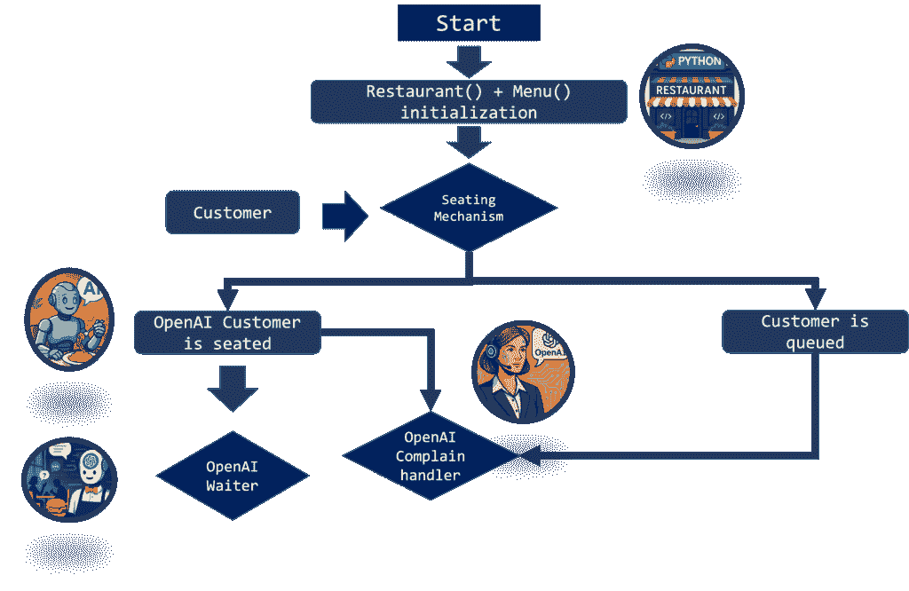
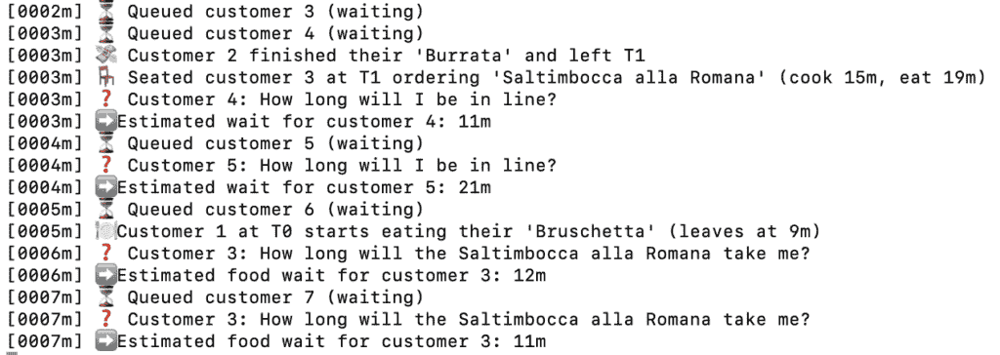
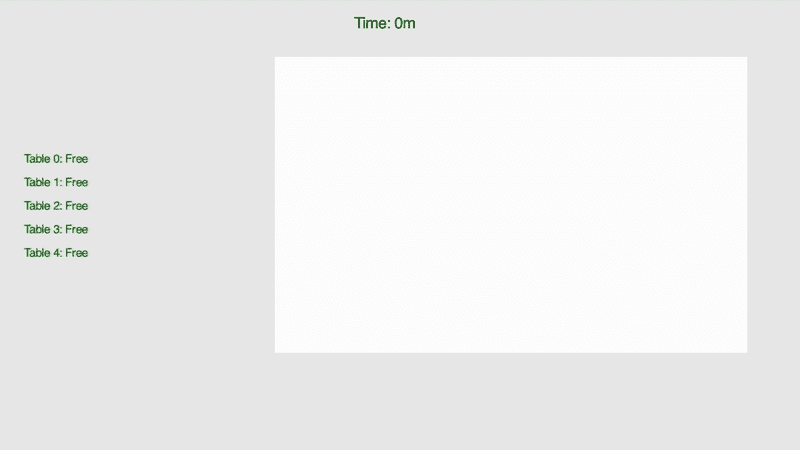

# 使用 Python 和 OpenAI 的动手多代理 LLM 餐厅模拟

> 原文：[`towardsdatascience.com/hands-on-multi-agent-llm-restaurant-simulation-with-python-and-openai/`](https://towardsdatascience.com/hands-on-multi-agent-llm-restaurant-simulation-with-python-and-openai/)

<mdspan datatext="el1745642950463" class="mdspan-comment">上周</mdspan>，OpenAI 发布了一份[PDF](https://cdn.openai.com/business-guides-and-resources/a-practical-guide-to-building-agents.pdf)，每个人都开始讨论它。这份 PDF 是一份 34 页的指南，解释了 LLM 代理是什么以及如何使用它们。

这份 PDF 相当简短，也非常易于阅读（你不需要是提示/软件工程师就能理解它），但简而言之，它解释了三件事：

> .1. LLM 代理**“是独立代表你完成任务的系统。”**

难道它们不是通过 API 调用的简单 LLM 提示吗？嗯，是的，也不是。你使用的是相同的 Chat Completion 模型，所以它们某种程度上是，***但是***它们旨在创建一个特定的动作。我的意思是，你的代理的输出**应该转化为你系统中可操作的结果**。例如，如果 LLM 输出说“意大利面”，那么“意大利面”就会被添加到你的数据管道中，最终会被看到并烹饪意大利面的人看到（剧透）。

> 2. LLM 代理特别适合与**功能（工具）**集成

我说的是当你向 ChatGPT 提问时，它会调用其图像生成器/网络搜索器/代码片段。它内部使用一个名为工具的功能，该功能由你的提示触发。现在，图像生成器是一个内置的功能，但它们也可以调用**你的功能（工具）**，你可以为你的任务专门定义。

> 3. 多个 LLM 代理可以**连续**集成。

你可以集成单个代理并为他提供多个工具***或者***将工具拆分为特定的代理，这正是我们在这篇文章中要做的（第二个剧透，哈哈）。

现在，技术细节可能对软件工程师来说很有趣，但为什么这个“代理”对其他人来说是个大问题呢？

嗯，这是因为这是一个范式转变，有助于为 Open AI 模型提供实用性。想想看：现在 LLM 提供了**可操作的结果**。所以这不仅仅是将 LLM 提示用于管道的最后一步来美化最终输出；这是将你的整个管道与 LLM 代理**集成**起来，以提高整个管道的质量。

尽管我尽力用语言解释，但我认为直接展示给你会更容易。让我们以**餐厅**为例。

标准餐厅有一个非常明显的自然流程：你排队等候，你点餐，你等待食物，吃饭，然后离开。现在，如果我们用“代理”方法来翻译，我们可以至少识别出三个代理：

+   **客户**代理是一个 LLM 代理，它订购食物或向服务员提出建议

+   **服务员**代理是一个 LLM，它收集订单并在必要时提供建议

+   **娱乐**代理是一个 LLM，目的是处理客户的投诉。

现在，OpenAI 非常具体地告诉你如何构建这些怪物，但这相对容易；还有更多，对吧？

我们需要实现**餐厅**，我们需要创建一个**排队方法**，人们根据餐厅的繁忙程度就座，我们需要创建**菜单**，模拟**等待时间**，确保一切正常，然后**然后**，**只有然后**我们才能连接代理。一如既往：

> 生成式 AI 很强大，前提是它处于正确的环境中。

因此，在我们进入这篇文章中关于代理的精彩部分之前，你会看到以下内容：

1.  LLM 代理餐厅的**系统设计**。一个无代码的想法，用笔和纸（更像是鼠标和 PowerPoint）的项目方案。

1.  **无代理餐厅实现**。简单明了，只是为了创建我们的代码框架

1.  **代理餐厅实现**。此外，一个简单的 GUI 来优雅地显示它

1.  **考虑事项和最终评论**。

看起来我们有很多东西要覆盖。去实验室吧！🧪

## 1. 餐厅系统设计

> **注意**：如果你进行了一些技术轮询，你会发现这个系统设计相当简单。这个设计的目的是不是全面展示一个机器学习系统的每个部分（就像他们在 15 分钟的面试中问你的那样），而是仅仅提供一些关于我们接下来要做什么的指导。

我们可以想象餐厅流程的方式，与 LLM 集成，总结在这张图片中：



图像由作者制作。小图标由 ChatGPT 生成

让我来解释：

+   **Restaurant()**和**Menu()**是两个类。我们声明它们，并且所有的桌子、订单和系统信息都将定义在类中，并动态更新

+   **新客户**必须通过一个座位机制。如果他们可以坐下（有足够的空闲桌子），那就太好了，我们可以让他们坐下；否则，客户将排队等待（排队）。

+   对于**已坐下**的客户，将有一位服务员让他们点餐。他们可以“抱怨”并询问点餐后食物需要多长时间。

+   **排队**的人无法做太多，但他们也可以“抱怨”并询问他们需要排队多长时间才能坐下。

现在，如果你这么想，你**不需要**LLM 来做这件事。例如，我们可以预先计算等待时间，然后通过预定义的格式化字符串进行沟通。我们还可以使用一个简单的列表来收集订单（就像麦当劳的自动亭子一样），然后结束。当然，我们可以这么做，但想想看。

如果顾客在等待时想询问菜单信息怎么办？如果他们对食物犹豫不决怎么办？如果他们想知道菜单上**最诱人的素食选项**怎么办？如果他们想找一瓶价格合理的**好酒**怎么办？我们要么为这些场景中的每一个开始声明基于规则的解决方案，浪费我们的时间和金钱，要么开始使用 AI。这正是这篇文章的主题。如果我们使用 LLM 代理，我们就有机会在一次遍历中处理所有这些场景。

现在，如果我确实学到了什么，那就是软件工程需要逐步进行。最好是有一个你模型的**骨架**，然后添加铃声和哨声。出于这个原因，我们将构建上述产品的代理自由版本。这个简化版本将有一个计算等待时间和菜单实现的排队系统，所以一切都会在没有 AI 的情况下顺利运行。在这个步骤之后，我们可以将代理放在我们上面讨论和展示的位置（顾客、表演者和服务员）。

## 2. 代理自由实现

在主脚本中尽可能保持一切尽可能简单总是一个好主意，让后端做脏活。我们的代理自由实现可以在这个代码中运行。

如我们所见，我们可以改变：

+   **num_tables**；我们餐厅的桌子数量

+   **arrival_prob**；是顾客在每一步到达的概率

+   **tick**；是模拟的时间步长

+   **pause**；调节 time.sleep()，它用于模拟真实餐厅的流程。

现在，所有这些实现都是在 **naive_models.py** 中完成的，它在这里。

所以这很长，让我带你走一些步骤。

整个脚本在命令 **.run()** 上运行在 naive_sim 上，具有以下功能：

+   **arrive**，模拟顾客到达并点餐，或者到达并排队

+   **process_cooking**，模拟每张桌子的烹饪过程，

+   **process_departures**，模拟顾客离开

+   **seat_from_queue**，模拟顾客从队列中就坐

+   **handle_random_query**，随机调用，其中队列中的顾客或等待食物的顾客可以询问等待时间

如果我们运行 naive_sim.py，我们可以在终端得到这个。



输出代码的 GIF，由作者生成。

现在，这本身就是一个数据科学产品。你可以用这个产品运行蒙特卡洛链，你可以看到形成长队的概率，餐馆可以使用他们餐厅的“数字孪生”来查看何时会发生关键事件。现在我们有一个工作的产品，让我们用 AI 让它更漂亮、更强大。

## 3. 代理餐厅实现

现在，正如我们上面看到的，顾客已经能够提问，我们已经有了一个作为数字的答案。在我们的实现中，顾客也会随机选择食物。让我们尝试将我们的代理添加到这个方案中。

### 3.1 自定义代理实现

您需要安装代理模块：

```py
pip install openai-agent
```

顾客、娱乐和投诉处理器的实现如下。

因此，我们有**客户端**定义，即 OpenAI 客户端调用，**newtools.py**，它拉取菜单，**call_agent**，它调用单个代理并通过**runner**运行。

这正是我们在引言中讨论的内容。我们正在定义多个**代理**，它们将连接起来，并使用由我的代码定义的工具。

### 3.2 自定义代理实现

在以下代码中，我们将带有代理的**餐桌**和**餐厅**实现集成。

3.3 LLM 餐厅 GUI 实现

为了展示带有 LLM 实现的餐厅的性能，我们通过一个简单的 GUI 进行展示。



输出代码的 GIF，由作者生成图像

图形用户界面（GUI）为你提供有关人员（艾玛）、餐桌、时间步长和 LLM 输出的信息。.txt 日志也会自动生成。

让我向您展示一个<mdspan datatext="el1745642823649" class="mdspan-comment">输出</mdspan>：

```py
[12:31:23] The customer Emma is talking to the waiter, saying this I'd like to start with the Bruschetta for the appetizer. 
Then, I'll have the Spaghetti Carbonara for the first course. 
For dessert, I'll enjoy the Tiramisu.
Could you also recommend a wine to go with this meal? [12:31:25] 
The processed response from our LLM is {'food': ['Bruschetta', 'Spaghetti Carbonara', 'Tiramisu', 'Chianti Classico'], 'status': 'successful'} [12:31:25] [0000m]
 ❓ Customer 1: How long will the food take me? [12:31:25] [0000m] 
➡️ Estimated food wait for customer 1: 15m [12:31:26] Our LLM took care of Emma with this:
Last agent: Agent(name="Entertainer", ...)
Final output (str): Hi Emma! Thank you for your patience. 
The wait to get in is about 15 minutes. 
Almost there—just enough time to start dreaming about that delicious Bruschetta! 🍽️
```

因此我们可以展示：

1.  **顾客通过代理创建自己的菜单**，并向服务员代理请求推荐

1.  **服务员推荐基安蒂并将其添加到列表中**

1.  **投诉处理器代理将等待通知顾客**

现在我们不仅可以模拟管道，就像我们之前做的那样，我们有一个**智能**的管道，它通过 ChatGPT 相同的科技进行了增强。这不是很酷吗？

## 4. 结论

非常感谢您与我一起在这里，这对您来说意义重大 ❤️。

让我们回顾一下在这篇文章中我们都做了些什么。

1.  **餐厅系统设计**：

    我们快速生成了一个包含 AI 代理的餐厅系统设计的 Powerpoint 演示。

1.  **无代理基线：**

    我们首先构建了一个确定性模拟，这样我们就可以在队列逻辑、烹饪时间和餐桌周转中编写代码。这是我们进行任何 AI 之前的框架。

1.  **基于代理的餐厅：**

    在这个阶段，我们使用 AI 代理来填充我们的投诉+行动情景，并使用 GUI 清晰地展示结果。

现在，在这个阶段，我想非常明确。我知道这看起来有点像黑镜。模拟顾客？模拟餐厅和服务员？是的，这很奇怪，**但是**问题从来不是 AI 工具本身，而是它如何被使用。我相信用 AI 替代人类服务员是一场输掉的游戏。

做一名服务员不仅仅是接受订单和根据之前点过的 N-1 款酒推荐第 N 款酒。这需要足够热情，让客人感到受欢迎，但又足够保持距离，不干扰他们的交谈；足够亲切，让他们感到宾至如归，但又足够坚定，让他们尊重你的界限。这是一系列需要人性、耐心和同理心的品质。

话虽如此，我相信正确使用这项技术可能会有双重作用：

1.  **帮助正在排队等待的人们**。里面的服务员非常忙碌，餐厅已经提供了菜单供你在等待座位时查看，而且认为其他服务员在没有人桌的情况下会娱乐等待的人是不现实的。在那个阶段，一个可以聊天的 AI 伴侣可能会有所帮助。

1.  **餐厅模拟**。我写的脚本还模拟了**顾客**的**行为**。这意味着，理论上，你可以使用这个模拟来测试不同的场景，观察何时形成队列，假设人们不同的反应，以及不同服务员的不同反应等等。换句话说，这可以成为你的“数字孪生”，在那里你可以进行测试。

1.  [在这里填写你的想法 … 🙂] 你觉得呢？这可以在哪里有帮助？

## 5\. 关于我！

再次感谢你抽出宝贵的时间。这对我很重要 ❤️

我的名字是 Piero Paialunga，就是我这里这个人：


我是辛辛那提大学航空航天工程系的博士生。我在博客文章、LinkedIn 和 TDS 上谈论人工智能和[机器学习](https://towardsdatascience.com/tag/machine-learning/)。如果你喜欢这篇文章，并想了解更多关于机器学习的信息，以及跟随我的研究，你可以：

A. 在[**LinkedIn**](https://www.linkedin.com/in/pieropaialunga/)上关注我，我在那里发布所有我的故事

B. 在[**GitHub**](https://github.com/PieroPaialungaAI)上关注我，在那里你可以看到我所有的代码

C. 发送电子邮件给我：***[[email protected]](/cdn-cgi/l/email-protection)***

D. 想和我一起工作吗？查看我的收费和项目[**Upwork**](https://www.upwork.com/freelancers/~017f9a75d13c030610)！

Ciao.

> P.S. 我的博士学位即将结束，我在考虑我职业生涯的下一步！如果你喜欢我的工作，并想雇佣我，请不要犹豫，随时联系。 🙂
