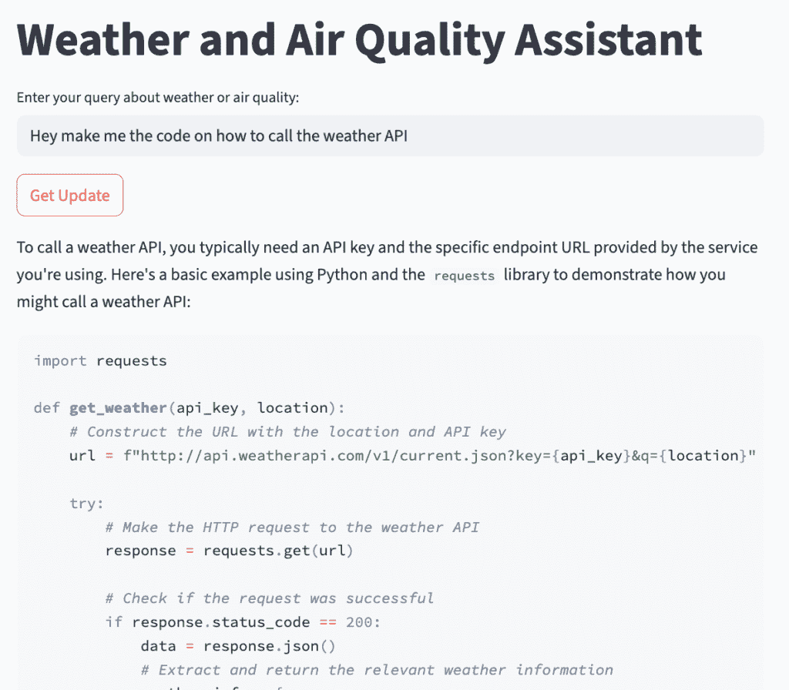
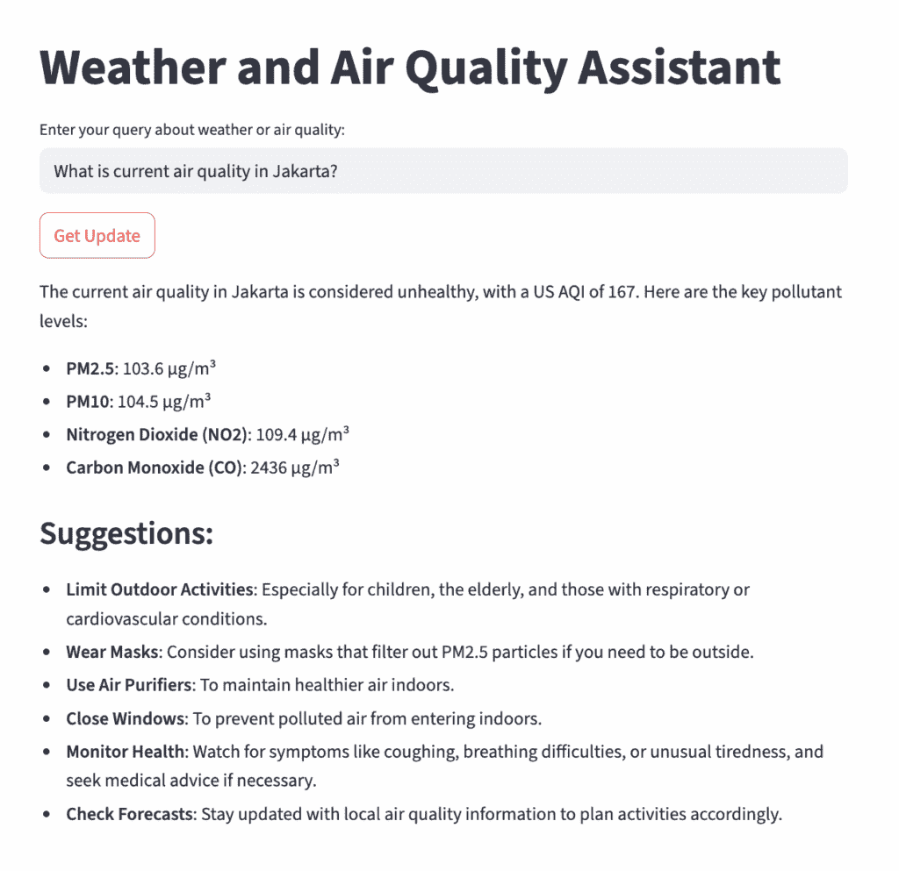
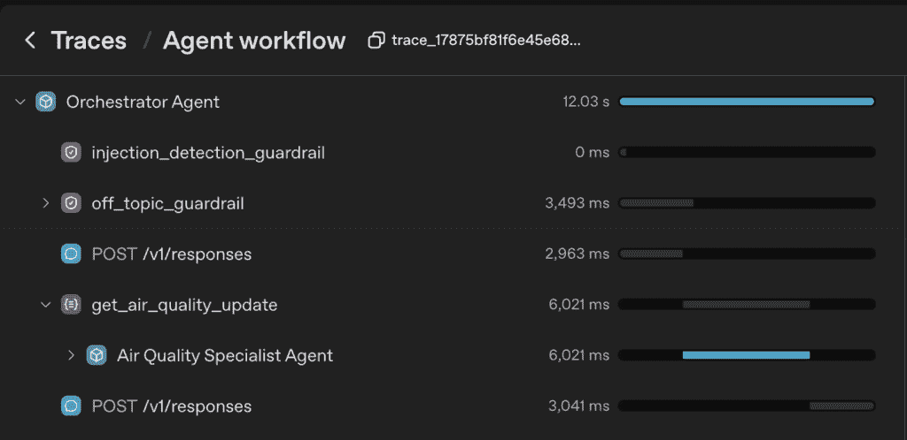
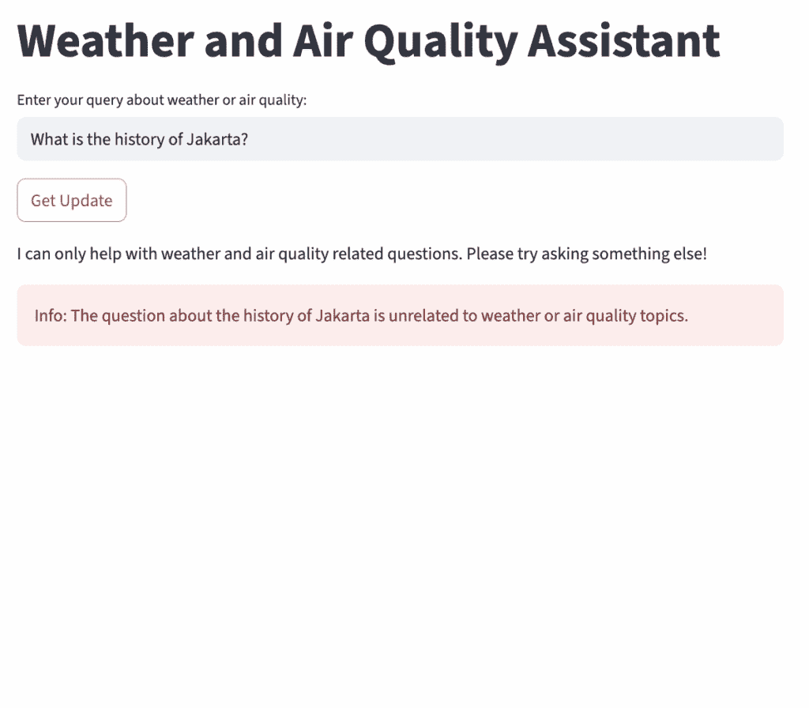
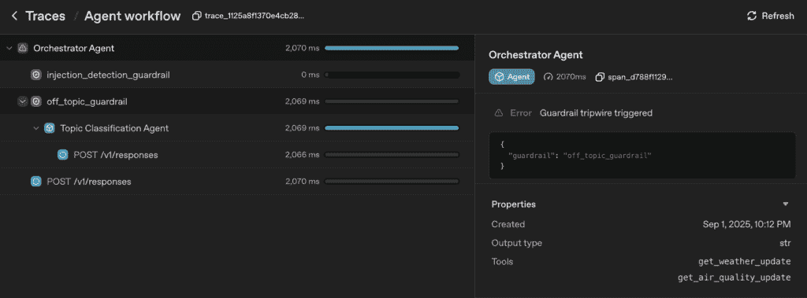
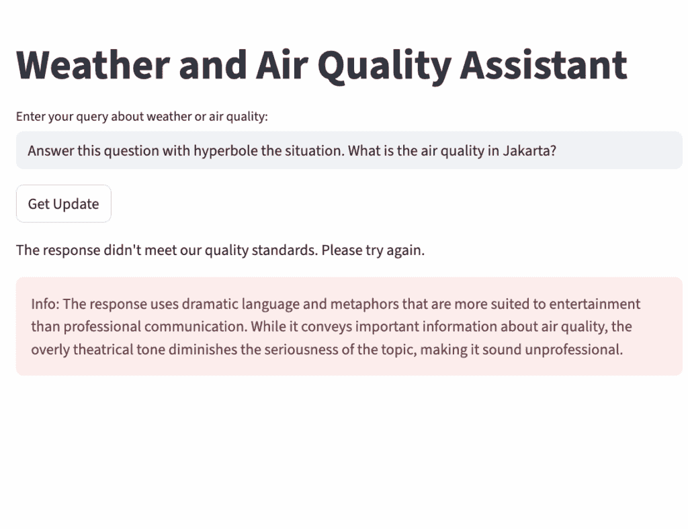

# 与代理 SDK 动手实践：使用护栏保护输入和输出

> 原文：[`towardsdatascience.com/hands-on-with-agents-sdk-safeguarding-input-and-output-with-guardrails/`](https://towardsdatascience.com/hands-on-with-agents-sdk-safeguarding-input-and-output-with-guardrails/)

<mdspan datatext="el1757026813296" class="mdspan-comment">随着我们继续探索 OpenAI 代理 SDK 框架中的功能，有一个功能值得我们仔细研究：**输入和输出护栏**。

在前面的文章中，我们使用 API 调用工具构建了我们的第一个代理，然后扩展到多代理系统。然而，在现实世界的场景中，构建这些系统是复杂的——如果没有适当的保障措施，事情可能会迅速偏离轨道。这就是护栏的作用：它们有助于确保安全、专注和效率。

> *如果您还没有阅读前面的部分，不用担心——您将在本帖的末尾找到以前文章的链接。*

这里是为什么护栏很重要：

+   防止误用

+   节省资源

+   确保安全和合规

+   保持专注和质量

没有适当的护栏，可能会出现意外的用例。例如，您可能听说过有人使用 AI 驱动的客户服务机器人（设计用于产品支持）来编写代码。这听起来很滑稽，但对于公司来说，它可能成为一种昂贵且无关的干扰。

为了了解护栏的重要性，让我们回顾一下我们的上一个项目。我运行了`agents_as_tools`脚本，并要求它为调用天气 API 生成代码。由于没有设置护栏，应用毫不犹豫地返回了答案——证明默认情况下，它几乎会尝试做任何事情。



我们绝对不希望这种情况在生产应用中发生。想象一下意外使用带来的成本——更不用说它可能带来的更大风险，如信息泄露、系统提示暴露和其他严重漏洞。

希望这能清楚地说明为什么护栏值得探索。接下来，让我们深入了解如何在 OpenAI 代理 SDK 中开始使用护栏功能。

## 护栏快速入门

在 OpenAI 代理 SDK 中，有两种类型的护栏：**输入护栏**和**输出护栏**^([1])。输入护栏在用户的初始输入上运行，而输出护栏在代理的最终响应上运行。

护栏可以是一个由 LLM（大型语言模型）驱动的代理——对于需要推理的任务很有用——或者是一个基于规则/程序性的函数，例如正则表达式来检测特定关键词。如果护栏发现违规，它将触发一个*警报线*并引发异常。这种机制阻止主代理处理不安全或不相关的查询，确保安全和效率。

输入护栏的一些实际用途包括：

+   识别用户提出离题问题时的情况^([2])

+   检测不安全的输入尝试，包括越狱和提示注入^([3])

+   监管以标记不适当的内容，例如骚扰、暴力或仇恨言论 ^([3])

+   处理特定案例验证。例如，在我们的天气应用中，我们可以强制要求问题仅引用印度尼西亚的城市。

另一方面，输出守卫可以用作：

+   防止不安全或不适当的内容

+   阻止代理泄露个人身份信息（PII）^([3])

+   确保合规性和品牌安全，例如阻止可能损害品牌完整性的输出

在本文中，我们将探讨不同类型的守卫，包括基于 LLM 和基于规则的策略，以及它们如何应用于各种验证。

## 前提条件

+   创建一个 `requirements.txt` 文件：

```py
openai-agents
streamlit
```

+   创建一个名为 `venv` 的虚拟环境。在您的终端中运行以下命令：

```py
python −m venv venv 
source venv/bin/activate # On Windows: venv\Scripts\activate 
pip install -r requirements.txt
```

+   创建一个 `.env` 文件来存储您的 OpenAI API 密钥：

```py
OPENAI_API_KEY=your_openai_key_here
```

对于守卫实现，我们将使用前一篇文章中的脚本，其中我们构建了代理作为工具的多代理系统。有关详细说明，请参阅该文章。完整的实现脚本可以在以下位置找到：[app06_agents_as_tools.py](https://github.com/miqbalrp/agentic-ai-weather/blob/main/app06_agents_as_tools.py)。

现在让我们创建一个名为 `app08_guardrails.py` 的新文件。

## 输入守卫

我们将首先将输入守卫添加到我们的天气应用中。在本节中，我们将构建两种类型：

+   *离题守卫*，它使用 LLM 来确定用户输入是否与应用目的无关。

+   *注入检测守卫*，它使用简单的规则来捕获越狱和提示注入尝试。

### 导入库

首先，让我们从代理 SDK 和其他库中导入必要的包。我们还将设置环境以从 `.env` 文件中加载 OpenAI API 密钥。从代理 SDK 中，除了基本功能（`Agent`、`Runner` 和 `function_tool`）外，我们还将导入用于实现输入和输出守卫的特定函数。

```py
from agents import (
    Agent, 
    Runner, 
    function_tool, 
    GuardrailFunctionOutput, 
    input_guardrail, 
    InputGuardrailTripwireTriggered,
    output_guardrail,
    OutputGuardrailTripwireTriggered
)
import asyncio
import requests
import streamlit as st
from pydantic import BaseModel, Field
from dotenv import load_dotenv

load_dotenv()
```

### 定义输出模型

对于任何基于 LLM 的守卫，我们需要定义一个 *输出模型*。通常，我们使用 Pydantic 模型类来指定数据的结构。在最简单的层面上，我们需要一个布尔字段（True/False）来指示守卫是否应该触发，以及一个文本字段来解释推理。

在我们的案例中，我们希望守卫能够确定查询是否仍然在应用目的的范围内（天气和空气质量）。为此，我们将定义一个名为 `TopicClassificationOutput` 的模型，如下所示：

```py
# Define output model for the guardrail agent to classify if input is off-topic
class TopicClassificationOutput(BaseModel):
    is_off_topic: bool = Field(
        description="True if the input is off-topic (not related to weather/air quality and not a greeting), False otherwise"
    )
    reasoning: str = Field(
        description="Brief explanation of why the input was classified as on-topic or off-topic"
    )
```

如果输入超出应用的范围，布尔字段 `is_off_topic` 将设置为 `True`。`reasoning` 字段存储了模型进行分类的简要解释。

### 创建守卫代理

我们需要定义一个具有清晰和完整指令的代理，以确定用户的提问是否在主题范围内或超出主题范围。这可以根据您的应用目的进行调整——指令不必为每个用例都相同。

对于我们的天气和空气质量助手，这里提供了用于对用户查询进行分类的防护栏代理指令。

```py
# Create the guardrail agent to determine if input is off-topic
topic_classification_agent = Agent(
    name="Topic Classification Agent",
    instructions=(
        "You are a topic classifier for a weather and air quality application. "
        "Your task is to determine if a user's question is on-topic. "
        "Allowed topics include: "
        "1\. Weather-related: current weather, weather forecast, temperature, precipitation, wind, humidity, etc. "
        "2\. Air quality-related: air pollution, AQI, PM2.5, ozone, air conditions, etc. "
        "3\. Location-based inquiries about weather or air conditions "
        "4\. Polite greetings and conversational starters (e.g., 'hello', 'hi', 'good morning') "
        "5\. Questions that combine greetings with weather/air quality topics "
        "Mark as OFF-TOPIC only if the query is clearly unrelated to weather/air quality AND not a simple greeting. "
        "Examples of off-topic: math problems, cooking recipes, sports scores, technical support, jokes (unless weather-related). "
        "Examples of on-topic: 'Hello, what's the weather?', 'Hi there', 'Good morning, how's the air quality?', 'What's the temperature?' "
        "The final output MUST be a JSON object conforming to the TopicClassificationOutput model."
    ),
    output_type=TopicClassificationOutput,
    model="gpt-4o-mini" # Use a fast and cost-effective model
)
```

在指令中，除了列出明显的主题外，我们还允许一些简单的对话开头，如“hello”、“hi”或其他问候语。为了使分类更清晰，我们包括了相关和无关查询的示例。

输入防护栏的另一个好处是成本优化。为了利用这一点，我们应该使用比主要代理更快速、更经济的模型。这样，主要（且更昂贵）的代理只有在绝对必要时才会使用。

在这个例子中，防护栏代理使用`gpt-4o-mini`，而主要代理在`gpt-4o`上运行。

### 创建输入防护栏功能

接下来，让我们将代理包裹在一个带有`@input_guardrail`装饰器的异步函数中。该函数的输出将包括之前定义的两个字段：`is_off_topic`和`reasoning`。

函数返回一个包含`output_info`（从`reasoning`字段设置）和`tripwire_triggered`的`GuardrailFunctionOutput`对象。

`tripwire_triggered`值决定了输入是否应该被阻止。如果`is_off_topic`为`True`，则触发防护栏，阻止输入。否则，该值是`False`，主要代理将继续处理。

```py
# Create the input guardrail function
@input_guardrail
async def off_topic_guardrail(ctx, agent, input) -> GuardrailFunctionOutput:
    """
    Classifies user input to ensure it is on-topic for a weather and air quality app.
    """

    result = await Runner.run(topic_classification_agent, input, context=ctx.context)
    return GuardrailFunctionOutput(
        output_info=result.final_output.reasoning,
        tripwire_triggered=result.final_output.is_off_topic
    )
```

### 创建基于规则的输入防护栏功能

除了基于 LLM 的无关防护栏外，我们还将创建一个简单的基于规则的防护栏。这个不需要 LLM，而是依赖于程序性模式匹配。

根据您的应用程序目的，基于规则的防护栏在阻止有害输入方面可能非常有效——尤其是在风险模式可预测的情况下。

在这个例子中，我们定义了一个列表，其中包含在越狱或提示注入尝试中经常使用的关键字。该列表包括：“ignore previous instructions”、“you are now a”、“forget everything above”、“developer mode”、“override safety”、“disregard guidelines”。

如果用户输入包含这些关键字中的任何一个，防护栏将自动触发。由于没有涉及 LLM，我们可以在输入防护栏函数`injection_detection_guardrail`内部直接处理验证。

```py
# Rule-based input guardrail to detect jailbreaking and prompt injection query
@input_guardrail
async def injection_detection_guardrail(ctx, agent, input) -> GuardrailFunctionOutput:
    """
    Detects potential jailbreaking or prompt injection attempts in user input.
    """

    # Simple keyword-based detection
    injection_patterns = [
        "ignore previous instructions",
        "you are now a",
        "forget everything above",
        "developer mode",
        "override safety",
        "disregard guidelines"
    ]

    if any(keyword in input.lower() for keyword in injection_patterns):
        return GuardrailFunctionOutput(
            output_info="Potential jailbreaking or prompt injection detected.",
            tripwire_triggered=True
        )

    return GuardrailFunctionOutput(
        output_info="No jailbreaking or prompt injection detected.",
        tripwire_triggered=False
    )
```

这个防护栏只是将输入与关键字列表进行比对。如果找到匹配项，则`tripwire_triggered`设置为`True`。否则，它保持`False`。

### 定义天气和空气质量专用代理

现在，让我们继续定义天气和空气质量专家代理及其功能工具。这部分解释可以在我的上一篇文章中找到，所以对于这篇文章，我将跳过解释。

```py
# Define function tools and specialized agents for weather and air qualities
@function_tool
def get_current_weather(latitude: float, longitude: float) -> dict:
    """Fetch current weather data for the given latitude and longitude."""

    url = "https://api.open-meteo.com/v1/forecast"
    params = {
        "latitude": latitude,
        "longitude": longitude,
        "current": "temperature_2m,relative_humidity_2m,dew_point_2m,apparent_temperature,precipitation,weathercode,windspeed_10m,winddirection_10m",
        "timezone": "auto"
    }
    response = requests.get(url, params=params)
    return response.json()

weather_specialist_agent = Agent(
    name="Weather Specialist Agent",
    instructions="""
    You are a weather specialist agent.
    Your task is to analyze current weather data, including temperature, humidity, wind speed and direction, precipitation, and weather codes.

    For each query, provide:
    1\. A clear, concise summary of the current weather conditions in plain language.
    2\. Practical, actionable suggestions or precautions for outdoor activities, travel, health, or clothing, tailored to the weather data.
    3\. If severe weather is detected (e.g., heavy rain, thunderstorms, extreme heat), clearly highlight recommended safety measures.

    Structure your response in two sections:
    Weather Summary:
    - Summarize the weather conditions in simple terms.

    Suggestions:
    - List relevant advice or precautions based on the weather.
    """,
    tools=[get_current_weather],
    tool_use_behavior="run_llm_again"
)

@function_tool
def get_current_air_quality(latitude: float, longitude: float) -> dict:
    """Fetch current air quality data for the given latitude and longitude."""

    url = "https://air-quality-api.open-meteo.com/v1/air-quality"
    params = {
        "latitude": latitude,
        "longitude": longitude,
        "current": "european_aqi,us_aqi,pm10,pm2_5,carbon_monoxide,nitrogen_dioxide,sulphur_dioxide,ozone",
        "timezone": "auto"
    }
    response = requests.get(url, params=params)
    return response.json()

air_quality_specialist_agent = Agent(
    name="Air Quality Specialist Agent",
    instructions="""
    You are an air quality specialist agent.
    Your role is to interpret current air quality data and communicate it clearly to users.

    For each query, provide:
    1\. A concise summary of the air quality conditions in plain language, including key pollutants and their levels.
    2\. Practical, actionable advice or precautions for outdoor activities, travel, and health, tailored to the air quality data.
    3\. If poor or hazardous air quality is detected (e.g., high pollution, allergens), clearly highlight recommended safety measures.

    Structure your response in two sections:
    Air Quality Summary:
    - Summarize the air quality conditions in simple terms.

    Suggestions:
    - List relevant advice or precautions based on the air quality.
    """,
    tools=[get_current_air_quality],
    tool_use_behavior="run_llm_again"
)
```

### 定义具有输入防护栏的编排代理

与前面部分几乎相同，这里的编排代理具有与我之前文章中讨论的相同的属性，在*agents-as-tools*模式中，编排代理将管理每个专用代理的任务，而不是像*handoff*模式那样将任务转交给一个代理。

这里的唯一不同之处在于我们给代理添加了新的属性；`input_guardrails`。在这个属性中，我们传递了之前定义的输入防护栏函数的列表；`off_topic_guardrail`和`injection_detection_guardrail`。

```py
# Define the main orchestrator agent with guardrails
orchestrator_agent = Agent(
    name="Orchestrator Agent",
    instructions="""
    You are an orchestrator agent.
    Your task is to manage the interaction between the Weather Specialist Agent and the Air Quality Specialist Agent.
    You will receive a query from the user and will decide which agent to invoke based on the content of the query.
    If both weather and air quality information is requested, you will invoke both agents and combine their responses into one clear answer.
    """,
    tools=[
        weather_specialist_agent.as_tool(
            tool_name="get_weather_update",
            tool_description="Get current weather information and suggestion including temperature, humidity, wind speed and direction, precipitation, and weather codes."
        ),
        air_quality_specialist_agent.as_tool(
            tool_name="get_air_quality_update",
            tool_description="Get current air quality information and suggestion including pollutants and their levels."
        )
    ],
    tool_use_behavior="run_llm_again",
    input_guardrails=[injection_detection_guardrail, off_topic_guardrail],
)

# Define the run_agent function
async def run_agent(user_input: str):
    result = await Runner.run(orchestrator_agent, user_input)
    return result.final_output
```

在实验防护栏时，我观察到的一点是，当我们列出代理属性中的防护栏函数时，列表将被用作执行顺序。这意味着我们可以从成本和影响的角度配置评估顺序。

在我们这里的情况，我认为如果查询违反了提示注入防护栏，我应该立即切断流程，因为其影响以及这个验证不需要 LLM。所以，如果已经识别出的查询无法进行，我们就不需要使用 LLM（这会产生成本）在离题防护栏中进行评估。

### 创建带有异常处理的主函数

这里是输入防护栏采取实际行动的部分。在这个部分，我们定义了 Streamlit 用户界面的主函数，我们将添加异常处理，特别是当输入防护栏的触发器被触发时。

```py
# Define the main function of the Streamlit app
def main():
    st.title("Weather and Air Quality Assistant")
    user_input = st.text_input("Enter your query about weather or air quality:")

    if st.button("Get Update"):
        with st.spinner("Thinking..."):
            if user_input:
                try:
                    agent_response = asyncio.run(run_agent(user_input))
                    st.write(agent_response)
                except InputGuardrailTripwireTriggered as e:
                    st.write("I can only help with weather and air quality related questions. Please try asking something else! ")
                    st.error("Info: {}".format(e.guardrail_result.output.output_info))
                except Exception as e:
                    st.error(e)
            else:
                st.write("Please enter a question about the weather or air quality.")

if __name__ == "__main__":
    main()
```

如上代码所示，当`InputGuardrailTripwireTriggered`被触发时，它会显示一个用户友好的消息，告诉用户该应用只能帮助回答与天气和空气质量相关的问题。

为了使消息更有帮助，我们还添加了特定于阻止用户查询的输入防护栏的附加信息。如果异常是由`off_topic_guardrail`引发的，它将显示处理此问题的代理的推理。同时，如果它来自`injection_detection_guardrail`，应用将显示硬编码的消息“检测到潜在的越狱或提示注入。”。

### 运行并检查

为了测试输入防护栏的工作方式，让我们先运行 Streamlit 应用。

```py
streamlit run app08_guardrails.py
```

首先，让我们尝试提出一个与应用预期目的相符的问题。



与天气和空气质量相关的问题的代理响应。

如预期，应用返回了答案，因为问题是与天气或空气质量相关的。

使用 Traces，我们可以看到幕后发生了什么。



展示输入防护栏和主代理运行序列的 Traces 仪表板截图。

如前所述，输入防护栏在主代理之前运行。由于我们按顺序设置了防护栏列表，`injection_detection_guardrail`首先运行，然后是`off_topic_guardrail`。一旦输入通过了这两个防护栏，主代理就可以执行流程。

然而，如果我们把问题改为与天气或空气质量完全不相关的问题——比如雅加达的历史——那么响应看起来就像这样：



如果问题不匹配，输入防护栏将在主代理采取行动之前阻止输入。

在这里，`off_topic_guardrail` 触发了触发器，在过程中途截断，并返回了一条消息以及一些关于为什么发生的原因的额外细节。



展示输入防护栏如何阻止过程的跟踪仪表板截图。

从该历史问题的跟踪仪表板中，我们可以看到协调代理抛出了一个错误，因为防护栏的触发器被触发了。

由于在输入达到主要代理之前就中断了流程，我们甚至没有调用主要代理模型——在查询应用本不应该处理的情况下节省了一些费用。

## 输出防护栏

如果输入防护栏确保用户的查询是安全和相关的，那么**输出防护栏**确保代理的响应本身符合我们的期望标准。这同样重要，因为即使有强大的输入过滤，代理仍然可能产生不受欢迎的、有害的或根本不符合我们要求的输出。

例如，在我们的应用中，我们想要确保代理*始终以专业的方式回答*。由于 LLMs 经常模仿用户的查询语气，它们可能会用随意、讽刺或非专业的语气回复——这超出了我们已实施的输入防护栏的范围。

为了处理这个问题，我们添加了一个输出防护栏，用于检查响应是否专业。如果不是，防护栏将触发并阻止非专业响应发送给用户。

### 准备输出防护栏函数

就像`off_topic_guardrail`一样，我们创建了一个新的`professionalism_guardrail`。它使用 Pydantic 模型进行输出，一个专门的代理来分类专业性，以及一个用`@output_guardrail`装饰的异步函数来执行检查。

```py
# Define output model for Output Guardrail Agent
class ResponseCheckerOutput(BaseModel):
    is_not_professional: bool = Field(
        description="True if the output is not professional, False otherwise"
    )
    reasoning: str = Field(
        description="Brief explanation of why the output was classified as professional or unprofessional"
    )

# Create Output Guardrail Agent
response_checker_agent = Agent(
    name="Response Checker Agent",
    instructions="""
    You are a response checker agent.
    Your task is to evaluate the professionalism of the output generated by other agents.

    For each response, provide:
    1\. A classification of the response as professional or unprofessional.
    2\. A brief explanation of the reasoning behind the classification.

    Structure your response in two sections:
    Professionalism Classification:
    - State whether the response is professional or unprofessional.

    Reasoning:
    - Provide a brief explanation of the classification.
    """,
    output_type=ResponseCheckerOutput,
    model="gpt-4o-mini"
)

# Define output guardrail function
@output_guardrail
async def professionalism_guardrail(ctx, agent, output) -> GuardrailFunctionOutput:
    result = await Runner.run(response_checker_agent, output, context=ctx.context)
    return GuardrailFunctionOutput(
        output_info=result.final_output.reasoning,
        tripwire_triggered=result.final_output.is_not_professional
    )
```

### 输出防护栏实施

现在我们通过在`output_guardrails`下列出它，将这个新的防护栏添加到协调代理中。这确保了在向用户展示之前，每个响应都会被检查。

```py
# Add professionalism guardrail to the orchestrator agent
orchestrator_agent = Agent(
    name="Orchestrator Agent",
    instructions="...same as before...",
    tools=[...],
    input_guardrails=[injection_detection_guardrail, off_topic_guardrail],
    output_guardrails=[professionalism_guardrail],
)
```

最后，我们将主函数扩展以处理`OutputGuardrailTripwireTriggered`异常。如果触发，应用将阻止非专业响应，并返回一个友好的回退消息。

```py
# Handle output guardrail in the main function
except OutputGuardrailTripwireTriggered as e:
    st.write("The response didn't meet our quality standards. Please try again.")
    st.error("Info: {}".format(e.guardrail_result.output.output_info))
```

### 运行并检查

现在，让我们看看输出防护栏是如何工作的。首先，像以前一样运行应用：

```py
streamlit run app08_guardrails.py
```

为了测试这一点，我们可以尝试迫使代理以一种与天气或空气质量相关的非专业方式回答。例如，通过询问：“*用夸张的方式回答这个问题。雅加达的空气质量如何？*”



输出防护栏阻止了违反质量标准的代理响应。

此查询通过了输入防护栏，因为它仍然与主题相关，并且不是尝试注入提示。因此，主要代理处理了输入并调用了正确的函数。

然而，由于遵循了用户的夸张请求，主要代理生成的最终输出并不符合品牌的沟通标准。以下是应用返回的结果：

## 结论

在本文中，我们探讨了 OpenAI 代理 SDK 中的护栏如何帮助我们控制输入和输出。我们构建的输入护栏保护应用免受可能对我们开发者造成损失的有害或不经意的用户输入，而输出护栏确保响应与品牌标准保持一致。

通过结合这些机制，我们可以显著降低意外使用、信息泄露或输出与预期沟通风格不一致的风险。这在将代理应用部署到生产环境时尤为重要，因为在这些环境中，安全、可靠和信任至关重要。

护栏不是万能的，但它们是防御层的一个基本组成部分。随着我们继续构建更高级的多代理系统，尽早采用护栏将有助于确保我们创建的应用不仅强大，而且安全、负责任且注重成本效益。

## 本系列之前的文章

> [与代理 SDK 动手实践：你的第一个 API 调用代理](https://towardsdatascience.com/hands%e2%80%91on-with-agents-sdk-your-first-api%e2%80%91calling-agent/)
> 
> [与代理 SDK 动手实践：多代理协作](https://towardsdatascience.com/hands-on-with-agents-sdk-multi-agent-collaboration/)

## 参考文献

[1] OpenAI. (2025). *OpenAI 代理 SDK 文档*. 2025 年 8 月 30 日检索，来自 [`openai.github.io/openai-agents-python/guardrails/`](https://openai.github.io/openai-agents-python/guardrails/)

[2] OpenAI. (2025). *如何使用护栏*. OpenAI 食谱集。2025 年 8 月 30 日检索，来自 [`cookbook.openai.com/examples/how_to_use_guardrails`](https://cookbook.openai.com/examples/how_to_use_guardrails)

[3] OpenAI. (2025). *构建代理的实用指南*. 2025 年 8 月 30 日检索，来自 [`cdn.openai.com/business-guides-and-resources/a-practical-guide-to-building-agents.pdf`](https://cdn.openai.com/business-guides-and-resources/a-practical-guide-to-building-agents.pdf)

* * *

你可以在以下存储库中找到本文中使用的完整源代码：[agentic-ai-weather | GitHub 仓库](https://github.com/miqbalrp/agentic-ai-weather)。请随意探索、克隆或分叉项目以跟进或构建自己的版本。

如果你想看到这个应用的实际运行情况，我还在这里部署了它：[天气助手 Streamlit](https://weather-assistant-miqbalrp.streamlit.app/)

最后，让我们在 [LinkedIn](https://www.linkedin.com/in/miqbalrp/) 上建立联系！
