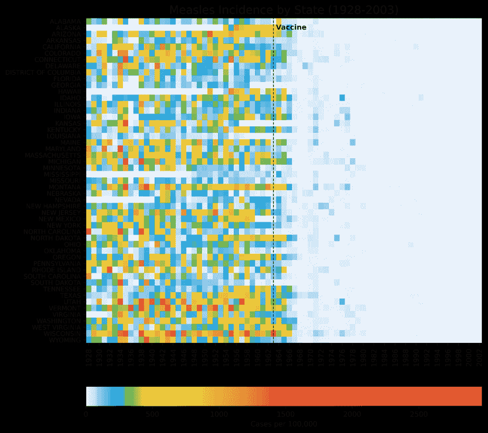
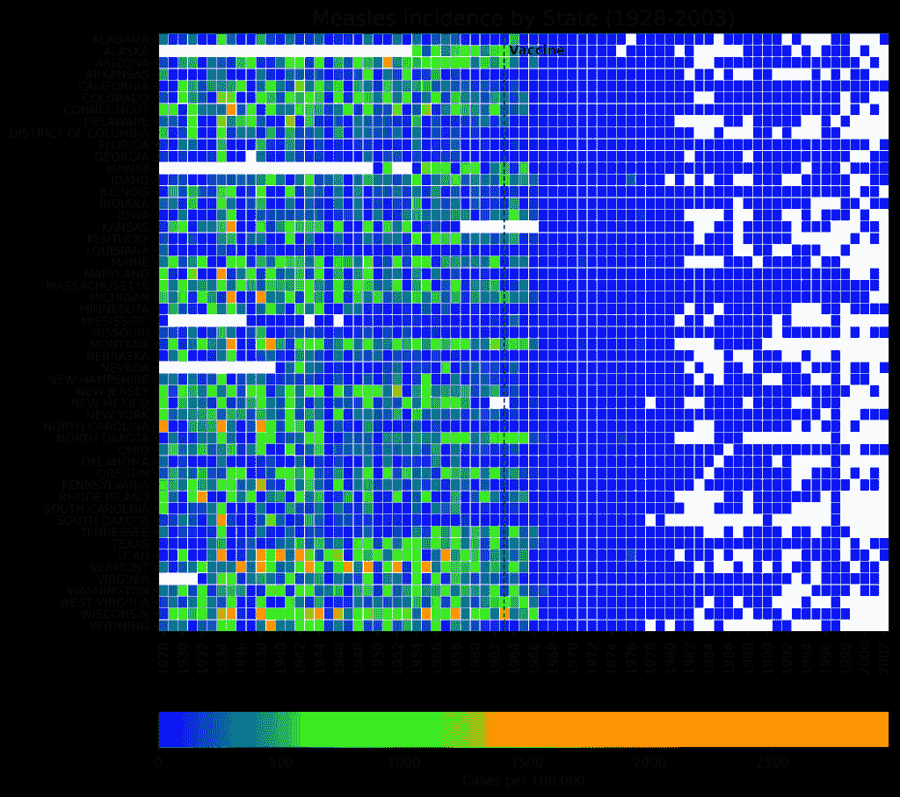
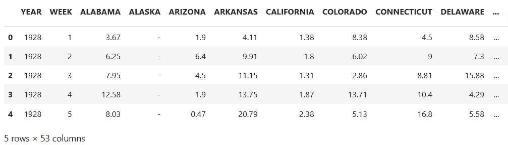
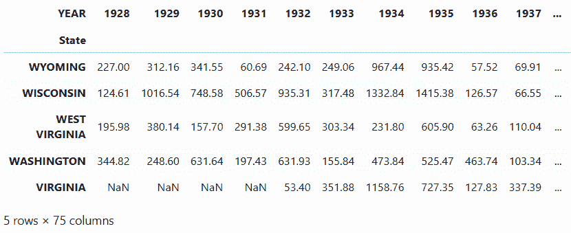
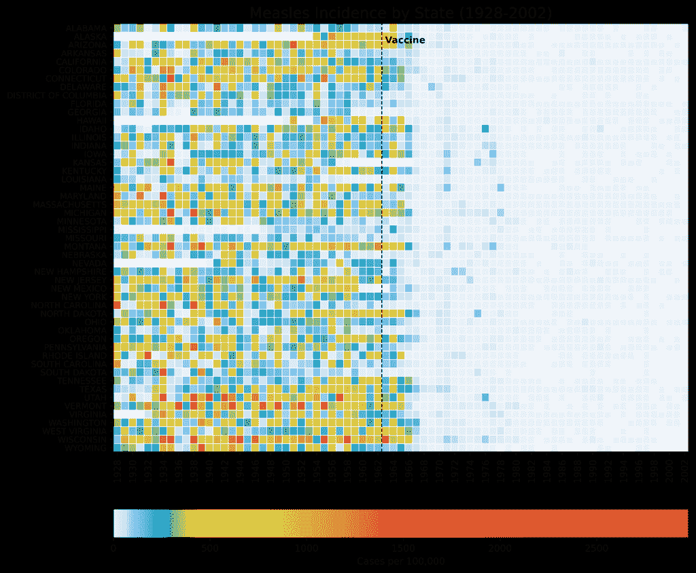

# 时间序列热图

> 原文：[`towardsdatascience.com/heatmaps-for-time-series/`](https://towardsdatascience.com/heatmaps-for-time-series/)

2015 年，*华尔街日报（WSJ）*发布了一系列高度有效热图，展示了疫苗对美国传染病的影响。这些可视化展示了全面政策推动广泛变革的力量。您可以在[这里](https://graphics.wsj.com/infectious-diseases-and-vaccines/)查看热图。

热图是数据分析的一个多功能工具。它们促进比较分析、突出时间趋势和实现模式识别的能力，使得它们在传达复杂信息方面变得非常有价值。

在这个*快速成功数据科学*项目中，我们将使用 Python 的 Matplotlib 绘图库来重新创建*WSJ*的麻疹图表，展示如何利用热图和精心设计的颜色条来影响数据叙事。

## 数据

疾病数据来自匹兹堡大学的[Project Tycho](https://www.tycho.pitt.edu/)。这个组织与国家和全球卫生机构和研究人员合作，使数据更容易使用，以改善全球卫生。麻疹数据可在 Creative Commons Attribution 4.0 International Public [许可](https://www.tycho.pitt.edu/accounts/register/)下获得。

为了方便起见，我已经从 Project Tycho 的[数据门户](https://www.tycho.pitt.edu/search/)下载了数据，并将其保存为 CSV 文件，存储在这个[Gist](https://gist.github.com/rlvaugh/fd6ce822c98e38849d3ec51e3fd3441d)中。稍后，我们将通过代码以编程方式访问它。

## 麻疹热图

我们将使用 Matplotlib 的 pcolormesh()函数构建[WSJ 麻疹热图](https://graphics.wsj.com/infectious-diseases-and-vaccines/)的逼真复制品。虽然其他库，如[Seaborn](https://seaborn.pydata.org/generated/seaborn.heatmap.html)、[Plotly Express](https://plotly.com/python/2D-Histogram/)和[hvplot](https://hvplot.holoviz.org/reference/tabular/heatmap.html)包括专门的 heatmap 函数，但这些是为*易用性*而构建的，大多数设计决策都被抽象化。这使得很难使它们的结果与*WSJ*热图相匹配。

除了`pcolormesh()`之外，Matplotlib 的`imshow()`函数（用于“图像显示”）也可以生成热图。然而，`pcolormesh`函数更好地将网格线与单元格边缘对齐。

这里是一个使用`imshow()`制作的示例热图，您可以将其与稍后比较的`pcolormesh()`结果。主要区别在于没有网格线。



使用 Matplotlib 的`imshow()`函数（作者制作）构建的麻疹发病率热图

1963 年，麻疹疫苗在美国获得许可并广泛推广。五年内，疾病的发病率大幅下降。到 2000 年，麻疹在美国被认为已被根除，任何新的病例都来自国外。注意可视化如何很好地传达这个“大局”同时保留州级细节。这在很大程度上归功于颜色条的选择。

可视化中使用的颜色是有**偏好的**。超过 80%的颜色条由暖色组成，而（浅）蓝色则保留给最小值。这使得区分疫苗接种前后时期变得容易。白色单元格表示**缺失数据**，由 NaN（非数字）值表示。

将之前的热图与使用更平衡颜色条构建的热图进行比较：



使用更平衡的颜色条的热图（作者制作）

深蓝色不仅盖过了图表，对眼睛也有害。虽然仍然可以看到疫苗的效果，但与带有偏色颜色条的图表相比，视觉影响要微弱得多。另一方面，更容易解析更高的值，但以牺牲整体主题为代价。

## 代码

以下代码是用 JupyterLab 编写的，并按单元格展示。

### 导入库

第一个单元格导入了完成项目所需的库。通过在线搜索库的名称，你可以找到安装说明。

```py
import numpy as np
import matplotlib.pyplot as plt
from matplotlib.colors import LinearSegmentedColormap, Normalize
from matplotlib.cm import ScalarMappable
import pandas as pd
```

### 创建自定义颜色映射

以下代码几乎复制了*WSJ*使用的颜色映射。我使用在线[*图像颜色选择器*](https://www.imgcolorpicker.com/)工具从他们的麻疹热图截图识别关键颜色，并根据为 R 制作的[类似教程](https://www.mikelee.co/posts/2017-06-28-wsj-measles-vaccination-chart)选择的颜色进行了调整。

```py
# Normalize RGB colors:
colors = ['#e7f0fa',  # lightest blue
          '#c9e2f6',  # light blue
          '#95cbee',  # blue
          '#0099dc',  # dark blue
          '#4ab04a',  # green
          '#ffd73e',  # yellow
          '#eec73a',  # yellow brown
          '#e29421',  # dark tan
          '#f05336',  # orange
          '#ce472e']  # red

# Create a list of positions for each color in the colormap:
positions = [0, 0.02, 0.03, 0.09, 0.1, 0.15, 0.25, 0.4, 0.5, 1]

# Create a LinearSegmentedColormap (continuous colors):
custom_cmap = LinearSegmentedColormap.from_list('custom_colormap', 
                                                list(zip(positions, 
                                                         colors)))

# Display a colorbar with the custom colormap:
fig, ax = plt.subplots(figsize=(6, 1))

plt.imshow([list(range(256))],
           cmap=custom_cmap, 
           aspect='auto', 
           vmin=0, vmax=255)

plt.xticks([]), plt.yticks([])
plt.show()
```

下面是代码生成的通用颜色条：


基于*WSJ*麻疹热图的颜色条（作者制作）

这段代码使用 Matplotlib 的`LinearSegmentedColormap()`类创建了一个**连续**的颜色映射。这个类通过在**锚点**之间插值 RGB(A)值来指定颜色映射。也就是说，它基于查找表和线性段生成颜色映射对象。它通过为每个主颜色使用线性插值来创建查找表，将 0-1 域划分为任意数量的段。更多详情，请参阅这篇[简短教程](https://towardsdatascience.com/customize-colormaps-with-matplotlib-df5b37d14662/)，介绍如何使用 Matplotlib 制作自定义颜色映射。

### 加载和准备疾病数据

接下来，我们将 CSV 文件加载到 pandas 中，并为其绘图做准备。该文件包含从 1928 年到 2003 年每个州（以及哥伦比亚特区）每周的麻疹*发病率*（每 10 万人病例数）。我们需要将值转换为数值数据类型，按年份汇总数据，并重新塑形 DataFrame 以便绘图。

```py
# Read the csv file into a DataFrame:
url = 'https://bit.ly/3F47ejX'
df_raw = pd.read_csv(url, na_values='-')

# Convert to numeric and aggregate by year:
df_raw.iloc[:, 2:] = (df_raw.iloc[:, 2:]
                      .apply(pd.to_numeric, 
                             errors='coerce'))

df = (df_raw.groupby('YEAR', as_index=False)
        .sum(min_count=1, numeric_only=True)
        .drop(columns=['WEEK']))

# Reshape the data for plotting:
df_melted = df.melt(id_vars='YEAR',
                    var_name='State',
                    value_name='Incidence')

df_pivot = df_melted.pivot_table(index='State',
                                 columns='YEAR',
                                 values='Incidence')

# Reverse the state order for plotting:
df_pivot = df_pivot[::-1]
```

这是初始（原始）DataFrame 的外观，显示了前五行和十列：



`df_raw` DataFrame 的部分头部（作者）

`NaN` 值用破折号（-）表示。

最终的 `df_pivot` DataFrame 是宽格式，其中每列代表一个变量，行代表唯一实体：



`dv_pivot` DataFrame 的部分头部（作者）

虽然通常使用 [*长格式*](https://www.statology.org/long-vs-wide-data/) 数据进行绘图，如 `df_raw` DataFrame 中所示，但 `pcolormesh()` 在制作热图时更喜欢宽格式。这是因为热图本质上是为了显示类似于 2D 矩阵的结构，其中行和列代表不同的类别。在这种情况下，最终的图表将非常类似于 DataFrame，其中州位于 y 轴上，年份位于 x 轴上。热图中的每个单元格将根据数值值着色。

### 处理缺失值

数据集中包含大量缺失值。我们希望通过创建一个 *掩码* 来区分热图中的这些值和 0 值，以识别和存储这些 `NaN` 值。在用 NumPy 应用此掩码之前，我们将使用 Matplotlib 的 `Normalize()` 类来[*标准化*](https://en.wikipedia.org/wiki/Normalization_(statistics))数据。这样，我们就可以直接比较各州之间的热图颜色。

```py
# Create a mask for NaN values:
nan_mask = df_pivot.isna()

# Normalize the data for a shared colormap:
norm = Normalize(df_pivot.min().min(), df_pivot.max().max())

# Apply normalization before masking:
normalized_data = norm(df_pivot)

# Create masked array from normalized data:
masked_data = np.ma.masked_array(normalized_data, mask=nan_mask)
```

### 绘制热图

以下代码创建热图。其核心是调用 `pcolormesh()` 函数的单行代码。其余的大部分都是为了使图表看起来像 *WSJ* 热图（除了 x、y 和颜色条标签，在我们的版本中这些标签得到了极大的改进）。

```py
# Plot the data using pcolormesh with a masked array:
multiplier = 0.22  # Changes figure aspect ratio
fig, ax = plt.subplots(figsize=(11, len(df_pivot.index) * multiplier))

states = df_pivot.index
years = df_pivot.columns

im = plt.pcolormesh(masked_data, cmap=custom_cmap, 
                    edgecolors='w', linewidth=0.5)

ax.set_title('Measles Incidence by State (1928-2002)', fontsize=16)

# Adjust x-axis ticks and labels to be centered:
every_other_year_indices = np.arange(0, len(years), 2) + 0.5
ax.set_xticks(every_other_year_indices)
ax.set_xticklabels(years[::2], rotation='vertical', fontsize=10)

# Adjust labels on y-axis:
ax.set_yticks(np.arange(len(states)) + 0.5)  # Center ticks in cells
ax.set_yticklabels(states, fontsize=9)

# Add vertical line and label for vaccine date:
vaccine_year_index = list(years).index(1963)
ax.axvline(x=vaccine_year_index, linestyle='--', 
           linewidth=1, color='k')
alaska_index = states.get_loc('ALASKA')
ax.text(vaccine_year_index, alaska_index, ' Vaccine', 
        ha='left', va='center', fontweight='bold')

# Add a colorbar:
cbar = fig.colorbar(ScalarMappable(norm=norm, cmap=custom_cmap), 
                    ax=ax, orientation='horizontal', pad=0.1, 
                    label='Cases per 100,000')
cbar.ax.xaxis.set_ticks_position('bottom')

plt.savefig('measles_pcolormesh_nan.png', dpi=600, bbox_inches='tight')
plt.show()
```

这是结果：



使用 Matplotlib 的 `pcolormesh()` 函数构建的麻疹发病率热图（作者）

这是对 [*WSJ* 热图](https://graphics.wsj.com/infectious-diseases-and-vaccines/) 的近似，我认为标签更易读，0 和 `NaN`（缺失数据）值的区分更好。

## 热图的使用

热图在展示一项全面政策或行动如何随时间影响多个地理区域方面非常有效。得益于其多功能性，它们可以用于其他目的，例如跟踪：

+   在 [*清洁空气法案*](https://en.wikipedia.org/wiki/Clean_Air_Act_(United_States)) 之前和之后不同城市的空气质量指数水平

+   在实施如[*《不让一个孩子掉队法案》*](https://en.wikipedia.org/wiki/No_Child_Left_Behind_Act)等政策后，学校或地区的考试成绩变化

+   经济刺激计划后不同地区的失业率

+   地方或全国性广告活动后按地区销售的产品表现

在热图的优势中，它们促进了多种分析技术。这些包括：

**比较分析：** 轻松比较不同类别（如州、学校、地区等）之间的趋势。

**时间趋势：** 精致地展示值随时间的变化。

**模式识别：** 一眼就能识别数据中的模式和异常。

**沟通：** 提供一种清晰简洁的方式来传达复杂的数据。

热图是一种很好的方式来展示整体概览，同时保留数据的精细粒度。
