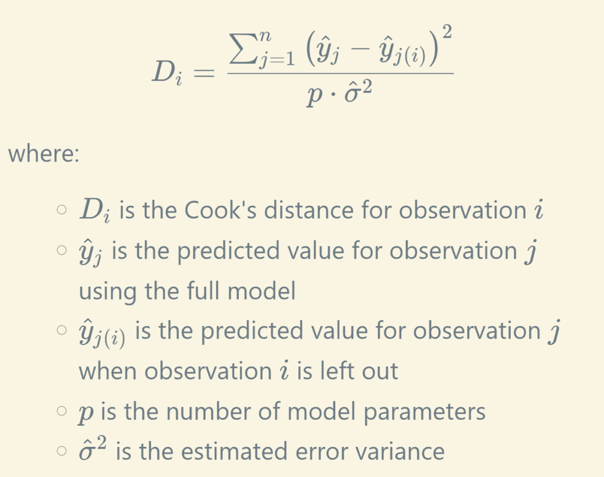
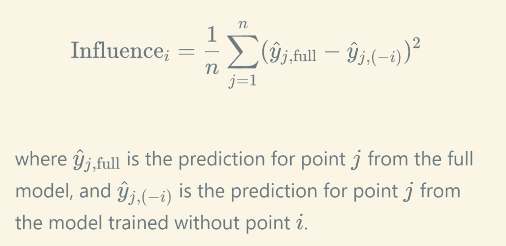
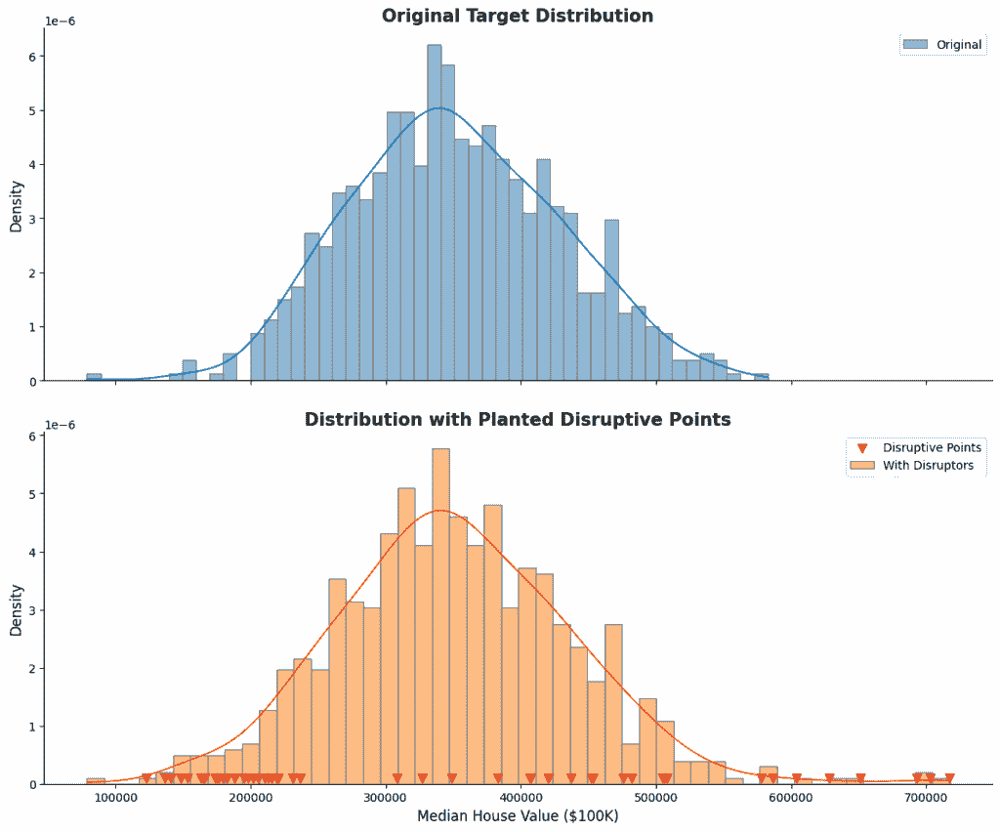
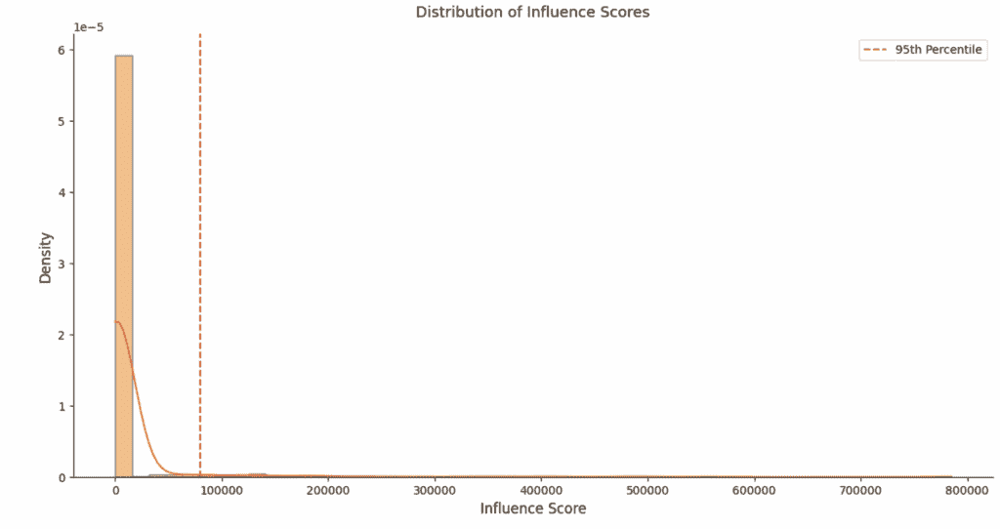
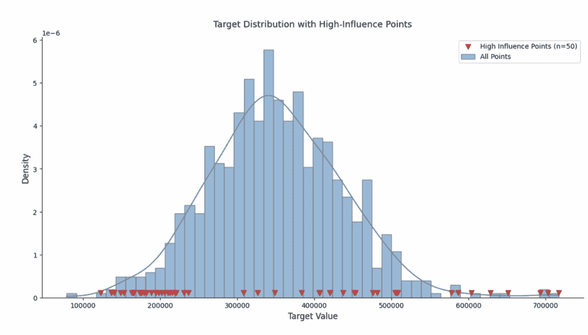
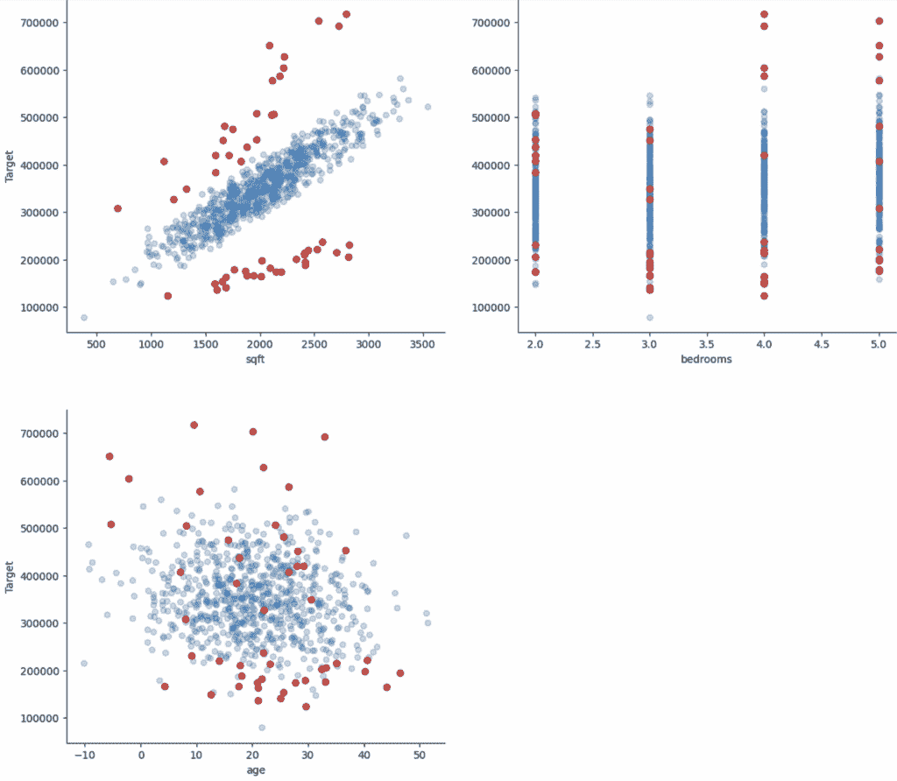
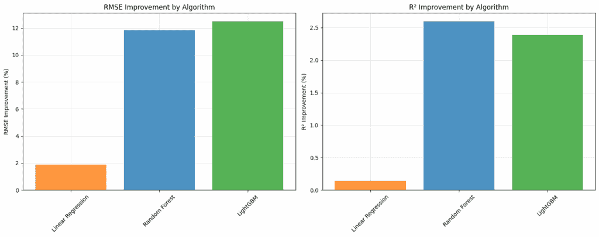

# 帮助您的模型学习真实信号

> 原文：[`towardsdatascience.com/help-your-model-learn-the-true-signal/`](https://towardsdatascience.com/help-your-model-learn-the-true-signal/)

<mdspan datatext="el1755662653859" class="mdspan-comment">**想象一下：** 你正在使用诸如收入和信用历史等特征来建模贷款违约风险。一些收入相对较低的借款人似乎能够很好地偿还大额贷款，这可能会误导模型。实际上，他们提交的收入是以美元而非当地货币计算的，但在数据录入时被忽略了，这使得他们看起来比实际信用度低。

或者你正在构建一个模型来预测患者的恢复时间。大多数患者遵循预期的恢复轨迹，但少数患者经历了非常罕见的并发症，这些并发症没有被记录。这些案例在症状、治疗和结果之间的关系上与其他案例相距甚远。它们不一定“错误”，但它们是**破坏性的**，导致模型对大多数未来患者的泛化效果不佳。

在这两种情况下，问题不仅仅是噪声或经典异常。问题更为微妙：

> **一些观察结果不成比例地破坏了模型学习主导信号的能力**。

这些数据点可能：

+   对学习到的参数**产生不成比例的影响**，

+   来自**不寻常或未建模的上下文**（例如，罕见的并发症或数据录入问题），

+   最重要的是，**降低模型泛化能力**。

模型的可信度和预测准确性可能会因为这些对模型参数或预测产生过度影响的数据点而受到严重影响。理解和有效管理这些有影响力的观察结果不仅仅是统计形式，而且是构建稳健可靠模型的基础。

**🎯 本文旨在实现的目标**

在本文中，我将向您介绍一种简单而强大的技术，**有效地识别和管理这些破坏性数据点**，以便模型能够更好地捕捉数据中的稳定、可泛化的模式。这种方法是**算法无关的**，可以直接适应您为您的用例选择的任何算法或分析框架。我还会提供完整的代码，以便您轻松实现。

听起来不错？让我们开始吧。

* * *

## 灵感：库克距离，重新构想

**库克距离**是线性回归中的一个经典诊断工具。它通过以下方式量化单个数据点对模型的影响：

+   在完整数据集上训练模型

+   重新训练时留出一个观察值

+   通过计算观察前后的回归模型中所有变化的和来衡量预测变化量，使用以下公式：



大的库克距离意味着观察值有高影响力，可能扭曲模型，因此应该检查其有效性。

## 为什么是库克 D？

库克-D 影响方法特别适合于识别扭曲模型学习模式的数据点，这是其他离群值检测技术经常留下的空白。

+   **单变量检测：**单变量方法（如 Z 分数或 IQR 规则）识别单个特征或目标变量中的极端值。然而，那些显著影响复杂模型预测的点，当单独检查每个特征时，可能看起来完全正常。它们是“离群值”，不是由于它们的个别值，而是由于它们与整体数据和模型结构的**关系**。

+   **特征聚焦异常检测：**诸如隔离森林或局部离群因子（LOF）等技术擅长仅基于输入特征（*X*）的分布和密度来检测异常。虽然对于识别异常数据条目很有价值，但它们本质上**不考虑目标变量（*Y*）的作用或模型如何使用特征来预测它**。因此，在特征空间中被标记为离群值的数据点可能并不一定会对模型预测性能或整体学习模式产生不成比例的影响。相反，未被这些方法标记的点可能仍然对模型的预测有高度影响。

+   **基于标准残差的常规方法：**残差，即实际值与预测值之间的差异，突出了模型表现不佳的地方。虽然这表明了偏差，但它无法区分该点是否仅仅是噪声（例如，不可预测但无害）或真正**破坏性**，即“拉动”模型的整个预测表面远离大多数数据建立的一般模式。我们可能有高残差但影响力小的点，或者有适度残差但不成比例地扭曲模型预测的点。

这正是库克-D 式影响度量真正发光的地方。它超越了预测误差的大小，进而询问：

> **一个数据点对整个模型学习关系的结构性破坏程度如何？**

这种方法使我们能够手术般地识别和管理那些不成比例地将模型预测拉离数据中“一般模式”的数据点。

当鲁棒性和泛化性至关重要且难以保证时，这一点尤为重要——例如，在诊断工具中，少数异常患者记录可能会对更广泛人群的预测产生偏差，或者在欺诈检测建模中，训练集中包含假阴性，因为并非每一笔交易或索赔都经过审计。

> **本质上，虽然其他方法帮助我们找到“奇怪”的数据，但库克（Cook）类似的方法帮助我们找到那些使我们的模型在整体行为上变得“奇怪”的数据点。**

* * *

## Cook D 的算法无关适应

尽管这种方法很强大，但它有其局限性：

+   原始公式仅直接适用于**普通最小二乘（OLS）**回归，

+   对于大型数据集，由于需要重复模型拟合，计算成本变得很高。

**但底层逻辑要广泛得多**。遵循 Cook 的想法，可以将这个基础概念扩展到任何机器学习算法。

## 指标

**核心思想**：本质上，这种方法询问：

> 🔬如果我们从训练集中移除单个数据点并重新训练模型，与包含该点时相比，所有数据点的预测变化了多少？

**超出 OLS 的扩展**：研究人员已经为其他环境开发了 Cook D 的修改版本。例如：

+   **广义 Cook 距离用于 GLM**（例如，逻辑回归，泊松回归），它从模型得分和信息矩阵的角度重新定义了杠杆和残差。

+   **Cook 距离用于线性混合模型**，它考虑了固定效应和随机效应。

**算法无关的方法**：在这里，我们旨在将 Cook 的核心原则适应于与任何机器学习模型一起工作，其工作流程如下：

+   **训练**所选模型（例如，LightGBM，随机森林，神经网络，线性回归等）在完整数据集上，并记录预测。

+   对于数据集中的每个数据点：

    +   **LOO（留一法）**：移除数据点以创建新的数据集。

    +   **重新训练**模型在这个减少的数据集上。

    +   **预测**原始数据集中所有观察到的结果。

    +   **测量**两组预测之间的差异。Cook 距离的直接类似物是预测的**均方差异**。



## 解决计算挑战

这个强大指标的限制之一是其计算成本，因为它需要*N*次完整的模型重新训练。对于大型数据集，这可能非常昂贵。

为了使该方法实用，我们可以做出**战略上的妥协**：而不是处理每个单独的观察值，我们可以关注数据点的子集。这些点可以根据它们在初始完整模型预测时的高绝对残差来选择。这有效地将计算密集型步骤集中在最可能的影响候选者上。

> 💡小贴士：将`max_loo_points`*(整数，可选)*参数添加到您的实现中。如果指定，则仅对这些数据点执行 LOO 计算。这提供了详尽性和计算效率之间的平衡。

## 智能检测影响点

一旦计算了影响分数，让我们识别需要进一步调查和管理的特定影响点。检测策略应根据我们是否处理完整数据集或子集（当`max_loo_points`被设置时）进行调整：

> 💡小贴士：将 `influence_outlier_method` 和 `influence_outlier_threshold` 参数添加到您的实现中，以便轻松指定每个用例最合适的检测方法。

**完整数据集分析**：

当分析完整数据集时，影响分数代表每个点对模型学习模式影响的全面图景。这使我们能够利用各种基于分布的检测方法：

+   **百分位数方法** (`influence_outlier_method="percentile"`)

    +   选择超过百分位数阈值的点

    +   示例：`threshold=95` 识别影响分数前 5%的点

    +   适用于：保持有影响力的点的比例一致

+   **Z 分数方法** (`influence_outlier_method="zscore"`):

    +   选择距离平均值超过 N 个标准差的点

    +   示例：`threshold=3` 标记距离平均值超过 3 个标准差的点

    +   适用于：正态或近似正态分布

+   **Top K 方法** (`influence_outlier_method="top_k"`):

    +   选择影响分数最高的 K 个点

    +   示例：`threshold=50` 选择 50 个最有影响力的点

    +   适用于：当你需要特定数量的点进行调查时。

+   **四分位数范围方法** (`influence_outlier_method="iqr"`):

    +   选择超过 Q3 + k * IQR 阈值的点

    +   示例：`threshold=1.5` 使用标准箱线图异常值定义

    +   适用于：对异常值稳健，与偏斜分布配合良好

+   **均值倍数方法** (`influence_outlier_method="mean_multiple"`):

    +   选择影响分数大于平均分数 N 倍的点

    +   示例：`threshold=3` 实现了文献中的建议（例如，[Tranmer, Murphy, Elliot, & Pampaka, 2020](https://hummedia.manchester.ac.uk/institutes/cmist/archive-publications/working-papers/2020/multiple-linear-regression.pdf))

    +   适用于：遵循已建立的统计惯例，尤其是在使用线性模型时

**子集分析**：

为了在大数据集上提高计算效率，我们可以指定一个 `max_loo_points` 值来分析点的子集：

+   **初始过滤**：

    +   使用绝对残差来识别 `n = max_loo_points` 个候选点

    +   只对这些候选者的影响分数进行评估

    +   剩余的点（具有较低的残差）隐式地被认为是非有影响力的

+   **可用方法**：

    +   **百分位数**：选择最高百分比的点（上限为 `max_loo_points`)

    +   **Top K**：选择 K 个最有影响力的点（K ≤ max_loo_points）

    +   注意：由于分数的预过滤性质，其他基于分布的方法（z 分数，IQR）在此不适用。

这种灵活的方法允许用户根据需要调查的具体点数选择最合适的检测方法。

+   数据集大小和计算约束

+   影响分数的分布特征

+   对调查点数的具体要求

## 诊断视觉

> 💡小贴士：应将影响观察值的检测视为调查的起点 🔍 而不是自动移除标准 🗑️

每个标记的点都应在特定用例的上下文中仔细检查。其中一些点可能是**高杠杆但有效**的异常现象的表示——移除它们可能会损害性能。其他可能是**数据错误或噪声**——这是我们想要过滤掉的。为了帮助决策有影响力的点，下面的代码提供了全面的诊断可视化，以支持调查：

+   **影响分数分布**

    +   显示所有点的影响分数分布

    +   突出显示用于标记有影响力点的阈值

    +   帮助评估有影响力的点是否是清晰的异常值或连续谱的一部分

+   **目标变量分布视图**

    +   展示目标变量的整体分布

    +   使用不同的标记突出显示有影响力的点

    +   帮助确定有影响力的点是否集中在特定的值范围内

+   **特征-目标关系**

    +   为每个特征与目标变量创建散点图

    +   自动适应分类特征的可视化

    +   突出显示有影响力的点以揭示潜在的特定特征模式

    +   帮助理解影响是否由特定的特征值或组合驱动

这些可视化可以指导几个关键决策：

+   是否将影响点视为需要移除的错误

+   是否在类似区域收集更多观测值，以便模型可以学习处理相关的有影响力点

+   是否影响模式表明存在潜在的数据质量问题

+   是否这些有影响力的点代表值得保留的有价值边缘情况

+   根据影响分数分布，对于此用例，最好的方法/阈值是什么来过滤掉有影响力的点。

总体而言，可视化诊断与领域专业知识相结合，使您能够更明智地决定如何处理特定上下文中的有影响力观测值。

* * *

## 源代码与演示

这种方法，包括上述讨论的所有功能，已经被`MLarena` Python 包实现为一个实用函数`calculate_cooks_d_like_influence`，在`stats_utils`模块中，源代码[可在 GitHub 上找到](https://github.com/MenaWANG/mlarena) 🔗。现在让我们看看这个函数的实际应用效果 😎。

## 带有内置破坏者的合成数据

我创建了一个房价的合成数据集，它是年龄、大小和卧室数量的函数，然后将其分为训练集（n=800）和测试集（n=200）。在下面的代码中，我在训练集中植入了 50 个破坏者，如下所示（演示的完整代码可在同一存储库中的[这个笔记本](https://github.com/MenaWANG/mlarena/blob/master/examples/5.case_cooks_like_influence_demo.ipynb)中找到）。

```py
# Plant different types of currency errors
n_disruptive = 50
for i, idx in enumerate(disruptive_indices):
    if i <= n_disruptive//2:  # Currency conversion error: prices too low 
        y_with_disruptors.iloc[idx] = y_with_disruptors.iloc[idx] * 0.5  # Much lower
    else:  # Currency conversion error: prices too high (different scale)
        y_with_disruptors.iloc[idx] = y_with_disruptors.iloc[idx] * 1.5  # Much higher
```



## 计算影响分数

现在，让我们计算训练集中所有观测值的影响分数。如上所述，`calculate_cooks_d_like_influence` 函数是一种算法无关的解决方案；它接受任何提供 `fit` 和 `predict` 方法的 sklearn 风格回归器。例如，在下面的代码中，我将 `LinearRegression` 作为估计器传递。

```py
from mlarena.utils.stats_utils import calculate_cooks_d_like_influence

influence_scores, influential_indices, normal_indices = calculate_cooks_d_like_influence(
    model_class = LinearRegression,
    X = X_with_disruptors,
    y = y_with_disruptors,
    visualize = True,
    influence_outlier_method = "percentile",
    influence_outlier_threshold = 95,  
    random_state = 42
)
```

在上面的代码中，我还将影响点检测的方法设置为 `percentile`。由于训练集包含 800 个样本，95% 的截止值给出了 40 个影响点。如下面的 ***影响分数分布*** 图所示，大多数观测值围绕较小的影響值聚集，但有一小部分具有较大的分数突出。这是预期的，因为我们故意在数据集中植入了 50 个干扰项。在仓库中链接的笔记本中可用的后续分析证实，前 50 个最有影响点与我们的 50 个植入的干扰项完全一致。🥂



下面的 ***目标分布*** 图中突出显示了前 5% 的高影响点。与我们的干扰项植入方式一致，只有其中一些观测值可以被认为是单变量异常值。



下面的散点图显示了每个特征与目标变量之间的关系，影响点用红色突出显示。这些诊断图是分析影响观测值并就其处理做出明智决策的强大工具，它通过促进关于关键问题的讨论而发挥作用，例如：

1.  这些点是否是罕见但有效的案例，应该保留以维护重要的边缘情况？

1.  这些点是否表明需要收集更多数据以更好地表示全范围场景的区域？

1.  这些点是否代表错误或异常值，如果去除它们，将有助于模型学习更通用的模式？



## 焦点搜索和算法轻松更改

接下来，让我们在另一个算法上测试这个函数，即 LightGBM 回归器。如下面的代码所示，您可以通过 `model_params` 参数轻松配置算法。

此外，通过设置 `max_loo_points`，我们可以通过仅关注最有希望的候选者来优化计算。例如，我们不必对所有的 800 个训练点进行留一法（LOO）分析，而是可以将函数配置为智能选择具有最高绝对残差的 200 个点。这有效地将搜索集中在“危险区域”，那里最有可能是影响点。

您也可以指定识别影响点的方法和阈值，以最适合您的用例。如下面的代码所示，我选择了 `top_k` 方法来根据影响分数识别 50 个最有影响点。

```py
model_params={'verbose': -1, 'n_estimators': 50}

influence_scores, influential_indices, normal_indices = calculate_cooks_d_like_influence(
    model_class = lgb.LGBMRegressor,
    X = X_with_disruptors,
    y = y_with_disruptors,
    visualize = True,
    max_loo_points = 200,  # Focus on top n high-residual points
    influence_outlier_method = "top_k",
    influence_outlier_threshold = 50,  
    random_state = 42,
    **model_params
)
```

## 使用清洗后的数据重新训练

在仔细调查有影响力的点之后，比如说您决定从训练集中移除它们并重新训练模型。下面是使用上面代码单元格中`calculate_cooks_d_like_influence`函数方便返回的`normal_indices`获取清洗过的训练集的代码。

```py
X_clean = X_with_disruptors.iloc[normal_indices]
y_clean = y_with_disruptors.iloc[normal_indices]
```

此外，如果您想检查清洗对不同算法的影响，您可以使用`MLarena`轻松地更换算法，如下所示。

```py
from mlarena import MLPipeline, PreProcessor

# Train model on the training set
pipeline = MLPipeline(
    model=lgb.LGBMRegressor(n_estimators=100, random_state=42, verbose=-1),
    # model = LinearRegression(), # swap algorithms easily
    # model = RandomForestRegressor(n_estimators=50, random_state=42), 
    preprocessor=PreProcessor()
)
pipeline.fit(X_train, y_train)

# Evaluate on test set
results = pipeline.evaluate(
    X_test, y_test
)
```

## 算法间的比较

我们可以轻松地将上述工作流程循环应用于受干扰和清洗过的训练集，以及不同的算法。请参阅以下图表中的性能比较。

在我们的演示中，线性回归由于合成数据的线性特性，主要显示出适度的改进。实际上，尝试不同的算法以找到最适合您用例的方法总是值得的。算法之间的实验或迁移不需要造成破坏；更多关于算法无关的机器学习工作流程，请参阅[这篇文章](https://towardsdatascience.com/build-algorithm-agnostic-ml-pipelines-in-a-breeze/) 🔗。



* * *

就这样，您有了可以方便地添加到您的机器学习工作流程中的辅助函数`calculate_cooks_d_like_influence`，用于识别有影响力的观测值。虽然我们的演示使用了故意植入干扰因素的合成数据，但现实世界的应用需要更加细致的调查。此函数提供的诊断可视化旨在促进对有影响力的点的仔细分析和有意义的讨论。

+   每个有影响力的点可能代表您领域中的一个有效边缘情况

+   有影响力的点中的模式可能揭示训练数据中的重要差距

+   移除或保留点的决定应基于领域专家知识和业务背景

🔬 将此函数视为一个**诊断工具**，它突出显示需要调查的区域，而不是作为一个自动的异常值移除机制。它的真正价值在于帮助您更好地理解数据，以便您的模型可以更好地学习和泛化 🏆。

* * *

我写关于数据、机器学习和人工智能解决问题的文章。您也可以在我的💼[LinkedIn](https://www.linkedin.com/in/mena-ning-wang/) | 😺[GitHub](https://github.com/MenaWANG) | 🕊️[Twitter/](https://x.com/mena_wang) 🤗上找到我。

* * *

除非另有说明，所有图像均由作者提供。
