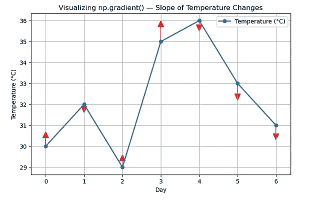

# NumPy 中的隐藏宝石：每个数据科学家都应该知道的 7 个函数

> 原文：[`towardsdatascience.com/hidden-gems-in-numpy-7-functions-every-data-scientist-should-know/`](https://towardsdatascience.com/hidden-gems-in-numpy-7-functions-every-data-scientist-should-know/)

<mdspan datatext="el1761024381571" class="mdspan-comment">我已经学习</mdspan>数据分析一年了。到目前为止，我可以自信地认为自己对 SQL 和 Power BI 很熟悉。转向 Python 的过程非常令人兴奋。我接触到了一些 neat 和更智能的数据分析方法。

在巩固了我的 Python 基础知识后，理想的下一步是开始学习一些 Python 数据分析库。NumPy 就是其中之一。作为一个数学狂热者，自然地，我会喜欢探索这个 Python 库。

这个库是为那些想使用 Python 进行数学计算的人设计的，从基本的数学和代数到高级概念如微积分。NumPy 几乎可以做到所有这些。

在这篇文章中，我想向您介绍一些我一直在尝试的 NumPy 函数。无论您是数据科学家、金融分析师还是研究狂热者，这些函数都会对您有很大帮助。无需多言，让我们开始吧。

## 样本数据集（用于整个示例）

在深入之前，我将定义一个小数据集，它将锚定所有示例：

```py
import numpy as np
temps = np.array([30, 32, 29, 35, 36, 33, 31])
```

使用这个小的温度数据集，我将分享 7 个使数组操作变得轻松的函数。

## 1. np.where()——向量化 If-Else

**在定义这个函数之前，先快速展示一下这个函数**

```py
arr = np.array([10, 15, 20, 25, 30])
indices = np.where(arr > 20)
print(indices)
```

**输出：**(array([3, 4]),)

`np.where`是一个基于条件的函数。当指定条件时，它输出满足该条件的索引/索引。

例如，在上面的例子中，指定了一个数组，并声明了一个 np.where 函数，用于检索数组元素大于 20 的记录。输出是 array([3, 4])，因为这将是满足该条件的位置/索引——即 25 和 30。

### 条件选择/替换

当您试图为满足您条件的结果定义自定义输出时，这也很有用。这在数据分析中经常使用。例如：

```py
import numpy as np
arr = np.array([1, 2, 3, 4, 5])
result = np.where(arr % 2 == 0, ‘even’, ‘odd’)
print(result)
```

**输出：**[‘odd’ ‘even’ ‘odd’ ‘even’ ‘odd’]

上面的例子试图检索偶数。检索后，调用一个条件选择/替换函数，为我们的条件添加一个自定义名称。如果条件为真，则替换为偶数，如果条件为假，则替换为奇数。

好吧，让我们将这个应用到我们的小数据集上。

**问题：将所有高于 35°C 的温度替换为 35（消除极端读数）。**

在现实世界的数据中，尤其是来自传感器、气象站或用户输入的数据，异常值相当常见——突然的峰值或不切实际的价值，这些价值并不现实。

例如，一个温度传感器可能会暂时出现故障，记录 42°C，而实际温度是 35°C。

在你的数据中留下这样的异常值可能会导致：

+   偏斜平均值 — 一个高值可能会将平均值向上拉。

+   扭曲的视觉呈现 — 图表可能会拉伸以适应几个极端点。

+   欺骗模型 — 机器学习算法对意外的范围很敏感。

**让我们来修复这个问题**

```py
adjusted = np.where(temps > 35, 35, temps)
```

**输出：array([30, 32, 29, 35, 35, 33, 31])** 

现在看起来好多了。仅用几行代码，我们就成功地修复了数据集中的不切实际异常值。

## 2. np.clip() — 保持值在范围内

在许多实际数据集中，值可能会超出预期范围，这可能是由于测量噪声、用户错误或缩放不匹配造成的。

例如：

+   一个温度传感器可能读取 -10°C，而最低可能值为 0°C。

+   模型输出可能会预测概率，如 1.03 或 -0.05，这是由于四舍五入造成的。

+   在对图像的像素值进行归一化时，一些值可能会超出 0-255。

这些“超出范围”的值可能看起来很小，但它们可以：

+   打断下游计算（例如，对数或百分比计算）。

+   导致不切实际的图表或伪影（尤其是在信号/图像处理中）。

+   扭曲归一化并使指标不可靠。

`np.clip()` 通过将数组中的所有元素约束在指定的最小和最大范围内，巧妙地解决了这个问题。它有点像在你的数据集中设置边界。

示例：

**问题：确保所有读数保持在 [28, 35] 范围内。**

```py
clipped = np.clip(temps, 28, 35)
clipped
```

**输出：array([30, 32, 29, 35, 35, 33, 31])** 

这里是它的作用：

+   任何低于 28 的值变为 28。

+   任何高于 35 的值变为 35。

+   其他所有值保持不变。

当然，这也可以用 `np.where()` 来完成，如下所示

`temps = np.where(temps < 28, 28, np.where(temps > 35, 35, temps))`

但我更愿意使用 np.clip()，因为它更干净、更快。

## 3. np.ptp() — 一行找出你的数据范围

`np.ptp()`（峰值到峰值）基本上显示了最大和最小元素之间的差异。

它基本上：

`np.ptp(a) == np.max(a) — np.min(a)`

但在一个干净、表达清晰的功能中。

这是它的工作原理

```py
arr = np.array([[1, 5, 2],
[8, 3, 7]])
# Calculate peak-to-peak range of the entire array
range_all = np.ptp(arr)
print(f”Peak-to-peak range of the entire array: {range_all}”)
```

因此，这将是我们最大值（8）减去最小值（1）。

**输出：整个数组的峰值到峰值范围：7**

那为什么这很有用呢？与平均值类似，了解你的数据变化程度通常同样重要。例如，在气象数据中，它显示了条件是稳定还是波动。

与分别调用 max() 和 min() 或手动相减相比，`np.ptp()` 使其更加简洁、易读和向量化，尤其是在计算多行或多列的范围时特别有用。

现在，让我们将此应用于我们的数据集。

**问题：这周温度变化了多少？**

```py
temps = np.array([30, 32, 29, 35, 36, 33, 31])
np.ptp(temps)
```

**输出：np.int64(7)**

这告诉我们温度在 29°C 到 36°C 的期间波动了 7°C。

## 4. np.diff() — 检测每日变化

`np.diff()` 是测量动量、增长或下降的最快方式。它基本上是计算数组中元素之间的差异。

为了给你描绘一幅图，如果你的数据集是一次旅行，`np.ptp()` 会告诉你总共走了多远，而 `np.diff()` 会告诉你每次停留之间的移动距离。

本质上：

**np.diff([a1, a2, a3, …]) = [a2 — a1, a3 — a2, …]**

让我们将这个应用到我们的数据集上。

**让我们再次看看我们的温度数据：**

```py
temps = np.array([30, 32, 29, 35, 36, 33, 31])
daily_change = np.diff(temps)
print(daily_change)
```

**输出：[ 2 -3 6 1 -3 -2]**

**在现实世界中，np.diff() 用于**

+   时间序列分析——追踪温度、销售或股价的每日变化。

+   信号处理——识别传感器数据中的峰值或突然下降。

+   数据验证——检测连续测量之间的跳跃或不一致性。

## 5. np.gradient() — 捕获平滑趋势和斜率

老实说，当我第一次遇到这个时，我觉得很难理解。但本质上，`np.gradient()` 计算数据点的数值梯度（变化的平滑估计），类似于 `np.diff()`，然而，`np.gradient()` 即使 x 值不均匀分布（例如，不规则的时戳）也能工作。它提供了一个更平滑的信号，使得趋势更容易从视觉上进行解释。

例如：

```py
time = np.array([0, 1, 2, 4, 7])
temp = np.array([30, 32, 34, 35, 36])
np.gradient(temp, time)
```

**输出：array([2.0, 2.0, 1.5, 0.43333333, 0.33333333])**

让我们稍微分析一下。

通常，`np.gradient()` 假设 x 值（你的索引位置）是均匀分布的——比如 0, 1, 2, 3, 4 等。但在上面的例子中，时间数组并不是均匀分布的：注意跳跃是 1, 1, 2, 3。这意味着温度读数并不是每小时都进行。

通过将时间作为第二个参数传递，我们实际上是在告诉 NumPy 在计算温度变化速度时使用实际的时间间隔。

为了解释上面的输出。它表示在 0-2 小时内，温度迅速上升（每小时约上升 2°C），而在 2-7 小时内，上升速度放缓至每小时约 0.3-1°C。

让我们将这个应用到我们的数据集上。

**问题：估计温度变化率（如斜率）。**

```py
temps = np.array([30, 32, 29, 35, 36, 33, 31])
grad = np.gradient(temps)
np.round(grad, 2)
```

**输出：array([ 2.0, -0.5, 1.5, 3.5, -1.0, -2.5, -2.0 ])**

你可以这样读：

+   +2 → 温度快速上升（早期预热）

+   -0.5 → 稍微下降（轻微降温）

+   +1.5, +3.5 → 强烈上升（大的热量跳跃）

+   -1, -2.5, -2 → 稳定的降温趋势

所以这讲述了本周的温度变化故事。让我们用 matplotlib 快速可视化一下。

注意如何轻松地解释可视化。这就是为什么 `np.gradient()` 非常有用的原因。



## 6. `np.percentile()` – 发现异常值或阈值

这是我最喜欢的函数之一。`np.percentile()` 帮助你检索数据的一部分或切片。NumPy 定义得很好。

> numpy.percentile **计算数据沿指定轴的第 q 百分位数**，其中 q 是介于 0 和 100 之间的百分比。

在 `np.percentile()` 中，通常有一个阈值需要满足（即 100%）。然后你可以回溯并检查低于此阈值的记录百分比。

让我们用销售记录试一试。

假设你的月销售目标是 60,000 美元。

你可以使用 np.percentile() 来了解你达到或未达到目标的频率和强度。

```py
import numpy as np
sales = np.array([45, 50, 52, 48, 60, 62, 58, 70, 72, 66, 63, 80])
np.percentile(sales, [25, 50, 75, 90])
```

输出：**[51.0 61.0 67.5 73.0]**

**为了分解：**

+   25% 分位数 = $51k → 25% 的月份收入低于 $51k（表现不佳）

+   50% 分位数 = $61k → 你的一半月份收入低于 $61k（大约是你的目标）

+   75% 分位数 = $67.5k → 表现最好的月份轻松超过目标

+   90% 分位数 = $73k → 你最好的几个月收入达到 $73k 或更多

> 所以现在你可以这样说：
> 
> “我们大约在所有月份的一半中达到了或超过了 $60k 的目标。”

这也可以用 KPI 卡来可视化。这非常强大。

这就是用数据讲故事的关键绩效指标。

让我们将其应用于我们的温度数据集。

```py
import numpy as np
temps = np.array([30, 32, 29, 35, 36, 33, 31])
np.percentile(temps, [25, 50, 75])
```

**输出：[30.5 32\. 34.5]**

这意味着：

+   25% 的读数低于 30.5°C

+   50%（中位数）低于 32°C

+   75% 低于 34.5°C

## `7\. np.unique()` — 快速查找唯一值及其计数

这个函数非常适合清理、总结或分类数据。`np.unique()` 找出你数组中的所有唯一元素。它还可以检查这些元素在你的数组中出现的频率。

例如，假设你有一个来自你商店的产品类别列表：

```py
import numpy as np
products = np.array([
‘Shoes’, ‘Bags’, ‘Bags’, ‘Hats’,
‘Shoes’, ‘Shoes’, ‘Belts’, ‘Hats’
])
np.unique(products)
```

**输出：array([‘Bags’, ‘Belts’, ‘Hats’, ‘Shoes’], dtype=’<U5′)**

你可以通过使用 return_counts 属性来计算它们出现的次数：

```py
np.unique(products, return_counts=True)
```

**输出：(array([‘Bags’, ‘Belts’, ‘Hats’, ‘Shoes’], dtype=’<U5′), array([2, 1, 2, 3])).**

让我们将其应用于我的温度数据集。目前，没有重复项，所以我们只会得到相同的输入。

```py
import numpy as np
temps = np.array([30, 32, 29, 35, 36, 33, 31])
np.unique(temps)
```

**输出：array([29, 30, 31, 32, 33, 35, 36])**

注意数字是如何相应地组织的，也是按升序排列的。

你也可以要求 NumPy 计算每个值出现的次数：

```py
np.unique(temps, return_counts=True)
```

**输出：(array([29, 30, 31, 32, 33, 35, 36]), array([1, 1, 1, 1, 1, 1, 1]))**

## 总结

到目前为止，这些都是我偶然发现的函数。我发现它们在数据分析中非常有帮助。NumPy 的美妙之处在于，你越玩它，就越能发现这些简短的一行代码，它们可以替代成页的代码。所以下次你在处理数据或调试一个混乱的数据集时，暂时远离 Pandas，尝试使用这些函数之一。感谢阅读！
