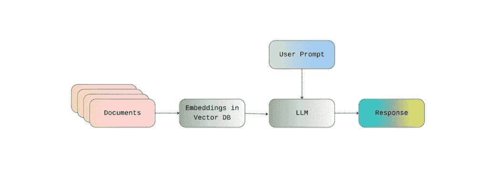
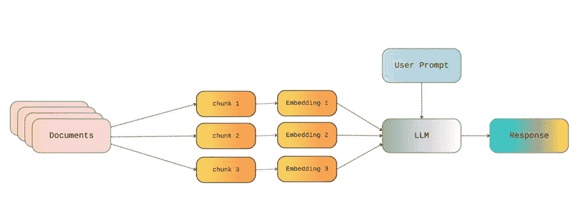
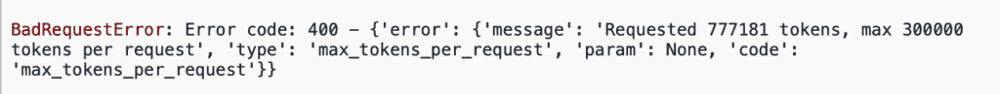
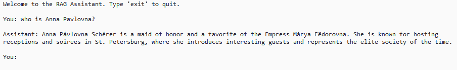

# Hitchhiker’s Guide to RAG: From Tiny Files to Tolstoy with OpenAI’s API and LangChain

> 原文：[`towardsdatascience.com/hitchhikers-guide-to-rag-from-tiny-files-to-tolstoy-with-openais-api-and-langchain/`](https://towardsdatascience.com/hitchhikers-guide-to-rag-from-tiny-files-to-tolstoy-with-openais-api-and-langchain/)

在我的最新文章中，[我向您展示了如何在 Python 中设置一个非常简单的 RAG 管道](https://towardsdatascience.com/hitchhikers-guide-to-rag-with-chatgpt-api-and-langchain/)，使用 OpenAI 的 API、LangChain 和您本地的文件。在那篇文章中，我介绍了使用 LangChain 从您的本地文件创建嵌入的基本知识，将它们存储在 FAISS 的向量数据库中，调用 OpenAI 的 API，并最终生成与您的文件相关的响应。🌟



图片由作者提供

尽管如此，在这个简单的例子中，我只演示了如何使用一个非常小的 .txt 文件。在这篇文章中，我进一步阐述了如何通过在过程中添加一个额外的步骤——**分块处理**——来利用更大的文件与您的 RAG 管道。

## 那么，分块处理呢？

分块处理是指将文本解析成更小的文本片段——分块，然后将这些分块转换成嵌入的过程。这一点非常重要，因为它使我们能够有效地处理和为更大的文件创建嵌入。所有嵌入模型都对传入文本的大小有限制——我稍后会详细介绍这些限制。这些限制允许我们获得更好的性能和低延迟的响应。如果提供的文本不满足这些大小限制，它将被截断或拒绝。

如果我们想要创建一个 RAG 管道，从列奥·托尔斯泰的 *[战争与和平](https://en.wikipedia.org/wiki/War_and_Peace)* 文本（一本相当大的书）中读取，我们就无法直接加载它并将其转换成一个单一的嵌入。相反，我们首先需要进行 *分块处理*——创建更小的文本块，并为每个块创建嵌入。每个块的大小低于我们使用的嵌入模型的大小限制，使我们能够有效地将任何文件转换为嵌入。因此，一个 *相对更现实* 的 RAG 管道景观可能如下所示：



图片由作者提供

有几个参数可以进一步自定义分块处理过程，以适应我们的特定需求。分块处理过程的一个关键参数是 *分块大小*，它允许我们指定每个分块的大小（以字符或标记为单位）。这里的技巧是我们创建的分块必须足够小，以便在嵌入的大小限制内进行处理，但同时也应该足够大，以包含有意义的信息。

例如，假设我们想要处理以下来自《战争与和平》的句子，其中安德烈公爵在思考战斗：


图片由作者提供

假设我们也创建了以下（相当小）的块：


图片由作者提供

然后，如果我们问类似“安德烈公爵所说的‘现在都一样’是什么意思？”这样的问题，我们可能得不到一个好的答案，因为块“但是难道现在不是都一样了吗？”他想。并不包含任何上下文，且模糊不清。相比之下，意义散布在多个块中。因此，尽管它与我们的问题相似并且可能被检索到，但它并不包含任何意义来产生相关的回答。因此，选择与我们所使用的 RAG 文档类型相符合的适当块大小，可以极大地影响我们得到的回答质量。一般来说，块的内容对于人类阅读来说应该是有意义的，无需其他信息，以便模型也能理解。最终，块大小存在一个权衡——块需要足够小以满足嵌入模型的大小限制，但又要足够大以保留意义。

• • •

另一个重要的参数是块重叠。这就是我们希望块之间有多少重叠。例如，在《战争与和平》的例子中，如果我们选择 5 个字符的块重叠，我们会得到以下这样的块。


图片由作者提供

这也是一个我们必须做出的非常重要的决定，因为：

+   较大的重叠意味着在嵌入创建上花费更多的调用和令牌，这意味着成本更高 + 速度更慢

+   较小的重叠意味着在块边界之间丢失相关信息的可能性更高

选择正确的块重叠很大程度上取决于我们想要处理的文本类型。例如，一本语言简单直接的食谱书可能不需要异国情调的块分割方法。另一方面，像《战争与和平》这样的经典文学作品，其中语言非常复杂，意义在不同段落和章节中相互关联，可能需要更深思熟虑的块分割方法，以便 RAG 能够产生有意义的成果。

• • •

但如果我们需要的只是一个简单的 RAG，它只需要在一个块中查找几个符合我们使用的嵌入模型大小限制的文档呢？我们是否还需要分块步骤，或者我们是否可以直接为整个文本创建一个单一的嵌入？简短的答案是，即使对于符合大小限制的知识库，始终进行分块步骤也是更好的选择。这是因为，实际上，在处理大型文档时，我们会面临[迷失在中间](https://direct.mit.edu/tacl/article/doi/10.1162/tacl_a_00638/119630/Lost-in-the-Middle-How-Language-Models-Use-Long)的问题——遗漏了包含在大型文档及其相应大型嵌入中的相关信息。

## 那些神秘的“大小限制”是什么？

通常，对嵌入模型的请求可以包括一个或多个文本块。我们需要为创建嵌入的文本大小及其处理考虑几种不同类型的限制。这些不同类型的限制值取决于我们使用的嵌入模型。更具体地说，这些是：

+   **块大小**，也称为每个输入的最大标记数，或上下文窗口。这是每个块的最大标记大小。例如，对于 OpenAI 的`text-embedding-3-small`嵌入模型，[块大小限制为 8,191 个标记](https://learn.microsoft.com/en-us/azure/ai-foundry/openai/concepts/models?tabs=global-standard%2Cstandard-chat-completions#embeddings-models)。如果我们提供的块大于块大小限制，在大多数情况下，它将被静默截断‼️（将创建一个嵌入，但仅限于满足块大小限制的第一部分），而不会产生任何错误。

+   **每个请求的块数**，或称为输入数。每个请求中可以包含的块数也有限制。例如，所有 OpenAI 的嵌入模型都有一个限制，即 2,048 个输入——也就是说，[每个请求最多可以有 2,048 个块。](https://learn.microsoft.com/en-us/azure/ai-foundry/openai/how-to/embeddings?tabs=console)

+   **每个请求的总标记数**：请求中所有块的标记总数也有限制。对于所有 OpenAI 的模型，[单个请求中所有块的总最大标记数为 300,000 个标记。](https://community.openai.com/t/max-total-embeddings-tokens-per-request/1254699)

那么，如果我们的文档超过 300,000 个标记会发生什么？正如你可能想象的那样，答案是，我们将创建多个连续/并行的请求，每个请求的标记数不超过 300,000。许多 Python 库在幕后自动执行此操作。例如，我在之前的帖子中使用的 LangChain 的`OpenAIEmbeddings`，它会自动将我们提供的文档分批，前提是文档已经以块的形式提供。

## 将更大的文件读入 RAG 管道

让我们看看在简单的 Python 示例中，所有这些是如何发挥作用的，我们使用*[战争与和平](https://www.gutenberg.org/cache/epub/2600/pg2600.txt)*文本作为 RAG 中的文档来检索。我使用的数据——列夫·托尔斯泰的*战争与和平*文本——是公共领域许可，可以在[Project Gutenberg](https://www.gutenberg.org/)找到。

首先，让我们尝试在不进行分块设置的情况下读取*战争与和平*文本。对于这个教程，你需要安装`langchain`、`openai`和`faiss`Python 库。我们可以轻松地按照以下方式安装所需的包：

```py
pip install openai langchain langchain-community langchain-openai faiss-cpu
```

在确保所需的库已安装后，我们非常简单的 RAG 代码如下，并且对于`text_folder`中的小型简单.txt 文件运行良好。

```py
from openai import OpenAI 

# Chat_GPT API key 
api_key = "your key" 

# initialize LLM
llm = ChatOpenAI(openai_api_key=api_key, model="gpt-4o-mini", temperature=0.3)

# initialize embeddings model
embeddings = OpenAIEmbeddings(openai_api_key=api_key)

# loading documents to be used for RAG 
text_folder = "RAG files"  

documents = []
for filename in os.listdir(text_folder):
    if filename.lower().endswith(".txt"):
        file_path = os.path.join(text_folder, filename)
        loader = TextLoader(file_path)
        documents.extend(loader.load())

# create vector database w FAISS 
vector_store = FAISS.from_documents(documents, embeddings)
retriever = vector_store.as_retriever()

def main():
    print("Welcome to the RAG Assistant. Type 'exit' to quit.\n")

    while True:
        user_input = input("You: ").strip()
        if user_input.lower() == "exit":
            print("Exiting…")
            break

        # get relevant documents
        relevant_docs = retriever.invoke(user_input)
        retrieved_context = "\n\n".join([doc.page_content for doc in relevant_docs])

        # system prompt
        system_prompt = (
            "You are a helpful assistant. "
            "Use ONLY the following knowledge base context to answer the user. "
            "If the answer is not in the context, say you don't know.\n\n"
            f"Context:\n{retrieved_context}"
        )

        # messages for LLM 
        messages = [
            {"role": "system", "content": system_prompt},
            {"role": "user", "content": user_input}
        ]

        # generate response
        response = llm.invoke(messages)
        assistant_message = response.content.strip()
        print(f"\nAssistant: {assistant_message}\n")

if __name__ == "__main__":
    main()
```

但是，如果我在同一个文件夹中添加*战争与和平* .txt 文件，并尝试直接为其创建嵌入，我会得到以下错误：



图片由作者提供

哎呀 🙃

那么，这里发生了什么？LangChain 的`OpenAIEmbeddings`无法将文本分割成小于 300,000 个标记的单独迭代，因为我们没有以分块的形式提供它。它没有分割分块，这个分块有 777,181 个标记，导致请求超过了每次请求 300,000 个标记的最大限制。

• • •

现在，让我们尝试设置分块过程，从这个大文件中创建多个嵌入。为此，我将使用 LangChain 提供的`text_splitter`库，更具体地说，是`RecursiveCharacterTextSplitter`。在`RecursiveCharacterTextSplitter`中，分块大小和分块重叠参数是以字符数指定的，但其他分块器，如`TokenTextSplitter`或`OpenAITokenSplitter`，也允许将这些参数设置为标记数。

因此，我们可以设置一个文本分割器的实例如下：

```py
splitter = RecursiveCharacterTextSplitter(chunk_size=1000, chunk_overlap=100)
```

…然后使用它来分割我们的初始文档成块…

```py
split_docs = []
for doc in documents:
    chunks = splitter.split_text(doc.page_content)
    for chunk in chunks:
        split_docs.append(Document(page_content=chunk))
```

…然后使用这些分块来创建嵌入…

```py
documents = split_docs

# create embeddings + FAISS index
vector_store = FAISS.from_documents(documents, embeddings)
retriever = vector_store.as_retriever()

.....
```

… 哇哦 🌟

现在代码可以有效地解析提供的文档，即使它稍微大一点，也能提供相关的响应。



图片由作者提供

## 在我心中

选择适合我们想要输入 RAG 管道的文档大小和复杂性的分块方法对于我们将收到的响应质量至关重要。当然，还有其他几个参数和不同的分块方法需要考虑。不过，理解和微调分块大小和重叠是构建产生有意义结果的 RAG 管道的基础。

• • •

*喜欢这篇帖子吗？*有一个有趣的数据或 AI 项目？**

*让我们成为朋友！加入我吧* 

**📰***[Substack](https://datacream.substack.com/)*** 💌* **[Medium](https://medium.com/@m.mouschoutzi)*** 💼***[LinkedIn](https://www.linkedin.com/in/mariamouschoutzi/)*** ☕***[Buy me a coffee](http://buymeacoffee.com/mmouschoutzi)!*****

• • •
