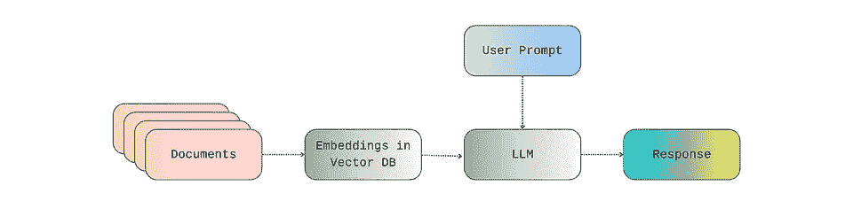
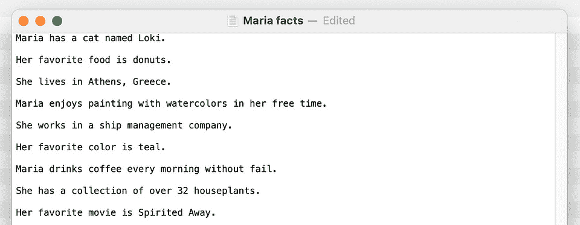
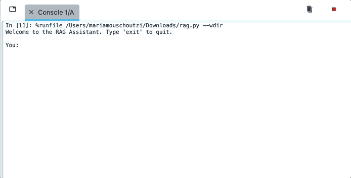
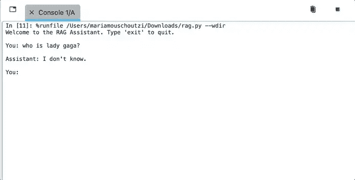

# 使用 ChatGPT API 和 LangChain 的 RAG 的旅行者指南

> 原文：[`towardsdatascience.com/hitchhikers-guide-to-rag-with-chatgpt-api-and-langchain/`](https://towardsdatascience.com/hitchhikers-guide-to-rag-with-chatgpt-api-and-langchain/)

<mdspan datatext="el1750879903177" class="mdspan-comment">如今，大型语言模型可以轻松地根据一般知识生成大量的文字和回应，但当我们需要准确和具体的知识答案时会发生什么呢？仅仅基于生成模型的模型往往难以在特定领域的问题上提供答案，原因有很多；可能它们训练的数据现在已经过时，可能我们要求的是非常具体和专业的，可能我们希望得到的回应要考虑到个人或公司数据，而这些数据并不公开… 🤷‍♀️ 列表还可以继续下去。

那么，我们如何利用生成式 AI 同时保持我们的回应准确、相关且接地气呢？对这个问题的好答案是[检索增强生成（RAG）](https://en.wikipedia.org/wiki/Retrieval-augmented_generation)框架。RAG 是一个由两个关键组件组成的框架：检索和生成（duh！）。与仅基于特定数据预训练的生成模型不同，RAG 增加了一个检索步骤，允许我们从外部来源（如数据库或文档）向模型推送更多信息。换句话说，RAG 管道允许提供连贯且自然的回应（由生成步骤提供），这些回应也是事实准确的，并且基于我们选择的某个知识库（由检索步骤提供）。

> 🍨*[**DataCream**](https://datacream.substack.com/) 是一个提供关于 AI、数据、技术的故事和教程的通讯。如果您对这些主题感兴趣，**[在此订阅](https://datacream.substack.com/)**。

以这种方式，RAG 可以成为在需要高度专业数据的应用中极具价值的工具，例如客户支持、法律咨询或技术文档。RAG 的一个典型应用示例是客户支持聊天机器人，根据公司的支持文档和常见问题解答数据库回答客户问题。另一个例子是具有广泛故障排除指南的复杂软件或技术产品。另一个例子是法律咨询——RAG 模型将访问和检索来自法律图书馆、先前案例或公司指南的定制数据。例子真的很多；然而，在这些所有情况下，访问外部、具体且与上下文相关的数据使模型能够提供更精确和准确的回应。

因此，在这篇文章中，我将向您展示如何在 Python 中构建一个简单的 RAG 管道，利用 ChatGPT API、LangChain 和 FAISS。

## 那么，RAG 是什么呢？

从更技术性的角度来看，RAG 是一种通过向 LLM 注入额外的、特定领域的知识来增强 LLM 响应的技术。本质上，RAG 允许模型在形成响应时也考虑额外的外部信息——比如食谱书、技术手册或公司的内部知识库。

这非常重要，因为它允许我们消除 LLM 固有的许多问题，例如：

+   [幻觉](https://en.wikipedia.org/wiki/Hallucination_%28artificial_intelligence%29)——编造事物

+   信息过时——如果模型没有在最近的数据上训练

+   透明度——不知道响应来自哪里

为了使这成为可能，首先将外部文档处理成向量嵌入并存储在向量数据库中。然后，当我们向 LLM 提交提示时，任何相关的数据都会从向量数据库中检索出来，并连同我们的提示一起传递给 LLM。因此，LLM 的响应是通过考虑我们的提示和向量数据库中存在的任何相关信息形成的。这样的向量数据库可以托管在本地或云端，使用像[Pinecone](https://www.pinecone.io/)或[Weaviate](https://github.com/weaviate/weaviate)这样的服务。



作者提供的图片

## 那么，ChatGPT API、LangChain 和 FAISS 如何？

构建 RAG 管道的第一个组件是生成响应的 LLM 模型。这可以是任何 LLM，例如 Gemini 或 Claude，但在这篇博文中，我将使用 OpenAI 的 ChatGPT 模型，通过他们的[API 平台](https://openai.com/api/)。为了使用他们的 API，我们需要登录并获取 API 密钥。我们还需要确保安装了相应的 Python 库。

```py
pip install openai
```

构建 RAG 的另一个主要组件是处理外部数据——从文档中生成嵌入并将它们存储在向量数据库中。执行此类任务最流行的框架是[LangChain](https://www.langchain.com/langchain)。特别是，LangChain 允许：

+   加载并从各种文档类型（PDF、DOCX、TXT 等）中提取文本

+   将文本分割成适合生成嵌入的块

+   生成向量嵌入（在本篇博文中，借助 OpenAI 的 API）

+   通过向量数据库如[FAISS](https://github.com/facebookresearch/faiss)、[Chroma](https://www.trychroma.com/)和[Pinecone](https://www.pinecone.io/)存储和搜索嵌入

我们可以轻松地通过以下方式安装所需的 LangChain 库：

```py
pip install langchain langchain-community langchain-openai
```

在这篇博文中，我将使用 LangChain 与 Facebook AI Research 开发的本地向量数据库[FAISS](https://github.com/facebookresearch/faiss)一起。FAISS 是一个非常轻量级的包，因此适合构建简单的/小型 RAG 管道。它可以轻松安装，如下所示：

```py
pip install faiss-cpu
```

## 将所有内容整合在一起

因此，总的来说，我将使用：

+   使用 OpenAI 的 API 作为 LLM 的 ChatGPT 模型

+   LangChain，结合 OpenAI 的 API，用于加载外部文件、处理它们并生成向量嵌入

+   使用 FAISS 生成本地向量数据库

我将用于此帖子的 RAG 管道的输入文件是一个包含关于我的事实的文本文件。这个文本文件位于“RAG 文件”文件夹中。



现在我们已经设置好了，我们可以通过指定我们的 API 密钥和初始化我们的模型来开始：

```py
from openai import OpenAI # Chat_GPT API key api_key = "your key" 

# initialize LLM 
llm = ChatOpenAI(openai_api_key=api_key, model="gpt-4o-mini", temperature=0.3)
```

然后，我们可以加载我们想要用于 RAG 的文件，生成嵌入，并将它们作为向量数据库存储如下：

```py
# loading documents to be used for RAG 
text_folder = "rag_files"  

all_documents = []
for filename in os.listdir(text_folder):
    if filename.lower().endswith(".txt"):
        file_path = os.path.join(text_folder, filename)
        loader = TextLoader(file_path)
        all_documents.extend(loader.load())

# generate embeddings
embeddings = OpenAIEmbeddings(openai_api_key=api_key)

# create vector database w FAISS 
vector_store = FAISS.from_documents(documents, embeddings)
retriever = vector_store.as_retriever()
```

最后，我们可以将所有内容封装在一个简单的 Python 可执行文件中：

```py
def main():
    print("Welcome to the RAG Assistant. Type 'exit' to quit.\n")

    while True:
        user_input = input("You: ").strip()
        if user_input.lower() == "exit":
            print("Exiting…")
            break

        # get relevant documents
        relevant_docs = retriever.get_relevant_documents(user_input)
        retrieved_context = "\n\n".join([doc.page_content for doc in relevant_docs])

        # system prompt
        system_prompt = (
            "You are a helpful assistant. "
            "Use ONLY the following knowledge base context to answer the user. "
            "If the answer is not in the context, say you don't know.\n\n"
            f"Context:\n{retrieved_context}"
        )

        # messages for LLM 
        messages = [
            {"role": "system", "content": system_prompt},
            {"role": "user", "content": user_input}
        ]

        # generate response
        response = llm.invoke(messages)
        assistant_message = response.content.strip()
        print(f"\nAssistant: {assistant_message}\n")

if __name__ == "__main__":
    main()
```

注意系统提示是如何定义的。本质上，系统提示是给 LLM（大型语言模型）的一个指令，它设置了在用户交互之前助手的行为了、语气或约束。例如，我们可以设置系统提示，让 LLM 提供像与 4 岁孩子或火箭科学家交谈一样的回应——在这里，我们要求只基于我们提供的‘*Maria 事实*’来提供回应

那么，让我们看看我们煮了些什么！ 🍳

首先，我提出一个问题，这个问题与提供的外部数据源无关，以确保模型在形成回应时只使用提供的数据源，而不是一般知识。



[](https://substackcdn.com/image/fetch/$s_!22PH!,f_auto,q_auto:good,fl_progressive:steep/https%3A%2F%2Fsubstack-post-media.s3.amazonaws.com%2Fpublic%2Fimages%2F49a603c2-239b-4db3-b363-770cf0599584_694x352.gif) …然后我针对我提供的文件中的具体内容提出了一些问题…



✨✨✨✨

## 在我心中

显然，这是一个非常简单的 RAG 设置示例——在将其应用于实际商业环境时，还有许多其他因素需要考虑，例如数据处理的安全问题，或者处理更大、更真实的知识库和增加的令牌使用时的性能问题。尽管如此，我相信 OpenAI 的 API 真正令人印象深刻，并为构建定制、特定上下文的 AI 应用提供了巨大的、尚未开发的潜力。

* * *

*喜欢这篇帖子？让我们成为朋友！加入我*

**📰***[Substack](https://datacream.substack.com/)*** 💌* **[Medium](https://medium.com/@m.mouschoutzi)*** 💼***[LinkedIn](https://www.linkedin.com/in/mariamouschoutzi/)*** ☕***[Buy me a coffee](http://buymeacoffee.com/mmouschoutzi)!*****
