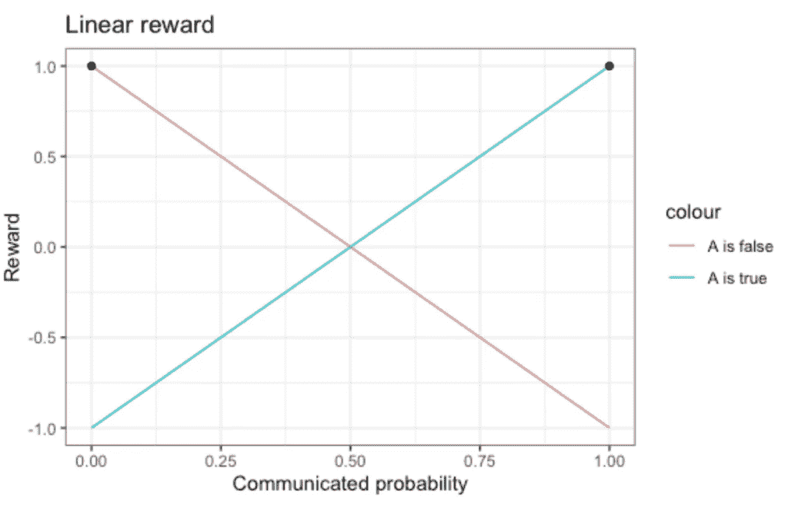
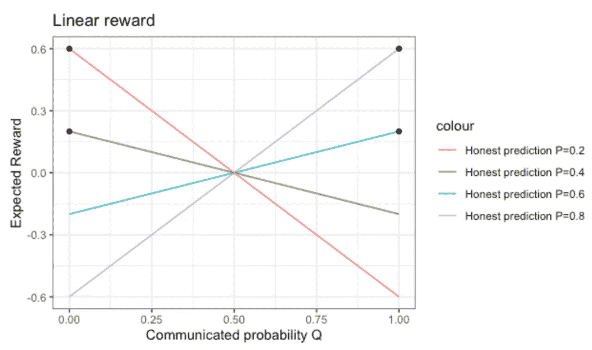
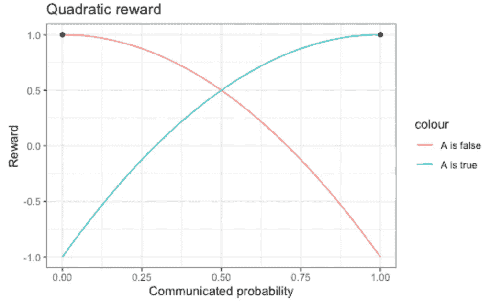
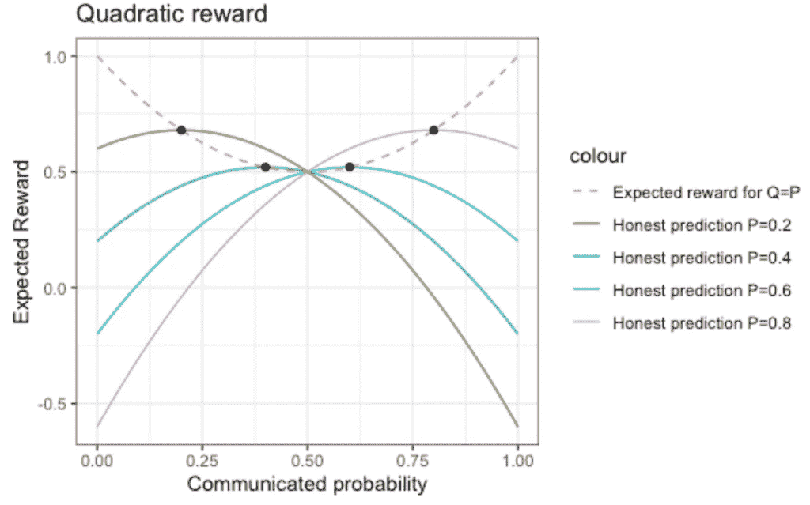
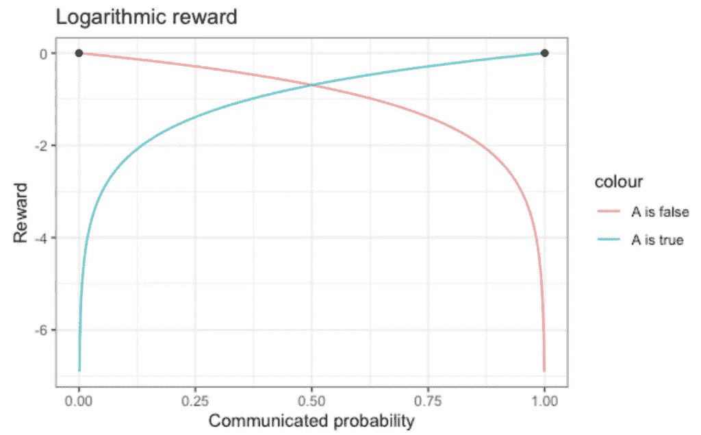
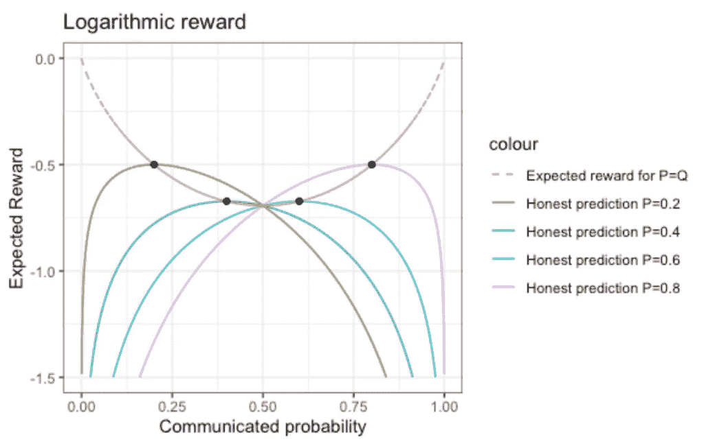
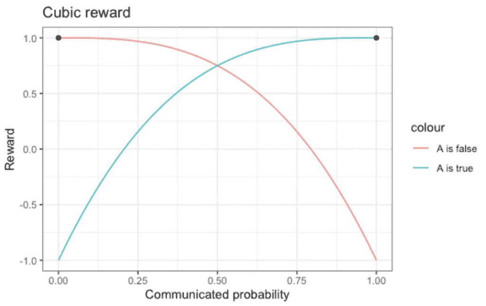
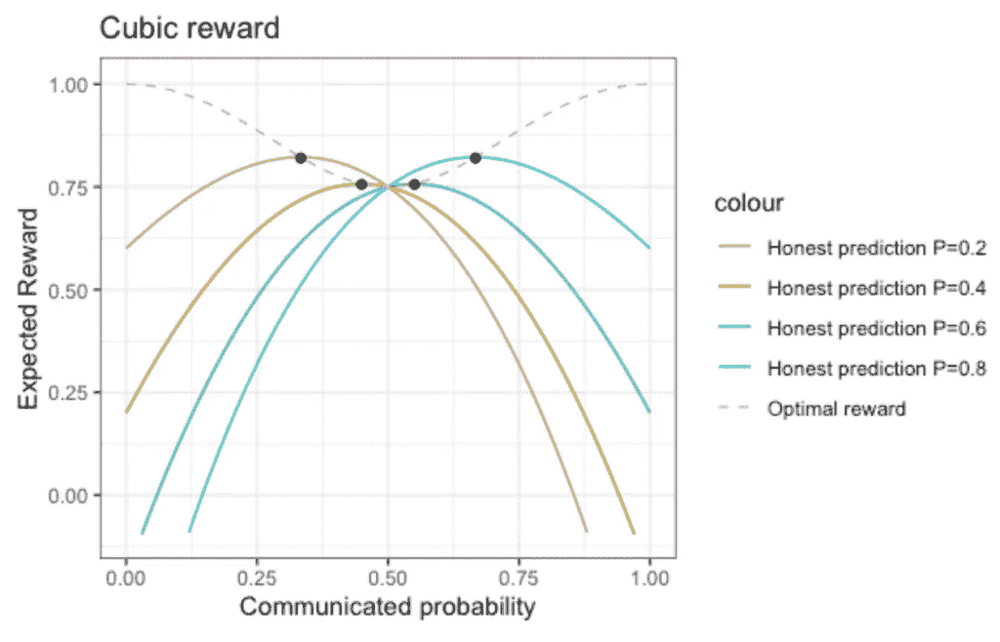
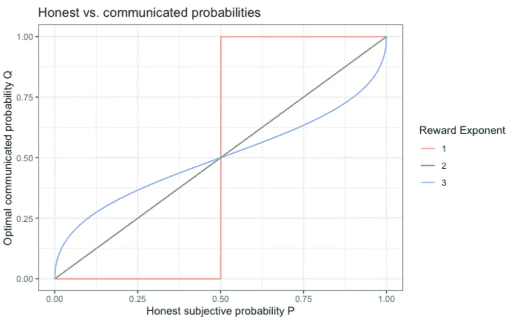

# 诚实地不确定

> 原文：[`towardsdatascience.com/honestly-uncertain/`](https://towardsdatascience.com/honestly-uncertain/)

**抛开伦理问题不谈，当被问及你对某个信念的确定性时，你应该诚实吗？当然，*这取决于*。在这篇博客文章中，你将了解到这一点。**

+   评估概率预测的不同方式伴随着“最佳诚实度”的显著不同程度。

+   令人惊讶的是，将线性函数分配给真实且完全自信的陈述为+1，承认无知为 0，错误但完全自信的陈述为-1，这种激励会导致夸张、不诚实的勇敢行为。如果你这样评估预测，你将周围都是自以为是的傻瓜，并遭受严重校准的机器预测的困扰。

+   如果你希望人们（或机器）给出真正无偏和不诚实的评估，你的评分函数应该对自信但错误的信念的惩罚比对自信正确的信念的奖励更强。

## **概率问答游戏**

大卫·斯皮格尔哈特（David Spiegelhalter）的新书（截至 2025 年）——“*不确定的艺术*”——这是一本每个处理概率及其传播的人都必须阅读的书，其中包含一个关于评分规则的简短部分。斯皮格尔哈特引导读者了解二次评分规则，并简要提到线性评分规则会导致不诚实的行为。我在这篇博客文章中详细阐述了这一点。

让我们设定场景：就像在许多其他场景和悖论中一样，你发现自己在一个电视节目中（是的，这是一个多么老式的开场方式）。你有机会回答关于常识的问题并赢得一些现金。你被问到的是是/否问题，以二进制方式表达，例如：*法国的面积是否大于西班牙的面积？玛丽·居里是否比阿尔伯特·爱因斯坦出生得早？蒙特利尔的居民是否比京都的多？*

根据你的背景，这些问题对你来说可能很明显，或者可能很难。无论如何，你都会有一个主观的“*最佳猜测*”，以及一定程度的确定性。例如，我对第一个问题感到很自在，对第二个问题稍微不那么自在，我已经忘记了第三个问题的答案，尽管我查过它来构建这个例子。你可能会体验到相似程度的自信，或者非常不同的自信。当然，确定性的程度是主观的。

问卷的转折点：你不需要像在多项选择题中那样给出二元的肯定/否定答案，而是要诚实地传达你的信念程度，也就是说，产生你个人分配给“是”的答案的概率。数字 0 意味着“绝对不是”，1 表示“绝对肯定”，0.5 反映了与公平硬币投掷相对应的不确定性程度——你完全没有头绪。让我们称***P(A)***为你对陈述***A***为真的真实主观信念。这个概率可以取 0 到 1 之间的任何值，而***A***必然是***要么***0 要么 1。然后你可以传达这个数字，但你不一定必须这样做，所以我们称**Q(A)**为你在那次问卷中最终表达的概率。

通常，并非每个概率表达式***Q***都会引起同样的兴奋，因为人类通常不喜欢不确定性。我们更愿意接受给出“99.99%”或“0.01%”概率的专家，他们预测某事发生或不发生的可能性，并且我们相当重视他们，而那些给出“25%”和“75%”*可能*评估的专家则不太受欢迎。从理性角度来看，更有信息的概率（“精确预测”，接近 0 或接近 1）比无信息的概率（“不精确预测”，接近 0.5）更有利。然而，一个适度但真实的预测仍然比一个大胆但不可靠的预测更有价值，后者会让你孤注一掷。因此，我们应该确保人们不要对自己的信念程度撒谎，以确保真正有 99%的“99%-肯定”预测是真实的，12%的“12%-肯定”，等等。考官如何确保这一点呢？

## 线性评分规则

判断概率陈述最直接的方法可能是使用线性评分规则：在最佳情况下，你非常自信且正确，这意味着***Q(A)=P(A)*=1**，且**A**为真，或者***Q(A)=P(A)*=0**，且**A**为假。然后我们将分数**+1=r(Q=1, A=1)=r(Q=0, A=0)**加到总分上。在最坏的情况下，你非常自信，但错了；也就是说，***Q(A)=P(A)*=1**，而***A***为假，或者***Q(A)=P(A)*=0**，而***A***为真。在这种情况下，我们从分数中减去-**1=r(Q=1, A=0)=r(Q=0, A=1)**。在这两个极端情况之间，我们画一条直线。当你通过***Q(A)*=0.5**表达最大不确定性时，我们得到**0=r(Q=0.5, A=1)=r(Q=0.5, A=0)**，既不加也不减。

这个线性奖励函数的功能形式并不特别引人注目，但它在以下情况下的可视化将很有用：

线性评分函数：当你非常确定你的真实信念时，你会得到+1 的奖励，当你同样确定一个错误的信念时，你会被减去-1 的分数，当你公开无知且 Q=0.5 时，你既不会得到奖励也不会受到惩罚。图片由作者提供。

没有惊喜：如果***A***是真的，你能做的最好的事情就是传达“**Q=1**”，如果***A***是假的，最好的策略就是产生“**Q=0**”。这就是黑色圆点所表示的：它们指向奖励函数对于特定真相值的最大值。这是一个良好的开端。

但你通常并不绝对确定答案是否是“*是的，A 是真的*”或“*不，A 是假的*”，你只有一种主观的直觉。那么你应该怎么做？你应该只是诚实并传达你的真实信念，例如***P*=0.7**或***P*=0.1**？

让我们把道德放在一边，考虑我们想要最大化的奖励。结果发现，你不应该诚实。**通过线性评分规则评估时，你应该撒谎，当***P*(A)*<0.5***时传达***Q*(A)*=0**，当***P*(A)*>0.5***时传达***Q*(A)*=1**。

为了看到这个令人惊讶的结果，让我们计算奖励函数的期望值，假设你的信念在平均上是正确的（认知心理学教给我们，这首先是一个不切实际的乐观假设，我们将在下面回到这一点）。也就是说，我们假设在你说的***P*=0.7***的大约 70%的情况下，真正的答案是“*是的，A 是真的*”，在你说的***P*=0.25***的大约 75%的情况下，真正的答案是“*不，A 是假的*”。因此，期望奖励***R(P, Q)***是诚实主观概率***P***和传达的概率***Q***（即加权奖励***r(Q, A=1)***和***r(Q, A=0)***的和）的函数：

***R(P, Q) = P * r(Q, A=1) + (1-P) * r(Q, A=0)***

下面是针对诚实主观概率***P***的四个不同值得到的结果 ***R(P,Q)***：

期望奖励作为诚实和传达概率 P 和 Q 的函数。图由作者提供。

长期可达到的最大奖励不再总是 1，但它被***2|P-*0.5*|***所限制——无知是有代价的。显然，最好的策略是在***P>0.5***时自信地传达***Q=*1**，当***P*<0.5***时传达同样自信的***Q*=0**——**看看图中的黑色圆点在哪里。

> 在线性评分规则下，当事件发生比不发生的可能性更大时——假装你绝对确信它会发生。当事件不发生的可能性略大时——大胆宣称“那永远不会发生”。你有时会犯错，但平均来看，大胆比诚实更有利。

更糟糕的是：当你对结果一无所知，没有任何想法，你的主观信念是***P***=0.5 时会发生什么？那么你可以安全地传达这一点，或者你可以冒险传达**Q=1**或**Q=0**——期望值是相同的。

如果发现这是一个令人不安的结果：线性奖励函数会让人们孤注一掷！作为预测消费者，无法区分 51%的轻微倾向与“相当可能”的信念 95%或几乎确定的 99.9999999%。在那个问答中，聪明的玩家总是会孤注一掷。

更糟糕的是，生活中许多情况奖励无支持的自信胜过深思熟虑和细致的评估。谨慎地说，并不是很多人因为明显夸大的声明而受到严厉的制裁…

问答节目是一回事，但显然，当人们在评估诸如地震、战争和灾难等严重且戏剧性事件的风险时被迫不传达他们真正的信念程度时，这显然是个大问题。

我们如何让他们诚实（在人的情况下）或[校准](https://medium.com/@maltetichy/calibration-and-sharpness-fd8270b71f07)（在机器的情况下）？

## **惩罚自信的错误：二次评分规则**

如果某位专家估计某件事情发生的概率为**P**=55%，我希望这位专家传达**Q**=55%，而不是**Q**=100%。为了使概率对我们的决策有任何价值，它们应该反映真正的信念水平，而不是机会主义优化后的值。

统计学家通过**适当**的评分规则将这一合理的请求形式化：适当的评分规则是激励预报者传达他们真实信念程度的规则；当传达的概率校准时，即预测事件以预测的频率实现时，它是最大化的。起初，可能会有人质疑这样的评分规则是否真的存在。幸运的是，它确实存在！

一种适当的评分规则是**二次评分规则**，也称为**Brier 评分**。对于极端的传达概率（**Q**=1，**Q**=0），其值与线性评分规则相同，但我们不在这两点之间画直线，而是画一个抛物线。通过这样做，我们奖励诚实的无知：传达概率为**Q**=0.5 时，奖励+0.5。

二次奖励作为结果 A 和传达概率 Q 的函数。图片由作者提供。

这个奖励函数是不对称的：当你将你的信心从**Q**=0.95 提高到**Q**=0.98（且**A**为真）时，奖励函数仅略有增加。另一方面，当**A**为假时，同样的信心增加倾向错误的结果会显著降低奖励。显然，二次奖励因此促使人们比线性奖励更加谨慎。但这样做足以让人们诚实吗？

为了看到这一点，让我们计算二次奖励作为真实诚实概率**P**和传达概率**Q**的函数的期望值，就像我们在线性情况中所做的那样：

**R(P, Q) = P * r(Q, A=1) + (1-P) * r(Q, A=0)***

对于不同诚实概率 P 的值，结果期望奖励在下一张图中显示：

图片由作者提供。

现在，曲线的极大值正好位于**Q=P**的点，这使得正确策略是诚实地传达自己的概率**P**。夸张的自信和过度的谨慎都会受到惩罚。当然，如果你一开始就知道得更多，你将能够做出更尖锐、更有自信的陈述（更接近 1 或 0 的预测**Q=P**）。但诚实的无知现在会得到+0.5 的奖励。宁为安全，不为后悔。

我们从中学到了什么？通过诚实地传达的概率最大化的奖励对“惊喜”（**Q**<0.5 且事件实际上是真实的，或**Q**>0.5 且事件实际上是虚假的）进行了相当强的制裁。当你错误地倾向于（**Q**>0.5 或**Q**<0.5）时，你失去的比你正确时赢得的要多。同时，不知道并诚实地承认这一点会得到一个不可忽视的价值。

## 对数奖励

二次奖励函数并不是唯一奖励诚实的函数（有无限多个适当的评分规则）：对数奖励通过对自信错误（**P**=0，但事实是“*是的，***A**** 是真的*”；**P**=1，但事实是“*不，****A**** 是假的*”）进行不可辩驳的**-infinity**进行惩罚：分数仅仅是预测发生事件的概率的对数——因此 y 轴上的图被截断：

对数奖励作为传递概率的函数。图片由作者提供。

对数奖励打破了“*传递略高概率*”和“*表达略低概率*”之间的对称性：向无信息量**Q**=0.5，惩罚较弱，而向信息量**Q**=0 或**Q**=1，惩罚较强，这在期望值中可以看到：

图片由作者提供。

对数评分规则对将概率 0 分配给后来非常意外发生的事情进行严厉惩罚：在事后不得不承认“*我确实认为这是绝对不可能的*”的人，将不再被邀请提供预测…

## 激励沙袋策略：三次评分规则

评分规则可能会促使预测者过于自信（参见线性评分规则），它们可以是适当的（参见二次和对数评分规则），但它们也可以对“*大胆错误*”进行严厉惩罚，以至于预测者宁愿假装自己真的不知道，即使他们确实知道。一个**三次评分规则**会导致这种过度的谨慎：

图片由作者提供。

现在的奖励期望值使得人们倾向于传递比他们的真实信念更不具信息量的值（接近 0.5）：而不是诚实的**Q=P**=0.2，最佳值是**Q**=0.333，而不是诚实的**Q=P**=0.4，最佳值是**Q**=0.4495。

图片由作者提供。

换句话说，为了得到诚实的判断，不要过分夸大强烈但最终错误的信念的惩罚——否则你将周围都是犹豫不决和犹豫不决的懦夫…

## 诚实和传递的概率

以下图表通过展示最优传递概率**Q**作为真实信念**P**的函数来重述论点。对于线性奖励（指数 1），你将要么传递**Q**=0 或**Q**=1，而不会透露你真实信念程度的信息。二次奖励（指数 2）会让你诚实（**Q**=**P**），而三次奖励（指数 3）则让你设定过于谨慎的**Q**值。

最优传递概率**Q**作为真实信念**P**的函数，对于不同的奖励函数。适当的评分规则确保**Q=P**。图片由作者提供。

在现实中，我们的选择往往是二元的，并且根据“假阳性”和“假阴性”成本以及“真阳性”和“真阴性”奖励，我们将设置主观概率的阈值，以决定是否采取某些行动。为概率**P**=0.01=1%的灾难性事件进行彻底的计划绝对不是不理性的。

## 如果概率是主观的，它们怎么可能“错误”呢？

评分规则有两个主要应用：在技术层面上，当在数据上训练概率统计或机器学习模型时，优化适当的评分规则将产生校准的、尽可能精确的概率预测。在更非正式的场合，当几位专家估计某事（通常是戏剧性事件）发生的概率时，人们希望确保专家是诚实的，并且不要试图夸大或低估他们的主观不确定性（注意群体动力学！）。超级预测者确实使用二次评分规则来帮助他们反思自己的信心程度，并训练自己变得更加校准。

回到我们最初的测验游戏。在回答之前，你绝对应该询问你将如何被评估。评估程序确实很重要，即使被告知它不重要也是如此。同样，当你被给予多项选择题时，确保你理解即使你对正确性只有非常微小的确定性，检查一个选项也可能是有价值的。

但如何以客观的方式评估涉及主观概率的测验呢？根据布鲁诺·德·菲内蒂的说法，“*概率不存在*”，那么我们如何判断人们表达的概率呢？我们也不会评判人们的品味！大卫·斯皮格尔哈尔特在《不确定性的艺术》中强调，不确定性不是“*世界的一个属性，而是我们与世界的关系*”。

然而，*主观的*并不意味着*不可证伪的*。

我可能 99%确信法国比西班牙大，75%确信居里夫人比爱因斯坦出生得早，55%确信蒙特利尔比京都大。你为这些陈述分配的数字可能*很可能*（有意为之）是不同的。你与世界的关系不同于我的。这没关系。

> 我们可以表达校准的概率，即使我们对相同的事件分配**不同的**概率，我们也可以都是正确的。

一个更为常见的场景：当我走进超市时，我可以为我购买某些产品的可能性分配相当有信息量的概率（相当高或相当低）——我通常很清楚我打算买什么。即使在收集了大量个人数据之后，超市工作的数据科学家也不知道我的个人购物清单。他们分配给我购买一瓶橙汁的概率将与我分配给自己购买该产品的概率大不相同——这两个概率都可以在长期上被认为是“正确”的。

主观性并不意味着任意性：我们可以汇总预测和结果，并评估预测校准的程度。评分规则帮助我们精确地完成这项任务，因为它们同时评估诚实和信息：每个预报者可以根据他们的预测概率分别进行评估。那个最了解情况（产生接近 1 和接近 0 的概率）同时又是诚实的预报者将赢得比赛。不同的评分规则可以对强但略有不校准的预测与弱但校准的预测进行不同的排名。

如上所述，诚实和[校准](https://medium.com/@maltetichy/calibration-and-sharpness-fd8270b71f07)在实践中并不等价。我们可能真的相信在每种情况下，某些事件应该发生 20%的概率有 100 次——但实际发生次数可能与 20%有显著差异。我们可能对我们的信念诚实，并表达**P=Q**，但这个信念本身通常是没有校准的！卡尼曼和特沃斯基研究了通常使我们比应有的更自信的认知偏差。从某种意义上说，我们常常表现得好像一个线性评分规则在评判我们的预测，使我们倾向于大胆的一边。
