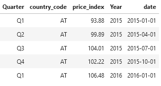
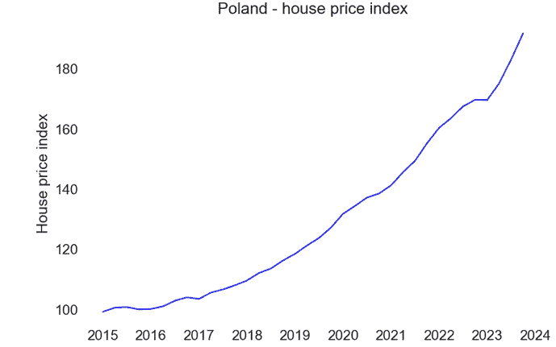
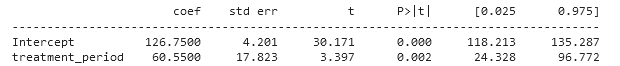
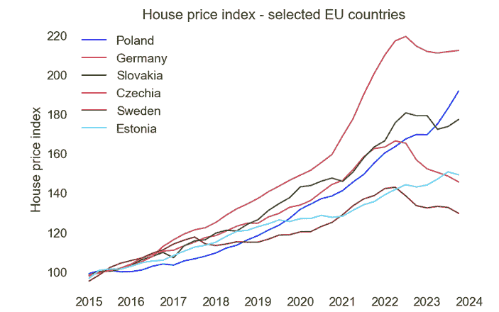
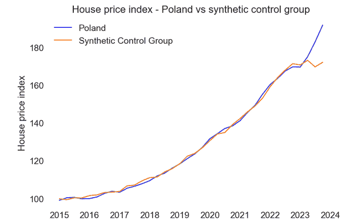
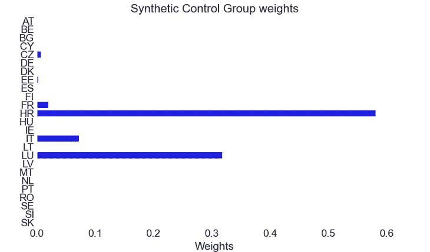
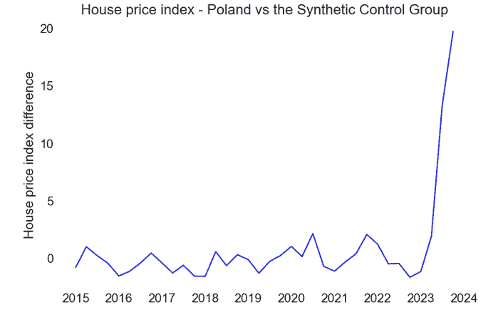
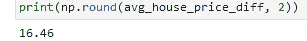
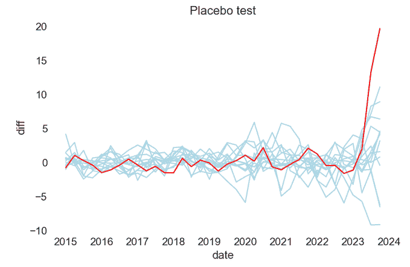
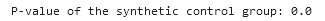

# 低价抵押贷款如何改变波兰的房地产市场

> 原文：[`towardsdatascience.com/how-cheap-mortgages-transformed-polands-real-estate-market-0e81f8c3611c/`](https://towardsdatascience.com/how-cheap-mortgages-transformed-polands-real-estate-market-0e81f8c3611c/)

由[Maria Ziegler](https://unsplash.com/@schluesseldienstvergleich_eu?utm_source=medium&utm_medium=referral)在[Unsplash](https://unsplash.com?utm_source=medium&utm_medium=referral)上的照片

房地产是现代经济的基础，既是可触摸的资产，也是个人和投资组合财富积累的必要组成部分。

房地产价格的波动具有深远的影响，从消费者情绪到金融稳定都会受到影响。理解价格动态背后的驱动因素不仅是一个学术追求，也是政策制定者、投资者和房主共同的需求。

房地产价格的重要性使得它们在政策制定中至关重要，因为政府试图影响这个市场以增加住房的可负担性。此类政策使我们能够使用因果推断工具包来评估它们。

在本文中，我们将尝试使用合成控制组方法评估波兰抵押贷款补贴计划对房地产价格的影响。

**安全信贷 2%计划**

[`www.gov.pl/web/rozwoj-technologia/bezpieczny-kredyt`](https://www.gov.pl/web/rozwoj-technologia/bezpieczny-kredyt)

2023 年 7 月，波兰政府推出了“安全信贷 2%”计划。该计划旨在帮助年轻人和家庭购买他们的第一套公寓。以下是在官方网站上放置的计划描述的依据：

> 对于许多人来说，包括年轻人，购买第一套公寓是一个挑战。随着房地产价格的上涨和贷款成本的提高，这通常是一个难以实现的梦想。这就是为什么我们准备了住房贷款补贴计划。

对于 45 岁以下的个人，如果没有或从未拥有过公寓，可以申请贷款。单身人士的最高贷款金额为 50 万波兰兹罗提。在已婚夫妇或父母有孩子的情况下，最高贷款金额为 60 万波兰兹罗提。补贴适用于一级和二级市场的公寓。

**研究问题和方法**

房地产开发商在短期内通常无法建造更多的公寓。因此，此类补贴计划可以增加对公寓的需求。由于供应相对稳定，它们可能导致房地产价格大幅上涨。

問題是房地產價格的潛在上升是否由選定的貸款人群住房貸款的增加所合理化，以及獲得低息貸款的個人是否可以在不參與該項目的情況下獲得這些貸款。

上述問題範圍廣泛，可以填滿許多學術研究。我將限制我的野心。我的研究問題將非常簡單：該項目是否提高了波蘭的房地產價格？

评估该项目的影響是一個複雜的任務。我們不能簡單地比較該項目前後波蘭的房地產價格指數，因為其他因素可能影響了結果。同樣，由於該項目對所有波蘭居民都開放，我們也不能進行隨機實驗。

此外，2020 年代初是一個充滿政治和經濟危機的時期，這些危機對波蘭經濟產生了深遠的影響。例如，由於戰爭，波蘭接待了許多來自烏克蘭的難民。他們的到來自然增加了對房地產的需求，這可能導致價格上升。此外，波蘭的通脹是歐洲聯盟中最高的之一，這是另一個顯著複雜化該項目評估的因素。

幸運的是，因果推斷工具包中的許多方法可以幫助我們回答問題。我們可以應用我最喜歡的技術之一，這種技術非常適合評估公共政策，特別是在總體水平上——一個**合成控制組**。

此方法涉及創建一個與處理組特徵非常相似的“合成”控制組，使我們能夠估計如果處理沒有發生，對照實驗的結果。

本質上，我們將創建一個*合成波蘭*。我們將使用其他歐盟國家的實際價格趨勢來完成這一點。我們將在該項目開始前的時期將這些國家與波蘭進行比較。基於此，每個國家將得到一個權重，這些權重的線性組合將盡可能地與波蘭相似。

然後我們可以比較該項目後波蘭觀察到的實際房地產價格與合成控制組觀察到的價格。

對實際，合成控制組被用作**對照實驗**。它向我們展示了如果政策沒有開始，房地產價格會發生什麼變化。這兩個“世界”之間的差異將給我們提供對分析政策的影響評估。

**數據**

我們尋找答案的過程從數據收集開始。幸運的是，歐洲統計局為我們提供了針對我們需求的無價信息。具體來說，我們將利用歐盟統計辦公室的季度價格指數數據。

房价指数（HPI）是衡量住宅房地产市场通货膨胀的全面指标。它包括家庭购买的各类住宅的价格变化，包括公寓、独立住房和排屋。以 2015 年的基准值为 100，这个指数指标提供了对价格随时间变化的清晰理解。

数据结构很简单。它包含来自欧盟每个国家的季度 HPI 指数。以下代码片段包含了对从欧盟统计局网站下载的 CSV 文件进行的数据预处理步骤。

为了提高可读性，我仅选择了三个感兴趣的列——时间段、国家名称（geo）和价格指数（obs_value）。此外，我还进行了一些预处理步骤，将季度名称存储为日期值。这将使分析更加容易进行。最终，我排除了非欧盟国家，并对整个联盟的值进行了汇总。最终数据集看起来是这样的：

我们需要应用最后一步数据准备步骤，为一些因果推断准备数据。

也就是说，我们必须为治疗组和治疗期间创建指示列。

我们将创建三个变量，以便在分析的后阶段重复使用：

+   治疗期间 – 指从 2023 年第三季度开始的季度

+   治疗组 – 波兰（“PL”）的值为 1

+   treated – 表示治疗期间治疗组的变量

    **波兰房价指数**

最后，我们可以更深入地查看数据。让我们先看看波兰房价的趋势。房价指数在过去 8 年中显著上升。然而，我们主要只对这一系列的最后一点感兴趣。这使得对分析程序的长期分析稍微复杂一些，但仍然可行！

如下图表所示，在过去八年中，波兰的房价稳步上升。作为一个波兰公民，我后悔几年前没有买公寓。但我们能做什么呢？

尽管价格一直在稳步上升，但我们可以在 2024 年观察到房价指数的急剧上升。这一点对应于廉价信贷 2%计划实施期间。我们如何衡量这项政策的效果？

**前后分析**

让我们从最直接的方法开始。通过运行基本的回归分析，我们可以比较在政策实施后波兰的房价指数是如何变化的。

“treatment*period”变量的系数表明，在抵押贷款补贴计划实施期间，波兰的房价指数平均增加了 60 个单位。如果基线值为 100，这是一个强烈的影响。然而，它并没有告诉我们太多。

为什么会这样？除了补贴计划之外，许多因素可能影响了波兰的房地产价格。例如，来自乌克兰的移民涌入、经济状况或任何我们不知道的其他因素可能对房价指数的增长负责。

**与其他国家的比较**

为了解释那些不可观察的影响，我们需要将波兰的房价指数与其他国家进行比较。下面的图表比较了波兰的 HPI 与所选的欧洲国家。为什么只选择这些国家？基于它们与波兰的邻近性，我选择了它们，以便将波兰的房地产价格置于更广泛的环境中。

图表清楚地显示，波兰的 HPI 价格指数（蓝色线条）的增长速度比许多选定的国家要快得多。并且这种增长在 2023 年加速了。

我们能否量化这种差异？从理论上讲，可以。我们可以应用双重差分法，并使用所有其他国家作为*对照组*。然而，由于可能缺乏平行趋势假设，这种方法必须进行修正。

只选择少数几个国家会留下太多空间供直觉和猜测。因此，我们需要探索替代方法，以确保我们分析的准确性和可靠性。

这是一个许多关于低成本抵押贷款计划分析停止的证据点。他们得出结论，2023 年末 HPI（或任何其他价格指标）的急剧上升显示了低成本抵押贷款计划对价格上涨的影响。

通常，这种做法没有太多问题，尤其是在新闻报道层面。引入低成本信贷计划与价格上涨之间存在明显的相关性。然而，我仍然想展示一个更明显的因果效应。

**合成控制组**

我建议的方法将使用合成控制组方法。如前所述，我们将在抵押贷款计划开始之前创建一个尽可能相似的波兰所有欧盟国家的加权组合。之后，我们将比较真实波兰的 HPI 指数与合成指数。这种差异将给我们提供处理效果——抵押贷款补贴计划对波兰房地产价格的影响。

让我们开始吧。

作为第一步，我们必须转换数据——将国家作为行，每个季度作为一个列。我们可以使用 pandas 的*group by*函数来完成。我将只使用 2023 年第三季度之前的数据，因为这将是我们的合成控制组的“训练集”。此外，在以下代码片段的末尾，我们将波兰的数据作为单独的数据实体存储，因为这将是回归的目标变量。

在以下步骤中，我将尝试创建一个合成控制组，作为每个单独国家的线性组合。我们将使用标准的线性回归模型和类似于 2010 年 Abadie, A.，Diamond, A.和 Hainmueller, J. (2010) *Synthetic Control Methods for Comparative Case Studies.* 文章中展示的优化技术。

本文的作者提出了应用线性加权算法，将系数的权重限制为总和为 1。

优化受限于权重总和等于 1 的等式约束，并应用边界以确保权重在 0 和 1 之间。我们还将使用正则化参数来防止过拟合，使我们能够只选择最合适的国家作为合成控制组的组成部分。

我们上面创建了 *SyntheticControlWithWeights* 类，使我们能够开发并应用合成控制组方法到欧盟的房价数据。让我们创建合成波兰！

我们不需要更多的代码来创建合成控制组。在初始数据准备之后，创建实际的控制组是直接的。该类的 `.fit()` 方法只需要几个参数：

+   regions_pre – 包含截至 2023 年第三季度之前所有国家的数据框

+   poland_pre – 包含截至 2023 年第三季度之前波兰 HPI 指数的数据框

+   regularization_parameter

最后一个参数使我们能够控制过拟合，类似于岭回归或 Lasso 回归中的惩罚参数。

较高的值会更强地惩罚均方误差，导致模型更简单，权重分布更均匀。我在这里选择了 0.5 这个值，但我们也可以尝试不同的值，例如使用网格搜索并检查其他模型的均方误差。

**合成控制组结果**

我们深入探讨了技术细节。现在检查合成控制组的结果是一个绝佳时机。下面的代码片段将合成控制组的 `.predict()` 方法应用于所有国家（不包括波兰）的数据。

之后，我们将这些预测值添加到所有国家的数据中，包括波兰。这将使我们能够将波兰观察到的实际 HPI 指数与合成指数进行比较。

最后，我们可以观察抵押贷款补贴计划与合成控制组的效果，这是我们分析的关键部分。

作为提醒，合成控制组在这里充当**反事实**，展示了如果没有开始抵押贷款补贴，波兰的房地产价格将会如何。

预处理趋势显示波兰和合成控制结果之间拟合得非常紧密。这是好事，因为它表明合成控制组在感兴趣的事件开始之前与波兰相似。

拟合并不完美，因为我们可以看到两条线之间存在差异。这也是好消息，因为很可能，该方法没有过拟合训练数据。

房贷补贴计划的效果非常显著。当我们比较波兰实际 HPI 指数（蓝色线条）与合成指数（橙色线条）时，我们可以观察到相当大的差距。

这告诉我们什么？如果没有房贷补贴计划，波兰的房地产价格将会低得多。在这个替代现实中，我们可能会预期出现一个平稳的趋势。**房贷补贴计划的引入导致了波兰房地产价格的显著增加**。

这种比较可能会引发疑问，因为可能存在其他仅影响波兰而与其他欧盟国家不同的因素。然而，合成控制组在 2023 年第三季度之前捕捉到了所有这些差异。

合成控制组方法还有一个额外的好处。我们可以检查捐赠池中的哪些对象有助于创建合成控制组。以下代码片段使用我们之前创建的模型中的.coef_ 方法生成系数。

以下图表使我们能够看到在房地产价格预处理趋势方面与波兰最相似的国家。基于此，算法选择了克罗地亚、卢森堡、意大利、法国、捷克共和国和爱沙尼亚。

作为下一步，我们可以专注于量化房贷补贴计划的影响，因为到目前为止，我们只关注了图表。在合成控制组方法中量化处理效果的一种典型方法是在时间上绘制我们处理组中的实际价格与合成控制组生成的值之间的差异。以下代码片段正是这样做的。

以下图表显示的正是我们应用合成控制组时预期的样子。首先，我们可以看到在 2023 年之前，合成价格与观察到的价格之间的差异相对较小，并且没有明显的趋势。拟合永远不会完美（也不应该是），因为我们想避免过度拟合。

2023 年底发生的事情非常引人注目。波兰房地产价格指数与合成控制组生成的预期价格水平之间的差异急剧上升。这完美地与信贷价格补贴计划的引入相吻合。

基于此，我们可以看到安全信贷计划导致了比没有该计划引入预期的房地产价格高出近 20 个单位。

我们还可以通过计算合成控制组与波兰实际房地产价格之间的平均价格差异来量化信贷补贴计划的影响。

我们可以通过简单地计算实际价格与合成控制组中观察到的生成价格之间的平均差异来完成这项工作：

如我们所见，结果非常显著。根据使用的方法，引入信贷补贴计划导致房地产价格指数比没有引入此类计划的情况增加了**16.5 个单位**。

**安慰剂测试**

你可能会认为任何人都可以生成这样的数据，并且显示这些结果可能会有很多随机性。毕竟，应用合成方法的结果可能仅仅是偶然发生的。幸运的是，我们有一个很好的方法来检查获得结果的稳健性——这被称为安慰剂测试。

再次强调，这不是合成控制组方法的入门文章，因此我们不会深入探讨这个测试的技术复杂性。一般来说，每个单位（在我们的例子中是一个国家）在合成控制组计算中将被视为目标。其余所有国家都是我们的捐赠者池。

我们将创建许多合成控制组。每个组将以不同的国家作为参考点。当计算完成后，我们可以检查有多少安慰剂控制组的效果比在波兰观察到的效果更显著。这是一种相对简单快捷的方法，可以获取合成控制组方法中 p 值的等效值。

首先，我们必须将合成控制组计算打包到 Python 函数中。这将使我们能够为每个国家创建迭代合成控制组。

下面的代码增加了一个我们尚未讨论的额外注意事项。它排除了预处理合成控制组拟合度较差的区域，使我们能够得到更稳定的结果。我们可以遵循 Abadie（2010）中提出的程序，并且对于每个 MSE 值超过创建波兰合成控制组五倍以上的所有区域都进行排除。

最后，我们拥有了进行安慰剂测试的所有部件。代码遍历每个区域，生成合成控制组，计算 2023 年第三季度之前的 MSE，并将该 MSE 与波兰的 MSE 进行比较。只有 MSE 小于五倍波兰 MSE 的区域被保留。

最终结果是包含满足此条件区域合成控制组结果的列表（`df_list`），允许在不同区域之间进行更稳定和可靠的比较。

让我们可视化安慰剂测试的结果。我们将绘制每个国家实际房地产价格指数与合成指数之间的差异。让我们突出显示来自波兰的数据，以了解我们小型研究获得的结果有多么不寻常。

该图有助于比较受处理区域（红色）与安慰剂区域（浅蓝色），有助于确定观察到的效果是否仅限于处理区域。

2023 年前红蓝线的对齐表明干预前无显著差异，这支持了合成控制方法的有效性。换言之，波兰的合成对照组与其他国家生成的合成组差异不大。

与安慰剂区域相比，2023 年后红线的急剧上升表明信贷补贴计划可能对波兰产生了实质性影响。这种与合成控制的偏离表明，目标区域经历了一个未在安慰剂区域中反映的变化。

总之，图表表明目标区域存在**2023 年后显著且重大的干预效应**，而其他区域（安慰剂）未显示此类模式。这从视觉上证实了在波兰获得的效果并非仅仅是偶然。

作为最后一步，我们可以量化上图的效果。通过检查有多少安慰剂对照组的效果强于波兰，我们可以轻松计算出 p 值。理想情况下，这个数字应尽可能低。

其计算使用以下代码片段进行。它获取实际组与合成对照组之间的价格指数差异。我们将把安慰剂区域之间的差异是否超过波兰的差异存储在一个列表中。

_diff*list* 中值的平均值将指示所需的 p 值：

这个比例可以解释为合成对照组检验的**p 值**。它代表安慰剂区域偶然出现比波兰更显著差异的可能性。由于我们得到了一个较小的值，安慰剂区域偶然表现出比波兰更显著价格差异的可能性不大，这表明在波兰观察到的效应具有统计显著性。

**局限性与总结**

上述研究是我首次尝试应用因果推断技术来研究实际政策干预的效果。其计算方式与我们在学术界或工业界可能遇到的受控环境有很大不同。尽管如此，令人信服的结果表明，因果推断可以支持许多关键决策。

我完全清楚自己相对直接的分析存在所有局限性。毕竟，这不是严谨的学术研究。确实可能有许多其他因素影响波兰的房地产价格。

例如，由于俄罗斯入侵导致乌克兰难民数量增加，出现了价格飙升。然而，这一涌入发生在 2022 年，而异常高的房地产价格上涨发生在 2023 年补贴计划实施时。

另一个论点可能是波兰经济比欧盟内的其他国家增长得更强大。这确实可能是一个有效的论点。然而，在 2023 年下半年，波兰并没有发生重大的经济事件。同样，合成控制组在治疗发生之前考虑了其他国家与波兰的相似性。

根据上述分析，我可以自信地说，信贷补贴计划对波兰房地产价格的上涨做出了重大贡献。这些计划的发布可能导致价格不成比例地上涨，从而导致公寓的可用性下降。分析该计划对不同收入水平人群的影响可能是此类评估中的下一步有趣的研究方向。

上述分析表明，相对简单的因果推断方法可以帮助评估特定政策。如果将这些结果应用于现实生活，我们可以通过应用数据科学工具来改善社会。

**参考文献**

Abadie, Alberto & Diamond, Alexis & Hainmueller, Jens, 2010\. "[合成控制方法在比较案例研究中的应用：评估加利福尼亚烟草控制计划的影响](https://ideas.repec.org/a/bes/jnlasa/v105i490y2010p493-505.html)," [《美国统计学会会刊》(Journal of the American Statistical Association)](https://ideas.repec.org/s/bes/jnlasa.html), 美国统计学会，第 105 卷(490 期)，第 493-505 页。

Abadie, Alberto & Gardeazabal, Javier. (2003). 《冲突的经济成本：巴斯克地区的案例研究》。美国经济评论。第 93 卷。第 113-132 页。10.1257/000282803321455188。

[`ec.europa.eu/eurostat/databrowser/view/prc_hpi_q__custom_10311434/default/table?lang=en`](https://ec.europa.eu/eurostat/databrowser/view/prc_hpi_q__custom_10311434/default/table?lang=en)

[`matheusfacure.github.io/python-causality-handbook/15-Synthetic-Control.html`](https://matheusfacure.github.io/python-causality-handbook/15-Synthetic-Control.html)

[`mixtape.scunning.com/10-synthetic_control`](https://mixtape.scunning.com/10-synthetic_control)
