# 灰度图像如何影响视觉异常检测？

> 原文：[`towardsdatascience.com/how-do-grayscale-images-affect-visual-anomaly-detection/`](https://towardsdatascience.com/how-do-grayscale-images-affect-visual-anomaly-detection/)

<mdspan datatext="el1753385948608" class="mdspan-comment">内容</mdspan>

1.  **简介：** 为什么灰度图像可能会影响异常检测。

1.  **异常检测，灰度图像：** 本文讨论的两个主要主题的快速回顾。

1.  **实验设置：** 我们比较的内容和方式。

1.  **性能结果：** 灰度图像如何影响模型性能。

1.  **速度结果：** 灰度图像如何影响推理速度。

1.  **结论**

## **1.** 简介

在本文中，我们将探讨灰度图像如何影响异常检测模型的性能，并检查这一选择如何影响推理速度。

在计算机视觉中，已经确立了一个事实，即在灰度图像上微调预训练的分类模型可能会导致[性能下降](https://towardsdatascience.com/transfer-learning-on-greyscale-images-how-to-fine-tune-pretrained-models-on-black-and-white-9a5150755c7a/)。但对于[异常检测模型](https://blog.ml6.eu/a-practical-guide-to-anomaly-detection-using-anomalib-b2af78147934)又如何呢？这些模型不需要微调，但它们使用预训练的分类模型，如 WideResNet 或 EfficientNet 作为特征提取器。这引发了一个重要问题：当应用于灰度图像时，这些特征提取器是否会产生不那么相关的特征？

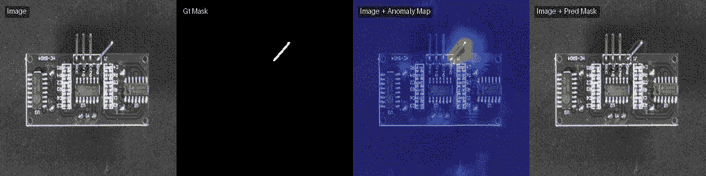

*图片来自[VisA 数据集](https://github.com/amazon-science/spot-diff)（CC-BY-4.0），并使用[Anomalib 库](https://github.com/open-edge-platform/anomalib)处理*

这个问题不仅具有学术意义，而且对任何在制造业中从事自动化视觉检测工作的人来说都具有现实意义。例如，你可能想知道是否需要彩色相机，或者是否一个更便宜的灰度相机就足够了。或者你可能对推理速度有所顾虑，并想抓住任何机会来提高它。

## 2. 异常检测，灰度图像

如果你已经熟悉计算机视觉中的异常检测和数字图像表示的基础知识，请随意跳过这一部分。否则，它提供了一个简要的概述和进一步探索的链接。

### 异常检测

在计算机视觉中，异常检测是深度学习中的一个快速发展的领域，它专注于识别图像中的异常模式。通常，这些模型仅使用无缺陷的图像进行训练，使模型学习“正常”的外观。在推理过程中，模型可以检测出偏离这种学习表示的图像作为异常。这些异常通常对应于可能在生产环境中出现但在训练期间未看到的各种缺陷。有关更详细的介绍，请参阅[这个链接](https://blog.ml6.eu/a-practical-guide-to-anomaly-detection-using-anomalib-b2af78147934)。

### 灰度图像

对于人类来说，彩色和灰度图像看起来相当相似（除了没有颜色）。但对于计算机来说，图像是一个数字数组，因此它变得稍微复杂一些。灰度图像是一个二维数字数组，通常范围从 0 到 255，其中每个值代表一个像素的强度，0 代表黑色，255 代表白色。

相比之下，彩色图像通常由三个这样的单独的灰度图像（称为通道）堆叠在一起形成一个三维数组。每个通道（[红色、绿色和蓝色](https://en.wikipedia.org/wiki/RGB_color_model)）描述了相应颜色的强度，它们的组合创建了一个彩色图像。你可以在这里了解更多信息[这里](https://towardsdatascience.com/transfer-learning-on-greyscale-images-how-to-fine-tune-pretrained-models-on-black-and-white-9a5150755c7a/)。

## **3.** 实验设置

### 模型

我们将使用四种最先进的[state-of-the-art](https://arxiv.org/abs/2503.23451)异常检测模型：[PatchCore](https://arxiv.org/abs/2106.08265)、[Reverse Distillation](https://arxiv.org/abs/2201.10703)、[FastFlow](https://arxiv.org/abs/2111.07677)和[GLASS](https://arxiv.org/abs/2407.09359)。这些模型代表了不同类型的异常检测算法，同时，由于训练和推理速度快，它们在实用应用中得到了广泛的使用。前三个模型使用了来自[Anomalib 库](https://github.com/open-edge-platform/anomalib)的实现，对于 GLASS，我们使用了[官方实现](https://github.com/cqylunlun/GLASS)。

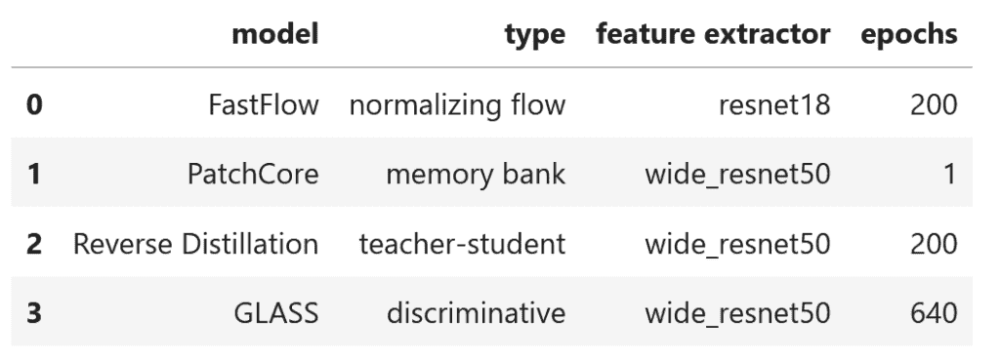

*图片由作者提供*

### 数据集

对于我们的实验，我们使用了包含 12 类物体的[VisA](https://github.com/amazon-science/spot-diff)数据集，它提供了各种图像，并且没有颜色相关的缺陷。

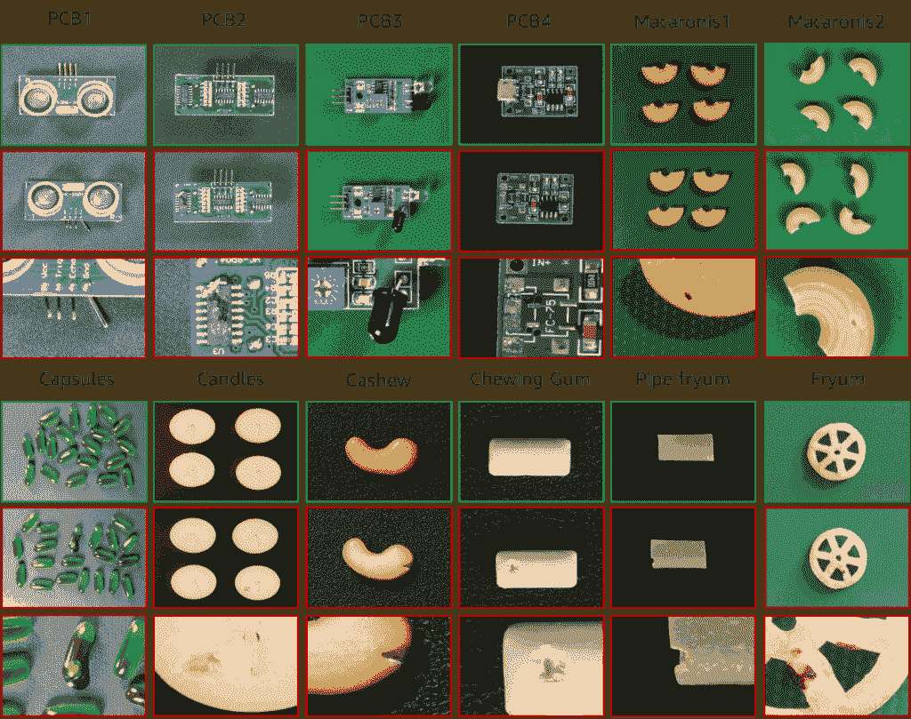

*图片来自[VisA 数据集](https://github.com/amazon-science/spot-diff) (CC-BY-4.0)*

### 指标

我们将使用图像级别的 [AUROC](https://lightning.ai/docs/torchmetrics/stable/classification/auroc.html) 来查看整个图像是否被正确分类，而无需选择特定的阈值，以及像素级别的 [AUPRO](https://ieeexplore.ieee.org/document/8954181)，它显示了我们在图像中定位缺陷区域的能力。速度将使用每秒帧数（FPS）指标来评估。对于所有指标，更高的值对应于更好的结果。

### 灰度转换

要将图像转换为灰度，我们将使用 [torchvision 转换](https://docs.pytorch.org/vision/master/auto_examples/transforms/plot_transforms_getting_started.html)。

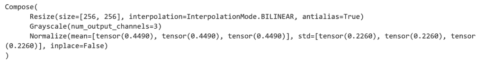

*图片由作者提供*

对于一个通道，我们还在 [timm 库](https://timm.fast.ai/) 中的 *in_chans* 参数中修改了特征提取器。

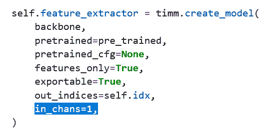

*图片由作者提供*

适配 Anomalib 以使用一个通道的代码可在 [此处](https://github.com/abc-125/viad-benchmark/blob/main/notebooks/grayscale.ipynb) 找到。

4. 性能结果

### **RGB**

这些是带有红色、蓝色和绿色通道的普通图像。

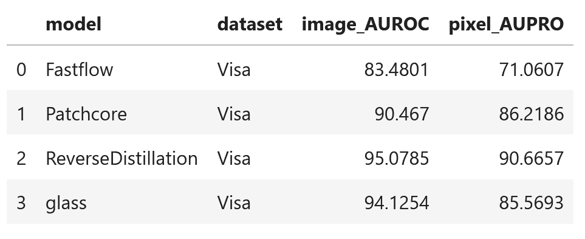

*图片由作者提供*

### 灰度，三个通道

使用 torchvision 转换 [Grayscale](https://docs.pytorch.org/vision/main/generated/torchvision.transforms.Grayscale.html) 将图像转换为灰度，该转换具有三个通道。

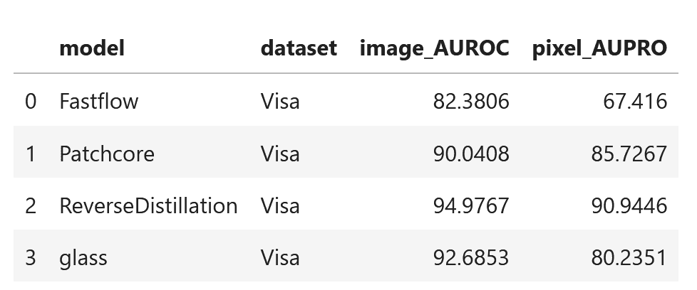

*图片由作者提供*

### 灰度，一个通道

使用相同的 torchvision 转换 Grayscale 将图像转换为灰度，该转换具有一个通道。

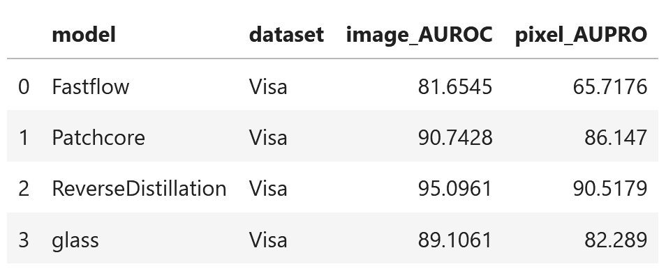

*图片由作者提供*

### 对比

我们可以看到，**PatchCore** 和 **Reverse Distillation** 在所有三个实验中对于图像和像素级别的指标都取得了相似的结果。**FastFlow** 的表现有所下降，而 **GLASS** 的表现明显下降。结果是在 VisA 数据集的 12 个对象类别上平均得出的。

对于对象的每个类别，结果如何？也许其中一些的表现不如其他一些，而一些则表现更好，导致平均结果看起来相同？以下是 PatchCore 在所有三个实验中的结果可视化，显示结果在类别内也非常稳定。

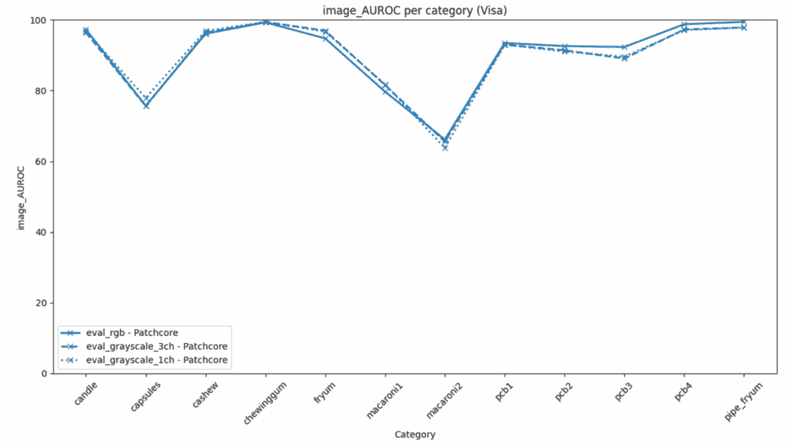

*图片由作者提供*

对于 GLASS 的相同可视化显示，某些类别可能表现略好，而某些类别可能表现明显较差。然而，这并不仅仅是由灰度转换引起的；其中一部分可能是由于模型训练方式导致的正常结果波动。平均结果显示，对于这个模型，RGB 图像产生最佳结果，灰度三个通道略差，而灰度一个通道的结果最差。

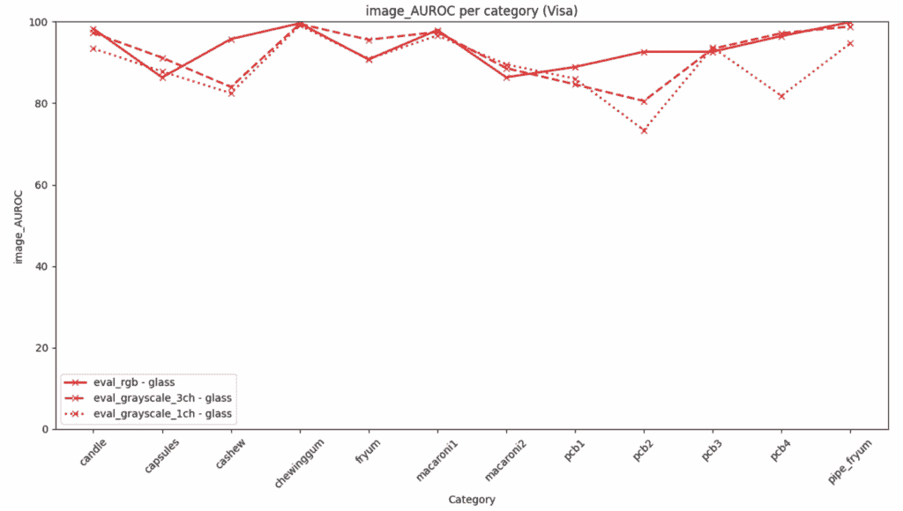

*图片由作者提供*

### 奖励

结果按类别如何变化？可能有些类别更适合 RGB 或灰度图像，即使没有颜色相关的缺陷。

这里是 RGB 和灰度图像之间差异的可视化，对于所有模型，只有一个 pipe_fryum 类别在每一个模型中略有（或明显）变差。其余类别根据模型的不同，要么变差要么变好。

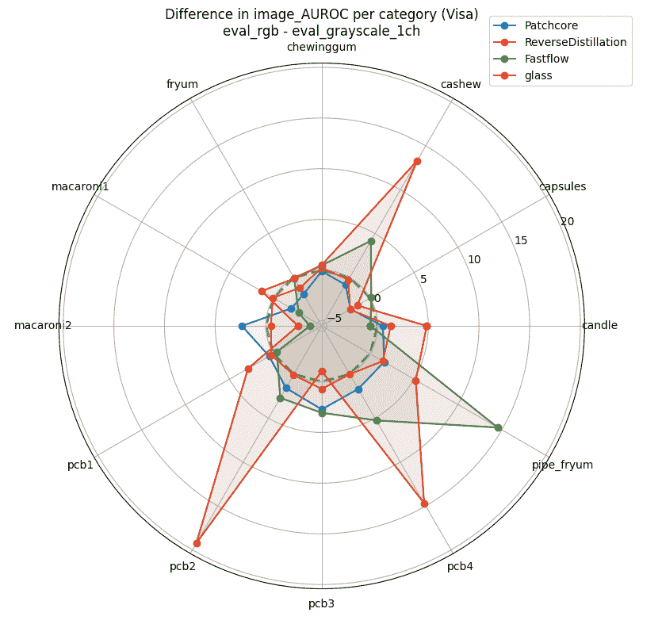

*图片由作者提供*

### 额外奖励

如果你对这个 pipe_fryum 的外观感兴趣，这里有一些使用 GLASS 模型预测的示例。

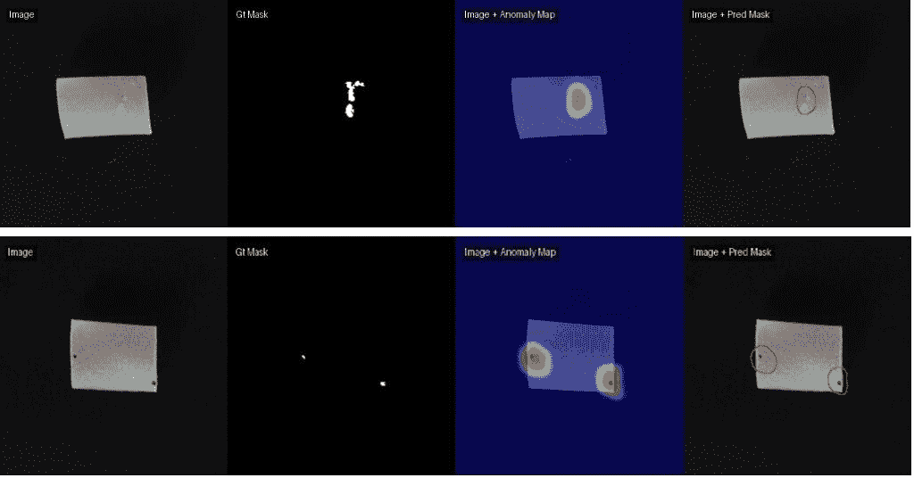

*图片来自[VisA 数据集](https://github.com/amazon-science/spot-diff) (CC-BY-4.0)*，并使用[GLASS](https://arxiv.org/abs/2407.09359)和[Anomalib 库](https://github.com/open-edge-platform/anomalib)进行处理

## 5**.** 速度结果

通道数只影响模型的第 1 层，其余保持不变。速度的提升似乎可以忽略不计，突显出第一层特征提取只是模型计算中很小的一部分。GLASS 显示出一些可观察的改进，但同时也显示出最差的指标下降，所以如果你想通过切换到单通道来加速它，需要谨慎。

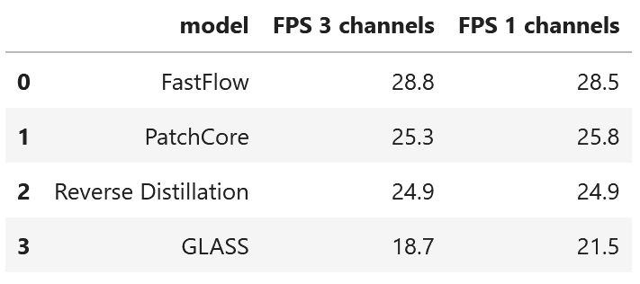

*图片由作者提供*

## 6. 结论

那么使用灰度图像对视觉异常检测有何影响？**这取决于具体情况，但 RGB 似乎是一个更安全的选择**。影响因模型和数据而异。PatchCore 和 Reverse Distillation 通常可以很好地处理灰度输入，但 FastFlow 和特别是 GLASS 需要更加小心，因为它们虽然显示出一些速度提升，但性能指标下降最为显著。如果你想使用灰度输入，你需要对你的具体数据进行测试和比较，与 RGB 进行比较。

包含 Anomalib 代码的 jupyter 笔记本：[链接](https://github.com/abc-125/viad-benchmark/blob/main/notebooks/grayscale.ipynb)。

关注作者在[LinkedIn](https://www.linkedin.com/in/aimira-baitieva/)上的动态，了解更多关于工业视觉异常检测的内容。

## 参考文献

1. C. Hughes，[灰度图像上的迁移学习：如何微调预训练模型](https://towardsdatascience.com/transfer-learning-on-greyscale-images-how-to-fine-tune-pretrained-models-on-black-and-white-9a5150755c7a/) (2022)，towardsdatascience.com

2. S. Wehkamp，[使用 Anomalib 进行基于图像的异常检测的实用指南](https://blog.ml6.eu/a-practical-guide-to-anomaly-detection-using-anomalib-b2af78147934) (2022)，blog.ml6.eu

3. A. Baitieva，Y. Bouaouni，A. Briot，D. Ameln，S. Khalfaoui，和 S. Akcay。[超越学术基准：视觉工业异常检测的关键分析和最佳实践](https://arxiv.org/abs/2503.23451) (2025)，CVPR Workshop on Visual Anomaly and Novelty Detection (VAND)

4. Y. Zou, J. Jeong, L. Pemula, D. Zhang, 和 O. Dabeer, [SPot-the-Difference 自监督预训练用于异常检测和分割](https://github.com/amazon-science/spot-diff) (2022), ECCV

5. S. Akcay, D. Ameln, A. Vaidya, B. Lakshmanan, N. Ahuja, 和 U. Genc, [Anomalib](https://github.com/open-edge-platform/anomalib) (2022), ICIP
