# 运气如何影响棋盘游戏 Sequence？

> 原文：[`towardsdatascience.com/how-does-luck-influence-the-board-game-sequence/`](https://towardsdatascience.com/how-does-luck-influence-the-board-game-sequence/)

在棋盘游戏中输通常没有乐趣。而且当运气决定游戏时更是如此。但在像 Sequence 这样的流行棋盘游戏中，运气实际上有多大的影响？我玩了这款游戏，并观察了数据。这项分析**不能**推广到其他玩家，更不用说有超过 2 名玩家的 Sequence 变体了，因为它仅基于我和我的搭档之间的比赛。

## 游戏是关于什么的？

如果你从未玩过 Sequence，这里有一个快速介绍：

游戏棋盘是一个 10x10 的网格，其中每个空间对应一张牌（图 1）。游戏使用两个牌组，总共有 104 张牌。每位玩家被发一定数量的牌，轮流玩一张牌并在棋盘上对应的空间放置一个标记，然后从牌组中抽取一张新牌。还有一些*幸运*的牌：

+   **双眼杰克**：允许你在任何地方放置一个标记。总共 4 张牌。

+   **独眼杰克**：移除你对手的一个标记。总共 4 张牌。

在这次分析中，我们专注于两人制的 Sequence，玩家通过成为第一个在水平、垂直或对角线上形成两个连续五标记序列的玩家来获胜。

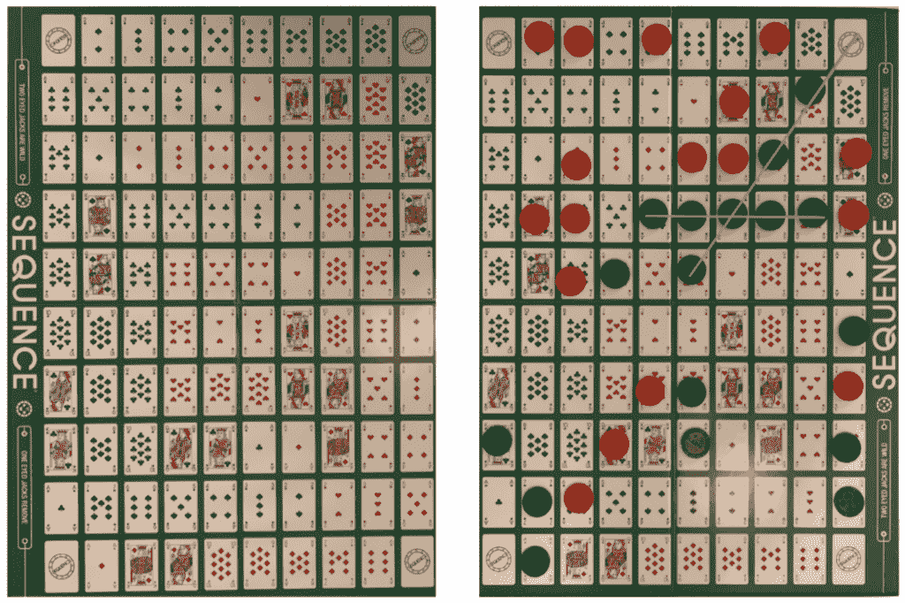

图 1：游戏棋盘在蓝色获胜前（左）和获胜后（右）的序列。图片由作者提供。

## 让我们开始玩

为了统计学的名义，我和我的搭档玩了 51 场比赛。从现在起，我们将自己称为玩家 1 和玩家 2。我们记录了几个变量，包括回合数、获胜者和每场比赛中抽取的独眼和双眼杰克的数量，除非它们是在最后两轮中抽取的，否则不包括在内。

### 杠子的分布

在这次无意义的旅程中，我们的第一个任务是回答这个问题：我们是否抽到了一些幸运的牌？

为了这个目的，设*N, X[1eye]和 X[2eye]*为描述一名玩家看到的回合数、独眼牌和双眼牌的随机变量。如果我们假设游戏持续*N = n*回合，那么我们可以问在这样的游戏中，期望有多少个独眼或双眼杰克。假设 104 张牌的牌组是随机洗牌的，并且每位玩家交替抽牌，这个问题类似于在 104 张牌的总体中，在不放回抽取*N*次的情况下，期望有多少次成功。这是著名的超几何分布，由于有 4 张独眼和 4 张双眼杰克，因此可以得出以下结论：

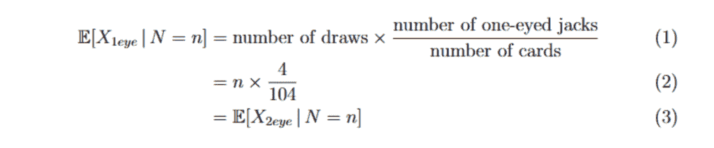

使用相同的论点，我们发现：

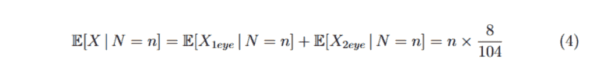

其中*X*是玩家看到的杰克（任何类型）的数量。分布的方差是：

我们可以查看图 2 并验证抽到的杰克遵循分布，只有 6.25%的极端情况（即超出 95%预测区间），这也使我们确信牌是正确洗过的。

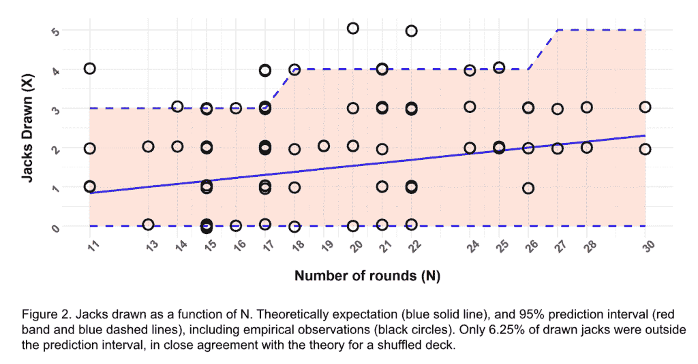

我们的记录提供了平均回合数 *E[N]≈19* 和方差 *V[N]≈24* 的估计，并使用条件期望的塔性质，我们发现：

根据总方差定律，我们发现：

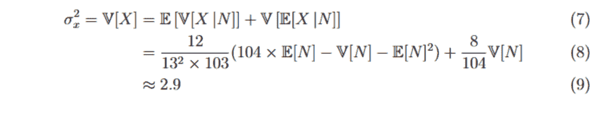

经验上，我们发现：

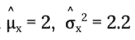

对于玩家 1，和：

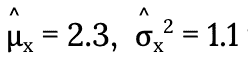

对于玩家 2，这表明我们抽到杰克可能比平均水平更幸运。

## 杰克的真实价值是多少？

一方面是抽到幸运牌，另一方面是幸运牌（杰克）实际上对游戏的影响有多大。为了调查这一点，我们进行了一个简单的逻辑回归，目的是衡量单眼和双眼杰克对获胜机会的影响，表示为 *p:*。

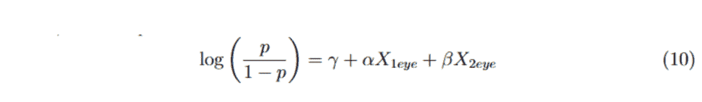

其中 ⍺ 是抽到单眼杰克对获胜的影响，β 是抽到双眼杰克对获胜的影响。参数 ɣ 是其他贡献。我们使用 R 中的 **glm** 函数拟合模型。估计 [p-value] 如下：

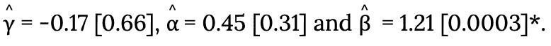

唯一显著的影响来自双眼杰克，它对获胜结果的影响也最大。具体来说，我们发现使用双眼杰克获胜的几率是：

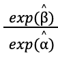

这是单眼杰克的两倍多。

## 幸运指标

根据我们的回归，单眼杰克和双眼杰克的价值，分别用 *v[1]* 和 *v[2]* 表示，由以下方程确定：

对于每个玩家和每场比赛 i，我们定义一个运气分数（ *H[i]* ）为玩家杰克的总价值。*H[i]* = 0 表示没有运气（没有杰克），而 *H[i]* = 1 表示最大运气（所有 8 张杰克；4 × *v[1]* + 4 × *v[2]*）。

我们可以进一步计算玩家之间运气差异 ∆*H[i]* = *H[i]^(玩家 1) – H[i]^(玩家 2)*。∆*H[i]* = 0 表示运气相等（通过杰克的总价值衡量），而 ∆*H[i] = 1 表示玩家 1 抽到了所有 8 张杰克。当 ∆*H[i] = -1 时，表示玩家 2 抽到了所有 8 张杰克。我们商定了一些（半）任意界限：

+   *∆H[i] = -0.5 corresponds to* ***非常幸运（玩家 2）***

+   *∆H[i] = -0.25 corresponds to* ***幸运（玩家 2）***

+   *∆H[i] = 0 corresponds to* ***没有运气（任一玩家）***

+   ∆*H[i] = 0.25 corresponds to* ***幸运（玩家 1）***

+   ∆*H[i] = 0.5 corresponds to* ***非常幸运（玩家 1）***

我们发现，当一名玩家运气好时，获胜的机会会显著增加。在 51 场比赛中，运气不佳的玩家只有 7 次获胜。见图 3，其中展示了令人信服的图像。

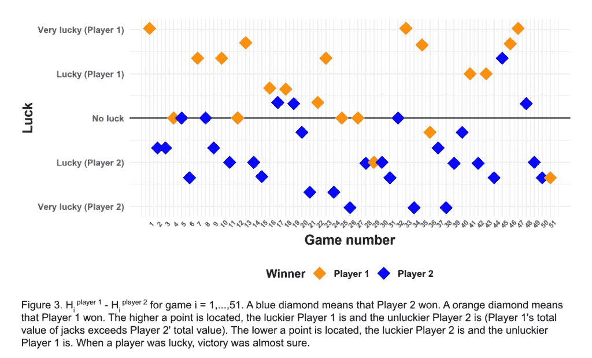

## 技能指标

现在，声称两人序列游戏与抛硬币没有区别可能会引起争议。那么*技能*有多少？在这里，我们使用以下公式为每个游戏 i 定义了一个技能得分*E**[i]*：

表达式 1 + H[i]代表我们想要授予玩家的技能点数。然而，只有当玩家**没有**运气时，我们才会授予分数。这由玩家 1 的指示函数↿[{∆H≤ 0}]和玩家 2 的↿[{∆H≥0}]描述。此外，只有当玩家实际获胜时，我们才会添加技能点数，由玩家 1 的指示函数↿[{Winner = Player 1}]和玩家 2 的↿[{Winner = Player 2}]描述。因此，假设玩家获胜，如果玩家运气好，技能得分是 0，如果两位玩家运气相等，得分是 1，否则是 1 + H[i]。如果玩家输了，技能得分也是 0。

我们对序列游戏中玩家技能的最佳估计是所有 E[i] ≥ 1（即玩家表现有技巧）的游戏中的平均技能得分*Ē*。对于玩家 1 和玩家 2，都有 m = 7 场比赛，玩家表现有技巧，如图 3 所示。那么得分就是：

在图 4 中，我们使用了一种称为*自举重采样*的技术，根据我们的游戏，为玩家 2 和玩家 1 的平均技能得分*Ē*创建了 500 万个副本。然后我们计算了 500 万个差异∆*Ē* =*Ē*[玩家 1] – *Ē*[玩家 2]，并绘制了直方图，同时绘制了 95%（自举）置信区间和平均差异。

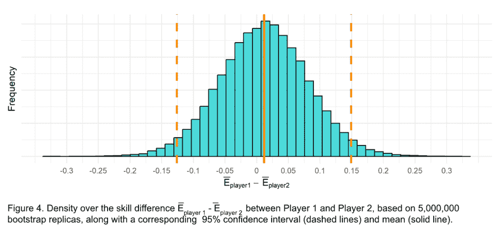

图表显示了关于哪位玩家表现最好的显著不确定性。特别是，注意到置信区间包含 0，这意味着在 5%的显著性水平下，我们不能拒绝两位玩家技能相等的假设。

## 一场运气游戏？

我们已经证明，运气在我们的序列游戏中起着重要作用。当我和我的搭档抽到足够的 J 牌时，胜利几乎是肯定的。为了评估在公平游戏或对抗游戏中战略导航的能力，我们开发了一个技能得分。对 51 场比赛的分析显示，我和我的搭档之间没有显著的技能差异。其他运气因素，如牌序，没有在我们的模型中考虑，这意味着用于计算技能得分的游戏本身可能受到运气因素的影响。如果是这样，游戏受到运气的影响可能比我们的分析所暗示的更大。

我们的研究基于 51 场比赛，这是一个相对较低的数量。这些比赛是由我和我的搭档进行的，**不能**推广到其他玩家。具有更多或更少战略意识的玩家可能会对结果产生不同的影响。尽管如此，我们的分析显示，双头杰克对获胜机会产生了显著和实质性的影响，这表明它们在游戏中扮演着重要的角色，无论玩家是谁。尽管单头杰克在统计上并不显著，我们仍然认为它们是幸运牌，因为它们在逻辑上预期会有些影响。最终，虽然我们的发现表明，胜利的最强预测因素是双头杰克的数量，但显然还需要对更多、范围更广的玩家进行进一步的分析，以全面理解游戏中的动态。例如，可以假设技能水平相当的玩家从运气中获得的好处更大，而不是技能不均的玩家。
