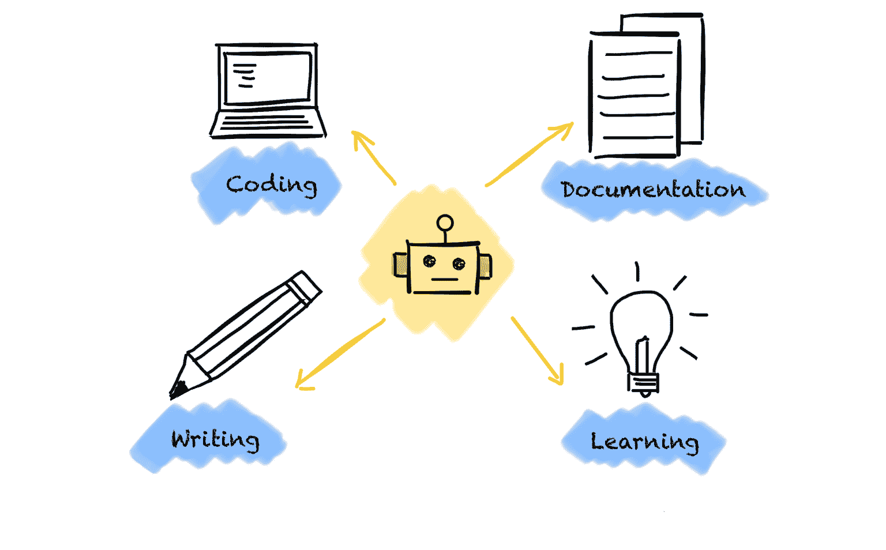

# GenAI 工具如何改变我的数据科学家工作

> 原文：[`towardsdatascience.com/how-genai-tools-have-changed-my-work-as-a-data-scientist-0476d3724d42/`](https://towardsdatascience.com/how-genai-tools-have-changed-my-work-as-a-data-scientist-0476d3724d42/)

(作者图片)

ChatGPT 发布并开始围绕 GenAI 炒作以来，已经过去了将近两年。从那时起，发生了许多事情。GenAI 工具来了又去。留下的那些工具变得越来越好，扩展到更多使用案例。

在过去的一年里，我开始越来越多地将一些 GenAI 工具整合到我的日常工作中。我尝试了不同的 GenAI 工具和不同的使用案例。

在这篇文章中，我将分享 GenAI 工具如何帮助我在日常工作中。我会分享我使用的 GenAI 工具，以及它们如何改变我的数据科学家工作。我会谈论它们如何提高我的工作效率，以及一些警示之词。

通常，我使用 GenAI 工具做很多事情，因为它们让我能够

+   提高我在某些领域的生产力

+   专注于重要且具有价值的难点

+   提高我工作的质量

+   学习更快、更轻松

我的生产力更高，因为我可以更快地迭代并尝试更多的事情，因为我无需自己编写所有代码。由于 GenAI 工具接管了我工作中一些简单但耗时的工作部分，我有更多时间用于战略思考、复杂问题解决和创造性工作。此外，它们帮助我在许多领域提高工作的质量，而不仅仅是编写代码。最后，GenAI 工具帮助我更快地学习新事物，因为我可以创建最适合我的学习路径。

但这具体看起来是怎样的呢？

让我们直接进入正题。

* * *

## **我（当前）的 GenAI 工具使用案例**

我有四个使用案例，我每天都会使用 GenAI 工具：

+   学习

+   编码

+   文档编写

+   写作

### **学习**

当涉及到学习时，GenAI 工具以不同的方式帮助我

+   发散思维，完善想法，获取新的输入

+   获取新主题的概览

+   解释概念和研究论文

+   学习新的编程语言

使用 GenAI 工具学习的最大好处是我可以提出许多问题。这让我可以从不同的角度接近对我来说是新的主题。我无需搜索数百个网站来找到适合我的解释。GenAI 工具可以即时生成许多示例。

这极大地加快了我的学习速度，并改善了我的学习体验。对于所有这些任务，GenAI 工具帮助我获得了良好的概览。然而，当涉及到研究论文中的细节或复杂概念时，这通常是不够的。因此，我将 GenAI 工具作为首选资源，但随后以传统方式深入研究细节。阅读研究论文或浏览几个网站。但由于 GenAI 工具已经为我提供了良好的基础，理解研究论文变得更容易、更快。

对于我的学习任务，我主要使用 ChatGPT、Claude 和 Perplexity AI，具体取决于具体任务。

Perplexity AI 在某种程度上取代了我的 Google 搜索。它比在 Google 上点击许多链接寻找好答案要快得多。此外，它提供了更有组织的答案。然而，与其他工具相比，对我来说最大的好处是它为陈述添加了来源。这使得验证答案和判断信息的可信度变得容易。此外，如果需要，我已有了一个深入挖掘的起点。

结果的质量很大程度上取决于提示。你的提示越好，结果就越有帮助。我通常尽量详细，并提供一些上下文和关键词，让答案应该关注的。通常，指定一个角色也有帮助，例如，“扮演……领域的专家”或让 AI 工具提供替代方案。然而，我不是一个很好的提示编写者，还有改进的空间。

### **编码**

GenAI 工具极大地改善了我的编码体验和技能。总的来说，GenAI 工具改变了我在编码时花费最多时间的事情。这些工具帮助我在解决小而简单任务以及构建原型时更快，因此我有更多时间专注于复杂问题或尝试更多方法。

我主要使用这些工具来

+   代码生成

+   代码改进/重构

+   错误调查

+   理解第三方库及其文档

使用 AI 工具已成为我编码的自然部分。这主要是因为 GitHub Copilot 的自动完成/建议功能。我可以轻松接受或拒绝建议，而无需考虑“请求”帮助。

当涉及到代码生成时，我以两种方式使用 GenAI 工具。

如果我知道如何实现一个想法并且已经心中有步骤，我会一步一步地进行，并使用 GitHub Copilot 的自动完成功能。这通常是一个足够好的开始。然而，由于输出并不总是按预期工作或做我想做的事情，我会特别注意期望的行为。

如果我知道结果应该是什么样子，但不知道如何实现，我会使用 ChatGPT 或 Claude 来展示不同的方法。这极大地提高了我的工作效率。以前，我不得不费力地在互联网上搜索以获得针对特定问题的想法。这种搜索通常需要花费大量时间才能找到正确的东西（如果我能找到的话）。现在，我写几个提示，直到我得到我想要的结果。我使用 ChatGPT 或 Claude，因为它们提供了不同的建议，而很难知道哪一个对特定问题更有效。

例如，我经常使用 ChatGPT 或 Claude 生成数据分析的图表，因为它要快得多。没有这些工具，我花了大量时间才让 matplotlib 图表看起来像我想的那样。尤其是在我想偏离简单和标准图表的时候。

在某些用例中，我也使用 GenAI 工具来帮助我生成单元测试。我并不是使用这些工具来创建完整的单元测试，而是为了给我一个起点和基础来构建。构建这个基础通常是繁琐且耗时的工作。为此，我使用 GitHub Copilot 作为工具，因为它了解代码库并能给出更好的建议。然而，由于单元测试确保了代码的健壮性，我尽可能少地依赖 GenAI 工具。

一旦我有了一个代码的初版，我经常使用 GitHub Copilot 来重构代码，提高代码的可读性和简洁性。这是因为几乎总是第一个版本是一团糟。它效率低下，看起来杂乱无章，过于复杂。它反映了我在开发和测试想法时的思考。它离生产就绪还差得很远。在这里，GitHub Copilot 的建议通常是第一步的好方法。它们还帮助我学习不同的解决问题的方式。

在调查错误时，AI 工具帮助了我很多。有时错误信息不清楚，尤其是在学习一门新的编程语言时。使用 GenAI 工具帮助我避免花费数小时在谷歌搜索和阅读大量的 Stackoverflow 帖子。我主要使用 GitHub Copilot，因为它知道上下文，无需我复制代码。这对于简单的错误和 bug 效果很好。尽管对于更复杂的错误通常效果不佳，但答案指示了应该寻找什么。我很少使用 ChatGPT 或 Claude 来解释错误信息，因为它们缺少上下文。

我在编码方面的最后一个用例可能是最有趣的。我使用 GenAI 工具来查找和解释第三方库的功能。这些库的文档有时并不非常用户友好。很难找到我想要的东西，或者难以理解。使用 ChatGPT 搜索文档并充当翻译者帮助了我很多次。这样一来，查找和使用第三方库功能的不便减少了。

### **文档**

为我的代码编写文档一直是我感到繁琐且不情愿的工作。编写 docstrings 和 ReadMes 总是花费很多时间，而我本想将时间花在其他地方。

让 GenAI 工具支持我编写文档已经成为我的第一个用例之一。我首选的工具是 GitHub Copilot，因为它与我的 IDE 很好地集成。因此，我无需在 IDE 和 GenAI 工具之间复制/粘贴代码块。

GitHub Copilot 现在负责大多数编写 docstrings 和 ReadMes 的工作。我只对建议进行细化，并进行较小的重写。

### **写作**

使用 AI 工具极大地改善并加快了我的写作过程。由于我不是母语英语使用者，我主要使用 Grammarly 来检查语法和拼写。这样一来，我可以专注于写作和编辑。我无需花费数小时来修正语法和拼写错误。此外，我还使用 Grammarly 和 Hemingway AI 来建议如何改进我的写作。在这里，我主要关注那些难以阅读和理解的长句。

然而，我只使用这些工具来提供建议。我不会使用任何 GenAI 工具来撰写整个段落或重写我的文章。这有两个原因。首先，通过重写整个段落，文本会失去我的个性并改变我的写作风格。文章会变得乏味，不那么有趣阅读。其次，我认为写作是我学习过程的重要组成部分。写作帮助我发现知识差距，使我的想法井然有序，并连接各个点。让 GenAI 工具来做写作会剥夺写作对我的学习过程的益处。

* * *

## **警告之词**

尽管 GenAI 工具可以帮助我们做很多事情，但在使用它们时我们也应该谨慎。它们是一把双刃剑，因为它们有一些限制。

最重要的是，我们不应该过度依赖 GenAI 工具。我们不应该盲目相信答案，而应该始终批判性地反思答案。这是由于这些工具的幻觉。GenAI 工具给你一个看似正确且合理的答案，但实际上是错误的。

当谈到学习时，GenAI 工具可能会阻止我们学到尽可能多的知识，就像它们可以帮助我们学习一样。学习的一大部分（至少对我来说）是对一个主题进行批判性思考，理解基本原理，并将它们与其他我已经熟悉的学科联系起来。这需要时间，可能很费劲。有了 GenAI 工具，我可以提出任何问题并得到一个准备充分的答案。短期内这很容易。然而，由于我没有做学习新学科所需的艰苦工作，我很快就会忘记我所“学习”的内容。因此，我们应该谨慎，GenAI 工具增强了我们的学习方法，我们继续学习新技能并扩展我们的知识。

当谈到编码时，GenAI 工具可能会像它们加速我们一样减慢我们。通常代码中包含错误或并不完全执行其应有的功能。我会说当有明显的错误时这没问题，但当这些错误变得非常微妙时，这是一个问题。验证代码是否正确且不会引入明显的错误可能既困难又耗时。因此，最终，你可能在没有使用 GenAI 工具的情况下更快。因此，我只让 GenAI 工具生成小的代码片段。这使得确保代码确实执行我想要的功能变得容易。然而，在我使用 GenAI 工具之前，这些简单的任务占了我大部分的时间。

最后，我们应该思考我们与这些工具分享的内容。我尽量避免分享任何私人数据，因为我不知道一旦我发送请求会发生什么。这尤其重要，当涉及到公司数据时。我通常在向 ChatGPT 或 Claude 提问之前创建简化的用例和代码示例，以代表我的问题。此外，我不会在完整数据集上使用任何分析功能。

* * *

## **结论**

看看我使用 GenAI 工具的用例以及它们如何改变我的数据科学家工作，你可能会想知道我是否可以没有它们工作。是的，我可以。

但我真的想要吗？不，因为它们在某些领域改善了我的工作。

虽然存在一些注意事项，但它们被整体利益所抵消。此外，通用人工智能（GenAI）工具正变得越来越强大。过去两年的发展令人惊叹，令人瞠目结舌。新的工具不断涌现，现有的工具也在快速改进。我们可以将通用人工智能工具应用于越来越多的用例。

可能还有更多用例和人工智能工具可以帮助我们作为数据科学家在日常工作中。因此，请在评论中告诉我您使用的工具和用例。否则，我们下次文章中再见。
