# 如何使用 AI 代理构建业务自动化工作流程

> 原文：[`towardsdatascience.com/how-i-built-a-business-automating-workflows-with-ai-agents/`](https://towardsdatascience.com/how-i-built-a-business-automating-workflows-with-ai-agents/)

<mdspan datatext="el1746588221730" class="mdspan-comment">AI 代理</mdspan>和自动化不再只是趋势 — 它们正在改变公司运营的方式。

在之前的一篇文章中，我分享了几个关于 AI 代理支持小型、中型和大型公司可持续发展路线图的案例研究。

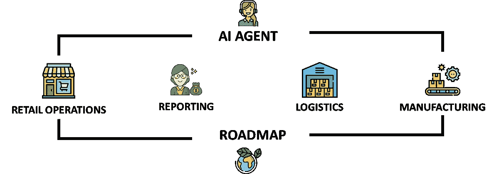

AI 代理助力可持续发展 — (图片由 Samir Saci 提供)

这是我们对如何通过代理式 AI 推动业务数字化转型进行**4 个月探索**的一部分。

一切始于我发现像**n8n**这样的无代码工具，只需几点击就能设计和自动化强大的工作流程。

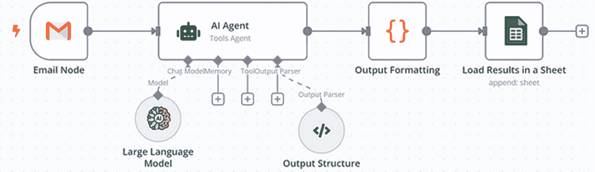

使用 n8n 设计的流程示例 — (图片由 Samir Saci 提供)

我的联合创始人完美地总结了这个机会：

> *“我们需要一种方法来部署简单高效解决方案，以扩展我们的分析和自动化产品。”*

因此，我们开始着手工作。

我们构建了案例研究和原型，以展示这些 AI 代理如何帮助客户加速数字化转型。

今天，用于工作流程自动化的 AI 代理代表了我们的收入超过**60%**。

在这篇文章中，我想分享我们探索之旅的内幕故事以及我们如何将这个机会转化为业务，以便你可以学习复制我们的方法。

远离热门词汇和点击诱饵文章，我们将采取实用主义的方法来解释这些工具如何为业务带来附加价值，而不只是推销梦想。

简而言之，我们将涵盖

+   **我们分享了哪些类型的示例和案例研究**来吸引客户

+   **潜在客户向我们提出的问题** (以及我们如何倾听他们的需求)

+   **我们如何销售这些解决方案** ***(**投资回报率和业务影响)*

如果你一直在想如何将自动化和 AI 代理转化为盈利性服务，这篇文章是开始调查的好灵感。

### 案例研究如何吸引客户

#### 通过实践学习

当我想学习一个新工具时，我会创建**案例研究**。

当 OpenAI 发布了其首个 GPT API 时，我开始探索 LangChain [并在本博客中分享了一个案例研究。](https://towardsdatascience.com/leveraging-llms-with-langchain-for-supply-chain-analytics-a-control-tower-powered-by-gpt-21e19b33b5f0/)

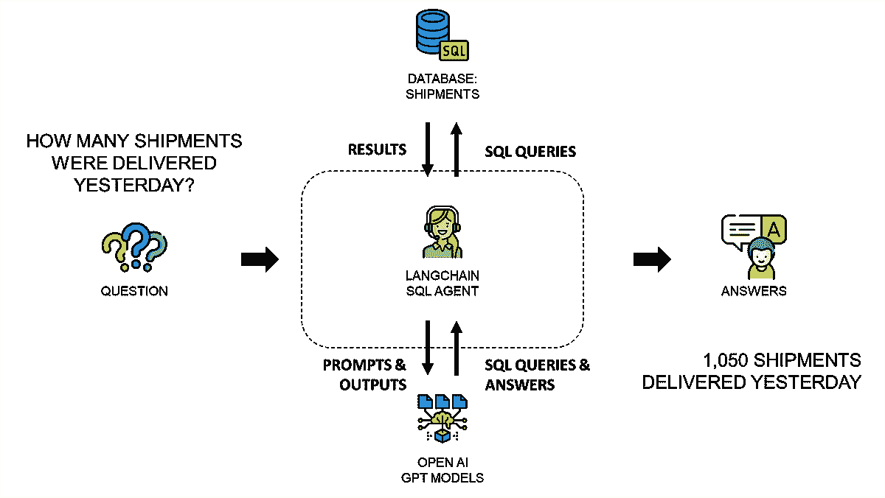

[我用于探索 LangChain 的 2023 年案例研究示例](https://towardsdatascience.com/leveraging-llms-with-langchain-for-supply-chain-analytics-a-control-tower-powered-by-gpt-21e19b33b5f0/) — (图片由 Samir Saci 提供)

这是我将好奇心转化为实际技能的最爱方式。

因此，我的博客包含超过**70 个案例研究**，涵盖了供应链优化、物流成本降低和可持续性分析。

因此，当我发现 n8n 的 AI 驱动的流程自动化时，我**复制了这个经过验证的过程**：

1.  学习工具的基本知识

1.  从我过去进行的多个项目中挑选一个运营或业务问题作为例子。

1.  构建原型并衡量其影响

1.  发布案例研究

我的 n8n 创建者个人资料成为了一个连接业务和运营问题与实际解决方案的游乐场。

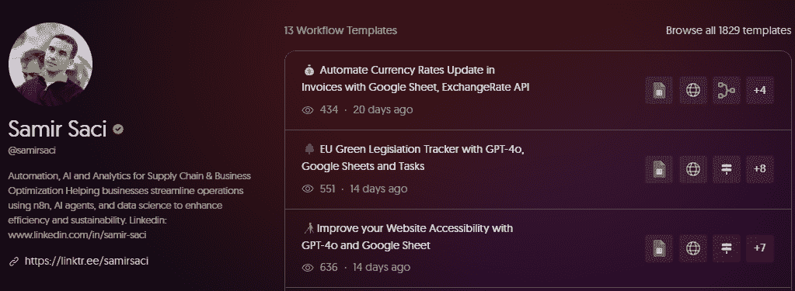

Samir Saci n8n [创建者个人资料](https://n8n.io/creators/samirsaci/)（图片由 Samir Saci 提供）

这种方法磨练了我的技能，并成为吸引寻找解决他们问题实际方案的客户的助推器。

#### 如何选择你的第一个案例研究？

我首先关注我在物流行业 9+年期间看到的**最显著的痛点**——跨越 3PL、快速消费品公司和奢侈品牌。

> 哪些手动流程正在消耗生产力并限制容量？

一个例子来自中国一家时尚公司的**分销运营**。

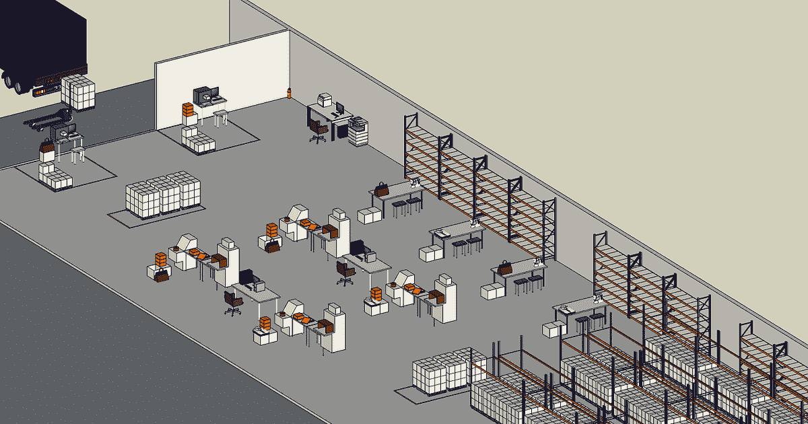

仓库接待区的 CAD 模型（图片由 Samir Saci 提供）

从欧洲运来的托盘在早上由卡车交付。

不幸的是，我们没有通过[电子数据交换（EDI）](https://towardsdatascience.com/what-is-edi-electronic-data-interchange-92f7215bb699#:~:text=Electronic%20Data%20Interchange%20(EDI)%20is,EDI%20%E2%80%93%20(Image%20by%20Author))与供应商连接。

我们必须依赖电子邮件交换来了解我们将收到什么。

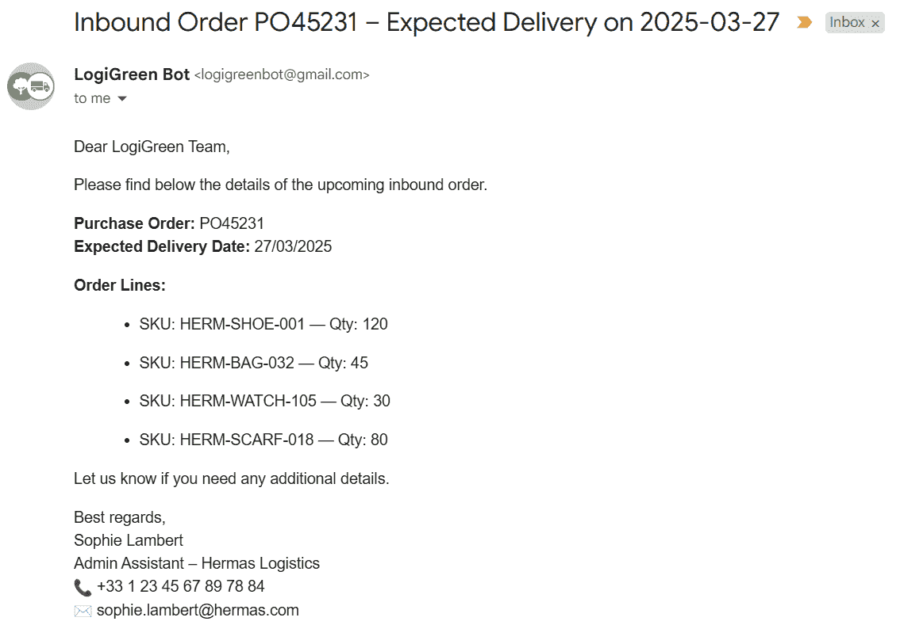

带有订单信息的收到的电子邮件示例（图片由 Samir Saci 提供）

这意味着仓库管理员必须：

+   审查来自客户物流团队的电子邮件。

+   手动将订单详情输入系统（采购订单号、交货日期、SKU ID、数量）

> *这里的痛点是什么？*

这是对接待流程的**瓶颈**。

的确，如果订单没有输入到系统中，进货团队将无法接收托盘。

但更重要的是，这个手动流程**影响了花费时间在无增值任务上的管理员团队的生产力**。

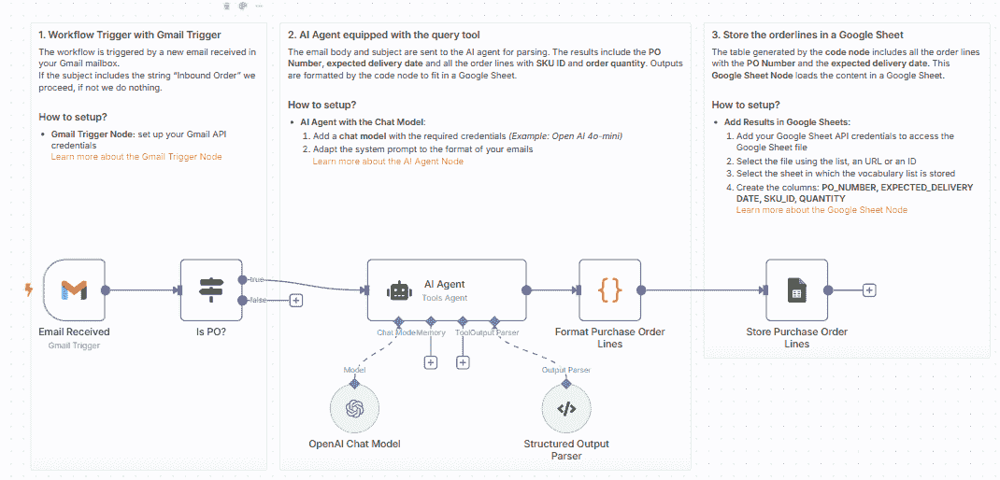

使用 GPT-4o 和 n8n 自动化此流程的工作流程设计（图片由 Samir Saci 提供）

因此，我使用这个例子来构建我的第一个 n8n 自动化。

这是一个简单的与 Gmail 连接的工作流程，它会自动分析所有与进货订单相关的电子邮件。

一个由 GPT 驱动的 AI 节点分析电子邮件内容以提取订单信息。

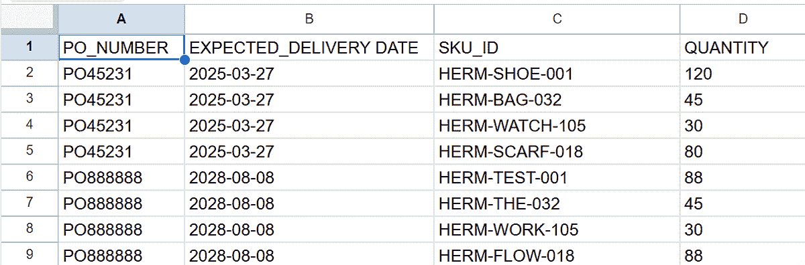

使用虚拟数据输出的示例（图片由 Samir Saci 提供）

输出保存在电子表格中，以便通过脚本加载到系统中。

有关此工作流程的更多信息，请在此处查看完整教程

> 发布此工作流程后发生了什么？

#### 客户带来的问题——以及我们是如何解决的

发布后，来自不同行业和国家的潜在客户开始寻求帮助以解决类似问题。

这是在回答一个常见问题：**系统之间缺乏互连性。**

以前，公司会依赖人工工作来填补差距。

现在，我们可以部署 **AI 代理**来自动化这些桥梁。

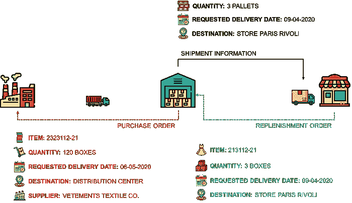

什么是电子数据交换 (EDI) 文章发布在 TDS — (图片由 Samir Saci 提供)

荷兰的一家家具公司联系我们。

他们的价值链的一部分（小型供应商）没有通过 EDI 连接。

因此，他们依赖人工流程来发送和接收订单。

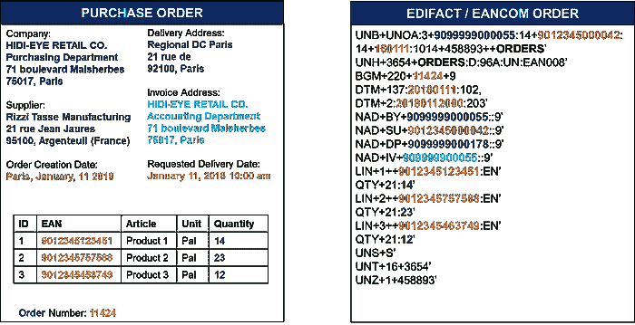

采购订单的电子数据交换消息示例 – (图片由 Samir Saci 提供)

在与他们的 IT 团队进行多次访谈后，我们了解到：

+   系统可以**生成** EDI 消息

+   但他们无法**接收**或处理传入的消息

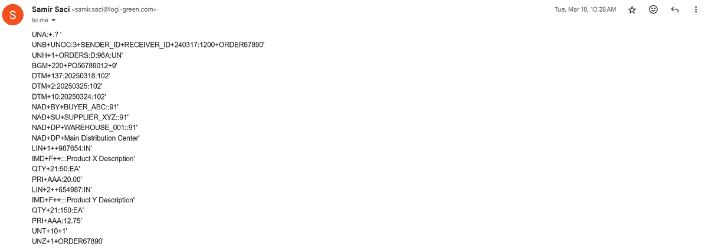

通过电子邮件发送的 EDI 消息示例 – (图片由 Samir Saci 提供)

因此，我们提出了一个**解决方案**

+   发送者会生成 EDI 消息并通过电子邮件发送

+   n8n 工作流程会收集电子邮件，解析内容并保存输出。

我们通过“部分”自动化流程，为客户去除了一个重要的痛点。

在这个例子中，AI 代理提供了巨大的附加价值：将工具调整到 EDI 消息的格式。

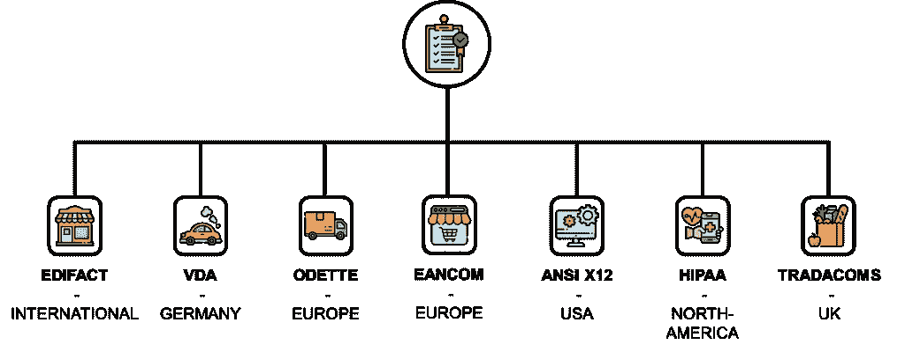

EDI 消息类型的不完整列表 – (图片由 Samir Saci 提供)

这使得工具更加健壮，并能够适应其供应商使用的不同系统。

有关实施此解决方案（附带模板）的更多信息，请查看此教程。

此解决方案具有多个优点：

+   与将家具公司正确连接到每个供应商相比，这更便宜、更容易部署。

+   这提高了数据质量，并允许公司将这些数据输入团队分配给客户服务。

这是我们第一次胜利，也是我们能够通过简单解决方案支持企业的证明。

对于以下项目，我们开发了一个流程来评估客户并标准化解决方案设计。

+   **定义客户面临的问题**

    → *我们需要手动输入从供应商收到的订单。*

+   **找出根本原因**

    → *缺乏电子数据交换 (EDI) 连接*

+   **设计解决方案**

    → *AI 驱动的流程自动化以解析 EDI 消息。*

> 但是，我们如何销售这些解决方案？

我将在下一节中分享我们销售这些自动化解决方案的方法。

### 我们如何销售这些解决方案

在构建和测试这些自动化原型之后，下一个挑战清晰：**我们如何定位和向客户销售这些解决方案？**

考虑到我们的大部分潜在客户都来自我的内容（[Towards Data Science](https://towardsdatascience.com/author/s-saci95/)，[YouTube](https://www.youtube.com/@SupplyScience)，[n8n Creator Page](https://n8n.io/creators/samirsaci/)），我们开发了**三种适应潜在客户需求的销售方法**。

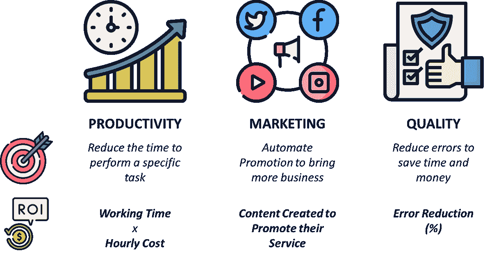

我们的销售方法——适应潜在客户的需求——(Samir Saci 的图片)

理念是将销售演讲调整为清晰的业务成果和投资回报率（ROI）。

#### 方法 1：自动化以提高生产力

这是我们客户的主要关注点。

他们受到压力，需要通过提高操作员和行政团队的生产力来降低成本。

> 潜在客户：“使用我们的人工处理流程，客户服务管理员每小时可以处理 6 个订单。使用 AI 你能处理多少订单？”

当我们遇到与生产力相关的客户案例时，我们将我们的问题集中在：

+   **定义当前的工作流程**，包括每个步骤的详细描述（数据输入，输出，使用的系统）

+   **估算当前的生产力**（每小时的动作数量）和劳动力成本（$/小时）

例如，一家专注于 ESG 咨询的代理机构向我们寻求帮助，以帮助他们**自动化他们的可持续性法规监控流程**。

他们要求他们的高技能（高时薪）ESG 分析师**审查欧洲议会的活动报告**并选择那些与可持续性相关的报告。

> 潜在客户：“我们希望这些分析师专注于更高附加值的工作。”

我们开发了一个工作流程，使用 AI 代理完全自动化这个过程，提供高投资回报率。

> 投资回报率 = 节省的时间 × 分析师的小时费率

这个简单的计算对于说服决策者投资资源并实施自动化是至关重要的。

> 对我们的潜在客户说：“这个解决方案将为您每月节省 XXX 欧元，您将在 YYY 个月内收回投资。”

有关此工作流程的更多信息，请查看完整的教程

对于一些潜在客户，优先考虑的是带来更多业务；我们也可以使用 AI。

#### 方法 2：自动化营销和推广

在我的初创公司[LogiGreen](https://logi-green.com)中，我们是这种工作流程的第一批用户。

作为一个小型结构，我们没有足够的资金来招聘一个完整的营销和商业团队。

> 我们如何构建一个自动化的内容分发机器来增加我们的覆盖范围？

因此，我们**依赖自动化来推动我们的业务**——这是一种创造或整理引人入胜内容的好方法。

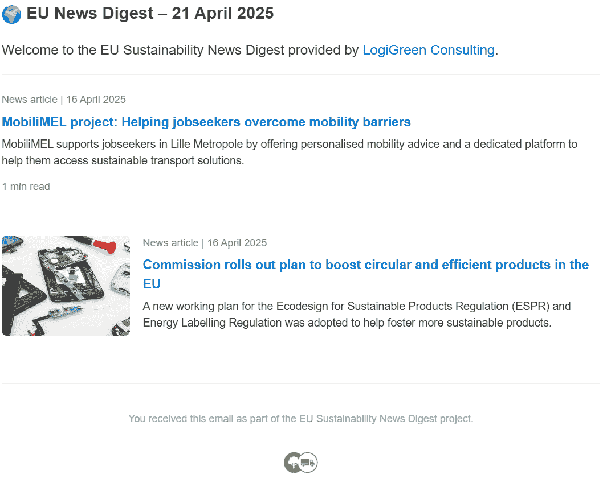

自动化示例：可持续性通讯——(Samir Saci 的图片)

上面的截图来自我们完全自动化的通讯生成的电子邮件。

+   你可以在页眉和页脚中找到我们网站的链接。

+   分发名单包括所有我们的客户和潜在客户。

我们使用 n8n 与 GPT-4o 自动化这个解决方案。

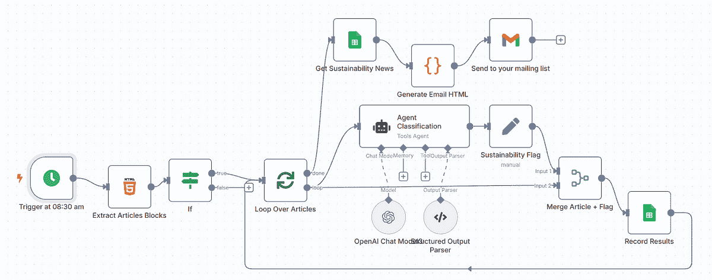

AI-Powered Workflow Automation — (图片由 Samir Saci 提供)

这个简单的流程使用**分类代理**从多个来源（欧盟新闻、专业期刊、社交媒体）整理与可持续性相关的文章列表。

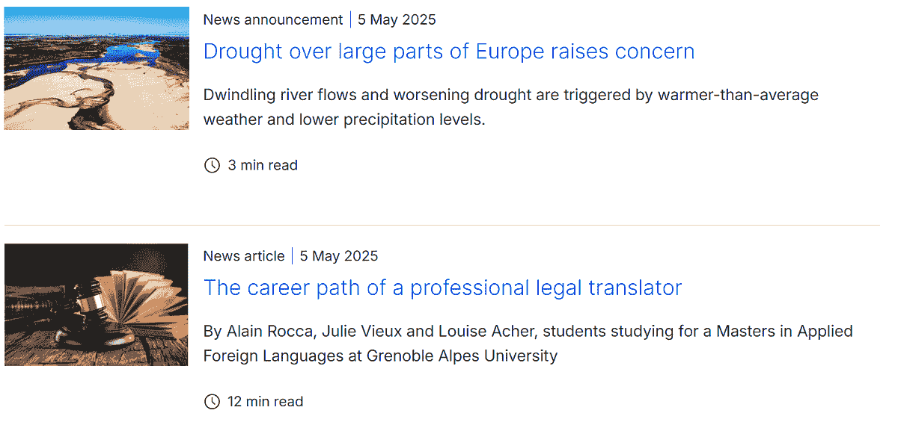

可在此新闻通讯中分享的文章示例 – (图片由 Samir Saci 提供)

AI 代理根据其系统提示中的说明处理编辑选择。

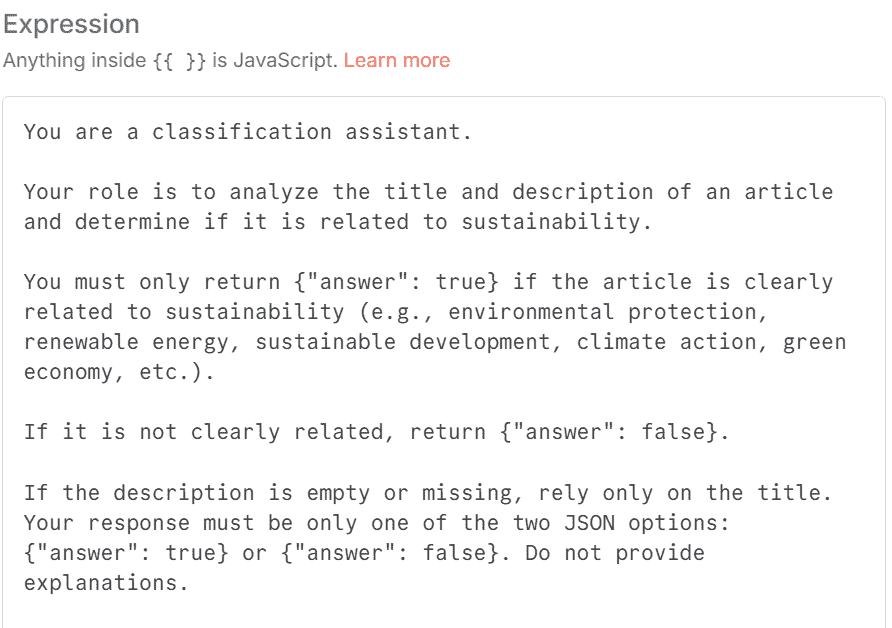

用于文章编纂的系统提示示例 – (图片由 Samir Saci 提供)

这是我们创建在线社区、保持客户关注并分享吸引人内容的好方法。

> 致我们的潜在客户：“有了这个内容创作机器，您可以在您的业务周围占据空间，提供价值，并创建一个在线社区。”

我们现在正在向我们的潜在客户销售这款“内容创作机器”！

想了解更多关于这个“自动化新闻通讯”的信息，请查看下面的视频

一些与我们联系的客户表示，他们的首要任务不仅仅是生产效率或市场营销。

#### 方法 3：自动化以提高质量和减少错误

**他们必须确保质量并减少错误**，尤其是在关键报告和合规流程中。

例如，越来越多的公司需要遵守**企业可持续发展报告指令 (CSRD**)。

这需要以机器可读的 XHTML 格式发布 ESG 披露信息，并嵌入 XBRL 标签。

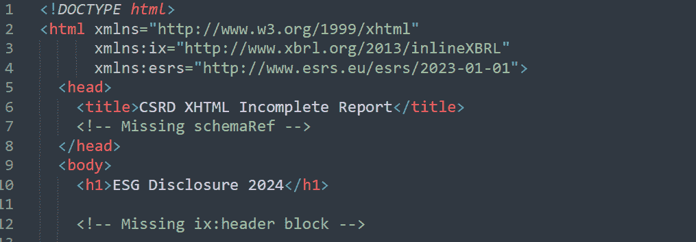

CSRD 报告的 XHTML 代码块示例 – (图片由 Samir Saci 提供)

这些报告必须满足**严格的格式和合规标准**，才能被监管机构接受。

> 潜在客户：“我们在正确格式化报告方面存在问题。”

为了支持这一前景，我们开发了一个**n8n 工作流程**，帮助可持续性团队和 ESG 咨询师自动审计这些报告。

他们的分析师必须将报告草案发送到特定的地址。

附件被下载，其内容被分析以查找缺失值和格式错误。

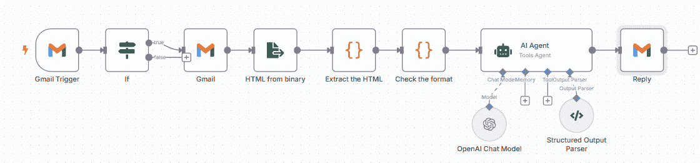

工作流程简化版 – (图片由 Samir Saci 提供)

审计结果发送给一个 AI 代理，该代理将用通俗易懂的语言解释报告中的错误。

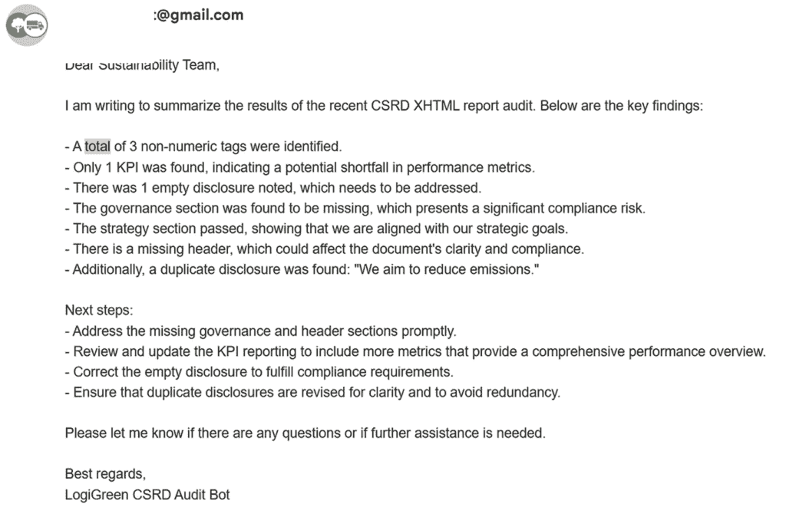

AI 代理生成的审计报告示例 – (图片由 Samir Saci 提供)

我们将这款产品定位为**减少错误以节省时间和金钱**。

> 在拥有这个工具之前，他们依赖第三方公司检查他们的报告。

通过自动化审计流程，公司可以实现：

+   避免昂贵的报告错误

+   降低违规风险

+   加快报告的周转时间

+   释放专家资源，专注于分析而非格式化。

这里的投资回报来自于最小化**返工成本和延迟**，同时提高报告数据的可靠性。

想了解更多关于这个自动化的细节，请查看这个教程（包括 n8n 模板）

您会发现，这个审计工具的核心模块仍然使用确定性代码（为了可靠性）。

然而，人工智能通过提供简单的英文解释来改善用户体验。

> 对我们的潜在客户说：“您不需要是 XHTML 专家就能纠正报告。”

我们向我们的客户销售的是：人工智能为任何公司提供先进的**分析即服务**能力。

### 结论

在过去的几个月里，我们将自动化从**个人探索**转变为一个有潜力的商业提案。

通过关注三种关键方法——**提高生产力、提升营销覆盖范围和确保质量**——我们帮助各行业的公司解决实际问题，节省时间并增加其影响力。

> 我们不通过 AGI 取代他们的整个供应链部门来销售梦想。

这里的机会是巨大的。

企业寻求能够弥合运营挑战与自动化解决方案之间差距的人。

**如果您对开始自动化之旅感兴趣，我将在本博客中提供频繁的更新。** 

如果您想为您的业务实施这些解决方案，请随时通过 LinkedIn 与我联系。

### 关于我

让我们在[LinkedIn](https://www.linkedin.com/in/samir-saci/)和[Twitter](https://twitter.com/Samir_Saci_)上建立联系；我是一名供应链工程师，利用数据分析来改善物流运营并降低成本。

对于关于分析和可持续供应链转型的咨询或建议，请随时通过[Logigreen Consulting](https://www.logi-green.com/)联系我。

[**萨米尔·萨奇 | 数据科学 & 生产力**]

*一个专注于数据科学、个人生产力、自动化、运筹学和可持续性的技术博客*samirsaci.com](https://samirsaci.com/)
