# 我如何使用 AWS 完全无服务器构建实时天气数据管道

> 原文：[`towardsdatascience.com/how-i-built-a-real-time-weather-data-pipeline-using-aws-entirely-serverless-12ddbca19289/`](https://towardsdatascience.com/how-i-built-a-real-time-weather-data-pipeline-using-aws-entirely-serverless-12ddbca19289/)

图片由 Brett Sayles 提供：[`www.pexels.com/photo/clouds-1431822/`](https://www.pexels.com/photo/clouds-1431822/)

### 目录

∘ 简介 ∘ 数据 ∘ 提出的工作流程 ∘ AWS 云组件 ∘ 收集数据（Lambda 函数 1） ∘ 将数据写入表（Lambda 函数 2） ∘ 将数据转换为 CSV 格式（Lambda 函数 3） ∘ 最终的 AWS 云解决方案 ∘ 可视化数据（额外） ∘ 优势 ∘ 局限性 ∘ 结论

* * *

### 简介

几个月前，我参与了一个项目，该项目[我构建了一个太阳能发电预测模型](https://medium.com/towards-data-science/forecasting-germanys-solar-energy-production-a-practical-approach-with-prophet-717aa23ecd58)，旨在帮助德国向清洁能源转型。结果很有希望，但模型的性能受到一个关键因素的制约：缺乏天气数据，这是可用太阳能的强烈指标。

这次经历强调了关键教训——实时数据对于实用的预测模型至关重要。然而，收集此类数据需要强大的数据工程解决方案。

在这里，我提出一个利用 AWS 构建高性能和可扩展的数据管道以进行实时数据收集的工作流程。这里应用的工具和技术也可以应用于其他实时分析挑战。

* * *

### 数据

管道使用[OpenWeatherMap](https://openweathermap.org/)检索其数据，这是一个在线服务，为世界各地的位置提供预报和 nowcast。

OpenWeatherMap 提供了一个 API，该 API 允许快速轻松地访问天气数据。API 每 10 分钟更新一次 nowcast，这意味着给定位置的请求数据将以相同的频率运行。

为了简化，数据的范围仅限于德国柏林的天气。

* * *

### 提出的工作流程

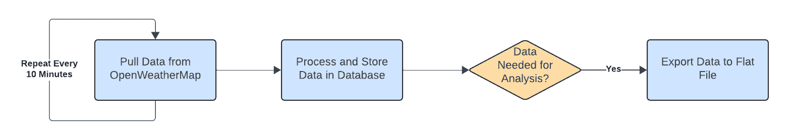

工作流程（由作者创建）

数据收集工作流程旨在实时更新数据库中的天气数据。由于 OpenWeatherMap API 每 10 分钟更新一次，API 调用也以相同的频率进行，响应立即存储在数据库中。

当需要下游任务（例如，可视化、机器学习）中的数据时，它会读取数据，将其转换为表格格式，并导出为平面文件。

> 注意：以下部分深入探讨了实现工作流程所使用的单个 AWS 服务，包括配置（例如，代码、逻辑）以使它们按需工作。如果您想跳过到最终解决方案和讨论，请点击此处。

* * *

### AWS 云组件

工作流程利用以下 AWS 组件来确保高效的数据收集、处理和存储：

1.  **AWS DynamoDB**

AWS DynamoDB 提供了存储 API 响应所需的 NoSQL 数据库，这些响应为半结构化格式。项目创建了一个名为 `WeatherData` 的 DynamoDB 表来满足此目的。

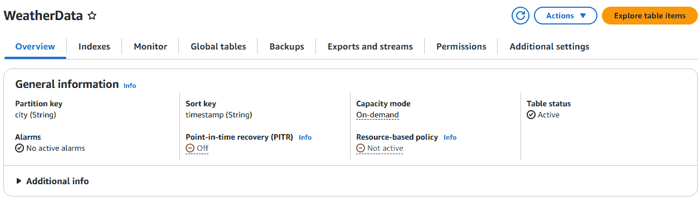

DynamoDB 表（由作者创建）

该表使用 `city` 作为分区键，使用 `timestamp` 作为排序键。这种安排允许通过地点和时间有效地查询数据。

**2. Amazon S3**

该项目使用名为 `[owm-data-bucket](https://us-east-1.console.aws.amazon.com/s3/buckets/owm-data-bucket?region=us-east-1)` 的 S3 存储桶来存储项目过程中使用的文件对象。

**3. AWS Kinesis**

管道利用 Amazon Kinesis 创建一个名为 `WeatherDataStream` 的数据流，作为 lambda 函数和 DynamoDB 表之间的中介。

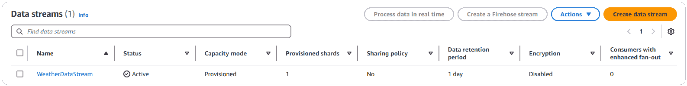

Kinesis 数据流（由作者创建）

**4. Lambda 函数**

工作流程依赖于 3 个 lambda 函数来执行数据收集和转换任务。

第一个名为 `fetch_data` 的 lambda 函数使用 OpenWeatherMap API 拉取数据并将其发送到 Kinesis 流。它由 EventBridge 规则每 10 分钟触发一次。

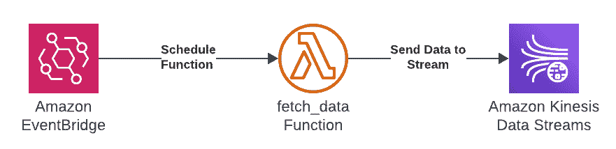

fetch_data 函数（由作者创建）

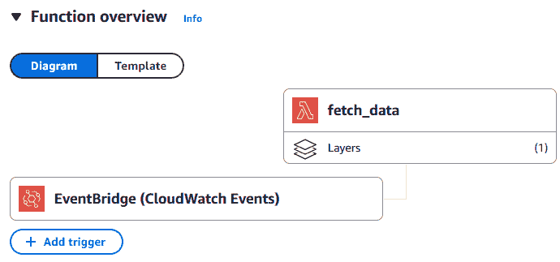

fetch_data 函数概述（由作者创建）

第二个 lambda 函数，名为 `write_to_ddb`，从 Kinesis 流中读取数据并将其写入 `WeatherData` 表。它在新数据添加到流后立即运行。

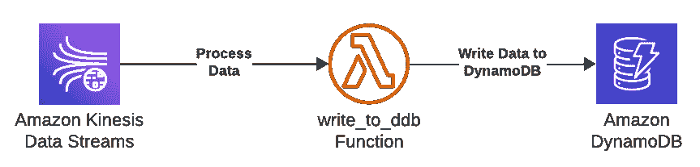

write_to_ddb 函数（由作者创建）

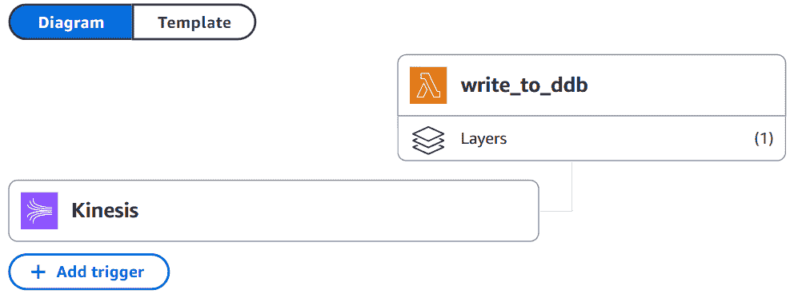

write_to_ddb 函数概述（由作者创建）

第三个 lambda 函数，名为 `send_data_to_s3`，从 DynamoDB 表中读取数据并将其作为 CSV 文件导出到 `owm-bucket` 存储桶。与前两个函数不同，此函数没有触发器，按需运行。

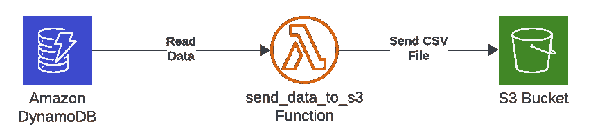

send_data_to_s3 函数（由作者创建）

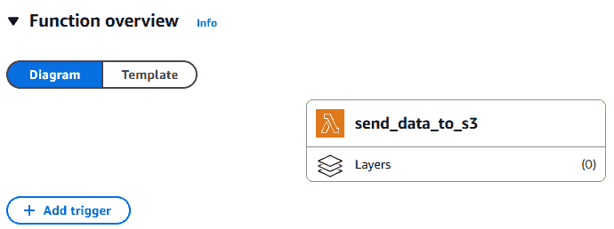

send_data_to_s3 函数概述（由作者创建）

**5. AWS Eventbridge**

AWS Eventbridge 创建了一个计划，每 10 分钟自动执行`fetch_data`函数。

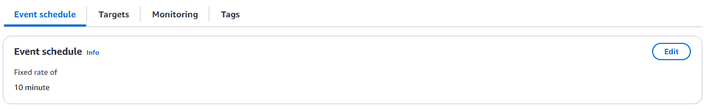

事件计划（由作者创建）

接下来的几节将重点介绍每个 Lambda 函数使用的代码和逻辑。

* * *

### 收集数据（Lambda 函数 1）

下面展示了`fetch_data`函数的代码：

简而言之，该函数使用`pyowm`库访问柏林的新播数据，并使用`boto3`库将数据推送到 Kinesis 流。我手动创建时间戳变量，记录程序执行的时间。

* * *

### 将数据写入表（Lambda 函数 2）

下面展示了`write_to_ddb`函数的代码：

这两个函数简化了数据提取和数据库写入操作。运行它们每 10 分钟一次后，记录现在在 DynamoDB 的`WeatherData`表中可见。

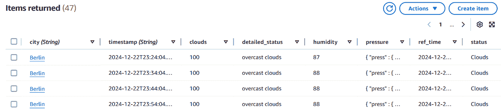

DynamoDB 中的 WeatherData 表（由作者创建）

* * *

### 将数据转换为 CSV 格式（Lambda 函数 3）

`send_data_to_s3`函数读取 WeatherData 表中的所有数据，将其扁平化，并将其作为 CSV 文件保存到 S3 存储桶中。

与前两个 lambda 函数不同，这个函数是按需运行的（即，每当需要表格数据进行分析时）。以下是检索自存储桶的输出平文件的截图。

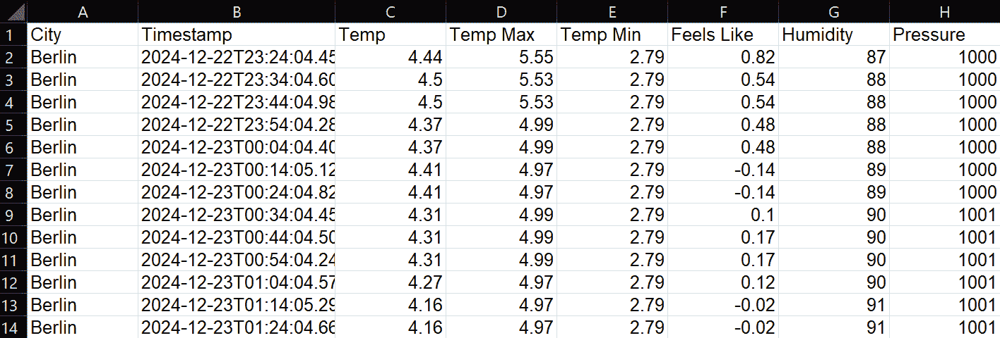

CSV 文件（由作者创建）

* * *

### 最终的 AWS 云解决方案

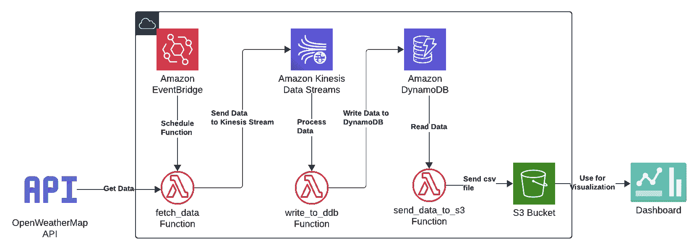

AWS 架构（由作者创建）

上面的图示展示了单个 AWS 服务如何相互交互以驱动天气数据管道。

第一个 lambda 函数，由 Eventbridge 计划每 10 分钟运行一次，通过 API 从 OpenWeatherMap 收集数据，并将其发送到 Kinesis 流。第二个 lambda 函数（在流中添加新数据时触发）从流中获取 API 响应，并将它们写入 DynamoDB 表。第三个函数（按用户需求运行）读取和整理数据库中的数据，然后将输出存储在存储桶中作为平文件。该文件可用于后续的分析或可视化。

* * *

### 数据可视化（额外内容）

我使用上面创建的平文件构建了一个 Tableau 仪表板来跟踪柏林的天气。为了简化起见，我将我的可视化限制在几个指标上：

+   随时间变化的温度

+   平均云覆盖率%

+   每日日照平均持续时间

+   平均风速

下面是显示这些指标的一种方法：

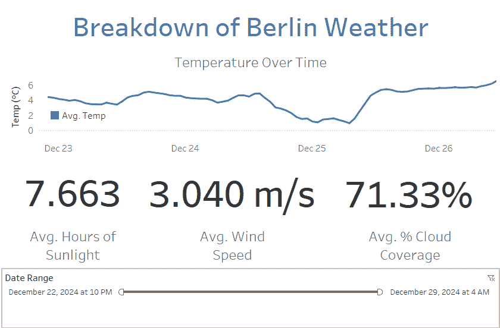

仪表板（由作者创建）

这里是仪表板的链接，供有兴趣的人查看：[`public.tableau.com/views/BerlinWeatherTracker/Dashboard1?:language=en-US&publish=yes&:sid=&:redirect=auth&:display_count=n&:origin=viz_share_link`](https://public.tableau.com/views/BerlinWeatherTracker/Dashboard1?:language=en-US&publish=yes&:sid=&:redirect=auth&:display_count=n&:origin=viz_share_link)

* * *

### 解决方案的优势

利用 AWS 解决方案使我能够创建一个高性能、具有弹性的实时数据收集管道。以下是该设置的主要优势之一。

> 注意：该项目仅关注德国柏林的数据收集。然而，我根据其将数据收集扩展到德国每个城市（总计约 2000 个城市）的能力来评估该解决方案。

1.  **实时数据收集**

Lambda 函数可以处理 API 调用的数量（每 10 分钟约 2000 次调用），确保在德国的持续、实时收集。

**2. 无服务器架构**

当前解决方案完全无服务器，这意味着用户无需手动创建或管理资源以适应流量增加。Lambda 函数可以自动扩展以处理流量，而 DynamoDB 表可以自动调整其读取吞吐量。

**3. 容错性**

使用 Kinesis 流作为中间层确保在数据库停机期间数据不会丢失，从而最小化数据损失。

* * *

### 解决方案的局限性

尽管实时数据收集解决方案效果良好，但由于其局限性，我可能会犹豫将其推荐给客户。以下是我认为突出的几个问题：

1.  **依赖 OpenWeatherMap**

该解决方案完全依赖于 OpenWeatherMap API，使其成为单点故障。任何如 API 速率限制和故障等问题都可能中断整个数据收集过程。

**2. 成本**

虽然该解决方案仅提供必要的资源，但像 Lambda、Kinesis 和 DynamoDB 这样的服务每次使用都会收费。在大规模数据收集时，成本会呈指数级增长，可能使该解决方案不可行。

该项目（即仅收集柏林的数据）每天的成本约为 50 美分。因此，将数据收集扩展到每个德国城市（约 2000 个城市）每天的成本将高达数百美元。

**3. 历史数据有限**

该解决方案仅收集短期预报，使得需要历史数据的分析变得不可能。一个可能的解决方案是建立一个第二管道，从 OpenWeatherMap 收集所有历史天气记录。

* * *

### 结论

图片由[Alexas_Fotos](https://unsplash.com/@alexas_fotos?utm_source=medium&utm_medium=referral)在[Unsplash](https://unsplash.com?utm_source=medium&utm_medium=referral)提供。

我之前的项目主要关注通过预测算法来处理太阳能预测。然而，这个当前项目加深了我对数据工程在预测应用中扮演的关键角色的认识。对于像太阳能发电这样对时间敏感的使用案例，实时数据收集和处理是必不可少的。

如果您有任何改进此解决方案性能或降低成本的想法，请随时分享！

您可以通过以下链接访问包含 lambda 函数的存储库：

[anair123/Berlin-Real-Time-Weather-Data-Collection-With-AWS](https://github.com/anair123/Berlin-Real-Time-Weather-Data-Collection-With-AWS)

此外，如果您对这个启发本项目的能源预测项目感兴趣，您可以通过以下链接查看：

[通过 Prophet 实现德国太阳能发电预测：一种实用方法 | 作者：Aashish Nair | 数据科学向导](https://medium.com/towards-data-science/forecasting-germanys-solar-energy-production-a-practical-approach-with-prophet-717aa23ecd58)

感谢您的阅读！
